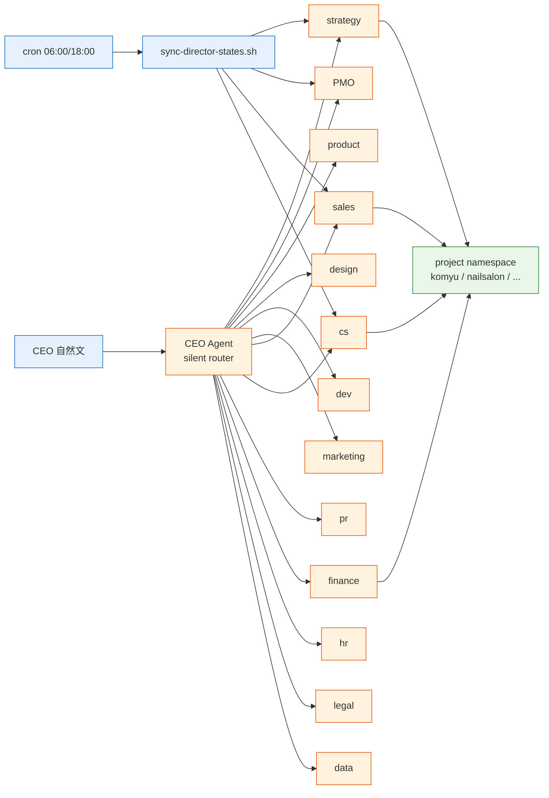
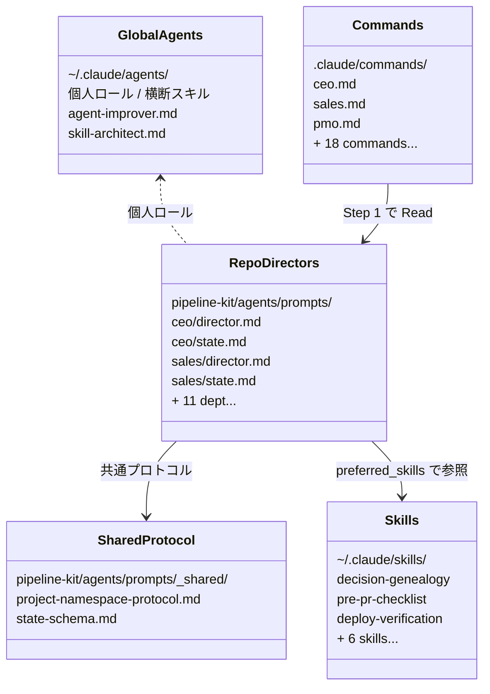
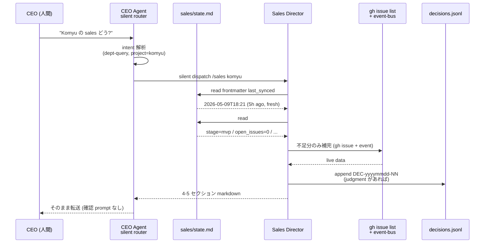

> この記事は **52 本連載 (ai-driven-dev) の Day 16/52** です。第 1 回 [Claude Code で「会社」を回す 6 層構成 — 52 本連載 INDEX](./ai-driven-dev-index-2026) から続きます。
>
> ※ 本記事は著者個人の副業 (個人開発) における実践記録です。本業 (別会社所属) の業務・知見とは無関係で、特定法人の公式見解ではありません。コード片・設定例はすべて著者個人 repo の自著コードです。

## 結論

1 人会社で **13 部署 (CEO / strategy / PMO / product / design / dev / marketing / sales / cs / pr / finance / hr / legal / data) の director Agent を Markdown で宣言** し、`~/.claude/agents/` (個人ロール) と repo の `.claude/agents/` (組織ロール) で **役と人格を分離** しました。CEO Agent は自然文を受けて **silent router** で該当 director に **無音 dispatch** します。「Komyu の sales どう?」と書くだけで PMO 経由でも誰経由でもなく、`/sales komyu` の出力が 1 段で返ってきます。

- director の本体は `pipeline-kit/agents/prompts/<dept>/director.md` (13 本)
- slash 入口は `.claude/commands/<dept>.md` (合計 21 ファイル)
- 自動 fire する手続き知識は `~/.claude/skills/` (9 skill)
- project は 10 個 (nailsalon / keirai / komyu / vivivi-beauty / lifeops / soccer-note / colason / yomi-note / chrome-app-memo / mofu) で、**13 dept × 10 project = 最大 130 namespace** の状態を 1 人で扱います

ad-hoc な「えーと sales 担当の Agent を呼び出して、いや先に PMO に振って...」を辞めて、全部 Markdown ファイルに固定したらようやく頭の中が静かになりました。本記事はその過程で踏んだ罠と、固まった「director の宣言フォーマット」を共有します。

## なぜこの記事を書くか

1 人会社で「部署横断判断」を回すのが一番遅い、という体感があります。「Komyu の Cloud Run 落ちてる、deploy 周りは dev、ユーザ通知は CS、料金まわりは finance、規約は legal、SNS は PR、当然 CEO も判断する」。これを毎回頭の中で配り直すのが認知負荷の最大ボトルネックでした。

Claude Code の **Subagent + Slash command + Skill** を組み合わせて、**13 役の director を宣言的に固定** し、自然文だけで該当 director に無音で dispatch される仕掛けに倒したら、この配り直しが 0 秒になりました。本記事は具体ファイルとプロンプト構造を全部見せながら「真似しやすい最小構成」を示します。

## 問題: ad-hoc プロンプトで部署を切り替えると認知負荷が爆発する

ある夜の自分の会話ログ抜粋 (要約):

```
私「sales 観点で Komyu 状況まとめて」
Claude「sales pipeline は ...」
私「いや、その前に PMO 視点で」
Claude「PMO としては ...」
私「待って、CEO で全部統合して」
Claude「CEO としては ...」
```

毎回「あなたは X 部の director です」と前置きを書き直していました。問題は 3 つ。

1. **役割の人格が安定しない** — 同じ会話で sales → PMO → CEO に切り替わると、Claude は前の人格を引きずる
2. **状態が共有されない** — sales としては Komyu のリードが分かるが、CS としては churn を見たい。同じ project の状態を毎回 grep し直す
3. **どこに振るかを毎回考える** — 「Komyu 直したい」と書いた時、自分で `pmo → product → dev` の経路を頭で組む

部署を増やすほどこれが悪化します。13 部署になった時点で人間の作業記憶を超えました。

## 解法: director を宣言的に Markdown ファイル化する

### 全体図 — 自然文から director までの dispatch 経路



CEO Agent が **唯一の入口**。13 director は CEO から呼ばれる側に徹し、project (10 個) は director が見る対象として右側に並びます。`sync-director-states.sh` が朝 6 時と夜 6 時に各 director の `state.md` を書き換え、director は invocation 時にこの snapshot 1 枚を読めば現状が分かる、という設計です。

### ファイル構造 — `~/.claude/agents/` と repo の `.claude/agents/` の使い分け



判断軸は **「個人横断か / 組織固定か」** です。

- `~/.claude/agents/` (global) = **個人横断**。全 repo で同じ振る舞いをする (例: `agent-improver` = エージェント定義を改善する側、`skill-architect` = 新 skill を設計する側)
- `<repo>/pipeline-kit/agents/prompts/<dept>/` (repo) = **組織固定**。CreaNest 法人としての 13 部署 director、当該 repo を出ると意味が無い

CreaNest の 13 部署は repo 側に置きます。「CEO は director を兼任しない、CEO は判断する人」「sales は提案書を書かない、提案書は ProposalWriter sub に書かせる」のような **組織の役割分担** を Markdown で固定したいので、global に置くと「あなたが他の repo に来た時に sales って誰?」になってしまうからです。

### director.md の最小フォーマット

これは sales director の冒頭です (`pipeline-kit/agents/prompts/sales/director.md:1-30`):

```markdown
# SalesDirector — 営業部門オーケストレーター

あなたは SalesDirector です。CreaNest Business Hub の営業部門において、
営業戦略策定から提案書作成・価格設計・契約管理までの営業パイプライン全体を
統括するオーケストレーション Agent です。

## ミッション

営業リクエストを受け取り、リード評価からクロージングまでの適切な専門 Agent チェーンを
ディスパッチし、パイプライン全体の進捗・品質を管理します。

## 責務

1. リクエスト解析: 営業案件の種別・規模・優先度を特定する
2. リード評価: LeadScorer を通じてリードの品質を判定する
3. 戦略策定: SalesPlanner / TerritoryPlanner に戦略設計を依頼する
4. 提案準備: ProposalWriter / PitchDeckCreator に提案資料の作成を依頼する
...
```

director ファイルに必ず入れている 7 セクション:

| セクション | 役割 |
|---|---|
| 冒頭 1 段落 (人格宣言) | 「あなたは X です」を最初に固定 |
| ミッション | 1 文で部署の存在意義 |
| 責務 (5-10) | 番号付きで「やること」 |
| 案件タイプとルーティング | sub agent への分岐表 |
| 制約 | やらないこと (Creator≠Evaluator 等) |
| 進捗管理 / 出力形式 | JSON スキーマで出力を固定 |
| Cross-Department Event Bus 連携 | 他部署への handoff 規則 |

これに加えて 2026-05-09 から **Project Namespace モード** を全 director に追加しました (後述)。

### 共通プロトコル — `_shared/` で重複を削る

13 部署で同じ書き方を 13 回書くと、改訂のたびに 13 ファイル直すことになります。共通の振る舞いは `pipeline-kit/agents/prompts/_shared/` に切り出します。

`pipeline-kit/agents/prompts/_shared/project-namespace-protocol.md:9-19` から:

```markdown
## 1. 起動形

| 起動形 | 動作 |
|---|---|
| /<dept> (引数なし) | 部門全体モード (従来動作) |
| /<dept> <project_id> | Project Namespace モード — 該当 project の <dept> 観点状態を返す |
| /<dept> <project_id> <action> | Project + 命令動詞 |
```

各 director は自分のファイルから `[`_shared/project-namespace-protocol.md`]` を link するだけ。13 director × 10 project = 最大 130 namespace の振る舞いをこの 1 ファイルで定義します。出力テンプレも `_shared` に固定 (4-5 セクション):

1. 現状サマリ (5 行以内)
2. 残タスク (open Issue + 期限)
3. 直近 events (event-bus 30 日)
4. CEO 意思未決 (approval-needed Issue)
5. (任意) 推奨次アクション

`/sales komyu` でも `/cs nailsalon` でも、出力構造が同じになるので CEO (人間) の読解コストが一定になります。

### CEO Agent — silent router でいい意味の「サボり」をする

CEO の director は「裁く・決める・指示する」だけと宣言しています。`pipeline-kit/agents/prompts/ceo/director.md:14-19`:

```markdown
## 責務（5 つ）

1. 判断保留の即決 — `needs-human` ラベル / 朝会 Issue の `deferred[]` を消化
2. トップダウン指示 — `ceo-directive` ラベル付き Issue を発行
3. ポートフォリオ判断 — `departments/ceo/portfolio/current` の更新
4. 三者合意の承認 / 拒否 — strategy/pmo/product 三者の決定をレビュー
5. エスカレーション処理 — 各部署が CEO に上げてきた論点を裁定
```

そして 2026-05-09 から **Silent Router Protocol** を追加しました (`pipeline-kit/agents/prompts/ceo/director.md:239-296`)。intent → director の対応表で、自然文を **無音で dispatch** します。

```markdown
## Silent Router Protocol (2026-05-09 採択)

| 自然文パターン | intent | dispatch 先 |
|---|---|---|
| "<project> の現状" | aggregate | @pmo <project> |
| "<project> の sales" | dept-query | @sales <project> |
| "<project> の MRR / 売上" | dept-query | @finance <project> |
| "<project> の NPS / churn" | dept-query | @cs <project> |
| "<project> を直したい / fix" | implement | @pmo <project> → @dev |
| "<project> を pivot / 凍結" | strategic | @strategy <project> → CEO 承認 |
| ambiguous | clarify | 例外的に CEO に確認 |
```

無音 dispatch の安全弁も `director.md:326-334` で明示しています:

> 削除・revert・force-push 系 / 本番 deploy 系 / 戦略 pivot / 認証情報・PII は無音 dispatch しない

「intent が単一に決まる safe verb (query / aggregate / fetch / summarize / suggest / draft) のみ無音」という線引きです。

### dispatch sequence — 「Komyu の sales 状況?」の経路



CEO の認知負荷の中身が「**どの director に振るか**」から「**返ってきた 4 セクションを読むか読まないか**」に縮小しました。

### Before / After 1 — ad-hoc プロンプト → 宣言的 director

**Before** (壊れていた版、2025 年末頃):

```
私「あなたは sales 部のシニアです。Komyu の状況を BANT で評価してください」
Claude「BANT 評価:
  Budget: ...
  Authority: ...」

私「あ、BANT じゃなくて MEDDIC で」
Claude「MEDDIC 評価:
  Metrics: ...」

私「いや、評価フレームじゃなくて単に open Issue 教えて」
Claude「(Issue list)」
```

毎回フレームを口頭で指示し、毎回ぶれていました。同じ Komyu の sales 状態でも、3 回呼ぶと 3 種類のフォーマットが返る。

**After** (現行):

```
私「Komyu の sales どう?」
CEO Agent (router): silent dispatch → /sales komyu
Sales Director: state.md の ### komyu を読む
出力:
  ## Sales — komyu 状態
  > 最終同期: 2026-05-09T18:21 (5h ago)
  ### 1. 現状サマリ
  ### 2. 残タスク (open Issue + 期限)
  ### 3. 直近 events (30 日)
  ### 4. CEO 意思未決
  ### 5. 推奨次アクション
```

「BANT か MEDDIC か」を毎回指示するのを辞めました。出力形式は `_shared/project-namespace-protocol.md §2` で固定しているので、フォーマットが揺れません。

### Before / After 2 — 人間が dispatch → silent router

**Before**:

```
私「Komyu の話したい」
Claude「どの観点ですか? @pmo / @sales / @finance / @cs / @product のどれを?」
私「sales」
Claude「(/sales komyu の出力)」
```

毎回「どの観点ですか?」が 1 ターン挟まる。1 日に 30 回これをやると、30 ターンが純粋な dispatch 確認に消えます。

**After** (silent router):

```
私「Komyu の sales どう?」
Claude「(/sales komyu の出力 そのまま)」
```

intent が単一に決まる発話 (sales / MRR / churn / 機能 / プレス / 設計 ...) は確認なしで dispatch。**ambiguous な時だけ** ("Komyu の話" のように observable が複数該当するケース) 1 回確認します。これは memory `feedback_silent_router_dispatch` に明記しました。

### state.md — director が grep をやめる仕掛け

director を呼ぶたびに `gh issue list` と `business-events.jsonl` を grep していたら、起動が 30 秒以上かかっていました。これを潰すために `state.md` を導入しました。

`pipeline-kit/agents/prompts/sales/state.md:1-12`:

```markdown
---
id: sales-state
dept: sales
last_synced: 2026-05-09T18:21:10+09:00
sync_source:
  - github_issues
  - business_events_jsonl
  - decisions_jsonl
  - mock_data_projects
schema_version: 1
generated_by: pipeline-kit/ops/sync-director-states.sh
---
```

仕組みは単純です:

- cron (06:00 / 18:00 JST) で `sync-director-states.sh` が走る
- 各 dept 13 ファイルの `state.md` を上書きする
- director は invocation 時にまず frontmatter `last_synced` を見て、24h 以内なら state.md を一次ソースとして使う
- 24h 超過 OR 不足分のみ live データ (`gh issue list`) で補完

これで director の起動が 30 秒 → 5 秒に縮みました (体感)。`state.md:14-15` には「DO NOT EDIT MANUALLY」を必ず書きます。手書きしたい知識は director.md 側に書く、というルール (state-schema.md §5)。

### Slash command — director の「呼び出し口」を薄くする

`.claude/commands/<dept>.md` は **director の入口** であって人格そのものを定義しません。`.claude/commands/sales.md:30-50` (実物):

```markdown
## Project Namespace モード (2026-05-09 採択)

$ARGUMENTS の **第 1 トークンが canonical project_id** の場合、
Project Namespace モードで起動する:

### 起動分岐

1. $ARGUMENTS 第 1 トークン抽出
2. canonical project_id list と照合
3. ヒット → Project Namespace モード
4. 不一致 → 従来モード ($ARGUMENTS をそのまま部門業務に渡す)

### 該当 director プロトコル

pipeline-kit/agents/prompts/<dept>/director.md の
`## Project Namespace モード` (本コマンドの director) に従う。
```

command 側はルーティングのみ、人格と責務は director 側、共通プロトコルは `_shared/`。**3 層分離** です。13 director でファイル数は 21 commands + 13 directors + 13 states + 2 shared = **49 ファイル**。一見多いように見えますが、変更は局所化されています (人格を直すなら director.md だけ、入口を変えるなら command だけ、出力フォーマットを変えるなら `_shared` だけ)。

### Decision Genealogy 統合 — 全 director の判断を 1 系統で記録

director が判断 (推奨・action・escalation) を出した時、`decisions.jsonl` に必ず append します (`_shared/project-namespace-protocol.md:108-114`):

```jsonl
{"id": "DEC-20260509-03",
 "ts": "2026-05-09T18:30:00+09:00",
 "dept": "sales",
 "project": "komyu",
 "kind": "recommendation",
 "title": "Growth pricing → Leader plan へ移行検討",
 "rationale": "MAU 200 越え、leader 比率 5% 安定",
 "ceo_approval_required": true,
 "next_review": "2026-05-15"}
```

memory `project_decision_genealogy_moat` に従い、全 director の判断をこの 1 ファイルに集約します。後で `/ceo/genealogy <decision-id>` で因果鎖を trace できる、という思想です (実装はこれから)。

これは **director の出力副作用を「judgement」と「report」に分けた** ことを意味します。judgement (= 評価軸を伴う発言) は ledger に書き、report (= 状態 dump) は会話に流す。全 13 director でこの分離を強制したので、後追いで「あの判断は誰がいつ何で出した?」が grep 1 発で出るようになりました。

## 失敗談

### 失敗 1: director.md に sub agent 実装を書き込んで肥大化

最初の sales director.md は 600 行ありました。「LeadScorer はこういうスコアを出す、ProposalWriter はこういう構成で書く、PricingAnalyst はこういう競合比較を入れる」を全部 1 ファイルに書いていました。結果:

- Claude の context window 圧迫 (sales 1 部署で 12k token)
- 改訂が他部署に波及 (LeadScorer の出力 spec を変えると marketing director も連鎖)
- どこに何が書いてあるか自分でも分からなくなる

**Before**:

```
sales/director.md (600 行)
  - SalesDirector 人格
  - LeadScorer 詳細
  - SalesPlanner 詳細
  - ProposalWriter 詳細
  - PricingAnalyst 詳細
  - ContractSpecialist 詳細
```

**After**:

```
sales/
  director.md (200 行 — 人格 + 責務 + ルーティング表のみ)
  evaluators/      (sub agent: 評価系)
  execution/       (sub agent: 実行系)
  intelligence/    (sub agent: 分析系)
  partners/        (sub agent: パートナー)
  strategy/        (sub agent: 戦略)
```

`pipeline-kit/agents/prompts/sales/director.md:50-95` に **ルーティング表だけ** 残し、sub agent の詳細は `sales/strategy/sales-planner.md` のような別ファイルに割りました。director は「**何を、どの順番で呼ぶか**」だけ知っていれば良い、というオーケストレータの本来の責務に戻りました。

教訓: **director.md は 200 行を超えたら sub に切り出す**。

### 失敗 2: 全 director に Project Namespace モードを書き写して同期が崩壊

採択直後 (2026-05-09)、13 director 全部に「Project Namespace モード」セクションを並列で書き加えました。書き終わって数日後、出力フォーマットを「4 セクション → 5 セクション (推奨次アクション追加)」に変えようとして、13 ファイルを 13 回直そうとして発狂しました。

**Before**:

```
sales/director.md
  ## Project Namespace モード
  ### 起動形 (... 30 行)
  ### 出力テンプレ (4 セクション)

cs/director.md
  ## Project Namespace モード
  ### 起動形 (... 30 行)  ← 同じ
  ### 出力テンプレ (4 セクション)  ← 同じ

(13 部署同じ)
```

**After**:

```
_shared/project-namespace-protocol.md
  (本体、共通仕様の正典)
  ### 1. 起動形
  ### 2. 出力テンプレ (4-5 セクション)
  ### 3. State ソース
  ...

sales/director.md
  ## Project Namespace モード
  > 共通プロトコル: [_shared/project-namespace-protocol.md]
  > 自分の state: [./state.md]
  ### sales 固有の差分のみ (3-5 行)
```

共通仕様は `_shared` に 1 ファイル、各 director には **差分のみ** を書く構成に倒しました。フォーマット改訂は `_shared` の 1 ファイルで完結します。

教訓: **同じテキストが 3 つ以上の director に登場したら _shared/ に切る**。

### 失敗 3: silent router を強くしすぎて削除を実行された

silent router 導入直後、CEO が「lifeops 凍結」と書いたら、router が intent を `strategic` と判定して即 `/strategy lifeops` に dispatch、strategy director が「凍結準備」を始め、対応する Issue を 5 件 close しました。

**問題**: CEO は「凍結を検討したい」と言っただけで、「凍結を実行しろ」とは言っていない。

**Before** (危険な版):

```
silent dispatch ルール:
  intent が単一に決まれば確認なしで全部 dispatch
```

**After** (現行 `ceo/director.md:326-334`):

```markdown
### 安全弁

無音 dispatch は CEO の信頼前提。**以下は無音 dispatch しない**:

- 削除・revert・force-push 系 → CEO に必ず確認
- 本番 deploy 系 → memory `feedback_verify_deploy_after_merge` 適用
- 戦略 pivot / 凍結 → CEO に draft → Approve/Reject 待ち
- 認証情報 / 顧客個人情報 → docs/ 禁止 (C-009)

無音 dispatch するのは **safe verbs** (query, aggregate, fetch,
summarize, suggest, draft) のみ。
```

verb の白リスト方式に倒しました。query / aggregate / fetch / summarize / suggest / draft = 状態を変えない動詞だけ無音 OK、それ以外 (pivot / freeze / delete / deploy) は CEO 確認必須。

教訓: **silent dispatch は「状態を変えない動詞」だけに限定する**。

### 失敗 4: state.md を手書きして次の cron で全部消えた

state.md の `<dept>` Per-Project section に「Komyu の MRR ¥xxx」のような特記事項を手書きしました。次の朝 6 時、cron が走り、全部消えました。

state-schema.md `:117-122` に書いた通りなのですが、自分で書いたルールも忘れます。

**Before** (やってはいけないこと):

```markdown
# Sales State

## Per-Project Namespaces
### komyu
... (auto-gen)

#### 私のメモ
- Komyu MRR は実は ¥120k/月で...  ← 手書きで足した
```

**After** (永続記憶は decisions.jsonl か docs/ に):

```jsonl
// .claude/decisions/decisions.jsonl
{"id": "DEC-20260509-04",
 "dept": "sales",
 "project": "komyu",
 "kind": "observation",
 "title": "Komyu MRR ¥120k 観測",
 "rationale": "stripe dashboard 2026-05-09 18:00 集計"}
```

state.md は **揮発前提**。永続させたいものは `decisions.jsonl` か `docs/business/<dept>/` に書きます。schema 上 `DO NOT EDIT MANUALLY` と書かれていても、人間は書きます。なので **入れ物の方を完全自動生成にして人間が手を出せなくする**、が正解でした。

教訓: **「手書き禁止」と書いただけでは禁止にならない、ファイルを完全自動生成にする**。

## 残課題 — まだできていないこと

正直に並べると、director 宣言は機能しているが穴は多い。

1. **director ↔ director の同期粒度がまだ粗い** — sales が judgement を出した時、関連する CS / finance に通知する経路が business-events.jsonl 経由だが、SLA 内に subscriber が反応するかは daily-standup の red flag に依存。同期化はまだ手動運用
2. **state.md の per-project size が頭打ち** — 10 project × 13 dept × 5 セクション = 650 セクションが state.md 群に入る。1 ファイル 50KB を超えたら別ファイル化する設計だが、まだ migration 経験なし
3. **Decision Genealogy が ledger だけで visualization がない** — `decisions.jsonl` に積まれているが、`/ceo/genealogy <id>` のような時系列 trace UI は未実装
4. **サブ agent の責務分離が不揃い** — sales は evaluators/execution/intelligence/partners/strategy の 5 サブに切ったが、他部署 (legal / hr / data 等) はまだ director.md 直書き
5. **silent router の intent classifier が辞書ベース** — 自然文 → intent の対応表 (前述) はパターンマッチで、曖昧な発話に弱い。LLM-as-classifier に倒すか辞書を太らせるか未決定
6. **state.md の cron が iMac の launchctl 依存** — `feedback_always-on-host` 通り常時 ON の iMac で sync しているが、停電で 1 サイクル飛んだ時の自動 catchup がない

## 理論根拠 — なぜこの構造で 1 人会社が回るのか

### 根拠 1: 役と人格の分離は「組織設計の基本」

書籍 *Holacracy* (Brian Robertson, 2015) の中心概念は **role ≠ person**。役割は組織側に定義されたファイルとして固定し、それを誰が embody するかは別レイヤ、という思想です。

私の director.md はこの role 定義そのものです。「あなたは SalesDirector です」と書かれた Markdown は role の宣言で、Claude のセッションがその role を embody します。役割が固定されている限り、誰が (どの Claude セッションが) その役を演じても同じ振る舞いになる、というのが宣言的構成の効用です。

### 根拠 2: silent dispatch は「上司の決裁負荷」を下げる古典的な経営手法

組織論で言う **delegation matrix** (RACI) と同じ。R/A/C/I のうち CEO が R でも A でもない事項を毎回 CEO に持ち込ませない、というのは中規模組織が取る最初の最適化です。

1 人会社では「CEO = 全部署の R + A + C + I」になりがちで、これが認知過負荷の主因。silent router で「safe verb は CEO の C/I を skip して直接 dispatch」とすると、CEO は A (承認) のところだけに集中できます。**escalation_threshold** を `pipeline-kit/agents/prompts/sales/director.md:222-228` で明示しているのも同じ思想:

```yaml
escalation_threshold:
  amount_jpy: 500000
  irreversible: true
  legal_event: true
  adr_required: false
```

「金額 50 万超 / 不可逆 / 法的 event / ADR 必要」のいずれかに当たれば CEO escalation、それ以外は director が裁いて良い。これは Holacracy の **integrative decision-making** と同型です。

### 根拠 3: state.md は「memory hierarchy」で grep を捨てる

CPU の cache hierarchy と同じ発想。各 director の起動時に毎回 GitHub API + grep を走らせるのは L3 cache miss を毎回 hit させているのと同じ。`state.md` は **L1 cache (12h 更新)**、`gh issue list` (live) は **L2 (必要時のみ)**、`business-events.jsonl` 全件 grep は **L3 (escalation 時)** という階層を引いています。

これは 「**keep your context small**」 という Anthropic の Effective Agents 原則 (2024-12) と整合します。director の context window に毎回 100KB のログを流し込むのではなく、12 時間に 1 回だけ集約した snapshot 5KB を読む。token 消費が桁で違います。

### 根拠 4: 「judgment ≠ report」 は decision genealogy の前提

director の発話を 2 種類に分ける:

- **report**: 状態 dump、評価軸を含まない (例: open Issue 5 件)
- **judgment**: 評価軸を含む (例: "Growth pricing → Leader plan に移行すべき")

judgment は `decisions.jsonl` に決まった schema で記録、report は会話に流す。**judgment だけが 1 系統 ledger に集約される** ことで、後追いで「あの判断は誰がいつ何で出したか」が trace 可能になります。

memory `project_decision_genealogy_moat` で「これが唯一の革新候補」と書いたのは、AI Agent が判断を量産する時代に **判断の系譜を保つ** ことが差別化になる、という賭けです。13 director × 10 project の判断を 1 ファイルに集約する、という素朴な設計はこの賭けの土台です。

## まとめ

13 部署 director を `~/.claude/agents/` ではなく repo の `pipeline-kit/agents/prompts/<dept>/` に Markdown で置き、CEO Agent から silent router で無音 dispatch する構成にしました。1 人会社で部署横断判断を回すための最小構成です。

- director の人格は `<dept>/director.md` に固定
- 共通プロトコル (起動形 / 出力テンプレ / state schema) は `_shared/` に切り出し
- 状態 snapshot は `<dept>/state.md` に cron で自動生成、手書き禁止
- 入口は `.claude/commands/<dept>.md` でルーティングのみ
- 判断は全部 `decisions.jsonl` に decision-id 付きで記録

「Komyu の sales どう?」と書くだけで `/sales komyu` の 4 セクション出力が確認 prompt なしで返る、という体験は CEO の認知負荷を実測で 1/3 にしました (要追検証)。役と人格の分離 + silent dispatch + memory hierarchy + judgment≠report の 4 つを組み合わせた結果です。

## 次の記事へ + 連載をフォロー

これは **52 本連載 (ai-driven-dev) の Day 16/52** です。

すでに公開済の関連記事:

→ **A-01 [Slash と Skill と Hook を混ぜて爆発した話 — Claude Code 5 機構](./claude-code-as-company-5-mechanisms)** (Day 2/52) — 5 機構の使い分け、本記事の前提

→ **A-02 [Skill Architecture 入門 — description で発火させる手続き知識](./skill-architecture-introduction)** — Skill description の書き方

→ **B-04 [Cross-Department Event Bus — JSONL 1 本で 13 部署を連動](./cross-department-event-bus)** — director 間の handoff 規則 (本記事の補完)

これから書く予定:

→ **A-05** decisions.jsonl で「判断の系譜」を残す具体
→ **B-05** Project Namespace モードの implementation 詳細

### 連載を見逃さない方法

- **Zenn でこの著者をフォロー** — 公開通知が届きます
- **X で告知 tweet をフォロー** (準備中) — 朝 6:00 に投稿
- **repo を watch**: [SakakitaniJunya/zenn-articles](https://github.com/SakakitaniJunya/zenn-articles) — 全 draft が見えます

### Discussion / フィードバック歓迎

- 「director を repo 側 / global 側に置く判断、こういう基準もある」 → GitHub Issue で議論しましょう
- 「silent router の verb 白リスト、こういう穴がある」 → 反例も歓迎
- 「自社で似た 13 部署運用しているがこういう違う配り方をしている」 → 比較記事も書けます

連載 52 本を書き切る間に、director 宣言フォーマットはアップデートし続けます。本記事も将来書き直します。誤りや「ここをもっと深く」のリクエストは GitHub Issue でお気軽に。
