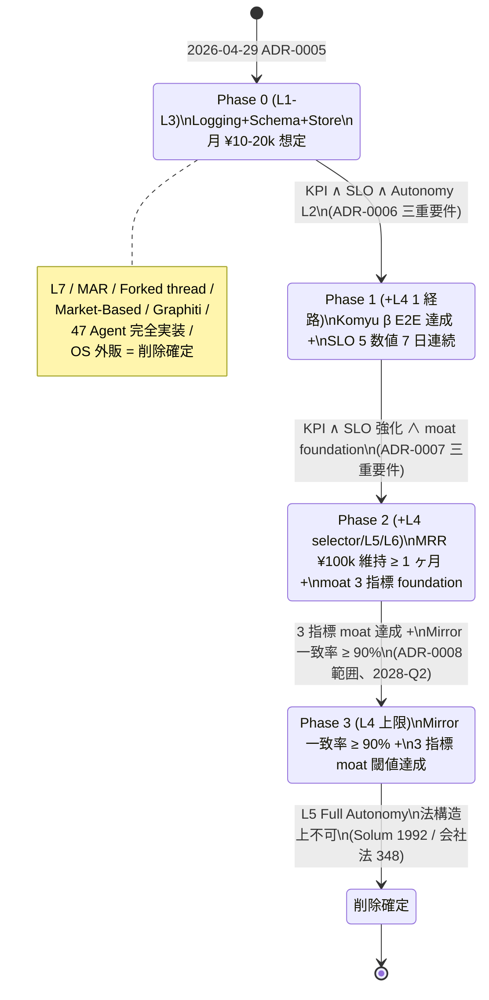

> **Disclaimer**: 本記事は著者個人の副業 (個人開発) における設計記録です。本業 (別会社所属) の業務・知見とは無関係で、特定法人の公式見解ではありません。記載の数値・構成・ADR 引用はすべて執筆時点 (2026-05-09) の自宅検証環境スナップショットで、商用品質や SLA を保証しません。1 人会社 (CreaNest 名義) の運営記録としてお読みください。

## 結論

47 Agent / L4-L7 の自律階層 / Phase 0-3 段階移行の **マスター設計を 1 ヶ月かけて描いて、4 並列レビューで「commodity, weak moat」と判定され、ADR で凍結しました**。設計を捨てたのではなく、「凍結条件付き North Star」として残し、解凍を **事業 KPI (Komyu β E2E / MRR ¥100k)** にゲートする構造に倒しました。

具体的に何が起きたか:

- 4 月中旬に 47 Agent / 13 部署 / 12 機能 / Year 3 OS 外販という壮大な vision を `autonomous-operations-aspirational.md` (vision 文書) に書いた
- 月末 (2026-04-29) に 4 視点並列レビュー (Architect / 本番 SRE / 事業戦略 / Multi-Agent 研究) を実施、4 者全員が 「**commodity, weak moat / 事業速度殺し / 月赤字 ¥90-145k**」 と判定
- 即日 ADR-0005 で **L4-L7 を凍結 + 47 Agent 完全実装と OS 外販を削除確定**、`autonomous-operations-aspirational.md` を「North Star のまま、ただし実装は ADR-0005 に従属」に降格
- 1 ヶ月の沈黙ののち、2026-04-29 に `self-driven-company-master-design.md` を **FIXED v1.0** として 467 行で固定、以後の改訂は ADR-0004 標準プロセス (RFC + 7 日 review) を強制

成果物の数字を本文埋込で:

- マスター設計本体 = **467 行** (`docs/architecture/org-os/self-driven-company-master-design.md`、`wc -l` 実測)
- 凍結 ADR = **4 本** (ADR-0005 / 0006 / 0007 / 0008、合計 643 行)
- 削除確定リスト = **8 機構** (L7 / MAR / Forked thread / Market-Based / Graphiti / 47 Agent 完全実装 / OS 外販 / Self-Genesis 完全自動)
- moat 主張可能閾値 = **causal density ≥ 1.5 / outcome closure ≥ 70% / counterfactual coverage ≥ 80%** (3 指標が同時成立しないと moat にならない)
- 残された人間専管領域 = **戦略 / 法務 / 投資家対応 (約 5%)** — L4 上限、L5 は法構造上不可と ADR-0008 で永続宣言

本記事は「壮大な Agent 階層を設計したくなる病」にかかった私が、4 視点レビューで自分の設計が **commodity** だと突きつけられて、それでも捨てずに **凍結して条件付き North Star** に再定義した過程の記録です。**設計を凍結することこそが moat になる**、という逆説的な結論に至った理由を、ADR 抜粋と Mermaid 3 枚で示します。

## なぜこの記事を書くか

「47 Agent / L4-L7 / OS 外販」みたいな野心は AI 駆動開発界隈で量産されています。Cognition Devin、Cursor Composer、Replit Agent、Magnus / Manus、AutoGen — どれも「全社オペレーションを Agent が回す」を匂わせていて、私もその匂いに乗りました。

問題は、**1 人会社の MRR ¥20k で月 ¥120k の Claude API を燃やす設計** を 4 月中旬の私が真顔で描いていたことです。これを止められたのは「自分が weak moat だと突きつけられる仕組み」を ADR プロセスとして埋め込んだからで、そのプロセスの設計と凍結の手順を残しておくのが本記事の目的です。

## 問題 — 壮大な Agent 階層を設計したい誘惑

### 4 月中旬の最初の vision 文書

最初に書いた `autonomous-operations-aspirational.md` には次が書かれていました (要約):

- **47 Agent** が 13 部署に分散 (CEO / strategy / pmo / product / design / dev / marketing / sales / cs / pr / finance / hr / legal / data + meta-cognitive 系)
- **L1-L7 の 7 層 stack** — L1 Logging / L2 Schema / L3 Store / L4 Hierarchical / L5 Knowledge Graph / L6 Reflexion / L7 Meta-cognition
- **§機能 12 OS 外販** — Year 3 で CreaNest 自社運営 OS を 2 次商品化
- **§機能 11 CEO Mirror Agent** — 全領域で代理判断、CEO は週 1 回承認
- **§機能 4 Self-Genesis** — 新規事業を Agent が自動立案・自動実行

書いていて気持ちよかった文書です。図にすると壮大に見えるし、Anthropic / Du et al. (Multi-Agent Debate) / Park et al. (Generative Agents) の論文を全部踏襲していて、学術的にも筋が通って見えました。

### 47 Agent 階層図 — 描いた当時の全体像

```mermaid
flowchart TB
    classDef ceo fill:#fde7e9,stroke:#c2185b,color:#000
    classDef meta fill:#f3e5f5,stroke:#6a1b9a,color:#000
    classDef l4 fill:#e3f2fd,stroke:#1565c0,color:#000
    classDef l5 fill:#fff3e0,stroke:#e65100,color:#000
    classDef l6 fill:#e8f5e9,stroke:#2e7d32,color:#000
    classDef l7 fill:#ffebee,stroke:#c62828,color:#000

    CEO[CEO Agent + Mirror]:::ceo

    subgraph META[L7 Meta-cognition]
        SG[Self-Genesis<br/>新規事業立案]:::meta
        MR[Mirror Agent<br/>全領域代理]:::meta
        OS[OS 外販 Agent]:::meta
    end

    subgraph L6[L6 Reflexion 多重]
        AC[Actor]:::l6
        EV[Evaluator]:::l6
        RF[Reflector]:::l6
        MAR[MAR<br/>Multi-Reflexion]:::l6
    end

    subgraph L5[L5 Knowledge Graph]
        EP[Episodic Memory]:::l5
        SM[Semantic]:::l5
        GR[Graphiti DAG]:::l5
    end

    subgraph L4[L4 Hierarchical]
        ST[Strategy 6 agents]:::l4
        PM[PMO 6 agents]:::l4
        PR[Product 6 agents]:::l4
        DS[Design 6 agents]:::l4
        DV[Dev 6 agents]:::l4
        MK[Marketing 6 agents]:::l4
        SL[Sales 6 agents]:::l4
        FK[Forked thread<br/>NoGO 並列]:::l4
        MB[Market-Based<br/>coordination]:::l4
    end

    CEO --> META
    META --> L6
    L6 --> L5
    L5 --> L4
    L4 --> EXT[(外部 IO<br/>GitHub / Slack / Stripe)]
```



これが 4 月中旬時点で本気で描いていた絵です。13 部署 × 6 agents = 78 agents、そこから「現実的に 47 まで絞った」と書いていました (どこから出た 47 かと言うと、各部署の director を 1 + 各部署 sub agents 平均 2.6 という雑な算数です)。

### 体感していた問題 — これは何のために作っているのか

設計しているうちに、以下が気持ち悪くなり始めました:

1. **MRR ¥20k で月 ¥120k API 燃やす計算が合わない** — Opus + Sonnet の token 計算で 47 Agent を回すと月 ¥110-165k、確定 MRR ¥20k なので **赤字 ¥90-145k/月**
2. **「47 Agent」が動詞でなく名詞である** — Cursor / Devin / LangGraph で代替可能、自前実装の差別化要素がゼロ。「他社が同じ Claude API + LangGraph で 1 ヶ月で再現できる」状態
3. **CEO 工数が aspirational 文書に流出** — Komyu PMF / nailsalon 拡販より、自律運営 OS の図を描く時間が長くなっていた
4. **L7 Meta-cognition が学術的にも怪しい** — agent-researcher の文献調査で「L5 は法構造上不可能 (Solum 1992、Bryson 2017)、L7 は学術的に存在しない目標」と判明

「これは moat にならない設計だ」と気付いたのは、Komyu の Cloud Run revision 64 が安定稼働し始めた 2026-04-28、夜中の 02:00 でした。47 Agent の図を眺めながら、「**この絵を見せられた投資家が一発で『他社で見た』と言う未来**」が見えました。

## 解法 — 描いて検証して凍結する設計サイクル

### サイクルの全体像



サイクルは 4 フェーズです:

1. **描く** — `autonomous-operations-aspirational.md` (vision) で野心を全部書く
2. **検証する** — 4 視点並列レビュー (Architect / SRE / 事業 / Agent 研究) で「moat の有無」を 1 ターン投票
3. **凍結する** — ADR-0005/0006/0007/0008 でスコープを永続記録、解凍条件を事業 KPI で gate
4. **再描画する** — 1 ヶ月凍結ののち、`self-driven-company-master-design.md` v1.0 で「L1-L3 + 凍結条件付き L4-L7」に再定義

このサイクルの肝は **「描いた野心を捨てない」** ことです。普通なら overengineering と見なされた vision は黒歴史として消えます。私はそれを「North Star」として残し、各機構の解凍条件を ADR で gate する構造に倒しました。**事業 KPI が達成されない限り L4-L7 は凍結のまま**、というのが ADR-0005 の核です。

### Phase 0-3 の Layer 図 — 何を残し何を削除したか

```mermaid
flowchart TB
    classDef p0 fill:#e8f5e9,stroke:#2e7d32,color:#000
    classDef p1 fill:#e3f2fd,stroke:#1565c0,color:#000
    classDef p2 fill:#fff3e0,stroke:#e65100,color:#000
    classDef p3 fill:#f3e5f5,stroke:#6a1b9a,color:#000
    classDef del fill:#ffebee,stroke:#c62828,color:#000

    subgraph P0[Phase 0 — 即実装 L1-L3]
        L1[L1 Logging\nstore.ts append-only]:::p0
        L2[L2 Schema\nZod + state machine]:::p0
        L3[L3 Store\nOutbox + Blackboard\nbitemporal]:::p0
    end

    subgraph P1[Phase 1 — Komyu β E2E 後解凍]
        L4A[L4 Hierarchical\n1 経路のみ\nCEO→Lead→Worker]:::p1
    end

    subgraph P2[Phase 2 — MRR ¥100k 後解凍]
        L4B[L4 selector\n複数 Lead 動的選択]:::p2
        L5[L5 Knowledge Graph\nLetta 互換]:::p2
        L6[L6 Reflexion\ndepth=1 hard-cap]:::p2
    end

    subgraph P3[Phase 3 — 2028-Q2 想定]
        L4C[L4 High Autonomy\nMirror 低リスク領域]:::p3
    end

    subgraph DEL[削除確定 — 再採用は新規 ADR 必須]
        L7[L7 Meta-cognition]:::del
        MAR[MAR Multi-Reflexion]:::del
        FK[Forked thread]:::del
        MB[Market-Based]:::del
        GR[Graphiti]:::del
        A47[47 Agent 完全実装]:::del
        OS[OS 外販]:::del
        L5F[L5 Full Autonomy\n法構造上不可]:::del
    end

    P0 --> P1: ADR-0006 gate
    P1 --> P2: ADR-0007 gate
    P2 --> P3: ADR-0008 gate
    P3 -.->|永続到達不能| L5F
```

L1-L3 が今 (Phase 0) で稼働中の 3 層、L4 が Komyu β を越えたら 1 経路だけ解放、L5/L6 は MRR ¥100k 越えで解放、L4 高度自律は 2028-Q2 想定、**L5 完全自律は法構造上永続到達不能** (ADR-0008)。

削除確定 8 機構 (`docs/adr/0005-coordination-phase0-scope-freeze.md:104-112`) を本文で抜粋:

```markdown
#### 削除確定 (再採用は新規 ADR 必須)

- L7 Meta-cognition layer
- MAR (Multi-Agent Reflexion 多重)
- Forked thread (NoGO 並列展開)
- Market-Based coordination
- Graphiti
- 47 Agent 完全実装 (実装上限: 当面 10 Agent)
- CreaNest OS 外販 (Year 3 計画として削除)
```

「再採用は新規 ADR 必須」と書いたことで、CEO (= 私) が次の壮大な Agent 階層を描きたくなった時、**自分自身で ADR を起票しないと再復活できない** 構造を作りました。これが ADR Ratchet (一方向ラチェット、`self-driven-company-master-design.md:256` の subsystem #4) です。

### マスター設計の核 — §0「業界に存在しない 3 要素」

凍結後に固定したマスター設計 v1.0 (`docs/architecture/org-os/self-driven-company-master-design.md:43-51`) の §0 から:

```markdown
### 0.2 業界に存在しない 3 要素 (CreaNest の発明)

1. **Revenue-gated capability unlock** (ADR-0005/0006/0007 で 3 段階解凍)
   = 技術投資が事業 KPI で gating される構造を ADR にエンコード
2. **Causal Decision Graph + bitemporal replay** (CDG with 4 種 edge)
   = 「決定 → 結果 → 30/90 日後の検証」が DAG として保持され、過去任意時点の state を復元可能。
3. **13 部署横断の意思決定品質メーター** (Goodhart-safe 介在率 + 5 軸 rubric + moat 3 指標)
   = 「会社の判断品質」が連続スコアで監視され、IPO 監査 (SOX 404) に耐える audit trail として通る

これら 3 つが **連結したとき** 初めて moat が成立する。3 つのうち 1 つでも欠けると追随容易。
```

注意したいのは「47 Agent」も「7 層 stack」も moat 要素に入っていないことです。**moat の本体は「事業 KPI で gate する構造」と「決定 graph」と「品質メーター」の 3 つ**で、Agent の数や階層は moat ではない、という結論に至りました。これは 4 視点レビューの結果として書き直した部分です。

### 解凍 ADR の gate 設計 — Phase 1 の三重要件

ADR-0006 (`docs/adr/0006-phase1-unfreeze-gate.md:64-79`) で Phase 1 解凍を **「事業 KPI ∧ 技術 SLO ∧ Autonomy L2」** の三重要件に固定しました:

```markdown
#### 要件 1: 事業 KPI (ADR-0005 既定を踏襲)

- Komyu β E2E が 2026-05-15 までに達成
- 「達成」の定義 = 規定 user flow が production 環境で end-to-end 動作

#### 要件 2: 技術 SLO 5 数値 (本 ADR 新設、7 日連続観測)

| # | 指標 | 閾値 | 計測ソース |
|---|---|---|---|
| 2-1 | error rate | < 1% | Komyu prod log + Sentry |
| 2-2 | budget cap 違反 | 0 件 | cost-governor.ts の reject 件数 |
| 2-3 | CEO 介入率 | < 30% | Decision-Id 付き commit のうち revert/amend 入ったもの |
| 2-4 | Hierarchical thread 完走率 | ≥ 90% | runHierarchical の outcome=completed 比率 |
| 2-5 | Decision Genealogy 蓄積 | ≥ 30 nodes | decisions.jsonl 行数 |
```

5 数値を 7 日連続で達成しないと、Komyu β E2E が動いていても解凍できません。**CEO 主観で「いけそう」と思っても、5 数値の 1 つでも閾値を割っていたら gate が閉まる**、という構造です。

これは「**気分で再膨張させない**」ための装置です。CEO が「やっぱり L4 解放しよう」と思った瞬間、SLO 5 数値が 7 日連続で揃っているかを cost-governor のログと decisions.jsonl の行数で機械的に確認させられます。

### Phase 2 の moat 3 指標閾値 — ADR-0007

ADR-0007 (`docs/adr/0007-phase2-unfreeze-gate.md:58-65`) は Phase 2 解凍に moat 3 指標の **foundation 閾値** を要求します:

```markdown
#### 要件 3: moat 3 指標 (AR §D-3 / decisions.metrics.test.ts で計測)

| # | 指標 | Phase 2 解凍時閾値 | moat 主張可能閾値 (将来) |
|---|---|---|---|
| 3-1 | causal density | ≥ 0.5 | ≥ 1.5 |
| 3-2 | outcome closure rate | ≥ 50% | ≥ 70% |
| 3-3 | counterfactual coverage | ≥ 60% | ≥ 80% |

3 指標の Phase 2 閾値は「moat foundation」、将来閾値は「moat 主張可能 (= 投資家ピッチで言える)」を意味する。
Phase 2 解凍は前者のみ要求。
```

ここで重要なのは **「moat foundation 閾値」と「moat 主張可能閾値」を分離した** ことです。Phase 2 解凍時点では「将来 moat になる土台」を作っているだけで、投資家ピッチで「moat があります」と言える状態ではない。**moat 主張可能閾値 (1.5 / 70% / 80%) が同時成立した時に、初めて投資家ピッチで使える** という規約を ADR-0008 §訴求規約に書き込んでいます (`docs/adr/0008-phase3-autonomy-ceiling.md:67-72`):

```markdown
### 投資家ピッチ表現規約 (本 ADR で固定)

- 訴求可: 「13 部署横断の意思決定品質メーター付き AI 運営、上場可能な audit trail 構造」 (Phase 2 解凍後)
- 訴求可: 「causal density / outcome closure で moat を数値化」 (3 指標達成後のみ)
- **訴求不可**: 「会社が自走する」「CEO 不要」「OS 外販」「47 Agent」「L5 完全自律」
```

訴求不可リストは私が 4 月に書いていた pitch deck そのものです。**自分の野心を ADR で訴求不可リストに入れて、未来の自分が同じことを言わないように縛った** わけです。

### L5 Full Autonomy は法構造上不可と宣言

ADR-0008 (`docs/adr/0008-phase3-autonomy-ceiling.md:49-57`):

```markdown
### 宣言 2: L5 Full Autonomy は CreaNest 法構造上 **永続到達不能**

- 法的根拠:
  - 会社法 第 348 条 (取締役の業務執行) — 自然人に帰属
  - 民法 第 415 条 (債務不履行責任) — 法人代理は自然人取締役
  - 金融商品取引法 (上場時) — 内部統制 / 監査責任は自然人 CEO
- 学術根拠:
  - Solum, L. B. (1992) Legal Personhood for Artificial Intelligences. NCLR
  - Bryson, J. J. et al. (2017) Of, for, and by the people: the legal lacuna of synthetic persons.
- 自動運転 SAE J3016 L5 が法的・倫理的に困難なのと同じ理由で MAS L5 も不可
```

これは「**未到達野心**」を ADR で「**永続到達不能**」に格下げした宣言です。Mirror Agent も低リスク領域だけに限定 (`docs/adr/0008-phase3-autonomy-ceiling.md:64`):

```markdown
| §機能 11 CEO Mirror | 全領域代理 | 凍結 | 低リスク領域のみ L3 解凍 (ADR-0007)、戦略 / 法務 / 投資家は **永続非対応** |
```

「**戦略 / 法務 / 投資家対応は永続非対応**」と書いたことで、未来の自分が「Mirror で戦略判断を代理させたい」と言い出した時、ADR-0008 の修正を要求されることになります。私の主観的な誘惑を ADR の壁で囲った形です。

### 「L1 Assisted → L2 Partial → L3 Conditional → L4 High」の Autonomy 写像

`docs/adr/0007-phase2-unfreeze-gate.md:71-78`:

```markdown
| Level | 名称 | CEO oversight 範囲 | 達成時期 |
|---|---|---|---|
| **L0** | Manual | 全タスク | (2026-04 以前) |
| **L1** | Assisted | 全タスク (検収 100%) | 2026-04-29 (現在) |
| **L2** | Partial | 中リスク以上 (検収 50-70%) | Phase 1 解凍 = 2026-05-15+ |
| **L3** | Conditional | 戦略 / 法務 / 投資家対応のみ (検収 20%) | Phase 2 解凍時 = MRR ¥100k +1m |
| **L4** | High | 法的責任のみ (検収 5%) | ADR-0008 範囲、2028-Q2-Q3 想定 |
| **L5** | Full | (理論上 0%) | 法構造上不可、ADR-0008 で削除確定 |
```

これは SAE J3016 (自動運転 6 段階) を MAS に翻案したものです。Mialon et al. 2023 *Augmented Language Models* §5 の「LLM の自律性段階」とも整合します。

注目してほしいのは「**現在は L1 Assisted (検収 100%) でしかない**」という地味な現実です。私の 4 月の vision 文書は L4-L5 を匂わせていましたが、**実装上は今でも CEO 検収 100% の L1**。ADR-0007 が Phase 2 解凍時の到達点を **L3 Conditional (検収 20%)** に固定したので、L4 を匂わせる pitch は ADR 違反です。

## 失敗談 — 凍結に至るまでの 4 つの罠

### 失敗 1: aspirational.md が「実現する vision」のように読めていた

最初の `autonomous-operations-aspirational.md` は status `vision` と書いていましたが、文章は **「2026-08 までに 47 Agent 稼働」** のような断定形でした。

**Before** (壊れた版、4 月中旬):

```markdown
## §機能 11 CEO Mirror Agent

CEO が不在でも全領域で代理判断する。週次で CEO は承認のみ。
2026-Q3 までに低リスク領域から段階導入、Year 1 末には戦略判断も代理可能。
```

これだと aspirational 文書と impl 計画の区別がつかず、**vision のはずの記述が impl deadline に化けて** いました。私自身が「来月までに作らねば」と焦り、Komyu β を後回しにしかけました。

**After** (ADR-0005 採択後、`autonomous-operations-aspirational.md` 改訂版):

```markdown
## §機能 11 CEO Mirror Agent

(North Star。実装スコープは ADR-0005 / ADR-0007 / ADR-0008 に従属)
**永続非対応**: 戦略 / 法務 / 投資家対応 (ADR-0008 §宣言 3)
**条件付き解凍**: 低リスク領域のみ Phase 2 (MRR ¥100k +1m) で L3 範囲
```

各 vision 機能の冒頭に「実装スコープは ADR-0005 に従属」を必ず書くルールに倒しました。**vision と impl deadline を文書構造で分離する** ところまでやらないと、自分の野心が deadline に化けます。

教訓: **vision 文書は status だけでなく文体まで「条件法」で書け**。「達成可能 (may, can be)」「条件付き (when X is achieved)」を多用、「実現する (will be)」を排除。

### 失敗 2: 4 視点レビュー前に「凍結すべきか」を自分で判断しようとした

4 月下旬、aspirational 文書のコスト試算が破綻していることに気付いた瞬間、私は「self-review で凍結ラインを決められる」と思い込んで 1 週間悩みました。

**Before** (1 週間溶かした):

```
Day 1: 47 Agent → 30 Agent に絞ろう
Day 2: いや 30 Agent も多い、20 Agent
Day 3: でも moat 主張のためには 30 必要
Day 4: 月予算でも数えると 15 が現実...
Day 5-7: ループ
```

self-review は **無限に揺れる** という当たり前のことを 7 日かけて学習しました。1 人会社の CEO は「自分の野心を客観視できる」と勘違いしますが、できません。

**After** (4 並列レビューを 1 ターンで):

```
2026-04-29 朝 (1 日で完結):
  Round 1: 4 つの role 視点を Task で並列 spawn
    - Architect 視点: 「この 7 層が L4 で本当に止まるか」
    - SRE 視点: 「月 ¥120k API でいくら現金が燃えるか」
    - 事業視点: 「Komyu PMF と OS 外販どちらに CEO 工数を投じるか」
    - Multi-Agent 研究視点: 「L5 / L7 は学術的に到達可能か」
  Round 2: 4 視点の合議 1 回 (debate loop ではない)
  → 4 者全員が「commodity, weak moat / 月赤字 / 事業速度殺し」で合意
```

これは memory `feedback_brutal_architecture_review` で「**brutal architecture review pattern: 4 並列 single-shot + 合議 1 回**」と記録した手順です。debate loop は禁止 (`feedback_stop_debate_loops`)、1 ターンで終わらせる。

教訓: **構造判断は self-review で揺れる。4 並列 single-shot + 1 回合議で打ち切る**。

### 失敗 3: 凍結 ADR を書いた直後に「でも moat の発明部分は」と再膨張させかけた

ADR-0005 で 8 機構を削除確定した翌日、私は「**でも CDG (Causal Decision Graph) は uniqueness があるはずで、これだけは作るべき**」と書き始めました。CDG のために L5 Knowledge Graph + Graphiti を再導入する RFC を 3 時間かけて書きました。

これは典型的な **再膨張パターン**です。「凍結したけど、この機構は特別」と例外を作ろうとする。

**Before** (再膨張しかけた版):

```
RFC: CDG 専用に L5 KG を Phase 1 で部分解凍したい
理由: CDG は moat、CDG には KG が必須、よって KG も Phase 1
```

**After** (ADR Ratchet で停止):

```
ADR-0005 が「再採用は新規 ADR 必須」と書いてあるので、
KG 解凍 RFC は ADR-0007 を待つ。
CDG は decisions.jsonl + edges 予約で Phase 0 から積み始め、
KG 化は Phase 2 解凍で実装。
```

CDG を Phase 0 で「**graph 構築は後回し、ledger だけ積む**」設計に倒したのは、ADR-0010 (Cross-Department Event Bus、H-01 記事参照) で凍結 ADR と整合させたからです。1 つの「特別」を許すと 5 つの「特別」が湧く、というのは経験則です。

教訓: **「これだけは特別」を 1 つも許さない。ADR Ratchet は CEO 主観の例外を機械的に却下する**。

### 失敗 4: マスター設計を書き直す時、aspirational をまた壮大に膨らませかけた

凍結から 1 ヶ月後 (2026-04-29)、`self-driven-company-master-design.md` v1.0 を書き始めた時、私は再び **§0「業界初」** という章タイトルで野心を書き始めました。

**Before** (再膨張寸前の版):

```markdown
## §0. CreaNest が業界初である 7 つの要素

1. 47 Agent 階層
2. L7 Meta-cognition
3. Causal Decision Graph
4. ...
```

**After** (現行 `self-driven-company-master-design.md:30-51`):

```markdown
## §0. なぜこれが業界初なのか

### 0.2 業界に存在しない 3 要素 (CreaNest の発明)

1. Revenue-gated capability unlock (ADR-0005/0006/0007 で 3 段階解凍)
2. Causal Decision Graph + bitemporal replay
3. 13 部署横断の意思決定品質メーター

これら 3 つが **連結したとき** 初めて moat が成立する。
3 つのうち 1 つでも欠けると追随容易。
```

「7 つ」を「3 つ」に削り、Agent 数も階層数も moat 要素から外しました。**「moat は連結性で成立する」** という条件を明記、3 つすべてが揃わないと commodity に戻る、と書きました。

これは memory `project_decision_genealogy_moat` で「**唯一の革新候補は意思決定品質の数値化エンジン**」と確定した結論を反映したものです。

教訓: **「業界初」を書く時は数を絞る。多いほど commodity に近づく**。

## 残課題

### 1. Phase 1 解凍判定の自動化が未実装

ADR-0006 の SLO 5 数値 (error rate / budget violation / CEO 介入率 / 完走率 / Genealogy 蓄積) を 7 日連続観測する dashboard が未実装です。今は `gh issue list` + `decisions.jsonl` 行数を CEO が手で数えています。

`pipeline-kit/agents/coordination/decisions.ts` には `involvementRate` (CEO 介入率) 計算は入っていますが、SLO 7 日窓のロールアップは未実装。Komyu β E2E 完走 (2026-05-15) の前後で実装予定。

### 2. moat 3 指標の計測コードが Phase 0 で部分実装

`decisions.ts` に moat 3 指標 (causal density / outcome closure / counterfactual coverage) のテスト関数は入っていますが、production data がまだ少なすぎて意味のある値が出ていません (decisions.jsonl が空に近い)。Phase 1 で 30 nodes、Phase 2 で 200 nodes 蓄積された時点で初めて実測値が出ます。

### 3. ADR Ratchet の violation 検出が手動

CEO が「特別な例外で L4 を Phase 1 で解凍したい」と言い出した時、現状は ADR-0006 の SLO 5 数値で機械的に gate されますが、「ADR-0005 削除確定 8 機構を再採用しようとした」場合の検出は手動です。`scripts/audit-adr-violation.sh` のような linter が欲しいところ。

### 4. Mirror Agent / Self-Genesis の「条件付き復活」設計が空欄

ADR-0008 で「§機能 4 Self-Genesis は Phase 3 末に L4 範囲内で復活可」と書きましたが、**「L4 範囲内」の正確な定義** が ADR にありません。Phase 3 解凍 ADR (ADR-0009 仮) を 2028-Q2 に書く時に、Mirror 一致率 ≥ 90% の数値定義と Self-Genesis の許可範囲 (新規事業立案のみ可、実行は CEO 承認必須) を明文化する必要があります。

### 5. 4 視点並列レビューが「single-CEO 体制」依存

4 視点レビュー (Architect / SRE / 事業 / Multi-Agent 研究) は私 1 人が Task で並列 spawn しているので、本質的に **CEO 1 人の解釈** です。社外の本物の architect / SRE が見たら別の判定が出る可能性があります。Phase 2 解凍時点で外部 advisory に 1 回見てもらう想定ですが、人選未決。

## 理論根拠 — なぜ凍結が moat になるか

### 根拠 1: ADR Ratchet は「気分で再膨張」を構造的に止める

経済学で言う **commitment device** (Schelling 1960 *The Strategy of Conflict*) と同じ装置です。CEO が「未来の自分の主観」を信用しない代わりに、ADR-0004 標準プロセス (RFC + 7 日 review) という外部装置に縛り付けることで、再膨張のハードルを上げます。

私の場合、4 月の壮大 vision を書いた CEO と、5 月の凍結 ADR を書いた CEO は同一人物です。**未来の自分が今の自分の決定を覆そうとした時、7 日 RFC + 5 部門レビューを強制される**。これは Ulysses Pact (オデュッセウスの誓約) の現代版で、自律運営 OS の最も基礎的な moat 要素です。

これが ADR-0005 §「Bootstrap 適用」(`docs/adr/0005-coordination-phase0-scope-freeze.md:177-181`) で書いた:

> 次回 (Phase 1 解凍 ADR-0006 等) は ADR-0004 標準 7 日プロセスに完全準拠する

の意味です。今回 (ADR-0005) は時間制約で 3 日に短縮したが、次回は 7 日固定。**短縮の権利は今回限り**、と CEO 自身を縛っています。

### 根拠 2: 「描いて捨てる」のではなく「描いて凍結する」

Reinertsen の *The Principles of Product Development Flow* (2009) の 「**option preservation**」 と同じ考え方です。option を実行 (exercise) しないけれど、option そのものは保持する。Black-Scholes 的に言えば、option の行使価格 (= Komyu MRR ¥100k) と満期 (= 2028-Q2) を ADR で定義しておけば、option 価値は時間経過とともに膨らみ続けます。

具体的には:

- aspirational.md は **削除しない** (option を捨てない)
- ADR-0005/0006/0007/0008 で **行使条件を定義** (when to exercise)
- 行使条件未達のときは **凍結のまま** (option 保持)
- 行使条件達成 + RFC + 7 日レビュー で **段階解凍** (partial exercise)

これは「設計図を捨てた」のではなく「**価値ある option として保管した**」のです。Phase 1 解凍 ADR-0006 が accepted されると、L4 Hierarchical 1 経路の実装が Komyu β 安定 1 sprint 後に解凍される。これは事業成長と技術投資が **連動した derivative contract** で、commodity な「47 Agent stack」とは別物です。

### 根拠 3: Revenue-gated capability unlock は industry-first の構造

`self-driven-company-master-design.md:46`:

> Revenue-gated capability unlock (ADR-0005/0006/0007 で 3 段階解凍)
> = 技術投資が事業 KPI で gating される構造を ADR にエンコード

Cognition Devin / Cursor / Replit Agent / Magnus / Manus / AutoGen のどれも「**技術機能の解凍を会社売上に gate する構造**」を持ちません。彼らは feature を作ったら release します。私は feature を作ったが **凍結し**、Komyu MRR ¥100k で初めて部分解凍する設計に倒しました。

これは技術系 product では珍しいですが、**金融商品 / 規制業態 (医薬・自動運転) では当然の構造** です。FDA Phase 1/2/3 trial、SAE J3016 L0-L5、SOX 404 internal control — どれも capability の段階解凍に外部条件を要求します。AI 駆動運営 OS が IPO 監査に耐える構造を作るには、同じ ratchet を ADR で組まないといけません。

これが ADR-0008 §宣言 1 で書いた **「L4 が CreaNest の研究的上限、L5 は法構造上永続到達不能」** という宣言の経営的意味です。**L5 を諦めることが法的責任 / 内部統制を保つ前提**であり、L4 上限を ADR で固定することが投資家ピッチで通用する自律運営の枠組みになります。

### 根拠 4: 「設計を凍結すること」自体が moat 要素になる

ここが最も逆説的な部分ですが、**凍結プロセスそのものが moat**です。

Cognition Devin / Cursor は「機能を作って release」しか持ちません。私は「機能を設計したが ADR で凍結し、4 視点レビューで commodity 判定を受け、ADR Ratchet で再膨張を防ぎ、Phase 移行を事業 KPI で gate する」という **メタ構造**を持っています。このメタ構造は:

- 4 視点レビューの結論が `docs/design/99-architecture-review-2026-04-29.md` に永続記録
- 凍結 ADR が `docs/adr/0005-0008` に 4 本連続で永続記録
- マスター設計 v1.0 が FIXED status で 1 ヶ月凍結
- 解凍条件が事業 KPI (Komyu β / MRR ¥100k) と RFC + 7 日レビューで gate
- moat 主張可能な閾値が 3 指標 (causal density 1.5 / outcome closure 70% / counterfactual coverage 80%) で外形定義

を全部 ADR-driven に書き出しています。他社が「同じ Claude Code + ADR で 1 ヶ月で再現」しようとすると、**1 ヶ月の凍結期間と 4 視点レビューの結論ログ自体が再現できない**。これは **時間蓄積型 moat** (Park et al. 2023 *Generative Agents* の memory stream と同型) で、後から始めても追いつけません。

つまり、私が描いて捨てた 47 Agent 階層は **凍結されている限り CreaNest だけの asset** で、解凍するときには事業 KPI が達成されている = moat foundation が実装されている = 競合が同時に持てない、という構造です。**設計を凍結することが時間とともに価値を蓄積する**、というのが本記事の核です。

## まとめ

47 Agent / L4-L7 自律階層 / Phase 0-3 段階移行のマスター設計を書いて、4 並列レビューで「commodity, weak moat」と判定されました。私はそれを捨てるのではなく、**ADR で凍結 + 解凍条件付き North Star** に再定義しました。

固定したルールを並べると:

- aspirational.md は **vision のまま残す** (option preservation)
- ADR-0005 で **L4-L7 を凍結 + 8 機構削除確定** (再採用は新規 ADR 必須)
- ADR-0006 で **Phase 1 解凍を KPI ∧ SLO ∧ Autonomy L2 三重要件に固定**
- ADR-0007 で **Phase 2 解凍に moat 3 指標 foundation 閾値を要求**
- ADR-0008 で **L4 が研究的上限、L5 は法構造上不可と永続宣言**
- マスター設計 v1.0 を **FIXED status で 467 行に固定**、ADR-0004 標準プロセス必須

この構造の核は「**描いて捨てる**」のではなく「**描いて凍結する**」設計サイクルで、commitment device + option preservation + revenue-gated unlock + ADR Ratchet という 4 つの装置が連結して moat foundation を作る、というのが私の賭けです。

47 Agent / L4-L7 / OS 外販を pitch deck から削除した経緯と、削除しても消えていない理由 (= 凍結 option としての保管) を、本記事で残しました。1 年後、Komyu MRR ¥100k を越えてこのいくつかが解凍された時、また実装記録を書きます。

## 次の記事へ + 連載をフォロー

これは **52 本連載 (ai-driven-dev) の Day 41/52** です。

すでに公開済 / 関連:

→ **H-01 [13 部署が JSONL 1 本で連動する Cross-Department Event Bus](./cross-department-event-bus)** — 凍結後の Phase 0 で動いている第 1 世代 ledger。本記事のマスター設計の §1 全景図と直結

→ **H-02 docs MECE Audit Skill — 1,164 ファイルを毎ターン MECE で監査する** (準備中) — 凍結 ADR を docs structure で守る話

→ **A-04 [~/.claude/agents で 13 部署 director を宣言的に管理する](./13-department-directors-declarative)** — 47 Agent から「13 director に絞った」現状の director 構造、本記事の Phase 0 着地点

→ **B-04** Decision Genealogy — 意思決定 1 件に ID を発番して commit/ADR/承認に貫通させる moat (準備中) — 本記事 §0.2 の 3 要素のうち 2 番目を深掘り

### 連載を見逃さない方法

- **Zenn でこの著者をフォロー** — 公開通知が届きます
- **X で告知 tweet をフォロー** — 朝 6:00 に投稿予定 (準備中)
- **repo を watch**: [SakakitaniJunya/zenn-articles](https://github.com/SakakitaniJunya/zenn-articles) — 全 draft が見えます
- **devops-hub OSS**: 本記事のマスター設計と凍結 ADR 4 本は [SakakitaniJunya/devops-hub](https://github.com/SakakitaniJunya/devops-hub) の `docs/architecture/org-os/` と `docs/adr/0005-0008` に全部入っています

### Discussion / フィードバック歓迎

- 「凍結 ADR を書いた後の再膨張をどう防ぐか、こういう装置もある」 → GitHub Issue で議論しましょう
- 「Revenue-gated capability unlock の事例、医療・自動運転以外で他にもある」 → 知見ください
- 「L5 が法構造上不可能という宣言は強すぎる、こういう抜け道がある」 → 反証歓迎

連載 52 本を書き切る間に、凍結条件・解凍条件は事業 KPI に応じて改訂し続けます。本記事も将来書き直します。誤りや「ここをもっと深く」のリクエストは GitHub Issue でお気軽に。
