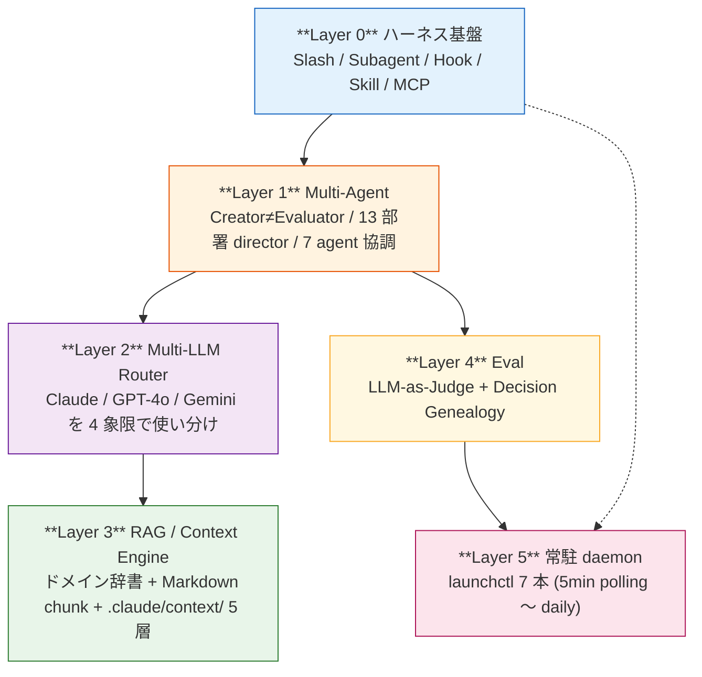
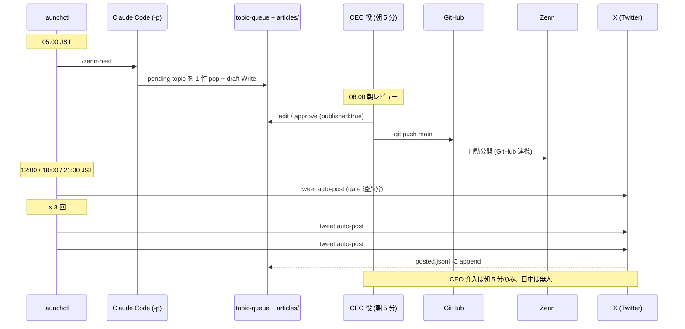
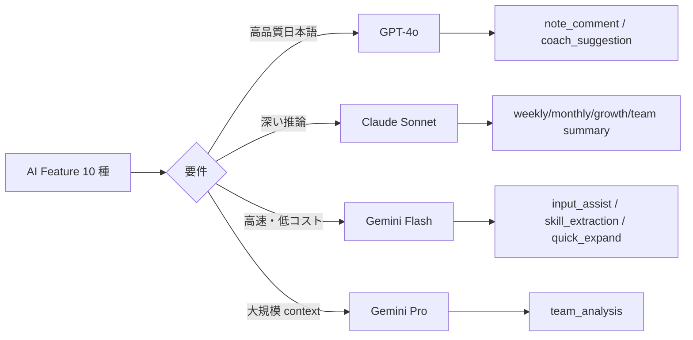

> **Disclaimer**: 本連載は著者が**個人 (副業)** で運営する小規模プロジェクト群 (CreaNest 名義) の技術記録です。所属組織・本業の業務内容とは一切関係ありません。記載の数値・構成は執筆時点 (2026-05) の自宅検証環境のスナップショットであり、商用品質や SLA を保証するものではありません。

> この記事は **52 本連載 (ai-driven-dev) の Day 1/52** です。明日から毎朝 1 本、各 Layer をコード付きで掘り下げます。

## 1 年やったらこうなった (1 行で)

**個人で AI 駆動開発を 1 年回した結果、いま 8 SaaS / 13 部署 director / 7 launchctl daemon が動き、私 (CEO 役) の介入は朝 5 分の Zenn approve のみになった。**

実測値で言うと、devops-hub の App は TS/TSX 170 ファイル、`~/.claude/skills/` + repo の skill が 11 個、`.claude/commands/` の slash command が 20 個、launchctl plist 7 本。Komyu は Cloud Run の revision 64 (2026-05-05 時点)、nailsalon は MRR ¥20,000 で唯一の確定収益、Soccer Note は Team ¥1,980/月 でリリース準備中。

```bash
# 全部実測 (再現コマンド)
$ find /Users/sakaki/project/devops-hub/App -type f \( -name "*.ts" -o -name "*.tsx" \) \
    -not -path "*/node_modules/*" | wc -l
170
$ ls /Users/sakaki/project/devops-hub/.claude/commands/*.md | wc -l
20
$ { ls ~/.claude/skills/; ls /Users/sakaki/project/devops-hub/.claude/skills/; } | sort -u | wc -l
11
$ ls /Users/sakaki/project/devops-hub/pipeline-kit/ops/*.plist | wc -l
7
```

本記事は、ここに辿り着くまでに固まった **6 層スタック** の全体マップです。各層はそれぞれ別記事 (連載 52 本) に切り出し、コード・図・file:line で具体的に掘り下げます。

## 問題 — 「コードを書く道具」では足りなかった

最初は Cursor / Copilot で補完してもらえれば十分だと思っていました。実際 1 ヶ月くらいは生産性が上がります。

ただ、**プロダクトを 3 つ・4 つと並列で持つ** ようになると別の問題が出ます。

- 仕様書を書く時間がない (PR に「これ何の機能?」と聞かれる)
- レビューが追いつかない (1 人だから自分でレビュー)
- 運用でハマる (deploy 後の verification、incident 対応、顧客対応)
- 営業・マーケ・法務・経理が止まる (個人開発だから当然)

ここで「補完」ではなく「**自律的に手を動かしてくれる相方**」が必要だと気付きました。Claude Code (Agent SDK 内蔵の CLI) を「会社」として運用する、という発想に切り替えたのが 2025 年夏。それから 1 年経って、いまの 6 層スタックに収束しました。

> 用語: **Decision Genealogy** = 意思決定 1 件ごとに ID を発番し、commit / ADR / 承認に貫通させて「なぜそう決めたか」を後から辿れるようにする仕組み。詳細は C-04 で書きます。

## 解法 — 6 Layer スタック



上の Layer ほど抽象、下ほど常駐稼働。Layer 0 の機構を Layer 1 のパターンで束ね、Layer 2 の LLM に Layer 3 の Context を載せて、Layer 4 で品質を測り、Layer 5 が無人で回し続ける、という構造です。

### 1 日のフロー (実稼働中)



### Layer 0 — Claude Code の 5 拡張機構

Claude Code には拡張ポイントが 5 つあります (詳細は **A-01**):

| 機構 | 起動条件 | 私の実例 |
|---|---|---|
| Slash command | 人間が `/<name>` 入力 (or cron) | `/zenn-next` `/orchestrate <issue>` |
| Subagent | 親が `Agent` tool で呼ぶ | `Explore` (grep) / `agent-improver` |
| Hook | tool 呼び出し前後で必ず | `PostToolUse → agent.log` / `Stop → docs MECE 監査` |
| Skill | 会話シグナル → 自動 fire | `tweet-capture` / `deploy-verification` / `event-emit` |
| MCP | 外部 SaaS 常時露出 | `figma` 公式 server |

実 hook (`devops-hub/.claude/settings.json:30-50`):

```json
{
  "hooks": {
    "PostToolUse": [
      {
        "matcher": "Write|Edit",
        "hooks": [{
          "type": "command",
          "command": "jq -r '.tool_input.file_path // empty' | { read -r f; [ -n \"$f\" ] && echo \"[$(date +%H:%M:%S)] modified: $f\" >> .claude/pipeline/agent.log 2>/dev/null; exit 0; } 2>/dev/null || true"
        }]
      }
    ],
    "Stop": [
      {
        "hooks": [{
          "type": "command",
          "command": "bash .claude/skills/docs-mece-audit/scripts/run-on-stop.sh 2>/dev/null || true"
        }]
      }
    ]
  }
}
```

**PostToolUse は append-only な軽い記録だけ**、重い検証は Stop hook に寄せる、というのが運用 1 年で固まった原則。最初に `pnpm typecheck` を仕込んで 1 ファイル編集のたびに数十秒止まる地獄を踏んだので。

### Layer 1 — Multi-Agent (13 部署 + 7 agent 協調)

devops-hub には部署別 director が 13 並んでいます。

```bash
$ ls /Users/sakaki/project/devops-hub/pipeline-kit/agents/prompts/ | grep -v _shared
ceo  cs  data  design  finance  hr  legal  marketing  pmo  pr  product  sales  strategy
# 13 directories
```

各 director は `state.md` を持ち、12 時間ごと (06:00 / 18:00 JST) に同期 daemon が回ります。CEO Agent は自然文 input を受け取り、無音 dispatch (どの部署か聞き返さない silent router) で該当 director に渡す設計です。詳細は **B-04** で。

7 agent 協調パイプライン (PMA → DocsA → DevA → RevA → EvalA → TestA → CIA) は別軸で、GitHub Issue → 仕様書 → 実装 → レビュー → PR の流れを自動化します。詳細は **B-03** で。

特に重要なのが **Creator ≠ Evaluator パターン**: 生成した側に評価させない、最大ラウンド制限 (3 ラウンド超えで人間 escalation)、Sub-Agent 4 層 (Creator / Validator / RateLimiter / Fallback) の分離。これを守らないと「永遠に修正案を出し続ける AI」が完成します。詳細は **B-01**。

### Layer 2 — Multi-LLM Router (4 象限)

build-football (Soccer Note) では Anthropic / OpenAI / Google を **同一サービス内で併用** しています。



実コード (`build-football/App/backend/app/features/ai/infrastructure/router.py:14-34`):

```python
class AIFeature(str, Enum):
    # GPT-4o — 高品質日本語
    NOTE_COMMENT = "note_comment"
    COACH_SUGGESTION = "coach_suggestion"

    # Claude Sonnet — 深い推論
    WEEKLY_SUMMARY = "weekly_summary"
    GROWTH_ANALYSIS = "growth_analysis"
    MONTHLY_SUMMARY = "monthly_summary"
    TEAM_MONTHLY_SUMMARY = "team_monthly_summary"

    # Gemini Flash — 高速・低コスト
    INPUT_ASSIST = "input_assist"
    SKILL_EXTRACTION = "skill_extraction"
    QUICK_EXPAND = "quick_expand"

    # Gemini Pro — 大規模 context
    TEAM_ANALYSIS = "team_analysis"
```

詳細は **D-01**、Fallback Chain は **D-02**、Prompt Caching は **D-05**。

### Layer 0 + Layer 2 の組合せ — Vision で経理 SaaS

keirai (経理 SaaS) では LINE で送られたレシート画像を Claude Haiku 4.5 で構造化抽出。実コード (`keirai/src/lib/ocr.ts:1-50`):

```typescript
import Anthropic from "@anthropic-ai/sdk";
const anthropic = new Anthropic();

export interface OcrResult {
  storeName: string | null;
  date: string | null; // YYYY-MM-DD
  totalAmount: number | null;
  items: Array<{ name: string; amount: number }>;
  categoryCode: string;
  categoryName: string;
  confidence: "high" | "medium" | "low";
  rawText: string;
}

export async function readReceipt(imageBuffer: Buffer, mimeType: string): Promise<OcrResult> {
  const mediaType = mimeType as "image/jpeg" | "image/png" | "image/gif" | "image/webp";
  const response = await anthropic.messages.create({
    model: "claude-haiku-4-5-20251001",
    max_tokens: 1024,
    messages: [{
      role: "user",
      content: [
        { type: "image", source: { type: "base64", media_type: mediaType, data: imageBuffer.toString("base64") } },
        { type: "text", text: "このレシートを以下の JSON 形式で返してください..." }
      ],
    }],
  });
  // ...
}
```

8 フィールドを 1 プロンプトで構造化、`max_tokens: 1024` で十分、Haiku 4.5 で平均 1.5 秒応答。詳細は **G-01**。

### Layer 4 — Skill (会話シグナルで自動 fire)

```markdown
<!-- ~/.claude/skills/event-emit/SKILL.md:1-10 (実物) -->
---
name: event-emit
description: |
  Use this skill whenever the CEO mentions a business event...
  Trigger on Japanese phrases:
  "成約した", "入金あった", "契約締結", "launch した", "公開した",
  "申請した", "決まった", "サインした", "shipped", "released", ...
  Calls `pipeline-kit/ops/emit-event.sh` to append a record to
  `.claude/events/business-events.jsonl` per ADR-0006.
---
```

「曖昧な状況説明」ではなく「具体的なシグナル語の列挙」で書くと、適切な頻度で発火します。詳細は **A-02**。

### Layer 5 — 常駐 daemon (launchctl 7 本)

devops-hub の `pipeline-kit/ops/` 配下に launchd plist が **7 本** 配備されています。

| plist (`com.devops-hub.<name>`) | 役割 | 頻度 |
|---|---|---|
| `harness` | active Issue → `claude -p /orchestrate` | 5 分 |
| `handoff-trigger` | event bus → playbook chain | 5 分 |
| `poll-issues` | label 状態 audit + 自動修復 | 10 分 |
| `local-agent` | secret 不要なローカル軽量 daemon | 60 分 |
| `daily-standup` | 13 部署 director 朝会生成 | 06:00 JST |
| `outcomes` | 意思決定 outcome 集計 | 1 日 1 回 |
| `sync-director-states` | 13 director state.md 同期 | 06:00 / 18:00 JST |

実 invocation パターン (`pipeline-kit/ops/run-orchestrator.sh:475-485`):

```bash
claude \
  -p \
  --verbose \
  --permission-mode bypassPermissions \
  --add-dir "${TARGET_REPO}" \
  --add-dir "${DEVOPS_HUB_ROOT}/.claude" \
  < "${PROMPT_FILE}" >> "${WORKER_LOG}" 2>&1 &
CLAUDE_PID=$!
start_watchdog "${CLAUDE_PID}"  # sleep 1800 で kill (run-orchestrator.sh:443-455)
wait "${CLAUDE_PID}"
```

ポイント 3 つ:

1. **`--permission-mode bypassPermissions`** — headless で `acceptEdits` だと Bash 系で永遠ハング (実体験で 30 分 watchdog ぎりぎりまで idle のまま無進捗)
2. **`< "${PROMPT_FILE}"`** — `--add-dir` が variadic で末尾の位置引数を吸収するので arg 渡し NG、stdin が正解
3. **30 分 watchdog** — 暴走を時間で止める。security boundary は cwd 制限 + log 監査で確保

## 監視中の 8 プロダクト

| id | 役割 | AI 実装の主軸 | stage |
|---|---|---|---|
| nailsalon | ネイルサロン予約 | LIFF + Firebase + Cloud Scheduler | pmf (MRR ¥20,000、唯一の確定収益) |
| keirai | 経理 SaaS | **Claude Vision OCR** (`keirai/src/lib/ocr.ts`) | mvp (バンドル販売前提) |
| komyu | コミュニティ運営 | Gemini 2.0 Flash 4 層 (Creator/Validator/RateLimiter/Fallback) | mvp (Cloud Run 稼働、revision 64 = 2026-05-05 時点) |
| soccer-note | 練習ノート × AI 振り返り | **3 プロバイダ Router** (前述) | mvp (Team ¥1,980/月、リリース予定) |
| vivivi-beauty | 美容サロン | NestJS + Stripe | ideation |
| lifeops | 生活運営 | (凍結中) | frozen |
| colason-markdown-editor | OSS Reader | C++ + TypeScript | ideation |
| zenn-articles | この連載 | claude -p で daily draft 生成 | mvp (本記事公開時点) |

> `devops-hub` は監視対象ではなく**監視基盤本体**なので別枠。`yomi-note` は近日 SSOT (`projects.ts`) に追加予定。

## 残課題 — まだできていないこと

正直に言うと、6 層が綺麗に揃ってるわけではなく、**穴は山ほどあります**。

1. **launchctl の本番常駐化が未完** — MacBook で動かしているのを iMac (always-on-host) に移す移行が Phase A 段階。詳細は `docs/runbooks/always-on-host-inventory.md`。
2. **X 自動投稿が stub** — `auto-post.sh` の quality gate ロジックは設計したが Python 実装中、X API key も未設定。
3. **Zenn 連載の自動化レール** — `claude -p "/zenn-next"` で記事 draft は生成できるが、permission 罠で 1 度ハングした (`--permission-mode bypassPermissions` で解消、それでも watcher bug あり)。
4. **Decision Genealogy の蓄積が薄い** — `decisions.jsonl` を作ったがレコード数がまだ少ない。Phase 1.5 で本格運用予定。
5. **テスト・E2E・観測性** — 本業 SaaS (nailsalon/Komyu/Soccer Note) の E2E カバレッジが偏っている。F-04 で書きます。
6. **複数アカウント運用** — 本業 PC (Accenture managed) と個人 PC (CreaNest) の Claude Code 分離が手動運用。

これらは順次連載 (52 本) で進捗を書きます。

## 理論根拠 — なぜこの構成で 1 人会社が回るのか

最後に「なぜこの 6 層で動くのか」の根拠を 3 つ。

### 根拠 1: Anthropic の "Building Effective Agents" 原則と整合

Anthropic Engineering blog の "Building Effective Agents" (2024-12) で挙げられている原則は:

- Augmented LLM (LLM + tool + memory + retrieval)
- Workflow と Agent を分けて使う (Routing / Parallelization / Orchestrator-Worker)
- Evaluator が必須 (Creator ≠ Evaluator)
- Tool / 仕様の透明性

**6 層スタックはこの原則を 1 人会社の運営に拡張したもの**。Layer 0 = Augmented LLM (Tool / Memory / Retrieval)、Layer 1 = Workflow + Evaluator、Layer 2-3 = LLM 多様化 + Retrieval、Layer 4 = Eval、Layer 5 = Orchestrator (cron 化)。

### 根拠 2: Creator ≠ Evaluator が moat

外部 (Claude agent 4 並列討論、2026-04-30) で「commodity, weak moat」と判定された後、唯一残った差別化要素が **Decision Genealogy** (= 全意思決定に Decision-Id を貫通させて辿れるようにする moat 候補)。これは Creator ≠ Evaluator パターンの数値化拡張で、論理的に「個人で書ける」かつ「商用 SaaS でやってる人がいない」領域。詳細は **C-04**。

### 根拠 3: 「マージ済 ≠ 本番反映済」を skill で強制

個人開発の最大の罠は「PR merge → done と思い込む」こと。`deploy-verification` skill が `merge した` `deploy したか` `本番に出てる?` のシグナルで自動発火し、Cloud Run / Vercel の revision を実測するまで「完了」を許さない。これは Hook ではなく Skill にしているのは、Claude が判断したい (「これは docs だけ PR だから verify 不要」みたいな例外) 余地を残すため。詳細は **F-04**。

## これまで書いた 28 章 (連載 Day 1-26/52)

連載は 52 本構成、現時点で **28 本 (53.8%) が公開可能状態**。残り 24 本は順次追加。

### A. Claude Code 拡張・運用 (5/10)

- **A-01** [Slash と Skill と Hook を混ぜて爆発した話](./claude-code-as-company-5-mechanisms) (Day 2)
- **A-02** [Skill Architecture 入門](./skill-architecture-introduction) (Day 3)
- **A-03** [Hooks で品質ゲート](./hooks-quality-gates) (Day 4)
- **A-04** [13 部署 director を宣言的に管理](./13-department-directors-declarative) (Day 16)
- **A-06** [Worktree 並列の落とし穴](./worktree-parallel-agents-pitfalls) (Day 19)

### B. Multi-Agent 設計 (4/7)

- **B-01** [Creator ≠ Evaluator 3 ラウンド設計](./creator-evaluator-pattern) (Day 5)
- **B-03** [7 エージェント協調 CI/CD](./seven-agent-cicd-pipeline) (Day 10)
- **B-04** [Project × Department Matrix](./project-department-matrix) (Day 20)
- **B-05** [Silent Router 自然文 dispatch](./silent-router-natural-dispatch) (Day 25)

### C. LLM-as-Judge / Eval (2/4)

- **C-01** [LLM-as-Judge 13 Evaluator](./llm-as-judge-13-evaluators) (Day 21)
- **C-04** [Decision Genealogy moat 設計](./decision-genealogy-moat) (-)

### D. Multi-LLM / AI Router (4/7)

- **D-01** [Multi-LLM Router を 4 象限で振り分け](./multi-llm-router-4-quadrants) (Day 6)
- **D-02** [Fallback Chain (OpenAI→Anthropic→Google)](./multi-llm-fallback-chain) (Day 17)
- **D-04** [LLM コスト最適化 — Haiku/Flash/Mini](./llm-cost-optimization-haiku-flash-mini) (Day 18)
- **D-05** [Anthropic Prompt Caching で 90% 安く](./anthropic-prompt-caching) (Day 11)

### E. RAG / 知識注入 (2/4)

- **E-01** [pgvector なしの RAG](./rag-without-pgvector) (Day 9)
- **E-03** [Context Engine 5 層](./context-engine-5-layers) (Day 22)

### F. AI 駆動 CI/CD / DevOps (2/4)

- **F-01** [Issue → Cloud Run Reusable Workflow](./issue-to-cloud-run-workflow) (Day 11)
- **F-04** [マージ済 ≠ 本番反映済](./merged-not-equals-deployed) (Day 12)

### G. Vision / マルチモーダル (2/3)

- **G-01** [Claude Vision でレシート OCR](./claude-vision-receipt-ocr) (Day 7)
- **G-02** [LINE 画像 → Vision → Prisma → CSV E2E](./line-vision-prisma-csv-e2e) (Day 15)

### H. AI Ops 独自路線 (3/5)

- **H-01** [Cross-Department Event Bus](./cross-department-event-bus) (Day 8)
- **H-02** [director を state.md + cron で自走](./director-state-cron-autonomy) (Day 23)
- **H-04** [MECE Audit Skill + Stop Hook](./mece-audit-skill-stop-hook) (Day 14)

### I. プロンプト工学・堅牢化 (2/4)

- **I-01** [3 層堅牢化 (Rate/Validation/Fallback)](./three-layer-llm-robustness) (Day 13)
- **I-02** [Gemini 503 リトライ + UI フォールバック](./gemini-503-retry-ui-fallback) (Day 26)

### J. 統合・経済圏 (1/4)

- **J-01** [LINE × Vision × Stripe 中小零細 SaaS](./line-vision-stripe-japan-saas) (Day 24)

### これから書く 24 章

- **A. 残 5**: A-05 Memory / A-07 Status Line / A-08 MCP 自作 / A-09 Mode 使い分け / A-10 settings 個人 vs project
- **B. 残 3**: B-02 収束ガード / B-06 Handoff Playbook / B-07 4 層分離
- **C. 残 2**: C-02 Promptfoo なし回帰 / C-03 品質スコア → decisions.jsonl
- **D. 残 3**: D-03 JSON モード差異 / D-06 Extended Thinking / D-07 Tool Use Schema
- **E. 残 2**: E-02 サッカー戦術 RAG / E-04 RAG 前のプロンプト構造化
- **F. 残 2**: F-02 Issue Label 駆動 dispatch / F-03 Discord + GH Actions 無人運営
- **G. 残 1**: G-03 Vision API を Zod で型検証
- **H. 残 2**: H-03 自立駆動型会社マスター設計 / H-05 SSOT Mandate
- **I. 残 2**: I-03 Schema-shot / I-04 circuit breaker 3 パターン
- **J. 残 3**: J-02 next-auth + Firestore + Gemini Concierge / J-03 Stripe Live ¥50 E2E / J-04 4 種混合インフラ

## 次の記事へ + 連載をフォロー

これは **52 本連載 (ai-driven-dev) の Day 1/52** です。

→ **A-01 [Slash と Skill と Hook を混ぜて爆発した話 — Claude Code 5 機構](./claude-code-as-company-5-mechanisms)** (Day 2/52)

→ **B-01 [Creator ≠ Evaluator — AI 出力を「収束」させる 3 ラウンド設計](./creator-evaluator-pattern)** (Day 5/52)

→ **D-01 [Multi-LLM Router を「タスク特性 4 象限」で振り分ける](./multi-llm-router-4-quadrants)** (Day 6/52)

→ **G-01 [Claude Vision でレシート OCR → 仕訳分類を 1 プロンプトで](./claude-vision-receipt-ocr)** (Day 7/52)

→ **H-01 [13 部署が JSONL 1 本で連動する Cross-Department Event Bus](./cross-department-event-bus)** (Day 8/52)

→ **E-01 [pgvector なしで RAG — ドメイン辞書 × Markdown チャンク](./rag-without-pgvector)** (Day 9/52)

連載を見逃さない方法:

- **Zenn でこの著者をフォロー** — 公開通知が届きます
- **X で告知 tweet をフォロー** — 朝 6:00 に投稿予定 (準備中)
- **repo を watch**: [SakakitaniJunya/zenn-articles](https://github.com/SakakitaniJunya/zenn-articles) — 全 draft が見えます
- **GitHub Issue で誤りや「ここをもっと深く」のリクエスト歓迎** — 連載の質を一緒に上げてください

書き進めながらこの INDEX もリンクを増やしていきます。
