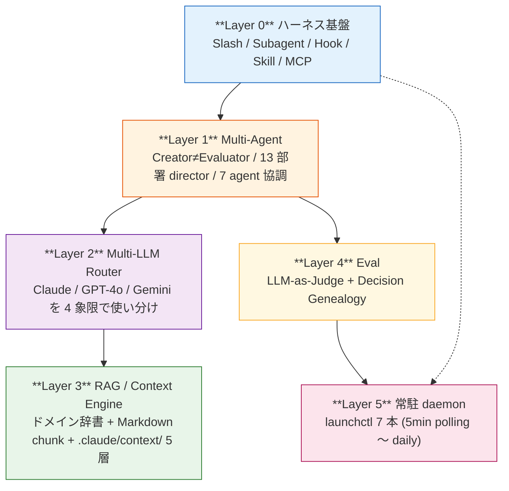
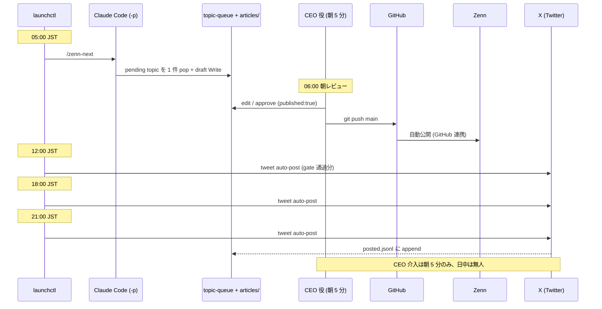
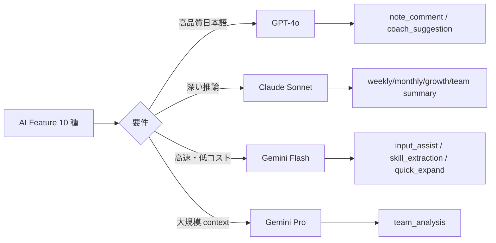

> **Disclaimer**: 本連載は著者が**個人 (副業)** で運営する小規模プロジェクト群 (CreaNest 名義) の技術記録です。所属組織・本業の業務内容とは一切関係ありません。記載の数値・構成は執筆時点 (2026-05) の自宅検証環境のスナップショットであり、商用品質や SLA を保証するものではありません。

## 結論

- 個人で AI 駆動開発を 1 年回した結果、Claude Code を「会社」として運用する **6 層スタック**(拡張機構 / Multi-Agent / Multi-LLM / RAG / Eval / 常駐 daemon)に収束しました。
- 監視 8 プロダクト / 13 部署 director / 7 launchctl daemon が回り、人間 (CEO 役) の介入は朝 5 分の Zenn approve のみという運用に落ちています。
- 本記事はその全体マップ。**今日から毎朝 1 本、52 日連続で各層を掘ります (Day 1/52)**。コード・図・file:line は全部 OSS repo から引いています。

> 用語: **Decision Genealogy** = 意思決定 1 件ごとに ID を発番し、commit / ADR / 承認に貫通させて「なぜそう決めたか」を後から辿れるようにする仕組み。詳細は C-04 で書きます。

## なぜこの記事を書くか

「AI 駆動開発」と言っても、Cursor で補完させる話と、Agent SDK で自律的にコードを書かせる話と、自社運用を全部 AI に置き換える話は別物です。語彙も道具も違うので、**「どこまで何をやれているか」のスナップショット** がないと議論が噛み合いません。

この INDEX は、私が現時点で何を作って何を作っていないかを正直に並べる場として書きます。**ASCII 図でなく Mermaid、抽象論でなく実 file:line、抽象的な強さでなく実測の数字** を冒頭で並べる方針です。連載の他記事もこの粒度で書いていきます。

## 全体像 — 6 Layer スタック



**見方**: 上の Layer ほど抽象、下ほど常駐。Layer 0 の機構を Layer 1 のパターンで束ね、Layer 2 の LLM に Layer 3 の Context を載せて、Layer 4 で品質を測り、Layer 5 が無人で回し続ける、という構造です。

## 1 日のフロー (実稼働中)



CEO の介入は **朝 5 分の Zenn approve のみ**。日常 tweet は CEO 承認なしで auto-post (`numbers` category だけ approve 必須)。

## Layer 0 — Claude Code の 5 拡張機構

A-01 で深掘りしますが要点だけ。Claude Code には拡張ポイントが 5 つあり、それぞれ起動条件が違います。

| 機構 | 起動条件 | 私の実例 |
|---|---|---|
| Slash command | 人間が `/<name>` 入力 (or cron) | `/zenn-next` `/orchestrate <issue>` |
| Subagent | 親が `Agent` tool で呼ぶ | `Explore` (grep) / `agent-improver` |
| Hook | tool 呼び出し前後で必ず | `PostToolUse → agent.log` / `Stop → docs MECE 監査` |
| Skill | 会話シグナル → 自動 fire | `tweet-capture` / `deploy-verification` / `event-emit` |
| MCP | 外部 SaaS 常時露出 | `figma` 公式 server |

**Hook の実例** (`devops-hub/.claude/settings.json:30-50`):

```json
{
  "hooks": {
    "PostToolUse": [
      {
        "matcher": "Write|Edit",
        "hooks": [{
          "type": "command",
          "command": "jq -r '.tool_input.file_path // empty' | { read -r f; [ -n \"$f\" ] && echo \"[$(date +%H:%M:%S)] modified: $f\" >> .claude/pipeline/agent.log 2>/dev/null; exit 0; } 2>/dev/null || true"
        }]
      }
    ],
    "Stop": [
      {
        "hooks": [{
          "type": "command",
          "command": "bash .claude/skills/docs-mece-audit/scripts/run-on-stop.sh 2>/dev/null || true"
        }]
      }
    ]
  }
}
```

PostToolUse は **append-only な軽い記録だけ**、重い検証は **Stop hook** に寄せる、というのが運用 1 年で固まった原則です。

## Layer 1 — Multi-Agent (13 部署 director + 7 agent 協調)

devops-hub には部署別 director が 13 並んでいます。

```bash
$ ls /Users/sakaki/project/devops-hub/pipeline-kit/agents/prompts/ | grep -v _shared
ceo  cs  data  design  finance  hr  legal  marketing  pmo  pr  product  sales  strategy
# 13 directories
```

各 director は `state.md` を持ち、12 時間ごと (06:00 / 18:00 JST) に同期 daemon が回ります。CEO Agent は自然文 input を受け取り、無音 dispatch (どの部署か聞き返さない silent router) で該当 director に渡す設計です。

7 agent 協調パイプライン (PMA → DocsA → DevA → RevA → EvalA → TestA → CIA) は別軸で、GitHub Issue → 仕様書 → 実装 → レビュー → PR の流れを自動化します。詳細は B-03 で。

## Layer 2 — Multi-LLM Router (タスク特性で振り分け)

build-football (Soccer Note) では Anthropic / OpenAI / Google を **同一サービス内で併用** しています。



実コード (`build-football/App/backend/app/features/ai/infrastructure/router.py:14-34`):

```python
class AIFeature(str, Enum):
    # GPT-4o — 高品質日本語
    NOTE_COMMENT = "note_comment"
    COACH_SUGGESTION = "coach_suggestion"

    # Claude Sonnet — 深い推論
    WEEKLY_SUMMARY = "weekly_summary"
    GROWTH_ANALYSIS = "growth_analysis"
    MONTHLY_SUMMARY = "monthly_summary"
    TEAM_MONTHLY_SUMMARY = "team_monthly_summary"

    # Gemini Flash — 高速・低コスト
    INPUT_ASSIST = "input_assist"
    SKILL_EXTRACTION = "skill_extraction"
    QUICK_EXPAND = "quick_expand"

    # Gemini Pro — 大規模 context
    TEAM_ANALYSIS = "team_analysis"
```

Provider mapping (`router.py:40-52`):

```python
class AIRouter:
    FEATURE_PROVIDER_MAP: dict[AIFeature, tuple[str, str | None]] = {
        AIFeature.NOTE_COMMENT:        ("openai",    None),
        AIFeature.WEEKLY_SUMMARY:      ("anthropic", None),
        AIFeature.INPUT_ASSIST:        ("google",    "flash"),
        AIFeature.TEAM_ANALYSIS:       ("google",    "pro"),
        # ... 残り 6 entry は同じ pattern
    }
```

判断軸は **「高品質な日本語」「深い推論」「軽量・高速」「大規模 context」の 4 象限**。この上に Fallback Chain (OpenAI → Anthropic → Google) と Anthropic Prompt Caching を被せて、コストと可用性を両立させます。詳細は D-01 / D-05 で。

## Layer 0 + Layer 2 の組合せ — Claude Vision で経理 SaaS

keirai (経理 SaaS) では LINE で送られたレシート画像を Claude Vision で構造化抽出。実コード (`keirai/src/lib/ocr.ts:1-50`):

```typescript
import Anthropic from "@anthropic-ai/sdk";
const anthropic = new Anthropic();

export interface OcrResult {
  storeName: string | null;
  date: string | null; // YYYY-MM-DD
  totalAmount: number | null;
  items: Array<{ name: string; amount: number }>;
  categoryCode: string;
  categoryName: string;
  confidence: "high" | "medium" | "low";
  rawText: string;
}

export async function readReceipt(imageBuffer: Buffer, mimeType: string): Promise<OcrResult> {
  const mediaType = mimeType as "image/jpeg" | "image/png" | "image/gif" | "image/webp";
  const response = await anthropic.messages.create({
    model: "claude-haiku-4-5-20251001",
    max_tokens: 1024,
    messages: [{
      role: "user",
      content: [
        { type: "image", source: { type: "base64", media_type: mediaType, data: imageBuffer.toString("base64") } },
        { type: "text", text: "このレシートを以下の JSON 形式で返してください..." }
      ],
    }],
  });
  // ...
}
```

ポイント: モデルは **Haiku 4.5** (高速・低コスト)、`max_tokens: 1024` で十分、`type: "image"` + base64 で画像を直接埋め込み。Vision API の応答を Zod で型検証する話は G-03 で。

## Layer 4 — Skill (会話シグナルで自動 fire)

Skill は Hook と違って Claude 本人が判定する点が重要です。発火条件は description に **シグナル語を列挙** して書ききります。

```markdown
<!-- ~/.claude/skills/event-emit/SKILL.md:1-10 (実物) -->
---
name: event-emit
description: |
  Use this skill whenever the CEO mentions a business event...
  Trigger on Japanese phrases:
  "成約した", "入金あった", "契約締結", "launch した", "公開した",
  "申請した", "決まった", "サインした", "shipped", "released",
  "提出した", "署名した", "approve した", "却下した",
  or English equivalents.
  Calls `pipeline-kit/ops/emit-event.sh` to append a record to
  `.claude/events/business-events.jsonl` per ADR-0006.
---
```

「曖昧な状況説明」ではなく「具体的なシグナル語の列挙」で書くと、適切な頻度で発火します。詳細は A-02 (Skill Architecture 入門) で。

## Layer 5 — 常駐 daemon (launchctl 7 本)

devops-hub の `pipeline-kit/ops/` 配下に launchd plist が **7 本配備** されています (CEO load 後に稼働)。

| plist (`com.devops-hub.<name>`) | 役割 | 頻度 |
|---|---|---|
| `harness` | active Issue → `claude -p /orchestrate` | 5 分 |
| `handoff-trigger` | event bus → playbook chain | 5 分 |
| `poll-issues` | label 状態 audit + 自動修復 | 10 分 |
| `local-agent` | secret 不要なローカル軽量 daemon | 60 分 |
| `daily-standup` | 13 部署 director 朝会生成 | 06:00 JST |
| `outcomes` | 意思決定 outcome 集計 | 1 日 1 回 |
| `sync-director-states` | 13 director state.md 同期 | 06:00 / 18:00 JST |

> フルパスは `pipeline-kit/ops/com.devops-hub.<name>.plist`

**実 invocation パターン** (`pipeline-kit/ops/run-orchestrator.sh:475-485`):

```bash
claude \
  -p \
  --verbose \
  --permission-mode bypassPermissions \
  --add-dir "${TARGET_REPO}" \
  --add-dir "${DEVOPS_HUB_ROOT}/.claude" \
  < "${PROMPT_FILE}" >> "${WORKER_LOG}" 2>&1 &
CLAUDE_PID=$!
start_watchdog "${CLAUDE_PID}"  # sleep 1800 で kill (run-orchestrator.sh:443-455)
wait "${CLAUDE_PID}"
```

ポイント 3 つ:

1. **`--permission-mode bypassPermissions`** — headless で `acceptEdits` だと Bash 系で永遠ハング (実体験で 30 分 watchdog ぎりぎりまで idle のまま無進捗)
2. **`< "${PROMPT_FILE}"`** — `--add-dir` が variadic で末尾の位置引数を吸収するので arg 渡し NG、stdin が正解
3. **30 分 watchdog** — 暴走を時間で止める。security boundary は cwd 制限 + log 監査で確保

## 監視中のプロダクト (8 件、SSOT は `App/src/lib/mock-data/projects.ts`)

| id | 役割 | AI 実装の主軸 | stage |
|---|---|---|---|
| nailsalon | ネイルサロン予約 | LIFF + Firebase + Cloud Scheduler | pmf (MRR ¥20,000、唯一の確定収益) |
| keirai | 経理 SaaS | **Claude Vision OCR** (`keirai/src/lib/ocr.ts`) | mvp (バンドル販売前提) |
| komyu | コミュニティ運営 | Gemini 2.0 Flash 4 層 (Creator/Validator/RateLimiter/Fallback) | mvp (Cloud Run 稼働、revision 64 = 2026-05-05 時点) |
| soccer-note | 練習ノート × AI 振り返り | **3 プロバイダ Router** (前述) | mvp (Team ¥1,980/月、リリース予定) |
| vivivi-beauty | 美容サロン | NestJS + Stripe | ideation |
| lifeops | 生活運営 | (凍結中) | frozen |
| colason-markdown-editor | OSS Reader | C++ + TypeScript | ideation |
| zenn-articles | この連載 | claude -p で daily draft 生成 | mvp (本記事公開時点) |

> `devops-hub` は監視対象ではなく**監視基盤本体**なので別枠。
> `yomi-note` は projects.ts SSOT 未登録 (近日追加予定)、本記事では監視対象に含めません。

devops-hub 自身の規模 (実測):

```bash
$ find /Users/sakaki/project/devops-hub/App -type f \( -name "*.ts" -o -name "*.tsx" \) \
    -not -path "*/node_modules/*" | wc -l
170
$ ls /Users/sakaki/project/devops-hub/.claude/commands/*.md | wc -l
20
$ { ls ~/.claude/skills/; ls /Users/sakaki/project/devops-hub/.claude/skills/; } | sort -u | wc -l
11
$ ls /Users/sakaki/project/devops-hub/pipeline-kit/ops/*.plist | wc -l
7
```

App TS/TSX **170**、slash command **20**、skill **11** (個人 10 + repo 1 dedup)、launchctl plist **7**。

## 落とし穴 / 失敗談

### 1. Hook に重い処理を入れて編集が止まった

最初、PostToolUse の Write/Edit にフルの type-check を仕込んだら、1 ファイル編集するたびに数十秒止まる地獄になりました。

**Before** (壊れた版):

```json
{
  "matcher": "Write|Edit",
  "hooks": [{ "type": "command", "command": "pnpm typecheck" }]
}
```

**After** (`devops-hub/.claude/settings.json` 現行):

```json
{
  "matcher": "Write|Edit",
  "hooks": [{
    "type": "command",
    "command": "echo \"[$(date +%H:%M:%S)] modified: $f\" >> .claude/pipeline/agent.log"
  }]
}
```

PostToolUse は **append-only な軽い記録だけ**。重い検証は Stop hook (一連の作業が終わった時点) に集約。教訓: **Hook の所要時間 = 編集体験の遅延**。

### 2. claude -p を `--permission-mode acceptEdits` で headless 運用してハング

zenn-articles の自動化スクリプトを最初 `acceptEdits` で書いたら、Bash tool が出た瞬間に permission prompt で永遠待機。launchctl から起動された claude が **30 分 watchdog ぎりぎりまで idle のまま無進捗**。

修正は前述の `bypassPermissions + stdin` パターン (`pipeline-kit/ops/run-orchestrator.sh:475`)。同じ罠は B-02 (収束ガードと Escalation Threshold) でも触れます。

### 3. 「個人で AI Ops を商品化できる」と思い込んだ

監視 8 プロダクト / 11 skill / 7 daemon の構成は数値だけ見ると派手ですが、Claude agent を 4 並列で討論させたら全員から **「commodity, weak moat」** と判定されました (2026-04-30、内部 4 並列討論)。Claude Code に親和的な repo 構成と運用ノウハウは差別化要素ではあるが、外販する SaaS としては脆弱、という結論。

学び: AI Ops 自体は商品化しない / OSS 化しない。**SI 受託 + 自社 Portfolio + AI Ops (multiplier)** の三脚で食う、と方針を確定しました。

## これから書く 52 章 (axis 別)

| Axis | 章数 | 代表 |
|---|---:|---|
| A. Claude Code 拡張・運用 | 10 | A-01 5 機構 / A-02 Skill Architecture / A-03 Hooks |
| B. Multi-Agent 設計 | 7 | B-01 Creator≠Evaluator / B-03 7 エージェント協調 |
| C. LLM-as-Judge / Eval | 4 | C-01 13 Evaluator / C-04 Decision Genealogy |
| D. Multi-LLM / AI Router | 7 | D-01 4 象限 Router / D-05 Prompt Caching |
| E. RAG / 知識注入 | 4 | E-01 pgvector なし RAG / E-03 Context Engine 5 層 |
| F. AI 駆動 CI/CD / DevOps | 4 | F-01 Issue → Cloud Run / F-04 マージ済 ≠ 本番反映済 |
| G. Vision / マルチモーダル | 3 | G-01 Vision OCR / G-03 Zod 型検証 |
| H. AI Ops 独自路線 | 5 | H-01 Event Bus / H-04 MECE Audit Skill |
| I. プロンプト工学・堅牢化 | 4 | I-01 3 層堅牢化 / I-04 circuit breaker |
| J. 統合・経済圏 | 4 | J-01 LINE × Vision × Stripe |

## 次の記事へ + 連載をフォロー

これは **52 本連載 (ai-driven-dev) の Day 1/52** です。

→ **A-01 [Claude Code を「会社」にする 5 機構](./claude-code-as-company-5-mechanisms)** — 本記事の Layer 0 をコード付きで掘り下げます

→ 残り 51 本は毎朝 1 本ずつ、各 Layer をコード付きで掘り下げます

連載を見逃さない方法:

- **Zenn でこの著者をフォロー** — 公開通知が届きます
- **X で告知 tweet をフォロー** — 朝 6:00 に投稿予定 (準備中)
- **repo を watch**: [SakakitaniJunya/zenn-articles](https://github.com/SakakitaniJunya/zenn-articles) — 全 draft が見えます

書き進めながらこの INDEX もリンクを増やしていきます。誤りや「ここをもっと深く」のリクエストは GitHub Issue でお気軽に。
