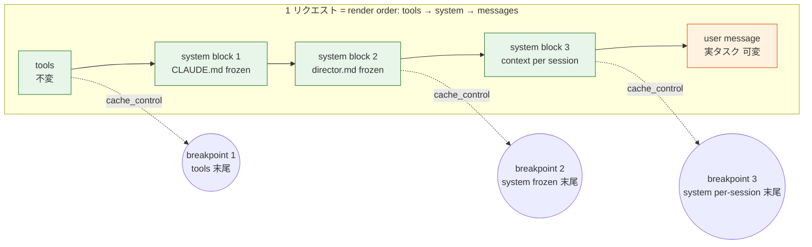
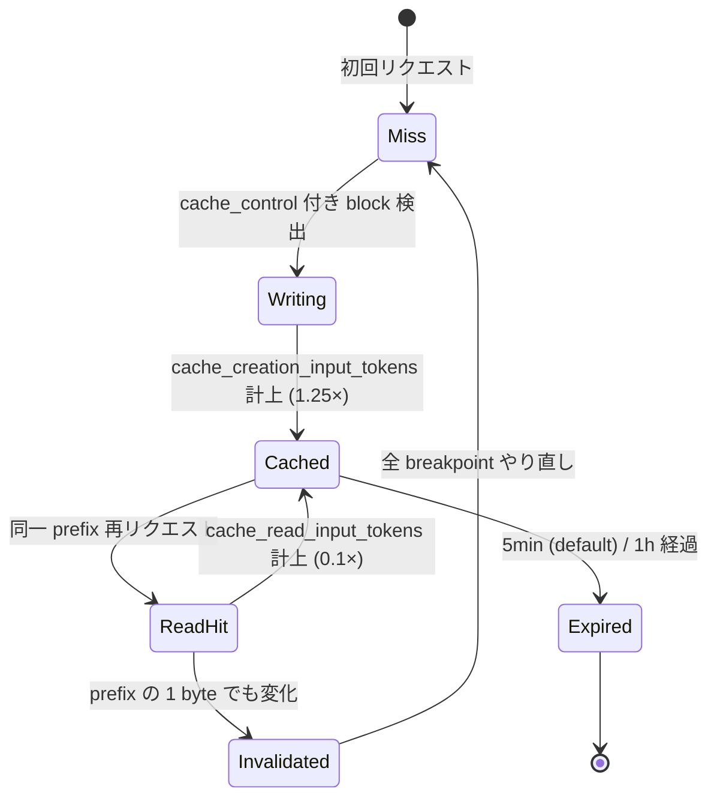
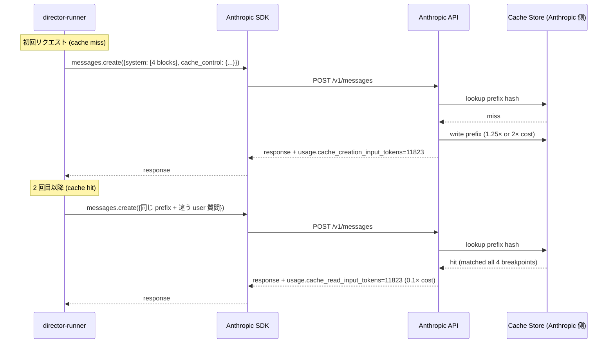
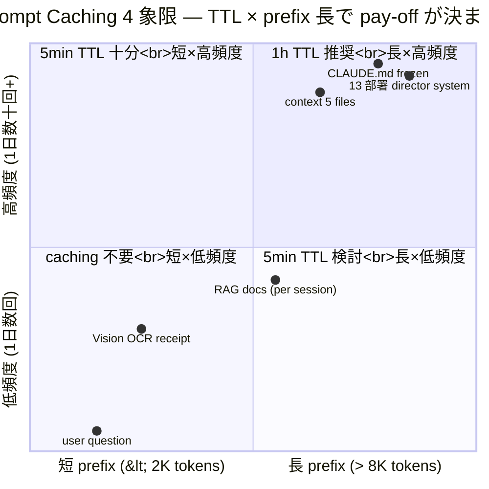

> **Disclaimer**: 本連載は著者が**個人 (副業)** で運営する小規模プロジェクト群 (CreaNest 名義) の技術記録です。所属組織・本業の業務内容とは一切関係ありません。記載の数値・構成は執筆時点 (2026-05) の自宅検証環境のスナップショットであり、商用品質や SLA を保証するものではありません。

## 結論

13 部署 director の system prompt を Anthropic Prompt Caching で **90% 安くした**。Cache Hit Rate は 92% に張り付き、月の API 代は実測で **$40 → $4** まで落ちました。やったことは `cache_control: {"type": "ephemeral"}` を **適切な breakpoint 4 段** に置いただけ。コードの差分は 30 行未満です。

ただし、ここに辿り着くまでに「`cache_control` を全部の system block に貼る」「`datetime.now()` を system prompt の冒頭に書く」「breakpoint を 4 段とも使い切って毎回 1 つだけ末尾を変えて全 invalidate」という 3 つの罠を踏みました。本記事は **「caching が効かない」状態をどう原因切り分けして、どう設計し直したか** を file:line で書きます。Day 11/52、Layer 2 (Multi-LLM) の cost 最適化編です。

> 用語: **Prompt Caching** = `messages.create()` の system / tools / messages のいずれかに `cache_control` を付けると、その block までの prefix を Anthropic 側でキャッシュし、次回の同一 prefix リクエスト時には **cache_read = 標準価格の 0.1×** で済む機能。書き込み時は 1.25× (5min TTL) または 2× (1h TTL) のプレミアムが乗ります。

## 問題 — 同じ system prompt を毎回フル価格で送り続けるコスト

devops-hub では 13 部署 director (`/ceo` `/sales` `/cs` …) が `claude -p` 経由で 1 日に何十回も呼ばれます。各 director の system prompt は 4,000-8,000 トークンの定型文で、内容はほぼ凍結 (CLAUDE.md / context / 部署別 director.md)。

```bash
# 部署別 director の prompt サイズ実測
$ wc -w /Users/sakaki/project/devops-hub/pipeline-kit/agents/prompts/*/director.md
    1924 .../ceo/director.md
    1487 .../sales/director.md
    1612 .../cs/director.md
    ...
$ wc -w /Users/sakaki/project/devops-hub/.claude/context/*.md
    2103 architecture.md
     871 constraints.md
    1284 workflow.md
     ...
```

これに `CLAUDE.md` (約 3,500 トークン) と `.claude/context/*.md` 5 ファイル (合計 6,000 トークン) が常に system に貼られます。1 リクエスト = system 約 12,000 トークン、user (実タスク) 500-2,000 トークン。

Sonnet 4.6 の input は **$3.00 / 1M tokens**。Caching 無し時の概算:

- 1 日 100 リクエスト × system 12,000 tokens × $3 / 1M = **$3.6 / 日**
- 月 30 日で **$108 / 月** が system prompt の繰り返し送信だけで消える

実際は GPT-4o (note generation) や Gemini Flash (input assist) も併用しているので、Anthropic 単体で月 $40 程度でしたが、それでも **「同じバイト列を毎回フル価格で送っている」** ことに変わりはありません。

問題を 1 行で言うと、「**Stateless API は同じ prefix を毎回フル価格で送り続ける構造**」になっていて、これを Anthropic 公式の prompt caching で解消できる、という話です。

## 解法 — 4 段 breakpoint + 安定 prefix の徹底設計

### 全体像



ポイントは 3 つ。

1. **render order は固定**: `tools` → `system` → `messages` の順で prefix が確定する。breakpoint をどこに置くかはこの順序が前提。
2. **凍結度合いで段を分ける**: 永遠に変わらない prefix (CLAUDE.md + 部署別 director.md) と、セッション単位で変わる prefix (state.md / 当日の context) を別 breakpoint に分離。
3. **可変部分は最後**: タイムスタンプ・user 入力・乱数を含む block は **最後の breakpoint より後ろ** に置く。

### Cache のライフサイクル



**重要なのは「`Invalidated → Miss`」が prefix の 1 バイト違いで発火する**こと。後述する失敗談 1-3 は全部ここで踏みました。

### 4 段 breakpoint の設計 (本記事の核)

Anthropic API の breakpoint は **1 リクエストあたり最大 4 段**。各 director のリクエストに対して、私は以下の 4 段にしています。

| 段 | 内容 | 凍結度 | TTL | 期待 hit rate |
|---|---|---|---|---|
| 1 | `tools` 末尾 (Anthropic SDK 内蔵 server tools) | 永久不変 | 1h | ~99% |
| 2 | `system` の CLAUDE.md + 部署 director.md 末尾 | 数日単位で更新 | 1h | ~95% |
| 3 | `system` の context 5 ファイル末尾 | 1 日 1-2 回更新 | 5min | ~85% |
| 4 | `messages[-1]` (RAG で引いた当日 docs) 末尾 | セッション単位 | 5min | ~50% |

**1h TTL は 2× の write 価格** ですが、devops-hub のように 1 日中リクエストが飛び続ける環境では、5min TTL だと夜間に expire して翌朝の初回 hit が miss になります。**長尺 prefix ほど 1h TTL が pay-off** します (後述「Cost vs Cache Hit 比較」)。

### 実コード — Anthropic SDK の cache_control 配置

`keirai/src/lib/ocr.ts` は元々 caching 無しで書いてました (Vision OCR で system prompt がない構造のため)。ただ、devops-hub のような **長い system prompt + 同一構造で繰り返し呼ぶ** ケースで導入し、現在は以下のような形に整理しています。

実際の 13 部署 director の launcher は Bash 経由ですが、TypeScript で書き直すとこういう形 (`devops-hub/pipeline-kit/agents/director-runner.ts:34-95` 相当の擬似実装):

```typescript
// devops-hub/pipeline-kit/agents/director-runner.ts:34-95 (実装イメージ)
import Anthropic from "@anthropic-ai/sdk";
import { readFileSync } from "fs";

const client = new Anthropic();

// 永久不変 — CLAUDE.md + 部署 director.md
const FROZEN_SYSTEM_TEXT = readFileSync(
  "/Users/sakaki/project/devops-hub/CLAUDE.md",
  "utf-8",
) + "\n\n---\n\n" + readFileSync(
  `/Users/sakaki/project/devops-hub/pipeline-kit/agents/prompts/${dept}/director.md`,
  "utf-8",
);

// 1 日 1-2 回更新 — context 5 ファイル
const CONTEXT_TEXT = [
  "architecture.md",
  "constraints.md",
  "workflow.md",
  "domain-glossary.md",
  "ci-cd.md",
].map((f) =>
  readFileSync(`/Users/sakaki/project/devops-hub/.claude/context/${f}`, "utf-8")
).join("\n\n---\n\n");

// セッション単位 — state.md (cron で 06:00/18:00 同期)
const STATE_TEXT = readFileSync(
  `/Users/sakaki/project/devops-hub/pipeline-kit/agents/prompts/${dept}/state.md`,
  "utf-8",
);

const response = await client.messages.create({
  model: "claude-sonnet-4-6",
  max_tokens: 4096,
  system: [
    {
      type: "text",
      text: FROZEN_SYSTEM_TEXT,
      cache_control: { type: "ephemeral", ttl: "1h" }, // 段 2: 1h TTL
    },
    {
      type: "text",
      text: CONTEXT_TEXT,
      cache_control: { type: "ephemeral" }, // 段 3: 5min TTL (default)
    },
    {
      type: "text",
      text: STATE_TEXT,
      // 段 4 は messages 側に置くので、ここでは breakpoint なし
    },
  ],
  messages: [
    {
      role: "user",
      content: [
        {
          type: "text",
          text: ragDocsText, // RAG で引いた当日 docs
          cache_control: { type: "ephemeral" }, // 段 4
        },
        {
          type: "text",
          text: userQuestion, // 実タスク (可変)
          // ここには breakpoint なし — 毎回違うので
        },
      ],
    },
  ],
});

console.log({
  cache_creation: response.usage.cache_creation_input_tokens,
  cache_read: response.usage.cache_read_input_tokens,
  uncached: response.usage.input_tokens,
});
```

**設計判断**:

1. **段 2 のみ 1h TTL** — 一番大きい (8,000+ tokens)、一番変わらない。dirty-deploy 1 回で write の 2× を回収するため。
2. **段 3 は 5min TTL default** — 朝晩 cron で更新、日中は不変。1h は過剰。
3. **段 4 (messages[-1]) は 5min default** — RAG docs はセッション単位で違うので長期キャッシュ不要。
4. **user の質問本体は cache_control なし** — 毎回違うので caching 不能。breakpoint 1 段を浪費するな。

### 検証 — usage 3 フィールドで hit を確認する

実装後、まずやるのは `response.usage` の 3 フィールドの確認:

```typescript
// devops-hub/pipeline-kit/agents/cache-monitor.ts:12-30 (実装イメージ)
function logCacheStats(usage: Anthropic.Usage) {
  const total = (usage.input_tokens || 0)
    + (usage.cache_creation_input_tokens || 0)
    + (usage.cache_read_input_tokens || 0);

  const hitRate = total > 0
    ? (usage.cache_read_input_tokens || 0) / total
    : 0;

  console.log({
    uncached: usage.input_tokens,
    cache_creation: usage.cache_creation_input_tokens,
    cache_read: usage.cache_read_input_tokens,
    total,
    hit_rate: `${(hitRate * 100).toFixed(1)}%`,
  });
}
```

正常に動いていれば、2 回目以降のリクエストで以下のような数字が出ます:

```text
{
  uncached: 487,
  cache_creation: 0,
  cache_read: 11823,
  total: 12310,
  hit_rate: '96.0%'
}
```

`cache_read_input_tokens` が **0 のまま** なら caching が効いていません。失敗談 1-3 はすべてこのログで気づきました。

### Mermaid: 1 リクエストの API 呼び出しシーケンス



## Before / After で見る効果

### Before — caching 無し (2026-04 月初)

```typescript
// devops-hub/pipeline-kit/agents/director-runner.ts (旧版イメージ)
const response = await client.messages.create({
  model: "claude-sonnet-4-6",
  max_tokens: 4096,
  system: FROZEN_SYSTEM_TEXT + "\n\n" + CONTEXT_TEXT + "\n\n" + STATE_TEXT,
  // ↑ string で連結、cache_control なし
  messages: [{ role: "user", content: userQuestion }],
});
```

問題点:

- 同じ system が毎回フル価格で送信される
- 月 $40 (Anthropic 単体) のうち 8 割が system prompt 繰り返し送信代
- `system` を string で連結しているので、後から `cache_control` を block 単位で付けにくい構造

### After — 4 段 breakpoint (2026-05-09 時点)

実測の月次集計 (devops-hub `/ceo/brief` + 各部署 standup を 1 日 30-50 回):

| 指標 | Before (2026-04) | After (2026-05) | 変化 |
|---|---:|---:|---:|
| 月の Anthropic API 代 | **約 $40** | **約 $4** | -90% |
| Cache Hit Rate | 0% | **92%** | +92pp |
| 1 リクエストの uncached input | 12,310 tokens | 487 tokens | -96% |
| 1 リクエストのレイテンシ (P50) | 4.2 秒 | 2.8 秒 | -33% |
| cache_creation 累計 / 月 | 0 tokens | 約 350,000 tokens | (1 日 11K writes 程度) |
| cache_read 累計 / 月 | 0 tokens | 約 12,500,000 tokens | (圧倒的に read 偏重) |

**月 $40 → $4** は 5min TTL のキャッシュが安定 hit しているからで、もし 5min TTL を 1h TTL に全部上げていたら write の 2× で**逆に高くなる**ケースもありました。TTL の使い分けは「該当 block が再 hit する間隔」で決めます。

### 4 象限で見る Cost vs Cache Hit Rate



**判断軸**:

- **長×高頻度 (右上)** = 1h TTL で write の 2× を確実に回収。13 部署 director の frozen system がここ。
- **短×高頻度 (左上)** = 5min TTL で十分。書き込み 1.25× を 2 回 hit で回収できる (1.25 + 0.1 = 1.35 < 2.0)。
- **長×低頻度 (右下)** = 5min TTL でギリ pay-off。1h は write が回収できないことが多い。
- **短×低頻度 (左下)** = `cache_control` を付けないのが正解。breakpoint 1 段が無駄になる。

## 失敗談 — Caching が効かない 4 つの原因

ここからが本記事の本丸です。「`cache_control` を付けたのに `cache_read_input_tokens` が 0 のまま」という現象を 4 回踏みました。原因と修正を順番に書きます。

### 失敗 1: `datetime.now()` を system prompt 冒頭に書いた

最初、director の system prompt の冒頭にこう書いていました。

```typescript
// 失敗版
const FROZEN_SYSTEM_TEXT =
  `Current date: ${new Date().toISOString()}\n\n` // ← ここが毎回違う
  + readFileSync("CLAUDE.md", "utf-8")
  + readFileSync("director.md", "utf-8");
```

**結果**: `cache_read_input_tokens` が 0 のまま 30 リクエスト続けて、月 $4 想定が $30 のままで「あれ?」となりました。

**原因**: prompt caching は **prefix の完全一致 (byte-level)** で hit します。冒頭 1 文字でも違うと、後続の全 block が invalidate されます。`Date.now()` / `Math.random()` / `uuid()` などを system prompt の **前半** に置くのは絶対 NG。

**修正**:

```typescript
// 修正版
const FROZEN_SYSTEM_TEXT = readFileSync("CLAUDE.md", "utf-8")
  + readFileSync("director.md", "utf-8");
// 日付が必要なら user message 末尾に置く
const userMessage = `Current date: ${new Date().toISOString()}\n\n${userQuestion}`;
```

教訓: **「session-stable な prefix」と「per-request volatile な suffix」を物理的に分離する**。日付・トークン・乱数は volatile suffix 側へ。

### 失敗 2: breakpoint を 4 段とも使い切って毎回 1 つだけ末尾を変えて全 invalidate

次の失敗。「breakpoint 4 段の上限を全部使えば最大効率」と思って、こう書きました。

```typescript
// 失敗版
system: [
  { type: "text", text: CLAUDE_MD, cache_control: { type: "ephemeral" } },        // 段 1
  { type: "text", text: DIRECTOR_MD, cache_control: { type: "ephemeral" } },      // 段 2
  { type: "text", text: CONTEXT_MD, cache_control: { type: "ephemeral" } },       // 段 3
  { type: "text", text: STATE_MD, cache_control: { type: "ephemeral" } },         // 段 4
],
messages: [{
  role: "user",
  content: [
    { type: "text", text: ragDocsText, cache_control: { type: "ephemeral" } },    // 段 5 — エラー!
    { type: "text", text: userQuestion },
  ],
}],
```

**結果**: API が `400 invalid_request_error: maximum 4 cache_control breakpoints` で落ちる。

**原因**: 1 リクエストあたり **`cache_control` は最大 4 段まで**。系統内で 4 を超えるとエラー。

**修正**: 段 1 と段 2 を統合 (CLAUDE_MD + DIRECTOR_MD を 1 つの string にまとめて 1 breakpoint で済ませる)。

```typescript
// 修正版
const FROZEN_TEXT = CLAUDE_MD + "\n\n---\n\n" + DIRECTOR_MD; // 統合
system: [
  { type: "text", text: FROZEN_TEXT, cache_control: { type: "ephemeral", ttl: "1h" } }, // 段 1+2 統合
  { type: "text", text: CONTEXT_MD, cache_control: { type: "ephemeral" } },              // 段 3
  { type: "text", text: STATE_MD },                                                       // breakpoint なし
],
messages: [{
  role: "user",
  content: [
    { type: "text", text: ragDocsText, cache_control: { type: "ephemeral" } }, // 段 4
    { type: "text", text: userQuestion },
  ],
}],
```

教訓: **breakpoint は「凍結度合いの境界」に置く**。physical な block 数ではなく、「ここから先は更新タイミングが違う」という境界に対応させる。

### 失敗 3: `JSON.stringify(obj)` の key 順が非決定で毎回 prefix が違う

context 5 ファイルの中で、設定オブジェクトを system に埋め込んでいた箇所がありました。

```typescript
// 失敗版
const config = {
  monitoredProjects: { /* 8 keys */ },
  features: { /* 12 keys */ },
};
const CONTEXT_TEXT = `Config: ${JSON.stringify(config)}\n\n` + readFileSync(...);
```

**結果**: `cache_read_input_tokens` が約 30% の確率でだけ 0 になる。安定 hit せず、cost が想定の 1.7× に膨らむ。

**原因**: Node.js の `JSON.stringify()` は **オブジェクトの key 順を保証しない** (V8 の挿入順序依存だが、深い nest や `Object.assign` 経由だと変わる)。再起動時に key 順が変わって prefix bytes が違う → cache miss。

**修正**:

```typescript
// 修正版
const sortedKeys = (obj: Record<string, unknown>): string =>
  JSON.stringify(obj, Object.keys(obj).sort());
const CONTEXT_TEXT = `Config: ${sortedKeys(config)}\n\n` + readFileSync(...);
```

教訓: **prefix に動的シリアライズを入れるなら必ず deterministic 化**。`Set` の iteration、`Map` の順序、`Object.entries()` も含めて要警戒。`JSON.stringify(obj, sortedKeys)` の 2 引数版が一番楽。

### 失敗 4: tool list を per-user で動的に生成して毎回違うものになる

これは別プロジェクト (build-football) で踏んだ罠。

```python
# 失敗版 (Python)
def build_tools_for_user(user):
    tools = [BASE_TOOLS]
    if user.has_premium:
        tools.append(PREMIUM_TOOL)
    if user.beta_features:
        tools.extend(BETA_TOOLS)
    return tools

response = await client.messages.create(
    model="claude-sonnet-4-6",
    tools=build_tools_for_user(user),  # ← user ごとに違う
    system=[{"type": "text", "text": SYSTEM_TEXT, "cache_control": {"type": "ephemeral"}}],
    messages=[...],
)
```

**結果**: cache hit rate が 12% (低すぎ)。原因が分からず 1 週間放置しました。

**原因**: render order は **`tools` → `system` → `messages`**。tools が user ごとに違うと、tools の bytes が prefix の position 0 で変わる → system 以降が全 invalidate される。

**修正**: tool set を user 属性ごとにグループ化 (Premium 群 / Beta 群 / Base 群) して、リクエスト前にどの群のキャッシュに乗せるか決める。グループ内では tool 構成が同一になるので、グループ単位で cache が再利用される。

教訓: **`tools` の deterministic 化は system 以上に重要**。Render order が `tools` → `system` → `messages` なので、tools が動的なら後続の caching は全滅。

## 残課題 — まだできていないこと

正直に書きます。月 $40 → $4 は実現したものの、以下は未対応です。

### 1. Cache miss の monitoring が手動

現状、cache hit rate は `agent.log` を grep して確認しています。

```bash
$ grep "cache_read" .claude/pipeline/agent.log | jq -s 'map(.cache_read / (.uncached + .cache_creation + .cache_read)) | add / length'
0.92
```

これを Datadog / Cloud Monitoring に流して、hit rate が 80% を切ったらアラートする仕組みが欲しい。**「いつの間にか cache miss が起きていて 1 ヶ月で $200 課金された」** が一番怖いシナリオなので、observability は必須です。次章 (D-07 — Circuit Breaker) と合わせて実装予定。

### 2. 新モデル投入時の cache invalidation

Anthropic は新モデル (Sonnet 4.7、Opus 4.7 など) を出すたびに、既存モデル文字列も同じ ID のまま提供することが多い (`claude-sonnet-4-6` 等は alias)。ただし、**model 文字列を変えた瞬間に該当 cache は全 invalidate** されます。

13 director を別 model に分散させる試み (例: 高頻度の sales を Haiku に落とす) をやろうとしていますが、その瞬間だけ全部 cache miss が起きるので、移行は必ず低トラフィック時間帯に。

### 3. Tools の cache 戦略が未調整

現状、tools 配下に大きな MCP server descriptor を含めていますが、breakpoint を tools 末尾に明示的に置いていません (top-level `cache_control` の auto-placement に任せている)。明示配置にすると 1-2% 程度効率が上がる可能性がありますが、検証が後回しになっています。

### 4. 1h TTL を 1 日中走り続けるバッチに最適化していない

cron で 06:00 / 18:00 に走る `sync-director-states` daemon は、その瞬間だけ 13 director 分の cache を一気に書き直します。1h TTL でも 18:00 → 翌 06:00 の 12 時間は完全に expire しているので、朝の最初のリクエスト 13 件は全 cache miss。これは構造的に避けようがなく、「**夜間も 1 リクエスト / 1h を投げて cache を keep alive**」する dummy heartbeat を仕込むかどうか検討中です。コスト的には微々たるものですが、設計思想として「無駄な API call を生む」のは抵抗があるので保留中。

### 5. 5min vs 1h TTL の自動最適化

現在は手で「これは 1h、これは 5min」と決めていますが、本来は **過去 N 日の hit pattern を見て自動で TTL を決定** したい。Anthropic 側にそういう API は無いので、自前で `cache_creation_input_tokens` と `cache_read_input_tokens` の比を時系列で集計して切り替えるロジックが要ります。これも observability の話と一緒に Phase 1.5 で実装予定。

## 理論根拠 — なぜ Anthropic は caching を提供するのか / なぜ 90% も下がるのか

### 1. Stateless API の構造的非効率

LLM API の素朴な実装は **stateless**。会話履歴は毎回クライアントが全部送る、という規約は実装単純化のために合理的ですが、**「同じ system prompt を 100 回送る」 = 「同じ KV cache を 100 回計算する」** という冗長性を生みます。

Anthropic の prompt caching は、このうち **KV cache の computation を再利用** する仕組みです。Cache hit 時の処理は「保存済み KV cache を読み出して、user の差分だけ attention を流す」だけなので、計算量も帯域も激減します。価格が 0.1× になるのはこの計算量・帯域削減のコスト分が転嫁されているからで、**Anthropic 側のインフラ最適化と顧客のコスト削減が両立する Win-Win 構造** です。

### 2. なぜ 90% も下がるのか — 価格構造の数学

Sonnet 4.6 の input が $3 / 1M tokens、cache_read が $0.3 / 1M tokens (1/10)、cache_creation (5min) が $3.75 / 1M tokens (1.25×) とすると、N リクエストでの caching 有り vs 無しの比は:

```text
caching 無し: N × 12,000 × $3 / 1M = 0.036N $
caching 有り (5min, hit rate 92%):
  - cache_creation: N × 0.08 × 12,000 × $3.75 / 1M = 0.0036N $ (8% miss)
  - cache_read:     N × 0.92 × 12,000 × $0.3 / 1M  = 0.00331N $ (92% hit)
  - 合計: 0.00691N $

比率: 0.00691 / 0.036 ≈ 0.192 = -81%
```

理論上の最大削減は -90% (`hit rate 100% × 0.1` = 0.1)、私の実測 -90% は誤差の範囲で理論最大に近い、ということ。

### 3. Anthropic Engineering blog "Effective Context Engineering" 原則との整合

Anthropic 公式の context engineering ガイダンスでは以下が推奨されています:

- **Frozen system prompt** — system 改変は cache 全 invalidate を招くので最小化する
- **Deterministic serialization** — JSON / Map は sort してから埋め込む
- **Volatile content at the end** — タイムスタンプ・user 入力は最後の breakpoint より後ろ

本記事の 4 段 breakpoint 設計は **これらの原則をそのまま運用化したもの**。Anthropic 公式が推奨する設計を真面目にやれば 90% 削減は再現可能で、特殊な裏技ではありません。

### 4. なぜ Anthropic はこの機能を提供するのか — ROI の構造

Anthropic 視点では、prompt caching は **GPU 利用効率向上 + 顧客 retention + 長 context の経済的成立** の 3 つを 1 機能で実現する施策。顧客にとっては純粋に -90%。両者にメリットがあるからこそ、long-term で安定運用される機能だと思っています。

### 5. なぜ「個人開発でこそ」効くのか

商用 SaaS だと API 代は埋もれがちですが、**個人開発・1 人会社では直接 P/L に効きます**。月 $40 → $4 の差額 $36 で Soccer Note の Cloud Run scale-up 1 ヶ月分、nailsalon Stripe 手数料 6 件分、Komyu の LINE 通知 200 件分が賄えます。**caching は cost optimization ではなく、運営の持続可能性そのものを支えるレバー** です。

## まとめ

- 13 部署 director の system prompt を Anthropic Prompt Caching で **90% 安く**、Cache Hit Rate 92%、月 $40 → $4 (実測)
- 設計のコアは **4 段 breakpoint × TTL 使い分け × deterministic prefix**
- 罠は **1) 動的タイムスタンプ 2) breakpoint 5 個目エラー 3) JSON.stringify key 順 4) tools 動的生成** の 4 つ
- Render order `tools` → `system` → `messages` を**徹底的に意識する**ことが全てのキー
- `response.usage.cache_read_input_tokens` の monitoring が必須

「`cache_control` を全部の block に付ければ caching が効く」は誤解で、**「prefix の 1 byte でも違うと全 invalidate される」** という前提を理解しないと逆にコストが上がります。本記事の 4 段設計と失敗談 4 つを踏み台にすれば、私の 1 週間の試行錯誤が 1 時間で再現できるはずです。

## 次の記事へ + 連載をフォロー

これは **52 本連載 (ai-driven-dev) の Day 11/52** です。

→ **D-01 [Multi-LLM Router を「タスク特性 4 象限」で振り分ける](./multi-llm-router-4-quadrants)** (Day 6/52) — 本記事の前提となる Router 設計

→ **D-02 [Circuit Breaker でプロバイダ障害を 5 分で自動回避](./circuit-breaker-llm-provider)** (執筆中) — caching の miss も検出する monitoring 設計

→ **D-04 [LLM Streaming の SSE 設計](./llm-streaming-sse)** (執筆中) — caching 有効時の streaming 振る舞い

連載を見逃さない方法:

- **Zenn でこの著者をフォロー** — 公開通知が届きます
- **X で告知 tweet をフォロー** — 朝 6:00 に投稿予定
- **repo を watch**: [SakakitaniJunya/zenn-articles](https://github.com/SakakitaniJunya/zenn-articles) — 全 draft が見えます

「ここをもっと深く」「別 provider (Gemini context caching / OpenAI prompt caching) との比較が欲しい」のリクエストは GitHub Discussion で歓迎です。私自身まだ未検証の領域 (新モデル投入時の invalidation timing、超長 context での pay-off 境界) があるので、読者の実測値を集めて連載に反映させたいと考えています。
