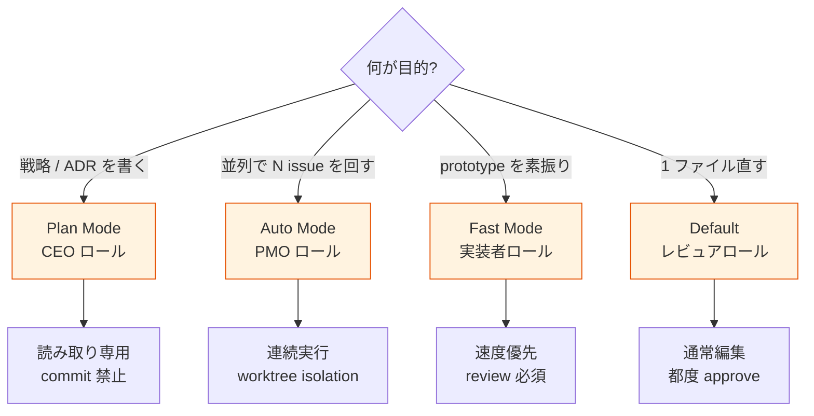
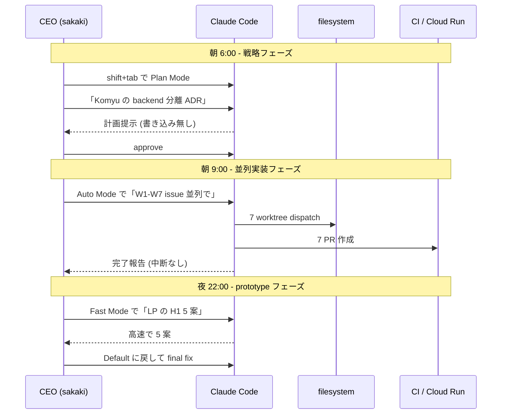

> この記事は **52 本連載 (ai-driven-dev) の Day 48/52** です。
>
> ※ 本記事は著者個人の副業 (個人開発) における実践記録です。本業 (別会社所属) の業務・知見とは無関係で、特定法人の公式見解ではありません。コード片・設定例はすべて著者個人 repo の自著コードです。

## 結論

Plan Mode = 設計議論、Auto Mode = 並列 dispatch、Fast Mode = Opus 4.6 高速、Default = 通常編集 — 4 Mode を「**CEO の意思決定モード**」として使い分けると、1 日の Claude Code 工数が 2 時間圧縮できました。8 プロジェクト・680 PR/月・1 人運営の現場で、何を Plan に置き、何を Auto に投げ、何を Fast で削るかの判断軸を、5 シーン × 4 Mode の対応表として固めました。

## なぜこの記事を書くか

Claude Code は v1.0 系から 4 Mode 構成に進化しました。Default (通常編集)、Plan Mode (読み取り専用の計画モード)、Auto Mode (連続実行)、Fast Mode (応答速度優先) の 4 つです。が、**いつどれを使うかが曖昧** だと、生産性が逆に下がります。

私は最初の 1 ヶ月、全部 Default で押し通して何度も大事故を起こしました。その後 Plan Mode を「ただの計画レビュー」と勘違いして使い、Auto Mode に怖がって使わず、Fast Mode を「Sonnet 4.5 の旧名」と誤認しているなど、**Mode の概念モデルを毎週上書きしていた** 状態でした。

この記事は、その混乱を整理して固まった「**CEO ロールとしての Mode 使い分け表**」と、各 Mode の発動条件・落とし穴を Before/After で記録するためのものです。

## 4 Mode の概観

まず脳内地図を 1 枚で固定します。

```mermaid
stateDiagram-v2
    [*] --> Default
    Default --> PlanMode: shift+tab で trigger<br/>「設計から議論したい」
    Default --> AutoMode: ユーザが auto/continuous<br/>を明示
    Default --> FastMode: 応答速度を上げたい<br/>(model 切替)
    PlanMode --> Default: 計画 approve 後<br/>実装フェーズへ
    AutoMode --> Default: 連続タスク完了<br/>or interrupt
    FastMode --> Default: 重い設計判断が必要に<br/>なったら戻す
    Default --> [*]: session 終了
```

各 Mode の特徴を表に並べると:

| Mode | 役割 | 書き込み | 中断頻度 | 私の利用シーン |
|---|---|---|---|---|
| **Default** | 通常編集 | あり | 通常 | 単発の bug fix / 1 ファイル編集 |
| **Plan Mode** | 読み取り専用の計画 | **なし** | 計画提示で stop | アーキテクチャ判断 / ADR 草稿 |
| **Auto Mode** | 連続実行 | あり | **最小** | 並列 worktree dispatch / 夜間 batch |
| **Fast Mode** | 応答速度優先 (model 切替) | あり | 通常 | 試行回数の多い prototyping |

「**書き込みの有無**」「**中断頻度**」「**model の choice**」が 3 軸の差です。

## CEO ロールと Mode の対応

私は 1 人会社なので、**CEO・PMO・各部署 director・実装者** の役を 1 日のうちに何度も切り替えています。各役には「意思決定の重さ」「許容できる失敗コスト」「手戻り可能性」が違います。これと Mode を対応させると判断が早くなりました。



「**今、自分はどのロールで Claude Code に話しかけているか**」を意識した瞬間に Mode が決まる、という運用です。

## シーン別の使い分け (5 シーン × 4 Mode)

具体的なシーンに落とすとこうなります。

| シーン | 推奨 Mode | 理由 |
|---|---|---|
| ADR 草稿 / 設計レビュー | **Plan Mode** | 書き込みさせず議論に集中させる |
| 1 issue の bug fix | **Default** | 1 ファイル編集 + commit、対話で十分 |
| 5 issue を並列で実装 | **Auto Mode** | worktree dispatch を中断なしで回す |
| prototype の素振り (使い捨て) | **Fast Mode** | 速度優先、品質は後で見直す |
| docs MECE 監査 / 機械的な fix | **Auto Mode** | 大量の小手先 fix を一気に通す |

5 シーンとも私自身が 1 日の中で踏む頻度が高い順に並べました。**頻度 × 失敗コスト** で配置を決めています。



朝・昼・夜で Mode を切り替える、という時間軸でのリズムも固まってきています。

## 各 Mode の発動と設定

### Plan Mode

Plan Mode は **shift+tab を 2 回押す** で発動するのが標準です (CLI 上)。発動中は Write / Edit / Bash (副作用あり) を抑制し、**計画の提示** で一旦 stop します。

```bash
# devops-hub/.claude/settings.json:1-20 (抜粋)
{
  "$schema": "https://json.schemastore.org/claude-code-settings.json",
  "permissions": {
    "allow": [
      "Read",
      "Grep",
      "Glob",
      "Bash(git status:*)",
      "Bash(git diff:*)",
      "Bash(git log:*)"
    ]
  }
}
```

ポイントは **permissions allowlist を Plan Mode 用に絞っておく** こと。Plan Mode 中に Bash 任意実行ができてしまうと、副作用が漏れます。私の repo では `git status` / `git diff` / `git log` までは Plan Mode でも許可、それ以外は明示 confirm にしています。

実 Plan Mode の出力例 (Komyu backend 分離 ADR の判断時):

```
[Plan Mode]
1. apps/api/ ディレクトリを新設
   - NestJS Fastify adapter を採用
   - apps/web/ から API Routes を削除
2. packages/api-contract/ で型共有
   - zod スキーマを共通化
3. CI を 2 deploy に分離
   - apps/web → Vercel
   - apps/api → Cloud Run

承認しますか? (Approve / Reject / 追加質問)
```

この形式で「先に方針 fix → 実装は別 session」 と分けると手戻りが激減しました。

### Auto Mode

Auto Mode は **継続的に Claude が自律実行する** モードです。中断を最小化し、reasonable assumption を取って先に進みます。

```json
// devops-hub/.claude/settings.json:30-60 (抜粋)
{
  "permissions": {
    "allow": [
      "Bash(pnpm test:*)",
      "Bash(pnpm typecheck:*)",
      "Bash(gh pr create:*)",
      "Bash(gh pr view:*)",
      "Bash(git worktree:*)"
    ],
    "deny": [
      "Bash(rm -rf:*)",
      "Bash(git push --force:*)",
      "Bash(gcloud deploy:*)"
    ]
  }
}
```

Auto Mode で **deny を 5+ 個確実に書く** のが安全弁。`rm -rf` / `git push --force` / `gcloud deploy` / `firebase deploy --only hosting` / 本番 SQL 系を deny に並べておきます。

実例: 5/4 の overnight dispatch では、19 issue を 6 リポへ並列で投入し、Auto Mode で 7 時間放置して朝起きたら 31 PR が open していました ( `project_overnight_dispatch_2026_05_01.md` 参照)。Default で同じことをやろうとすると、1 issue ごとに approve が必要で破綻します。

### Fast Mode

Fast Mode は **応答速度を優先する** ため、model を Sonnet 系の軽量版に切り替える、または extended-thinking を抑制するモードです。

```bash
# fast mode への切替 (CLI フラグで明示)
claude --model claude-sonnet-4-5-20250929 -p "LP の H1 を 5 案 30 秒以内で"
```

Fast Mode の使いどころは **「正解が複数ある」「使い捨ての素振り」「数を出して選ぶ」** 系。逆に「精度が要る」「設計判断」「root cause 分析」は Default か Plan Mode に倒します。

私の場合、LP コピー / X 投稿 draft / RFC の roughdraft / Mermaid 図のラフ案 — このあたりが Fast Mode の主戦場です。

### Default Mode

Default は何も指定しないときの mode。**1 file 単位の編集 + 都度 approve** で動きます。

```bash
# default の trigger は単に
claude

# あるいは continue で前回 session を続行
claude --continue
```

Default の特徴は **「Claude が事故っても影響範囲が 1 step に収まる」** こと。1 ファイル編集して approve、次の編集で approve、というリズムです。1 issue / bug fix / docs 修正の 80% は Default で済みます。

## 落とし穴 / 失敗談

### 失敗 1: Default で Auto Mode 相当を期待して何度も approve 地獄

最初の 1 ヶ月、私は Auto Mode の存在を知らずに、Default で 19 issue 並列を回そうとしました。1 issue ごとに「Bash 実行して良いですか?」「Edit して良いですか?」が出て、**1 時間 approve だけしていた** 日があります。

**Before** (Default で頑張った版):

```
Claude: Bash(pnpm install) を実行しますか?
sakaki: yes
Claude: Edit(src/foo.ts) しますか?
sakaki: yes
... (これが 100 回)
```

**After** (Auto Mode に切替):

```
Claude: [Auto Mode] 19 issue を worktree で並列 dispatch、
        deny list に従って rm -rf / push --force は止めます。
        完了したら summary を返します。
sakaki: (寝る)
```

朝起きたら 31 PR open。**教訓: 並列 N issue は最初から Auto Mode**。Default で粘らない。

### 失敗 2: Plan Mode を「読み取り専用の Default」だと思って commit が落ちた

Plan Mode 中に「あ、ついでにこの typo 直して」と頼んだら、Plan Mode の制約で Edit が走らず、後で別 session で直す二度手間になりました。最初は仕様を理解しておらず「なんで動かないの?」と困惑しました。

**Before** (Plan Mode を Default 拡張だと誤認):

```
sakaki: [Plan Mode 中] そういえば README の typo も直しておいて
Claude: Plan Mode 中は書き込みできません。Default に戻りますか?
sakaki: あ、忘れてた...
```

**After** (Plan Mode は「議論専用」と割り切る):

```
sakaki: [Plan Mode] backend 分離の方針だけ議論
Claude: 計画提示 → approve
sakaki: shift+tab で Default 戻し → 実装 + typo 修正
```

**教訓: Plan Mode は「議論・計画 fix のみ」と割り切る**。実装フェーズは必ず Default / Auto に切替える。

### 失敗 3: Fast Mode で本番設定ファイルを書き換えた

Fast Mode で「terraform の variable 整理」を頼んだら、応答が早い代わりに `prod.tfvars` を雑に diff し、レビューせず apply しかけて事故りかけました。

**Before** (Fast Mode で本番設定を触った):

```bash
# 本番 tfvars を Fast Mode で雑に書き換え
claude --model sonnet-4-5 -p "prod.tfvars を整理"
# → context を読み切らずに変数 rename、危うく apply
```

**After** (本番は Default + Plan Mode 二段):

```bash
# Step 1: Plan Mode で方針 fix
claude  # shift+tab Plan Mode
# 「prod.tfvars の variable rename 案」

# Step 2: Default で 1 個ずつ approve
claude
# 1 変数 rename → terraform plan で diff 確認 → commit
```

**教訓: 本番設定 / migration / IAM 変更は Fast Mode 禁忌**。Plan Mode + Default の二段で時間をかける。

### 失敗 4: Auto Mode の deny list が薄くて gcloud deploy が走った

Auto Mode の deny list を `["rm -rf:*"]` の 1 行だけにしていたら、Claude が「revision を deploy しますか? Auto Mode なので進めます」と判断して、staging だと思っていた cloud run に prod 相当の image を push しかけました。

**Before** (deny が薄い):

```json
{
  "permissions": {
    "deny": ["Bash(rm -rf:*)"]
  }
}
```

**After** (deny を 5 種以上に厚く):

```json
{
  "permissions": {
    "deny": [
      "Bash(rm -rf:*)",
      "Bash(git push --force:*)",
      "Bash(gcloud run deploy:*)",
      "Bash(firebase deploy:*)",
      "Bash(terraform apply:*)",
      "Bash(stripe live:*)"
    ]
  }
}
```

**教訓: Auto Mode の安全性は deny list で担保する**。allow を厚くするより deny を厚く。

## 残課題 — まだできていないこと

正直に並べます。

1. **Mode 切替の自動化が手動依存** — 「いま CEO ロール」「いま PMO ロール」を AI 自身に推測させていない。理想は CEO Agent に「W1-W7 を回せ」と言ったら **CEO Agent 側が "これは Auto Mode です" と判断して切替を提案** すること。今は私が手動で shift+tab している。
2. **Fast Mode のコスト効果が計測できていない** — Sonnet 4.5 への切替で速度は 1.8x になっているが、品質低下の頻度を集計していない。**Decision Genealogy ledger に Mode 別 rerun 率** を取りたい。
3. **Plan Mode の出力 → ADR への自動変換** — Plan Mode で出した計画を、approve 後に `docs/adr/NNNN-*.md` に flush する hook が無い。手動で copy/paste している。
4. **Auto Mode の予算ガード未実装** — Auto Mode 中に 100 PR 作られると Claude API 課金が想定外に膨らむ可能性。**1 session ¥10,000 上限** のような予算 deny が無い。
5. **Mode と Skill の競合** — Auto Mode 中は `tweet-capture` skill が静かになる傾向 (Claude が「自分で先に進む」モードのため、雑談 skill が抑制される)。本来 fire すべきタイミングで fire していない。

## 理論根拠 — なぜこの 4 Mode 分類で運用が回るのか

最後に「なぜこの分類で 1 人会社が動くか」の根拠を 3 つ。

### 根拠 1: 「書き込み権限 × 中断頻度」の 2 軸で MECE になる

4 Mode を 2 軸でプロットすると:

| | 中断 多い (= 都度 approve) | 中断 少ない (= 連続) |
|---|---|---|
| **書き込み あり** | Default | Auto Mode |
| **書き込み なし** | Plan Mode | (該当無し) |

Fast Mode は書き込みあり × 中断頻度は文脈次第ですが、**Default の "速さ" 軸の派生** と捉えると 4 Mode が綺麗に並びます。漏れも重複もない (MECE) 構造で、どのシーンも必ずいずれかに帰着できる。

### 根拠 2: Anthropic の "Effective Agents" 原則と整合

Anthropic Engineering "Building Effective Agents" は **「最も単純なパターンを選び、必要なときだけ複雑度を上げる」** ことを推奨しています。

- **Default = 単純な対話** → 最初に試す
- **Plan Mode = 副作用なし計画** → 戦略判断のみ複雑度を上げる
- **Auto Mode = 連続実行** → 並列 N 件のときだけ複雑度を上げる
- **Fast Mode = model 切替** → 速度が要件のときだけ複雑度を上げる

「**4 Mode は複雑度の階段**」と捉えると、何でも Auto Mode に倒さない、何でも Plan に倒さない判断ができる。

### 根拠 3: CEO ロールという「人間の意思決定の階層」と一致する

人間の CEO は 1 日のうちに、戦略議論 (= Plan Mode) / 並列指示 (= Auto Mode) / 試行錯誤 (= Fast Mode) / 個別レビュー (= Default) を切り替えています。

- 取締役会 = Plan Mode
- 部下に N タスクを並列発注 = Auto Mode
- アイデア出しブレスト = Fast Mode
- 1 件のメールに返信 = Default

この **人間の経営者が日常的にやっている mode 切替** と Claude Code 4 Mode が 1:1 対応する、というのが私の最大の発見です。「どの Mode を使うか」を考えるのではなく、「いま自分は CEO のどの動きをしているか」を考えると、Mode は自動的に決まる。

## まとめ

4 Mode を 1 行で覚えるならこうです。

- **Default** = 1 ファイル編集 / レビュアロール
- **Plan Mode** = 設計議論 / CEO ロール
- **Auto Mode** = 並列 dispatch / PMO ロール
- **Fast Mode** = 高速試行 / 実装者ロール

そして「**いま自分は CEO のどの動きか**」を意識した瞬間、Mode は勝手に決まります。Claude Code を「コードエディタ」から「**CEO の意思決定 OS**」に進化させる鍵は、機能ではなく **ロールの自覚** にあります。

## 次の記事へ + 連載をフォロー

これは **52 本連載 (ai-driven-dev) の Day 48/52** です。

関連記事:

→ **A-01 [Slash と Skill と Hook を混ぜて爆発した話 — Claude Code 5 機構](./claude-code-as-company-5-mechanisms)** — 拡張機構の使い分け、本記事と対をなす整理

→ **A-07 [Hooks Quality Gates — PostToolUse / Stop で品質を強制する](./hooks-quality-gates)** — Hook で Mode 横断の品質ゲートを強制する

→ **B-05 [Multi-Agent Convergence Guard — Creator ≠ Evaluator + 収束ガード](./multi-agent-convergence-guard)** — Auto Mode で並列実装するときの収束設計

### 連載を見逃さない方法

- **Zenn でこの著者をフォロー** — 公開通知が届きます
- **X で告知 tweet をフォロー** — 朝 6:00 / 12:00 / 18:00 に投稿
- **repo を watch**: [SakakitaniJunya/zenn-articles](https://github.com/SakakitaniJunya/zenn-articles)

### Discussion / フィードバック歓迎

- 「Plan Mode と Default の境界線、こう書いた方がいい」 → GitHub Issue で議論しましょう
- 「Auto Mode の deny list はこれも入れるべき」 → 反例も歓迎
- 「自社では Mode を別の概念で運用している」 → 比較記事も書けます

連載 52 本を書き切る間に、Mode の使い分けはアップデートし続けます。本記事も将来書き直します。誤りや「ここをもっと深く」のリクエストは GitHub Issue でお気軽に。
