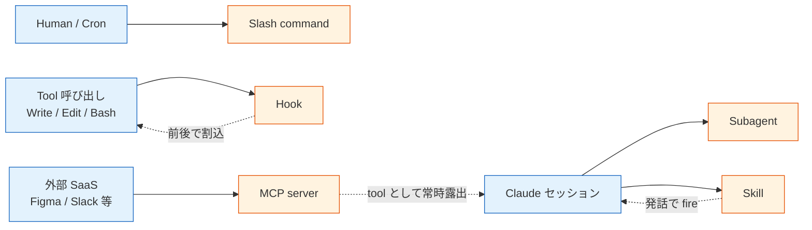

> この記事は **52 本連載 (ai-driven-dev) の Day 2/52** です。第 1 回 [Claude Code で「会社」を回す 6 層構成 — 52 本連載 INDEX](./ai-driven-dev-index-2026) から続きます。
>
> ※ 本記事は著者個人の副業 (個人開発) における実践記録です。本業 (別会社所属) の業務・知見とは無関係で、特定法人の公式見解ではありません。コード片・設定例はすべて著者個人 repo の自著コードです。

## 結論

- Claude Code の拡張機構は **Slash / Subagent / Hook / Skill / MCP** の 5 つに整理できます。
- 役割を分けて使うと、ただのエディタ補助だった Claude Code が「**1 人会社の OS**」に化けます。
- ただし 1 機構で全部やろうとすると破綻します。私は最初に Slash command へ全部詰めて爆発させ、Hook に typecheck を仕込んで編集が止まり、Skill description が曖昧で発火しない地獄を順番に踏みました。

## なぜこの記事を書くか

5 つあるのに名前が似ているせいで「これは Skill にすべきか Hook にすべきか?」で毎回迷う、という声をよく聞きます。私はこの 1 年、Claude Code を「コードを書く道具」ではなく「会社の運営基盤」として使ってきました。本記事はその過程で固まった「**どの機構を何に使うか**」の判断軸と、踏んだ罠の Before/After 集です。

## 5 機構の関係図

まず脳内地図を 1 枚で固定します。



「**何が起点か**」で 5 機構が綺麗に分かれます。Human/Cron が起点なら Slash、Claude 自身が判断するなら Subagent / Skill、tool 呼び出しに紐づくなら Hook、外部 SaaS との接続なら MCP。

| 機構 | 一言で | 起動条件 | 私の実例 |
|---|---|---|---|
| Slash command | 人間が呼ぶ手順書 | `/<name>` 入力 (or cron 経由) | `/zenn-next` `/orchestrate <issue>` |
| Subagent | 別腹の context | 親が `Agent` tool で呼ぶ | `Explore` (grep)、`agent-improver` |
| Hook | 必ず走る品質ゲート | PreToolUse / PostToolUse / Stop | docs MECE 監査、agent.log 追記 |
| Skill | 会話シグナルで fire | description にマッチ | `tweet-capture`、`deploy-verification` |
| MCP | 外部システムとの口 | tool として常時露出 | `figma` 公式 server |

以下、私の実運用で順に見ます。

### 1. Slash command — 人間が呼ぶ手順書

`.claude/commands/<name>.md` に Markdown で置くだけで `/<name>` で呼び出せるカスタムコマンドになります。中身は **手順を自然言語で書いた指示書**。

```markdown
<!-- zenn-articles/.claude/commands/zenn-next.md:1-15 -->
# /zenn-next — Zenn 記事 draft 生成

`topic-queue.yaml` から次の pending topic を 1 件 pop し、
`articles/<slug>.md` に draft を書き出す。

## 実行手順
### Step 1: 規約読込
以下を Read して必ず守る:
1. voice.md
2. frontmatter-spec.md
...
```

ポイントは **「人間がいつ呼ぶか決める」** こと。毎朝 5 時の cron から `claude -p "/zenn-next"` で叩けば、launchctl のタイマーがそのまま slash command の発火条件になります。

devops-hub では同じ思想で `/orchestrate <issue>` (パイプライン全体実行)、`/spec`、`/implement`、`/review`、`/strategy` などを並べています。「**人間 (または cron) が起点である**」「**再現可能な手順を持つ**」仕事は全部 Slash command が向きます。

### 2. Subagent — 別腹の context を持たせたい仕事

Subagent は **親の context window を汚さずに別エージェントに調査や実装を任せる** 機構です。`Agent` tool 経由で呼びます。

組み込みでは `Explore` (ファイル検索専用)、`general-purpose` (汎用)、`Plan` (実装計画) などがあり、`~/.claude/agents/` や `<repo>/.claude/agents/` に Markdown で独自定義もできます。私が置いているのは **`agent-improver.md` (エージェント定義そのものを改善する)** と **`skill-architect.md` (skill を新設するときの設計役)** の 2 つだけ (それぞれ repo / global に配置)。

使い分けの目安:

- 結果が「短い要約」で済むなら Subagent に投げる (context 節約)
- 結果が「長い具体的な変更」になるなら親で直接やる (受け渡しのロスが大きい)

「3 本以上の grep が必要な探索」「並列で読むべきドキュメントが分散している」「PR が肥大化しそうな実装を 4 つに割って同時に投げる」あたりが Subagent の出番。

### 3. Hook — tool 呼び出しの前後で必ず走る

Hook は `.claude/settings.json` で宣言する **シェルコマンドの自動実行ポイント** です。`PreToolUse` / `PostToolUse` / `Stop` などのイベントに紐づきます。

```json
// devops-hub/.claude/settings.json:30-50 (実物)
{
  "hooks": {
    "PostToolUse": [
      {
        "matcher": "Write|Edit",
        "hooks": [{
          "type": "command",
          "command": "jq -r '.tool_input.file_path // empty' | { read -r f; [ -n \"$f\" ] && echo \"[$(date +%H:%M:%S)] modified: $f\" >> .claude/pipeline/agent.log 2>/dev/null; exit 0; } 2>/dev/null || true"
        }]
      }
    ],
    "Stop": [
      {
        "hooks": [{
          "type": "command",
          "command": "bash .claude/skills/docs-mece-audit/scripts/run-on-stop.sh 2>/dev/null || true"
        }]
      }
    ]
  }
}
```

Hook の特徴は **「Claude 本人が忘れても必ず走る」** こと。私は最初これを軽視していました。Skill で「PR 作成前に MECE 監査をかけてね」と書けば守るだろう、と。守りませんでした。Claude も忘れます。Stop hook で **skill script (`docs-mece-audit/scripts/run-on-stop.sh`) を強制起動** するように倒したら、docs/ の重複が CI で機械的に落ちるようになりました。Hook と Skill の関係はハイブリッドです (Hook が Skill を呼ぶ)。

### 4. Skill — 自動 fire する手続き知識

Skill は `~/.claude/skills/<name>/SKILL.md` に置く **「いつ発火させたいかを description に書く手続きの塊」** です。Hook と違って Claude 本人がトリガを判断する点が異なります。

私が今使っている skill (抜粋):

| Skill | 何をするか | description の発火シグナル |
|---|---|---|
| tweet-capture | 雑談から X 投稿候補を JSONL に積む | 「shipped」「ハマった」「正解だった」 |
| decision-genealogy | 重要判断に Decision-Id を発番して commit に埋める | 「ship it」「decided to」 |
| deploy-verification | merge 後に Cloud Run / Vercel の revision を確認 | 「merge した」「deploy したか」 |
| pre-pr-checklist | PR 作成前に typecheck / build / test / docs を回す | 「PR 作る」「実装終わった」「ready for review」 |
| docs-mece-audit | docs/ の id 重複・孤立ファイルを検出 | docs/ への変更 |

ポイントは **description に発火条件を書ききる** こと。「○○ のときは fire する」と曖昧に書くと、本当に必要なときだけ静かに発火しなくなります。私は `tweet-capture` で「Trigger on Japanese phrases: '通った' / 'merge した' / 'shipped' / ...」のようにシグナル語を列挙する方針に倒したら誤発火・取りこぼし両方が激減しました。

実 description 抜粋 (`~/.claude/skills/tweet-capture/SKILL.md:1-10`):

```markdown
---
name: tweet-capture
description: |
  Use this skill whenever the CEO mentions in conversation
  something that could become a tweet — 開発進捗 / 技術学び / AI Ops 思想...
  Trigger on Japanese phrases:
  "通った", "merge した", "shipped", "完成した", "ハマった",
  "学び", "正解だった", "面白い", "moat", "1 人会社", ...
---
```

Skill と Hook の境界線は **「Claude が忘れても許せるか」** です。

- 忘れると致命的 (品質ゲート、ledger 記録) → **Hook**
- 忘れたら気づいたタイミングで補えれば良い (tweet 候補、文脈情報) → **Skill**

### 5. MCP — 外部システムとの口

Model Context Protocol (MCP) は **外部の SaaS や DB を tool として Claude に露出させる** プロトコルです。`figma`、`slack`、`github` などサーバ実装が増えています。

ただし **MCP を入れるべきラインは思ったより高い**、というのが私の結論です。私の現状は公式 figma server を 1 つ繋いでいるだけ。基準はこう引いています:

- 認証が複雑 (OAuth dance、refresh token 回し) → MCP が割に合う
- バイナリ / 画像 / リッチメタデータ を扱う → MCP が向く (figma の get_screenshot など)
- 単に REST を叩くだけ → **Bash + gh / curl で十分** (= 自作 MCP を書かない)

「自作 MCP server 1 ファイル」は技術的には簡単ですが、運用上の重さ (process 管理、認証情報の置き場、Claude 側の context 圧) を考えると後回しで良いと判断しています。

## 役割分担の判断フロー

ここまでをフロー化すると、**新しい運用ルールを Claude Code に教え込みたいとき** の判断はこうなります。

```mermaid
flowchart TD
    Q1{そのルールは<br/>「人間 (cron) が起点」?}
    Q2{忘れると致命的?}
    Q3{会話のシグナルで<br/>自動 fire したい?}
    Q4{親 context を汚したくない<br/>長い調査?}
    Q5{外部 SaaS との常時接続?}

    Q1 -->|Yes| A1[Slash command]
    Q1 -->|No| Q2
    Q2 -->|Yes| A2[Hook]
    Q2 -->|No| Q3
    Q3 -->|Yes| A3[Skill]
    Q3 -->|No| Q4
    Q4 -->|Yes| A4[Subagent]
    Q4 -->|No| Q5
    Q5 -->|Yes| A5[MCP]
    Q5 -->|No| A6[自動化不要]

    classDef ans fill:#fff3e0,stroke:#e65100,font-weight:bold
    class A1,A2,A3,A4,A5,A6 ans
```

完璧な分類ではありませんが、迷ったらまずこのツリーを上から降りています。

## 落とし穴 / 失敗談

### 失敗 1: Slash command に Hook の仕事を詰めて爆発させた

最初に作った `/check-pr` は「PR 作成前に typecheck / build / test / lint / docs / git status を全部回す」slash command でした。動きはするのですが、**人間が呼ばないと走らない** ので、急ぎのときほど忘れます。何度も「このファイル lint 通ってないですよ」と CI に怒られた末、`pre-pr-checklist` skill に書き直しました。

**Before** (壊れた版):

```markdown
<!-- .claude/commands/check-pr.md (廃止) -->
# /check-pr
PR 作成前に typecheck / build / test / lint / docs を全部回す。
```

**After** (`~/.claude/skills/pre-pr-checklist/SKILL.md` に移動、Skill 化):

```markdown
---
name: pre-pr-checklist
description: |
  Trigger on: "PR 作る", "pull request", "gh pr create",
  "ready for review", "実装終わった", "merge してください"...
---
```

Skill にしたことで「PR 作る」「ready for review」「実装終わった」あたりの発話で勝手に走るようになり、抜けが消えました。

**教訓: 「人間が呼び忘れる」ものは Slash にしてはいけない**。

### 失敗 2: Hook に重い処理を入れて編集が止まった

PostToolUse の Write/Edit にフルの type-check を仕込んだら、1 ファイル編集するたびに数十秒止まる地獄になりました。

**Before** (壊れた版):

```json
{
  "matcher": "Write|Edit",
  "hooks": [{ "type": "command", "command": "pnpm typecheck" }]
}
```

**After** (現行 `devops-hub/.claude/settings.json`):

```json
{
  "matcher": "Write|Edit",
  "hooks": [{
    "type": "command",
    "command": "echo \"[$(date +%H:%M:%S)] modified: $f\" >> .claude/pipeline/agent.log"
  }]
}
```

今は **Hook には append-only な軽い記録 (agent.log への append、ledger への JSON 1 行追記) しか書かない** ルール。重い検証は Stop hook (一連の作業が終わった時点) に集約し、PostToolUse は計測とログだけ、と分けています。

**教訓: Hook の所要時間 = 編集体験の遅延**。重い処理は Stop hook に寄せる。

### 失敗 3: Skill description が曖昧で発火しなかった

初期の `tweet-capture` の description は「CEO の発言で tweet になりそうなものを拾う」だけでした。これだと Claude は「自分で判断していいのか?」と引いてしまい、ほぼ発火しません。

**Before** (発火しない描写):

```yaml
description: CEO の発言で tweet になりそうなものを拾う
```

**After** (シグナル語列挙):

```yaml
description: |
  Trigger on Japanese phrases:
  "通った", "merge した", "shipped", "完成した", "ハマった",
  "学び", "正解だった", "面白い", "moat", "1 人会社", ...
```

シグナル語を列挙したら、適切な頻度で発火するようになりました。

**教訓: Skill description は「曖昧な状況説明」ではなく「具体的なシグナル語の列挙」で書く**。

### 失敗 4: Subagent に context を渡し忘れて二度手間

`Explore` agent に「この feature を grep して」とだけ投げて、ファイルパスや前提を渡さなかった結果、汎用の grep 結果しか返ってこず、結局自分で grep し直す羽目になりました。

**Before**:

```
Agent({ subagent_type: "Explore", prompt: "user 機能を grep" })
```

**After**:

```
Agent({
  subagent_type: "Explore",
  prompt: "src/features/user/ 配下で `getCurrentUser` の定義と全 caller を探す。
           tests/ と node_modules/ は除外。
           出力: file:line と関数 signature だけ、本文は要らない。"
})
```

Subagent は **「親の会話を見ていない別人」** なので、必要な前提・除外条件・期待する出力形式を毎回明示する必要があります。

**教訓: Subagent への prompt は「この会話を見ていない同僚への依頼書」として書く**。

## 残課題 — まだできていないこと

正直に並べると、5 機構の使い分けは固まりつつあるが穴も多い。

1. **Skill description の書き方を体系化できていない** — 私の場合は「シグナル語列挙」で安定したが、長文タスクの skill (例: incident response のような 10 step manual) では発火条件の書き方がまだ手探り。**A-02** で別途まとめる。
2. **Hook の冪等性とエラー復旧** — `Stop hook` が途中で失敗した場合の rerun 戦略が無い。失敗しても次の Stop で running するけど、観測性が薄い。
3. **Subagent の cost 観測** — 親が複数 Subagent を呼ぶと token 消費がブラックボックス化する。Subagent 単位で Anthropic Console の cost 内訳が出ないので、推定で運用している。
4. **MCP server の自作判断軸が弱い** — 「公式 figma で十分」だが、Notion / Linear などを自作すべきかの基準が定量化されていない。
5. **Hook と Skill のハイブリッド (Hook が Skill script を呼ぶ) が混乱を生む** — 本文で書いたとおり実装はしているが、読者には境界線が見えにくい。

## 理論根拠 — なぜこの 5 機構分類で運用が回るのか

最後に「なぜこの分類で 1 人会社が動くか」の根拠を 3 つ。

### 根拠 1: Anthropic "Building Effective Agents" の 5 パターンと整合

Anthropic Engineering blog "Building Effective Agents" (2024-12) で挙げられている 5 パターン (Augmented LLM / Prompt Chaining / Routing / Parallelization / Orchestrator-Workers) のうち、

- **Routing** = Slash command (人間 / cron が起点で workflow を選ぶ)
- **Parallelization** = Subagent (別 context で並列調査)
- **Augmented LLM の "tool use" 周辺** = Hook (tool 呼び出しに割り込む)
- **Orchestrator-Workers** = Skill (会話シグナルで自動 fire してサブタスク)
- **MCP** = Tool 拡張 (外部 SaaS を tool として露出)

Claude Code の 5 機構は **公式の Effective Agents パターンと 1:1 対応** している。これを意識して使い分けると、Anthropic の知見をそのまま個人開発に持ち込める。

### 根拠 2: 「忘れても許せるか」が境界線として強い

Hook と Skill の使い分けで「Claude が忘れても許せるか」を基準にしているのは、**人間の運用と同じメンタルモデル**だから。

- 銀行の振込 (= 忘れたら致命的) → 物理的に強制 (= Hook)
- 議事録の取り方 (= 忘れたら次回補える) → 会話シグナルで思い出させる (= Skill)

このアナロジーで境界線を引くと、新しい運用ルールを追加するときの判断が **0.5 秒** で終わる。

### 根拠 3: 5 機構の「起動条件」が単一軸 (= 何が起点か)

5 機構を「起動条件 = 何が起点か」だけで分類すると:

- Human / Cron → Slash
- Claude セッション → Subagent / Skill
- Tool 呼び出し → Hook
- 外部 SaaS → MCP

**起点による単一軸の分類** で漏れも重複もない (MECE)。これが他の説明 (例: 「これは自動化機能、これは拡張機能、これは...」) よりも判断ツリーが浅くなる理由。

## まとめ

5 機構を 1 行で覚えるならこうです。

- Slash = 人間が呼ぶ手順書
- Subagent = 別腹の context
- Hook = 忘れても走る品質ゲート (Skill を起動することもある)
- Skill = 会話シグナルで fire する知識
- MCP = 外部システムとの口

役割を分けるだけで、Claude Code は「コードエディタ」から「**1 人会社の OS**」に近づきます。

## 次の記事へ + 連載をフォロー

これは **52 本連載 (ai-driven-dev) の Day 2/52** です。

すでに公開済の関連記事:

→ **B-01 [Creator ≠ Evaluator — AI 出力を「収束」させる 3 ラウンド設計](./creator-evaluator-pattern)** (Day 5/52) — 13 director × Creator/Evaluator 分離 + 30 分 watchdog の実装

→ **D-01 [Multi-LLM Router を「タスク特性 4 象限」で振り分ける](./multi-llm-router-4-quadrants)** (Day 6/52) — 10 機能 × 3 プロバイダの実 router.py

→ **G-01 [Claude Vision でレシート OCR → 仕訳分類を 1 プロンプトで](./claude-vision-receipt-ocr)** (Day 7/52) — Haiku 4.5 + LINE Webhook 経理 SaaS

→ **H-01 [13 部署が JSONL 1 本で連動する Cross-Department Event Bus](./cross-department-event-bus)** (Day 8/52) — emit-event.sh + handoff playbook

→ **E-01 [pgvector なしで RAG — ドメイン辞書 × Markdown チャンク](./rag-without-pgvector)** (Day 9/52) — TECHNICAL/TACTICAL/PHYSICAL/MENTAL 4 軸辞書

これから書く予定:

→ **A-02** Skill Architecture 入門 — Skill description の書き方をもう一段細かく
→ **A-03** Hooks の組み方 (PostToolUse / Stop で品質ゲートを作る具体)

### 連載を見逃さない方法

- **Zenn でこの著者をフォロー** — 公開通知が届きます
- **X で告知 tweet をフォロー** (準備中) — 朝 6:00 に投稿
- **repo を watch**: [SakakitaniJunya/zenn-articles](https://github.com/SakakitaniJunya/zenn-articles) — 全 draft が見えます

### Discussion / フィードバック歓迎

- 「Hook と Skill の境界線、こう書いた方がいいのでは?」 → GitHub Issue で議論しましょう
- 「私の運用ではこの 5 機構分類だとこういう穴がある」 → 反例も歓迎
- 「自社で似た運用しているがここは違う」 → 比較記事も書けます

連載 52 本を書き切る間に、5 機構の使い分けはアップデートし続けます。本記事も将来書き直します。誤りや「ここをもっと深く」のリクエストは GitHub Issue でお気軽に。
