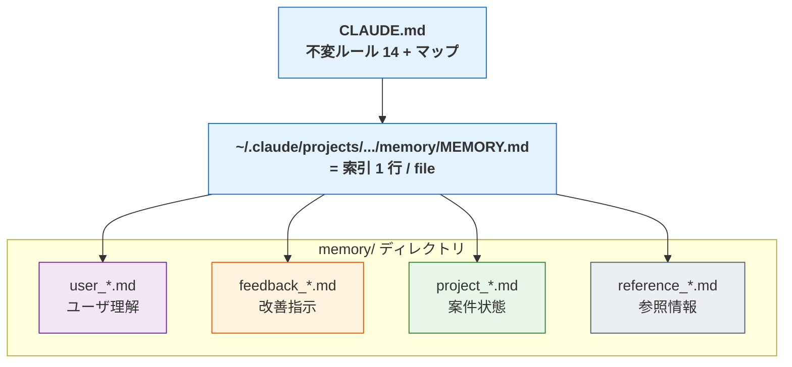
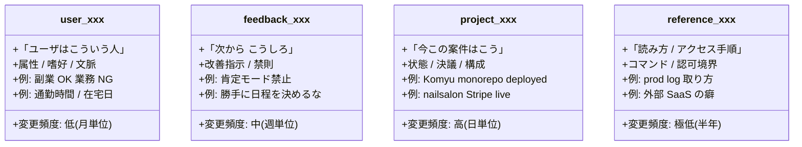
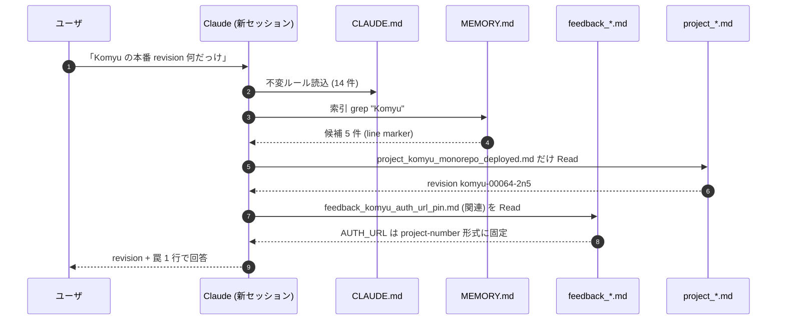

> この記事は **52 本連載 (ai-driven-dev) の Day 27/52** です。Claude Code 拡張 5 機構の話 [A-01](./claude-code-as-company-5-mechanisms) の続編で、5 機構のうち暗黙的に効いている「Memory (CLAUDE.md + auto-memory)」の運用設計だけを切り出します。
>
> ※ 本記事は著者個人の副業 (個人開発) における実践記録です。本業 (別会社所属) の業務・知見とは無関係で、特定法人の公式見解ではありません。コード片・設定例はすべて著者個人 repo の自著コードです。

## 結論

Claude Code Memory に **100+ ファイル** が溜まったら、`feedback / project / reference / user` の **4 type 分離** が事実上必須です。`MEMORY.md` は索引、各ファイルが本体、frontmatter で type を明示する。私の devops-hub repo の memory 配下は今日時点で **100 ファイル** ちょうど。内訳は **feedback 41 / project 56 / reference 2 / 索引 1**。`user_*.md` はまだ 0 件で、ここが私の現状の穴です。

## なぜこの記事を書くか

「`CLAUDE.md` に何でも書け」「auto-memory に任せろ」という雑な助言を見るたびに、それは **10 ファイルまで** の話だと言いたくなります。100 ファイルを越えた瞬間、Claude が読む context は破綻し、相反するルールが共存し始めます。本記事は私自身が壊した設計と、4 type 分離で復旧した経緯の記録です。

## 問題 — 1 ファイル肥大化で何が起きるか

最初、私は全部を `CLAUDE.md` に書きました。アーキテクチャ、L1 制約、ハマった話、案件メモ、API key の扱い方、CEO としての方針、全部です。3 週間で **800 行** を越えたあたりから、症状が出ました。

- **同じトピックの矛盾**: 「Hook に重い処理を入れない」と書いた 30 行下で「PostToolUse でフル typecheck」と書いている
- **古い案件メモが context を食う**: 既に終わった PR #15 のレビュー手順が、毎ターン system prompt に乗り続ける
- **検索の解像度が下がる**: 「Komyu の AUTH_URL 罠」を確認したいのに、3 つの章に分散していて Claude が誤読する
- **削除恐怖**: 「これ消したら何か壊れる?」が判断できず、追記しかしなくなる

これは Claude Code 固有の現象ではなく、**single source ファイルの寿命** の問題です。Linux の `.bashrc` が 1000 行を越えると誰も触らなくなるのと同じ。違うのは、**Claude は黙ってその矛盾を読み続けて、変な挙動を返す** ことです。

## 解法 — 4 type 分離 + MEMORY.md = index

### 全体像



`CLAUDE.md` は **「変わらない方針」** だけを書く場所。私の repo では現在 14 個の最重要ルール (any 禁止 / 認証情報埋め込み禁止 / docs SSOT 等) と、各種 context ファイルへのマップだけが残っています。**変わるもの**は全部 `~/.claude/projects/<project-slug>/memory/` 配下に外出しし、type prefix と `MEMORY.md` 索引で管理します。

### 4 type の責務分離



4 つの軸は **「誰が起点で書かれたか」** ではなく **「何の質問に答えるためのファイルか」** で切ります。

| Type | 答える質問 | 寿命 | ファイル名規則 |
|---|---|---|---|
| `user_*` | このユーザは誰? | 半永久 | `user_<topic>.md` |
| `feedback_*` | 次は何をしてはいけない? | 上書き OK | `feedback_<short_kebab>.md` |
| `project_*` | この案件の今の状態は? | 完了したら deprecate | `project_<repo>_<slug>.md` |
| `reference_*` | あれの読み方は? | 半永久 | `reference_<topic>.md` |

devops-hub の memory 直下は今こうなっています (実測):

```bash
$ ls ~/.claude/projects/-Users-sakaki-project-devops-hub/memory/ \
    | awk -F'_' '{print $1}' | sort | uniq -c | sort -rn
  56 project
  41 feedback
   2 reference
   1 MEMORY.md
```

**`user_*` がゼロ件**。これは私の現状の穴で、後述の残課題で扱います。

### `feedback_*.md` — 改善指示の収納庫

代表例として `feedback_no_yesman_mode.md` を読みます (auto-memory が CEO の発話から自動生成したファイル):

```markdown
<!-- ~/.claude/projects/-Users-sakaki-project-devops-hub/memory/feedback_no_yesman_mode.md:1-9 -->
---
name: 肯定モード禁止
description: CEO の批判を「正しいです」と受け止めて自己反省するだけ、判断を CEO に丸投げ (「やりますか?」「dispatch しますか?」) は禁止。自分の判断で進める
type: feedback
originSessionId: 225c476d-df30-4da9-b65b-88d3108e2654
---
CEO の批判を反復・同意するだけの応答は禁止。「ご指摘の通りです」「正しいです」「memory に保存します」だけで実行を伴わない応答も禁止。

**Why**: 2026-05-09。13 部署監査で構造欠陥を指摘された後、CEO「小手先提案やめろ」→ ...
```

`feedback_*` は **「次からこうしろ」を 1 件 1 ファイル**で持ちます。フォーマットは固定:

- `name`: 1 行サマリ (索引にそのまま使える)
- `description`: 何を禁則 / 推奨にしたか
- `type: feedback` (固定)
- `originSessionId`: 元になった会話の ID (どの文脈で発生したか辿れる)
- 本文: `Why` (発生事例) → `How to apply` (具体的な適用手順)

私の repo で 41 件溜まっている `feedback_*` を眺めると、性質はだいたい 3 つに分かれます:

1. **禁則** (`feedback_no_yesman_mode.md`, `feedback_stop_debate_loops.md`, `feedback_no_unauthorized_planning.md`)
2. **推奨パターン** (`feedback_team_converge_pattern.md`, `feedback_brutal_architecture_review.md`)
3. **アンチ提案** (`feedback_no_seed_hardcoding.md`, `feedback_no_patch_proposals_after_audit.md`)

特に **アンチ提案系** が効きました。「監査結果が並んだら現状肯定の Top5 patch を出すな、構造を疑え」という類のフィードバックは、Claude の default 挙動を上書きする最強のレバーです。

### `project_*.md` — 案件状態スナップショット

`project_komyu_monorepo_deployed.md` を例に:

```markdown
<!-- memory/project_komyu_monorepo_deployed.md:1-15 -->
---
name: Komyu monorepo refactor 本番反映済 (2026-05-05)
description: C-2 monorepo 移行 (apps/{web,mobile} + packages/* + ADR-004 VSA) を main に merge し Cloud Run revision komyu-00064-2n5 で稼働中
type: project
originSessionId: a08728cf-9d50-43ce-922b-39d878991f50
---
2026-05-05 に Komyu repo を C-2 monorepo 化し、main へ直接 merge → Cloud Run 自動 deploy 経由で本番反映。

**Decision-Id:** DEC-20260505-06 (architecture)

## 本番状態

- Cloud Run service: `komyu` (project `creanest-business-hub`, asia-northeast1)
- Revision: `komyu-00064-2n5` (2026-05-05 17:54 UTC)
- URL (project-number 形式、AUTH 経路): `https://komyu-933992653457.asia-northeast1.run.app`
```

`project_*` は **時点情報** を持ちます。日付がほぼ必ず入る。これが `feedback_*` との最大の違いで、**寿命が来たら deprecate していい** のが project です。例えば「Komyu Phase 0 完成」は実装済になった時点で内容が空洞化するので、新しい `project_komyu_monorepo_deployed.md` に置き換わりました。

私が運用で守っているルール:

- **同じ project_slug は重ねない** (同 repo の状態は最新版に上書き)
- **完了した project_* は削除せず、内容を「完了済」だけにする** (Decision Genealogy で参照される)
- **frontmatter `description` を `MEMORY.md` の索引にそのまま流用する**

### `reference_*.md` — 参照情報 / アクセス手順

`reference_*` は **「あれをどう読むか」** だけ。例:

```markdown
<!-- memory/reference_nailsalon_prod_logs.md:1-12 -->
---
name: nailsalon prod log access
description: nailsalon 本番ログは GCP プロジェクト nail-salon2、prod ログ読み取りは明示認可が必要
type: reference
originSessionId: 509e4252-75c5-402c-a9eb-74ad6507492a
---
nailsalon-reserve-line-app の本番環境:

- **GCP プロジェクト**: `nail-salon2`
- **リージョン**: asia-northeast1
- **Functions ランタイム**: Cloud Functions Gen2 (= Cloud Run revision)
- **Admin URL**: https://nail-salon-admin-60d4e.web.app/

ログ取得コマンドは [nailsalon-reserve-line-app/CLAUDE.md] に網羅されているのでそれを参照する。

**重要**: Sandbox はプロンプト内の「本番」「nailsalon の本番」だけでは prod GCP に対する `gcloud logging read` を許可しない。プロジェクト ID `nail-salon2` を明示的に名指して許可をもらう必要がある。
```

`reference_*` の決定的な特徴は **「ここに書いてあるからといって、勝手に実行してはいけない」** が成立することです。`feedback_*` や `project_*` は read = 適用ですが、reference は **read + 認可** の 2 段。`reference_nailsalon_prod_logs.md` の最後の段落が典型で、「prod GCP に gcloud logging read するときはユーザに毎回確認」を読み手に要求しています。

私の repo で `reference_*` がたった **2 件** (nailsalon prod logs / vibium) しか無いのは、reference に値する情報がそもそも少ないからです。「ほとんどは feedback か project に分類される」というのが 100 ファイル運用後の感覚です。

### `user_*.md` — ユーザ理解 (現状ゼロ件)

ここが私の現状の穴です。type としては設計してあるのに、ファイルがゼロ件。本来あるべき例は:

```markdown
<!-- memory/user_work_constraints.md (planned) -->
---
name: 業務 / 副業の境界
description: 平日昼は本業 (別会社所属)、副業は朝晩と週末。本業情報は memory に書かない / 引用しない
type: user
originSessionId: ...
---

- 本業: 別会社、勤務時間中の private repo 触り禁止
- 副業: 個人 GitHub 、朝 6-8 時 + 夜 22-25 時 + 週末
- どこに書いていいか: 副業 repo の memory / docs / Zenn 記事
- 書いてはいけないか: 本業の固有名詞 / 顧客名 / 内部 URL
```

```markdown
<!-- memory/user_communication_pref.md (planned) -->
---
name: 応答スタイル
description: 結論先出し、Yes/No 明示、長文 disclaim 禁止、絵文字本文禁止 (frontmatter のみ)
type: user
---
```

`feedback_*` との違いは **「具体的な改善指示」ではなく、「ユーザという人の属性」だけ** を書くこと。「絵文字禁止」は voice.md に書いてある時点で `feedback_*` ではなく `user_*` です (人によって変わる属性だから)。

`user_*` を分離する利点は、**他 repo に持ち運べる** こと。`feedback_no_unauthorized_planning.md` は devops-hub 固有の事例から派生した教訓ですが、`user_communication_pref.md` は Komyu でも nailsalon でも同じです。`~/.claude/CLAUDE.md` (global) や `~/.claude/skills/` 配下と相互運用しやすいのが `user_*`。

### MEMORY.md は索引、本文ではない

`MEMORY.md` は 100 行 (= 100 ファイル + 索引行) の **1 行サマリだけ** に削ぎ落としています。本文を書かないのが鉄則。

```markdown
<!-- memory/MEMORY.md:1-10 -->
- [CreaNest definition](project_creanest_definition.md) — CreaNest = 受託+自社サービスのスタートアップ、ユニコーン上場狙い、AI駆動運営
- [ai-agent-development-architecture repo](project_ai_agent_dev_architecture.md) — VSA+Clean+DDD 参照 repo、local /Users/sakaki/project/ai-agent-development-architecture/、ADR-004 規約
- [Strategy switching](feedback_strategy_switching.md) — 戦略ページにプロジェクト切替+テーマ切替UIが必要
- [Business reality](project_business_reality.md) — 確定収益は nailsalon ¥20k/月のみ、L1/L2/他L3は未確定（2026-04）
- [nailsalon Stripe live (2026-05-09)](project_nailsalon_stripe_live.md) — Stripe live 動作確認完了 (¥50 E2E 全 webhook 通過確認済)、card 反映バグ 1 件未修正、残作業は ¥22k 顧客 Checkout 移行と価格プラン対応
```

各行のフォーマット: `[name](filename) — description`。これは frontmatter の `name` と `description` をそのまま転記しているだけなので、auto-memory で生成しても、私が手書きしても、ぴったり同じ列に揃います。

Claude が memory を「全部読む」のではなく **「索引 → 該当 1-2 ファイルだけ読む」** に誘導する、これが 4 type 分離の本当の目的です。100 ファイル全文を context に積むと token が破裂しますが、`MEMORY.md` 100 行 + ピンポイント 2 ファイル = 数千 token に抑えられます。

### 検索の動線



CLAUDE.md だけは毎セッション全文。`MEMORY.md` は索引なので grep 中心。本文ファイルは **「索引でヒットしたものだけ」** Read する。これで Claude の挙動が、雑然とした 800 行 single file を読まされていた時代と比べて明らかに **収束しやすく** なりました。

## Before / After 比較

### Before 1: CLAUDE.md 800 行に全部詰めていた頃

```markdown
<!-- 旧 CLAUDE.md (廃止イメージ) -->
# CLAUDE.md
## アーキテクチャ
... 50 行 ...
## L1 制約
... 30 行 ...
## ハマった話
- 2026-04 に Komyu の AUTH_URL を vanity 形式にしたら session 失効
- 2026-04-30 に getScheduleSettings transaction too big
- pnpm v10 deploy で ERR_PNPM_DEPLOY_NONINJECTED_WORKSPACE が出る
... 200 行 ...
## 案件メモ
- nailsalon: ...
- Komyu: ...
- yomi-note: ...
... 300 行 ...
## ユーザ嗜好
- 絵文字禁止
- 結論先出し
... 50 行 ...
```

問題: 800 行のうち、特定の質問に **本当に必要なのは 10 行**。残り 790 行は context noise。

### After 1: 4 type に外出し

```markdown
<!-- 現 CLAUDE.md:1-25 (実物の頭) -->
# CLAUDE.md — DevOps Hub AI 指示書
> 詳細は `.claude/context/` 配下の各ファイルを参照。ここは **マップ + 最重要ルール** のみ。

## 最重要ルール (14)
1. App と pipeline-kit は依存分離 — 直接 import 禁止 (C-001)
2. Creator ≠ Evaluator — 生成 Agent と検証 Agent は分離する (C-002)
... 14 件 ...
```

CLAUDE.md は **不変な 14 個のルールと、context マップ** だけ。日々のフィードバックや案件状態は memory/ 配下に流す。これで CLAUDE.md は 200 行を切りました。

### Before 2: feedback と project が混ざった 1 ファイル

```markdown
<!-- 旧 memory/sakaki_notes.md (廃止) -->
- Komyu の現在地: revision 64
- Komyu でハマった: AUTH_URL の vanity 形式は session 失効する
- nailsalon の現在地: Stripe live 開通済
- 一般禁則: agent に「やりますか?」を聞かせない
- 一般禁則: schedule を勝手に gate にしない
- ...
```

問題: 「現在地 (project)」と「禁則 (feedback)」が混在し、項目を更新するときに **どこを直すか分からない**。Komyu の revision が変わるたびに 2 行先の禁則まで context に乗ってしまう。

### After 2: 1 概念 1 ファイル

```bash
$ ls memory/ | grep komyu
project_komyu_auto_deploy.md
project_komyu_backend_separation_plan.md
project_komyu_e2e_state.md
project_komyu_mobile.md
project_komyu_mobile_phase0.md
project_komyu_monorepo_deployed.md
project_komyu_pricing.md
project_komyu_repo.md
feedback_komyu_auth_url_pin.md
feedback_komyu_backend_separation.md
feedback_komyu_backend_test_required.md
feedback_komyu_chat_ux_richmenu.md
```

Komyu に関する knowledge は **8 件の project_ + 4 件の feedback_** に分かれて居住しています。revision が変わったら `project_komyu_monorepo_deployed.md` だけを更新すればよく、`feedback_komyu_auth_url_pin.md` は不変。**変わるものと変わらないものが物理的に別ファイル** なので、編集の影響範囲が明確になります。

## 失敗談

### 失敗 1: 1 件の feedback を CLAUDE.md に追記し続けて 800 行にした

最初の半年、フィードバックを受けるたびに CLAUDE.md の末尾に追記していました。「次から〜しないこと」が 30 件溜まったあたりで、Claude がその一部しか守らなくなりました。原因は単純で、**CLAUDE.md の末尾は context の終端に押されて attention が落ちる** からです。先頭に書いたルールほど守られて、末尾に追加されたルールほど無視される。

直したのは、frontmatter で type を分けて memory/ に外出ししてから。CLAUDE.md は 14 個の不変ルールだけ、追加フィードバックは `feedback_*.md` で別管理。CLAUDE.md は冒頭から末尾まで全部 attention を浴びる短さに戻しました。

**教訓: CLAUDE.md は短く保つために、追加せず外出しする**。

### 失敗 2: project_* を「最新形」に上書きせず、新規ファイルを生やし続けた

Komyu の状態が変わるたびに `project_komyu_2026_04_15.md`, `project_komyu_2026_04_28.md`, `project_komyu_2026_05_05.md` と新規生成するスクリプトを書いた時期があります。3 ファイル目を作った時点で、Claude が古い 2026-04-15 版を引いてきて「revision 7」と古い番号を答えました。

直したのは、**同 project_slug は最新で上書き、過去版は git log で見る**、という運用に切り替えてから。`project_komyu_monorepo_deployed.md` は常に「今の状態」を持ち、過去版が必要なら `git log -- memory/project_komyu_monorepo_deployed.md` で辿る。auto-memory の自動生成も、同 slug の場合は overwrite する設定を選びました。

**教訓: project_* は時系列ファイルではなく、最新スナップショット。履歴は VCS に任せる**。

### 失敗 3: feedback と reference を区別できず、勝手に実行してしまった

`reference_nailsalon_prod_logs.md` を最初は `feedback_nailsalon_logs.md` という名前で書いていました。Claude はそれを feedback と読んで、「prod log は GCP project nail-salon2 から取れ」を **指示** として解釈し、ある日いきなり `gcloud logging read` を sandbox 制限の中で蹴られるまで実行しようとしました。

これは reference と feedback の本質的な違いを見落としていたためです。reference は **「読み方を書く」** だけで、**「実行していいかは別問題」**。type prefix を `reference_` に変えて、本文末尾に「**重要**: Sandbox はプロンプト内の『本番』だけでは許可しない。プロジェクト ID を明示認可してもらう」と明記してから、勝手な実行は止まりました。

**教訓: reference の本文には「読むだけで実行は別認可」を明記する。type prefix だけでは Claude には伝わらない**。

### 失敗 4: 索引 (MEMORY.md) を更新し忘れて、ファイルを書いただけで読まれなかった

新規 feedback を auto-memory が生成した直後、索引行が `MEMORY.md` に追記されていない期間がありました。Claude は memory/ を `ls` するわけではないので、**索引に乗っていないファイルは存在しないのと同じ**。実害は「同じ feedback を 2 回入れる」「直近の禁則が無視される」など。直したのは auto-memory の生成 hook で **MEMORY.md の該当行を upsert する** ようにしてから。

**教訓: 索引と本文は同期更新が必須。索引に乗らないファイルは Claude にとって存在しない**。

## 残課題 — まだ詰まっていない

正直に並べます。

1. **`user_*` がゼロ件**。私の人物属性は voice.md と CLAUDE.md の余白に散らばったまま。global `~/.claude/CLAUDE.md` への移譲とセットで整理予定。
2. **MEMORY.md のソート規則がない**。時系列追加順か type 別 section 分けか未決。100 行を越えると索引内の grep が線形になり読みづらい。
3. **deprecate の運用が手動**。完了 project や反転した feedback (例: override された `feedback_ai_ops_pmf_freeze.md`) を物理削除か `status: deprecated` 残置か、ルール未定。`memory/` への CI lint がほしい。
4. **複数 repo 間の memory 共通化が未着手**。Komyu / nailsalon でも効くべき feedback が devops-hub にしか無い。global `~/.claude/skills/` と各 repo memory の使い分けが曖昧。
5. **`originSessionId` が活用できていない**。auto-memory が記録してくれているのに辿る UI が無い。Decision Genealogy と接続したい。

## 理論根拠 — なぜ 4 type で運用が回るのか

### 根拠 1: 「変更頻度の異なるものを同居させない」(Cohesion principle)

ソフトウェア設計の cohesion (凝集度) と全く同じ話です。**変更頻度が違うものを 1 ファイルに置くと、片方を直すたびにもう片方の context が汚染される**。CLAUDE.md (低頻度) と日々のフィードバック (中頻度) と案件状態 (高頻度) を分離するのは、SRP (Single Responsibility Principle) を memory に持ち込んだだけです。

| Type | 変更頻度 | 同居すると |
|---|---|---|
| `CLAUDE.md` (不変ルール) | 月単位 | 雑な追記で attention が末尾に流れる |
| `feedback_*` (改善指示) | 週単位 | 案件メモが混ざると禁則が読み飛ばされる |
| `project_*` (案件状態) | 日単位 | 古い snapshot が新しい禁則に勝ってしまう |
| `reference_*` (参照) | 半年単位 | 認可境界が他の指示と混ざって誤実行 |
| `user_*` (人物属性) | 半永久 | repo 固有の情報が混ざると他 repo に運べない |

### 根拠 2: Anthropic Agent の context window は「全部読む」前提ではない

Claude Code は session 開始時に CLAUDE.md と auto-memory のサマリを system prompt に積みますが、**個別 memory ファイルは Read tool 経由で必要時だけ読みます**。これは Anthropic 公式の "Building Effective Agents" の Routing パターンに沿った挙動で、**索引から必要分だけ pull する** 設計が前提です。100 ファイルを全部 push しようとすると context window が破裂します。`MEMORY.md` を「索引」として割り切るのは、この前提に乗っかった運用です。

### 根拠 3: type prefix は「Claude が誤解しない名前空間」を作る

`feedback_no_yesman_mode.md` というファイル名を見た瞬間、Claude は「これは禁則だ、read = 適用だ」と判断します。`reference_nailsalon_prod_logs.md` を見れば「これは参照、実行は別認可」と判断します。**ファイル名の prefix が、ファイルの種類と扱いを同時に伝える**。これは Linux の `/etc/`, `/var/`, `/usr/` と同じで、prefix によるディレクトリ階層なし namespace 設計の素直な応用です。

このやり方を選んだもう 1 つの理由は、**auto-memory の自動生成と相性が良い** ことでした。Claude 自身が会話から memory を生成するとき、type を判定して prefix を付けるのは frontmatter を埋めるより簡単で、間違いが少ない。

## まとめ

100+ ファイルの Claude Code Memory を回すなら:

- `CLAUDE.md` は **不変ルール + マップ** だけにして 200 行以下に保つ
- 日々のフィードバックは `feedback_*.md` に 1 件 1 ファイルで外出し
- 案件状態は `project_*.md` に 1 案件 1 ファイル、最新で上書き
- 参照情報は `reference_*.md` に分離、本文に「実行は別認可」を明記
- ユーザ属性は `user_*.md` (私はまだゼロ件 — 整理中)
- `MEMORY.md` は **索引 1 行 / file** に削ぎ落とす、本文を書かない
- frontmatter `name` / `description` / `type` / `originSessionId` を必ず埋める

100 行 1 ファイルから 100 ファイル 1 行ずつへ。1 人会社の OS としての Claude Code は、memory の整理整頓で挙動の安定性が桁違いに変わります。

## 次の記事へ + 連載をフォロー

これは **52 本連載 (ai-driven-dev) の Day 27/52** です。

すでに公開済の関連記事:

→ **A-01 [Slash と Skill と Hook を混ぜて爆発した話 — Claude Code 5 機構](./claude-code-as-company-5-mechanisms)** (Day 2/52) — 5 機構の使い分け。memory はその裏で動く 6 つ目の機構

→ **A-04** (準備中) Skill description の書き方 (具体シグナル語列挙パターン) — feedback_* の発火条件設計と同型

→ **E-03** (準備中) Decision Genealogy で意思決定を JSONL に串刺す — `originSessionId` を実用化する話

### 連載を見逃さない方法

- **Zenn でこの著者をフォロー** — 公開通知が届きます
- **repo を watch**: [SakakitaniJunya/zenn-articles](https://github.com/SakakitaniJunya/zenn-articles) — 全 draft が見えます

### Discussion / フィードバック歓迎

- 「`user_*` の書き方、こうした方がいいのでは?」 → GitHub Issue で議論しましょう
- 「うちは type を 5 つに分けている」 → 反例も歓迎、比較記事にしたい
- 「auto-memory の overwrite vs append の運用、どう倒した?」 → 共有してください

連載 52 本を書き切る間に、memory 4 type 設計はアップデートし続けます。本記事も将来書き直します。誤りや「ここをもっと深く」のリクエストは GitHub Issue でお気軽に。
