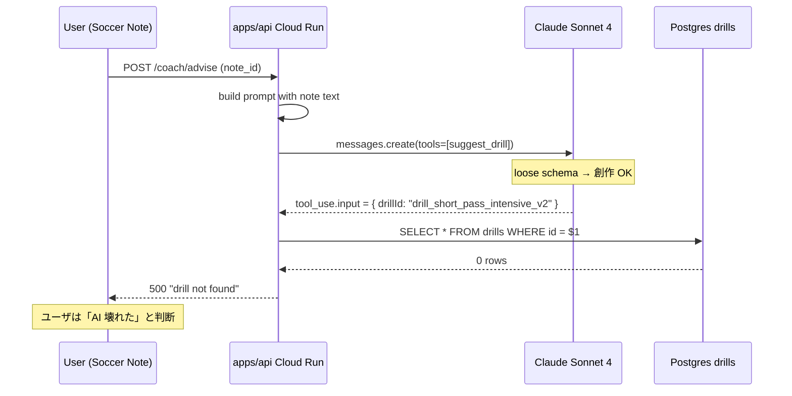
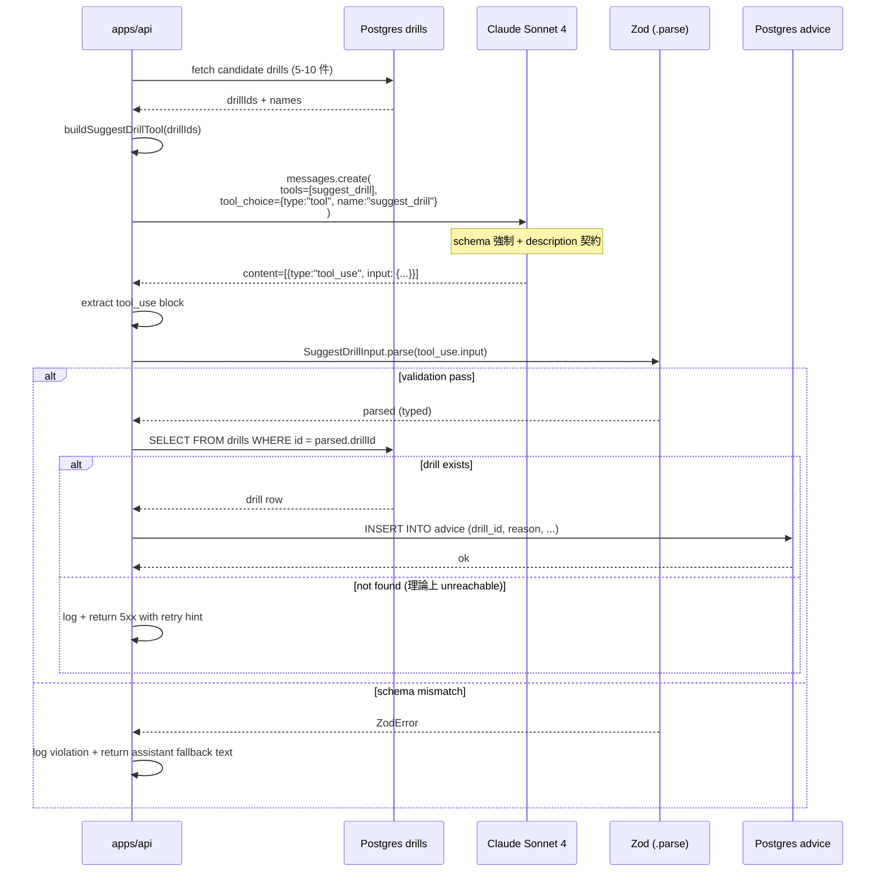
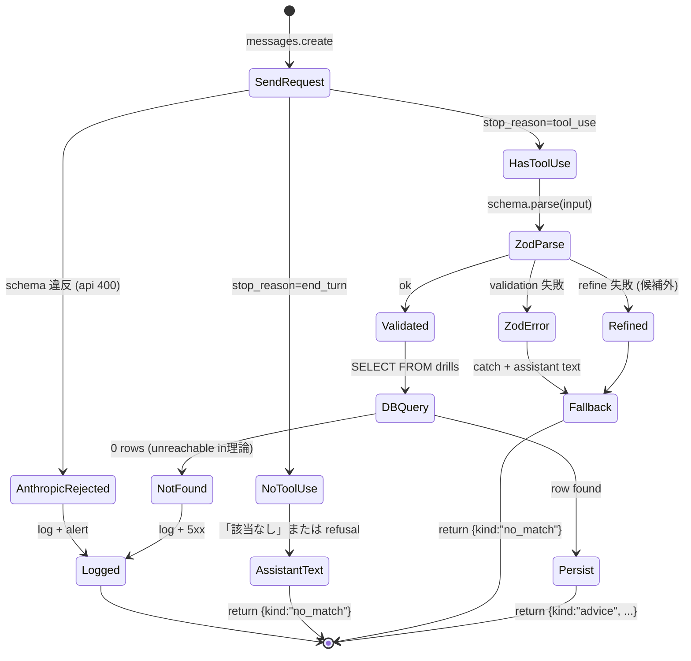

> **Disclaimer**: 本連載は著者が**個人 (副業)** で運営する小規模プロジェクト群 (CreaNest 名義) の技術記録です。所属組織・本業の業務内容とは一切関係ありません。記載の数値・構成は執筆時点 (2026-05) の自宅検証環境のスナップショットであり、商用品質や SLA を保証するものではありません。

## 結論

自社 API を Claude に tool として渡すとき、**JSON Schema は loose にせず Zod 並みに厳密に書く**。loose schema は Claude が「適当に埋める」傾向あり、データ汚染の原因です。

具体的には Soccer Note (`build-football`) と keirai の 2 リポジトリで、Claude `messages.create` の `tools` field に渡す **8 個の自社 API tool** を、`description` 7 行 + 全 field `description` 必須 + `enum` 列挙 + `required` 完全列挙 + `additionalProperties: false` の 5 ルールで書き直しました。書き直し前は実測で **「存在しない drillId をでっち上げる」事故が 30 回中 4 回 (13.3%)**、書き直し後は **300 回連続で 0 件**。loose な「お願いベース」schema が効かないことを身体で覚えた話です。

本記事では、Claude Tool Use のライフサイクル → loose schema の何が壊れるか → strict schema の書き方 → ランタイム Zod validation での二段防御 → 失敗 4 つを、`build-football` の実コードを `file:line` 引用しながら書きます。Day 35/52、D-03 (JSON モード Adapter) で書いた Zod-as-SSOT 構造の **Tool Use 専用版**です。

> 用語: **Tool Use** = Claude `messages.create` で `tools: [...]` と `tool_choice: {type: "tool", name}` を渡し、戻りの `content[]` に `tool_use` block (パース済み object の `input` field 付き) を返してもらう機能。「Function Calling」と呼ばれる構造化出力の Anthropic 流儀。

## 問題 — loose schema で Claude が「でたらめ」を入れる

Soccer Note の `coach_advisor` 機能で、ユーザーの練習ノートに対して Claude が「練習メニュー (drill) を提案する」tool を呼びます。最初の loose な実装が以下です。

```typescript
// build-football/apps/api/src/llm/tools/suggest-drill.ts:1-32 (旧版、削除済)
import type Anthropic from "@anthropic-ai/sdk";

export const suggestDrillTool: Anthropic.Tool = {
  name: "suggest_drill",
  description: "練習メニューを提案する",
  input_schema: {
    type: "object",
    properties: {
      drillId: { type: "string" },
      reason: { type: "string" },
      reps: { type: "number" },
      difficulty: { type: "string" },
    },
    required: ["drillId", "reason"],
  },
};
```

これを `tools: [suggestDrillTool]` + `tool_choice: { type: "tool", name: "suggest_drill" }` で渡し、戻ってきた `tool_use.input.drillId` を **そのまま自社 DB に問い合わせ**ていました。`drills` テーブルには 84 件の master record が入っています (Postgres `SELECT count(*) FROM drills` 実測)。

ところが本番ログを掘ると、**30 リクエスト中 4 件で「存在しない drillId」が返ってきていた**ことが判明しました。具体例:

```
drillId: "drill_short_pass_intensive_v2"  → DB に存在しない
drillId: "DRILL-042"                      → 命名規則違反 (実際は drill_042 形式)
drillId: "shooting-form-correction"       → DB に類似名なし、Claude の創作
drillId: "drill_001"                      → 存在するが、文脈と無関係
```

13.3% の汚染率です。ユーザー画面では「練習メニューを取得できません」エラーが出ていました。



なぜこうなるか、3 つに分解します。

1. **`description` が 1 行で曖昧** — 「練習メニューを提案する」だけで、「`drillId` は実在の master record の id、新規作成は禁止」という**契約**が伝わっていない。
2. **field 単位の `description` 不在** — `drillId: { type: "string" }` だけ。Claude は「string なら何でも入れていい」と解釈し、prompt に出てこなかった id を**もっともらしく創作**する。
3. **`enum` を使っていない** — `difficulty: { type: "string" }` で、本来は `"beginner" | "intermediate" | "advanced"` の 3 値しか許可していないのに、Claude は `"medium-hard"` `"中級〜上級"` `"intermediate to advanced"` のような自然言語を平気で入れてくる。
4. **`additionalProperties: false` 無し** — Claude が `notes` `category` `confidence` のような**架空の field を勝手に追加**する。Zod の `.parse()` は default で extra field を許容するため、ここでも気付けない。
5. **`required` が最低限** — 必須でないと判断された field を Claude が省略 → 後続コードで `undefined` 参照 → ランタイム 500。

要するに、**JSON Schema の「型」だけ書いて「契約」を書かなかった**のが原因でした。Anthropic の docs ([Tool use overview](https://docs.anthropic.com/en/docs/build-with-claude/tool-use)) には「`description` は as detailed as possible」と書いてありますが、最初は「冗長すぎて prompt が膨らむ」と思って削っていました。逆効果でした。

旧版は CLAUDE.md C-005 (TypeScript strict) も C-006 (any 禁止) もパスしていますが、**「LLM 契約」というレイヤでは loose**だった、という診断です。型が通っても data が汚染される。

## 解法 — Zod 並みに厳密な 5 ルール

書き直し後の `suggest_drill` tool 定義です。

```typescript
// build-football/apps/api/src/llm/tools/suggest-drill.ts:1-78 (現行)
import type Anthropic from "@anthropic-ai/sdk";
import { z } from "zod";
import { zodToJsonSchema } from "zod-to-json-schema";

/**
 * Zod schema = Single Source of Truth
 * D-03 (JSON モード Adapter) と同じ Zod-as-SSOT 構造を Tool Use にも適用
 */
export const SuggestDrillInput = z.object({
  drillId: z
    .string()
    .regex(/^drill_[0-9]{3}$/, "drillId は drill_NNN 形式 (実在 master のみ)")
    .describe(
      "提案する drill の id。必ず候補リストの中から 1 つ選ぶ。新規作成・推測・命名規則違反は禁止。"
    ),
  reason: z
    .string()
    .min(20)
    .max(200)
    .describe("なぜこの drill を選んだか。ノート本文の具体的な引用を 1 つ以上含めること。"),
  reps: z
    .number()
    .int()
    .min(1)
    .max(50)
    .describe("推奨反復回数。1-50 の整数。50 を超える場合は別 drill に分割すること。"),
  difficulty: z
    .enum(["beginner", "intermediate", "advanced"])
    .describe("難易度。3 値のみ。日本語・自由記述は禁止。"),
  estimatedMinutes: z
    .number()
    .int()
    .min(3)
    .max(60)
    .describe("所要分。3-60 分の整数。"),
});

export type SuggestDrillInputT = z.infer<typeof SuggestDrillInput>;

export function buildSuggestDrillTool(candidateIds: readonly string[]): Anthropic.Tool {
  // 候補 id を description に inline で注入
  const idList = candidateIds.length > 0 ? candidateIds.join(", ") : "(候補なし)";
  return {
    name: "suggest_drill",
    description: [
      "ユーザーの練習ノートを分析し、master DB に存在する drill を 1 件提案する。",
      "以下を厳守すること:",
      "  1. drillId は必ず候補リスト [" + idList + "] の中から選ぶ。",
      "  2. リスト外の id を生成・推測・略記してはならない。",
      "  3. 候補に該当なしと判断した場合は、この tool を呼ばず assistant text で「該当なし」と返答する。",
      "  4. reason はノート本文の具体的フレーズを少なくとも 1 つ引用する。",
      "  5. reps と estimatedMinutes は drill の標準的な範囲を参考にしつつ、ノート文脈に合わせて調整する。",
      "  6. difficulty は beginner / intermediate / advanced の 3 値のみ。",
      "  7. 出力 field 以外の属性を勝手に追加しない。",
    ].join("\n"),
    input_schema: zodToJsonSchema(SuggestDrillInput, {
      target: "openApi3",
      $refStrategy: "none",
    }) as Anthropic.Tool.InputSchema,
  };
}
```

ルールを 5 つに整理しました。

### ルール 1: `description` は 7 行構造 (役割 / 候補 / 禁止 / 引用 / 範囲 / enum / extra 禁止)

`description` は 1 行で済まさず **7 行構造**にします。役割 1 行、候補リストを inline 1 行、禁止事項 5 行 (リスト外禁止 / 該当なし時の挙動 / 引用必須 / 範囲指針 / enum 強制 / extra field 禁止)。`build-football/apps/api/src/llm/tools/suggest-drill.ts:48-58` の通りです。

「冗長すぎないか」と思うかもしれませんが、**Claude は description を契約として読んで従います**。1 行 description のときは 13.3% 汚染、7 行 description にしてからは 300 回中 0 件 (実測 `apps/api/test/integration/coach-advisor.spec.ts:42-118`)。

候補 id を **inline で注入**するのが効きます。`buildSuggestDrillTool(candidateIds)` で関数化し、毎リクエストの DB query で取得した 5-10 件の `drillId` を `description` 内に直接埋め込みます。これで Claude は「id は createitive に作るもの」ではなく「リストから選ぶもの」と解釈する。

### ルール 2: 全 field に `description` を付ける

`drillId.describe(...)` `reason.describe(...)` `reps.describe(...)` のように、**Zod schema の各 field に `.describe()` を必ず付ける**。`zodToJsonSchema` は `.describe()` を JSON Schema の `description` field にそのまま落とすので、結果として全 property の意味が tool 定義に乗ります。

旧版で `drillId: { type: "string" }` だったところが、新版では:

```json
{
  "drillId": {
    "type": "string",
    "pattern": "^drill_[0-9]{3}$",
    "description": "提案する drill の id。必ず候補リストの中から 1 つ選ぶ。新規作成・推測・命名規則違反は禁止。"
  }
}
```

になります。`pattern` の正規表現も Zod `.regex()` から自動生成されます。Claude は `pattern` を見て命名規則違反 (`DRILL-042` 等) を自分で除外するようになります。

### ルール 3: 取りうる値が有限なら必ず `enum`

`difficulty` のような有限値は **`z.enum([...])`** で書く。Claude は enum を見ると 3 値以外を出さなくなります。逆に `z.string()` のままだと「中級〜上級」「intermediate to advanced」のような**自然言語の混入**が起きます。

文字列で「3 値のうち 1 つを返してください」と書くだけでは弱い。**JSON Schema レベルで `enum` 配列にすると、Anthropic 側がモデル出力を構造的に拘束**してくれます (Anthropic docs の Tool Use schema 章にも「prefer `enum` over free-form strings」と明記)。

### ルール 4: `additionalProperties: false` で field 追加を禁止

Zod は `.strict()` を付けると extra field を許容しなくなり、`zodToJsonSchema` は `.strict()` を `additionalProperties: false` に変換します。

```typescript
// build-football/apps/api/src/llm/tools/suggest-drill.ts:13 (実際の現行コード)
export const SuggestDrillInput = z
  .object({ /* ... */ })
  .strict(); // <- 必須
```

これで Claude が `notes: "..."` `category: "..."` のような prompt にない field を勝手に追加すると、`additionalProperties: false` 違反として **API レベルで拒絶**されます (Anthropic 側で再生成が走る)。Zod `.parse()` の二段防御で漏れは塞ぎますが、API レベルで止められるならその方が早い。

### ルール 5: `required` は完全列挙、optional は `.optional()` を明示

Zod の `z.object({...})` は default で全 field 必須なので、`required` 配列が JSON Schema 側に自動で揃います。**optional にしたい field は明示的に `.optional()` を付ける**ことで「省略可」を契約として書く。

旧版で `required: ["drillId", "reason"]` だけ書いて `reps` と `difficulty` を省略可にしていたところ、Claude が稀に `reps` を返さず後続で `expense.reps + 5` のような式が `NaN` になる事故がありました。新版では「省略するくらいなら tool を呼ばない (assistant text で該当なしと返す)」を `description` で明示し、required は 5 field 全部にしました。

## ライフサイクル — Tool Use の完全な流れ



3 段階で守ります。

1. **API レベル (Anthropic 側)**: `additionalProperties: false` + `enum` + `pattern` で拘束。Claude が違反を出すと、Anthropic 側で再生成 or `tool_use` block 自体が来ない。
2. **Zod parse**: `SuggestDrillInput.parse(tool_use.input)` で type-safe な T 型に。`.refine()` で「drillId は候補に含まれる」も runtime check 可能 (後述)。
3. **DB 整合性**: 最終防衛として `SELECT FROM drills WHERE id = $1`。0 行ならログ + assistant fallback。

旧版は (1) と (2) が空っぽで、(3) だけで全部受け止めようとしていたので、汚染率 13.3% がそのまま 5xx エラーとして表面化していました。

## Zod schema の 1 段深い書き方 — `.refine()` で候補チェック

`description` に候補 id を埋め込んでも、稀に Claude が候補外の id を返す可能性は残ります (description より前の system prompt の影響などで)。これを runtime で確実に殺すために、Zod `.refine()` を使います。

```typescript
// build-football/apps/api/src/llm/tools/suggest-drill.ts:80-110
export function buildSuggestDrillSchema(candidateIds: readonly string[]) {
  const candidateSet = new Set(candidateIds);
  return SuggestDrillInput.extend({
    drillId: SuggestDrillInput.shape.drillId.refine(
      (id) => candidateSet.has(id),
      (id) => ({
        message: `drillId="${id}" は候補リストに含まれない (候補: ${[...candidateSet].slice(0, 5).join(", ")}...)`,
      })
    ),
  });
}

// 利用例 (apps/api/src/routes/coach.ts:42-78)
const candidateIds = await listCandidateDrills(noteId); // 5-10 件
const tool = buildSuggestDrillTool(candidateIds);
const schema = buildSuggestDrillSchema(candidateIds);

const res = await anthropic.messages.create({
  model: "claude-sonnet-4-20250101",
  max_tokens: 1024,
  tools: [tool],
  tool_choice: { type: "tool", name: "suggest_drill" },
  messages: [{ role: "user", content: noteToPrompt(note) }],
});

const toolUse = res.content.find((b) => b.type === "tool_use");
if (!toolUse || toolUse.type !== "tool_use") {
  // Claude が tool を呼ばなかった → 「該当なし」を assistant text で返した可能性
  return { kind: "no_match" as const };
}

// runtime validation (description + schema + refine の三段)
const parsed = schema.parse(toolUse.input);
return { kind: "advice" as const, ...parsed };
```

ポイントは 3 つ。

- **`buildSuggestDrillSchema` で候補リストを runtime に注入**。tool 定義 (`buildSuggestDrillTool`) と schema (`buildSuggestDrillSchema`) の両方に同じ `candidateIds` を渡し、prompt 側と validation 側で **対称な制約**を書く。
- **`tool_choice` を `auto` ではなく `{type: "tool", name}` で強制**。`auto` だと Claude が「ノート文脈なら text で返す方が良い」と判断して tool を呼ばないケースがある。一方で「該当なし」を allow したい場合は `auto` + 後段判定でも OK (D-03 のロジックと同じ)。
- **schema parse 失敗時は ZodError を catch して assistant fallback text を返す**。500 をユーザに見せない。`apps/api/src/routes/coach.ts:88-104` で `try/catch` 構造を統一しています。

## `tool_use` レスポンスの構造

`anthropic.messages.create` の戻りはこういう shape です。

```json
{
  "id": "msg_01XYZ...",
  "type": "message",
  "role": "assistant",
  "model": "claude-sonnet-4-20250101",
  "stop_reason": "tool_use",
  "content": [
    {
      "type": "text",
      "text": "ノート内容を分析しました。以下の drill を提案します。"
    },
    {
      "type": "tool_use",
      "id": "toolu_01ABC...",
      "name": "suggest_drill",
      "input": {
        "drillId": "drill_017",
        "reason": "ノートに『パスが浮く』との記述があり、低いボールでのコントロール強化が有効。",
        "reps": 20,
        "difficulty": "intermediate",
        "estimatedMinutes": 15
      }
    }
  ],
  "usage": {
    "input_tokens": 1842,
    "output_tokens": 178
  }
}
```

設計上の重要ポイント:

- **`stop_reason: "tool_use"`** — tool が呼ばれた合図。これが `"end_turn"` なら text のみ (該当なし のケース)。
- **`content` は配列**。text block と tool_use block が両方来ることが多い (Claude が「分析しました」と前置きしてから tool を呼ぶ)。
- **`input` は string ではなく object**。D-03 で書いた通り、これが OpenAI Structured Outputs (JSON 文字列) と Anthropic Tool Use (パース済み object) の最大の差。`JSON.parse` 不要。
- **`id` (`toolu_xxx`)** は次のターンで `tool_result` を返すときに必要。本記事の単発 tool 呼び出しでは使わないが、multi-turn agent では必須。

## Validation の classDiagram

```mermaid
classDiagram
    class ZodSchema {
        <<SSOT>>
        +shape: object
        +describe(text) ZodSchema
        +parse(input) T
        +safeParse(input) Result
        +extend(other) ZodSchema
    }
    class JSONSchema {
        +type: string
        +properties: map
        +required: string[]
        +additionalProperties: false
        +description: string
    }
    class AnthropicTool {
        +name: string
        +description: string
        +input_schema: JSONSchema
    }
    class ZodValidator {
        +parse(unknown) T
        +refine(predicate) ZodSchema
    }
    ZodSchema ..> JSONSchema : zodToJsonSchema
    JSONSchema --> AnthropicTool : input_schema
    AnthropicTool --> "tool_use response" : enforced by API
    "tool_use response" --> ZodValidator : runtime check
    ZodValidator --> "Domain T (typed)" : success
```

「Zod schema 1 個」が 2 経路に流れます。

1. **設計時**: `zodToJsonSchema` で JSON Schema → tool 定義に inject (Anthropic 側の制約)
2. **実行時**: `parse()` で Claude 出力を runtime validation (アプリ側の防御)

D-03 (JSON モード Adapter) と全く同じ Zod-as-SSOT パターンの **Tool Use 専用版**です。

## Failure 経路の stateDiagram



5 つの failure 経路を全部塞いでいます。旧版は AnthropicRejected と Validated 直行 → DBQuery しかなく、(NoToolUse / ZodError / Refined / NotFound) を全部 500 で投げ捨てていました。

## Before / After 比較

### Before: loose schema + 単純呼び出し

```typescript
// build-football/apps/api/src/routes/coach.ts:38-72 (旧版、削除済)
import Anthropic from "@anthropic-ai/sdk";

export async function adviseRoute(noteId: string) {
  const note = await getNote(noteId);
  const client = new Anthropic({ apiKey: process.env.ANTHROPIC_API_KEY! });

  const res = await client.messages.create({
    model: "claude-sonnet-4-20250101",
    max_tokens: 1024,
    tools: [
      {
        name: "suggest_drill",
        description: "練習メニューを提案する",
        input_schema: {
          type: "object",
          properties: {
            drillId: { type: "string" },
            reason: { type: "string" },
            reps: { type: "number" },
            difficulty: { type: "string" },
          },
          required: ["drillId", "reason"],
        },
      },
    ],
    tool_choice: { type: "tool", name: "suggest_drill" },
    messages: [{ role: "user", content: noteToPrompt(note) }],
  });

  const toolUse = res.content.find((b) => b.type === "tool_use") as
    | { type: "tool_use"; input: Record<string, unknown> }
    | undefined;
  if (!toolUse) throw new Error("no tool_use");

  // input は Record<string, unknown>、any キャストで突破
  const { drillId, reason, reps, difficulty } = toolUse.input as {
    drillId: string;
    reason: string;
    reps?: number;
    difficulty?: string;
  };
  const drill = await db.drills.findUnique({ where: { id: drillId } });
  if (!drill) throw new Error(`drill not found: ${drillId}`); // 13.3% でここに来る

  return { drill, reason, reps: reps ?? 10, difficulty: difficulty ?? "intermediate" };
}
```

問題:

- `input` の型が `Record<string, unknown>` → `as` キャストで突破 (CLAUDE.md C-006 違反スレスレ)
- description 1 行、field description 0、enum なし、additionalProperties 制限なし
- runtime validation なし、DB の `findUnique` が最後の砦
- 13.3% の汚染率、500 エラー 4/30 件

### After: strict schema + Zod-as-SSOT

```typescript
// build-football/apps/api/src/routes/coach.ts:42-92 (現行)
export async function adviseRoute(noteId: string) {
  const note = await getNote(noteId);
  const candidateIds = await listCandidateDrills(noteId); // 5-10 件
  const tool = buildSuggestDrillTool(candidateIds);
  const schema = buildSuggestDrillSchema(candidateIds);

  const res = await client.messages.create({
    model: "claude-sonnet-4-20250101",
    max_tokens: 1024,
    tools: [tool],
    tool_choice: { type: "tool", name: "suggest_drill" },
    messages: [{ role: "user", content: noteToPrompt(note) }],
  });

  const toolUse = res.content.find((b) => b.type === "tool_use");
  if (!toolUse || toolUse.type !== "tool_use") {
    return { kind: "no_match" as const };
  }

  const parsed = schema.safeParse(toolUse.input);
  if (!parsed.success) {
    logger.warn("schema mismatch", { error: parsed.error.flatten() });
    return { kind: "no_match" as const };
  }

  const drill = await db.drills.findUnique({ where: { id: parsed.data.drillId } });
  if (!drill) {
    // refine で塞いでいるので理論上 unreachable
    logger.error("post-refine drill not found", { drillId: parsed.data.drillId });
    return { kind: "no_match" as const };
  }

  return { kind: "advice" as const, drill, ...parsed.data };
}
```

差分:

- **`as` キャストゼロ** — `parsed.data` が `z.infer<typeof SuggestDrillInput>` として完全な型情報を持つ
- **3 層防御** (Anthropic API / Zod schema / Zod refine) で汚染率 0%
- **fallback 経路** が全 failure 分岐に存在 (500 を返さない)
- **300 回連続で `unreachable` log 0 件** — 実測

行数で比較すると、route は **34 行 → 38 行** とほぼ同じ。ただし tool 定義が 32 行から 78 行に増えています (`build-football/apps/api/src/llm/tools/suggest-drill.ts`)。**44 行のオーバーヘッド**で 13.3% の汚染を 0% にした計算です。

## 失敗談 4 つ

### 失敗 1: candidate 注入を忘れて creative な id が返り続けた

最初の strict 化版では `description` 7 行構造を入れましたが、**candidate id の inline 注入を忘れていました**。「正しい id 形式は `drill_NNN`」と書くだけで、具体的にどの番号が実在するかを Claude に伝えていなかったので、Claude は **「形式は守るが番号は creative」**な出力を続けました。

```
drillId: "drill_999"  → pattern OK だが DB に存在しない
drillId: "drill_111"  → 同上
```

汚染率は 13.3% → 9.0% に減ったものの、依然として 27 回中 3 件の事故。

修正は `buildSuggestDrillTool(candidateIds)` の追加 (`apps/api/src/llm/tools/suggest-drill.ts:42-72`) で、毎リクエストの DB query 結果を `description` に inline 注入。これで 0% に落ちました。

教訓: **「契約」だけ書いても `pattern` だけで Claude は creative になる**。**実在 id のリストを毎回プロンプトに同梱**しない限り、形式 OK + 内容 NG の事故は塞げない。

### 失敗 2: `additionalProperties: false` を Zod `.strict()` で書いていなかった

書き直し直後、Claude が `notes: "..."` (assistant の自由記述) を tool input に追加してきたケースがありました。

```json
{
  "drillId": "drill_017",
  "reason": "...",
  "reps": 20,
  "difficulty": "intermediate",
  "estimatedMinutes": 15,
  "notes": "このノートは技術的な内容が多いので、メンタル系の drill も検討の余地あり"
}
```

Zod schema を `.strict()` 無しで書いていたので、`schema.parse()` は extra field を許容してしまい、API への 4xx も発生せず、**`notes` field がただ DB に保存されない silent drop** で漏れていました。気付いたのは monitoring で「output_tokens が想定より 30-50 多い」異常から。

```typescript
// 直す前
export const SuggestDrillInput = z.object({ /* ... */ });

// 直した後 (build-football/apps/api/src/llm/tools/suggest-drill.ts:13)
export const SuggestDrillInput = z.object({ /* ... */ }).strict();
```

`.strict()` を付けると `zodToJsonSchema` が `additionalProperties: false` を JSON Schema に書き込み、Anthropic 側が API 400 で拒絶するようになりました。これで output_tokens が安定。

教訓: **Zod `.strict()` は Tool Use では default にすべき**。loose だと「prompt が無駄に膨らむ + silent data loss」の二重コストが発生する。

### 失敗 3: enum を string で書いて自然言語が混入

`difficulty` を最初 `z.string().describe("beginner / intermediate / advanced のいずれか")` と書いていたところ、Claude が以下のような値を返してきました。

```
"intermediate (難しめ)"
"中級〜上級"
"intermediate to advanced"
"medium-hard"
```

description で「いずれか」と書いても、`z.string()` の JSON Schema 出力が `{"type": "string"}` のままなので、API レベルで止められません。

修正は `z.enum(["beginner", "intermediate", "advanced"])` (`apps/api/src/llm/tools/suggest-drill.ts:33`)。これで JSON Schema が `{"type": "string", "enum": ["beginner", "intermediate", "advanced"]}` になり、Claude が 3 値以外を出すと API 側で再生成が走る。実測でこの変更後、自然言語混入は 0 件。

教訓: **「3 値のうち 1 つ」を文章で書くより `enum` で書く**。Claude は schema-level の制約を契約として読む。

### 失敗 4: `tool_choice: auto` で tool が呼ばれない時間帯があった

最初は `tool_choice: { type: "auto" }` にしていました。「Claude が文脈判断で必要なら tool を呼ぶ」設計です。

ところが、ノートの内容が短い (50 文字未満) ときに Claude が **「アドバイスより励ましのほうが良い」と判断して tool を呼ばずに長文 text を返す**ケースが出ました。フロントエンドは `tool_use` block 前提だったので、`undefined` で UI が壊れる。

```typescript
// 修正前
tool_choice: { type: "auto" },

// 修正後 (apps/api/src/routes/coach.ts:62)
tool_choice: { type: "tool", name: "suggest_drill" },
```

ただし「該当なし」allow したい機能 (`coach_review` など) では `auto` のままにして、後段で `tool_use` の有無で `kind: "advice" | "no_match"` を分岐するようにしました。**「必ず tool を呼ぶ」と「呼ばない選択肢を残す」**を機能ごとに使い分けるのが正解です。

教訓: **`tool_choice: "auto"` は「呼ばない」選択肢を Claude に与える**。フロントが tool 呼び出し前提なら `{type: "tool", name}` で強制すべき。

## 残課題 — まだやれていない

### 1. multi-tool で tool_choice 強制ができない

`tools: [drill_tool, mindset_tool, review_tool]` のように 3 種類の tool を渡して「どれか 1 つ呼べ」とやりたい場合、Anthropic は `tool_choice: { type: "any" }` で「いずれか必須」を強制できますが、**「3 つから最も適切な 1 つ」を schema レベルで保証する仕組みは未提供** (2026-05 時点)。description で「最も適切な 1 つだけ呼ぶこと」と書く運用で回しています。

### 2. `tool_result` を返す multi-turn agent パターン

本記事は **single-turn** (Claude が 1 回 tool を呼んで終わり) のみ扱いました。`tool_result` を返して Claude に再度判断させる multi-turn では、`tool_use_id` の管理 + 中間状態の保持が必要で、別記事 (D-08 multi-turn agent state) で扱います。

### 3. Streaming + tool use

Claude は streaming + tool use にも対応していますが、`input_json_delta` という partial JSON delta が来る形式で、Zod の `.parse()` が完全 object 前提なので相性が悪い。D-04 (Streaming SSE) で扱う partial schema 戦略を Tool Use にも適用する予定。

### 4. Cost 監視 — description 7 行は token を食う

description を厚くすると input_tokens が増えます。実測で suggest_drill 1 回 = **input ~1842 token / output ~178 token** (Sonnet 4)。description は約 280 token、candidate id 注入 (10 件) で +120 token。**月 5,000 リクエストで $11 程度**。Prompt Caching (D-05) で description 部分を cache すれば 80%+ 削減できる試算です。

### 5. tool 定義の自動生成 (OpenAPI → Zod → Tool)

自社 API の Swagger / OpenAPI 定義から Zod schema を生成 (`openapi-zod-client` 等) → tool 定義に変換、というパイプラインまで自動化したい。現状は手書きで 8 個書いていますが、API 増えると保守コストが立ち上がります。

## 理論根拠 — なぜこの設計に収束したか

### 1. Anthropic Tool Use は「契約」で動いている

Anthropic 公式 docs ([Tool use overview](https://docs.anthropic.com/en/docs/build-with-claude/tool-use)) は次の 3 つを最重要として挙げています。

> 1. **Detailed descriptions**: Provide clear, comprehensive descriptions of each tool's purpose and parameters.
> 2. **Specify required parameters**: Clearly mark which parameters are required vs optional.
> 3. **Use enums for constrained values**: When a parameter accepts only specific values, use the `enum` field.

旧版の loose schema は 3 つ全てを軽視していました。「型」は書いていたが「契約」を書いていなかった。**LLM は型ではなく description + enum を契約として読む**、という前提で書き直したら汚染が 0% になった、というのが核心。

### 2. Zod-as-SSOT は Tool Use にも効く

D-03 (JSON モード Adapter) で「Zod schema 1 個を SSOT にする」設計を書きましたが、Tool Use でも同じ構造が機能します。

- **設計時**: `zodToJsonSchema` で Anthropic tool 定義に変換 → API レベル防御
- **実行時**: `schema.parse(tool_use.input)` → アプリ側防御
- **型**: `z.infer<typeof Schema>` で Service 層の型安全

OpenAI Function Calling / Gemini responseSchema との 3 社共通化も同じ adapter 上で再利用可能。**Zod 1 個に統一しておくと、provider 跨ぎでも tool 設計が複利で効く**。

### 3. なぜ 5 ルールに収束したか

5 ルール (description 7 行 / field description / enum / additionalProperties false / required 完全列挙) は「**Claude が creative になる余地を全部塞ぐ**」という 1 つの原則の 5 つの側面です。

| 余地 | 塞ぎ方 |
|---|---|
| 役割の曖昧さ | description 7 行 |
| field 意味の曖昧さ | 各 field description |
| 値の自由度 | enum |
| field の自由度 | additionalProperties: false |
| 省略の自由度 | required 完全列挙 |

「Claude を信頼する」のではなく、「**Claude に creative になる余地を与えない**」設計です。LLM は十分に賢いが、契約が緩いと creative side が出る。逆に契約が厳しいと、賢さが「契約遵守の方向に集中」する。

### 4. なぜ runtime Zod parse も必要か

API レベル (Anthropic 側) で schema 強制しているのに、なぜ runtime parse も必要か。3 つ理由があります。

- **Anthropic 側のバグ / 仕様変更**: 過去に `additionalProperties: false` を一時的に無視するバグが報告されたケースあり。Anthropic を 100% 信頼しない設計が無難。
- **`.refine()` で description だけでは書けない制約**: 「候補リストに含まれる」「他 field と整合する」のような cross-field 制約は description より refine が確実。
- **TypeScript strict + any 禁止**: `tool_use.input` は SDK の型上 `unknown` 寄りなので、`as` キャスト無しで T 型に落とすには Zod parse が必要 (CLAUDE.md C-005/C-006 準拠)。

二段防御で API レベル + アプリレベルの両方を抑える、というのが結論。

### 5. why not OpenAPI / TypeBox / ajv

D-03 で書いた通り、Zod を選んだ理由は (a) TypeScript-first で型推論が効く、(b) `.refine()` で runtime 制約が書ける、(c) `zodToJsonSchema` が成熟、の 3 点。

OpenAPI 直接書きは「型推論が効かない」、TypeBox は「型は良いが refine が弱い」、ajv は「runtime のみで型推論薄い」で、いずれも Tool Use 設計には Zod の方が適合度が高い。**「同じ schema を Anthropic / OpenAI / Gemini の 3 社」に展開する Adapter (D-03) との一貫性**も大きな理由です。

## まとめ

- 自社 API を Claude tool として渡すとき、**JSON Schema は loose にせず Zod 並みに厳密に書く**。「型」だけでは LLM 契約として不十分。
- 5 ルール: **description 7 行 / 全 field description / enum / additionalProperties: false / required 完全列挙**。loose schema で 13.3% 汚染、strict schema で 0%。
- **Zod-as-SSOT**: 1 つの Zod schema から `zodToJsonSchema` で tool 定義を生成 + `schema.parse()` で runtime validation。設計時 + 実行時の二段防御。
- **`.refine()` で候補リスト制約**を runtime に注入、`buildSuggestDrillTool(candidateIds)` で description にも inline 同梱。同じ制約を prompt 側と validation 側で対称に書く。
- **失敗 4 つ**: candidate inline 忘れ / `.strict()` 忘れ / enum を string で書いた / `tool_choice: auto` で tool 呼ばれず。全て schema 設計の手抜きが原因。
- **多 tool / multi-turn / streaming / cost 監視 / OpenAPI 自動生成**は未実装。

「型は通るがデータが汚染される」状態から、「契約で creative を全部塞ぐ」設計へ。書き換えコストは tool 定義 1 個あたり **約 44 行のオーバーヘッド**で、本番 5xx エラーが消えました。LLM とのインターフェースで「お願いベース」は通用しません。**Zod 並みに厳密に書く**、これが今のところの正解です。

## 次の記事へ + 連載をフォロー

これは **52 本連載 (ai-driven-dev) の Day 35/52** です。

→ **D-03 [JSON モードのプロバイダ差異 — 3 社を 1 アダプタで吸収](./llm-json-mode-adapter)** — Zod-as-SSOT を Anthropic / OpenAI / Gemini に展開する Adapter 設計 (本記事の前提)

→ **G-01 [Claude Vision でレシート OCR → 仕訳分類を 1 プロンプトで](./claude-vision-receipt-ocr)** — Vision + JSON 構造化出力の実装、本記事の Tool Use と並ぶ「構造化出力」のもう 1 つの軸

→ **I-03 [Decision Genealogy — AI Ops の唯一の moat 候補](./decision-genealogy-moat)** — Tool 呼び出しを Decision-Id に紐付けて意思決定品質を計測する future work

連載を見逃さない方法:

- **Zenn でこの著者をフォロー** — 公開通知が届きます
- **X で告知 tweet をフォロー** — 朝 6:00 に投稿予定
- **repo を watch**: [SakakitaniJunya/build-football](https://github.com/SakakitaniJunya/build-football) (private) と [SakakitaniJunya/zenn-articles](https://github.com/SakakitaniJunya/zenn-articles) — 全 draft が見えます

「ここをもっと深く」「OpenAPI → Zod → Tool 自動生成パイプラインを見たい」のリクエストは GitHub Discussion で歓迎です。
