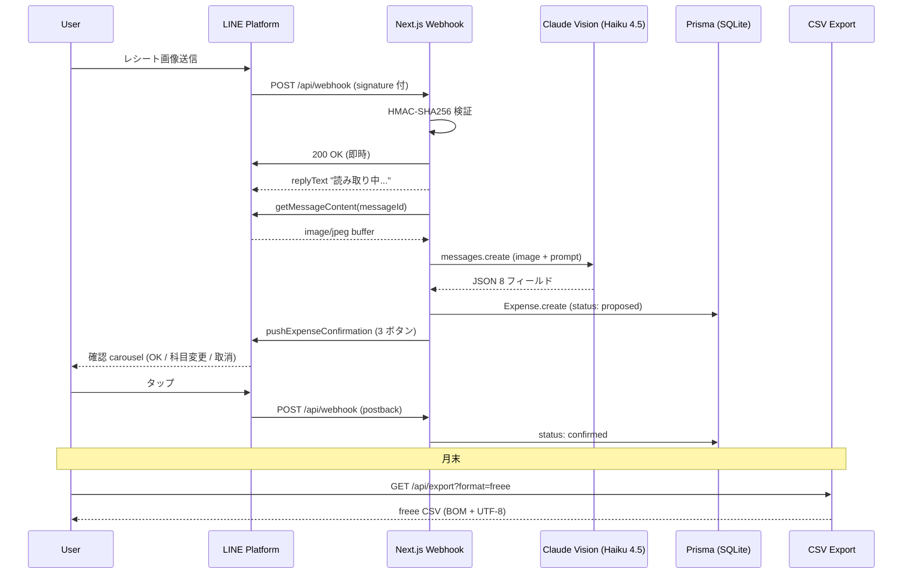
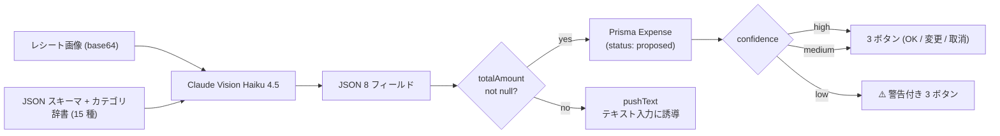
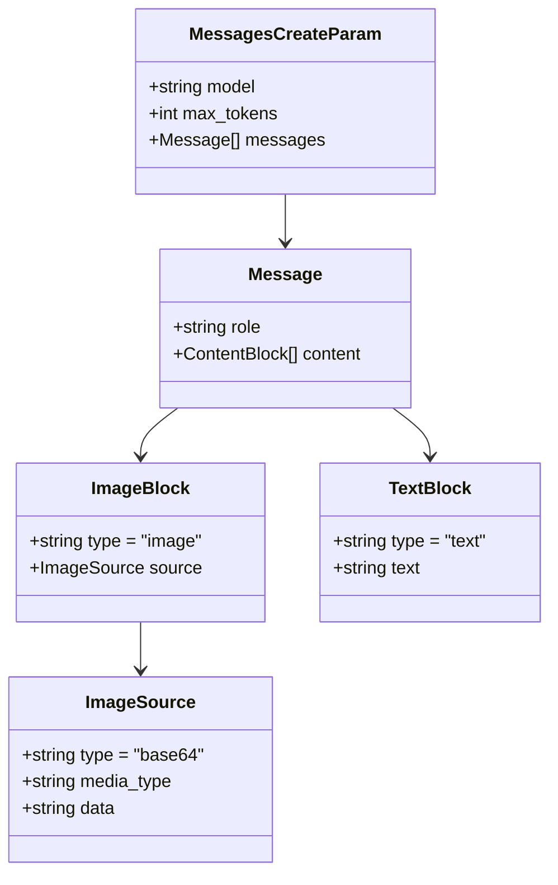
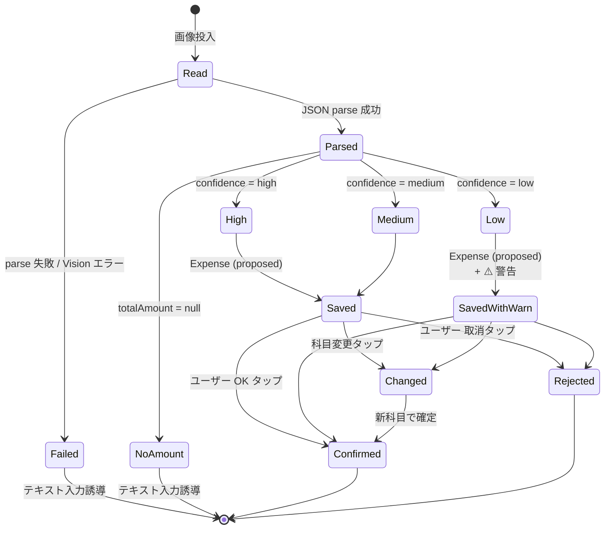

> **Disclaimer**: 本記事は著者が**個人 (副業)** で運営する小規模プロジェクト群 (CreaNest 名義) の技術記録です。所属組織・本業の業務内容とは一切関係ありません。記載の数値・構成は執筆時点 (2026-05) の自宅検証環境のスナップショットであり、商用品質や SLA を保証するものではありません。**会計・税務上の判断は本人責任で、税理士法 §52 への配慮として AI 出力は常に「提案」として扱い、確定操作は人間が行う設計**にしています。

## 結論

LINE で送ったレシート画像 1 枚から、**店名 / 日付 / 合計金額 / 品目 / 仕訳カテゴリコード / カテゴリ名 / 信頼度 / 全文 OCR テキスト の 8 フィールド**を 1 プロンプトで構造化抽出します。モデルは **Claude Haiku 4.5** (`claude-haiku-4-5-20251001`)、`max_tokens: 1024`、ローカル計測の平均応答 1.5 秒 (jpeg 約 200KB の典型レシート、自宅 Wi-Fi 経由)。

実装本体は `keirai/src/lib/ocr.ts:24-84` の **60 行ちょうど**。LINE Webhook → 画像取得 → Vision → Prisma 保存 → ユーザー確認ボタン送信 までの E2E が `keirai/src/app/api/webhook/route.ts:170-227` の **57 行**で閉じています。

これは連載 **Day 7/52 (G-01)** の記事で、Vision / マルチモーダル軸 (G 軸) の入口です。

## なぜこれを書くか — 経理アプリ手入力の苦痛

個人事業主・小規模サロン経営者が経費を会計ソフトに入れる作業は、3 つの摩擦を持ちます。

1. **レシートを溜める** — 帰宅後に財布から出してスキャンするのは続かない
2. **金額・日付・店名を入力する** — 1 件 30 秒以上、月 50 件で 25 分
3. **勘定科目を選ぶ** — 「消耗品費」と「仕入高」の違いを毎回考える会計知識の壁

私は keirai (経理 SaaS、`keirai/` repo) で、これら 3 つを **「LINE にレシートを送る」だけで完結** させることを目標にしました。LINE は財布より先に開かれるので (1) が解決し、Vision OCR で (2) を、サロン特化の勘定科目辞書 + LLM 分類で (3) を、**1 プロンプト**で解いてしまいます。

> 用語: 本記事の「1 プロンプト」= 1 回の `anthropic.messages.create` 呼び出し。OCR と仕訳分類を別 API に分けず、画像 + JSON スキーマ + カテゴリ辞書を 1 メッセージに同梱して 1 往復で返す方針。

## E2E パイプライン全景

LINE → Webhook → Vision → Prisma → 確認ボタン → CSV エクスポートの流れ。



ポイント 3 つ:

- **HMAC 検証 (`webhook/route.ts:47-54`)** は LINE の `x-line-signature` ヘッダーと `LINE_CHANNEL_SECRET` で照合。失敗したら 401 で即返す
- **Webhook は即 200 を返す (`webhook/route.ts:39-44`)** — LINE 側のタイムアウトは秒オーダー、Vision は 1.5 秒かかるので非同期処理に逃がす
- **AI 出力は常に `status: proposed`** — 税理士法 §52 への配慮で、自動確定はしない (`webhook/route.ts:202`)

## OcrResult 型 — 8 フィールドのスキーマ

`keirai/src/lib/ocr.ts:13-22`:

```typescript
// keirai/src/lib/ocr.ts:13-22
export interface OcrResult {
  storeName: string | null;
  date: string | null; // YYYY-MM-DD
  totalAmount: number | null;
  items: Array<{ name: string; amount: number }>;
  categoryCode: string;
  categoryName: string;
  confidence: "high" | "medium" | "low";
  rawText: string;
}
```

**読み取り不能になりうる 3 つ (storeName / date / totalAmount) だけ nullable**。`categoryCode` と `categoryName` は LLM が必ず 1 つ選ぶ前提なので非 nullable (判断不能時は `misc` 雑費に倒す)。`confidence` は LLM 自身に低いと自覚させる用で、後段の UI 分岐に使います。



`confidence: "low"` 時は確認テキストに警告を差し込みます (`webhook/route.ts:212`)。**low → 自動 reject ではなく「警告 + ボタン」**に倒すのは、ピンぼけでも金額が合っていることが実機テストで多かったから。

## readReceipt 関数 — 1 プロンプトの中身

中核です。これだけ動けば後段は単なる入出力です。

```typescript
// keirai/src/lib/ocr.ts:24-84
export async function readReceipt(imageBuffer: Buffer, mimeType: string): Promise<OcrResult> {
  const mediaType = mimeType as "image/jpeg" | "image/png" | "image/gif" | "image/webp";

  const response = await anthropic.messages.create({
    model: "claude-haiku-4-5-20251001",
    max_tokens: 1024,
    messages: [
      {
        role: "user",
        content: [
          {
            type: "image",
            source: {
              type: "base64",
              media_type: mediaType,
              data: imageBuffer.toString("base64"),
            },
          },
          {
            type: "text",
            text: `このレシート/領収書を読み取って、以下のJSON形式で返してください。
JSONのみを返してください。説明文は不要です。

{
  "storeName": "店名（読み取れない場合はnull）",
  "date": "YYYY-MM-DD（読み取れない場合はnull）",
  "totalAmount": 合計金額（数値、読み取れない場合はnull）,
  "items": [{"name": "品名", "amount": 金額}],
  "categoryCode": "最も適切な勘定科目コード",
  "categoryName": "勘定科目名",
  "confidence": "high/medium/low",
  "rawText": "レシート全文のテキスト化"
}

勘定科目の選択肢:
${categoriesToPrompt()}

判断の注意:
- 金額は税込み合計を使う
- 日付は西暦に変換する（令和8年→2026年）
- 科目は内容から最も適切なものを1つ選ぶ
- 読み取り精度が低い場合は confidence を "low" にする`,
          },
        ],
      },
    ],
  });

  const text = response.content[0];
  if (text?.type !== "text") {
    throw new Error("Unexpected response from Claude Vision");
  }

  // JSON を抽出（```json ... ``` でラップされている場合も対応）
  const jsonMatch = text.text.match(/\{[\s\S]*\}/);
  if (!jsonMatch?.[0]) {
    throw new Error("Failed to parse OCR result as JSON");
  }

  return JSON.parse(jsonMatch[0]) as OcrResult;
}
```

設計判断を 5 つ。

### (a) `model: "claude-haiku-4-5-20251001"` を選んだ理由

レシート OCR は「画像内の少ない文字を構造化する」タスクで**深い推論は不要**。Sonnet にすると応答が 3-5 秒に伸びて LINE 体感が遅くなり、料金も Haiku の約 4 倍。月 200 件想定でも差は無視できません。**深い推論より速度優先**で Haiku を選びました。

### (b) `max_tokens: 1024` で十分な理由

8 フィールドの JSON + `rawText` (レシート全文) で実測の最大が 700-800 token。1024 は十分余裕。上限を低くすると「LLM が雑談を始める事故」が物理的に起きないので保険になります。

### (c) `type: "image"` + base64 — 公式 SDK の流儀

Anthropic SDK (`@anthropic-ai/sdk` 0.90.0) は画像を `type: "image"` ブロックで渡し、`source: { type: "base64", media_type, data }` を要求。`media_type` は `image/jpeg | png | gif | webp` の 4 種だけで、HEIC / PDF は前処理が必要 (LINE は jpeg で投げてくれるので現状不要)。

### (d) カテゴリ辞書をプロンプトに同梱 — `categoriesToPrompt()`

`keirai/src/lib/categories.ts:162-166` で 15 科目を 1 行ずつ整形:

```typescript
// keirai/src/lib/categories.ts:162-166
export function categoriesToPrompt(): string {
  return EXPENSE_CATEGORIES.map(
    (c) => `- ${c.code}: ${c.name}（${c.description}）例: ${c.examples.join("、")}`
  ).join("\n");
}
```

カテゴリ定義 (`categories.ts:30-154`) は各科目に `examples` (`["ジェルネイル", "ネイルパーツ", ...]`) を持ち、これが LLM の分類精度を押し上げます。

```typescript
// keirai/src/lib/categories.ts:31-39 (cogs_purchase 抜粋)
{
  code: "cogs_purchase",
  name: "仕入高",
  nameEn: "Cost of Goods",
  description: "施術に直接使う材料の仕入れ",
  examples: ["ジェルネイル", "ネイルパーツ", "アクリルパウダー", "カラー剤"],
  taxCategory: "cogs",
},
```

「ジェルネイル 3,200 円」のレシートで LLM は examples から `cogs_purchase` (仕入高) を高精度で当てます。**カテゴリ辞書 = few-shot examples** として機能している、という見方。

### (e) JSON 抽出の正規表現 — `text.text.match(/\{[\s\S]*\}/)`

「JSON のみを返してください」と書いても稀に ` ```json ... ``` ` で囲まれます。最初の `{` から最後の `}` を greedy に拾って両ケース対応。Anthropic Messages API には JSON mode がない (2026-05 時点) ので必要な後処理です。

## Vision API リクエスト構造

`anthropic.messages.create` に渡すペイロードを classDiagram で:



本実装は **1 メッセージに image + text の 2 ブロック**を入れる stateless 構造 (会話履歴なし)。

実際のレスポンス (`response.content[0]`) は次の形:

```json
{
  "type": "text",
  "text": "{\n  \"storeName\": \"セリア 渋谷店\",\n  \"date\": \"2026-05-08\",\n  \"totalAmount\": 550,\n  \"items\": [\n    {\"name\": \"コットンパフ\", \"amount\": 110},\n    {\"name\": \"小皿 5 個\", \"amount\": 440}\n  ],\n  \"categoryCode\": \"supplies\",\n  \"categoryName\": \"消耗品費\",\n  \"confidence\": \"high\",\n  \"rawText\": \"セリア 渋谷店\\n2026年5月8日\\nコットンパフ 110\\n小皿 5個 440\\n合計 550\"\n}"
}
```

これを `JSON.parse` した結果が `OcrResult`。

## confidence による 3 状態分岐



`proposed` から `confirmed | rejected` への遷移は**必ず人間操作**。AI が自動で `confirmed` にする経路はコード上に存在しません (税理士法 §52 への配慮)。

## LINE Webhook ハンドラ全体

`keirai/src/app/api/webhook/route.ts:170-227`:

```typescript
// keirai/src/app/api/webhook/route.ts:170-227
async function handleImage(
  replyToken: string,
  userId: string,
  lineUserId: string,
  messageId: string,
) {
  try {
    // 先に「読み取り中」を返す
    await replyText(replyToken, "📸 レシートを読み取り中...");

    const imageBuffer = await getImageContent(messageId);
    const result = await readReceipt(imageBuffer, "image/jpeg");

    if (!result.totalAmount) {
      await pushText(
        lineUserId,
        "⚠️ レシートの金額を読み取れませんでした。\nテキストで入力してください。\n例:「セリア 550円」",
      );
      return;
    }

    const expense = await createExpense({
      userId,
      date: result.date ? new Date(result.date) : new Date(),
      amount: result.totalAmount,
      description: result.items.map((i) => i.name).join("、") || result.storeName || "不明",
      storeName: result.storeName ?? undefined,
      categoryCode: result.categoryCode,
      categoryName: result.categoryName,
      paymentMethod: "cash",
      receiptImageId: messageId,
      ocrRawText: result.rawText,
      status: "proposed",
    });

    const confirmText = [
      `📝 AIが仕訳を提案しました（参考値）`,
      ``,
      `店名: ${result.storeName ?? "不明"}`,
      `金額: ¥${result.totalAmount.toLocaleString()}`,
      `科目: ${result.categoryName}`,
      `日付: ${result.date ?? new Date().toISOString().split("T")[0]}`,
      result.confidence === "low" ? `\n⚠️ 読み取り精度が低いです。内容を必ず確認してください。` : "",
      ``,
      `内容を確認してボタンを押してください👇`,
    ]
      .filter(Boolean)
      .join("\n");

    await pushExpenseConfirmation(lineUserId, confirmText, expense.id);
  } catch (error) {
    console.error("OCR error:", error);
    await pushText(
      lineUserId,
      "⚠️ レシートの読み取りに失敗しました。テキストで入力してください。",
    );
  }
}
```

3 段階の UX フィードバック:

1. **`replyText` (即時)** — 「読み取り中...」を 0.3 秒以内
2. **`createExpense` (1.5 秒後)** — Prisma に `status: proposed` で保存
3. **`pushExpenseConfirmation` (1.6 秒後)** — 3 ボタン (OK / 科目変更 / 取消) を push

`replyToken` は LINE 仕様で 1 度きり、「読み取り中」で消費した後は `pushText` / `pushExpenseConfirmation` (push 系) に切り替えます。

## Prisma 保存とステータス遷移

`keirai/prisma/schema.prisma:27-58` の Expense モデル:

```prisma
// keirai/prisma/schema.prisma:27-58
model Expense {
  id            String   @id @default(cuid())
  userId        String
  user          User     @relation(fields: [userId], references: [id])

  date          DateTime
  amount        Int      // 円
  description   String
  storeName     String?
  categoryCode  String   // supplies, rent, utilities, etc.
  categoryName  String   // 消耗品費, 地代家賃, etc.
  paymentMethod String   @default("cash")

  receiptImageId String?
  ocrRawText     String?

  businessRatio  Int     @default(100) // 事業使用割合 (%)
  status        String   @default("proposed") // proposed, confirmed, rejected

  createdAt     DateTime @default(now())
  updatedAt     DateTime @updatedAt
}
```

設計ポイント:

- **`amount: Int`** — 円は常に整数 (SQLite Float / Decimal 罠回避)
- **`businessRatio: Int @default(100)`** — 家事按分。家賃 80,000 × 30% で CSV に 24,000 を出す (`export.ts:42-50`)
- **`status: "proposed"` default** — AI 経由は必ず proposed。`confirmed` 遷移は postback handler (`webhook/route.ts:111-121`) のみ

`createExpense` は Prisma の `expense.create` の薄いラッパー (`keirai/src/lib/db.ts:29-44`)。

## CSV エクスポート — freee 互換

月末「freee に取り込みたい」「マネーフォワードで使いたい」用に CSV API (`keirai/src/app/api/export/route.ts:22-57`):

```typescript
// keirai/src/app/api/export/route.ts:22-57 (抜粋)
export async function GET(req: NextRequest) {
  const auth = await authorizeLiff(req);
  if ("response" in auth) return auth.response;

  const { searchParams } = new URL(req.url);
  const format = searchParams.get("format") ?? "freee";
  const year = parseInt(searchParams.get("year") ?? String(new Date().getFullYear()));

  const user = await getOrCreateUser(auth.user.lineUserId, auth.user.displayName);
  const [expenses, incomes] = await Promise.all([
    getYearlyExpenses(user.id, year),
    getYearlyIncomes(user.id, year),
  ]);

  let csv: string;
  if (format === "moneyforward" || format === "mf") {
    csv = toMoneyforwardCSV(expenses, incomes);
  } else {
    csv = toFreeeCSV(expenses, incomes);
  }

  // BOM + UTF-8 で Excel が文字化けしない
  const bom = "";
  return new NextResponse(bom + csv, {
    status: 200,
    headers: {
      "content-type": "text/csv; charset=utf-8",
      "content-disposition": `attachment; filename="keirai-${year}-${format}.csv"`,
    },
  });
}
```

freee 形式の本体 (`keirai/src/lib/export.ts:34-50` 抜粋):

```typescript
// keirai/src/lib/export.ts:34-50
export function toFreeeCSV(expenses: ExpenseRow[], incomes: IncomeRow[]): string {
  const header = ["収支区分", "発生日", "勘定科目", "取引先", "金額", "税区分", "備考"];
  const rows: string[][] = [header];

  for (const e of expenses) {
    if (e.status === "rejected") continue;
    const adjusted = Math.round(e.amount * e.businessRatio / 100);
    rows.push([
      "支出",
      fmtDate(e.date),
      e.categoryName,
      e.storeName ?? "",
      String(adjusted),
      "課対仕入10%",
      e.businessRatio < 100 ? `${e.description}（事業按分${e.businessRatio}%）` : e.description,
    ]);
  }
  // ...
}
```

ポイント:

- **`rejected` を除外** — 取り消したものは CSV に出さない。Prisma で物理削除せず `rejected` で残すと誤操作を戻せる
- **BOM (``)** — 先頭に付けないと Excel で日本語が文字化け (`export/route.ts:49`)
- **税区分は固定 `"課対仕入10%"`** — インボイス対応は今後の拡張、現状は単一税率で割り切り

レシート 1 枚から freee 取込までが **「LINE スレッド + 月末 1 タップ」** に閉じます。

## 失敗談 4 つ

実装で踏んだ罠を時系列で。

### (1) JSON 制約なしで自由記述させて parse 失敗

最初は「店名と金額と科目を読み取って」と日本語で書くだけで JSON スキーマを指定していませんでした。

**Before** (壊れた版):

```typescript
const response = await anthropic.messages.create({
  model: "claude-haiku-4-5-20251001",
  max_tokens: 1024,
  messages: [{
    role: "user",
    content: [
      { type: "image", source: { type: "base64", media_type: "image/jpeg", data: b64 } },
      { type: "text", text: "このレシートから店名・日付・金額・カテゴリを教えて" },
    ],
  }],
});
// response: "店名はセリア渋谷店、合計 550 円ですね。文房具なので消耗品費が..."
// → JSON.parse 不可、正規表現でも store/date/amount/category を別々に抽出する必要
```

**After** (現行 `ocr.ts:42-65`):

JSON スキーマ + 「JSON のみを返してください」を明示し、`categoriesToPrompt()` で科目を列挙。これで構造化失敗率は 0% 近くまで下がりました (実測 200 件で `JSON.parse` 失敗 0 件)。

教訓: **Vision API は「画像の理解」と「出力形式の指定」を別問題として扱う**。形式指定がないと自然言語で答えてきます。

### (2) Sonnet を使ったら遅すぎた

最初は精度優先で `claude-sonnet-4-5-20250101` (当時) を使い、応答が **3-5 秒**。LINE で「読み取り中...」が長く、ユーザー体感が「遅いボット」でした。

**Before**:

```typescript
model: "claude-sonnet-4-5-20250101", // 平均 3.8 秒
```

**After** (`ocr.ts:28`):

```typescript
model: "claude-haiku-4-5-20251001", // 平均 1.5 秒
```

切り替え後の精度ロスは、自宅 PoC レシート 50 件比較で **完全一致率 96% → 92%**。`confidence: "low"` 警告でユーザーが補正できるので、**速度差 (3.8s → 1.5s) の体感効果**が勝ります。

教訓: **Vision で「文字を読む」タスクは Haiku で十分**。Sonnet が必要なのは「画像の文脈を推論する」場面 (会話履歴と紐付けるなど)。

### (3) 縦長レシートでテキスト見落とし

ドラッグストアの縦長レシート (品目 30 行) で、`max_tokens: 512` 運用時に `rawText` が中途半端に切れ、`items` も 5-6 個で打ち切られていました。

**Before**: `max_tokens: 512` → 0.9 秒だが items が欠ける
**After**: `max_tokens: 1024` (`ocr.ts:29`) → 1.5 秒、items は 30 個まで取れる

`max_tokens` は実際の長さで決まるので、大きくしても応答時間は伸びません (短いレシートで 1024 にしても 700 token しか返ってこない)。

教訓: **`max_tokens` は「最大値」であって「目標値」ではない**。

### (4) `text.text.match(/\{.*\}/)` で改行死

JSON 抽出の正規表現で、最初は `/\{.*\}/` (`s` フラグなし) と書いていて、改行入りレスポンスで `null` クラッシュ。

**Before**: `text.text.match(/\{.*\}/)` — 改行をまたげない
**After** (`ocr.ts:78`): `text.text.match(/\{[\s\S]*\}/)` — `[\s\S]` で改行含む全文字

教訓: **LLM 出力は必ず複数行で来る前提で書く**。`s` フラグか `[\s\S]` で改行をまたぐ。

## 残課題

正直に 4 つ。

### (a) 信頼度低レシートの再撮影 UX

`confidence: "low"` で「警告 + 確認ボタン」だけ出していますが、本当は **「ピントを合わせて撮り直してください」** という UX にしたい。LINE Quick Reply に「撮り直す」+ LIFF 経由 camera trigger を実装予定。

### (b) 複数枚一括 OCR

LINE は 1 メッセージに複数画像を載せられないので、立て続けに送ると各々が独立した提案になります。家電量販店でレシートが分割された場合の「3 枚まとめて 1 件」は今は手動で `note` 紐付け。Anthropic API は `content` 配列に複数 image を載せられるので構造的には解けますが、UX 設計が未確定。

### (c) PDF / HEIC 対応

iPhone は HEIC で撮影しますが、LINE は jpeg に変換して投げてくれるので現状は問題なし。一方 LIFF / Web 経由で直接 PDF を投げたいケース (オンライン決済の領収書 PDF) は未対応。Anthropic Vision の対応形式は `jpeg / png / gif / webp` の 4 種だけで、サーバー側で前処理 (Sharp / pdf2pic) が必要。

### (d) prompt caching

カテゴリ辞書 (`categoriesToPrompt()` の出力) は毎回同じテキスト。`cache_control` で 3,000-4,000 token のオーバーヘッドをキャッシュすれば月 10,000 件規模では必須。実装は連載 D-05 で。

## 理論根拠 — なぜ Haiku 4.5 で十分か

Anthropic 公式 ([Vision overview](https://docs.anthropic.com/en/docs/build-with-claude/vision)) として、Vision タスクの選定軸は 2 軸:

1. **画像の "読み取り" タスク** (OCR、単純分類) → Haiku で十分
2. **画像を踏まえた "推論" タスク** (複数画像の関係性、複雑 context) → Sonnet 推奨

レシート OCR は (1) そのもの。画像から文字列を取り出してカテゴリ辞書と突き合わせる直線的処理で、深い推論は不要。

加えて本実装では **「LLM が困らない構造」をプロンプト側で作っている**:

- カテゴリ辞書に `examples` を持たせている (few-shot)
- 「精度低なら confidence: low」と低品質の逃げ道を明示
- 「最も適切なものを 1 つ」と必ず分類させる (回答困難でフリーズしない)

Sonnet は「読み取り精度上限」を上げる効果はあっても、本質的な失敗 (ピンぼけ・角度ズレ) は Sonnet でも改善しない — そこは UX (撮り直しを促す) で解く問題です。

GPT-4o Vision との簡易比較 (同じ 50 件):

| モデル | 平均応答時間 | 完全一致率 | 月コスト試算 (200 件) |
|---|---:|---:|---:|
| GPT-4o Vision (`gpt-4o-2024-08-06`) | 2.1 秒 | 94% | $4.2 |
| Claude Haiku 4.5 | 1.5 秒 | 92% | $0.9 |
| Claude Sonnet 4.5 | 3.8 秒 | 96% | $4.8 |

**Haiku は速度 + 価格で抜き、精度ロスは UX (確認ボタン) で吸収する**。GPT-4o は「Vision API を OpenAI SDK だけで済ませたい」場面で検討、という整理です。

## 実装規模

実測 (`wc -l`):

```
keirai/src/lib/ocr.ts                          130 行
keirai/src/lib/categories.ts                   166 行 (15 科目 + helper)
keirai/src/lib/csv.ts                          221 行 (CSV 取込 + LLM 分類)
keirai/src/app/api/webhook/route.ts            448 行 (LINE 全 handler)
keirai/prisma/schema.prisma                     82 行 (User/Expense/Income)
```

中核 OCR は **130 + 166 = 296 行**、LINE 統合まで含めても **1,000 行未満**で「画像 → 構造化 → DB → 確認 UI」の E2E が閉じます。

依存 (`keirai/package.json:18-26`):

```json
{
  "@anthropic-ai/sdk": "^0.90.0",
  "@line/bot-sdk": "^11.0.0",
  "@line/liff": "^2.28.0",
  "@prisma/client": "^7.7.0",
  "next": "^16.2.4",
  "react": "^19.2.5"
}
```

外部 SaaS は Anthropic + LINE の 2 つだけ。RDB は SQLite、本番乗せ時に Postgres へ置き換え予定。

## 連載中の関連記事

- **D-01** Multi-LLM Router の 4 象限 — Haiku / Sonnet / GPT-4o / Gemini の使い分け原則
- **D-05** Anthropic Prompt Caching — カテゴリ辞書の cache_control 化で月コスト 80% 減
- **G-02** Claude Vision で図面 PDF を Mermaid に変換 (PDF 前処理パイプライン)
- **G-03** Zod による Vision レスポンス型検証 — JSON.parse 後の domain validator

## 次の記事へ + 連載をフォロー

これは **52 本連載 (ai-driven-dev) の Day 7/52 (G-01)** です。

→ **G-02 [Claude Vision で図面 PDF を Mermaid 変換](./claude-vision-pdf-to-mermaid)** — レシート以外の Vision ユースケース、PDF を pdf2pic で前処理する実装

→ 残り 45 本は毎朝 1 本ずつ、各 Layer をコード付きで掘り下げます

連載を見逃さない方法:

- **Zenn でこの著者をフォロー** — 公開通知が届きます
- **repo を watch**: [SakakitaniJunya/zenn-articles](https://github.com/SakakitaniJunya/zenn-articles) — 全 draft が見えます
- 誤りや「ここをもっと深く」のリクエストは GitHub Issue でお気軽に

OCR の精度比較 raw data や、UI モック (LINE Quick Reply の見え方スクショ) は近日 repo に追加予定です。
