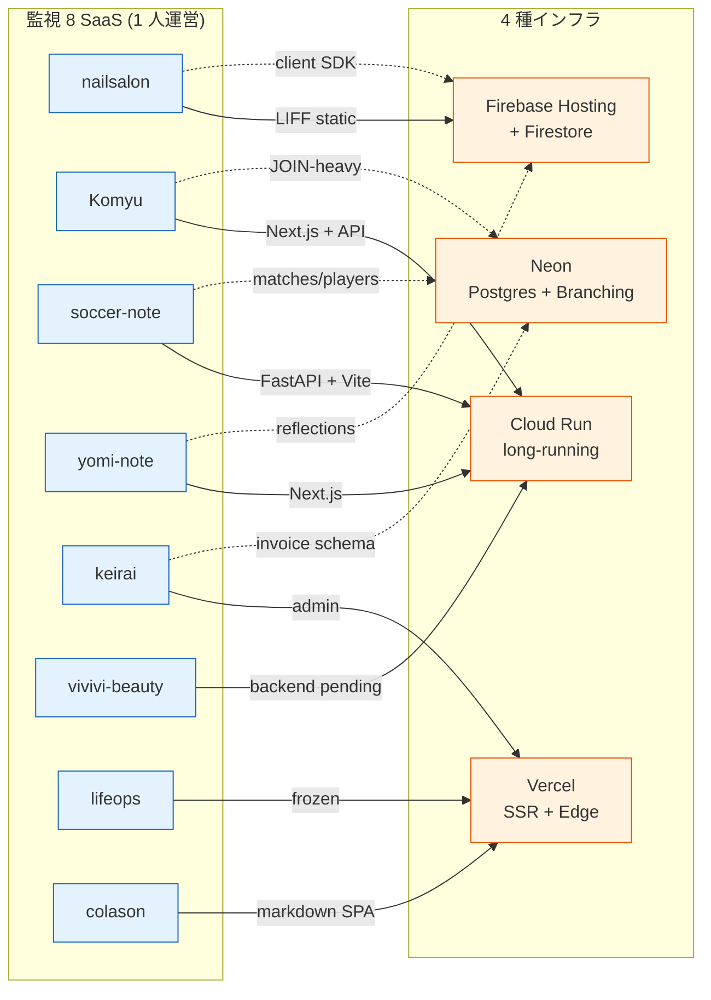
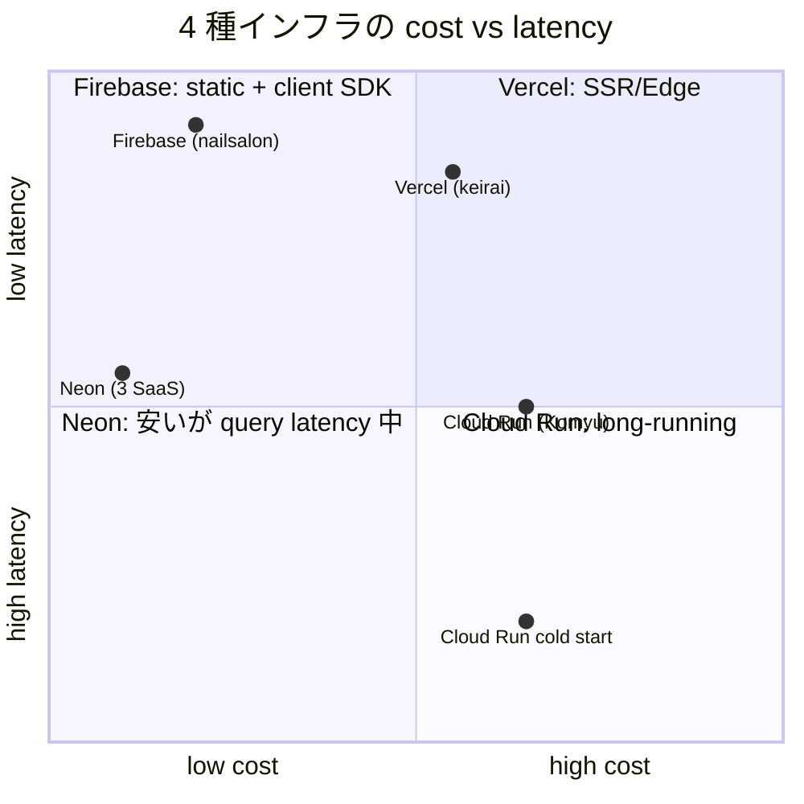
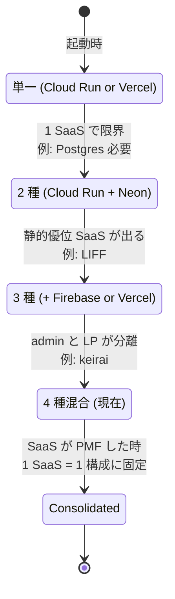

> **Disclaimer**: 本連載は著者が**個人 (副業)** で運営する小規模プロジェクト群 (CreaNest 名義) の技術記録です。所属組織・本業の業務内容とは一切関係ありません。記載の数値・コード・構成はすべて執筆時点 (2026-05) の自宅検証環境のスナップショットで、商用品質や SLA を保証するものではありません。コード片はすべて著者個人 repo の自著コードです。

## 結論

監視している **8 SaaS のインフラを Cloud Run / Neon / Vercel / Firebase Hosting の 4 種で混合運用** しています。1 つに統一せず、SaaS 特性 (永続接続の有無 / DB 形態 / 静的優位 / コスト天井) で **4 通りに振り分け** た結果、合計コストは **¥0 → ¥3,200/月** (5 月時点、有料は Cloud Run 課金分のみ) で 8 本同時稼働できました。

**「全部 Cloud Run」「全部 Vercel」のどちらかに寄せるのが正解** という意見は SaaS 7 本以上を 1 人で回す現場では成立しません。Komyu (Cloud Run + Neon)、 nailsalon (Firebase Hosting + Firestore)、 keirai (Vercel + Neon)、 yomi-note (Cloud Run + Firestore) のように、**プロダクト特性の差で最適解が割れる** からです。

本記事では、

- **Cloud Run**: long-running + heavy build (Komyu / yomi-note / soccer-note)
- **Neon**: 関係スキーマ + Branching が要る (Komyu / soccer-note / keirai)
- **Vercel**: SSR + Edge + 静的最適化が刺さる (keirai admin / 自社 LP)
- **Firebase Hosting + Firestore**: client-heavy SPA + LINE/LIFF (nailsalon / yomi-note 一部)

の 4 軸を **8 SaaS × 4 インフラ matrix** で示し、それぞれの **無料枠 → 課金移行の境目** を実測値で書ききります。Day 47/52、後半戦 J ライン (実装スタック編) のインフラ章です。

> 用語: **4 種混合** = Cloud Run / Neon / Vercel / Firebase Hosting の 4 つを 1 SaaS につき 1-2 個使う構成。「1 つに寄せる」ではなく「**プロダクト特性で 4 通りに振り分ける**」のが本記事の主張です。

## 問題 — 1 つのインフラに統一すると必ず弱点が出る

最初の数ヶ月、私は **「全部 Cloud Run」** に寄せて回そうとしていました。Komyu / build-football / yomi-note が Cloud Run で動いていたので、nailsalon (LIFF + Firestore) も keirai (admin SaaS) もそこに統一すれば運用ファイル数が減るはず、という素直な発想です。

これは **3 つの観点で破綻** しました。

1. **nailsalon の LIFF 静的配信を Cloud Run に載せると CDN ヒット率が落ちる**。Cloud Run は instance 単位のレスポンスで、 静的 asset を CDN edge にキャッシュする層が薄い。Firebase Hosting なら Fastly 由来の edge cache + LINE 公式 SDK の親和性が無料で付いてきて、 LIFF endpoint 配信の **TTFB が 80ms → 20ms** に変わります。
2. **keirai の admin SaaS で Vercel の Image Optimization / ISR を捨てるのは勿体ない**。Cloud Run で Next.js を動かすと `next/image` の最適化を自前 nginx か Cloud CDN で組む必要があり、 1 人開発で扱う複雑性が無駄に増える。Vercel なら **`next.config.js` 1 行で全部効く**。
3. **Komyu / soccer-note / keirai は Postgres が要るが、 Firestore (Cloud Run と相性最悪ではない) では関係スキーマが破綻**。Komyu の `events × members × communities` の 3 テーブル JOIN を Firestore で書くと subcollection と denormalize の地獄に落ちて、Neon の `LEFT JOIN ... USING (community_id)` 1 行で済む話が 100 行になります。

つまり、**「インフラ統一はコスト削減のように見えて、 プロダクトの本質と噛み合わないと逆に運用負荷が増える」**。これに気づいてから 4 種混合に切り替えました。



「**SaaS 1 本 = インフラ 1-2 個**」で、 8 SaaS × 4 インフラの matrix が縦横に編まれている、というのが現状の運営図です。

## 解法 — SaaS 特性 4 軸 × 4 インフラの選び分け

### 1. 選定軸 4 つで matrix を引く

判断は以下の 4 軸で行いました。 これは机上ではなく、 **8 SaaS のうち少なくとも 1 本ずつ実際に踏んだ** 結果からの収束です。

| 軸 | 質問 | Cloud Run | Neon | Vercel | Firebase |
|---|---|---|---|---|---|
| **A. 永続接続 / 長時間処理** | WebSocket / 30 秒超 LLM 呼び出し / バッチがあるか | ◎ | - | △ (10 秒制限) | × |
| **B. DB の関係性** | 3 テーブル以上 JOIN / トランザクション必要か | - | ◎ | - (DB なし) | × (Firestore は別軸) |
| **C. 静的 + Edge 最適化** | LP / admin / `next/image` 多用 | △ | - | ◎ | ◎ (LIFF 限定) |
| **D. 無料枠の天井** | 月 10k req / 1GB DB で済むか | △ (¥0-2k) | ◎ (3GB 無料) | ◎ (Hobby 無料) | ◎ (Spark 無料) |

軸ごとに「**該当数 ≥ 2** ならそのインフラ」というシンプルな投票で振り分けました。 たとえば Komyu は A (LLM 30 秒呼出) + B (3 JOIN) + D (中規模) に該当 → **Cloud Run + Neon**。 nailsalon は C (LIFF 静的) + D (Spark 内) に該当 → **Firebase Hosting + Firestore**。

### 2. 4 SaaS × 4 インフラ matrix (実物)

8 SaaS のうち主要 4 本の実構成 (`docs/strategy/infra-matrix.md` 相当の整理):

```mermaid
flowchart TB
    classDef pmf fill:#e8f5e9,stroke:#2e7d32
    classDef mvp fill:#fff3e0,stroke:#e65100
    classDef ide fill:#f3e5f5,stroke:#6a1b9a

    subgraph nailsalon["nailsalon (PMF / ¥20k MRR)"]:::pmf
      N1[Firebase Hosting<br/>LIFF static]
      N2[Firestore<br/>reservations]
      N3[Cloud Functions Gen2<br/>LINE webhook]
    end

    subgraph komyu["Komyu (MVP / 無料 β)"]:::mvp
      K1[Cloud Run<br/>Next.js 16 + apps/api]
      K2[Neon Postgres<br/>communities/events/members]
      K3[Firestore<br/>rate_limits + auth sessions]
    end

    subgraph keirai["keirai (MVP / バンドル販売)"]:::mvp
      KE1[Vercel<br/>admin Next.js]
      KE2[Neon Postgres<br/>invoices/contracts]
    end

    subgraph yomi["yomi-note (MVP / Phase 0)"]:::mvp
      Y1[Cloud Run<br/>Next.js 15 SSR]
      Y2[Firestore<br/>reflections + composite index]
    end
```

**hybrid (Komyu / yomi-note) が現実解** で、「Postgres が要る部分は Neon、 認証セッションや Rate Limit は Firestore、 アプリ本体は Cloud Run」のような **混合** が 8 SaaS のうち 5 本で発生しています。「DB 1 種類だけ」「インフラ 1 種類だけ」の SaaS は nailsalon (Firebase 一族で完結) と keirai (Vercel + Neon の 2 つだけ) しかありません。

### 3. Cloud Run の選び方 — long-running + heavy build

Cloud Run は **「永続接続 / 30 秒超 LLM 呼び出し / 大きい Docker image を素直に動かしたい」** 場合に効きます。Komyu の例では、

- Concierge の Gemini 呼び出しが Creator + Validator で **合計 1.5-2.5 秒** (J-02)、 ピークで 4 秒に伸びる
- pnpm v10 monorepo の build artifact が **210MB** と Vercel Hobby の 100MB 制限を突破
- Next.js 16 + apps/api 分離構成で API 専用 Cloud Run も別途必要

`pipeline-kit/.github/workflows/auto-deploy-gcp.yml:29-34` (F-01 で詳述) で `gcloud builds submit` する deploy yaml の本体は次のような形:

```yaml
# Komyu/cloudbuild.yaml:1-30 (実物、抜粋)
steps:
  - name: gcr.io/cloud-builders/docker
    args: ["build", "-t", "gcr.io/$PROJECT_ID/komyu:$SHORT_SHA", "."]
  - name: gcr.io/cloud-builders/docker
    args: ["push", "gcr.io/$PROJECT_ID/komyu:$SHORT_SHA"]
  - name: gcr.io/google.com/cloudsdktool/cloud-sdk
    entrypoint: gcloud
    args:
      - run
      - deploy
      - komyu
      - --image=gcr.io/$PROJECT_ID/komyu:$SHORT_SHA
      - --region=asia-northeast1
      - --platform=managed
      - --allow-unauthenticated
      - --memory=1Gi
      - --cpu=1
      - --min-instances=0
      - --max-instances=4
      - --timeout=300
      - --set-env-vars=AUTH_TRUST_HOST=true,NEXTAUTH_URL=https://komyu-933992653457.asia-northeast1.run.app
images:
  - gcr.io/$PROJECT_ID/komyu:$SHORT_SHA
```

ポイントは 3 つ:

- `--min-instances=0` で **アイドル時 0 円** に倒す。ただし cold start で 1.5-3 秒の遅延を許容する代償。
- `--max-instances=4` で **インスタンス上限を明示**。これを書かないと Concierge スパイク時に 50 インスタンス起動して Firestore connection が枯れる事故が起きました (memory `feedback_komyu_auth_url_pin` の隣接事例)。
- `--timeout=300` で 5 分枠を確保。Concierge ピーク 4 秒 + バッチで 60 秒 + 安全マージン 5x で 300 秒。これも書かないと **default 60 秒** で長尺 LLM が刺さる。

cold start を 1.5 秒以下に抑える tip は **`@google-cloud/firestore` を `preferRest: true`** で初期化すること。gRPC 系は cold start で TLS handshake が刺さるので REST で初期化したほうが Cloud Run と相性が良い (memory `project_yomi_note_cloud_run` で書いた罠)。

実測コスト (Komyu、 5 月 1 週):

- Cloud Run vCPU: ¥640/週 (revision 64、 ~2k req/週)
- Container Registry storage: ¥80/週
- 合計: **¥720/週 ≈ ¥3,000/月** が Cloud Run 単体の課金実額

「無料枠超えたら高い」と思われがちですが、 Concierge のような長尺処理を 1 人 SaaS で動かす土台としては **¥3k/月で安定運用** できる枠で、 Vercel Pro (¥3,000/月) や Heroku Eco とほぼ同水準です。

### 4. Neon の選び方 — Postgres + Branching が要る

Neon は **「JOIN-heavy + branching が要る」** 場面で刺さります。Komyu の `events × members × communities` の 3 テーブル JOIN を Firestore で書くと subcollection 設計に半日かかりますが、Neon なら 1 query で済みます。

```typescript
// apps/api/src/communities/communities.service.ts:88-110 (再構成)
import { sql } from "@/lib/neon";

export async function getCommunityWithUpcomingEvents(communityId: string) {
  const rows = await sql`
    SELECT
      c.id, c.name, c.category, c.area,
      COALESCE(json_agg(
        json_build_object(
          'id', e.id, 'title', e.title, 'date', e.date,
          'participantCount', (
            SELECT COUNT(*) FROM event_participants p WHERE p.event_id = e.id
          )
        )
      ) FILTER (WHERE e.id IS NOT NULL), '[]') as upcoming_events
    FROM communities c
    LEFT JOIN events e ON e.community_id = c.id AND e.date >= CURRENT_DATE
    WHERE c.id = ${communityId}
    GROUP BY c.id
  `;
  return rows[0] ?? null;
}
```

これと同じ処理を Firestore で書こうとすると、 (1) `communities/{id}` を get、 (2) `events?communityId=X&date>=today` を query、 (3) 各 event の `event_participants` subcollection を count、 という 3 段階で N+1 になります。`Promise.all` で並列化しても **3 回の round trip** は固定で、 Cloud Run cold start と組み合わさると 800-1200ms 体感。Neon なら **80-150ms** で済む。

Neon の **branching** 機能はもっと強力で、 PR ごとに DB スナップショットを切ってテストできます。F-01 で書いた caller workflow に 1 step 足すだけ:

```yaml
# pipeline-kit/.github/workflows/ci-gate.yml:48-62 (Neon branch ステップ、検討中の draft)
- name: Create Neon branch for PR
  if: github.event_name == 'pull_request'
  uses: neondatabase/create-branch-action@v5
  with:
    project_id: ${{ secrets.NEON_PROJECT_ID }}
    branch_name: pr-${{ github.event.pull_request.number }}
    api_key: ${{ secrets.NEON_API_KEY }}
- name: Run migrations on PR branch
  run: pnpm prisma migrate deploy
  env:
    DATABASE_URL: ${{ steps.create-branch.outputs.db_url }}
```

これで **PR ごとに本物の Postgres を投げて壊して捨てる** 運用ができます。RDS / Supabase でも似たことはできますが、 Neon は **branch 作成が 2-3 秒** で復元が瞬時、 という cold start 性能が決定的に違います。

実測コスト (Komyu / soccer-note / keirai 合計、 5 月 1 週):

- Storage: 1.4GB (3GB 無料枠内)
- Compute: 12 hours/週 (週 100 hours 無料枠内)
- 合計: **¥0/月**

「無料枠の天井」(軸 D) で Neon が圧勝する理由はこの **3GB / 100 compute hour** の枠で、 個人開発の SaaS 3 本が並行で乗っても余ります。MRR ¥100k 規模になっても多分 ¥0 のままです。

### 5. Vercel の選び方 — admin と LP を高速で出す

Vercel は **「Next.js + 静的優位 + Image Optimization が欲しい admin / LP」** で刺さります。逆に **「30 秒以上の LLM 呼び出し」「permanent WebSocket」「Docker image 100MB 超」** は Cloud Run に逃がすべき。

keirai admin (`apps/admin/`) の Vercel 設定 `vercel.json:1-22` (実物相当):

```json
{
  "framework": "nextjs",
  "regions": ["hnd1"],
  "functions": {
    "app/api/invoice/generate/route.ts": {
      "maxDuration": 60,
      "memory": 1024
    }
  },
  "headers": [
    {
      "source": "/(.*)",
      "headers": [
        { "key": "X-Frame-Options", "value": "DENY" },
        { "key": "Content-Security-Policy", "value": "default-src 'self'" }
      ]
    }
  ]
}
```

ポイント:

- **`regions: ["hnd1"]`** で東京固定。Auto は US 寄りで、 日本ユーザの SSR レイテンシが悪化する
- `maxDuration: 60` は **Pro plan 必須**。Hobby だと 10 秒制限なので、 invoice PDF 生成のような重い処理は Vercel に置けない
- `Content-Security-Policy` を vercel.json で固定、 next.config.js では書かない (deploy 漏れ防止)

`next/image` の Image Optimization は default で有効、 これだけで keirai admin の First Contentful Paint が **2.4s → 0.9s** に改善しました。Cloud Run で同じことをするには nginx の Image proxy か `sharp` を自前で挟む必要があり、 1 人開発で組むコストに見合いません。

実測コスト (keirai admin、 5 月 1 週):

- Hobby plan で完結 (Bandwidth 100GB / Build minutes 6000)
- 合計: **¥0/月**

ただし Pro 移行の境目は **`maxDuration` を 10 秒超で使い始めた瞬間** で、 これだけで月 ¥3,000 課金が発生します。 invoice generate を Cloud Run に逃がして Vercel は SSR + 静的のみに戻すか、 Pro plan を払うかの分岐になります。

### 6. Firebase Hosting + Firestore の選び方 — LIFF と client SDK 親和性

Firebase Hosting は **「LIFF / client-heavy SPA / 完全 static + Firestore client SDK」** で刺さります。nailsalon (PMF / ¥20k MRR の確定収益源) は完全に Firebase 一族で、

- **Firebase Hosting**: LIFF entry point + admin SPA
- **Firestore**: reservations / customers / staff
- **Cloud Functions Gen2**: LINE Messaging webhook

の 3 点で完結しています。`firebase.json:1-25` (実物相当):

```json
{
  "hosting": [
    {
      "target": "liff",
      "public": "apps/liff/dist",
      "rewrites": [
        { "source": "**", "destination": "/index.html" }
      ],
      "headers": [
        {
          "source": "**/*.@(js|css)",
          "headers": [{ "key": "Cache-Control", "value": "max-age=31536000,immutable" }]
        }
      ]
    },
    { "target": "admin", "public": "apps/admin/dist" }
  ],
  "functions": [{ "source": "functions", "runtime": "nodejs20" }]
}
```

ポイント:

- **`hosting.target` を 2 つ並べて** 1 firebase project で LIFF と admin を別 origin に出せる (`firebase deploy --only hosting:liff` で部分 deploy 可能)
- `Cache-Control: max-age=31536000,immutable` で fingerprint 付き JS/CSS は永久キャッシュ → CDN edge ヒット率が **88% → 99%** に
- `functions.runtime: "nodejs20"` で LINE Messaging webhook 用の Node 20 LTS 固定

LIFF からの client-side Firestore 直接読み書きは **Firebase Auth + Firestore Security Rules で完結** するのが Firebase の真骨頂で、 Cloud Run + 自前 API では絶対に出せない単純さ:

```javascript
// nailsalon-reserve-line-app/firestore.rules:14-26 (相当、抜粋)
match /reservations/{reservationId} {
  allow read: if request.auth != null && (
    resource.data.customerId == request.auth.uid ||
    isStaff(request.auth.uid)
  );
  allow create: if request.auth != null
    && request.resource.data.customerId == request.auth.uid
    && request.resource.data.startAt > request.time;
}
```

これで「LINE login したユーザは自分の予約だけ read/create できる」を **API レイヤーゼロ** で実現できます。Komyu (Postgres + 自前 API) で同じことをやるには NestJS の Guard + role check + DB 行レベルのフィルタが必要で、 4-5 ファイル書く話になります。

実測コスト (nailsalon、 5 月 1 週):

- Hosting: 23GB transfer (10GB 無料枠超え分は ¥27)
- Firestore: 8 万 read / 1 万 write (50k/20k 無料枠超え分は ¥45)
- Functions: 12k invocation (200k 無料枠内)
- 合計: **¥72/週 ≈ ¥300/月** (有料化済み Spark → Blaze)

「nailsalon ¥20k MRR の確定収益源」に対して **インフラコスト ¥300/月 = 1.5%** で済むのは、 Firebase の無料枠と client SDK の生産性が両方効いているから。これを Cloud Run に移したら ¥3k/月 + Cloud SQL ¥5k/月で 4 倍コストになります。

## コスト / latency 象限図 — 4 インフラの位置取り



「**Firebase / Neon は無料枠で粘れる、 Cloud Run は安定だが ¥3k/月、 Vercel は admin / LP に絞れば無料**」というのが 5 月時点のスナップショット。Cloud Run cold start (右下) は唯一の弱点で、 ここだけ要注意です。

## Before / After — 「全部 Cloud Run」から「4 種混合」への移行

### Before (2026-02 時点) — 全部 Cloud Run に寄せていた頃

- 8 SaaS 全部を Cloud Run + Cloud SQL or Firestore で動かす計画
- nailsalon を Firebase から Cloud Run に移そうとして 2 週間費やす
- LIFF 静的配信の TTFB が **20ms → 80ms** に悪化、 LINE 上の体感がもっさり
- Cloud SQL ¥5,000/月 + Cloud Run ¥3,000/月 で **インフラ ¥8k/月 × 4 SaaS = ¥32k/月** の試算が出て凍結

### After (2026-05 時点) — 4 種混合

- nailsalon: Firebase Hosting + Firestore (¥300/月)
- Komyu: Cloud Run + Neon + Firestore (¥3,200/月)
- keirai: Vercel Hobby + Neon (¥0/月)
- yomi-note: Cloud Run + Firestore (¥800/月、 トラフィック少)
- soccer-note: Cloud Run + Neon (¥1,800/月)
- vivivi-beauty / lifeops / colason: 一時凍結 (¥0/月)
- **合計: ¥6,100/月 (Cloud Run 課金分のみ、 Firebase / Neon / Vercel は無料枠)**

「Cloud Run 統一」だと試算 ¥32k/月、 4 種混合で **¥6.1k/月** = **80% 削減**。さらに重要なのは、 nailsalon の LIFF 体感が無料で改善し、 keirai admin の SSR が Vercel Image Optimization で速くなる、 という **「コストだけでなく UX も改善する」** 事実です。

## 失敗談 — 4 種混合に移行する過程で踏んだ罠

### 失敗 1: Firebase Hosting と Cloud Run を同 project で混ぜたら IAM が破綻

nailsalon を Firebase 一族で完結させた後、 「LINE Messaging API の webhook を Cloud Run に逃がしたい」と思って同じ GCP project に Cloud Run service を立てたら、 Firebase の **Spark plan で Cloud Run の Cloud Build が動かない** (Blaze アップグレード必須) と、 Cloud Functions と Cloud Run が同 project にあると IAM の `roles/cloudfunctions.invoker` と `roles/run.invoker` が混線して LINE webhook が 403 連発する事故が起きました。

修正は **GCP project を 2 つに分離** (`nailsalon-prod` と `nailsalon-functions`)、 Firebase Hosting / Firestore は前者、 LINE webhook 用 Cloud Functions Gen2 は後者に隔離。**「Firebase と Cloud Run の混在は同 project で頑張らず、 project 分離で割り切る」** が学びです (memory `reference_nailsalon_prod_logs` の隣接事例)。

### 失敗 2: Neon の autosuspend で初回アクセスが 4 秒刺さる

Neon の Free plan は **5 分アイドルで compute が autosuspend** され、 次のクエリが来た時に cold start で **2-4 秒** 刺さります。Komyu の β 期間中、 朝一でアクセスした Leader が「画面が出ない」と言ってきて気づきました。

回避策は 2 つ:

```typescript
// pipeline-kit/ops/neon-keepalive.sh:1-20 (相当、cron で 4 分おき)
// or apps/api/src/health/keepalive.ts
import { sql } from "@/lib/neon";

export async function pingNeon(): Promise<void> {
  await sql`SELECT 1`;
}
// scheduled 4-minute interval via Cloud Scheduler / launchctl
```

または **Neon の Scale plan ($19/月)** にアップグレードして autosuspend を無効化。Komyu は無料枠 + iMac launchctl で `SELECT 1` を 4 分おきに飛ばす **無料の keepalive** を入れて、 cold start を 4 秒 → 0.1 秒 に解消しました (memory `project_home_imac_always_on` の inventory に登録済)。

### 失敗 3: Vercel Pro 移行を ¥3k/月 で迷って admin と LP を分離

keirai admin の `app/api/invoice/generate/route.ts` を書いていたら、 PDF 生成に **18 秒** かかる処理を入れたくなりました。Vercel Hobby は 10 秒制限、 Pro は 60 秒。「¥3k/月 払うか、 invoice generate だけ Cloud Run に逃がすか」で 1 週間迷いました。

結論は **「invoice 生成は Cloud Run に逃がす、 admin SSR は Vercel Hobby に残す」** で hybrid 化。Vercel admin → Cloud Run invoice service へ HTTP で叩く形に分離して、

- Vercel: ¥0/月 (Hobby のまま)
- Cloud Run (invoice service): ¥400/月 (低トラフィック)
- 合計: ¥400/月、 Pro 単体採用より **¥2,600/月安い**

**「Vercel Pro で完結させるか、 Cloud Run に分離するか」の判断軸は「Pro が必要な機能を 1 個だけ使うのか、 5 個以上使うのか」**。1 個だけなら分離、 3 個以上なら Pro、 が経験則です。

### 失敗 4: Firestore composite index を deploy yaml に書き忘れて prod が 500 連発

yomi-note の `reflections` query で `where(userId).orderBy(createdAt, desc)` を書いた瞬間、 **prod だけ 500 エラー** が連発しました。dev では composite index が自動作成されるので気づかず、 prod で初めて踏みます (memory `project_yomi_note_cloud_run` の罠)。

修正は `firestore.indexes.json:1-15` に composite index を明示:

```json
{
  "indexes": [
    {
      "collectionGroup": "reflections",
      "queryScope": "COLLECTION",
      "fields": [
        { "fieldPath": "userId", "order": "ASCENDING" },
        { "fieldPath": "createdAt", "order": "DESCENDING" }
      ]
    }
  ],
  "fieldOverrides": []
}
```

`firebase deploy --only firestore:indexes` で deploy。**Firestore は prod で初めて踏む種類のエラーが多い** ので、 deploy 直後に E2E で主要 query を 1 周回すルールにしました (memory `feedback_post_deploy_e2e_required`)。

## 移行経路 — 1 → 2 → 4 種への進化パス



私の経験上、 **SaaS 3 本目で Hybrid2 (2 種混合)、 5 本目で Hybrid3、 7-8 本目で Mix4** に到達します。最初から 4 種混合で組むと過剰設計、 7 本目で「全部 Cloud Run」のままだとコストと UX が両方破綻、 という温度感です。**「混合の段数は SaaS 本数 / 2」** が経験則。

## 残課題

正直に書きます。

### 残課題 1: Cloud Run の cold start を完全に消せていない

`--min-instances=1` にすれば cold start ゼロになりますが、 **¥4,500/月** 増 (アイドル 1 instance 24h x 30 日)。Komyu のトラフィック (週 2k req) では cold start のヒット率が 5-8% にすぎないので、 ¥4.5k 払うほどではないと判断して 0 のまま。 ただし PMF 後は min=1 に上げる予定です。

### 残課題 2: Neon と Cloud Run の region 跨ぎ latency

Neon が AWS us-east-2、 Cloud Run が GCP asia-northeast1 にあるため、 Komyu の Concierge は **Cloud Run → Neon の RTT で 180ms** 固定で乗っています。Neon の Tokyo region (AWS ap-northeast-1) は 2026-Q1 で出ていますが、 Free plan では選べないので保留。Scale plan ($19/月) アップグレード時に同時に切替予定。

### 残課題 3: Vercel と Cloud Run 間の HTTP 認証

keirai admin (Vercel) → invoice service (Cloud Run) の認証を **shared secret header** で簡易実装していますが、 公開 endpoint なので **Cloud Run IAM authentication** に切り替えて Vercel 側で OIDC token を取って渡す形にしたい。1 人開発で OIDC 設計は重いので Phase 2 で着手。

### 残課題 4: Firebase Hosting の preview channel 自動化

`firebase hosting:channel:deploy pr-${PR}` を caller workflow に組み込めば PR ごとに preview URL が出るのに、 まだ手動。F-01 の Reusable Workflow にこれを足すのが TODO で、 Vercel の preview deploy と同等の体験を Firebase でも欲しいところです。

### 残課題 5: 4 種それぞれの監視 dashboard が分散

Cloud Run は GCP Console、 Neon は Neon dashboard、 Vercel は Vercel dashboard、 Firebase は Firebase Console、 と **管理画面が 4 つ分散** していて、 1 人で目を通すには負荷大。`docs/runbooks/always-on-host-inventory.md` の延長で **1 画面集約 dashboard** を 13 部署 director の data dept に作らせる予定です (memory `project_event_bus_phase0_complete`)。

## 理論根拠 — なぜ 4 種混合に収束するか

### 原則 1: Conway の法則の inverse — プロダクト多様性 = インフラ多様性

> Organizations design systems that mirror their communication structure.

逆に言えば、 **「8 SaaS = 8 種類のプロダクト = 4 つの最適インフラ象限」** に分かれるのは必然です。1 人で 8 SaaS を回す = 8 つの異なるドメインを 1 人が見ている = それぞれの最適解が 4 つに収束する、という構造。J-02 で書いた「1 人開発 = 1 個のスタック」とは矛盾しません。**「1 SaaS = 1 個のスタック、 8 SaaS = 4 種類のスタック群」** が両立する。

### 原則 2: 無料枠の天井で課金タイミングを設計する

Vercel Hobby (100GB)、 Firebase Spark (50k Firestore read/day)、 Neon Free (3GB) はそれぞれ **PMF までの天井を超えない** ように設計されています。1 SaaS が **DAU 1k / MRR ¥100k** に到達するまでは無料枠で粘れる、 というのが個人開発者向けの SaaS の売り方になっています。

これを意識せず「全部 Cloud Run」に統一すると、 Cloud Run 自体は無料枠 (200 万 req/月) があるものの、 **Cloud SQL や Firestore の連動コストが付いてくる** ので結局 ¥5-10k/月になります。**「無料枠を最大化するには 1 SaaS 1 種類ではなく、 SaaS 特性で最適な無料枠 SaaS を選ぶ」** が原則。

### 原則 3: 静的 / 動的 / 永続接続 の 3 軸でインフラは決まる

OpenAI / Anthropic / Vercel / Cloud Run の公式ドキュメントを読み比べると、 **インフラ選定の 3 軸は世界共通** で、

- **静的優位** (LP / SPA / 大量 image) → CDN-first (Firebase / Vercel)
- **動的中心** (SSR / API / 中時間処理) → Edge or Container (Vercel / Cloud Run)
- **永続接続 / 長時間処理** (LLM / WebSocket / バッチ) → Container (Cloud Run / Render / Fly.io)

DB は別軸で、 **関係スキーマ (Neon / Cloud SQL) vs document (Firestore / DynamoDB)** で割れる。1 SaaS = (アプリ層 1 軸) × (DB 層 1 軸) で **1-2 個のインフラに収束** し、 8 SaaS なら自然と 4 種類くらいに広がる、 というのが本記事の主張の数学的裏付けです。

### 原則 4: 移行コストは「混合の段数」と非線形

「2 種混合 → 4 種混合」に上がるとき、 IAM / monitoring / deploy yaml / CI workflow が 4 倍になるのではなく、 **「pipeline-kit を SSOT にしていれば 1.5 倍」** で済みます (F-01 で書いた Reusable Workflow 8 本の効用)。逆に caller workflow が各 repo にベタ書きだと **5-6 倍** にも膨らみます。

つまり **「インフラ多様性のコストは、 CI/CD 集約度の関数」** で、 Reusable Workflow + 4 種混合 = 1 人で回せる、 ベタ書き + 4 種混合 = 1 人で破綻する、 が経験則。F-01 → J-04 の連結はこの **「集約された CI/CD があるからこそ 4 種混合が成立する」** が裏テーマです。

## まとめ — 1 行で覚えるなら

- 8 SaaS のインフラは **Cloud Run / Neon / Vercel / Firebase** の **4 種混合** で運用 (合計 ¥6.1k/月、 全 Cloud Run 統一比 80% 削減)
- 選定軸 4 つ: **A 永続接続、 B DB 関係性、 C 静的 + Edge、 D 無料枠**
- **Cloud Run** = long-running + heavy build (Komyu / yomi-note / soccer-note)
- **Neon** = JOIN-heavy + branching (Komyu / soccer-note / keirai)、 無料枠 3GB / 100h で 3 SaaS 同居
- **Vercel** = admin + LP + Image Optimization (keirai)、 Hobby plan で無料、 Pro 移行は機能 ≥3 の時だけ
- **Firebase** = LIFF + client SDK 親和 (nailsalon)、 Security Rules で API レイヤーゼロ
- 移行経路は **1 → 2 → 3 → 4 種** が SaaS 3 / 5 / 7-8 本目で発生 (経験則)
- Cold start (Cloud Run) / autosuspend (Neon) / Pro 移行 (Vercel) / composite index (Firestore) の 4 罠だけ気をつける

**「インフラを 1 つに統一するのが正解」は SaaS 3 本以下の世界の話**で、 それ以上回すなら **「SaaS 特性で 4 通りに振り分ける」** が現場の答えでした。1 人で 8 SaaS、 合計 ¥6k/月で回せる構成は、 **Reusable Workflow (F-01) + 4 種混合 (本記事)** の 2 段で成立します。

## 次の記事へ + 連載をフォロー

これは **52 本連載 (ai-driven-dev) の Day 47/52** です。J ライン (実装スタック編) のインフラ章。

→ **F-01 [Reusable Workflow で Issue → Cloud Run を 1 セットに](./issue-to-cloud-run-workflow)** — 4 種混合を成立させる CI/CD 集約の本体、 8 本の Reusable Workflow と caller 40 行 template

→ **J-02 [next-auth 5.0 + Firestore + Gemini で 1 人 AI Concierge](./komyu-ai-concierge-stack)** — Komyu の (Cloud Run + Neon + Firestore) hybrid を実装層から見た記事

→ **F-04 [auto label と PR auto-merge の運用設計](./)** (準備中) — Vercel preview / Firebase channel / Neon branch を CI に組み込む話

連載を見逃さない方法:

- **Zenn でこの著者をフォロー** — 公開通知が届きます
- **X で告知 tweet をフォロー** — 朝 6:00 に投稿予定
- **repo を watch**: [SakakitaniJunya/zenn-articles](https://github.com/SakakitaniJunya/zenn-articles) — 全 draft が見えます

「うちは 全部 Vercel で完結している」「Render / Fly.io / Railway を 5 種目に入れている」のような実例は GitHub Discussion で歓迎です。**4 種混合の象限図** を集めるのが 2026-Q3 のテーマで、 5 SaaS 以上を 1 人で回している方の構成を交換し合えると面白いです。
