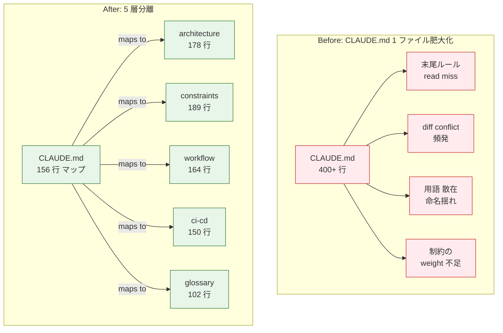
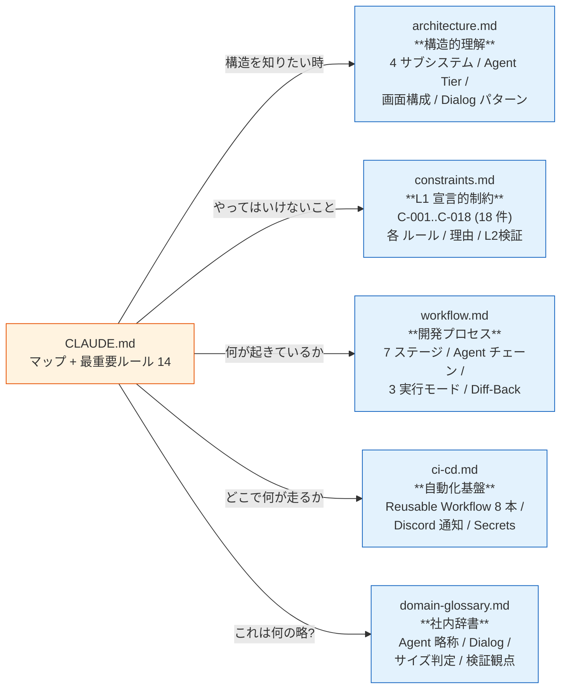
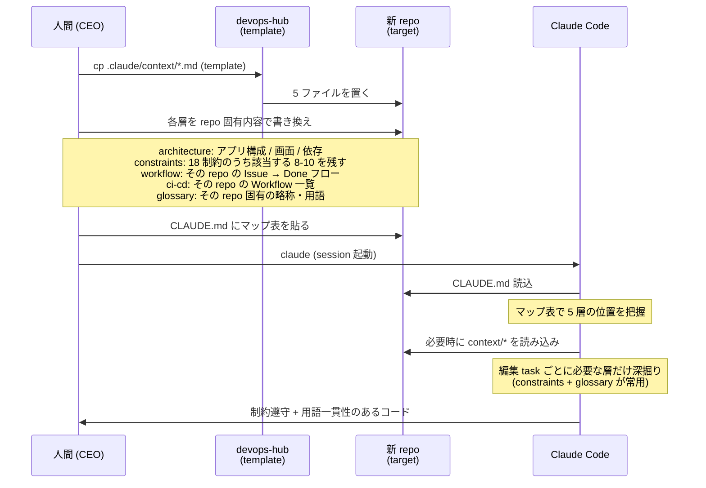
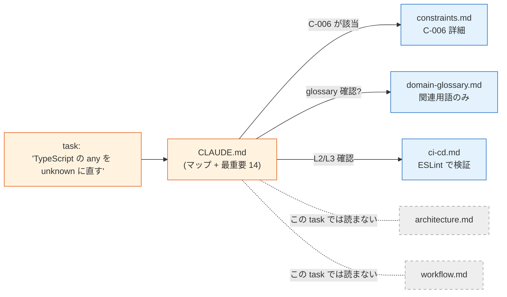
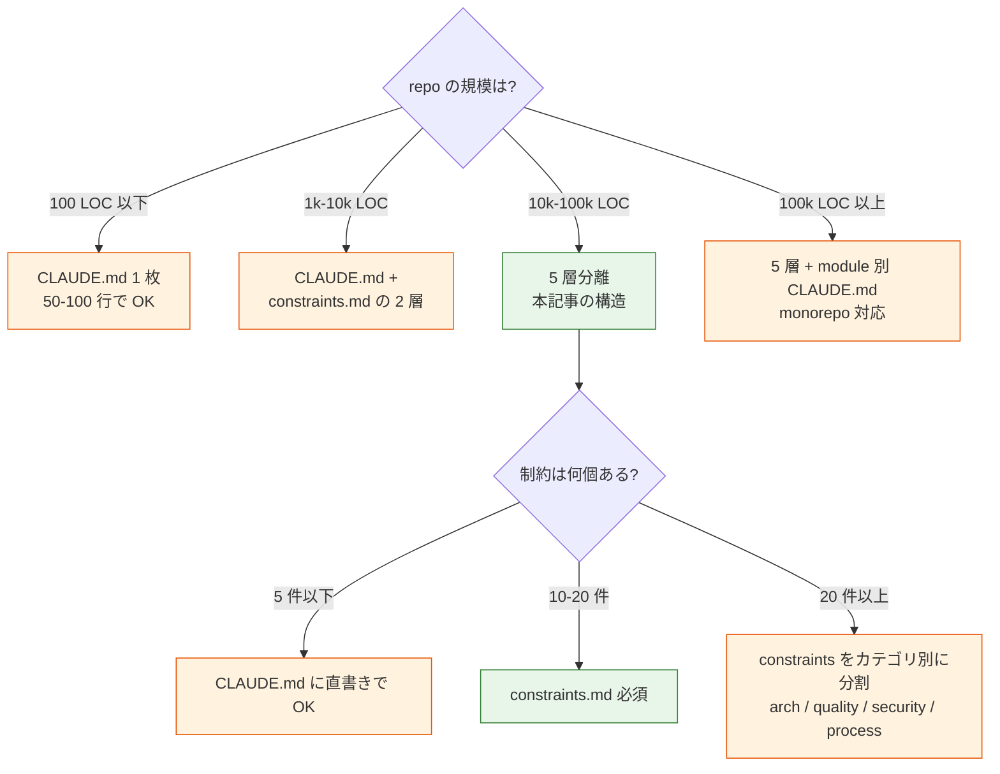

> **Disclaimer**: 本記事は著者が個人 (副業) で運営する小規模プロジェクト群 (CreaNest 名義) の技術記録です。所属組織・本業の業務内容とは一切関係ありません。記載の数値・構成は執筆時点 (2026-05) の自宅検証環境のスナップショットであり、商用品質や SLA を保証するものではありません。

Claude Code に渡す context を **5 層 (architecture / constraints / workflow / ci-cd / glossary) に分けて `.claude/context/` 配下に置く**だけで、新しい repo に放り込んでも「人並みの判断」をする AI 開発者になります。実測で **CLAUDE.md 156 行 + context 5 ファイル合計 783 行 (architecture 178 / constraints 189 / workflow 164 / ci-cd 150 / glossary 102)** という規模で、L1 制約 18 個と最重要ルール 14 件が repo 全体に効いている状態を維持しています。

> 用語: **Context Engine** = Claude Code が session 起動時に読み込む静的ナレッジ群。エンドユーザ向け SaaS の RAG (top-k 動的注入) とは別レイヤで、**「全部入れる」が前提の永続的な制約と語彙** を指す devops-hub の社内造語。

## なぜこの記事を書くか

「CLAUDE.md に何を書けばいいか」という記事は無数にありますが、**1 ファイルに全部詰め込むと数百行を超えた瞬間に AI が読み飛ばす** という再現性の高い問題があります。Anthropic が公式に推奨している `claude.md` (`AGENTS.md`) のサンプルも 100-200 行で止まっていて、その先のスケール戦略は誰も書いていません。

私は devops-hub というハーネス repo で **CLAUDE.md を 156 行に絞り、残り 783 行を 5 層 (architecture / constraints / workflow / ci-cd / glossary) に分割** することで、その壁を越えました。各層は **責務が直交** していて、AI が「今やっている作業に関係ある層だけ」を選んで深く読むことができます。

この記事では:

- なぜ CLAUDE.md 1 ファイル戦略が壊れるか (Before/After)
- 5 層それぞれの責務 (architecture / constraints / workflow / ci-cd / glossary)
- 各層の代表的な実コード抜粋 (file:line で)
- CLAUDE.md からの参照の張り方 (15 行のマップでナビゲートさせる)
- 失敗談 4 件 (層が混じる / 制約が constraints の外に書かれる / glossary が古くなる / hooks 配線忘れ)
- 残課題と理論根拠

を、実 repo (`devops-hub`) の file:line で全部公開します。

## 結論 (5 行)

- **CLAUDE.md は「マップ」と「最重要ルール 14」のみに絞る** — 156 行で repo 全体の入口を作る
- **context は 5 層に分割する** — architecture (構造) / constraints (L1 ルール) / workflow (プロセス) / ci-cd (自動化) / glossary (語彙)
- **層の責務は直交させる** — 制約は constraints にだけ、Agent 名は glossary にだけ、画面構成は architecture にだけ
- **CLAUDE.md からはマップだけ張る** — `| 内容 | ファイル |` の表で 8-15 行、AI に「必要な層だけ深掘り」させる
- **AI 向けの語彙集 (glossary) を必ず作る** — 「DocsA / EvalA」のような社内略称を一覧化、コード生成時の命名一貫性を担保

## 問題 — CLAUDE.md 1 ファイル戦略は数百行で壊れる

私は最初の 3 ヶ月、`CLAUDE.md` 1 枚に「概要 + アーキテクチャ + 制約 + プロセス + CI + 用語」を全部詰め込んでいました。**400 行を超えた頃から AI の判断品質が劣化** し始め、500 行で典型的な事故が起き始めました。

### 失敗 1: 末尾のルールが読まれない

400 行目以降に書いた「Firestore SDK は `@google-cloud/firestore` のみ (C-017)」を、Claude Code が **完全にスルーして `firebase-admin` を import するコード** を吐いた事故が複数回ありました。長文 prompt の中盤以降は attention が薄くなる、というのは LLM の現象として知られていますが、**運用中の repo でそれを実感した瞬間** がここでした。

### 失敗 2: 「全部入り」CLAUDE.md は更新しづらい

CI/CD の Workflow 名を変えた時に CLAUDE.md の関係箇所だけ書き換えるべきところを、間違えて「アーキテクチャ概要」のセクションも触ってしまうのが頻発。**ファイルが大きいほど merge conflict も増える** し、PR レビュー時の diff 解釈もしんどい。

### 失敗 3: 用語が repo 中に散らばる

「DocsA」「EvalA」「D-2 Red-Green Dialog」「PMA」みたいな社内略称が、CLAUDE.md / 個別 ADR / `prompts/*.md` / コード comment に**バラバラに定義**され、それぞれ微妙に表現が違う事故。Claude Code はそれを真似するので、生成されるコードに `DocsAgent` / `DocsA` / `docs_agent` が同居する。

### 失敗 4: 制約が「制約」として認識されない

「テストカバレッジ 80%」「any 禁止」のような L1 制約を、CLAUDE.md の散文の中に紛れ込ませると、**「重要そうな何か」としてしか認識されない**。「これは破ってはいけない rule である」という weight を AI に与えるには、制約だけを集めた専用層が必要でした。



## 解法 — 5 層分離 + CLAUDE.md = マップに徹する

退役後の構造はこうです。**`.claude/context/` 配下に 5 ファイルを置き、CLAUDE.md は表 1 個でナビゲート** します。

```text
devops-hub/
├── CLAUDE.md                          # 156 行 (マップ + 最重要ルール 14)
└── .claude/
    └── context/
        ├── architecture.md            # 178 行 (構造的理解)
        ├── constraints.md             # 189 行 (L1 制約 18 個)
        ├── workflow.md                # 164 行 (プロセス + 状態遷移)
        ├── ci-cd.md                   # 150 行 (Workflow + 通知)
        └── domain-glossary.md         # 102 行 (社内略称辞書)
```

5 層の責務マッピング:



ポイント 5 つ:

1. **CLAUDE.md は表 1 個でマップを張る** — 「これを聞きたい時はこのファイル」が一目で分かる
2. **各層の責務は直交させる** — Agent の略称は glossary だけ、L1 制約は constraints だけ、画面構成は architecture だけ
3. **各層は独立して読み終えられる単位にする** — 100-200 行に収める。それを超える層は更に分割する
4. **CLAUDE.md は "最重要ルール 14" だけ重複** — 残りは context への参照で「深く読みに行ってもらう」
5. **glossary は AI 向けの命名一貫性ツール** — Claude Code に独自略称を「正しい綴り」で書かせる仕組み

### CLAUDE.md は何を書くか — 156 行で repo 全体に蓋をする

実際の `CLAUDE.md:1-50` (`devops-hub/CLAUDE.md`):

```markdown
# CLAUDE.md — DevOps Hub AI 指示書

> 詳細は `.claude/context/` 配下の各ファイルを参照。ここは **マップ + 最重要ルール** のみ。

## 言語

- コミュニケーション: **日本語** / コード識別子: **英語**

## コンテキストマップ

| 内容 | ファイル |
|------|---------|
| アーキテクチャ | `.claude/context/architecture.md` |
| 制約事項 (L1) | `.claude/context/constraints.md` |
| 開発プロセス | `.claude/context/workflow.md` |
| CI/CD | `.claude/context/ci-cd.md` |
| ドメイン用語集 | `.claude/context/domain-glossary.md` |
| ハーネス設計ガイド | `docs/harness/engineering.md` |
| **Docs / .claude 構成規約** | `docs/standards/docs-structure.md` |
...

## 最重要ルール (14)

1. **App と pipeline-kit は依存分離** — 直接 import 禁止 (C-001)
2. **Creator ≠ Evaluator** — 生成 Agent と検証 Agent は分離する (C-002)
3. **収束ガード必須** — 全 Dialog に最大ラウンド制限 (C-003)
...
14. **docs Write 前 SSOT mandate** — 新規 docs/**/*.md 作成前に必ず以下を実行 ...
```

意図はこうです:

- 冒頭の **「詳細は `.claude/context/` 配下の各ファイルを参照」** が、AI に「ここで止まらず深掘りしろ」と指示する
- **コンテキストマップ表** で「何を聞きたい時にどこを読めばいいか」を 8-15 行に圧縮
- **最重要ルール 14** だけ重複して書く — context 層を読みに行く前に脳に焼き付けたいトップ 14 だけ。残りは constraints.md に飛ぶ

「最重要ルール」と「全制約」を分けるのが肝。**全 18 制約を CLAUDE.md に貼ると attention が散る** ので、CLAUDE.md には trigger 14 だけ並べて、各 ID (C-001..C-018) で constraints.md にジャンプさせます。

### Layer 1: architecture.md — 構造的理解の層

[`.claude/context/architecture.md:1-40`](https://github.com/SakakitaniJunya/devops-hub/blob/main/.claude/context/architecture.md#L1-L40):

```markdown
# アーキテクチャ概要 — DevOps Hub

> AI がこのプロジェクトの開発者として判断するための構造的理解を提供する。

## ハーネスレイヤー（メタアーキテクチャ）

DevOps Hub は 4 サブシステムアーキテクチャに基づく AI ハーネスを実装する。

┌──────────────────────────────────────────────────────────────────┐
│                    AI Harness Architecture                        │
│  ┌──────────────────┐  ┌──────────────────┐                     │
│  │  Context Engine   │  │ Constraint Engine │                     │
│  │  CLAUDE.md       │  │  L1: constraints │                     │
│  │  .claude/context/│  │  L2: vitest      │                     │
│  │  docs/仕様書群    │  │  L3: CI Pipeline │                     │
│  └────────┬─────────┘  └────────┬─────────┘                     │
│           ▼                      ▼                              │
│  ┌─────────────────────────────────────────┐                     │
│  │            Process Engine               │                     │
│  │  DocsA → EvalA → DevA → TestA → ...     │                     │
│  └────────────────────┬────────────────────┘                     │
└──────────────────────────────────────────────────────────────────┘
```

ここに置くべき内容:

- **「このプロジェクトは何でできているか」の俯瞰図** (4 サブシステム / 2 アプリケーション / Agent Tier / Dialog)
- **画面構成** (App は 6 画面: `/` / `/board` / `/feed` / `/projects/:repo` / `/wbs` / `/settings`)
- **依存方向** (App → pipeline-kit を import してはいけない / etc)
- **Agent インターフェース** (ファイル経由 / プロンプト経由 / pipeline-status.json 経由)

ここに置いてはいけない内容:

- L1 制約のルール本文 (constraints.md にだけ書く、ここは参照のみ)
- 用語の定義 (glossary に書く、ここでは略称を使うだけ)
- CI Workflow の詳細 (ci-cd.md に書く)

[`architecture.md:128-156`](https://github.com/SakakitaniJunya/devops-hub/blob/main/.claude/context/architecture.md#L128-L156) の **Agent Tier** は責務分割の典型例:

```text
Tier 1: オーケストレーション
  └── PMA (orchestrator.ts) — サイズ判定 + Agent チェーン制御

Tier 2: 生成 (Creator Agents)
  ├── DocsA — 仕様書作成 (docs-agent.md)
  ├── DevA  — コード実装 (dev-agent.md)
  └── PRA   — PR 作成 (pr-agent.md)

Tier 3: 検証 (Evaluator Agents) — Creator ≠ Evaluator
  ├── EvalA — 仕様書検証: 4 観点 (eval-agent.md)
  ├── TestA — テストカバレッジ検証 (test-agent.md)
  └── RevA  — コードレビュー: 5 観点 (review-agent.md)

Tier 4: サポート
  └── CIA   — CI 失敗分析 + 自動修正 (ci-fix-agent.md)
```

「DocsA」「EvalA」のような略称は **glossary.md で 1 度だけ正式定義** し、architecture.md ではその略称を使うだけ。命名の SSOT (Single Source of Truth) を 1 箇所に集約します。

### Layer 2: constraints.md — L1 宣言的制約の層

ここが context 5 層の中で最も「AI に効かせる」層です。

[`.claude/context/constraints.md:1-12`](https://github.com/SakakitaniJunya/devops-hub/blob/main/.claude/context/constraints.md#L1-L12):

```markdown
# 制約事項 — L1 宣言的制約

> このファイルに記載されたルールは、AI・人間を問わず全開発者が遵守する。
> 各ルールには理由・L2 検証・違反時の対処を併記する。

---

## アーキテクチャ制約

### C-001: App と pipeline-kit の依存分離

- **ルール**: App は pipeline-kit の TypeScript コードを直接 import してはならない。
- **理由**: App は Vercel にデプロイされる Next.js アプリ、pipeline-kit は ...
- **L2 検証**: `import.*from.*pipeline-kit` の grep チェック
- **違反時の対処**: 共有型を各パッケージの types.ts に独立定義
```

**1 制約 = 4 フィールド (ルール / 理由 / L2 検証 / 違反時の対処)** という固定構造。これが効きます。

なぜ 4 フィールドか:

| フィールド | 何のため | AI への効果 |
|---|---|---|
| **ルール** | What | 「これは禁止」と明示できる |
| **理由** | Why | 例外を作る判断ができる (理由が当てはまらない時はルールも当てはまらない) |
| **L2 検証** | How verified | 自動チェックの実装が決まる (`grep` / `eslint` / `tsc`) |
| **違反時の対処** | How fixed | 検出した時の修正パスが分かる、AI が自動修正できる |

Claude Code は「ルールに違反しているコード」を見つけた時、`違反時の対処` フィールドを読んで **自動修正の方針を立てます**。これがなければ「違反です」とコメントするだけで止まる。

[`constraints.md:166-189`](https://github.com/SakakitaniJunya/devops-hub/blob/main/.claude/context/constraints.md#L166-L189) の **制約サマリ表** が秀逸:

```markdown
## 制約サマリ

| ID | カテゴリ | 制約名 | 重要度 |
|----|---------|--------|--------|
| C-001 | アーキテクチャ | App / pipeline-kit 依存分離 | 高 |
| C-002 | アーキテクチャ | Creator ≠ Evaluator | 高 |
| C-003 | アーキテクチャ | 収束ガード必須 | 高 |
| C-004 | アーキテクチャ | Reusable Workflow 設計 | 中 |
| C-005 | コード品質 | strict mode | 高 |
...
| C-018 | コード品質 | Seed / モックデータの本番経路埋め込み禁止 | 高 |
```

末尾に **全 18 制約の表** を置くことで、AI が「自分の編集に効く制約はどれか」を一覧で素早く判断できます。

### Layer 3: workflow.md — プロセスと状態遷移

[`.claude/context/workflow.md:5-32`](https://github.com/SakakitaniJunya/devops-hub/blob/main/.claude/context/workflow.md#L5-L32):

```markdown
# 開発プロセス — DevOps Hub

## 7 ステージパイプライン

Backlog → Active → Designing → Developing → Reviewing → Deploying → Done

| ステージ | 誰が遷移 | 内容 |
|---------|---------|------|
| Backlog | 人間 | Issue 起票。AC を記載 |
| Active | 人間 | active ラベル付与 = 開発 GO |
| Designing | Agent (DocsA + EvalA) | 仕様書生成 + 検証 (large のみ) |
| Developing | Agent (DevA + TestA) | 実装 + テスト (D-2 Red-Green) |
| Reviewing | Agent (RevA + DevA) | レビュー + 修正 (D-3 Review-Fix) |
| Deploying | CI/CD | main マージ → 自動デプロイ |
| Done | 自動 | デプロイ完了 → Issue クローズ |

## 人間の介入ポイント (3 箇所のみ)

1. Issue 起票 + AC 記載
2. Active ラベル付与
3. PR レビュー + マージ
```

ここに置くべきは **「何が、どんな順番で起きるか」**:

- 7 ステージの状態遷移
- サイズ別フロー (`small` / `medium` は D-1 スキップ / `large` は D-1 含む)
- Diff-Back ルール (各 Dialog の最大ラウンド数)
- エスカレーションフロー
- 3 実行モード (Mode A: GitHub Actions / Mode B: ローカル CLI / Mode C: ローカルポーリング)
- ブランチ戦略 (`feature/issue-{N}-{slug}`)
- ラベル一覧 (`active` / `designing` / `developing` / `reviewing` / `bot:awaiting-response` / `bot:blocked` / `auto`)

ここに置いてはいけない:

- ルール (constraints.md)
- Workflow ファイル名や YAML の中身 (ci-cd.md)
- 略語の定義 (glossary.md)

### Layer 4: ci-cd.md — 自動化基盤の層

[`.claude/context/ci-cd.md:1-20`](https://github.com/SakakitaniJunya/devops-hub/blob/main/.claude/context/ci-cd.md#L1-L20):

```markdown
# CI/CD パイプライン構成 — DevOps Hub

## Workflow 一覧

pipeline-kit/.github/workflows/
├── pipeline.yml          ← エントリポイント (各プロジェクトが参照)
├── auto-develop.yml      ← Issue → Claude Code → PR 自動化
├── ci-gate.yml           ← テスト + Lint + CI Fix Agent
├── auto-deploy.yml       ← Vercel デプロイ + 通知
├── auto-deploy-gcp.yml   ← GCP Cloud Run デプロイ
├── notify-discord.yml    ← Discord Webhook 通知
├── notify-email.yml      ← Email 通知
└── cleanup-artifacts.yml ← アーティファクト管理
```

ここに置くべきは **「どこで何が、どんな条件で走るか」**:

- Reusable Workflow 8 本のリスト
- 各 Workflow のトリガー / タイムアウト / 必要 Secrets
- L2/L3 制約の自動実行マッピング
- Discord 通知の Embed フォーマット (色 / フィールド)
- デプロイ先 (Vercel / GCP Cloud Run)
- ローカル開発コマンド

[`ci-cd.md:84-94`](https://github.com/SakakitaniJunya/devops-hub/blob/main/.claude/context/ci-cd.md#L84-L94) の **L2/L3 制約マッピング**:

```markdown
### L2/L3 制約の自動実行

| 制約 | ステージ | 検証内容 |
|------|---------|---------|
| C-005 | Quality | `tsc --noEmit` (TypeScript strict) |
| C-006 | Quality | ESLint `no-explicit-any` |
| C-008 | Test | `vitest --coverage` (80% 閾値) |
| C-001 | Test | App ↔ pipeline-kit 依存チェック (将来) |
```

これが効くのは、**「constraints.md に書かれた L1 ルールが、CI のどのステージで自動検証されるか」が双方向に追跡できる** からです。Claude Code は constraints.md を読んだ後で ci-cd.md を読むと、「この制約は L2 検証 = ESLint なので、ローカルで `pnpm lint` を走らせれば違反は事前に取れる」と理解できます。

### Layer 5: domain-glossary.md — AI 向け命名辞書

ここが Claude Code への愛が詰まる層です。

[`.claude/context/domain-glossary.md:1-19`](https://github.com/SakakitaniJunya/devops-hub/blob/main/.claude/context/domain-glossary.md#L1-L19):

```markdown
# ドメイン用語集 — DevOps Hub

> AI がコード生成時に正しい命名・概念理解をするための参照辞書。
> 新しい用語が登場したら随時追記する。

## Agent 略称

| 略称 | 正式名 | Tier | 役割 | コード上の表現 |
|------|--------|------|------|-------------|
| **PMA** | PM Agent | 1: オーケストレーション | サイズ判定 + Agent チェーン制御 | `orchestrator.ts` |
| **DocsA** | Docs Agent | 2: 生成 | 仕様書作成・更新 | `prompts/docs-agent.md` |
| **DevA** | Develop Agent | 2: 生成 | コード実装 | `prompts/dev-agent.md` |
| **PRA** | PR Agent | 2: 生成 | PR 作成 + Issue 関連付け | `prompts/pr-agent.md` |
| **EvalA** | Eval Agent | 3: 検証 | 仕様書↔AC 整合性検証 | `prompts/eval-agent.md` |
| **TestA** | Test Agent | 3: 検証 | テストカバレッジ検証 | `prompts/test-agent.md` |
| **RevA** | Review Agent | 3: 検証 | 5 観点コードレビュー | `prompts/review-agent.md` |
| **CIA** | CI Agent | 4: サポート | CI 失敗分析 + 自動修正 | `prompts/ci-fix-agent.md` |
```

5 列構造 (略称 / 正式名 / Tier / 役割 / コード上の表現) が肝。これがあると **Claude Code が新しいファイルを生成する時に正しい命名で書ける**:

- 関数名は「コード上の表現」列の表記に合わせる (`orchestrator.ts` / `docs-agent.md`)
- 略称はファイル内で「DocsA」と書いて良い、ただし**初回登場時は正式名 (Docs Agent) を併記**
- 概念名は **正式名 (英語)** を採用する (`Develop Agent` を `DevAgent` クラス名に使う等)

[`glossary.md:33-42`](https://github.com/SakakitaniJunya/devops-hub/blob/main/.claude/context/domain-glossary.md#L33-L42) の Dialog 用語:

```markdown
## Dialog 用語

| 用語 | 英語 | 定義 | コード上の表現 |
|------|------|------|-------------|
| D-1 | Spec Validation Dialog | DocsA ↔ EvalA の仕様検証ループ | `dialogs/spec-validation.ts` |
| D-2 | Red-Green Dialog | DevA ↔ TestA の TDD ループ | `dialogs/red-green.ts` |
| D-3 | Review-Fix Dialog | RevA → DevA のレビュー修正ループ | `dialogs/review-fix.ts` |
| ラウンド | Round | Dialog ループの 1 反復 | `rounds: number` |
```

「`dialogs/spec-validation.ts`」のような **ファイルパスまで明記** しておくと、Claude Code が D-1 関連のコードを編集する時に**最初から正しいファイルを開きに行く**。これは search のステップを削るので、開発スループットが体感できるレベルで上がります。

### 各層の行数 — 100-200 行に収める

| 層 | 行数 | 役割 |
|---|---:|---|
| `CLAUDE.md` | 156 | マップ + 最重要ルール 14 |
| `architecture.md` | 178 | 4 サブシステム + 2 アプリ構成 + Agent Tier + Dialog |
| `constraints.md` | 189 | L1 制約 18 件 (1 制約 = 4 フィールド) |
| `workflow.md` | 164 | 7 ステージ + サイズ別フロー + 3 実行モード |
| `ci-cd.md` | 150 | Reusable Workflow 8 本 + 通知 + Secrets |
| `domain-glossary.md` | 102 | Agent 略称 / Dialog / 検証観点 / プロジェクト用語 |
| **合計** | **939** | — |

200 行を超えるとさらに分割の signal。実際 `architecture.md` は 178 行で、近いうちに「ハーネス層」と「アプリケーション層」に 2 分割する予定です。

### 実 repo に展開する流れ

新しい repo に Context Engine を導入する流れ:



「context 5 ファイルを **template として cp して、各 repo の固有内容で書き換える**」が最高効率。**新 repo を 30 分で AI 開発 ready にできる** のがこの構造の最大のメリットです。

## 失敗談

### 失敗 1: 制約の理由を書き忘れて AI が無視した

C-018 (Seed / モックデータの本番経路埋め込み禁止) を最初に書いた時、「ルール」だけで「理由」を省きました。Claude Code は **「禁止と書いてあるが理由が腑に落ちないルール」を、別の制約と矛盾しそうな状況で平気で破ります**。

[`constraints.md:75`](https://github.com/SakakitaniJunya/devops-hub/blob/main/.claude/context/constraints.md#L75) で理由を 4 行で追記してから、`mockData = [...]` を本番経路に埋める事故は止まりました:

```markdown
- **理由**: Seed ハードコーディングは「実装した気になれる小手先開発」の典型。本物のデータ接続・認証・エラーハンドリングを後回しにし、デモでは動くが本番投入時に総書き換えになる。CEO の意思決定 (KPI 表示、Approval Queue、Pipeline Status 等) が偽データに引きずられる事故も発生する。MVP であっても **データソースは最初から実 DB / 実 API に繋ぐ** こと。空配列・ローディング表示・エラー UI は許容するが、偽の「それっぽい」値で埋めてはならない。
```

「禁止と書いて済ませない、なぜ禁止かを書く」が制約層の鉄則。

### 失敗 2: glossary を Architecture に書いて 2 箇所に同じ略称が出来た

「DocsA = Docs Agent」を `architecture.md` の Agent Tier セクションでも定義し、`glossary.md` でも定義したことがありました。Architecture 側で「Docs Agent (DocsA)」、Glossary 側で「DocsA = Docs Agent」と書き方が違って、**Claude Code が `DocAgent` (= "s" を落とす) というファイル名を作る** 事故。

修正:

- **正式定義は glossary.md にだけ**
- architecture.md は略称 (DocsA) だけ使う、初回登場時に「DocsA (詳細は glossary)」と書くだけ
- 重複した瞬間に MECE が壊れる、と覚える

### 失敗 3: workflow と ci-cd の境界が曖昧で AI が混乱

「main push → Vercel デプロイ」を、`workflow.md` の「7 ステージ」セクションでも、`ci-cd.md` の「auto-deploy.yml」セクションでも書いていた時期。Claude Code が「デプロイの仕様変更」をする時に **どっちを正とすべきか判断できず、両方を中途半端に書き換えた PR** が出たことがありました。

責任分担を明確化:

| 層 | 担当 |
|---|---|
| workflow.md | 「デプロイ」というステージが存在する事実 / 誰が遷移させるか / 失敗時のフロー |
| ci-cd.md | 「auto-deploy.yml」というファイルがある事実 / トリガー / Secrets / Vercel 連携の詳細 |

「**ステージが何か**」と「**Workflow ファイルが何か**」は別レイヤと教える。これで混線は止まりました。

### 失敗 4: hooks 配線忘れで constraints が動かなかった

`docs Write 前 SSOT mandate` (最重要ルール 14) を CLAUDE.md と constraints.md に書いた直後、CI で重複 `id` を検出する `node scripts/generate-docs-graph.mjs --check` を **PostToolUse hook にしか配線せず、commit hook 側で抜けていた** ことがありました。AI は「文書には従うけど、文書が CI で強制されない限り油断する」ので、**5 層の context は配線とセットで初めて効く**。

修正後は `.claude/settings.json` の `PostToolUse` hook と `pre-commit` hook 両方で `docs-mece-audit` skill が fire するようになり、`.claude/pipeline/agent.log` に `[F]` `[E]` violation を記録するようになりました。

> 教訓: **context 5 層 (= L1 宣言) と hook (= L2/L3 強制) は車の両輪**。L1 だけだと AI は油断する、L3 だけだと AI は理由を理解せず修正できない。

## 残課題

### 残課題 1: 各 repo の context をどう同期するか

devops-hub には 5 層 context があり、Komyu / nailsalon / build-football / yomi-note / vivivi-beauty 等の監視対象 repo にも個別の `.claude/context/` があります。**「devops-hub の constraints.md を更新したら、子 repo にも反映するべき制約がある」** ケースで、現状は手動 cp + 修正。半年で 3 件くらい同期忘れの事故が出ています。

候補:

- (A) symlink で devops-hub からの参照に統一 — git 跨ぎが効かないので採用見送り
- (B) `node scripts/sync-context.mjs` で git submodule 風に sync — 実装着手予定
- (C) 子 repo は「devops-hub の C-001..C-018 のうち XX を継承する」と宣言だけする — 採用検討中

### 残課題 2: glossary が古くなる

新しい Agent / Dialog / ラベルを追加した時、glossary.md への追記を忘れる人間 (= 私) がいる。**docs-mece-audit skill で「コード中に出る略称が glossary.md に存在するか」をチェック** する仕組みを足したいが未実装。

### 残課題 3: context 層の最適サイズが repo 規模で変わる

100 LOC の小さい repo に 5 層 939 行は過剰。逆に 10 万 LOC のモノレポでは 5 層 939 行では足りない (architecture が 500 行を超える)。**repo 規模ごとの推奨 context サイズ** を guide にしたいが、まだサンプルが 8 repo しかなくて統計取れていません。

## 理論根拠 — なぜ 5 層分離が効くか

### 根拠 1: LLM の attention は long-context で減衰する

GPT-4 / Claude 3.5 / Gemini 2.0 のいずれも、**1 つの prompt 内で情報密度が均一に下がる** ことが報告されています (Lost in the Middle 現象)。CLAUDE.md 1 ファイルに 500 行詰めると、200-400 行目あたりの記述が最も読まれにくい。

5 層分離の効果は、**Claude Code が 「この task に関係ある層だけ」 を選んで読む** ことで、各層の中での attention 分布を均一に保てる点。`constraints.md` を読みに行った時はその 189 行に集中するので、末尾の C-016/C-017/C-018 まで丁寧に読まれる。

### 根拠 2: 責務分離は AI にも人間にも効く

Software Engineering の Single Responsibility Principle (SRP) は、**「変更理由が同じものを 1 箇所に集める」** という原則。これは context 層にも当てはまります:

- 制約が変わる → constraints.md だけ書き換える
- Workflow が変わる → ci-cd.md だけ書き換える
- 略称が増える → glossary.md だけ書き換える

これにより **PR diff が常に小さくなり、レビューしやすく、merge conflict が減る**。「人間の認知負荷を下げる構造は AI の認知負荷も下げる」というのが運用 6 ヶ月で得た直感。

### 根拠 3: マップ + 詳細の 2 層は人間の本でも標準

**目次 + 章本文** という本の構造は、人間が「読むべき箇所を素早く決めて、深く読む」のに最適化されている。CLAUDE.md = 目次、context/* = 章本文、と捉えると、AI も同じ構造で恩恵を受けます。



「any → unknown」task に対しては:
- `architecture.md` (構造) は不要
- `workflow.md` (プロセス) も不要
- `constraints.md` の C-006 セクション + `ci-cd.md` の L2 検証マッピング + `glossary.md` の関連用語、の 3 層だけ深掘りすれば完了

**読まない選択ができる構造が、AI のスループットを上げる**。

## 採用判断のフローチャート

「context をどう書くか」で迷ったらこうです:



私の運用範囲 (1k-100k LOC の SaaS / OSS repo) では **5 層分離が sweet spot** でした。

## 用語整理

| 本記事の用語 | 業界標準語 | 説明 |
|---|---|---|
| Context Engine | system prompt / agent context | Claude Code が session 起動時に読む静的ナレッジ |
| L1 制約 | declarative constraint | 文書として宣言、AI が読んで従う |
| L2 制約 | structural constraint | テストや lint で強制 |
| L3 制約 | enforcement constraint | CI でマージブロック |
| 5 層分離 | layered context | 責務直交の文書分割 |
| マップ表 | navigational ToC | CLAUDE.md 冒頭の参照表 |
| MECE | mutually exclusive collectively exhaustive | 重複なし漏れなし |

## まとめ

- Claude Code に渡す context は **5 層 (architecture / constraints / workflow / ci-cd / glossary) に分けて `.claude/context/` 配下に置く** だけで、新 repo を 30 分で AI 開発 ready にできます
- **CLAUDE.md は「マップ + 最重要ルール 14」の 156 行に絞り**、残り 783 行は context/ に分割して責務を直交させる
- `constraints.md` は **1 制約 = 4 フィールド (ルール / 理由 / L2 検証 / 違反時の対処)** で書く。理由を省くと AI は破る、L2 検証を省くと自動チェックが繋がらない、違反時の対処を省くと自動修正できない
- `domain-glossary.md` は **AI 向けの命名一貫性ツール**。略称・正式名・コード上の表現を 5 列で並べる
- 各層は **100-200 行に収める**。それ以上は更に分割の signal
- L1 (= context 5 層) は **L2/L3 (= eslint / tsc / CI hooks) と組合せて初めて効く**。文書だけでは AI は油断する、強制だけでは理由が分からず修正できない

実コードは `devops-hub/CLAUDE.md` と `devops-hub/.claude/context/` 配下にあります。各層 100-200 行のサイズ感、4 フィールド構造、5 列 glossary の書き方、いずれも file:line で本記事に引用しています。

## 次の記事へ + 連載をフォロー

これは **52 本連載 (ai-driven-dev) の Day 22/52** です。

- 関連記事: **E-01 [pgvector なしで RAG — ドメイン辞書 × Markdown チャンク](./rag-without-pgvector)** — 本記事 Context Engine の対比軸、エンドユーザ SaaS 側の動的 RAG をどう設計するか
- 次の記事: **E-04 [Constraint Engine 3 層 — L1 declarative / L2 structural / L3 enforcement](./constraint-engine-3-layers)** (準備中) — context 5 層と組合せる強制の話
- アーキテクチャ全体像: **A-01 [Claude Code を会社にする 5 メカニズム](./claude-code-as-company-5-mechanisms)** — Context Engine が他の 4 メカニズム (Constraint / Process / Reconciliation / Decision) とどう繋がるか

連載を見逃さない方法:

- **Zenn でこの著者をフォロー** — 公開通知が届きます
- **X で告知 tweet をフォロー** — 朝 6:00 に投稿予定
- **repo を watch**: [SakakitaniJunya/zenn-articles](https://github.com/SakakitaniJunya/zenn-articles) — 全 draft が見えます

「うちの repo に 5 層導入したら hoge が困った」「architecture.md は更に細分化すべき」のリクエストは GitHub Issue / Discussion でお気軽に。設計議論は歓迎です。
