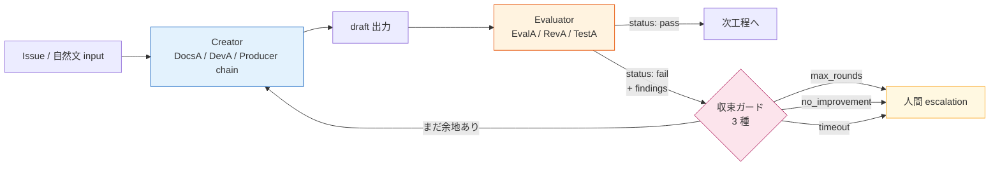
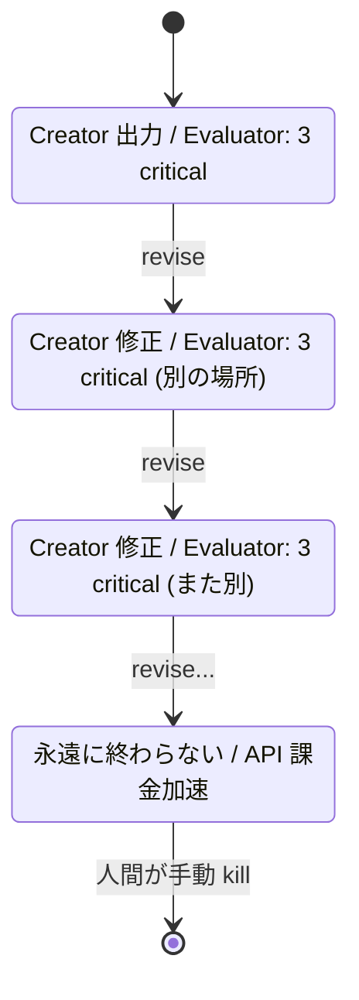
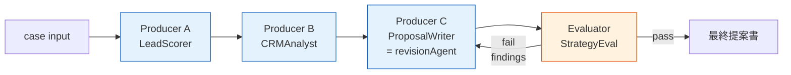
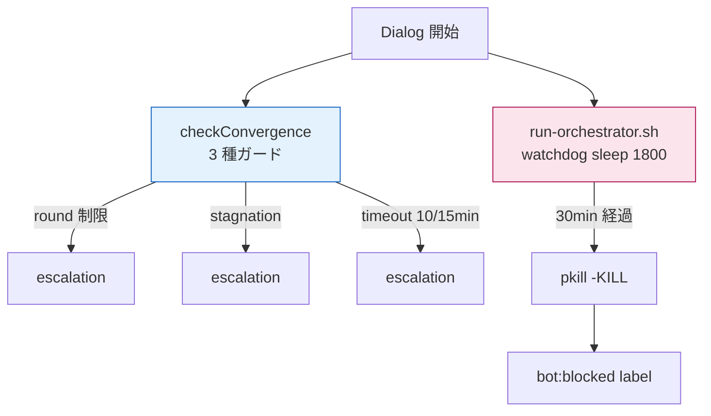

> この記事は **52 本連載 (ai-driven-dev) の Day 5/52** です。第 1 回 [Claude Code で「会社」を回す 6 層構成 — 52 本連載 INDEX](./ai-driven-dev-index-2026) から続きます。
>
> ※ 本記事は著者個人の副業プロジェクト群 (CreaNest 名義) における実践記録です。本業 (別会社所属) の業務・知見とは無関係で、特定法人の公式見解ではありません。記載の数値・コードはすべて執筆時点 (2026-05) の自宅検証環境のスナップショットで、商用品質や SLA を保証するものではありません。コード片は全て著者個人 repo の自著コードです。

## 結論

- AI Agent の自律ループは **「Creator が自分で評価する瞬間」に必ず壊れる**。生成役と評価役を **別 Agent に分離**、最大 **3 ラウンド** で人間に escalation、というシンプルな構造で収束する。
- devops-hub では `pipeline-kit/agents/guards/convergence.ts` にこの「収束ガード 3 種 (max rounds / no improvement / timeout)」を 1 ファイルで集約しており、13 部署 director の Dialog からも 7 段の開発パイプラインからも、同じ guard を呼んでいる。
- 1 年運用した結果、**確証バイアスで永遠に修正案が出続ける** / **無限ループで API クレジットだけ溶ける** / **評価軸を統一しすぎて評価が発散する** の 3 大事故は、設計レベルで予防できる。

> 用語: 本記事で「**Dialog**」と書くのは Creator Agent と Evaluator Agent が 1 件の生成物 (仕様書 / コード / 提案文) を「PASS まで往復させる単位」を指す内部造語。pipeline-kit では `D-1` (仕様レビュー) `D-2` (コード自動修正) `D-3` (差分レビュー) の 3 種が定義されている。

## なぜこの記事を書くか

「Multi-Agent でやれば品質は上がる」と書かれた記事は腐るほどありますが、**「ではどう Agent を割って、何を guard にして止めるのか」** を実コードで示している記事は意外と少ない。私が辿り着いた答えは身も蓋もない 1 行で、**生成と評価を同じ Agent に兼務させた瞬間に終わる**、というものです。

本記事は、その「Creator ≠ Evaluator」を 3 ラウンドで確定的に収束させる設計を、devops-hub の実コード (TypeScript + Bash) と 13 部署 director の運用例で書ききります。出てくる数字は全部実 repo に当てて確認したもの、図は全部 Mermaid、ASCII 図はゼロ。

## 全体像 — Creator → Evaluator → 収束ガード

まず脳内地図を 1 枚で固定します。



**見方**: Creator 単体では「自分の出力を `pass` と判定する誘惑」に勝てない。`pass / fail` の判定は構造的に別 Agent に渡し、`fail` の時だけ revision に戻る。3 種の収束ガードのどれかに当たれば即座に人間へ escalation する、という強い「**降りる線**」を引いておく。

## Creator と Evaluator を分けないと何が起きるか

### 失敗 1: 「Creator が自分で評価」は確証バイアスで永遠に修正案が出続ける

最初に組んだ仕様生成 Agent はこんな構造でした。1 体の Agent に「仕様書を書いてください、書いた後に自己レビューもしてください」と頼む、いわゆる self-critique 構成。

**Before** (壊れた版):

```typescript
// 1 体の Agent に Creator + Evaluator を兼務させた版 (廃止)
async function generateSpecBroken(issue: Issue): Promise<SpecDoc> {
  const draft = await runner.run("docsAgent", buildSpecPrompt(issue));
  // 同じ Agent に「自分の出力をレビューして」と頼む
  const review = await runner.run("docsAgent", buildSelfReviewPrompt(draft));
  // review が "issue なし" を返すまでループ
  for (let i = 0; i < 99; i++) {
    if (review.status === "pass") return draft;
    // ... 永遠にここから出てこない
  }
}
```

実測の挙動: 1 ラウンド目で `status: pass` を返す確率がほぼ 100%。たまに `fail` を返しても、修正後の自己レビューで「これで完璧です」と言い切ってきます。**自分の出力を否定する Agent はいない**。L1 制約 C-002 「Creator ≠ Evaluator」(`devops-hub/.claude/context/constraints.md:18-22`) はまさにこれを禁じる条文です。

### 失敗 2: ガードを置かず無限ループで API クレジットを溶かした

次にやったのが「Creator と Evaluator を別 Agent にしたんだから、Evaluator が pass と言うまで回せばよくない?」というナイーブ実装。Anthropic の API クレジットが半日で 4 桁飛んで気がつきました。Evaluator は厳しいときは厳しく、毎回 1〜2 個の `warning` を吐き続け、Creator はそれを「全部直す」と言いつつ別の場所で別の `warning` を生むので、**収束しない悪戯のような状態**が永遠に続きます。



教訓: **「Evaluator が pass と言うまで」は終了条件にならない**。Evaluator は構造的に「もうちょっと良くできる」を返し続ける役で、それは正しい役割。終わらせるのは別レイヤー = **収束ガード**の仕事です。

### 失敗 3: 13 director で評価軸を統一しすぎて発散した

devops-hub には 13 部署の director がいます (`/sales`, `/marketing`, `/cs` など)。最初、各部署の Evaluator を共通テンプレで揃えたら、**「sales の提案書を marketing 視点で評価し始める」** 事故が起きました。プロンプトに「全方位で評価してください」と書いたのが敗因。Evaluator は方位が固定されて初めて Evaluator として機能します。

修正: 各部署ごとに `evaluationAspects` を明示列挙する設計に倒しました (実コード `pipeline-kit/agents/departments/types.ts:390-410` の `SKILL_REGISTRY`、抜粋):

```typescript
// 部署ごとに評価軸を fix する
{
  id: "lead-scoring",
  department: "sales",
  agent: "leadQualifier",
  evaluationAspects: [
    "criteria-completeness",
    "score-justification",
    "priority-ranking",
  ],
},
{
  id: "escalation-decision",
  department: "cs",
  agent: "csReviewer",
  evaluationAspects: [
    "severity-assessment",
    "customer-impact",
    "sla-compliance",
  ],
},
```

**教訓: Evaluator の「観点」は明示列挙する**。「全方位」は評価ではない。

## 収束ガードの実装 — 3 種類

devops-hub の `pipeline-kit/agents/guards/convergence.ts:28-60` が本体。3 つのガードを 1 関数で重ねます。

```typescript
// pipeline-kit/agents/guards/convergence.ts:28-60 (実物)
export function checkConvergence(
  state: ConvergenceState,
  config: GuardConfig,
  dialog: DialogId,
): GuardResult {
  const { issueCountHistory, startedAt } = state;
  const round = issueCountHistory.length;

  // Guard 1: Max rounds
  if (round >= config.maxRounds[dialog]) {
    return { shouldStop: true, reason: "max_rounds" };
  }

  // Guard 2: No improvement
  const window = config.improvementCheckWindow;
  if (issueCountHistory.length >= window + 1) {
    const recent = issueCountHistory.slice(-(window + 1));
    const stagnant = recent.every(
      (count, i) => i === 0 || count >= (recent[i - 1] ?? 0),
    );
    if (stagnant && (recent[recent.length - 1] ?? 0) > 0) {
      return { shouldStop: true, reason: "no_improvement" };
    }
  }

  // Guard 3: Timeout
  const elapsed = Date.now() - startedAt;
  if (elapsed > config.timeouts[dialog]) {
    return { shouldStop: true, reason: "timeout" };
  }

  return { shouldStop: false };
}
```

ポイントは **`reason` を 3 種類の enum で返している** こと (`pipeline-kit/agents/types.ts:287-293`):

```typescript
export type EscalationReason =
  | "max_rounds"
  | "no_improvement"
  | "timeout"
  | "deadlock"
  | "context_exhaustion"
  | "unrecoverable_error";
```

これが大事で、人間に escalation するときに「**どのガードに当たって止まったか**」が分からないと、3 ラウンド目の人間判断が「もう 1 回回してみるか」になりがち。`max_rounds` で止まったら設計差し戻し、`no_improvement` で止まったら Creator のプロンプト見直し、`timeout` で止まったら Issue 分割、と次のアクションが変わります。

### Default 設定 — 数字に意味を持たせる

```typescript
// pipeline-kit/agents/types.ts:208-213 (実物)
export const DEFAULT_GUARD_CONFIG: GuardConfig = {
  maxRounds: { d1: 3, d2: 5, d3: 3 },
  timeouts: { d1: 600_000, d2: 900_000, d3: 600_000 },
  overallTimeout: 1_800_000,
  improvementCheckWindow: 2,
};
```

数字を本文で読み下します:

- **D-1 (仕様レビュー) は 3 ラウンド・10 分**。仕様の良し悪しは Creator/Evaluator の往復で決着しない問題が多く、3 ラウンドで合わなければ人間判断にした方が早い。
- **D-2 (コード自動修正) は 5 ラウンド・15 分**。コードは「テストを通す」という客観終了条件があるので、もう 2 ラウンド粘る価値がある。
- **D-3 (差分レビュー) は 3 ラウンド・10 分**。レビューは指摘 → 修正 → 再レビューが基本構造で、3 往復で済まない場合は PR を分割した方が良い。
- **overall は 30 分**。これは Layer 5 の `pipeline-kit/ops/run-orchestrator.sh:443-455` の watchdog と完全一致 (後述)。
- **improvementCheckWindow: 2** = 「2 ラウンド連続で `critical` 件数が減らなかったら no_improvement と判定」。

> CLAUDE.md ルール#8 (`devops-hub/CLAUDE.md`) は「**3 ラウンド超過で人間に委譲**」を最重要 14 ルールの 1 つに置いています。L1 制約 C-013 (`constraints.md:124-129`) の本文。

## 「改善」をどう判定するか — `findings.length` で殴る

`no_improvement` の判定は、**Evaluator が返した `critical` 件数の単調減少**を見るだけです。「コードの中身を比較する」みたいな高尚なことはしません。

```typescript
// pipeline-kit/agents/guards/convergence.ts:80-95 (実物)
export function checkImprovement(counts: number[], window: number): boolean {
  if (counts.length < window + 1) {
    return true;
  }
  const recent = counts.slice(-(window + 1));
  for (let i = 1; i < recent.length; i++) {
    const prev = recent[i - 1];
    const curr = recent[i];
    if (prev !== undefined && curr !== undefined && curr < prev) {
      return true; // Found improvement
    }
  }
  return false; // No improvement → escalate
}
```

ポイントは **「直近 window+1 件のうち 1 件でも減少があれば改善とみなす」** という緩めの条件。厳しめにすると 1 ラウンドの揺れで escalation してしまうので、`window: 2` (= 直近 3 件) で 1 度でも下がっていれば継続、とする方針です。

Evaluator は出力 schema を JSON で固定しているので、`critical` 件数を抽出するのは一瞬で済みます。Schema は `pipeline-kit/agents/departments/types.ts:85-97` の `DeptEvalResult`:

```json
{
  "status": "pass | fail",
  "score": 0-100,
  "findings": [
    {
      "severity": "critical | warning | suggestion",
      "aspect": "criteria-completeness",
      "description": "...",
      "recommendation": "..."
    }
  ],
  "summary": "..."
}
```

「`critical` だけ数える」という割り切りが効いていて、`warning` や `suggestion` は記録するけど収束判定には使いません。完璧主義に倒すと終わらないからです。

## 13 部署 director の Producer Chain × Evaluator

devops-hub には 13 部署の director がいます。実 repo の数:

```bash
$ ls /Users/sakaki/project/devops-hub/pipeline-kit/agents/prompts/ | grep -v _shared
ceo  cs  data  design  finance  hr  legal  marketing  pmo  pr  product  sales  strategy
# 13 directories
```

各部署は **「N 体の Producer chain → 1 体の Evaluator」** という構造で、これを generic 化したのが `executeDeptDialog` (`pipeline-kit/agents/departments/department-dialog.ts:93-175`) です。



ここで重要なのは **「revision は chain の最後の Producer (= synthesizer) だけが担当する」** 設計。実コード (`department-dialog.ts:229-255`):

```typescript
// 修正担当はチェーンの最後の Producer のみ
const revisionAgent = producers[producers.length - 1] ?? producers[0]!;

const prompt = [
  `以下の critical 指摘を踏まえて、出力を改善してください。`,
  "",
  "## 現在の出力",
  currentOutput,
  "",
  "## Evaluator からの指摘事項",
  findingsText,
  "",
  "critical 指摘をすべて解決した改善版を出力してください。",
].join("\n");

const output = await runner.run(revisionAgent, prompt);
```

理由: 例えば営業部署の chain が `LeadScorer → CRMAnalyst → ProposalWriter` の場合、リード評価や顧客分析は 1 度やれば十分で、毎ラウンド全員が再実行する必要はない。**「最後の合成役 (ProposalWriter)」が指摘を取り込んで書き直す**だけで品質は上がる、という割り切りです。これが効いて 1 ラウンドあたりの API call 数が劇的に減りました。

### Sales 部署の例 — Type S-1 (新規顧客獲得)

`pipeline-kit/agents/prompts/sales/director.md:50-60` の実物:

```
Type S-1: 新規顧客獲得（インバウンド）

Phase 1: LeadScorer → リード評価
Phase 2: CRMAnalyst → 類似顧客分析
Phase 3 (並列): ProposalWriter + PricingAnalyst
Phase 4: StrategyEval → 提案品質検証
Phase 5: ContractSpecialist → 契約条件設計
```

**Phase 4 が Evaluator**。Phase 1〜3 が Producer chain で、提案書ドラフトと価格戦略まで作った段階で `StrategyEval` が `evaluationAspects: ["criteria-completeness", "score-justification", "priority-ranking"]` の観点で `findings` を返す。`fail` なら ProposalWriter (chain の最後) が revise する、というのが 1 ラウンド。

13 部署で **ぴったり同じ構造** が動いており (`pipeline-kit/agents/departments/types.ts` の `SKILL_REGISTRY` に 100 skill / 307 aspect mention / 271 unique aspect を宣言)、guard は `convergence.ts` 1 ファイルが全部見ています。

## 7 段の開発パイプラインも同じガードで回している

ビジネス側 (13 部署 director) だけでなく、**開発側の 7 Agent パイプライン** (PMA → DocsA → DevA → RevA → EvalA → TestA → CIA、`pipeline-kit/agents/types.ts:232-281`) も同じ guard を使います。Agent ごとのモデル割り当て:

```typescript
// pipeline-kit/agents/types.ts:232-281 (一部抜粋)
export const AGENT_CONFIGS: Record<string, AgentConfig> = {
  pma:   { name: "PMA",   model: "claude-sonnet-4-6", ... },
  docsA: { name: "DocsA", model: "claude-sonnet-4-6", ... },
  evalA: { name: "EvalA", model: "claude-opus-4-6",   ... },  // 評価は強モデル
  devA:  { name: "DevA",  model: "claude-opus-4-6",   ... },
  testA: { name: "TestA", model: "claude-sonnet-4-6", ... },
  revA:  { name: "RevA",  model: "claude-opus-4-6",   ... },  // 評価は強モデル
  pra:   { name: "PRA",   model: "claude-haiku-4-5-20251001", ... },
  cia:   { name: "CIA",   model: "claude-sonnet-4-6", ... },
};
```

**Evaluator 役 (EvalA / RevA) には Opus を、Creator 役 (DocsA / DevA / TestA / CIA) には Sonnet/Haiku を当てている**点に注目してください。レビュアー側を強くする方が、生成側を強くするより全体品質が伸びる、というのが私の経験則です (このトピックは別記事 C-01 LLM-as-Judge で深掘り予定)。

## 30 分 watchdog — Bash レイヤーの最後の砦

TypeScript の guard を抜けても無限ループする可能性はゼロにはできません (Anthropic API 側で hang する、子プロセスが残る、など)。だから **Bash レイヤーで最後の砦** を置きます。`pipeline-kit/ops/run-orchestrator.sh:443-485`:

```bash
# bash watchdog: 30 分後にプロセスツリーごと kill
WATCHDOG_PID=""
start_watchdog() {
  local target_pid="$1"
  (
    sleep 1800
    log "WATCHDOG: 30min timeout — killing pid=${target_pid} and descendants"
    pkill -TERM -P "${target_pid}" 2>/dev/null || true
    kill  -TERM    "${target_pid}" 2>/dev/null || true
    sleep 10
    pkill -KILL -P "${target_pid}" 2>/dev/null || true
    kill  -KILL    "${target_pid}" 2>/dev/null || true
  ) &
  WATCHDOG_PID=$!
}
```

そして実 invocation:

```bash
# pipeline-kit/ops/run-orchestrator.sh:475-487 (実物)
claude \
  -p \
  --verbose \
  --permission-mode bypassPermissions \
  --add-dir "${TARGET_REPO}" \
  --add-dir "${DEVOPS_HUB_ROOT}/.claude" \
  < "${PROMPT_FILE}" >> "${WORKER_LOG}" 2>&1 &
CLAUDE_PID=$!
start_watchdog "${CLAUDE_PID}"

wait "${CLAUDE_PID}"
CLAUDE_EXIT=$?
```

**`sleep 1800` (= 30 分) は `DEFAULT_GUARD_CONFIG.overallTimeout` と完全一致**。コード側のガードと OS 側のガードが同じ閾値を持つことで、片方が壊れてももう片方が刈ります。



このダブルレイヤーがあることで、**「ガードを入れ忘れた Dialog」**が将来追加されても 30 分以上は走れない、という保険が効きます。

### 失敗 4: `acceptEdits` で headless 運用してハング

ここでもう 1 つ罠があります。最初、launchctl から起動する claude を `--permission-mode acceptEdits` で運用していました。Bash tool が出た瞬間に permission prompt で永遠待機。ガードもまだ `checkTimeout` を改修する前で、結果として **30 分 watchdog ぎりぎりまで idle のまま無進捗** という事故が頻発しました。

修正は前述の `bypassPermissions + stdin` パターン (`run-orchestrator.sh:475`)。**安全境界は cwd 制限 + log 監査 + 30 分 watchdog の 3 点で確保**しており、permission dialog で守る設計ではない、という割り切り。

## 評価 Schema を JSON 固定にしたのが効いた

Evaluator の出力を**自然言語ではなく JSON schema 固定**にしたのが、収束判定を安定化させた最大の打ち手でした。`department-dialog.ts:60-87`:

```typescript
function parseDeptEvalResult(raw: string): DeptEvalResult {
  const jsonStr = extractJsonBlock(raw);
  if (jsonStr) {
    try {
      const parsed = JSON.parse(jsonStr);
      if (
        typeof parsed.status === "string" &&
        typeof parsed.score === "number" &&
        Array.isArray(parsed.findings)
      ) {
        return parsed as DeptEvalResult;
      }
    } catch { /* fall through */ }
  }
  // Fallback: parse error → critical 1 件として扱う
  return {
    status: "fail",
    score: 0,
    findings: [{
      severity: "critical",
      aspect: "parse-error",
      description: "Evaluator の出力を JSON として解析できませんでした",
      recommendation: "JSON 形式で再出力してください",
    }],
    summary: "解析失敗",
  };
}
```

ポイント:

1. **fenced code block を最優先で抜く**。Claude は markdown で返したがるので、` ```json ` を見つけたら中身だけ取る。
2. **balanced braces で fallback**。JSON だけ書いてくる場合の保険。
3. **parse 失敗を `critical` として扱う**。Evaluator の出力が壊れていても収束ループは進む (= 次ラウンドで Creator が「JSON で出してね」と再要求される)。

「評価結果を厳密に型づけて、parse 失敗も critical 1 件としてループに乗せる」という設計が、**評価フォーマット崩れで pipeline 全体が落ちる**事故を消しました。Evaluator も人間と同じで、たまに調子が悪いと markdown と JSON を混在させて返してくる。

## なぜこれが「収束する」のか — 3 つの原則と接続

ここまで実装の話でしたが、**なぜこの設計が収束するのか**を理屈側で書きます。Anthropic の "Building effective agents" や OpenAI の Agent design pattern とも整合する 3 原則です。

### 原則 1: 単一責任 (Creator は生成、Evaluator は判定)

OOP の SRP と同じで、1 Agent に「生成 + 評価」を乗せると、評価のプロンプトが生成のプロンプトに引きずられます。「あなたが書いたこのドラフトを評価してください」と言われた瞬間、Agent は「自分が書いたものを否定する」ことができない。役割の独立性は **プロンプトレベルではなく Agent レベル** で確保するしかありません。

### 原則 2: 終了条件は「外部に置く」(Bounded Loop)

「Evaluator が pass と言うまで」は内部基準で、内部基準だけのループは確率的に終わらない場合があります。`max_rounds` `timeout` は **完全に外部の決定論的基準**。これがないと AI ループは「ほぼ終わるけど稀に終わらない」 = 本番運用不可、という性質になります。

### 原則 3: Fail-Fast for Human (Escalation Threshold)

3 ラウンドで決着しない問題は、AI の能力外 = 仕様の曖昧さ / 設計判断 / そもそも前提が間違っているの 3 種のいずれか、というのが 1 年運用しての肌感覚です。**「もう 1 ラウンド粘ればうまくいくかも」は嘘**で、人間判断に渡した方が結果的に早い。L1 制約 C-013 「エスカレーション閾値遵守」(`constraints.md:124-129`) はこれを宣言しています。

## 「収束したか」を運用で見る — 1 行の append-only

ガードが正しく働いているかは **`.claude/decisions/decisions.jsonl` に append される 1 行**で見ます。`pipeline-kit/agents/prompts/_shared/project-namespace-protocol.md:106-114` の規約:

```jsonl
{"id": "DEC-20260509-01", "ts": "...", "dept": "sales", "project": "komyu", "kind": "recommendation", "title": "pricing 改訂を提案", "rationale": "...", "ceo_approval_required": true, "next_review": "..."}
```

13 部署 director が判断を出すたびにこのレコードが 1 件積まれて、後で `/ceo/genealogy <decision-id>` で因果鎖を遡れる。**「Evaluator が pass を返した瞬間 = decisions.jsonl に 1 行追加」**という配線にしてあるので、収束しなかった Dialog はそもそも記録に残らない、という運用です。これが Phase 1.5 の Decision Genealogy moat の前段に当たります (詳細は C-04 で別途)。

## 残課題と、最低限の足場だけは実装した話

ここまで読むと「全部回ってるのか」と見えるかもしれませんが、実際は 3 つほど穴が空いています。記事公開と同時に、**穴を塞ぐところまでは行かないが、検出・観測・準備までは型と script で押さえる**という最小限のコミットを入れました。穴を「未着手」と書きっぱなしにしないのが、AI Ops の自家中毒を避けるコツだと思っています (`feedback_design_loop_circuit_breaker` memory)。

### 残課題 1: Evaluator のキャリブレーションが甘い → 校正 harness を追加

`severity: "critical"` の判定基準は Evaluator のモデル依存で、**同じ入力に対して Opus / Sonnet / Haiku で `critical` 件数が変わる**現象が確認できています。今は全 Evaluator を Opus に倒しているのでブレは少ないですが、コスト最適化のため Haiku を Evaluator に下ろしたい場合の校正手順がありませんでした。

最低限の足場として、fixture-driven の calibration harness を追加しました。`pipeline-kit/agents/cli/eval-calibration.ts` (実物 250 行ほど):

```bash
# fixture 数 + schema 検査だけ (API 課金ゼロ)
$ pnpm tsx agents/cli/eval-calibration.ts
# Evaluator Calibration Report
generated_at: 2026-05-10T02:30:29.368Z
fixtures: 3
models: opus, sonnet
mode: dry-run (fixture discovery only)

# 実 API call (ANTHROPIC_API_KEY 必須、予算 cap あり)
$ pnpm tsx agents/cli/eval-calibration.ts --run --models opus,sonnet,haiku
```

Fixture は `pipeline-kit/agents/eval-fixtures/<aspect>/<case>.json` に置き、`{ input, context: { department, aspect } }` の形。同じ Creator 出力を複数 model にかけて `findings.filter(f => f.severity === "critical").length` の差分 (= **maxCriticalDelta**) を測ります。`delta >= 2` を「校正失敗」と判定して `miscalibratedCount` に積み上げる仕組みです。

```typescript
// pipeline-kit/agents/cli/eval-calibration.ts (要点)
function computeMaxDelta(results: ModelResult[]): number {
  if (results.length < 2) return 0;
  const counts = results.map((r) => r.criticalCount);
  return Math.max(...counts) - Math.min(...counts);
}
// avg < 1 / miscalibrated 0 件なら calibration 合格、Haiku に下ろせる
```

LLM-as-Judge のキャリブレーション手法そのもの (Krippendorff's alpha / Cohen's kappa への昇格、reasoning trace 比較) は別記事 C-01 で深掘り予定ですが、**「fixture を置けば差分が JSON で出る」状態**まではこの記事と同時に踏みました。

### 残課題 2: Producer chain の依存関係が暗黙 → 型でグラフを宣言した

`producers: ["LeadScorer", "CRMAnalyst", "ProposalWriter"]` の順序は意味を持っているのに、その依存関係は `string[]` で表現されているだけで、

- 空配列を弾けない
- 「最後の agent が synthesizer (revisionAgent)」という invariant がコメントレベル
- Type S-1 Phase 3 の **並列実行** (ProposalWriter + PricingAnalyst) が flat array に潰されている

という穴がありました。`pipeline-kit/agents/departments/producer-chain.ts` を新設して、これを型で殴ります。

```typescript
// pipeline-kit/agents/departments/producer-chain.ts (要点)
/** 最低 1 producer 必須、empty array は型で禁止 */
export type ProducerChain = readonly [string, ...string[]];

export interface ProducerPhase {
  readonly index: number;
  readonly agents: ProducerChain;
  readonly synthesizer: boolean; // chain の最後 = revisionAgent
}

export interface ProducerChainSpec {
  readonly dialogId: string;
  readonly phases: readonly ProducerPhase[];
}
```

helper:

```typescript
// linear: ["A", "B", "C"] → 3 phase、最後が synthesizer
chainFromLinear("d1-spec-review", ["A", "B", "C"]);

// 並列対応: ["A", "B", ["C", "D"], "E"] → Phase 3 が並列
chainFromMixed("type-s1", [
  "LeadScorer",
  "CRMAnalyst",
  ["ProposalWriter", "PricingAnalyst"], // 並列
  "StrategyEval",
]);

getSynthesizer(spec); // 必ず最終 phase の最後の agent を返す (= revisionAgent)
validateChain(spec);  // 同 agent が複数 phase 出現 / synthesizer flag 位置不整合を throw
toMermaid(spec);      // 記事 / dashboard 用 flowchart 自動生成
```

`validateChain` が拾うのは: 空 phase、synthesizer flag が最終 phase 以外にある、同 agent が複数 phase に登場する、の 3 種類。test は `producer-chain.test.ts:1-78` で 9 cases pass。**既存の `producers: string[]` を破壊せず、新規 dialog 定義から段階的に移行できる**設計にしました (= 100+ skill への一括移行は別 PR)。

### 残課題 3: 100+ skill の Evaluator 観点が手書き → MECE checker を追加

`evaluationAspects` は 13 部署 × 平均 5-6 skill (実数: **100 skills, 307 aspect mentions, 271 unique aspects**) で手書き定義しているので、**観点の MECE 性 / 重複 / 抜け** を目視ではもう追えません。`pipeline-kit/agents/cli/check-aspects-mece.ts` を追加して機械的に拾います:

```bash
$ pnpm tsx agents/cli/check-aspects-mece.ts
# Evaluation Aspects MECE Report
total_skills: 100
total_aspect_mentions: 307
unique_aspects: 271

## warnings (8)
  [cross-dept-overload] Aspect "accuracy" used in 4 departments (strategy, sales, cs, finance);
                        rename per-domain or extract shared definition.
  [cross-dept-overload] Aspect "consistency" used in 3 departments (strategy, marketing, finance); ...
  [cross-dept-overload] Aspect "differentiation" used in 3 departments (strategy, marketing, sales); ...
  [cross-dept-overload] Aspect "recency" used in 3 departments (strategy, marketing, pmo); ...
  [cross-dept-overload] Aspect "methodology" used in 3 departments (strategy, sales, finance); ...
  [cross-dept-overload] Aspect "timing" used in 3 departments (marketing, finance, pmo); ...
  [cross-dept-overload] Aspect "calculation-accuracy" used in 3 departments (marketing, finance, pmo); ...
  [cross-dept-overload] Aspect "completeness" used in 3 departments (cs, finance, pmo); ...

## info (247)
  [orphan-aspect] Aspect "data-completeness" used only once; check for typo or promote to shared vocabulary.
  ...
```

検出してくれるのは 4 種類:

| kind | 意味 |
|---|---|
| `cross-dept-overload` | 同名 aspect が 3 部署以上で使われている (= 概念ドリフトの疑い、`accuracy` のように domain ごとに意味が違うはず) |
| `orphan-aspect` | 1 度しか使われていない (= typo か、共通語彙に昇格すべき) |
| `under-specified` | 1 skill の aspect が 2 未満 (= Evaluator が信号不足) |
| `over-coupled` | 1 skill の aspect が 6 超 (= 単一 Evaluator では薄まる) |
| `intra-skill-duplicate` | 同一 skill 内で aspect 重複 |

`--strict` を付ければ warning が 1 件でもあれば exit 1。CI に乗せれば「観点を雑に増やすと build が落ちる」状態になります (今回は warnings 8 件なので strict は導入後)。`--json` で機械可読、時系列比較も可。

> **教訓**: 「LLM-as-Judge をメタにかけて観点の品質を評価する Evaluator」も検討しましたが、再帰がもう 1 段増えるので **静的解析で済むものは静的解析で殴る**方針に倒しました。`accuracy` が 4 部署で使われているのは、まさに「domain ごとに意味を再定義すべき」という人間の判断項目で、Evaluator 自動化に逃げる前に語彙設計をやり直すのが筋。

## まとめ — 1 行で覚えるなら

- Creator ≠ Evaluator は **プロンプトでなく Agent レベルで分ける**
- 終了条件は内部 (Evaluator pass) ではなく **外部 (max rounds / no improvement / timeout)** に置く
- `improvementCheckWindow: 2` で **2 ラウンド連続 critical 件数非減少** = `no_improvement`
- TypeScript guard と Bash watchdog (30 分) を **同じ閾値で重ねて** 持つ
- 評価出力は **JSON schema 固定**、parse 失敗は `critical` 1 件としてループに乗せる
- 3 ラウンドで決着しない = **人間判断**、API クレジットで殴り続けない

devops-hub の `pipeline-kit/agents/guards/convergence.ts` は 128 行しかありません。Multi-Agent の収束は、難しいライブラリより**この 128 行を全 Dialog から呼ぶ規律**の方がずっと効きます。

## 次の記事へ + 連載をフォロー

これは **52 本連載 (ai-driven-dev) の Day 5/52** です。

→ **B-02 [収束ガードと Escalation Threshold の実装](./)** (準備中) — 本記事の「収束ガード 3 種」を timeout / no_improvement それぞれの調整方法込みで掘ります

→ **B-03 [7 Agent 開発パイプライン (PMA → DocsA → DevA → RevA → EvalA → TestA → CIA)](./)** (準備中) — 開発側の Creator/Evaluator 配線を順番に見ます

→ **C-01 [LLM-as-Judge — Evaluator のキャリブレーション](./)** (準備中) — 残課題 1 で実装した `eval-calibration.ts` を Krippendorff's alpha / Cohen's kappa に昇格させる話

連載を見逃さない方法:

- **Zenn でこの著者をフォロー** — 公開通知が届きます
- **X で告知 tweet をフォロー** (準備中) — 朝 6:00 に投稿
- **repo を watch**: [SakakitaniJunya/zenn-articles](https://github.com/SakakitaniJunya/zenn-articles) — 全 draft が見えます

「うちの Creator/Evaluator はこう割っている」「`maxRounds` を 5 にしたら別の罠を踏んだ」みたいな話は GitHub Discussion / Issue でぜひ。3 ラウンドで決着しなかったら 4 ラウンド目に粘らず、むしろ前提を疑う側に倒す、という Fail-Fast 的な振る舞いを連載全体の通底テーマに置いています。
