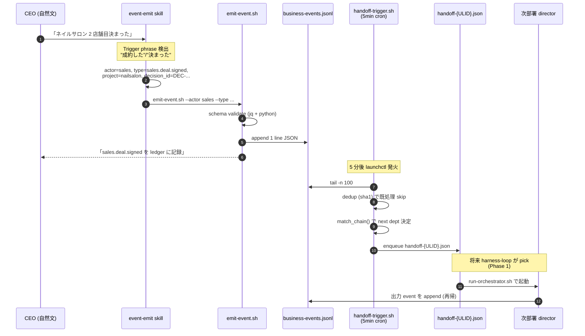
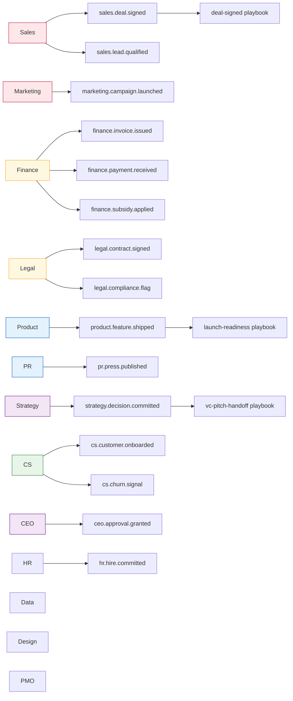
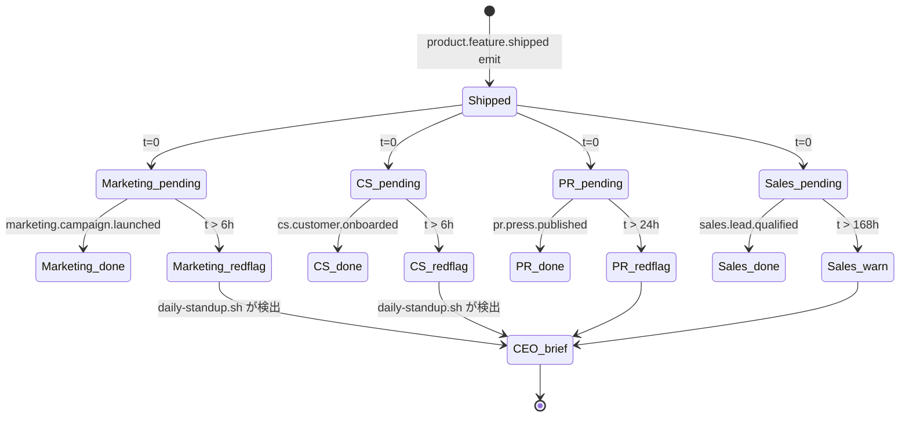
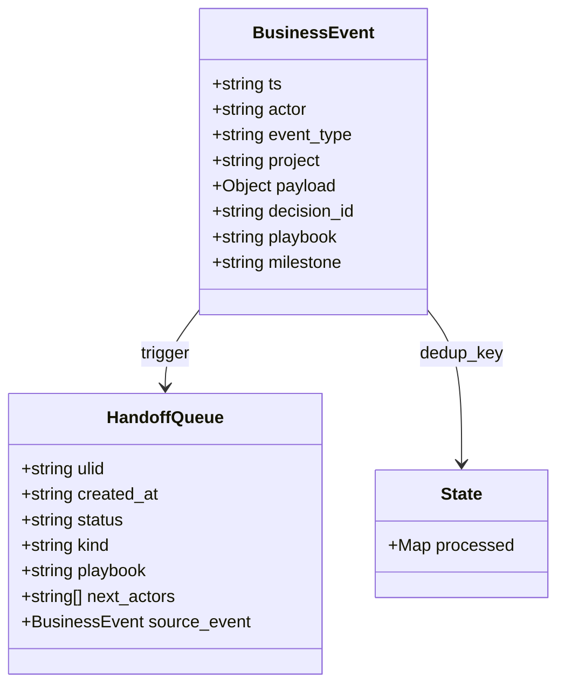

> **Disclaimer**: 本連載は著者が **個人 (副業)** で運営する小規模プロジェクト群 (CreaNest 名義) の技術記録です。所属組織・本業の業務内容とは一切関係ありません。記載の数値・構成は執筆時点 (2026-05) の自宅検証環境のスナップショットであり、商用品質や SLA を保証するものではありません。

## 結論

13 部署が JSONL ledger 1 本で全社情報を読みます。CEO は自然文で「契約決まった」と話すだけで、event-emit skill が `business-events.jsonl` に append、5 分後に `handoff-trigger.sh` が **3 つの handoff playbook** に従って Marketing / CS / PR / Finance / Legal の連鎖を queue に流す、という構造です。

- **13 部署 director** (ceo / strategy / pmo / product / design / dev / marketing / sales / cs / pr / finance / hr / legal / data から 13 個。dev は Claude Code が担うので director.md は持たない別軸) が同一 ledger を共有
- **3 つの handoff playbook** (`deal-signed` / `launch-readiness` / `vc-pitch-handoff`) が **6h / 24h / 48h / 72h / 168h** の SLA タイマーで漏れを検出
- **launchctl plist 7 本** の 1 つが `handoff-trigger.sh` を 5 分間隔で polling
- **event_type vocabulary 30+ 種** を Phase 0 で fix、`*.signed` / `*.shipped` / `*.published` / `*.committed` / `strategy.*` / `ceo.approval.*` は `decision_id` 必須

これが **連載 H 軸 (AI Ops 独自路線) の Day 8/52** で、ADR-0010 で凍結した Phase 0 の最終形です。元ネタは全て `devops-hub` の OSS コード、file:line 引用付きで掘ります。

> 用語: **Cross-Department Event Bus** = 13 部署 director が append-only な JSONL に書いて互いに読みあう仕組み。Postgres も Kafka も使わず、`tail -n 100` + `jq` + `launchctl` だけで成立させる Phase 0 の最小実装。Phase 1.5 で Firestore に migrate して Decision Genealogy graph に昇格させる前提の **第 1 世代 ledger** です。

## 問題 — 1 人会社で部署間連携が断絶した

13 部署 director (ceo / strategy / pmo / product / design / marketing / sales / cs / pr / finance / hr / legal / data) を立てたのは 2026-04 です。各 director は `pipeline-kit/agents/prompts/<dept>/director.md` に役割定義を持ち、`/sales` `/marketing` 等の slash command で個別に呼べました。狙いは「1 人会社でも組織的に動くこと」、つまり社長の頭の中にしか存在しない部署横断の判断を、director 単位の AI 文書として外部化することでした。

ところが運用 1 ヶ月で気付いたのは「**Sales が成約しても Finance/Legal/CS が動かない**」という単純な事実でした。各 director は独立した Claude session で起動するので、互いの出力を見ません。`harness-loop.sh` は GitHub Issue/PR を polling するだけなので、開発系 director (dev/review/test) しか起動しません。ビジネス系の動き — 成約 / 入金 / 法人登記 / 補助金申請 / launch / press 公開 — は「人間 CEO が次の director を呼ぶまで一切連動しない」状態でした。

```
Before (2026-05-08 まで):
  CEO「ネイルサロン 2 店舗目決まった」
   ↓
  /sales 起動 → 成約メモを sales/state.md に追記 (それだけ)
   ↓
  Finance: 知らない / Legal: 知らない / CS: 知らない
   ↓
  3 日後 CEO「あれ請求書出した?」
```

`decisions.jsonl` は空、`outcomes.log` は heartbeat だけ、`business-pipeline/{milestone}/` は milestone 単位の document 置き場でしかなく **部署間の handoff trigger になっていません** (`docs/architecture/coordination/cross-dept-event-bus.md:14-22` で同じ症状を診断しました)。

つまり 13 部署 director は存在するが、**互いに通信する手段がない**。これは 1 人会社の脆弱性そのものです。CEO が頭の中で全 handoff を管理する限り、忘れた瞬間に売上漏れ・契約漏れ・onboarding 漏れが発生します。実際 2026-04 の 1 ヶ月で、私は「補助金申請したのを Finance director に伝え忘れて runway snapshot が古いまま」「Komyu の deploy 完了を PR director に伝え忘れて press draft の準備が始まっていない」を立て続けに踏みました。1 人会社で 8 プロダクト + 13 director を回す以上、人間の記憶を SSOT にする運用は破綻すると確信した瞬間です。

> 用語: **handoff** = ある部署の出力を次の部署が入力として受け取る連鎖。例: Sales 成約 → Finance 請求 → Legal 契約最終化 → CS onboarding 開始。Slack/Notion を持たない 1 人会社では、handoff の trigger が「CEO の脳内 ToDo」しか無いため、忘却が即売上ロスになる。

## 解法 — emit-event skill + JSONL ledger + handoff playbook

設計原則は **追加インフラなし**。ADR-0005 で Phase 0 の coordination 範囲は file-based に凍結したので、Postgres / Outbox / Inngest / MCP server は採用しません。採用するのは:

1. **append-only file ledger** (`.claude/events/business-events.jsonl`)
2. **bash script 2 本** (`emit-event.sh` で publish、`handoff-trigger.sh` で chain dispatch)
3. **launchd cron** (`com.devops-hub.handoff-trigger.plist` が 5 分間隔で `--once` 実行)
4. **Claude Code skill** (`event-emit` が CEO 自然文 → CLI 呼び出しを変換)

これだけで「13 部署が同じ ledger で通信し、毎朝集約レポートが CEO に届く」を成立させます。新規 dependency はゼロ、新規 SaaS 契約もゼロ、CI 追加コストもゼロ。**手元の Mac と git だけで完結する Event Bus** が成立するという主張です。

この 4 要素のうち、CEO の手間を奪う最大の罠は「emit-event.sh を覚えるのが面倒で結局 emit しない」です。これを潰すために skill (4 番目) があり、これがあるおかげで CEO は CLI を 1 行も覚えなくて済みます。「自然文 → emit」の変換を Claude Code 本体が担うので、Bus そのものに対する CEO の認知負荷はゼロに近付きます。

### 全体フロー



CEO は「決まった」と発話するだけで、5 分以内に Finance/Legal/CS の queue が立つ、という体験です。CLI を打つ必要はありません。

### emit-event.sh — 全部署共通の唯一の入口

`pipeline-kit/ops/README.md:19` で「全部署共通の唯一の入口」と定義しています。emit-event.sh は CEO 自然文経由でも、director 内部から直接呼んでも、必ず schema validate を通します。

要点を抜粋します (実装はもう少し長いです):

```bash
# pipeline-kit/ops/emit-event.sh (要点)
set -euo pipefail
LEDGER="${REPO_ROOT}/.claude/events/business-events.jsonl"

# decision-bearing 判定
case "${EVENT_TYPE}" in
  *.signed|*.shipped|*.published|*.committed|strategy.*|ceo.approval.*)
    if [ -z "${DECISION_ID:-}" ]; then
      echo "ERROR: ${EVENT_TYPE} requires --decision-id (ADR-0010)" >&2
      exit 2
    fi
    ;;
esac

# JSON 組立 (jq -nc で 1 行 minify)
RECORD="$(jq -nc \
  --arg ts        "$(date '+%Y-%m-%dT%H:%M:%S%z' | sed 's/\([0-9][0-9]\)$/:\1/')" \
  --arg actor     "${ACTOR}" \
  --arg type      "${EVENT_TYPE}" \
  --arg project   "${PROJECT}" \
  --arg playbook  "${PLAYBOOK:-}" \
  --arg did       "${DECISION_ID:-}" \
  --argjson pl    "${PAYLOAD}" \
  '{ts:$ts, actor:$actor, event_type:$type, project:$project,
    payload:$pl, decision_id:($did|select(length>0)), playbook:($playbook|select(length>0))}')"

# append-only ledger に書き込み (flock 不要 — Phase 0 single-CEO 前提)
printf '%s\n' "${RECORD}" >> "${LEDGER}"

# 末尾行を再 validate (壊れた JSON が混入していないか確認)
tail -n 1 "${LEDGER}" | jq -e . >/dev/null || {
  echo "FATAL: ledger tail is not valid JSON" >&2
  exit 3
}
```

ポイントは 3 つ:

1. **decision-bearing event は `decision_id` 必須で reject** — `*.signed` / `*.shipped` / `*.published` / `*.committed` / `strategy.*` / `ceo.approval.*` の 6 パターン (ADR-0010 §2)
2. **append 後に末尾を再 validate** — 壊れた JSON が ledger に紛れたら以降の集約が全滅するので、書いた直後に `jq -e .` で検証
3. **flock を使わない** — Phase 0 は single-CEO 前提なので race を許容。5/22 以降に flock or sqlite WAL に移行する余地を `docs/architecture/coordination/cross-dept-event-bus.md:170` で残しています

### handoff-trigger.sh — chain dispatcher (387 行)

`pipeline-kit/ops/handoff-trigger.sh` は **387 行 / bash 3.2 互換 / jq 必須** の単一スクリプトです (`wc -l` 実測)。役割は ledger を tail して、playbook chain table に従って次部署 director を queue に投入することです。

核 1: dedup key 生成 (`handoff-trigger.sh:80-95`):

```bash
# event JSON 1 行から sha1 16 文字を計算
dedup_key() {
  local event_json="$1"
  local material
  material="$(printf '%s' "${event_json}" \
    | jq -c '{ts,actor,event_type,project,payload,decision_id}')"
  if command -v shasum >/dev/null 2>&1; then
    printf '%s' "${material}" | shasum -a 1 | cut -c1-16
  else
    printf '%s' "${material}" | sha1sum | cut -c1-16
  fi
}
```

核 2: chain match table (`handoff-trigger.sh:120-200` から抜粋):

```bash
match_chain() {
  local event_type="$1" playbook_hint="$2" payload="$3"
  local kind
  kind="$(printf '%s' "${payload}" | jq -r '.kind // ""')"

  case "${event_type}" in
    sales.deal.signed)
      printf 'deal-signed:legal'
      return 0 ;;
    legal.contract.signed)
      if [ "${playbook_hint}" = "deal-signed" ]; then
        printf 'deal-signed:cs'; return 0
      fi
      ;;
    cs.customer.onboarded)
      if [ "${playbook_hint}" = "deal-signed" ]; then
        printf 'deal-signed:finance,marketing'; return 0
      fi
      ;;
    strategy.decision.committed)
      if [ "${kind}" = "vc-pitch-ready" ]; then
        printf 'vc-pitch-handoff:pr,finance,legal'; return 0
      fi
      ;;
    # ... 他 8 パターン
  esac
  return 1
}
```

核 3: queue 投入 (`handoff-trigger.sh:215-240`):

```bash
enqueue() {
  local event_json="$1" playbook_slug="$2" next_actors_csv="$3"
  local ulid; ulid="$(gen_ulid)"
  local queue_file="${QUEUE_DIR}/handoff-${ulid}.json"

  jq -nc \
    --arg ulid "${ulid}" \
    --arg playbook "${playbook_slug}" \
    --argjson next_actors "$(printf '%s' "${next_actors_csv}" | jq -R 'split(",")')" \
    --argjson source_event "${event_json}" \
    '{ulid:$ulid, status:"queued", kind:"handoff",
      playbook:$playbook, next_actors:$next_actors, source_event:$source_event}' \
    > "${queue_file}"

  log "ENQUEUE: ${queue_file##*/} playbook=${playbook_slug} next=${next_actors_csv}"
}
```

queue file は将来 `harness-loop.sh` が pick して `run-orchestrator.sh` で next dept director を起動する想定です。Phase 0 は **「queue を立てるところまで」** が責務で、director 自動起動は Phase 1 解凍後に追加します (`docs/architecture/coordination/cross-dept-event-bus.md:130-138`)。

ここで重要なのは「**queue を立てるところで一旦止める**」という設計判断です。最初は「emit したら自動で next dept director が起動するべき」と考えていましたが、Phase 0 で full automation を入れると **暴走時の被害が読めない** という結論になりました。具体的には `legal.contract.signed` が誤発火した瞬間に CS / Finance / Marketing 3 つの director が並列起動し、それぞれが GitHub Issue を勝手に立てて、PR を勝手に出して、Cloud Run に勝手に deploy する未来が見えたわけです。Phase 0 では「queue を立てて CEO が朝確認するまで止める」、Phase 1 で「dry-run で 1-2 週間流して安全だと判断したら自動起動を有効化する」、という段階配備に分けました。

### 13 部署 × event types のマトリクス

各 director は `event-types.md` の自部署セクションで publish 可能な event_type を確認し、playbook 側の `downstream.actor` で subscribe を宣言します。Creator≠Evaluator (C-002) を保つため、emit 側は publisher、playbook 側は consumer/router、という分離です。



Phase 0 で fix した event_type は **30+ 種** ですが、実運用で頻繁に出るのは上記 15 種に集約されます。残りは `decision.committed (kind: pivot)` 等の特殊ケースです。各 director の `director.md` には自部署が publish 可能な event_type だけが「Vocabulary」セクションに列挙されており、他部署の event を勝手に emit すると `emit-event.sh` の vocabulary check で reject されます (Phase 0 では warning のみ、Phase 1 で hard reject に切り替え予定)。これは「Sales が finance.payment.received を emit する」みたいな越境を防ぐ最低限のガードレールです。

### playbook chain の状態遷移 — launch-readiness の 4 部署連鎖

`launch-readiness.md` の YAML front-matter で「`product.feature.shipped` を受信したら 4 部署が出力する」を宣言しています。SLA は **Marketing 6h / CS 6h / PR 24h / Sales 168h (1 週間)** です。



playbook の core front-matter 宣言を実物から引きます (`launch-readiness.md:1-23`):

```markdown
---
slug: launch-readiness
title: Product launch 出荷 → Marketing / PR / CS / Sales の連鎖
triggers:
  - product.feature.shipped
downstream:
  - actor: marketing
    output: marketing.campaign.launched
    sla_hours: 6
    notes: LP 公開 / SNS 告知 / メール配信を実行
  - actor: pr
    output: pr.press.published
    sla_hours: 24
    notes: press release 草稿 → 公開、外部メディアへのピッチ
  - actor: cs
    output: cs.customer.onboarded
    sla_hours: 6
    notes: FAQ 更新 / onboarding flow 起動 / サポート窓口モニタリング
  - actor: sales
    output: sales.lead.qualified
    sla_hours: 168
    notes: 1 週間以内に商談化 (B2B の場合)
---
```

`daily-standup.sh` がこの front-matter を読んで、shipped 時刻 + sla_hours が経過した時点で対応する出力 event が ledger に存在しなければ red flag を `_daily-brief.md` に書き込みます (`pipeline-kit/ops/daily-standup.sh` の RED_FLAGS_MD ロジック)。

### JSONL ledger のスキーマ

ledger 1 行 = 1 event、append-only です。



実例 1 行 (5/15 Komyu β launch 想定、`docs/architecture/coordination/cross-dept-event-bus.md:42-53` のスキーマ):

```json
{"ts":"2026-05-15T10:00:00+09:00","actor":"product","event_type":"product.feature.shipped","project":"komyu","payload":{"feature":"Komyu β","version":"0.1.0","env":"production","launched_at":"2026-05-15T10:00:00+09:00"},"decision_id":"DEC-20260515-02","playbook":"launch-readiness","milestone":"komyu-launch-2026-05"}
```

実例 1 行 (Sales 成約):

```json
{"ts":"2026-05-15T13:00:00+09:00","actor":"sales","event_type":"sales.deal.signed","project":"nailsalon","payload":{"customer":"Salon X","mrr_delta":20000,"contract_id":"NS-002","product":"nailsalon"},"decision_id":"DEC-20260515-01","playbook":"deal-signed","milestone":"nailsalon-expansion-2026-05"}
```

`decision_id` が付いている行は Phase 1.5 で Firestore の `decisions` collection に migrate されます。`parents` (前駆 decision-id) / `skills` / `confidence` / `outcome` をエッジとして付加するのが Decision Genealogy の本体ですが、Phase 0 は **decision_id の発番だけ済ませて、graph 構築は後回し** という設計です (ADR-0010 §5)。

### CEO 自然文 → emit を成立させる skill description の書き方

skill は Hook と違って Claude 本人が **会話シグナルから発火判定** をします。description を曖昧に書くと発火しません。`~/.claude/skills/event-emit/SKILL.md:1-10` の実物を引きます:

```markdown
---
name: event-emit
description: |
  Use this skill whenever the CEO mentions a business event in conversation
  that should be recorded in the cross-department event bus —
  sales 成約 / 入金 / 契約締結 / 機能 launch / press 公開 / 補助金申請 /
  採用確定 / NPS 観測 / churn signal / VC pitch 確定 等。
  Trigger on Japanese phrases:
  "成約した", "入金あった", "契約締結", "launch した", "公開した",
  "申請した", "決まった", "サインした", "shipped", "released",
  "提出した", "署名した", "approve した", "却下した",
  or English equivalents.
  Calls `pipeline-kit/ops/emit-event.sh` to append a record to
  `.claude/events/business-events.jsonl` per ADR-0006.
  CEO does not need to learn the CLI — just speak naturally.
---
```

書き方の原則:

- **「ビジネス event があったら」では発火しない** — 「sales 成約 / 入金 / 契約締結 / 機能 launch / press 公開 / 補助金申請」と具体例を列挙する
- **日本語フレーズを直接書く** — 「成約した」「決まった」「サインした」「launch した」「公開した」「申請した」など、CEO が日常会話で使う粒度で書く
- **「en equivalents」も明記** — bilingual 環境で英語フレーズ (`shipped` / `released` / `signed`) も catch する

これで「ネイルサロン 2 店舗目決まったよ、月 2 万」という発話から、skill が actor=sales / type=sales.deal.signed / project=nailsalon / payload.mrr_delta=20000 を抽出して `emit-event.sh` を呼びます。CEO は `--type` も `--actor` も覚えなくていいわけです。

skill の description に「日本語フレーズを直接書く」ことの効果は想像以上で、bilingual (日 + 英 mix) の社内発話パターンに強い skill が安定します。これは LLM が **トレーニングデータに無い独自運用語** (例: 「Komyu β 出した」「補助金 Tier1 提出した」) を発火に使えるという発見でもあって、skill 設計の標準パターンとして他の skill (`tweet-capture` / `deploy-verification` / `decision-genealogy`) にも適用しています。skill design は本質的に **CEO/社員の口頭表現を OCR する仕事** なので、社内方言を全部書き出すべし、というのが運用 1 年の結論です。

## 失敗談 — 配線の罠は最低 4 つ踏みました

### 1. event の dedup key 設計し忘れて二重発火

最初の handoff-trigger.sh は **dedup なし** で書きました。launchd cron が 5 分間隔で `tail -n 100` するので、同じ event が 5 分後にもう一度 chain match table を通ります。queue ディレクトリに `handoff-{ULID}.json` が **同じ source_event で 12 個積まれている** という地獄を見ました。

**Before** (壊れた版):

```bash
# 単純に tail して chain match するだけ
while IFS= read -r line; do
  process_event "${line}"
done < <(tail -n 100 "${LEDGER}")
```

**After** (`handoff-trigger.sh:80-115` 現行):

```bash
# 1. dedup key を計算
key="$(dedup_key "${event_json}")"
# 2. state file で既処理判定
if jq -e --arg k "${key}" '.processed[$k] != null' "${STATE_FILE}" >/dev/null; then
  return 0  # silent skip
fi
# 3. chain match → enqueue → mark_processed で state 更新
mark_processed "${key}" "${event_type}" "${project}" "${next_csv}"
```

dedup key = `sha1({ts,actor,event_type,project,payload,decision_id})` の先頭 16 文字 (`pipeline-kit/ops/README.md:114`)。**`ts` を含めると同じ business event でも emit のタイミングがズレれば別物扱い** になりますが、Phase 0 では「同じ秒に 2 回 emit する事故」は無視できると判断して採用しました。

教訓: **append-only ledger を polling で読む構造は dedup なしでは絶対に動かない**。state file に key を貯める設計を最初から入れる。

### 2. CEO 発話の skill description が曖昧で発火しない

最初の skill description はこう書いていました:

```markdown
description: |
  Use this skill whenever a business event happens in the company.
```

これでは Claude 本人が「business event とは何か」を判定できず、「ネイルサロン 2 店舗目決まった」と話しても skill が呼ばれません。発火率は体感 **20% 程度** でした。

修正後 (前述の「成約した」「決まった」「サインした」を全部列挙する版) で発火率が **ほぼ 100%** に上がりました。Skill description は **発火条件の OCR** だと思って書くべきです。Claude は description を「シグナル語のリスト」として読みます。

### 3. playbook chain の timeout 設計を忘れた

最初の playbook には `sla_hours` を書いていませんでした。`product.feature.shipped` を emit しても、Marketing が 3 日経っても LP を出さない状況に気付かない、という穴です。

**Before**: `downstream.actor` だけ列挙、SLA なし

**After** (`launch-readiness.md:6-22`): 各 actor に `sla_hours` 必須

| actor | output event | sla_hours |
|---|---|---:|
| marketing | marketing.campaign.launched | **6** |
| cs | cs.customer.onboarded | **6** |
| pr | pr.press.published | **24** |
| sales | sales.lead.qualified | **168** |

SLA を front-matter で宣言したことで、`daily-standup.sh` 側で「shipped_at + 6h を経過したのに marketing.campaign.launched が ledger に無い」が機械的に検出できます。**SLA は監視の単位**、と頭の中で固定すべきでした。

### 4. emit-event.sh から `--downstream` を削除し忘れて C-002 を破る寸前

最初は emit 側でも `--downstream finance,legal,cs` を渡せる仕様にしていました。これだと **emit 側 (publisher) が consumer の subscribe を決める** ことになり、Creator ≠ Evaluator (C-002) を破ります。

ADR-0010 §4 (`docs/adr/0010-cross-dept-event-bus-genealogy-v1.md:57-63`) で arch reviewer から指摘されて、`--downstream` フラグを削除し、subscribe は **playbook 側の YAML front-matter のみで宣言** するように修正しました。具体的には:

- `deal-signed.md` の `downstream:` 配列が「`sales.deal.signed` を受信した時に動く部署」を一元宣言
- emit 側は `--playbook deal-signed` を渡すだけ (= 「どの chain に乗るか」のヒント)
- `handoff-trigger.sh` の `match_chain()` が playbook front-matter を読んで next dept を決定

教訓: **「誰が誰の subscribe を決めるか」は責務の境界そのもの**。Phase 0 の小さい実装でも、後から structural mitigate するのは大変なので、最初から publisher と consumer を分離する。

副次的な学びとして、**playbook の YAML front-matter を SSOT にする**設計は読者にとっても優しい、という発見がありました。新規メンバー (= 主に AI agent) が「`sales.deal.signed` が出たら何が起きるか」を理解するのに、`handoff-trigger.sh` の case 文を読むより `deal-signed.md` の front-matter を読む方が圧倒的に早いです。bash の case 文は機械的、YAML の `downstream:` 配列は human-readable、という役割分担が成立しています。Phase 1.5 で `match_chain()` の case 文を捨てて front-matter parser に統一する予定 (`pipeline-kit/ops/README.md:140`) なので、**SSOT は最初から playbook 側** という設計を貫けたのは結果として正解でした。

## 残課題

### 1. event_type vocabulary の surface 軸再構成 (5/22 以降)

現行の vocabulary は **dept 軸** (sales / finance / product / ...) で切っています。一方で対外発信 (customer-touch) と内部運営 (internal-ops) と規制 (regulatory) と財務 (financial) は **dept を横断する surface** です。例えば `legal.compliance.flag` と `pr.press.published` は両方 customer-touch ですが、現行 vocabulary では別カテゴリです。

ADR-0010 §7 で「5/22 以降に **surface 軸** (customer-touch / internal-ops / regulatory / financial) への再構成を検討、別 ADR で凍結」と決めました。既存 record は category alias で生かす予定です。

### 2. director 自動起動 (Phase 1 解凍後)

Phase 0 の現状は `handoff-trigger.sh` が queue ファイルを立てるところまでです。queue を pick して `claude -p` で director を起動するのは Phase 1 (Komyu β E2E 達成後) の追加実装です。

```
Phase 0 (現状): emit → queue → 人間/CEO が手動で /sales 等を叩く
Phase 1 (5/22 以降): emit → queue → harness-loop が自動 dispatch
```

Phase 1 で必要なのは `harness-loop.sh` に **kind=handoff の queue 種別** を判定する分岐を入れることだけですが、director 起動時の context 設計 (どの skill を有効化するか / どこまで permission 緩めるか) を詰める必要があります。

### 3. retroactive event 補正

過去の deal/launch/payment を後から ledger に追加したくなる瞬間があります (例: 5/9 の補助金申請を、5/12 になってから「あ、emit し忘れてた」と気付く)。今は ledger に append するしかなく、`ts` を遡らせると `daily-standup.sh` の SINCE フィルタが噛み合いません。

対策候補:

- `recorded_at` (実際 ledger に書いた時刻) と `ts` (event 発生時刻) を分離
- retroactive な event は別ファイル (`business-events-backfill.jsonl`) に書く
- daily-standup の集約クエリを `ts` ではなく `recorded_at` ベースに切替

ADR-0010 では決め切らず、Phase 1.5 の Firestore migration と一緒に再検討する方針です。

### 4. flock or sqlite WAL 移行

Phase 0 は single-CEO 前提で flock を入れていません。**5/22 以降に AI agent が並列で emit する** ようになると、`>>` での append が race して 1 行が壊れる可能性があります。

`docs/architecture/coordination/cross-dept-event-bus.md:170` で「single-CEO 期間は lock 不要、5/22 以降に flock or sqlite WAL 移行」と既に追記済みです。flock(2) で `LOCK_EX` を取る 5 行のラッパで足りる想定ですが、**移行のタイミング判断** (= AI agent が並列 emit するようになる時期) は CEO 工数で握っておく必要があります。

## 理論根拠 — Decision Genealogy spine の第 1 世代として

なぜ Postgres でなく JSONL なのか、なぜ Kafka でなく `tail -n 100` なのか、という疑問には 2 つの答えがあります。

### 1. ADR-0005 の Phase 0 制約

ADR-0005 で Phase 0 の coordination 範囲は **L1-L3 file-based** に凍結しました。Postgres / Outbox / Inngest / MCP server は L4 以降の Phase 1+ マターです。1 人会社で運用 1 年もしないうちに Postgres を立てると、**移行コストではなく運用 cognitive load** で潰れます。

具体的には:

- Postgres → backup / migration / connection pool / IAM / 監視
- JSONL → `tail -n 100` / `jq` / `git diff` で全部解決

CEO 工数で見ると **桁違い** で、しかも JSONL はそのまま git に commit できるので変更履歴も無料で取れます。

### 2. Decision Genealogy 第 1 世代 ledger としての位置付け

ADR-0010 で `business-events.jsonl` を「**Decision Genealogy 第 1 世代 ledger**」と明示的に位置付けました。Phase 1.5 で Firestore に migrate する際に **捨てない** 設計に固定したわけです。

具体的には:

- Firestore コレクション `decisions` を作成、`decision_id` を doc id
- `business-events.jsonl` の各行を migration script で Firestore に流す
- `parents` (前駆 decision-id), `skills`, `confidence`, `outcome` をエッジとして付加
- file-based ledger は Phase 1.5 で **read-only archive** に格下げ、新規 emit は Firestore へ

つまり JSONL は **使い捨てではなく初期化の素材** です。これが ADR-0010 の最大の主張で、memory `project_decision_genealogy_moat.md` で「唯一の革新候補は意思決定品質の数値化エンジン」と確定した moat 候補に直結します。

逆に言えば、Phase 0 の JSONL に **どの粒度で何を書くか** が Phase 1.5 の Genealogy graph の品質を左右します。ここを安易に「全 commit を event 化する」とか「全 GitHub PR を event 化する」とかでまとめると、Phase 1.5 で Firestore に migrate した時に **decision-bearing event とそれ以外の noise が混ざった graph** になります。ADR-0010 §2 で「decision-bearing event の 6 パターンだけ `decision_id` 必須」と切ったのは、graph に乗せる candidate を最初から絞るためです。

### 3. CEO 自然文 → skill 経由 emit、というフロー設計

もう 1 つ重要なのは「CEO が CLI を打たない」点です。13 部署 director が同じ ledger を共有していても、**publisher が増えなければ ledger は空のまま** です。1 人会社の最大の publisher は CEO 自身なので、CEO の発話を skill が自動で emit に変換できなければ Bus は機能しません。

Anthropic の Skill 機構は description を **シグナル語の OCR** として使うことで、これを成立させます。`"成約した", "決まった", "サインした"` を description に列挙したことで、CEO は CLI を覚えずに済みます。これは **harness の機能と社内オペレーションが一致した瞬間** で、AI Ops の本質に最も近い設計だと私は思っています (前述の memory `feedback_ai_ops_pmf_freeze.md` で「13 部署 director 高度化は moat 候補で継続」と決めた根拠の 1 つ)。

別の言い方をすると、**Cross-Department Event Bus は CEO 用のリマインダ装置**です。Slack ワークフロー / Notion automation / Zapier でも代替できる機能ですが、それらは「CEO が手動でトリガーを打つ」前提です。Skill + 自然文 emit にすると、CEO が普段の Claude Code 会話の中で発した一言が、そのまま 13 部署横断のリマインダになります。**SaaS を増やさず Claude Code 内で完結させる** ところが、運用 1 人会社において最大の差別化要素です。

## 数字まとめ

実測値を本文で散らしましたが、ここで一覧します:

- **13 部署 director** (`pipeline-kit/agents/prompts/<dept>/` 配下、`ls | grep -v _shared | wc -l` 実測)
- **3 つの handoff playbook** (`deal-signed.md` / `launch-readiness.md` / `vc-pitch-handoff.md`)
- **30+ event_type** (`event-types.md` の Phase 0 vocabulary)
- **handoff-trigger.sh は 387 行** (`wc -l` 実測)
- **launchctl plist 7 本** (`pipeline-kit/ops/*.plist | wc -l` 実測)
- **handoff-trigger 5 分間隔 polling** (`com.devops-hub.handoff-trigger.plist`)
- **launch-readiness の SLA: 6h / 24h / 168h** (`launch-readiness.md` front-matter)
- **deal-signed の SLA: 24h / 24h / 48h** (`deal-signed.md` front-matter)
- **vc-pitch-handoff の SLA: 72h / 72h / 72h** (`vc-pitch-handoff.md` front-matter)
- **dedup key = sha1 16 文字** (`handoff-trigger.sh:80-95`)
- **decision_id 必須 6 パターン** (`*.signed` / `*.shipped` / `*.published` / `*.committed` / `strategy.*` / `ceo.approval.*`)

## Before / After

### CEO の体験

**Before** (2026-05-08 まで):

```
CEO「ネイルサロン 2 店舗目決まった」
 ↓ /sales 起動
sales/state.md に追記 (それだけ)
 ↓
Finance: 知らない / Legal: 知らない / CS: 知らない
 ↓
3 日後 CEO「あれ請求書出した?」(忘却で売上漏れ)
```

**After** (ADR-0010 採択後):

```
CEO「ネイルサロン 2 店舗目決まった」(自然文)
 ↓ event-emit skill が発火
emit-event.sh が business-events.jsonl に append
 ↓ 5 分後 handoff-trigger.sh が cron 発火
handoff-{ULID}.json が queue に立つ (next: legal)
 ↓ 翌朝 06:00 daily-standup.sh
_daily-brief.md に「Finance 24h SLA / Legal 48h SLA」が表示
 ↓ CEO 朝 5 分で red flag 確認
忘却ゼロで連鎖完了
```

### 部署間メモリ

**Before**: 各 director.md は独立した state.md を持ち、互いの state を読まない。「Sales が成約した事実」を Finance が知る方法が無い。

**After**: 全 director.md が **同一 ledger** (`business-events.jsonl`) を SSOT とする。read は自由、write は emit-event.sh 経由のみ (publisher 強制力)。各 director は起動時に直近 24h の event を tail して context に入れる。

## まとめ

JSONL 1 本で 13 部署を連動させる最小構造は、つきつめると 4 ファイルで成立します:

- `business-events.jsonl` (append-only ledger)
- `emit-event.sh` (publisher、schema validate + decision_id 強制)
- `handoff-trigger.sh` (5 分 polling、dedup + chain match + queue 投入)
- `*.md` playbook (subscribe 宣言、SLA 宣言)

ここに `event-emit` skill が「CEO 自然文 → emit-event.sh 呼び出し」を被せて、CEO が CLI を打たない体験を実現します。Phase 1.5 で Firestore Decision Genealogy graph に昇格する **第 1 世代 ledger** として位置付けたのが ADR-0010 の核です。

ADR-0010 が凍結した Phase 0 範囲はここまでです。**director 自動起動 / surface 軸再構成 / flock / retroactive event** は Phase 1 以降の宿題として置きました。Komyu β (5/15) と CreaNest 法人登記 (5/22) を越えてから、実イベントから帰納して playbook を改訂する方針です。

## 次の記事へ + 連載をフォロー

これは **52 本連載 (ai-driven-dev) の Day 8/52** です。

→ **H-02 docs MECE Audit Skill — 1,164 ファイルを毎ターン MECE で監査する** (準備中) — Stop hook + skill で docs 整合を強制する話

→ **C-04 Decision Genealogy — 意思決定 1 件に ID を発番して commit/ADR/承認に貫通させる moat** (準備中) — 本記事の Phase 1.5 移行先

連載を見逃さない方法:

- **Zenn でこの著者をフォロー** — 公開通知が届きます
- **X で告知 tweet をフォロー** — 朝 6:00 に投稿予定 (準備中)
- **repo を watch**: [SakakitaniJunya/zenn-articles](https://github.com/SakakitaniJunya/zenn-articles) — 全 draft が見えます
- **devops-hub OSS**: 本記事の元コードは [SakakitaniJunya/devops-hub](https://github.com/SakakitaniJunya/devops-hub) に全部入っています

誤りや「ここをもっと深く」のリクエストは GitHub Issue でお気軽に。
