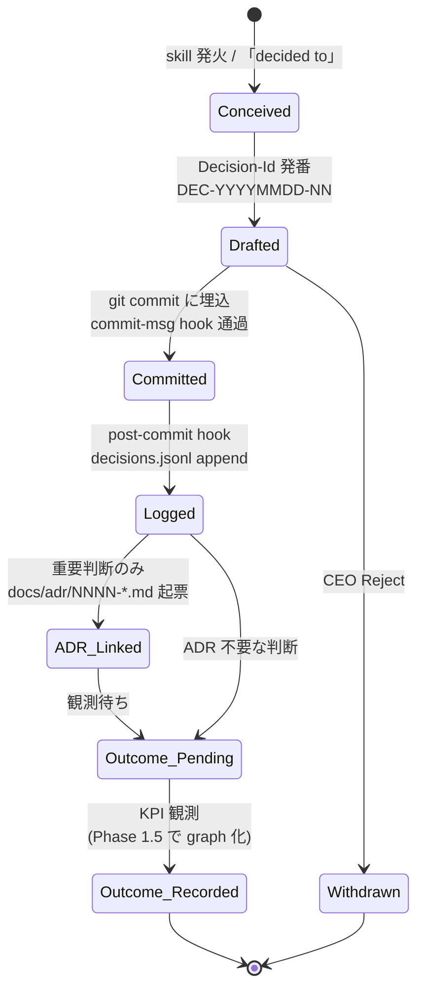
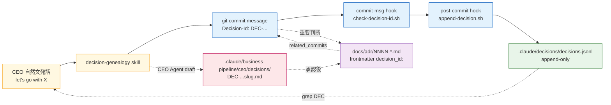
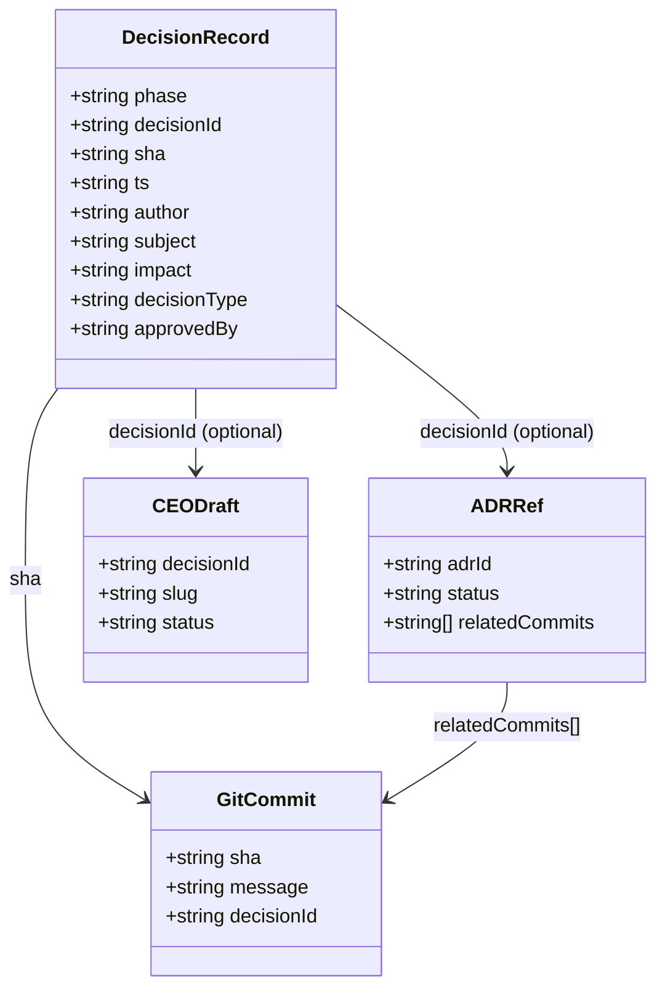

> **Disclaimer**: 本連載は著者が **個人 (副業)** で運営する小規模プロジェクト群 (CreaNest 名義) の技術記録です。所属組織・本業の業務内容とは一切関係ありません。記載の数値・構成は執筆時点 (2026-05) の自宅検証環境のスナップショットであり、商用品質や SLA を保証するものではありません。

## 結論

意思決定 1 件に `DEC-YYYYMMDD-NN` 形式の ID を発番し、commit message / ADR frontmatter / CEO 承認 draft / `decisions.jsonl` ledger / 将来の outcomes に**同じ ID を貫通**させる、という運用を 2026-05 に Phase 0 で立ち上げました。3 ヶ月後の自分が「なぜこの構造にしたんだっけ」と詰まったとき、`git log --grep="Decision-Id:"` 1 コマンドで 30 秒以内に文脈を復元できる、という体験を成立させるための spine です。

- **15 本の ADR** が `docs/adr/` 配下に並び (`ls docs/adr/*.md | wc -l` 実測)、最新は ADR-0013 (`0013-project-namespace-and-silent-router.md`、2026-05-09 採択)
- **decisions.jsonl は post-commit hook で自動 append**、執筆時点で 5 件 record (DEC-20260509-09 から DEC-20260509-13、`wc -l` 実測 — Phase 0 配線直後の初期値)
- **commit-msg hook** が `Impact: mid|high` の commit に `Decision-Id` 必須を強制 (`pipeline-kit/scripts/check-decision-id.sh:35-46`)
- **decision-genealogy skill** (`~/.claude/skills/decision-genealogy/SKILL.md`) が会話シグナル (「let's go with X」「decided to」) で発火、Claude 自身に Decision-Id 発番を促す
- **6 パターンの decision-bearing event** (`*.signed` / `*.shipped` / `*.published` / `*.committed` / `strategy.*` / `ceo.approval.*`) が ADR-0010 §2 で `decision_id` 必須に固定済み

これが連載 **C 軸 (Claude Code 拡張) の Day 4 — Decision Genealogy** の、Phase 0 で実際に動いている部分の話です。「moat になる」という野心も併記しますが、まず結論として **個人開発で意思決定が蒸発する問題を 4 ファイル + 2 hook + 1 skill で潰す** という具体に降ろします。

> 用語: **Decision Genealogy** = 「ある意思決定の前駆 / 後継 / 根拠 / 結果」を ID で繋いだ系譜。Phase 1.5 で Firestore graph に昇格させる前提の moat 候補。Phase 0 では「ID を発番して commit / ADR / ledger に書き込むだけ」に限定し、graph 構築は後回しにしています。

## 問題 — 個人開発で意思決定は静かに蒸発する

私は副業で 8 プロダクト (nailsalon / komyu / keirai / soccer-note / vivivi-beauty / lifeops / colason / yomi-note) と CreaNest 受託を 1 人で回しています。各プロダクトには独立した repo があり、CreaNest 全体の運営 repo として `devops-hub` を別に持っています。1 ヶ月で立てる ADR / 戦略判断 / 設計 pivot の数は感覚的に **30-50 件**、commit 数は半月単位で 600+ という規模です。

この規模で運用 2 ヶ月経った頃に明確になった症状が 3 つあります。

**症状 1: 1 週間前の自分が他人になる**

「Komyu の API server を Next.js API Routes に同居させず NestJS で別 Cloud Run に切り出す」という判断を 5/06 にしました。1 週間後の 5/13 に「あれ、なんで Hono じゃなくて NestJS にしたんだっけ?」と詰まり、commit history を 30 分掘って ようやく `feedback_nestjs_for_longterm_scalability.md` (memory) に「2-3 年運用 SaaS は NestJS、短期 prototype は Hono、判断軸は運用期間」とメモしてあるのを発見しました。**memory は session 越えで補完される程度のもの**で、grep でしか辿れません。

**症状 2: 同じ議論を 3 回やり直す**

Komyu の pricing は 4/19 / 4/29 / 5/04 の 3 回別の文脈で「Growth-first か Leader 課金か」を議論し、その都度 Slack も Notion も持たない 1 人会社なので **議論の出力先が無く**、結論だけ memory に追記しました。後から見ると 4/29 と 5/04 で微妙に結論が違っていて、どちらが採用版かが `git blame` でも追えませんでした。

**症状 3: ADR を書いても commit と紐付かない**

ADR-0010 (Cross-Department Event Bus) を 5/09 に採択しましたが、ADR file 単体では「この ADR を実装した commit はどれか」「ADR で却下した代替案は何だったか」が辿れません。GitHub の PR 単位の議論は close すると埋もれます。**ADR は意思決定の結論文書としては正しいが、系譜の hub にはならない**、という構造的限界です。

```
Before (2026-05-08 まで):
  CEO「NestJS にしよう」
   ↓
  commit "feat(api): split out NestJS server"
   ↓
  ADR? 書いていない / memory? 「長期運用なら NestJS」 (出典不明)
   ↓
  1 週間後「Hono じゃなく NestJS にした根拠どこ?」
   ↓
  30 分 grep して memory file 発見 (運が良ければ)
```

これが**意思決定の蒸発**です。1 人で全工程を回していると **発話 → 判断 → 実装 → 結果** が同じ脳内で連続するので、その瞬間は記録不要に感じます。ところが 1 ヶ月後の自分は完全に他人で、しかも「自分が決めた」という事実だけは残っているので、間違った justify を後付けで作ってしまうリスクすらあります。

> 用語: **意思決定の蒸発** = 判断時点の context (前提 / 検討した代替案 / 却下理由 / 承認者) が記録されないまま結果コードだけが残り、後から「なぜ?」を復元できない状態。1 人会社では Slack も会議録もないので、何もしないと 100% 蒸発する。

## 解法 — Decision-Id を spine にして 5 surface に貫通させる

設計原則は **新規 SaaS ゼロ / 新規 DB ゼロ**。ADR-0005 で Phase 0 の coordination は L1-L3 file-based に凍結したので、Postgres / Firestore / Notion / Linear は使えません。採用するのは:

1. **Decision-Id 形式の発番規則** (`DEC-YYYYMMDD-NN` または ULID 26 文字)
2. **commit message に埋め込む規約** (`Decision-Id:` / `Decision-Type:` / `Rationale:` / `Approved-By:`)
3. **ADR frontmatter で commit と紐付け** (`decision_id:` / `related_commits:`)
4. **post-commit hook で `decisions.jsonl` に自動 append**
5. **decision-genealogy skill** が Claude 自身に発番を促す

これを 5 surface (発話 / commit / ADR / ledger / CEO draft) に貫通させると、**任意の surface から検索して残り 4 surface に到達できる**状態が成立します。新規 dependency はゼロ、新規月額コストもゼロです。

### Decision-Id lifecycle (state diagram)



ポイントは **Phase 0 では `Logged` か `ADR_Linked` までしか実装していない**点です。`Outcome_Recorded` の自動収集は Phase 1.5 で Firestore に migrate してから本実装します。Phase 0 の現状は **「ID を確実に発番して 5 surface に貫通させる」だけ** に責務を絞っています。

### 5 surface 関係図



任意の surface から `DEC-20260509-10` を grep すれば、残り 4 surface (発話 → skill 履歴 / commit / ADR / draft) に到達できます。**ID が hub、各 surface は spoke** という放射構造です。

### 1. Decision-Id の発番規則 (skill 内蔵)

`~/.claude/skills/decision-genealogy/SKILL.md:25-32` で 2 形式を許容しています。

```markdown
| 形式 | 例 | 用途 |
|------|----|------|
| `DEC-YYYYMMDD-NN` (推奨, Phase 0) | `DEC-20260503-01` | 人間可読、grep しやすい |
| ULID (26 文字 Crockford Base32) | `01H8X9...` | Phase 1.5 で `decisions.ts` schema が要求する形式 |
```

Phase 0 では **`DEC-YYYYMMDD-NN` 一択**で運用しています。理由は単純で、CEO (= 私) が Claude に「DEC-20260509 で 13 番目」と言うほうが、ULID を読み上げて確認するより 5 倍速いからです。grep もしやすい。Phase 1.5 で Firestore に migrate する際に `decisions.ts` schema が ULID を要求するので、その時点で migration script で `DEC-...` → ULID への 1:1 mapping を生成する想定です (本記事の残課題セクションで触れます)。

その日の通し番号で追番する運用なので、5/09 だけで `DEC-20260509-09` から `DEC-20260509-13` まで 5 件発番されています (`decisions.jsonl` 5 行 = 全件、`wc -l` 実測)。複数 repo 横断で一意でなくて良い設計で、commit hash で repo は識別できるからです。

### 2. commit message 規約

`~/.claude/skills/decision-genealogy/SKILL.md:53-63` の template:

```
<type>(<scope>): <subject>

<body>

Decision-Id: DEC-20260503-01
Decision-Type: architecture | business | strategy | tech
Rationale: <1-2 sentences why>
Alternatives-Considered: <option A, option B that were rejected>
Approved-By: <CEO | self | agent-name>
```

実物 (`git log --grep="Decision-Id" -n 1` で抽出した 1 件):

```
docs(adr-0012): SSOT 強制 — id 一意性 strict + canonical field + agents.md 流派採用

ADR-0012 で frontmatter id 一意性を strict 化、canonical: true|false 必須、
canonical_for: <id> でエイリアス宣言、scripts/generate-docs-graph.mjs --check で
重複 throw する CI guard を追加。

Impact: mid
Decision-Id: DEC-20260509-09
Decision-Type: docs-dedup-architecture
Rationale: 同一 topic 重複 doc 量産 (8 件検出) を構造的に止めるため
Alternatives-Considered: lint warning のみ (採用せず — 強制力なし)
Approved-By: ceo
```

`Impact: mid` を書いた瞬間に commit-msg hook (`pipeline-kit/scripts/check-decision-id.sh:35-46`) が `Decision-Id` 行の存在を required として検証します。

```bash
# pipeline-kit/scripts/check-decision-id.sh:31-46
if [[ "$IMPACT" == "low" ]]; then
  exit 0
fi

if [[ "$IMPACT" != "mid" && "$IMPACT" != "high" ]]; then
  echo "[check-decision-id] invalid Impact: '$IMPACT' (expect low|mid|high)" >&2
  exit 1
fi

# mid|high には Decision-Id 必須
DECISION_ID=$(echo "$MSG_CONTENT" | grep -v '^#' | grep -E '^Decision-Id:[[:space:]]*' | head -1 | sed -E 's/^Decision-Id:[[:space:]]*//' | tr -d ' ' || true)

if [[ -z "$DECISION_ID" ]]; then
  echo "[check-decision-id] Impact: $IMPACT requires Decision-Id: <ULID> (ADR-0006 §要件 2-3)" >&2
  exit 1
fi
```

`Impact: low` または `Impact:` 行なしなら hook は素通しなので、typo 修正や lint 自動修正までは Decision-Id 不要、という運用です。これにより **「全 commit に Decision-Id を強制」というアンチパターンを避けつつ、判断のある commit だけを ledger に流す**ことができます。

### 3. post-commit hook で `decisions.jsonl` に自動 append

`pipeline-kit/scripts/hooks/post-commit:11-15` は薄い landing point で、本体は `append-decision.sh` です:

```bash
#!/usr/bin/env bash
# git post-commit hook landing point
#
# 配線:
#   git config --local core.hooksPath pipeline-kit/scripts/hooks
#
# (CLAUDE.md「NEVER update git config」に従い、リポジトリ自動設定はせず CEO 操作で有効化する)
#
# 出典: ADR-0006 §Implementation, DEC-20260506-01 (Phase 0 ledger 配線)

set -euo pipefail

REPO_ROOT="$(git rev-parse --show-toplevel)"
exec "${REPO_ROOT}/pipeline-kit/scripts/append-decision.sh" "$@"
```

`append-decision.sh` 側で `git log -1` の出力を parse して以下のような JSON 1 行を `.claude/decisions/decisions.jsonl` に append します。実物 1 行 (`tail -n 1` 実測):

```json
{"phase":"0","decisionId":"DEC-20260509-13","sha":"243318365eedbbfe742ae0993837f751e2057008","ts":"2026-05-09T18:45:09+09:00","author":"Sakaki","subject":"fix(hooks): MECE audit を Stop hook (turn 終了時) に移動 + 大きな改修末尾でのみ fire","impact":"low","decisionType":"hook-tuning","approvedBy":"ceo"}
```

ここで重要なのは **`core.hooksPath` を CEO 自身が手動配線する** 設計です。CLAUDE.md ルール「NEVER update git config」に従い、AI agent は git config を触りません。代表が一度だけ:

```bash
git config --local core.hooksPath pipeline-kit/scripts/hooks
```

を実行すれば、それ以降 Claude Code が出した全 commit が自動で ledger に流れる構造です。これは **AI に gitに対する書き込み許可を一切渡さない**という Phase 0 の安全装置で、後の失敗談セクションでこれをサボった結果ledger が空っぽだった事故を書きます。

### 4. ADR frontmatter で commit と紐付け

ADR-0010 の frontmatter (`docs/adr/0010-cross-dept-event-bus-genealogy-v1.md:1-13`):

```yaml
---
id: adr-0010-cross-dept-event-bus-genealogy-v1
title: Cross-Department Event Bus を Decision Genealogy 第 1 世代 ledger として Phase 0 公式化
type: adr
status: accepted
owners: [ceo, pmo]
proposed: 2026-05-09
accepted: 2026-05-09
relates_to: [adr-0005-coordination-phase0-scope-freeze, adr-0006-phase1-unfreeze-gate, agent-coordination-mechanism, autonomous-operations-design, cross-dept-event-bus]
supersedes: []
---
```

skill template (`~/.claude/skills/decision-genealogy/SKILL.md:67-72`) では更に踏み込んで:

```yaml
decision_id: DEC-20260503-01
related_commits: [<sha1>, <sha2>]
```

を要求しています。Phase 0 では既存 ADR (15 本) の retrofit はせず、**新規 ADR からこの 2 field を required**にしました。retrofit を強制すると、既存の `0001-github-firestore-data-split.md` 等の意思決定時点の commit を git log から発掘する作業が発生して、現実的に止まるからです。

### 5. JSONL ledger schema (class diagram)



`decisions.jsonl` の 1 record は **commit との 1:1 mapping** が前提です。1 つの commit から複数 Decision-Id を発番することは禁止していません (theoretically) が、運用では 1 commit = 1 decision に揃えています。複数判断が混じる commit は Rationale が書きにくくなるので、自然と分割されます。

### 6. decision-genealogy skill — 会話シグナルから発番促す

skill description の核 (`~/.claude/skills/decision-genealogy/SKILL.md:1-5`):

```markdown
---
name: decision-genealogy
description: |
  Use this skill whenever you make a non-trivial decision in a CreaNest repo
  (devops-hub, komyu, nailsalon, build-football, vivivi-beauty, lifeops,
  colason, keirai, yomi-note) — architecture choice, library swap, business
  strategy pivot, or any judgment that future-you will need to justify.
  Trigger on: "let's go with X", "decided to", "I'll use Y instead of Z",
  "approve this approach", "ship it", or before any commit that encodes such
  a decision. Emits a Decision-Id that links commits, ADRs, and CEO approvals
  into a queryable genealogy. This is the **moat** of the AI Ops platform —
  without Decision-Id, decisions evaporate.
---
```

skill 設計の要点は前回 H-01 (Cross-Department Event Bus) でも書いた通り **発火条件の OCR** です。「judgment / pivot / library swap / approve / ship it」と具体例を列挙することで、Claude が会話の中で「あ、これは Decision-Id 発番すべき発話だ」と判定できます。

実際に動かすと、私が「NestJS にしよう」と書いた瞬間に Claude 側から「Decision-Id を発番しますか? `DEC-20260506-XX` (XX = その日の最大 + 1) を提案します」と返ってきます。承認すれば commit body に自動で挿入されます。**CEO は Decision-Id の番号を覚えなくていい**、という体験で、これが skill description の力です。

## 失敗談 — 配線の罠を 4 つ踏みました

### 1. core.hooksPath を配線せずに「全 commit が ledger に流れている」と思い込んだ

最大の失敗です。`pipeline-kit/scripts/hooks/post-commit` は書いた、`append-decision.sh` も書いた、AI agent も Decision-Id 付き commit を生成し始めた、という状態で 1 週間運用した結果、`decisions.jsonl` を `wc -l` したら **0 行**でした。

原因は `git config --get core.hooksPath` を実行していなかったことです。git のデフォルトは `.git/hooks` で、自分が書いた hook script は `pipeline-kit/scripts/hooks/` にあります。**hook ファイルが存在しても、`core.hooksPath` で path を切り替えないと git は読みません**。

memory `project_phase0_wired.md` に「`core.hooksPath` 未配線 / `decisions.jsonl` 不在 / outcomes.log 0 record。「全配線済」は誤り、DEC-20260506-01 で解消中」と恥ずかしい状態を記録しました。修正は CEO が自分の手で:

```bash
cd /Users/sakaki/project/devops-hub
git config --local core.hooksPath pipeline-kit/scripts/hooks
git config --get core.hooksPath  # → "pipeline-kit/scripts/hooks" を返すこと
```

を実行するだけで、所要 10 秒です。だが **AI に git config を触らせない**ルール (CLAUDE.md「NEVER update git config」) があるため、CEO 自身が思い出して打つしかなく、**思い出すまで 1 週間**かかりました。

教訓: **Phase 0 配線は「設計が動いていること」と「実環境で配線されていること」を別物として扱う**。skill にも `1.5. Phase 0 配線確認` セクションを後付けで追加しました (`~/.claude/skills/decision-genealogy/SKILL.md:34-49`)。

### 2. Decision-Id を「あとでまとめて付ける」と思って 30 commit 流した

skill が無かった初期の運用で、「important な commit はまとめてあとで Decision-Id 付ければいい」と考えて 30 commit くらい走らせた時期があります。結果、後から付けるのは **完全に起きません**でした。記憶が消えているので Rationale が書けません。

skill `~/.claude/skills/decision-genealogy/SKILL.md:88-93` の Anti-patterns に明記:

```markdown
- ❌ 「あとでまとめて Decision-Id 付ける」 → 起きない
- ❌ trivial な実装 fix にも Decision-Id 付ける → ノイズで価値が薄まる
- ❌ Rationale を「ユーザーが望んだから」だけにする → 後で justify できない、根拠を 1 文で書く
```

教訓: **Decision-Id は判断の瞬間に発番するか、永遠に発番されない**。これは Anthropic の Skill 機構が「会話の流れの中で発火する」設計であることと噛み合います。会話が流れた後に呼び戻すのは難しい。

### 3. trivial fix に Decision-Id を付けてノイズで埋もれた

skill 導入直後の数日は、私自身が「これも Decision-Id 付けるべき判断か?」と過剰に発番していました。typo 修正にも `DEC-20260507-XX` を割り、`Rationale: typo を直したかったから`という Rationale 行を書く事故をしました。

これだと ledger が trivial で埋まり、本物の判断 (NestJS 採用 / Komyu pricing) が grep で埋もれます。skill の `Quick check` セクション (`~/.claude/skills/decision-genealogy/SKILL.md:100-106`) に決定基準を入れました:

> 「この commit が消えたら、半年後の自分が "なぜこうしたんだっけ" と困るか?」
> Yes → Decision-Id を付ける。No → 付けなくて良い。

これに `Impact: low|mid|high` の 3 段階を組合せて、**Impact: low なら Decision-Id 不要、mid|high のみ required** という commit-msg hook の設計に落としました。Phase 0 直近 5 件の `decisions.jsonl` を見ると `impact: low` が 2 件、`impact: mid` が 2 件、`impact: low (hook-tuning)` が 1 件で、ledger には全部入っていますが、**grep フィルタで `impact":"mid"` だけ抽出すれば本物の判断だけ見える**構造です。

### 4. ADR 単独 vs Decision-Id 紐付け — Before/After

ADR を書いても commit と紐付かない問題は前述しましたが、これは hook だけでなく **ADR 側の frontmatter 規約**で解決する必要があります。

**Before** (ADR-0001 〜 ADR-0009):

```yaml
---
id: adr-0001-github-firestore-data-split
title: ...
type: adr
status: accepted
---
```

ADR と commit の紐付けはなく、ADR 本文の「Links」セクションに後付けで PR URL を貼るだけ。後から「この ADR を実装した commit はどれか」を辿るには、ADR 採択日の前後 1 週間の commit を全部読み返すしかありません。

**After** (ADR-0010 以降):

```yaml
---
id: adr-0010-cross-dept-event-bus-genealogy-v1
title: ...
type: adr
status: accepted
owners: [ceo, pmo]
proposed: 2026-05-09
accepted: 2026-05-09
relates_to: [adr-0005-coordination-phase0-scope-freeze, ...]
decision_id: DEC-20260509-04   # ← 追加
related_commits:                 # ← 追加
  - 0cb5b3b0a249903a2af8379e89dbdc4a7ce3c59a
  - 848a9918c0637faddf6440b931698b969d98ff92
---
```

これで ADR 1 件 ↔ commit N 件の bi-directional link が成立します。**ADR-0001 から ADR-0009 までの 9 本は retrofit 対象外**にしました。理由は前述、retrofit を強制すると現実的に止まるためです。新規 ADR (ADR-0010 以降) からは frontmatter 必須に切り替えました。

教訓: **既存資産の retrofit は最小限**。Decision Genealogy spine は新規発生分から完璧に貫通させる方針です。古い ADR は archeology の対象として grep しやすい状態にだけ整える (id 一意性 = ADR-0012 §13.6) で十分。

## 残課題

### 1. ULID 移行 (Phase 1.5)

現状は `DEC-YYYYMMDD-NN` 一択で運用しています。Phase 1.5 で Firestore コレクション `decisions` を作成する際、`decisions.ts` schema は ULID 26 文字を要求します。

移行 path:

- `DEC-YYYYMMDD-NN` から ULID への 1:1 mapping table を生成
- 既存 commit message / ADR frontmatter の `Decision-Id:` は **書き換えない** (immutable)
- Firestore 側に `aliases: ["DEC-20260509-09"]` field を追加して双方向 lookup

migration script の試作は未着手です。Komyu MRR ¥100k 到達 (Phase 2 unfreeze gate、ADR-0007) 後に着手予定です。

### 2. CEO Agent draft との貫通 (進行中)

`/ceo` Silent Router (ADR-0013) で CEO Agent が draft を生成する際、ファイル名に Decision-Id を含めるルールは決定済 (`~/.claude/skills/decision-genealogy/SKILL.md:74-78`):

```
.claude/business-pipeline/ceo/decisions/DEC-20260503-01-<slug>.md
```

しかし draft → commit の glue がまだ手動です。CEO Agent が draft を書く瞬間に Decision-Id を発番し、CEO が Approve した時点で `decisions.jsonl` に **draft 段階の record** を append、後の commit で `sha` field を更新する、という 2 段階記録が理想形ですが、Phase 0 では未実装です。

ADR-0013 §4 で Silent Router 実装と同期で配線する方針を書きましたが、5/22 の登記まで CEO 工数を割けないので、6 月以降に持ち越しです。

### 3. outcomes 観測の自動化 (Phase 1.5)

Decision Genealogy の本来の moat は「**判断 → 結果 → KPI 観測 → confidence update**」の閉ループです。Phase 0 では `outcome` field が空のままで、Phase 1.5 で Firestore に migrate してから:

- nailsalon の MRR delta を月次で観測
- Komyu の DAU/WAU を週次で観測
- ADR-0010 採択後の Cross-Dept Event Bus が実際に handoff 漏れを 0 にしたか観測

を `decisions.outcome` field に追記します。**観測なき意思決定は学習につながらない**ので、これは moat の核心です。Phase 0 は spine だけ通す、というのが ADR-0010 §5 の決定です。

### 4. parents/children edge の自動推定

「ADR-0010 は ADR-0005 の Phase 0 fallback として読む」のような前駆 → 後継関係は frontmatter `relates_to:` / `supersedes:` で人手宣言しています。これを `decisions.jsonl` の record にも展開する必要がありますが、自動推定ロジック (commit graph + ADR cross-ref + skill conversation log) は未着手です。

Anthropic の "Building Effective Agents" (2024) で示された **Orchestrator-Worker パターン** を applying して、Decision Genealogy graph 構築自体を Worker agent に任せる構想が ADR-0010 §5 にあります。Phase 1.5 解禁後、Komyu PMF (MRR ¥100k) 確認後に着手予定です。

## 理論根拠 — なぜ moat になるのか

### 1. 個人開発で意思決定品質を数値化できる仕組みは稀

memory `project_decision_genealogy_moat.md` で「**唯一の革新候補は意思決定品質の数値化エンジン**」と確定しました。これは 4 reviewer (arch / ops / vc / guard) の Round 1 review で「commodity, weak moat」と評価された他の機構 (Event Bus / 13 部署 director / orchestrator) と対比して、**Decision Genealogy だけが定量化困難な人間判断の構造化**に踏み込む点が moat 候補だ、という結論です。

具体的には以下の問いに答えられる構造を持ちます:

- 「ある戦略 pivot がいつ・誰の・どんな根拠で起きたか」 → `git log --grep="Decision-Id:"` 1 コマンド
- 「却下された代替案は何だったか」 → commit message の `Alternatives-Considered:` 行
- 「3 ヶ月後に観測した outcome は意思決定時点の confidence と一致したか」 → Phase 1.5 の outcome field
- 「あの判断のあと、何が起きたか」 → commit graph の後継 commit + 関連 ADR
- 「同じ前提で再判断したら違う結論になるか」 → outcome 観測値からの retroactive review

これを **Postgres も Firestore も使わず file + git だけで Phase 0 として成立させる** 点が、1 人会社規模に最適化された設計です。Phase 1.5 で Firestore migrate しても spine 構造は変わりません。

### 2. Anthropic "Building Effective Agents" の Augmented LLM 原則

Anthropic が 2024 年末に公開した記事 "Building Effective Agents" では、効果的な Agent 設計の核として **Augmented LLM** (LLM + retrieval + memory + tool use) を据えています。Decision Genealogy の spine は、この記事の文脈で言うと **memory 層の構造化**に相当します。

通常の memory (Claude `MEMORY.md`) は「session 越えで補完される程度」のもので、grep でしか辿れず、関係 (parents / children / outcomes) を持ちません。これに対して Decision-Id で繋いだ commit + ADR + ledger は **graph 構造を持った長期記憶** で、retrieval 時に関係を辿れます。

Anthropic の示すパターンの中で **Routing** (judge agent が Decision を route する) と **Orchestrator-Worker** (Orchestrator が Worker に判断を委譲し、結果を統合する) は、Decision-Id があると組み立てやすくなります。Worker agent が出した中間判断にも Decision-Id を発番すれば、Orchestrator は後から Worker 群の判断系譜を点検できます。

これは私が観測している範囲では **既存の Multi-Agent framework (LangGraph / AutoGen / CrewAI) が提供していない層**で、各 framework は agent 間の messaging は持っていますが、**判断 1 件単位の永続 ID**は提供していません。Decision-Id 発番を強制する skill + git hook の組合せは、Anthropic Skill 機構が無いと成立しないので、**Claude Code-native な moat 候補** という位置付けになります。

### 3. AI Ops の moat 議論との整合

memory `feedback_ai_ops_three_leg.md` で AI Ops 商品化は不採用 (「SI受託+自社Portfolio+AI Ops(multiplier)。AI Ops 自体を商品化しない、OSS化しない」) と確定しました。これは 4 並列レビューの結論で、AI Ops 機構そのものを売り物にせず、自社プロダクト群の運営 multiplier として使う、という方針です。

その中で Decision Genealogy だけは「Phase 1.5 解禁後に MRR ¥100k 到達してから本実装」「graph 構築は商品化検討の余地あり」と memory `project_decision_genealogy_moat.md` で例外扱いされています。理由は前述の **Multi-Agent framework が提供していない層に踏み込んでいる**ことと、**1 人会社で運営されている事例自体が Anthropic Pioneer Stories に載りうる事業ストーリー** (memory `project_north_star_split_2026_05_03.md` の「Claude Code 運営事例」コンテンツ路線) であることです。

ただし Phase 0 の現状は **moat 候補の spine を通しているだけ**で、graph も outcome 観測も未着手です。この記事も「moat」を断定はせず、「Phase 0 で蒸発を止めた」「Phase 1.5 で moat 化を試す」という 2 段階の主張に留めています。

## 数字まとめ

実測値を本文で散らしましたが、ここで一覧します:

- **15 本の ADR** (`ls docs/adr/*.md | wc -l` 実測 — `0000-template.md` 含めて 15、実 ADR は 13 + README + template)
- **decisions.jsonl の record 数: 5** (`wc -l .claude/decisions/decisions.jsonl` 実測、Phase 0 配線直後の初期値)
- **2 hook** (`commit-msg` + `post-commit`、`ls pipeline-kit/scripts/hooks/` 実測)
- **6 パターンの decision-bearing event** (ADR-0010 §2: `*.signed` / `*.shipped` / `*.published` / `*.committed` / `strategy.*` / `ceo.approval.*`)
- **3 段階の Impact** (`low` / `mid` / `high`、`commit-msg hook:35`)
- **5 surface** (発話 / commit / ADR / ledger / CEO draft) を Decision-Id が貫通
- **1 コマンド 30 秒** で 3 ヶ月前の判断に到達 (`git log --grep="Decision-Id:" -n 5` で grep)
- **Phase 0 配線完了日: 2026-05-09** (`docs/adr/0010-...md:1-13` の `accepted: 2026-05-09`)
- **commit-msg hook 行数: 63** (`wc -l pipeline-kit/scripts/check-decision-id.sh` 実測)

## Before / After

### CEO の体験

**Before** (skill / hook 導入前):

```
CEO「NestJS にしよう」
 ↓ commit "feat(api): split out NestJS server"
ADR? memory? どちらも未記入
 ↓ 1 週間後
「Hono じゃなく NestJS にした根拠どこ?」
 ↓ 30 分 grep
memory に 1 行発見 (運が良ければ)
```

**After** (Phase 0 配線後):

```
CEO「NestJS にしよう」
 ↓ decision-genealogy skill 発火
Claude「DEC-20260506-01 を発番しますか?」
 ↓ CEO 承認
commit message に Decision-Id + Rationale + Alternatives 自動挿入
 ↓ commit-msg hook 通過 (Impact: mid required)
post-commit hook で decisions.jsonl に append
 ↓ 必要なら ADR-0014 起票、frontmatter に decision_id: DEC-20260506-01
 ↓ 3 ヶ月後
git log --grep="DEC-20260506-01" → 30 秒で context 復元
```

### ADR と commit の紐付け

**Before**: ADR-0001 〜 ADR-0009 は frontmatter に decision_id なし、ADR 本文の「Links」セクションに後付けで PR URL。9 本の ADR 全部について「実装 commit はどれか」を辿るには採択日前後の commit を全部読み返すしかない。

**After**: ADR-0010 以降は frontmatter に `decision_id:` + `related_commits:` 必須。ADR 1 件 ↔ commit N 件の bi-directional link 成立。grep `Decision-Id: DEC-20260509-04` で ADR-0010 と関連 commit 群が同時に拾える。retrofit は強制せず、新規発生分から完璧に貫通させる方針。

## まとめ

Decision Genealogy spine の Phase 0 実装は、つきつめると以下の構成要素で成立します:

- **Decision-Id 発番規則** (`DEC-YYYYMMDD-NN`、Phase 1.5 で ULID 移行)
- **commit message 規約** (`Decision-Id:` / `Decision-Type:` / `Rationale:` / `Approved-By:`)
- **commit-msg hook** (`Impact: mid|high` で `Decision-Id` required を強制、63 行 bash)
- **post-commit hook** (`decisions.jsonl` に自動 append)
- **ADR frontmatter** (`decision_id:` + `related_commits:` で commit 紐付け)
- **decision-genealogy skill** (会話シグナルから発火、CEO に発番促す)

これだけで「個人開発で意思決定が蒸発する」問題を Phase 0 で潰せます。新規 SaaS ゼロ、新規 DB ゼロ、新規月額コストゼロ。手元の Mac と git だけで完結します。

Phase 1.5 で Firestore に migrate して outcome 観測 + graph 構築 + Worker agent 委譲を追加すれば、**意思決定品質の数値化エンジン** という moat 候補が成立します。Anthropic の "Building Effective Agents" が示す Augmented LLM パターンの memory 層を、判断粒度の永続 ID で構造化する試みで、**既存 Multi-Agent framework が提供していない層**に踏み込んでいる、という主張です。

ただし Phase 0 の現状は moat 候補の spine を通しているだけで、Komyu MRR ¥100k 到達 (Phase 2 unfreeze gate、ADR-0007) 後に本実装する宿題が大量に残っています。**まず蒸発を止める、それから moat を試す** の 2 段階で進めています。

## 次の記事へ + 連載をフォロー

これは **52 本連載 (ai-driven-dev) の Day 4 (C-04)** です。

→ **C-01 Claude Code Skill 入門 — `~/.claude/skills/` に何を置くか** (公開済) — skill description の書き方 OCR 入門

→ **C-02 Claude Code Hooks — git hook + Stop hook で自動化を強制する** (公開済) — 本記事の commit-msg / post-commit hook の前提

→ **H-01 13 部署が JSONL 1 本で連動する Cross-Department Event Bus** (公開済) — Decision Genealogy 第 1 世代 ledger の運用編、本記事と兄弟関係

→ **C-05 ADR-0011 / 0012 — docs SSOT と canonical field** (準備中) — ADR frontmatter の `decision_id` 必須化と SSOT 強制の続編

連載を見逃さない方法:

- **Zenn でこの著者をフォロー** — 公開通知が届きます
- **X で告知 tweet をフォロー** — 朝 6:00 に投稿予定
- **repo を watch**: [SakakitaniJunya/zenn-articles](https://github.com/SakakitaniJunya/zenn-articles) — 全 draft が見えます
- **devops-hub OSS**: 本記事の元コードは [SakakitaniJunya/devops-hub](https://github.com/SakakitaniJunya/devops-hub) に全部入っています — `pipeline-kit/scripts/hooks/` と `~/.claude/skills/decision-genealogy/` を実物で確認できます

誤りや「ここをもっと深く」のリクエストは GitHub Discussion でお気軽に。「自分の repo でも Decision-Id 入れたい、どう運用してる?」みたいな実運用の話、特に歓迎します。
