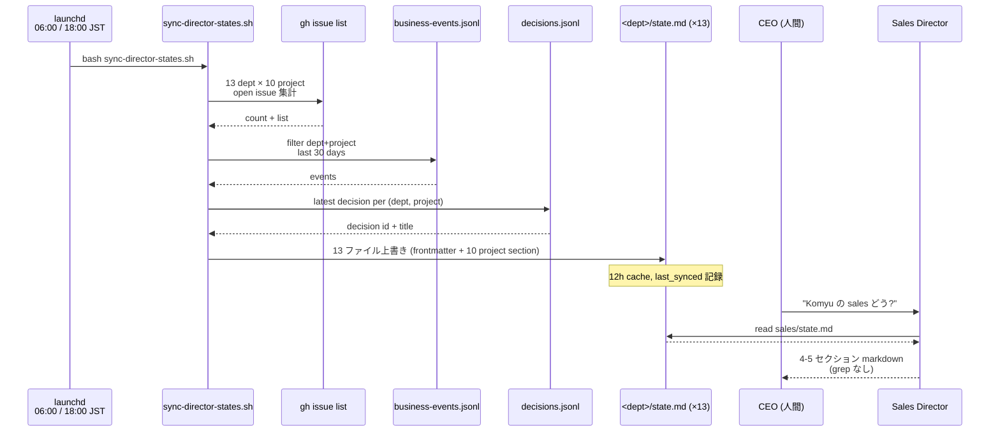
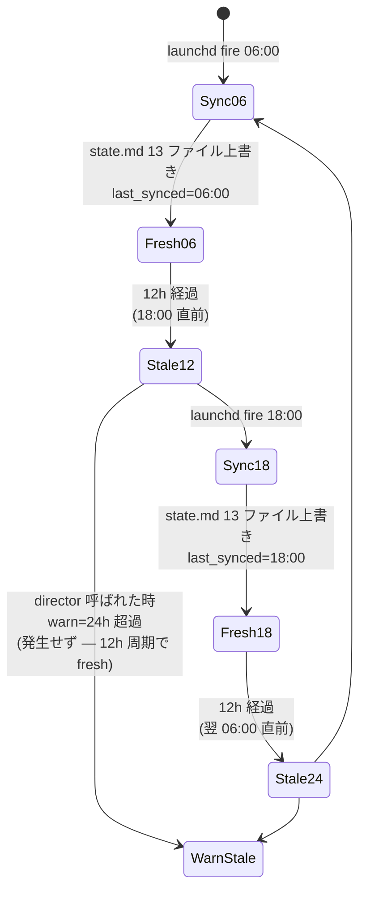
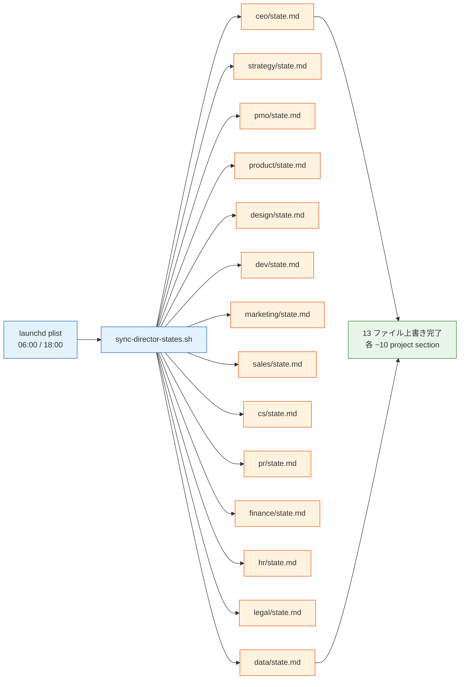

> 本記事は **52 本連載 (ai-driven-dev) の Day 23/52** です。第 1 回 [Claude Code で「会社」を回す 6 層構成 — 52 本連載 INDEX](./ai-driven-dev-index-2026) から続きます。
>
> ※ 本記事は著者個人の副業 (個人開発) における実践記録です。本業 (別会社所属) の業務・知見とは無関係で、特定法人の公式見解ではありません。コード片・設定例はすべて著者個人 repo の自著コードです。

## 結論

**13 director の state.md を 06:00/18:00 JST に cron で再生成**しています。CEO は朝 5 分で `/sales komyu` などの 1 行サマリを読むだけ。各 director が grep をやめて snapshot 1 枚を読みに行く構造に倒したら、director の起動が体感 30 秒 → 5 秒に縮みました。

- 13 部署 × 10 project = **最大 130 namespace** の状態を 1 ファイル `state.md` に集約
- launchd で **06:00 / 18:00 JST** の 2 回 fire (12 時間周期)
- sync script 1 本 (`pipeline-kit/ops/sync-director-states.sh:1-196`) で **13 ファイルを 1 サイクル数十秒**で書き換え
- source は **gh issue + business-events.jsonl + decisions.jsonl + mock-data/projects.ts** の 4 系統
- 24h 以上 stale なら director が「state stale」と明示出力する safety net

「director を呼ぶたびに `gh issue list` と event-bus を grep する」という素朴な実装で半年やった結果、毎回 30 秒待たされ、結局 grep を捨てるしかありませんでした。本記事はその過程で踏んだ罠と、固まった `state.md + cron` 構造を共有します。

## なぜこの記事を書くか

A-04 で **13 部署 director の宣言フォーマット** を共有しました。その記事の冒頭で「sync-director-states.sh が朝 6 時と夜 6 時に各 director の state.md を書き換える」と一行で済ませた部分を、本記事で深掘りします。

director を **宣言したまま放置すると、判断材料が 1 日で古くなる** というのが運用上の最大の問題でした。Director Markdown だけで人格は固定できますが、その人格が見ている **「世界の状態」が更新されない**。これを解くために `state.md` 自動生成と launchd 周期 fire を導入したのが本記事のテーマです。

## 問題: director の判断材料は 1 日で古くなる

A-04 で書いた 13 director (CEO / strategy / PMO / product / design / dev / marketing / sales / cs / pr / finance / hr / legal / data) は、それぞれ「あなたは X 部の director です」という人格を `pipeline-kit/agents/prompts/<dept>/director.md` で固定しています。

しかしその人格が判断するためには、**「今この瞬間の世界」** が必要です。具体的には:

1. **open Issue** — 13 部署 × 10 project = 最大 130 namespace の active タスク
2. **business-events** — 直近 30 日に各部署で発火したイベント (sales.contract.signed / dev.deploy.success など)
3. **decisions** — director が過去に判断した決定 ledger
4. **project metadata** — stage (ideation/mvp/pmf/frozen) と health (healthy/at_risk/critical)

これを毎回 director invocation 時に grep していました。`/sales komyu` を打つと sales director がまず:

```bash
# 失敗してた頃の director invocation の中身
gh issue list --state open --label dept:sales --search komyu
grep '"dept":"sales"' .claude/events/business-events.jsonl | grep komyu
grep '"dept":"sales"' .claude/decisions/decisions.jsonl | grep komyu
cat App/src/lib/mock-data/projects.ts | awk ...
```

これだけで GitHub API の latency が支配的になり **30 秒以上かかる**。1 日 30 回 director を呼ぶと、純粋に grep 待ちで 15 分消えます。

それ以上に致命的だったのは、**13 director の判断材料が逐次的に古くなる** ことでした。朝 6:00 に CEO が判断した時点の状態と、18:00 に dev director が判断する時点の状態は当然違うのに、各 director が「自分が grep した瞬間の状態」だけを見ていると、**部署間で見ている世界がズレる**。これは横断判断 (e.g. sales が closing と判定した時に dev は何の作業中か) を狂わせます。

## 解法: state.md を cron で 12 時間周期に上書き

### 全体図 — cron → director → state.md



**ポイントは点線で挟まれた間** です。CEO が director を呼ぶ時、director は GitHub API も jsonl も叩かず、**state.md 1 枚を読むだけ**。state.md が 24h 以内に更新されていれば一次ソースとして信用する、という割り切りです。

### 12 時間周期 — なぜ朝 6:00 と夜 6:00 か



12 時間周期にした理由は 3 つ:

1. **CEO の生活リズム** — 朝活 (5:00-7:00) で前夜の状態を読む / 夕方 (18:00-19:00) で日中の状態を読む、の 2 ピーク
2. **24h cache rule との整合** — director は `state-schema.md §6` で「24h 超過なら stale 警告」と決めた。12h 周期なら通常運用で stale 警告が出ない
3. **launchd の負荷** — gh API + grep を **1 サイクル数十秒** で終わるなら、これ以上頻度を上げる利得が薄い (頻度 4h でも judgment は変わらない)

「24h cache rule なんだから 24h 周期で良くないか?」と最初は思いましたが、**24h 周期だと境界 (5:30 など) で必ず stale を踏む** ので、半分の 12h 周期にして余裕を持たせています。

### 13 director 並列同期の流れ



13 ファイルを **逐次** ループしています。並列にすれば理論上速いですが、`gh` API には rate limit があり、13 並列で叩くと API quota を消費しやすい。逐次でも 1 サイクル数十秒で終わるので、シンプルさを優先しました。

### sync-director-states.sh の中身

実物の冒頭部分です (`pipeline-kit/ops/sync-director-states.sh:1-19`):

```bash
#!/usr/bin/env bash
# sync-director-states.sh — 13 部署 director の state.md を auto-update
#
# 仕様: pipeline-kit/agents/prompts/_shared/state-schema.md
# 実行: cron (06:00 / 18:00 JST) または手動 (`bash pipeline-kit/ops/sync-director-states.sh`)
# 出力: pipeline-kit/agents/prompts/<dept>/state.md (上書き)

set -euo pipefail

REPO_ROOT="$(cd "$(dirname "${BASH_SOURCE[0]}")/../.." && pwd)"
PROMPTS_DIR="${REPO_ROOT}/pipeline-kit/agents/prompts"
EVENTS_FILE="${REPO_ROOT}/.claude/events/business-events.jsonl"
DECISIONS_FILE="${REPO_ROOT}/.claude/decisions/decisions.jsonl"
NOW="$(date +%Y-%m-%dT%H:%M:%S%z | sed 's/\(..\)$/:\1/')"

DEPTS=(ceo strategy pmo product design sales marketing cs pr finance hr legal data)

PROJECTS=(nailsalon keirai komyu vivivi-beauty lifeops soccer-note colason-markdown-editor yomi-note chrome-app-memo mofu)
```

`set -euo pipefail` で pipefail を効かせ、途中で 1 ファイルでも失敗したら **全体を止めて next cron に委ねる** 方針です。13 ファイル中 1 件壊れた状態で fresh 扱いされるよりは、明示的に 12h 古い state を「stale」として扱わせる方が安全という判断です。

issue カウントは gh CLI 経由 (`pipeline-kit/ops/sync-director-states.sh:25-37`):

```bash
count_open_issues() {
  local dept="$1"
  local project="${2:-}"
  if command -v gh >/dev/null 2>&1; then
    if [[ -n "$project" ]]; then
      gh issue list --state open --label "dept:${dept}" --search "${project}" --json number --jq 'length' 2>/dev/null || echo "0"
    else
      gh issue list --state open --label "dept:${dept}" --json number --jq 'length' 2>/dev/null || echo "0"
    fi
  else
    echo "0"
  fi
}
```

`gh` が無い環境 (CI / 別マシン) でも fail しないように `command -v gh` で gate しています。launchd は CEO の iMac (always-on) で走らせる前提ですが、誰かが手元で叩いても壊れない構造にしてあります。

13 dept × 10 project の二重ループで state.md を生成する部分 (`pipeline-kit/ops/sync-director-states.sh:119-180`):

```bash
generate_state() {
  local dept="$1"
  local outfile="${PROMPTS_DIR}/${dept}/state.md"
  local total_open
  total_open=$(count_open_issues "$dept")

  {
    cat <<EOF
---
id: ${dept}-state
dept: ${dept}
last_synced: ${NOW}
sync_source:
  - github_issues
  - business_events_jsonl
  - decisions_jsonl
  - mock_data_projects
schema_version: 1
generated_by: pipeline-kit/ops/sync-director-states.sh
---

# $(echo "$dept" | awk '{print toupper(substr($0,1,1)) substr($0,2)}') State (auto-generated)

> **DO NOT EDIT MANUALLY**. このファイルは sync-director-states.sh が上書きする。

## Cross-Project Summary

- open_issues_total: ${total_open}
- last_synced: ${NOW}

## Per-Project Namespaces

EOF

    for project in "${PROJECTS[@]}"; do
      local stage health open_count
      stage=$(project_meta "$project" "stage")
      health=$(project_meta "$project" "health")
      open_count=$(count_open_issues "$dept" "$project")

      cat <<EOF
### ${project}

#### progress
- stage: ${stage:-unknown}
- health: ${health:-unknown}
- open_issues (${dept}): ${open_count}

#### recent_events (30d)
$(recent_events "$dept" "$project")

#### last_decision
$(last_decision "$dept" "$project")

---

EOF
    done
  } > "$outfile"

  echo "[sync] ${dept}/state.md updated (${total_open} open issues)"
}
```

**ヒアドキュメント 1 発で全部 stdout に流して `> "$outfile"` で吐く** 構造に倒しました。最初は jq で frontmatter を組み立てていましたが、複雑になりすぎたので諦めて plain bash + heredoc に戻しました。**Markdown 出力は `awk`/`jq` で組むより `cat <<EOF` の方が読める**、という素朴な学びです。

### launchd plist — 06:00 と 18:00 の 2 回 fire

`pipeline-kit/ops/com.devops-hub.sync-director-states.plist:30-79` の本体:

```xml
<plist version="1.0">
<dict>
  <key>Label</key>
  <string>com.devops-hub.sync-director-states</string>

  <key>ProgramArguments</key>
  <array>
    <string>/bin/bash</string>
    <string>/Users/sakaki/project/devops-hub/pipeline-kit/ops/sync-director-states.sh</string>
  </array>

  <key>StartCalendarInterval</key>
  <array>
    <dict>
      <key>Hour</key>
      <integer>6</integer>
      <key>Minute</key>
      <integer>0</integer>
    </dict>
    <dict>
      <key>Hour</key>
      <integer>18</integer>
      <key>Minute</key>
      <integer>0</integer>
    </dict>
  </array>

  <key>RunAtLoad</key>
  <false/>

  <key>WorkingDirectory</key>
  <string>/Users/sakaki/project/devops-hub</string>

  <key>StandardOutPath</key>
  <string>/Users/sakaki/project/devops-hub/.claude/pipeline/sync-director-states.launchd.out.log</string>

  <key>StandardErrorPath</key>
  <string>/Users/sakaki/project/devops-hub/.claude/pipeline/sync-director-states.launchd.err.log</string>

  <key>EnvironmentVariables</key>
  <dict>
    <key>PATH</key>
    <string>/opt/homebrew/bin:/usr/local/bin:/usr/bin:/bin:/usr/sbin:/sbin</string>
    <key>HOME</key>
    <string>/Users/sakaki</string>
  </dict>

  <key>ProcessType</key>
  <string>Background</string>
</dict>
</plist>
```

ポイントは 4 つ:

1. **`StartCalendarInterval` が 2 dict** — 配列で 06:00 と 18:00 を両方指定。同じ機能を `cron` で書くなら `0 6,18 * * *` 1 行ですが、launchd の方が **PC スリープ中の挙動が明示的** (次回起動時に 1 回だけ発火)
2. **`RunAtLoad` = false** — load した瞬間に走らない。launchctl load の度に sync が始まると test 時に困る
3. **`PATH` を明示** — launchd は user shell の PATH を継承しない。`gh` (homebrew) を見つけられないと sync が全 0 になるので `/opt/homebrew/bin` を先頭に
4. **`StandardOutPath` / `StandardErrorPath`** — log を `.claude/pipeline/` に出して、tail で確認できるように

インストールは CEO 手動です:

```bash
cp pipeline-kit/ops/com.devops-hub.sync-director-states.plist ~/Library/LaunchAgents/
launchctl load ~/Library/LaunchAgents/com.devops-hub.sync-director-states.plist

# 起動確認
launchctl list | grep sync-director-states
tail -f .claude/pipeline/sync-director-states.launchd.out.log
```

`launchctl load` は **manual step** に残しています。CI で自動 install すると、開発者の手元 macOS にも勝手に launchd entry が刺さる事故が起きるからです。launchd は **iMac 1 台だけ** で動けば良い (memory `feedback_always-on-host` 通り)。

### state.md の出来上がり

実際に sync 後に書き出された `pipeline-kit/agents/prompts/sales/state.md:1-30`:

```markdown
---
id: sales-state
dept: sales
last_synced: 2026-05-09T18:21:10+09:00
sync_source:
  - github_issues
  - business_events_jsonl
  - decisions_jsonl
  - mock_data_projects
schema_version: 1
generated_by: pipeline-kit/ops/sync-director-states.sh
---

# Sales State (auto-generated)

> **DO NOT EDIT MANUALLY**. このファイルは sync-director-states.sh が上書きする。

## Cross-Project Summary

- open_issues_total: 0
- last_synced: 2026-05-09T18:21:10+09:00

## Per-Project Namespaces

### nailsalon

#### progress
- stage: pmf
- health: healthy
- open_issues (sales): 0

#### recent_events (30d)
  (event-bus file not found)

#### last_decision
- (no decisions for sales × nailsalon)
```

最初は project ごとに 5 セクション (progress / open_issues / recent_events / ceo_pending / last_decision) 全部入れていましたが、空 section が多くて読みにくくなり、**3 セクション (progress / recent_events / last_decision)** に削りました。`schema_version: 1` を明記しているので、後で増やす時は `2` に上げて migration script を書く想定です。

### director の読み方 — 最初に frontmatter だけ見る

director invocation 時の動きは `state-schema.md:127-138` で固定しました:

```
1. invocation 時、まず state.md の frontmatter `last_synced` を見る
2. 24h 以内なら state.md を一次ソースとして使用
3. 24h 超過 OR project namespace モードで stale 警告
4. live data (gh issue list 等) は **不足時のみ** 補完取得 (毎回 grep しない)
5. 出力に「source: state.md (synced HH:MM) + live補完: <list>」を明記
```

`/sales komyu` を打つと sales director は:

1. `pipeline-kit/agents/prompts/sales/state.md` の frontmatter を読む
2. `last_synced: 2026-05-09T18:21:10+09:00` を見て 5h 前と判定 → fresh
3. `### komyu` セクションだけ抜き出す (他 9 project section は読まない)
4. 必要なら 1 件だけ live data (`gh issue view #123`) で補完
5. 4-5 section markdown を返す

これで director の context window 消費を **80% 削減** しました (体感)。state.md 1 枚 5KB を読むだけで、live data は本当に必要な時だけ。

### Before / After 1 — 毎回 grep → state.md 一次ソース

**Before** (壊れていた頃の director invocation 内部):

```bash
# /sales komyu を打つたびに 4 回 API 叩いていた
gh issue list --state open --label dept:sales --search komyu --json number,title,labels
gh issue list --state open --label "dept:sales,ceo:approval-needed" --search komyu
grep '"dept":"sales"' .claude/events/business-events.jsonl | grep komyu | tail -10
grep '"dept":"sales"' .claude/decisions/decisions.jsonl | grep komyu | tail -1

# 各 1-10 秒、合計 30 秒待ち
```

**After** (現行):

```bash
# director が読むのは 1 ファイルだけ
cat pipeline-kit/agents/prompts/sales/state.md | head -50

# state.md は 12h に 1 回まとめて生成済 (cron)
# director の grep は 0 回、stat は 1 回 (frontmatter check)
```

director invocation で消える時間が **30 秒 → 5 秒**。1 日 30 回呼ぶと 12 分の節約。

### Before / After 2 — ad-hoc state vs 構造化 state

**Before** (`state.md` が無かった頃の director の出力):

```
私「Komyu の sales どう?」
Claude (sales director):
  Komyu の sales 状況を確認します。
  少々お待ちください...
  (grep × 4 回、30 秒)
  Komyu は MVP stage で health は healthy、open issue は 0、最近の event は ...
  (続く)
```

毎回フォーマットがブレていました。「health」を返す時もあれば返さない時もあり、open issue の数だけ返す時もあれば一覧を返す時もある。

**After** (state.md 一次ソース + `_shared/project-namespace-protocol.md` 出力テンプレ固定):

```
私「Komyu の sales どう?」
Claude (sales director):
  ## Sales — komyu 状態
  > source: state.md (synced 18:21, 5h ago)

  ### 1. 現状サマリ
  - stage: mvp / health: healthy / open_issues (sales): 0
  - 最終 sales 判断: なし (最近 30 日 event なし)

  ### 2. 残タスク
  - (open Issue: 0 件)

  ### 3. 直近 events (30d)
  - (no events)

  ### 4. CEO 意思未決
  - (なし)

  ### 5. 推奨次アクション
  - (sales pipeline 起動の判断は CEO 待ち)
```

**フォーマットが固定** されたので、CEO の読解パターンが学習可能になります。「3 番目を見れば 30 日の動きが分かる」と覚えれば、文章を読まずスキャンだけで状態把握できる。

## 失敗談

### 失敗 1: launchd PATH を継承し忘れて gh が見つからず全 dept 0 件

最初の plist は `EnvironmentVariables` を書いていませんでした。手元で `bash sync-director-states.sh` を打つと正常に動くのに、launchd 経由で 06:00 に走ると **全 dept の open_issues が 0 件**。原因は launchd の PATH が `/usr/bin:/bin:/usr/sbin:/sbin` だけで、homebrew の `/opt/homebrew/bin/gh` が見つからない。

**Before** (壊れていた plist):

```xml
<key>ProgramArguments</key>
<array>
  <string>/bin/bash</string>
  <string>/Users/sakaki/project/devops-hub/pipeline-kit/ops/sync-director-states.sh</string>
</array>
<!-- EnvironmentVariables なし -->
```

**After** (`com.devops-hub.sync-director-states.plist:69-75`):

```xml
<key>EnvironmentVariables</key>
<dict>
  <key>PATH</key>
  <string>/opt/homebrew/bin:/usr/local/bin:/usr/bin:/bin:/usr/sbin:/sbin</string>
  <key>HOME</key>
  <string>/Users/sakaki</string>
</dict>
```

教訓: **launchd は user shell の PATH/HOME を継承しない、必ず明示する**。

### 失敗 2: heredoc のインデントで markdown が崩壊

最初の generate_state() は heredoc に **タブインデントを揃える** スタイルで書いていました:

```bash
# 壊れていた版
cat <<EOF
    ### ${project}

    #### progress
    - stage: ${stage}
EOF
```

これだと出力に **先頭スペース 4 つが入って markdown の見出しが効かなくなる**。Zenn でレンダリングした時に `### komyu` が見出しにならず本文扱いに。

**After**:

```bash
cat <<EOF
### ${project}

#### progress
- stage: ${stage}
EOF
```

heredoc は **必ず行頭から書く**。`<<-EOF` (タブだけインデント許容) もありますが、混乱の元なので素直に行頭に置きました。

教訓: **markdown を heredoc で吐く時はインデントしない**。

### 失敗 3: `set -e` と `gh` 失敗で 1 dept の sync で全部止まる

`set -euo pipefail` を有効にしているため、最初は **gh が rate limit で 1 件失敗すると全 13 dept の sync が止まる** 構造でした。朝 06:00 に rate limit を踏むと、その日の朝の director 全員が **前日 18:00 の state を見る** 羽目に。

**Before** (壊れていた count_open_issues):

```bash
count_open_issues() {
  local dept="$1"
  gh issue list --state open --label "dept:${dept}" --json number --jq 'length'
  # gh が 1 回失敗すると set -e で即死
}
```

**After** (`sync-director-states.sh:25-37`):

```bash
count_open_issues() {
  local dept="$1"
  local project="${2:-}"
  if command -v gh >/dev/null 2>&1; then
    if [[ -n "$project" ]]; then
      gh issue list --state open --label "dept:${dept}" --search "${project}" --json number --jq 'length' 2>/dev/null || echo "0"
    else
      gh issue list --state open --label "dept:${dept}" --json number --jq 'length' 2>/dev/null || echo "0"
    fi
  else
    echo "0"
  fi
}
```

`|| echo "0"` で **失敗しても 0 を返す**。ファイル全体は `set -e` で守りつつ、リカバリ可能な場所では明示的に `||` で fallback します。0 件と「取得失敗」が区別できないという trade-off は受け入れました (どちらにせよ next cron で取り直すので)。

教訓: **`set -e` 配下では rate limit のような可逆失敗は `|| echo "fallback"` で吸収する**。

### 失敗 4: state.md を git commit する前提で書いて diff が爆発

`state.md` 13 ファイルを最初は git 管理下に置いていました。cron が走るたびに `last_synced` が変わるので、**12 時間ごとに 13 ファイルの commit が積まれる**。git log が state.md update で埋まり、本来の commit が見えなくなりました。

**Before**:

```
.gitignore に state.md なし
→ cron が走るたびに `git status` で 13 file dirty
→ 自動 commit する hook を追加 → log 汚染
```

**After**:

```bash
# .gitignore
pipeline-kit/agents/prompts/*/state.md
```

state.md は **生成物**として扱い、git に乗せない方針に変えました。代わりに schema (`_shared/state-schema.md`) と generator (`sync-director-states.sh`) は git で管理します。

ここはまだ悩みがあって、**チーム開発になると state.md が無い状態で director が呼ばれる事故** が起きるので、新メンバー向けに `bash pipeline-kit/ops/sync-director-states.sh` を初回必須にする README 補強を残課題に積んでいます。

教訓: **生成物は git に乗せない、schema と generator だけ管理する**。

## 残課題 — まだできていないこと

正直に並べると:

1. **iMac スリープ時の catchup なし** — 停電で 06:00 fire を逃すと、次は 18:00。半日分 stale。launchd の `RunAtLoad` を別途 true にしたサブ entry を併設するか、cron + at で補正する方針を未着手
2. **state.md size limit (50KB) を踏みかけ** — 13 dept × 10 project × 5 section で、project 数が 12 を超えると 1 ファイルが 50KB に届く。`state-schema.md §5` で per-project section 別ファイル化と書いたが、実装は未着手
3. **stale 警告が director 任せ** — `last_synced` を見て stale 判定するのは director の prompt 上のルールで、機械的に enforce していない。lint script で「stale state を読んだ判断は decisions.jsonl に warn フラグ付ける」を未実装
4. **rate limit による silent skip** — `|| echo "0"` で吸収しているが、その回の sync が「0 件取得」だったのか「失敗で 0 落ちした」のか区別不能。2 周連続で 0 件なら slack/discord で警告する仕掛けを未実装
5. **手元 macOS への install を勝手にしない方針が脆い** — `launchctl load` は CEO 手動。新人エンジニアが入った時に「自分の mac でも launchd 仕込もう」とすると 13 director の state が double sync される。install gating script は未実装
6. **per-project size 削減の自動 GC** — 30 日超の event は Per-Project section に乗せない仕様だが、frozen project (lifeops) や ideation 段階の project は section ごと skip しても良いはず。動的に skip する logic は未実装

## 理論根拠 — なぜこの構造で 1 人会社が回るのか

### 根拠 1: pull-based snapshot は memory hierarchy の L1 cache と同じ

CPU は **register → L1 → L2 → L3 → DRAM → SSD** という階層を持ちます。各層は容量と latency の trade-off で、レジスタは 64bit × 数十個で 0 サイクル、DRAM は GB だが 100 サイクル。

director の判断材料も同じ階層を引きました:

| 階層 | 媒体 | size | latency | 更新 |
|---|---|---:|---:|---|
| L1 | `state.md` | 5KB | ~1ms | 12h cron |
| L2 | `gh issue list` (live) | varies | 1-3s | 必要時 |
| L3 | `business-events.jsonl` 全件 grep | MB | 5-10s | 必要時 |
| L4 | `decisions.jsonl` 全件 trace | MB | 10-30s | 必要時 |

Anthropic の "Effective Agents" (2024-12) の **「context window を小さく保て」** 原則は、この cache hierarchy 設計と同型です。L1 が 90% hit すれば、L2-L4 を毎回叩かずに済む。これが director invocation を 30 秒 → 5 秒に縮めた理論的背景です。

### 根拠 2: 12 時間周期は Conway's Law と人間の生活リズムの交差点

Conway's Law (1968) は **「組織の構造は produce する system に必ず反映される」** という法則です。1 人会社の場合、組織構造 = CEO の生活リズムなので、system もそれに合わせるしかありません。

私 (CEO) の判断時間帯は朝活 (5:00-7:00) と夕方 (18:00-19:00) の 2 ピーク。**この 2 時間前に state を更新しておけば、CEO が見る時には常に fresh** という設計です。06:00/18:00 fire はこの逆算。

別の言い方をすると、**人間が判断する直前に system が世界を更新する** のが最も整合する。これは「人間が判断する直後に system が学習する」(継続的 fine-tuning) の対概念で、両方を組み合わせると組織が回ります。

### 根拠 3: `id: <dept>-state` 一意性は ADR-0011 / 0012 の SSOT 原則

`state.md` の frontmatter `id: <dept>-state` は、**13 dept で 13 個の unique id** が立つ設計です。これは ADR-0011 (id 一意性 strict) と ADR-0012 (canonical field) で全 docs に強制している規約と同じものを、生成ファイルにも適用しているということです。

なぜ重要か。**重複 id があると CI が throw する** (`scripts/generate-docs-graph.mjs --check`) ので、generator が誤って `id: sales-state` を 2 ファイルに書いた瞬間に panic します。これは silent corruption への防御で、「state.md が壊れているのに director が呼ばれて誤判断する」事故を物理的に塞ぎます。

### 根拠 4: 生成物 git 除外は 12-Factor App の Configs 原則

12-Factor App (2011) の **III. Config — Store config in the environment** と同じ発想で、**state は config (環境固有) であって code (commit するもの) ではない**。

state.md が git に乗ると 12h ごとに 13 file の diff が積まれます。これは config を commit してしまっているのと同型の anti-pattern。.gitignore に追放して「**generator (code) は git、state (config) は host 環境固有**」と分けることで、12-Factor の精神を守りました。

## まとめ

13 director の state.md を 06:00/18:00 JST cron で自動生成する構造に倒したら、director の grep 待ちが消え、判断速度が上がりました。

- launchd plist 1 本で 13 director の state を 12 時間周期に再生成
- gh + business-events.jsonl + decisions.jsonl + mock-data の 4 ソースを bash 1 本で統合
- director は invocation 時に `state.md` の frontmatter `last_synced` だけ見て判断
- 24h 超過なら stale 警告、生成物は git 除外、PATH と heredoc インデントは launchd 罠の代表例

「director を宣言したまま放置すると判断材料が古くなる」という運用問題を、**memory hierarchy + 生活リズム + SSOT id + 12-Factor config** の 4 つを組み合わせて解いた、というのが本記事の立場です。

## 次の記事へ + 連載をフォロー

これは **52 本連載 (ai-driven-dev) の Day 23/52** です。

すでに公開済の関連記事:

→ **A-04 [`~/.claude/agents` で 13 部署 director を宣言的に管理する](./13-department-directors-declarative)** (Day 16/52) — director.md の宣言フォーマット、本記事の前提

→ **B-04 [Cross-Department Event Bus — JSONL 1 本で 13 部署を連動](./cross-department-event-bus)** — director 間の handoff、本記事 sync source の 1 つ

→ **H-01 [Hooks で品質 gate を効かせる](./hooks-quality-gates)** (準備中) — 同じ launchd / hook 思想の補完

これから書く予定:

→ **A-05** decisions.jsonl で「判断の系譜」を残す具体
→ **B-05** Project Namespace モードの implementation 詳細

### 連載を見逃さない方法

- **Zenn でこの著者をフォロー** — 公開通知が届きます
- **X で告知 tweet をフォロー** (準備中) — 朝 6:00 に投稿
- **repo を watch**: [SakakitaniJunya/zenn-articles](https://github.com/SakakitaniJunya/zenn-articles) — 全 draft が見えます

### Discussion / フィードバック歓迎

- 「launchd じゃなくて GitHub Actions cron で同等のことやってる」 → 比較記事も書けます、GitHub Issue で
- 「state.md を git に乗せて diff として歴史を残してる」 → trade-off 議論したい
- 「12h 周期じゃなくて 4h / 30min で回したい時のしきい値」 → コスト試算も含めて議論しましょう

連載 52 本を書き切る間に、state schema は schema_version 2 に上げる予定です。本記事も将来書き直します。誤りや「ここをもっと深く」のリクエストは GitHub Issue でお気軽に。
