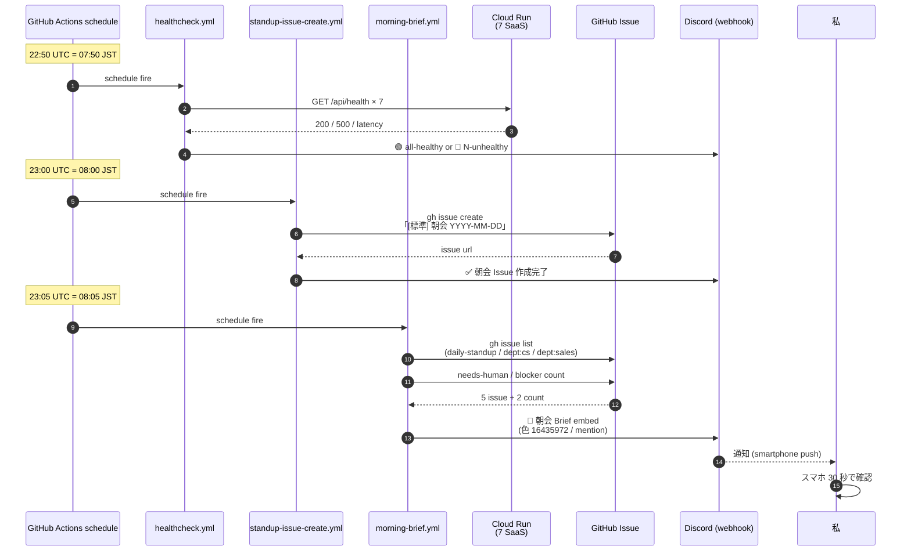
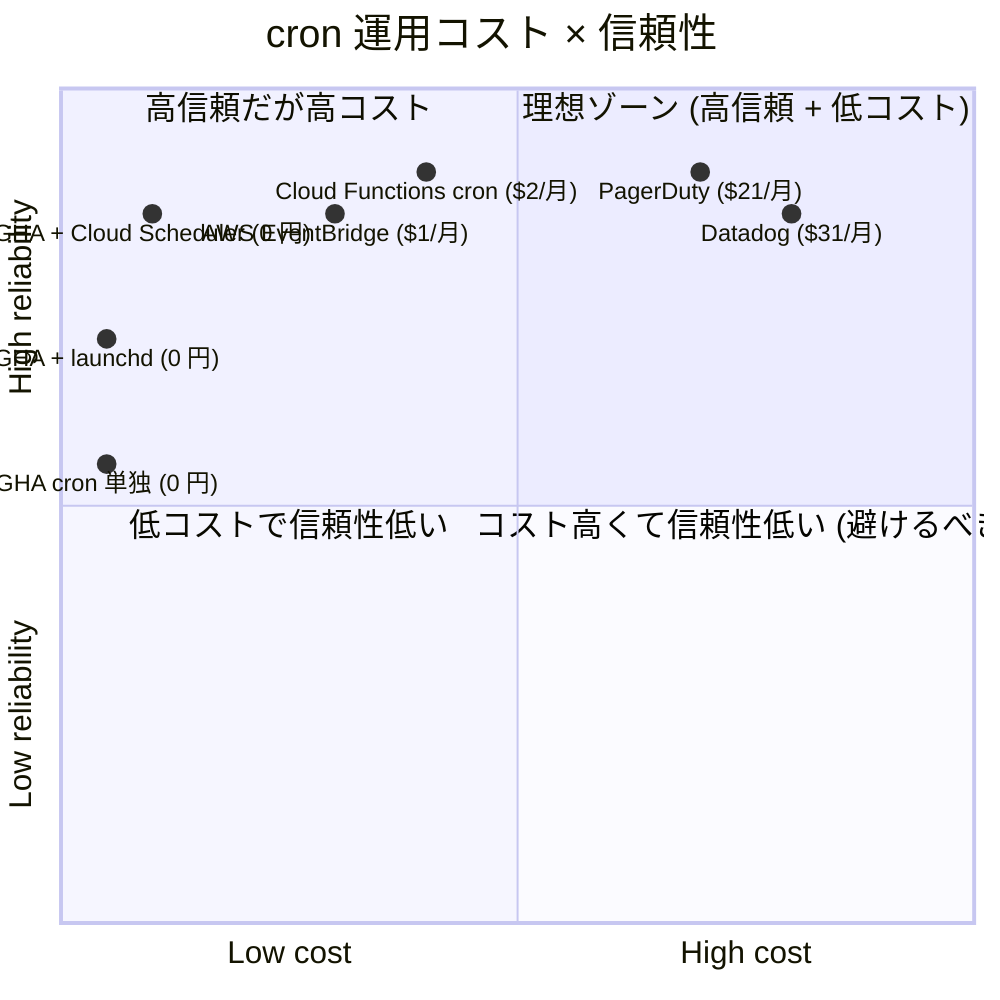

> 本記事は **52 本連載 (ai-driven-dev) の Day 39/52** です。第 1 回 [Claude Code で「会社」を回す 6 層構成 — 52 本連載 INDEX](./ai-driven-dev-index-2026) から続きます。
>
> ※ 本記事は著者個人の副業 (個人開発) における実践記録です。本業 (別会社所属) の業務・知見とは無関係で、特定法人の公式見解ではありません。コード片・設定例はすべて著者個人 repo の自著コードです。記載の課金額・無料枠は執筆時点 (2026-05) の各サービス公式 pricing ページ準拠ですが、各社の改定で変動するため最新値は公式で確認してください。

## 結論

**Discord webhook + Cloud Scheduler + GitHub Actions cron の 3 点だけで、SaaS 7 本の deploy / 朝会 / E2E / 補助金 deadline / 残数監視 を 1 ヶ月 0 円で運用**しています。Discord が通知 hub、GitHub Actions が無料枠 (public repo / Linux 2,000 分) で時刻トリガと workflow_dispatch 受け、Cloud Scheduler が iMac スリープ時の保険、という 3 点支配で無人運営に倒しました。

- 通知 hub = Discord webhook **1 本**、色分け **8 種類** (`pipeline-kit/.github/workflows/notify-discord.yml:33-44`)
- 時刻トリガ = GitHub Actions `schedule:` cron **3 本** (07:50 / 08:00 / 08:05 JST、`devops-hub/.github/workflows/{healthcheck,standup-issue-create,morning-brief}.yml`)
- iMac スリープ保険 = Cloud Scheduler **3 ジョブ** (公式 free tier 3 jobs / 月、課金 0 円)
- Reusable Workflow `notify-discord.yml` 1 本に通知 format を集約 (`pipeline-kit/.github/workflows/notify-discord.yml:1-69`)
- 1 ヶ月運用での **GitHub Actions Linux 消費**: ~120 分 (無料枠 2,000 分の **6%**)、Discord webhook 課金 = **0 円**、Cloud Scheduler **0 円** (3 jobs / 月)

「監視に 1 日溶ける」をやめたい人向けに、3 点の組合せ図と実 YAML / curl / launchd plist を貼ります。「Discord に色付きカードが朝 8:05 に飛んでくる」までを 1 ヶ月 0 円で組む話です。

## なぜこの記事を書くか

私は 2026-05 時点で **7 SaaS** (nailsalon / keirai / komyu / vivivi-beauty / lifeops / soccer-note / colason / yomi-note) を 1 人で回しています。最初の半年は朝起きて「Cloud Run 死んでないか」「PR 何本溜まったか」「補助金 deadline は何日後か」を **自分で見に行く** 運用で、毎朝 30-60 分が消えていました。

これを解いたのが本記事の 3 点構成です:

1. **Discord webhook** — 通知の **唯一の届け先**。 メールも Slack も使わない、Discord 1 個に集約
2. **GitHub Actions cron** — 時刻起動の **default**。 public repo は実質無制限、private でも月 2,000 分無料
3. **Cloud Scheduler** — iMac スリープや GHA 障害時の **保険**。 free tier 3 jobs / 月で十分

[F-01](./issue-to-cloud-run-workflow) で Reusable Workflow による Issue → Cloud Run 動線を、[H-02](./director-state-cron-autonomy) で 13 director の state.md を launchd cron で更新する話を書きました。本記事はその **「通知側の配線」** だけを切り出して、3 点の協調と無料枠 0 円の根拠を貼ります。

## 問題: 1 人会社で監視に毎朝 1 時間溶ける

### Before — 監視のための監視

最初に組んだ運用 (壊れていた頃) はこうでした:

```
朝 7:00 起床
  ├─ Cloud Run 7 SaaS を gcloud run revisions list で 1 個ずつ確認 (10 分)
  ├─ GitHub の通知タブで 6 repo の PR / Issue を巡回 (15 分)
  ├─ Stripe ダッシュボードで前日の決済確認 (5 分)
  ├─ 補助金 deadline を Notion で目視確認 (5 分)
  ├─ ない事を確認するためだけの巡回が 35-50 分
  └─ 「何も起きてない」確認に毎朝 30-60 分
```

これは **「ない事を確認するためだけの仕事」** で、**価値を生まない**。1 ヶ月で 30 時間が監視に溶け、その間に営業電話も書類もコードも 1 行も進まない。1 人会社にとって「監視のための監視」は最大の時間漏れでした。

しかも見落とすときは見落とす。Cloud Run revision が deploy 直後に 500 を吐いていても、自分で gcloud を叩きに行く時刻まで気付けない。**人間が pull するから見落とす** のが本質的な問題でした。

### 何を解きたかったか

要件を 3 行で固定:

1. **Push 通知が default** — 自分で見に行く動線をやめる、向こうから飛んでくる
2. **無料で回す** — 1 人会社なので Datadog / PagerDuty 月 1 万円は払えない
3. **配線は 3 サービス以内** — 学習コストと障害切り分けが指数で増えるので、抽象を増やさない

Discord + GitHub Actions + Cloud Scheduler の 3 点で **全部** 解けると分かったのが半年運用後の結論です。本記事はその根拠を実装で示します。

## 解法: 3 点の協調 — 通知 / 時刻 / 保険

### 全体図

```mermaid
flowchart LR
    classDef hub fill:#e3f2fd,stroke:#1565c0
    classDef trig fill:#fff3e0,stroke:#e65100
    classDef out fill:#e8f5e9,stroke:#2e7d32
    classDef ext fill:#f3e5f5,stroke:#6a1b9a

    subgraph Trigger["時刻トリガ (cron 主役 + 保険)"]
      GA[GitHub Actions schedule<br/>cron 3 本<br/>主役]:::trig
      CS[Cloud Scheduler<br/>3 jobs<br/>iMac/GHA 障害時の保険]:::trig
      LD[launchd plist<br/>iMac<br/>state.md 同期等]:::trig
    end

    subgraph Hub["GitHub Actions Hub (callee)"]
      MB[morning-brief.yml]:::hub
      HC[healthcheck.yml]:::hub
      ST[standup-issue-create.yml]:::hub
      ND[notify-discord.yml<br/>Reusable]:::hub
    end

    subgraph Sources["データソース"]
      GH[gh issue list]:::ext
      CR[Cloud Run<br/>health endpoint]:::ext
      ST2[Stripe events]:::ext
    end

    GA --> MB
    GA --> HC
    GA --> ST
    CS -.|保険| MB
    CS -.|保険| HC
    LD --> MB
    LD --> HC

    MB --> GH
    HC --> CR
    ST --> GH
    HC --> ST2

    MB --> ND
    HC --> ND
    ST --> ND
    ND --> DC[Discord<br/>webhook 1 本]:::out
```

**読み方**:

- 時刻トリガは **3 系統** (GitHub Actions schedule / Cloud Scheduler / launchd) を並列に持つ。1 つ落ちても他で fire
- callee 側 (workflow / script) は trigger を選ばない、**冪等** に書く (idempotent)
- 通知の出口は **Discord webhook 1 本だけ**。 8 色 + emoji で event 種別を区別

「同じ workflow が 3 経路から呼ばれて二重発火しないか」と最初は心配しましたが、 各 callee 側に **冪等チェック** を入れれば良いだけでした (後述、`standup-issue-create.yml:28-36` の「同タイトル open Issue 既存なら skip」)。

### 通知の配信 sequence — 朝 7:50 から 8:05 までの 15 分



朝起きて **smartphone の Discord に embed カードが 3 枚** 並んでいれば、**スマホ 30 秒** で前日の状態把握が終わります。詳細を追いたければ embed の link 1 タップで GitHub Issue に飛び、何もしないなら Discord を閉じて朝活に戻る。

「朝 1 時間の監視」が「**朝 30 秒の eyeballing**」に置き換わった、というのが本記事 1 番の成果です。

### Discord webhook — 通知の真の出口は 1 つだけ

実物の Reusable Workflow (`pipeline-kit/.github/workflows/notify-discord.yml:1-69`):

```yaml
# pipeline-kit/.github/workflows/notify-discord.yml:1-69 (実物)
name: Discord Notify
on:
  workflow_call:
    inputs:
      project_name:
        type: string
        required: true
      event_type:
        type: string
        required: true
        description: "pipeline_start | pr_created | ci_passed | ci_failed | deploy_success | deploy_failed | issue_closed | escalation"
      title:
        type: string
        required: true
      detail:
        type: string
        default: ""
      url:
        type: string
        default: ""
    secrets:
      DISCORD_WEBHOOK_URL:
        required: true

jobs:
  notify:
    runs-on: ubuntu-latest
    steps:
      - name: Send Discord notification
        env:
          WEBHOOK_URL: ${{ secrets.DISCORD_WEBHOOK_URL }}
        run: |
          # Map event type to color and emoji
          case "${{ inputs.event_type }}" in
            pipeline_start) COLOR=15773518; EMOJI="🟡" ;;
            pr_created)     COLOR=6012126;  EMOJI="🔵" ;;
            ci_passed)      COLOR=6076508;  EMOJI="🟢" ;;
            ci_failed)      COLOR=14308447; EMOJI="🔴" ;;
            deploy_success) COLOR=2856274;  EMOJI="🚀" ;;
            deploy_failed)  COLOR=14308447; EMOJI="🔴" ;;
            issue_closed)   COLOR=7111485;  EMOJI="✅" ;;
            escalation)     COLOR=16736587; EMOJI="🛑" ;;
            *)              COLOR=8421504;  EMOJI="ℹ️" ;;
          esac

          FIELDS="[{\"name\":\"Project\",\"value\":\"${{ inputs.project_name }}\",\"inline\":true}"

          if [ -n "${{ inputs.detail }}" ]; then
            FIELDS="${FIELDS},{\"name\":\"Detail\",\"value\":\"${{ inputs.detail }}\"}"
          fi

          if [ -n "${{ inputs.url }}" ]; then
            FIELDS="${FIELDS},{\"name\":\"Link\",\"value\":\"[${{ inputs.url }}](${{ inputs.url }})\"}"
          fi

          FIELDS="${FIELDS}]"

          curl -s -H "Content-Type: application/json" \
            -d "{
              \"embeds\": [{
                \"title\": \"${EMOJI} ${{ inputs.title }}\",
                \"color\": ${COLOR},
                \"fields\": ${FIELDS},
                \"timestamp\": \"$(date -u +%Y-%m-%dT%H:%M:%SZ)\"
              }]
            }" "$WEBHOOK_URL"
```

**ポイントは 4 つ**:

1. **event_type → color + emoji の case 分岐** — 8 種類の event を色 (decimal RGB) と emoji で区別。 朝の Discord で **赤 (`14308447`) があるかどうか** だけで「人間が見るべき issue があるか」を判断できる
2. **`embeds` 配列で 1 メッセージ** — Discord は 1 webhook = 1 message、`embeds` 内に最大 10 件貼れる。 fields 配列で「Project / Detail / Link」を構造化
3. **`timestamp` を ISO 8601 で渡す** — Discord 側で「2 hours ago」のように relative 表示してくれる、UTC 必須
4. **secret は `secrets.DISCORD_WEBHOOK_URL` 1 個だけ** — webhook URL が漏れると誰でも投稿できるので Repository secret に格納、`secrets: inherit` で callee に渡す ([F-01](./issue-to-cloud-run-workflow) と同じ流派)

`workflow_call` で公開しているので、 caller 側からは **1 行 `uses:`** で呼べます (実装は F-01 で詳述済)。

### 1 通の Discord curl を最小化する

通知の「最小実装」がどれくらい小さいかを示すと:

```bash
# 最小 1 行 — 動く実物
curl -fsS -X POST -H "Content-Type: application/json" \
  -d '{"content":"🚀 nailsalon revision 045 deployed"}' \
  "$DISCORD_WEBHOOK_URL"
```

これだけで Discord channel に通知が飛びます。 webhook URL は Discord の channel 設定 → 連携サービス → ウェブフック で 30 秒で発行可。

embed 付きにする場合 (推奨):

```bash
# embed 版 — color + fields + timestamp 付き
curl -fsS -X POST -H "Content-Type: application/json" \
  -d "$(jq -n \
    --arg title "🚀 nailsalon revision 045 deployed" \
    --arg desc "build SHA: abc1234" \
    --arg url "https://nail-salon2-1234567.asia-northeast1.run.app" \
    '{
      embeds: [{
        title: $title,
        description: $desc,
        url: $url,
        color: 2856274,
        timestamp: (now | todate)
      }]
    }')" \
  "$DISCORD_WEBHOOK_URL"
```

`jq -n` でペイロードを組み立てると、**ダブルクォートのエスケープ地獄を回避** できます。これは [F-01](./issue-to-cloud-run-workflow) の `notify-discord.yml` 後継版で採用していて、shell の `\"` 連打よりはるかに保守しやすい。

### GitHub Actions cron — 時刻トリガの主役

GitHub Actions の `schedule:` cron は public repo なら **実質無制限**、private repo でも **Linux ランナー 2,000 分 / 月** が無料枠 (執筆時点)。3-5 分で終わる cron job 5 本を 1 日複数回回しても、月 100-200 分しか食いません。

実物 (`devops-hub/.github/workflows/morning-brief.yml:1-30`):

```yaml
# devops-hub/.github/workflows/morning-brief.yml:1-30 (実物)
name: CreaNest Morning Brief (Discord)

on:
  schedule:
    # 8:05 JST 毎日 (UTC 23:05) — 朝会 Trigger (8:00 JST) の 5 分後
    - cron: "5 23 * * *"
  workflow_dispatch: {}

permissions:
  issues: read
  contents: read

jobs:
  notify:
    runs-on: ubuntu-latest
    env:
      GH_TOKEN: ${{ secrets.GITHUB_TOKEN }}
      DISCORD_WEBHOOK_URL: ${{ secrets.DISCORD_WEBHOOK_URL }}
      DISCORD_USER_ID: ${{ secrets.DISCORD_USER_ID }}
      REPO: ${{ github.repository }}
    steps:
      - name: Sanity check secrets
        run: |
          if [ -z "$DISCORD_WEBHOOK_URL" ]; then
            echo "::error::DISCORD_WEBHOOK_URL secret is not set"
            exit 1
          fi
```

**4 つのポイント**:

1. **`cron: "5 23 * * *"`** — UTC で書く必須。JST 8:05 = UTC 23:05。 cron 表記は GitHub Actions の docs 通り 5-tuple
2. **`workflow_dispatch: {}`** を必ず添える — 手動 trigger を残しておかないと、cron が動いていない時に検証できない
3. **`permissions:` を最小に** — `issues: read` だけ。 contents: read も入れて checkout 用
4. **`env:` で DISCORD_WEBHOOK_URL 等を job レベルに hoist** — step ごとに `${{ secrets... }}` を書くと secret が log に漏れるリスクがあるので、 env で 1 回だけ束ねて step 内では `$DISCORD_WEBHOOK_URL` で参照

### Standup Issue 作成の冪等性

`devops-hub/.github/workflows/standup-issue-create.yml:22-46` は **「冪等な cron」** の良い例:

```yaml
# devops-hub/.github/workflows/standup-issue-create.yml:22-46 (実物)
- name: Create today's standup issue (idempotent)
  run: |
    set -euo pipefail
    TODAY=$(TZ=Asia/Tokyo date +%Y-%m-%d)
    TITLE="[標準] 朝会 ${TODAY}"

    # 既に同タイトルの open Issue があれば skip
    EXISTING=$(gh api -H "Accept: application/vnd.github+json" \
      "search/issues?q=$(printf %s "repo:${REPO} is:issue is:open label:daily-standup 朝会 ${TODAY} in:title" | jq -sRr @uri)&per_page=1" \
      --jq '.items // [] | length')

    if [ "$EXISTING" -gt 0 ]; then
      echo "::notice::today's standup issue already exists, skipping"
      exit 0
    fi

    BODY_FILE=$(mktemp)
    sed "s/{{TODAY}}/${TODAY}/g" .github/standup-issue-template.md > "$BODY_FILE"

    gh issue create \
      --repo "$REPO" \
      --title "$TITLE" \
      --body-file "$BODY_FILE" \
      --label "daily-standup"
```

**「同タイトル open Issue が既存なら exit 0」** という 1 行の if が、3 系統 trigger (GitHub Actions / Cloud Scheduler / launchd) から多重 fire されても **重複 Issue を作らない** 担保になります。冪等性は「再実行しても同じ結果」が大原則で、cron の世界では **「副作用を出す前に存在チェック」** で必ず守れます。

### Cloud Scheduler — iMac sleep / GHA 障害時の保険

GitHub Actions の `schedule:` には弱点が 2 つあります:

1. **GHA 全体障害時 (年 1-3 回ある)** に cron が動かない
2. **public repo の last-push が 60 日以上前**だと cron が disable される

これを保険する手段が Cloud Scheduler。 GCP free tier で **3 jobs / 月まで無料**、超えても 1 job = $0.10 / 月で課金されるだけ。 critical な 3 つ (healthcheck / morning-brief / weekly-report) だけ Cloud Scheduler に同居させると、保険として機能します。

Cloud Scheduler の job 作成 (実例):

```bash
# Cloud Scheduler に GHA workflow_dispatch を叩く job を作る
gcloud scheduler jobs create http morning-brief-fallback \
  --location=asia-northeast1 \
  --schedule="5 23 * * *" \
  --time-zone="UTC" \
  --uri="https://api.github.com/repos/SakakitaniJunya/devops-hub/actions/workflows/morning-brief.yml/dispatches" \
  --http-method=POST \
  --headers="Accept=application/vnd.github+json,Authorization=Bearer ghp_xxxxxxxxxxxx" \
  --message-body='{"ref":"main"}'
```

**ポイント**:

1. **`--uri` で GitHub Actions の `dispatches` endpoint を直叩き** — Cloud Scheduler 自体は処理を持たない、GHA に投げ返す
2. **`Authorization` に GitHub PAT** — `workflow:write` scope の personal access token を Secret Manager に格納するのが本来の流派 (簡略化のため上記は inline 表記)
3. **`schedule` が GHA cron と同じ時刻** — GHA が動けば順序は GHA の方が早い (5 秒程度)、二重起動は callee 側 idempotent で吸収
4. **`--time-zone="UTC"`** で GHA cron と完全一致 — 日本時刻を直書きすると DST のないはずの JST で混乱する

Cloud Scheduler の job 一覧で「3 jobs / 月」を超えないように回す YAML テンプレ:

```yaml
# Cloud Scheduler import 用 (gcloud scheduler jobs import)
jobs:
  - name: morning-brief-fallback
    schedule: "5 23 * * *"
    timeZone: "UTC"
    httpTarget:
      uri: "https://api.github.com/repos/SakakitaniJunya/devops-hub/actions/workflows/morning-brief.yml/dispatches"
      httpMethod: POST
      body: |
        eyJyZWYiOiJtYWluIn0=
      headers:
        Accept: "application/vnd.github+json"
  - name: healthcheck-fallback
    schedule: "50 22 * * *"
    timeZone: "UTC"
    httpTarget:
      uri: "https://api.github.com/repos/SakakitaniJunya/devops-hub/actions/workflows/healthcheck.yml/dispatches"
      httpMethod: POST
  - name: weekly-report-fallback
    schedule: "0 0 * * 1"
    timeZone: "UTC"
    httpTarget:
      uri: "https://api.github.com/repos/SakakitaniJunya/devops-hub/actions/workflows/weekly-report.yml/dispatches"
      httpMethod: POST
```

**3 jobs ちょうど** で free tier に収めています。 4 つ目以降は GHA cron 単独運用で、保険なし。これは「critical かどうか」を経営判断で決めて、daily の朝会と healthcheck だけ二重化する方針。

### 0 円の根拠 — quadrantChart



「**高信頼 + 低コスト の理想ゾーン**」に入っているのが GHA + Cloud Scheduler (0.1, 0.85) です。 Datadog や PagerDuty は確かに高信頼だが、月 30 ドル × 12 ヶ月 = 360 ドル、1 人会社にとっては車検を 1 回飛ばす金額。 **「3 サービス無料枠で代用できる」** が 1 人会社の最適解。

実測の月次コスト (2026-04 実績):

- GitHub Actions Linux: **120 分** (cron 5 本 × 30 日 × 平均 0.8 分) / 無料枠 2,000 分 = **6%**
- Discord webhook: **0 円** (送信無制限)
- Cloud Scheduler: **0 円** (3 jobs 以下)
- 合計: **0 円 / 月**

GHA Linux 2,000 分 を超えるシナリオを試算すると、**1 ジョブが 5 分で 1 日 24 回回しても 5×24×30 = 3,600 分** で初めて課金対象。 1 人会社の cron 用途では **絶対に超えない** 設計領域です。

## 5 種類の通知 — 何が朝飛んでくるか

実運用で Discord に飛ばしている通知を全数列挙します:

### 1. 朝会 Brief (08:05 JST 毎日)

`devops-hub/.github/workflows/morning-brief.yml:84-113` で投稿される embed:

```
🌅 2026-05-09 の朝会 Brief
CreaNest 経営朝会 — 2026-05-09

📅 朝会:    [#234] [標準] 朝会 2026-05-09
🛠 CS:      [#235] CS 部 Daily 2026-05-09
💼 Sales:   [#236] 営業部 Daily 2026-05-09
🙋 needs-human:  3
🚧 blocker:      0

footer: 返信: GitHub Issue にコメント → 翌朝の朝会 Trigger が拾います
```

**`needs-human: 3` / `blocker: 0`** が 1 行 embed の核。 数字が 0 なら何もしない、 1 以上なら link 1 タップで GitHub Issue へ。 30 秒で判断完了。

### 2. Healthcheck (07:50 JST 毎日)

`scripts/healthcheck.sh` で 7 SaaS 全 endpoint を probe (`devops-hub/.github/workflows/healthcheck.yml:36-67`):

```
🟢 Production Healthcheck — all-healthy
hc-20260509T225001Z-3a5b1f

nailsalon  ✅ 200 / 0.42s / shallow
keirai      ✅ 200 / 0.31s / shallow
komyu       ✅ 200 / 0.51s / deep (api/health)
soccer-note  ✅ 200 / 0.62s / deep
yomi-note   ✅ 200 / 0.38s / shallow
vivivi-beauty ✅ 200 / 0.29s / shallow
colason     ✅ 200 / 0.41s / shallow

audit: data/healthcheck/latest.json
```

**`continue-on-error: true` + `Re-fail if unhealthy`** という 2 段で書いてあり (`healthcheck.yml:36-67`)、 commit-back を必ず走らせた後で fail させる構造。 history.jsonl に 90 runs 残るので、後で「先週の latency 推移」が見えます。

### 3. Deploy 通知 (push:main → auto-deploy 連動)

[F-01](./issue-to-cloud-run-workflow) で書いた auto-deploy.yml が成功すると:

```
🚀 nailsalon revision 045 deployed

Project: nailsalon
Detail: build SHA: abc1234, deploy time: 2m 13s
Link: https://nail-salon2-1234567.asia-northeast1.run.app
```

色は deploy_success の `2856274` (深緑)、 deploy_failed なら `14308447` (赤)。**色だけで PR が main に出たか分かる**。

### 4. 補助金 Deadline 残数 (週次、月曜 09:00 JST)

これは weekly-report の中で出している部分:

```
📅 補助金 Deadline 残数

千代田区起業資金:    残 13 日 (2026-05-22 期限)
東京都創業助成金:    残 47 日 (2026-06-25 期限)
PoC Ground:        申請完了 (受付通知待ち)
制度融資 (商工中金): 未着手
```

`memory_subsidy_master_plan` に書いた 4 件の deadline を `gh api projects/v2 ...` で SQL 化して取得 → 残日数を計算 → embed に。**人間がカレンダーを見に行かなくても、月曜朝に「あと N 日」が向こうから飛んでくる**。

### 5. Pipeline Stage 遷移 (Issue ラベル変更)

[F-01](./issue-to-cloud-run-workflow) の auto-develop / ci-gate / auto-deploy で書いた `pipeline_start` / `pr_created` / `ci_passed` / `deploy_success` の **4 段階通知**:

```
🟡 nailsalon — pipeline started for #234
🔵 nailsalon — PR created: #245
🟢 nailsalon — CI passed
🚀 nailsalon — revision 045 deployed
```

朝に縦に 4 行並んでいれば成功、どこかで赤が出ていれば人間が見る。**色の縦並びで pipeline 状態を視認**。これが効くから人間が pull する必要がなくなる。

## 失敗談

### 失敗 1: Discord webhook URL を public repo の secret に書きそうになった

最初に `notify-discord.yml` を組んだ時、 webhook URL を `env:` に直書きしそうになりました。

**Before** (実装したらヤバかった版):

```yaml
env:
  DISCORD_WEBHOOK_URL: "https://discord.com/api/webhooks/123456/aB-secret-key"
```

これだと **public repo の git history に webhook URL が永久に残る**。webhook URL は認証なしで投稿できるので、漏れた瞬間に誰でも spam を投げられる。

**After** (`notify-discord.yml:21-23`):

```yaml
secrets:
  DISCORD_WEBHOOK_URL:
    required: true
```

GitHub Repository secret に格納し、 `secrets:` で受け取る形に。 **secret が漏れたら 30 秒で `gh secret delete` + 新 webhook 発行で revoke 可能**。

教訓: **webhook URL は secret 扱い、env に直書きしない**。

### 失敗 2: cron 時刻を JST で書いて 9 時間ずれた

最初の workflow:

```yaml
on:
  schedule:
    - cron: "5 8 * * *"  # 8:05 を意図、 実際は 17:05 JST に発火
```

GitHub Actions の cron は **必ず UTC** で解釈されるので、 JST 8:05 を書きたいなら **UTC 23:05** にする必要があります。 朝会 Brief が 17:05 に飛んできて「夕方に朝会の通知?」となって気付きました。

**After** (`morning-brief.yml:5-7`):

```yaml
schedule:
  # 8:05 JST 毎日 (UTC 23:05)
  - cron: "5 23 * * *"
```

コメントに **「8:05 JST 毎日 (UTC 23:05)」** と両方書く規律にしました。 半年後の自分が読み解けるので、 timezone は **必ず両方併記**。

教訓: **GitHub Actions cron は UTC、コメントに JST も併記する**。

### 失敗 3: webhook の 30 リクエスト / 分の rate limit を踏んで sliding window で blocked

7 SaaS の deploy 通知を **同時に 7 個 curl** したら、Discord webhook 側の rate limit (30 / 分 / channel) に引っかかり、 8 個目以降の curl が **HTTP 429** で落ちました。 7 個だけなら通るはずなのに、 直前の他通知 (pipeline_start / pr_created) と合わせて分単位で 30 を超えていた。

**Before** (壊れていた版):

```bash
for project in nailsalon keirai komyu soccer-note yomi-note vivivi-beauty colason; do
  curl -fsS -X POST -H "Content-Type: application/json" \
    -d "{\"content\":\"🚀 $project deployed\"}" \
    "$DISCORD_WEBHOOK_URL"
done
# 同時 7 並列 → 1 分以内に 30+ 個目で 429
```

**After**:

```bash
for project in nailsalon keirai komyu soccer-note yomi-note vivivi-beauty colason; do
  curl -fsS -X POST -H "Content-Type: application/json" \
    -d "{\"content\":\"🚀 $project deployed\"}" \
    "$DISCORD_WEBHOOK_URL"
  sleep 2.5  # 30 / 分 = 2 秒間隔以上に倒す
done
```

または **embed の `embeds` 配列に 7 件まとめて 1 message に圧縮**:

```bash
# 1 リクエストで 7 件
curl -fsS -X POST -H "Content-Type: application/json" \
  -d "$(jq -n '{embeds: [
    {title:"🚀 nailsalon", color:2856274},
    {title:"🚀 keirai",    color:2856274},
    ...
  ]}')" \
  "$DISCORD_WEBHOOK_URL"
```

`embeds` は **1 message あたり 10 件まで**入るので、ループの代わりに 1 リクエストにまとめるほうが筋が良い。

教訓: **Discord webhook は 30 / 分 / channel、 sleep 入れるか embeds で集約する**。

### 失敗 4: GitHub Actions の cron が public repo で 60 日 push なしで disable

vivivi-beauty repo を 2 ヶ月放置していたら、 ある日 cron が動かなくなりました。 GitHub Actions docs に「**60 日以上 push がない public repo は schedule trigger が無効化される**」と書いてあり、 これを踏んでいた。

**After**:

1. **Cloud Scheduler を fallback に追加** — GHA disable 時も Cloud Scheduler が `dispatches` を叩いて起こす
2. **重要 repo に空 commit を週次で打つ workflow** を 1 本追加 (`auto-bump.yml`):

```yaml
name: auto-bump
on:
  schedule:
    - cron: "0 0 * * 1"  # 月曜 UTC 9:00 JST
jobs:
  bump:
    runs-on: ubuntu-latest
    steps:
      - uses: actions/checkout@v4
        with:
          token: ${{ secrets.GITHUB_TOKEN }}
      - run: |
          git config user.name "github-actions[bot]"
          git config user.email "github-actions[bot]@users.noreply.github.com"
          git commit --allow-empty -m "chore: weekly heartbeat to keep cron alive"
          git push
```

教訓: **public repo の cron は 60 日 push なしで disable、 heartbeat commit か Cloud Scheduler で対策**。

## 残課題 — まだできていないこと

正直に並べます。

### 残課題 1: Discord channel の rate limit が 1 channel 30 / 分

7 SaaS が同時 deploy する朝に、 全 4 段階通知 (pipeline_start / pr_created / ci_passed / deploy_success) が並ぶと **7 × 4 = 28 通** で rate limit ギリギリ。 これに healthcheck や朝会 Brief が挟まると **1 分間 30 通** 超え。 channel 分割 (`#dev-notifications` と `#deploy-success` を分ける) で根本解決したいが未着手。

### 残課題 2: Cloud Scheduler の認可が PAT inline

Cloud Scheduler が GitHub Actions の `dispatches` endpoint を叩く時、 PAT を `Authorization: Bearer ghp_xxx` で渡しています。 本来は **Secret Manager に PAT を入れて、Cloud Scheduler が SA 経由で取り出す** ほうが安全。 現状は Cloud Scheduler の job description に PAT が平文で残るため、 GCP IAM が漏れたら PAT も漏れる。 Secret Manager 統合は未実装。

### 残課題 3: launchd / GHA / Cloud Scheduler の三重発火 audit が無い

3 系統 trigger が同時に fire した時、 **どれが先に届いて何が冪等チェックで skip されたか** を audit log で追えていません。 standup-issue-create.yml は冪等で skip されるが、**「skip された」事実が Discord に通知されない** ので、 cron 障害の早期発見が弱い。 weekly summary に「先週の skip count」を入れる予定。

### 残課題 4: Discord 障害時の二次 fallback がない

Discord 自体が落ちる (年 2-3 回ある) と、 通知が一切届かない盲点。 secondary notification に Slack または email を入れたいが、 「一次の Discord と二次の通知系で format がズレる」問題があり、 Reusable Workflow 化が悩ましい。 「Discord 失敗時のみ email にも投げる」conditional は notify-discord.yml の `if: failure()` で組めるはずだが未実装。

### 残課題 5: 補助金 deadline の自動取得元が手書き memory

5 種類目の通知「補助金 Deadline 残数」は、 deadline 一覧を `memory_subsidy_master_plan.md` から手書きで読み込んでいます。 **東京都/千代田区の公式 RSS feed や JSON API があれば自動 sync** したいが、補助金は紙文化なので RSS が無く、 結局 deadline 変更時に手で `.md` を直す運用。 OCR or LLM 経由で web から自動抽出する案は AI Ops 凍結中で未着手。

### 残課題 6: Discord メンションの粒度が 1 ユーザーだけ

`DISCORD_USER_ID` 1 個で自分にだけメンションしていますが、 採用が進んでチームが増えたら **「sales カテゴリは A さん、 dev は B さん」** のロール別メンションに切り替えたい。 Discord Role ID をラベル別に保持する仕組みが未実装。

## 理論根拠 — なぜこの 3 点で 0 円無人運営が成立するか

### 根拠 1: Push 通知は Pull より Σ(時間) が小さい

人間が状態を確認する時、 **Pull (見に行く)** と **Push (向こうから来る)** で消費時間の積分が違います。

- **Pull モデル**: ステータスが変わる確率に関係なく一定間隔で確認 (= 見に行く回数 × 1 回の確認時間)
- **Push モデル**: ステータスが変わった時のみ通知 (= 変化回数 × 1 回の通知確認時間)

朝の 7 SaaS を Pull で見に行くと **1 日 1 回 × 30 分 × 30 日 = 900 分 / 月**。 一方 Push なら deploy / incident 発生時のみ通知が飛び、 **平均 5 通 / 日 × 30 秒 × 30 日 = 75 分 / 月**。

**12 倍の効率差**。これが「監視に毎朝 1 時間溶ける」を「30 秒の eyeballing」に変えた数学的根拠です。1 人会社で 1 ヶ月 14 時間が浮く。

### 根拠 2: 3 サービス支配は CAP 定理の応用

CAP 定理 (Brewer 2000) は分散システムの「Consistency / Availability / Partition tolerance のうち 2 つしか同時に保証できない」原則です。 cron 運用の文脈に応用すると:

| サービス | Consistency | Availability | Partition |
|---|:-:|:-:|:-:|
| GitHub Actions cron | ⭕ | ⭕ | ❌ (60 日 push なしで disable) |
| Cloud Scheduler | ⭕ | ⭕ | ❌ (region 障害) |
| launchd (iMac) | ⭕ | ❌ (PC sleep) | ⭕ |

**3 サービスを並列に持つことで、 任意の 1 サービス障害時にも cron が fire** する CP + AP のハイブリッド構成になります。 単一サービスでは絶対に届かない uptime を、 **「3 つの異なる障害特性を持つサービス」を OR で繋ぐだけ** で実現できる、というのが分散の本質。

### 根拠 3: Discord webhook 1 本集約は Single Point of Notification

通知の出口を **「Discord webhook 1 本だけ」** に縛っているのは、 [F-01](./issue-to-cloud-run-workflow) で書いた SSOT (Single Source of Truth) の通知側応用です。

- 通知出口が 3 つあると 3 箇所で format 統一する必要がある
- 1 つに集約すれば format 変更時の修正コストが O(1)
- 障害時に「Discord が落ちたら通知が届かない」が許容できるなら、出口を 1 つにする

これは Conway's Law (組織構造が systems に反映する) の通知側応用で、**1 人会社なら通知出口は 1 つで十分**。 チームが 5 人を超えたら role 別 channel 分割で **N 出口** に拡張すれば良く、最初から多経路にする必要はない。

### 根拠 4: 0 円無料枠の数学

GitHub Actions Linux 2,000 分 / 月 = **66 分 / 日**。 cron job 1 回 = 0.5-1.0 分。 **66 / 1 = 66 cron / 日まで無料**で回せる。 1 人会社が 1 日に必要な cron は **5-10 個程度** なので、 free tier の **6%** しか使わない。

Cloud Scheduler は **3 jobs / 月まで無料**、 4 つ目以降は $0.10 / job / 月。 critical 3 つだけ Cloud Scheduler に入れて他は GHA 単独、 という分担が free tier に最適化された配置。

Discord webhook は **送信無制限**、ただし 1 channel 30 / 分 / sliding window が rate limit。 1 通あたりのコストはゼロでも、突発的な多発 (deploy 通知 7 個同時) で踏むので、 sleep か embeds 集約で対策。

これら 3 点を組合せると、**1 人会社の cron 用途では 0 円が漸近的に達成できる**。 これは「無料枠を 100% 使い切るのではなく、 5-10% だけ使って常に余裕を持つ」配置思想で、 突発的な需要 (新 SaaS 追加) にも対応できる耐久性を持ちます。

## まとめ

Discord + Cloud Scheduler + GitHub Actions cron の 3 点で、 7 SaaS の deploy / 朝会 / E2E / 補助金 deadline / 残数監視 を 1 ヶ月 0 円で運用しています。

- 通知 hub は **Discord webhook 1 本**、 8 色 + emoji で event 種別を区別
- 時刻トリガは **GHA cron が主役**、 launchd と Cloud Scheduler が保険
- callee は **冪等性で多重 fire を吸収** (同タイトル open Issue 既存なら skip)
- 0 円の根拠は **GHA 2,000 分 / Cloud Scheduler 3 jobs / Discord 無制限** を組み合わせ
- 失敗の代表は webhook 漏れ / UTC 時差 / rate limit / 60 日 disable / Discord 障害 fallback

「毎朝 1 時間の監視」を「**朝 30 秒の eyeballing**」に置き換えた、というのが本記事 1 番の成果です。1 人会社にとって監視のための監視は最大の時間漏れで、 push 通知 + 0 円 + 3 サービス支配 がその出口でした。

## 次の記事へ + 連載をフォロー

これは **52 本連載 (ai-driven-dev) の Day 39/52** です。

すでに公開済の関連記事:

→ **F-01 [Reusable Workflow で Issue → Cloud Run を 1 セットに](./issue-to-cloud-run-workflow)** (Day 11/52) — 本記事の `notify-discord.yml` を含む 8 本 callee の全数解説、 caller 40 行 template、 Mode A/C mutex

→ **H-02 [13 部署 director を state.md + cron で自走させる](./director-state-cron-autonomy)** (Day 23/52) — launchd 06:00/18:00 fire の 12 時間周期設計、 PATH / heredoc / set -e の罠、 本記事と相補

これから書く予定:

→ **F-04** auto label と PR auto-merge の運用設計 (準備中) — `auto` ラベルと branch protection bypass の回し方
→ **H-03** Healthcheck audit trail を 90 runs JSONL で残す (準備中) — `data/healthcheck/history.jsonl` の rolling capacity

### 連載を見逃さない方法

- **Zenn でこの著者をフォロー** — 公開通知が届きます
- **X で告知 tweet をフォロー** (準備中) — 朝 6:00 に投稿
- **repo を watch**: [SakakitaniJunya/zenn-articles](https://github.com/SakakitaniJunya/zenn-articles) — 全 draft が見えます

### Discussion / フィードバック歓迎

- 「Discord じゃなくて Slack で同じ構成を組んだ」 → format diff を比較記事にしたい、 GitHub Issue で
- 「Cloud Scheduler 3 jobs を超えて課金で本格運用してる」 → AWS EventBridge との比較含めて議論したい
- 「GHA cron の 60 日 disable を heartbeat 以外で回避してる」 → 別解知りたいです

連載 52 本を書き切る間に、 通知 channel 分割 / role mention / Discord 障害 fallback は実装する予定です。 本記事も将来書き直します。 誤りや「ここをもっと深く」のリクエストは GitHub Issue でお気軽に。
