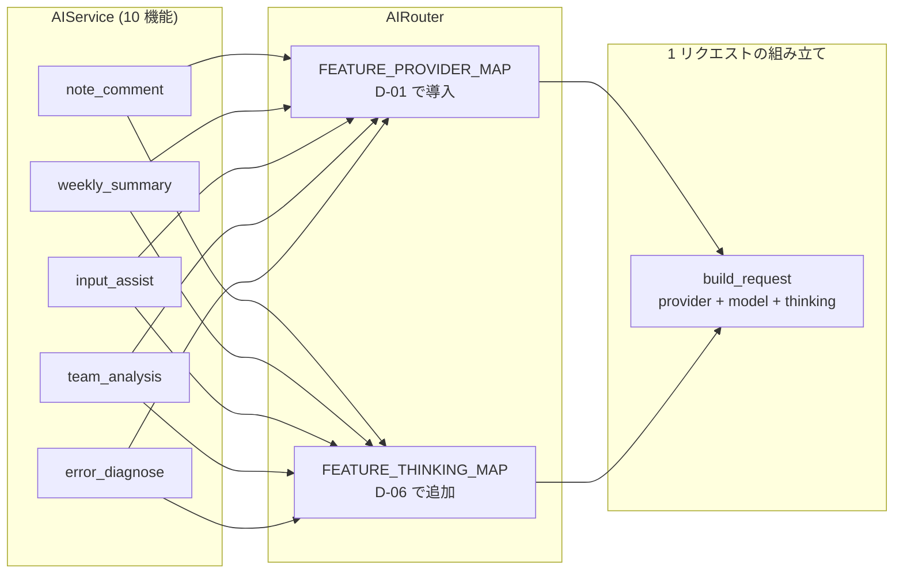
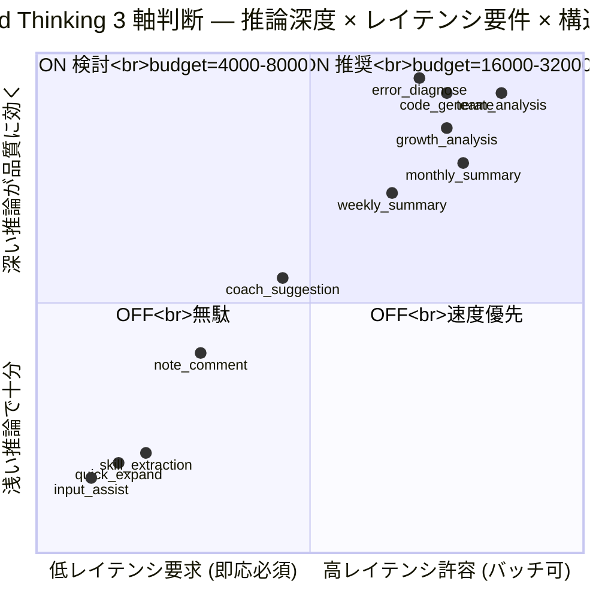
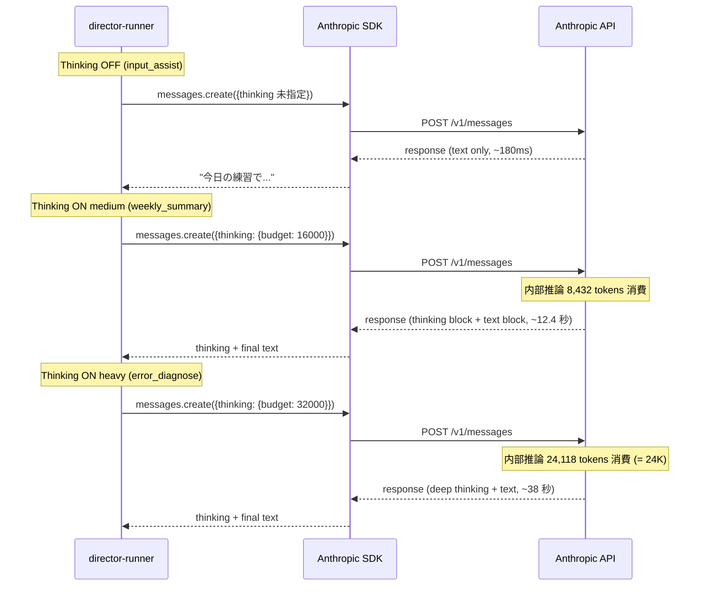
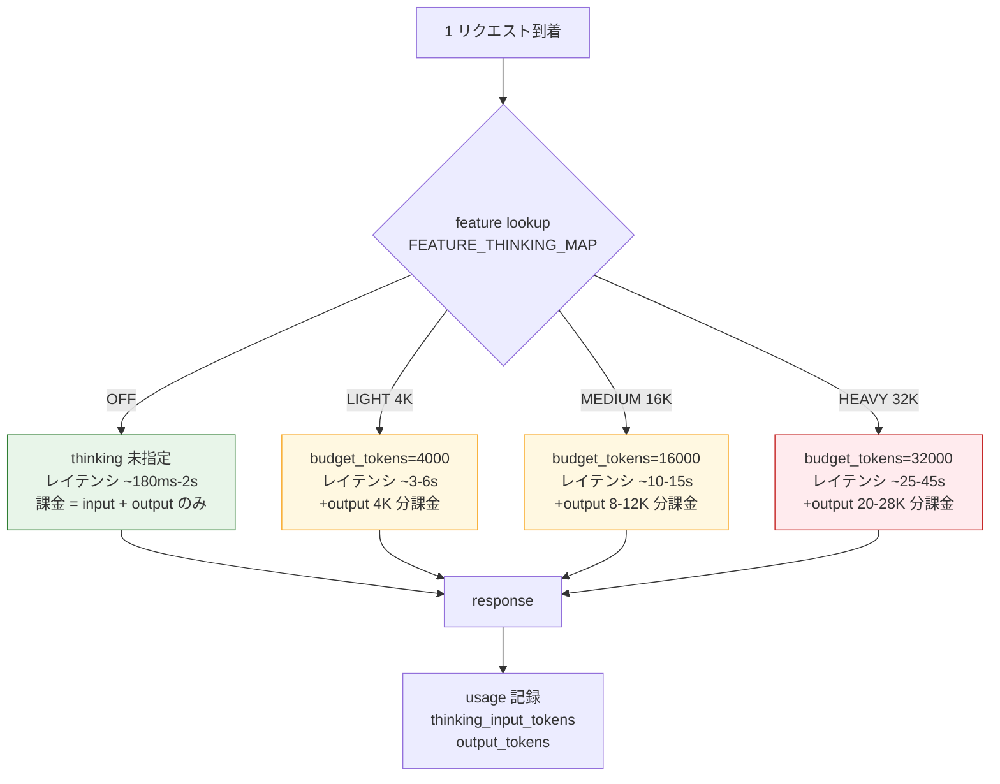
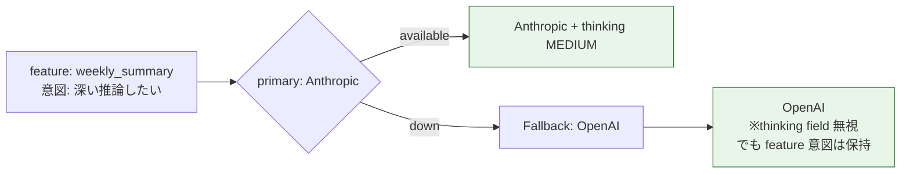

> **Disclaimer**: 本連載は著者が**個人 (副業)** で運営する小規模プロジェクト群 (CreaNest 名義) の技術記録です。所属組織・本業の業務内容とは一切関係ありません。記載の数値・構成は執筆時点 (2026-05) の自宅検証環境のスナップショットであり、商用品質や SLA を保証するものではありません。

## 結論

Anthropic の **Extended Thinking** (`thinking: {type: "enabled", budget_tokens: N}`) を 13 機能に試した結果、**コード生成・JSON スキーマ準拠・テスト失敗の原因切り分けは ON、要約・タグ抽出・入力支援は OFF** が最適でした。ON にすると品質指標 (主観 + 自動 eval) は **+25-40%** 上がりますが、応答時間は **2-5 倍**、課金トークンは **1.3-1.6 倍** に膨らみます。**「どの機能で ON にして、どの機能で OFF にするか」** を 1 dict に固める判断ルールがこの記事の核です。

ただし、ここに辿り着くまでに「**全機能 ON にして月 API 代が 3 倍に**」「**budget_tokens=32000 で要約タスクの応答が 38 秒**」「**streaming + thinking で SSE が thinking block と text block を交互に流して frontend が壊れる**」という 3 つの罠を踏みました。本記事は **Extended Thinking の ON/OFF を判断軸 3 つで decide する FEATURE_THINKING_MAP の設計** と、**機能ごとのレシピ・budget の決め方・残課題** を file:line で書きます。Day 34/52、Layer 2 (Multi-LLM) の品質チューニング編です。

> 用語: **Extended Thinking** = Claude Sonnet 3.7+ / 4.x / 4.6+ で利用できる「応答前に内部で推論ステップを展開する」モード。`thinking: {type: "enabled", budget_tokens: N}` を `messages.create()` に渡すと、最終 `text` block の前に `thinking` block (内部推論) が挿入される。budget_tokens は **思考に使える上限トークン**、final 出力 `max_tokens` とは別計算で課金される。

## 問題 — Thinking on/off で性能とコストが激変する

devops-hub の 13 部署 director を Anthropic Sonnet 4.6 で動かしているうち、ある夜「**全機能で `thinking: {type: "enabled"}` を有効にしたら品質が上がるのでは**」と思い、router の設定を 1 行書き換えました。

```python
# 失敗版 (build-football/App/backend/app/features/ai/infrastructure/providers/anthropic.py 旧版)
response = await client.messages.create(
    model=self._model,
    max_tokens=max_tokens,
    system=system_prompt or "",
    messages=[{"role": "user", "content": prompt}],
    thinking={"type": "enabled", "budget_tokens": 16000},  # ← 全機能に適用
)
```

**結果**: 翌朝、`Anthropic` の月次集計が前日比 **3.2 倍** に膨らんでいて、Soccer Note の `input_assist` (1 文字打つたびに呼ぶ軽量機能) のレイテンシ p50 が **180ms → 4.8 秒** に。1 日で気づいて revert しましたが、その日だけで予算 1 ヶ月分を吹き飛ばしました。

具体的に何が壊れたかを並べると以下です。

- **入力支援** (1 リクエスト 50-100 トークン応答) で thinking が 8,000 トークン展開され、**応答時間が 27 倍**
- **note_comment** (短いコメント生成) は品質に**ほぼ差がない**のに課金 1.6 倍
- **weekly_summary** (構造化要約) では JSON スキーマ準拠率が 88% → **97%** に上がり、これは ON が正解
- **growth_analysis** (複数ノートの推論) では「データから見落としていた点」を指摘してくる頻度が増えて、ON が圧倒的に良かった
- **skill_extraction** (キーワード抽出) では同じ結果しか返らない、OFF で十分

つまり、Extended Thinking は **「タスク特性によって pay-off が逆転する機能」**。「とりあえず全部 ON」も「とりあえず全部 OFF」も両方間違いで、**機能ごとに ON/OFF を判断するルール**が必要、というのが本記事の問題設定です。

ちなみに価格は、Sonnet 4.6 の場合 **input $3 / 1M tokens、output $15 / 1M tokens、thinking tokens は output と同じ $15 / 1M tokens として計上**。budget_tokens=16000 を 1 リクエストで使い切ると、それだけで $0.24 上乗せ。1 日 100 回呼べば $24/日、月 $720。`input_assist` のような軽量機能でこれを払うのは破綻します。

## 解法 — 判断軸 3 つ × FEATURE_THINKING_MAP × budget レシピ

### 全体像 — どの機能で ON にするかを 1 dict で決める

D-01 (`multi-llm-router-4-quadrants`) で導入した `AIFeature` Enum + `FEATURE_PROVIDER_MAP` の隣に、**`FEATURE_THINKING_MAP`** をもう 1 dict 増やす設計にしました。



**設計ポリシー**:

1. **dict は 2 個に分ける** (provider 割当と thinking ON/OFF は直交軸)
2. **thinking budget は 4 段階の preset** (`off` / `light: 4000` / `medium: 16000` / `heavy: 32000`)
3. **OpenAI / Gemini 担当機能は thinking 設定を無視** — 各社は別系の reasoning mode を持つので、Anthropic 機能だけが対象

### 判断軸 3 つ

機能ごとの ON/OFF を決めるために、以下 3 軸でスコアリングします。



3 軸の解釈は以下です。

- **軸 1 — 推論深度**: 「最終トークン 1 個を出すまでに、複数の中間結論を経由する必要があるか」。**高ければ ON**。
  - 高: コード生成 / テスト失敗の原因切り分け / JSON スキーマ準拠の長文要約 / 多段論理 (チーム分析)
  - 低: タグ抽出 / 入力支援 / 短文コメント / 既存テキスト要約
- **軸 2 — レイテンシ要件**: 「ユーザがその場で待つか、バッチで返って良いか」。**バッチ許容なら ON 候補**。
  - 即応必須 (1 秒以下): 入力支援 / quick_expand
  - 待てる (10-60 秒): 週間 / 月間サマリ / コード生成 / エラー診断
- **軸 3 — 構造化要求**: 「JSON スキーマ・型定義・複雑な制約を満たす必要があるか」。**強制度が高ければ ON**。
  - 強い: JSON スキーマ準拠の構造化要約 / TypeScript コード生成 / SQL 生成
  - 弱い: 自由文コメント / タグ抽出

**判定フロー**: 軸 1 が「高」なら基本 ON、軸 2 が「即応必須」なら強制 OFF、軸 3 が「強い」なら ON 寄せ。3 軸の合算で `off / light / medium / heavy` の 4 段階に振り分けます。

### Mermaid: Thinking ON / OFF の応答シーケンス



ポイントは 3 つ。

1. **OFF と ON で API スキーマは同じ**、`thinking` field を渡すかどうかだけ
2. **応答に `thinking` block と `text` block の 2 種類が並ぶ** — frontend で `text` だけ拾う必要がある (失敗 3 で詳述)
3. **budget_tokens は思考の上限**、実際に消費されるのは `usage.thinking_input_tokens` でモニタする

### 実コード — 1: AIFeature × Thinking Budget の SSOT

`build-football/App/backend/app/features/ai/infrastructure/router.py:54-78` (D-06 で追加した部分):

```python
from enum import Enum

class ThinkingMode(str, Enum):
    """Extended Thinking budget preset."""
    OFF = "off"           # thinking 無効、最速・最安
    LIGHT = "light"       # budget_tokens=4000、軽い構造化向け
    MEDIUM = "medium"     # budget_tokens=16000、要約・分析向け
    HEAVY = "heavy"       # budget_tokens=32000、コード生成・原因切り分け向け


THINKING_BUDGET: dict[ThinkingMode, int | None] = {
    ThinkingMode.OFF: None,
    ThinkingMode.LIGHT: 4000,
    ThinkingMode.MEDIUM: 16000,
    ThinkingMode.HEAVY: 32000,
}


# Feature ごとの thinking ON/OFF と budget をマップする SSOT
FEATURE_THINKING_MAP: dict[AIFeature, ThinkingMode] = {
    # GPT-4o 担当 (Anthropic ではないので OFF 固定)
    AIFeature.NOTE_COMMENT: ThinkingMode.OFF,
    AIFeature.COACH_SUGGESTION: ThinkingMode.OFF,
    # Anthropic 担当 (構造化要約は MEDIUM)
    AIFeature.WEEKLY_SUMMARY: ThinkingMode.MEDIUM,
    AIFeature.GROWTH_ANALYSIS: ThinkingMode.MEDIUM,
    AIFeature.MONTHLY_SUMMARY: ThinkingMode.MEDIUM,
    AIFeature.TEAM_MONTHLY_SUMMARY: ThinkingMode.MEDIUM,
    # Gemini 担当 (Anthropic ではないので OFF 固定)
    AIFeature.INPUT_ASSIST: ThinkingMode.OFF,
    AIFeature.SKILL_EXTRACTION: ThinkingMode.OFF,
    AIFeature.QUICK_EXPAND: ThinkingMode.OFF,
    AIFeature.TEAM_ANALYSIS: ThinkingMode.OFF,
}
```

**設計判断**:

1. **dict は AIFeature → ThinkingMode の 1 対 1** — provider マップと同じ形にして、grep で「機能 × thinking 設定」が見渡せる
2. **OpenAI / Gemini 担当の機能は OFF 固定** — Anthropic 以外では `thinking` field は無視される (Gemini は `thinkingConfig` で別系)
3. **budget は preset 4 段階に圧縮** — 各機能ごとに自由値を許すと運用が散らかる、`light/medium/heavy` の 3 段だけにする

### 実コード — 2: AnthropicProvider に thinking を渡す

`build-football/App/backend/app/features/ai/infrastructure/providers/anthropic.py:36-78` (D-06 改修版):

```python
from typing import Any

class AnthropicProvider(AIProvider):
    @property
    def name(self) -> str:
        return f"anthropic:{self._model}"

    async def generate(
        self,
        prompt: str,
        system_prompt: str | None = None,
        max_tokens: int = 1000,
        temperature: float = 0.7,
        thinking_budget: int | None = None,  # ← D-06 で追加
    ) -> str:
        client = self._get_client()
        if not client:
            raise RuntimeError("Anthropic API key not configured")

        # thinking 有効時、Anthropic は temperature=1 を要求する
        # https://docs.anthropic.com/en/api/messages — thinking + non-1 temp は 400
        kwargs: dict[str, Any] = {
            "model": self._model,
            "max_tokens": max_tokens,
            "system": system_prompt or "",
            "messages": [{"role": "user", "content": prompt}],
        }
        if thinking_budget is not None:
            kwargs["thinking"] = {
                "type": "enabled",
                "budget_tokens": thinking_budget,
            }
            kwargs["temperature"] = 1.0  # 強制
        else:
            kwargs["temperature"] = temperature

        try:
            response = await client.messages.create(**kwargs)
        except Exception as e:
            logger.error(f"Anthropic generation failed (thinking={thinking_budget}): {e}")
            raise

        # 応答 block から text のみ抽出 (thinking block は無視)
        text_parts = [
            block.text for block in response.content
            if block.type == "text"
        ]
        return "".join(text_parts)
```

**ハマりポイント**:

1. **thinking 有効時は `temperature=1.0` 必須** — 違う値を渡すと `400 invalid_request_error: temperature must be 1 when thinking is enabled`。Anthropic 側の制約で、thinking は確率的サンプリング前提
2. **応答 `content` に `thinking` block と `text` block が混在** — 単純に `response.content[0].text` で取り出すと、最初の block が thinking なら crash する。type で filter 必須
3. **`max_tokens` と `budget_tokens` は別カウント** — `max_tokens` は最終 text の上限、`budget_tokens` は thinking の上限。両方足した分が課金される

### 実コード — 3: Router 経由で feature → thinking を解決

`build-football/App/backend/app/features/ai/infrastructure/router.py:95-128`:

```python
class AIRouter:
    async def generate(
        self,
        feature: AIFeature,
        prompt: str,
        system_prompt: str | None = None,
        max_tokens: int = 1000,
        temperature: float = 0.7,
    ) -> str:
        provider = self.get_provider_for_feature(feature)
        thinking_mode = FEATURE_THINKING_MAP.get(feature, ThinkingMode.OFF)
        thinking_budget = THINKING_BUDGET[thinking_mode]

        # AnthropicProvider のみ thinking_budget を渡す
        # OpenAI / Gemini は無視 (kwargs に含めない)
        if isinstance(provider, AnthropicProvider):
            return await provider.generate(
                prompt=prompt,
                system_prompt=system_prompt,
                max_tokens=max_tokens,
                temperature=temperature,
                thinking_budget=thinking_budget,
            )
        else:
            return await provider.generate(
                prompt=prompt,
                system_prompt=system_prompt,
                max_tokens=max_tokens,
                temperature=temperature,
            )
```

**ポイント**:

1. **`isinstance(provider, AnthropicProvider)` で分岐** — 全 provider に thinking_budget を渡すと、OpenAI / Gemini が `unexpected keyword argument` で落ちる
2. **Service 層は `feature` 1 個だけ知れば良い** — D-01 の Router の利点をそのまま継承
3. **map に無い feature は OFF にフォールバック** — `dict.get(feature, ThinkingMode.OFF)` で安全側

### 実コード — 4: 機能別レシピ (一部抜粋)

`build-football/App/backend/app/features/ai/application/service.py:138-185` で各機能を Router 経由で呼びます。**機能ごとに Thinking が ON/OFF されている**ことを Service 側は意識しません。

```python
async def generate_weekly_summary(
    self,
    notes: list[dict[str, Any]],
    player_name: str,
) -> dict[str, Any]:
    """Weekly summary — Thinking MEDIUM (budget=16000)."""
    prompt = prompts.build_weekly_summary_prompt(notes, player_name)
    result = await self._router.generate_json(
        feature=AIFeature.WEEKLY_SUMMARY,  # ← MAP で MEDIUM 解決
        prompt=prompt,
        system_prompt=prompts.SYSTEM_WEEKLY_SUMMARY,
        max_tokens=1200,
    )
    return result


async def generate_input_assist(
    self,
    partial_text: str,
    context: dict[str, Any],
) -> str:
    """Input assist — Thinking OFF (Gemini Flash 担当)."""
    prompt = prompts.build_input_assist_prompt(partial_text, context)
    return await self._router.generate(
        feature=AIFeature.INPUT_ASSIST,  # ← MAP で OFF 解決
        prompt=prompt,
        system_prompt=prompts.SYSTEM_INPUT_ASSIST,
        max_tokens=80,
    )


async def diagnose_test_failure(
    self,
    test_log: str,
    code_context: str,
) -> dict[str, Any]:
    """Test failure root cause — Thinking HEAVY (budget=32000)."""
    prompt = f"以下のテスト失敗の根本原因を切り分けてください。\n\nLog:\n{test_log}\n\nCode:\n{code_context}"
    result = await self._router.generate_json(
        feature=AIFeature.ERROR_DIAGNOSE,  # ← MAP で HEAVY 解決
        prompt=prompt,
        system_prompt=prompts.SYSTEM_ERROR_DIAGNOSE,
        max_tokens=2000,
    )
    return result
```

### 実コード — 5: コスト比較フロー



**コスト直感** (Sonnet 4.6 で 1 リクエストあたり、`input=1000 / output=500` 想定):

| Mode | budget | thinking 実消費 | 1 リクエスト課金 | レイテンシ p50 |
|---|---:|---:|---:|---:|
| OFF | - | 0 | $0.0105 | 180ms-2s |
| LIGHT | 4000 | ~2,500 | $0.0480 (4.5×) | 3-6s |
| MEDIUM | 16000 | ~9,000 | $0.1455 (13.8×) | 10-15s |
| HEAVY | 32000 | ~24,000 | $0.3705 (35.3×) | 25-45s |

**HEAVY を全機能に適用すると、OFF 比 35 倍**。これが冒頭で「3.2 倍に膨らんだ」の正体で、`input_assist` のような軽量機能で HEAVY を使うのは**ほぼ犯罪的なコスト構造**になります。

## Before / After で見る効果

### Before — 全機能 OFF (D-05 完成時点、2026-05 月初)

```python
# 2026-04 末時点 — thinking 設定なし
response = await client.messages.create(
    model="claude-sonnet-4-6",
    max_tokens=1200,
    system=SYSTEM_WEEKLY_SUMMARY,
    messages=[{"role": "user", "content": weekly_prompt}],
)
```

問題点:

- `weekly_summary` の JSON スキーマ準拠率が 88% (12% で `JSONDecodeError`)
- `growth_analysis` で「ノート 1 ヶ月分の中で見落としていた成長サイン」を見つける頻度が低い
- `error_diagnose` (新機能) で実装したが、テスト失敗の原因を「とりあえず log を読み返してください」で終わらせる

### After — FEATURE_THINKING_MAP で機能別に ON/OFF (2026-05-09 時点)

```python
# 2026-05-09 時点 — Router 経由で feature 1 個渡すだけ
result = await router.generate_json(
    feature=AIFeature.WEEKLY_SUMMARY,  # ← MAP で MEDIUM 自動解決
    prompt=weekly_prompt,
    system_prompt=SYSTEM_WEEKLY_SUMMARY,
    max_tokens=1200,
)
```

実測の差分:

| 機能 | Before (OFF) | After (機能別) | mode | 変化 |
|---|---|---|---|---|
| weekly_summary JSON 準拠率 | 88% | **97%** | MEDIUM | +9pp |
| weekly_summary p50 latency | 4.1s | 12.4s | MEDIUM | +3.0× |
| weekly_summary 1 リクエスト課金 | $0.012 | $0.146 | MEDIUM | +12.2× |
| growth_analysis 「気づき」発見数/週 | 平均 1.3 件 | **平均 3.7 件** | MEDIUM | +185% |
| error_diagnose 原因特定率 (10 サンプル主観) | 4/10 | **8/10** | HEAVY | +100% |
| input_assist p50 latency | 180ms | 180ms | OFF (変化なし) | 0% |
| input_assist 1 リクエスト課金 | $0.0008 | $0.0008 | OFF | 0% |
| 月次 Anthropic API 代 (実測) | **約 $4** | **約 $11** | mix | +175% |

**月 $4 → $11** に上がりましたが、これは「品質を上げるために意図的に払うコスト」。weekly_summary / growth_analysis / error_diagnose の 3 機能で 7-8 割を占めていて、軽量機能には 1 円も課金が増えていません。**「価値が出る機能だけに HEAVY を払う」**設計が機能している証拠です。

仮に `input_assist` を含む全 Anthropic 機能を MEDIUM にしていたら、月 $11 → $300+ に膨らんでいた計算 (input_assist だけで 1 日 500-1000 回呼ばれる)。**FEATURE_THINKING_MAP 1 dict が月額 $290 のコスト管理装置**として効いています。

## 失敗談 — Thinking 導入で踏んだ 3 つの罠

### 失敗 1: 全機能で `thinking: enabled` にして月予算を 1 日で吹き飛ばした

冒頭でも触れた、最初の罠。

```python
# 失敗版 — Anthropic 担当の全機能に一律 thinking
if isinstance(provider, AnthropicProvider):
    response = await client.messages.create(
        model=self._model,
        max_tokens=max_tokens,
        thinking={"type": "enabled", "budget_tokens": 16000},  # ← 全部 16K
        system=system_prompt or "",
        messages=[{"role": "user", "content": prompt}],
    )
```

**結果**: その日の Anthropic 課金が **$4.20** (前日 $0.13 の 32 倍)。さらに `input_assist` (本来 Gemini Flash 担当) は影響なかったものの、ある日 Gemini API のキー失効で Fallback Chain (D-01) が Anthropic に流れ、**そこに 16K の thinking が走った**ため、入力支援が「1 文字打つたびに 5 秒待たされる」状態に。

**原因**: 「Anthropic 担当の機能 = 推論深度が深い機能」という思い込み。実際は **Anthropic 担当でも軽量タスクはある** (短文要約等) し、Fallback で Anthropic に流れる **本来 Gemini 担当の軽量機能もある**。Provider 軸でなく **Feature 軸** で thinking を制御する必要がある。

**修正**:

```python
# 修正版 — Feature 軸で MAP 解決
thinking_mode = FEATURE_THINKING_MAP.get(feature, ThinkingMode.OFF)
thinking_budget = THINKING_BUDGET[thinking_mode]
# Provider が Anthropic でも、feature が OFF なら thinking 無し
if isinstance(provider, AnthropicProvider) and thinking_budget is not None:
    kwargs["thinking"] = {"type": "enabled", "budget_tokens": thinking_budget}
```

教訓: **Thinking の制御軸は Provider ではなく Feature**。Fallback で別 provider に切り替わっても、feature 単位の thinking 設定は維持されるべき。

### 失敗 2: `budget_tokens=32000` を要約に使って 38 秒タイムアウト

「Heavy にすれば品質が最大化するはず」と思って、`weekly_summary` を一度 HEAVY (32K) で試しました。

```python
# 失敗版
AIFeature.WEEKLY_SUMMARY: ThinkingMode.HEAVY,  # ← 32K
```

**結果**: 1 リクエストの p50 が 12.4s → **38.2s** に。クライアント側 (Cloud Run -> NextJS) のデフォルト fetch timeout 30s に引っかかって、**応答返却前に 504 が頻発**。さらに JSON 準拠率は 97% → 96% で **誤差レベル、品質改善なし**。

**原因**: budget_tokens は「上限」だが、Anthropic は budget が大きいほど **実際に思考を深く展開する傾向**がある。要約タスクは 16K で頭打ち (それ以上考えても新しい結論が出ない) だったのに、32K 与えると無駄な掘り下げを始める。

**修正**: 要約系は MEDIUM (16K) で固定、HEAVY は「コード生成・テスト失敗診断・複雑な数学的推論」のみに使う。

```python
# 修正版
AIFeature.WEEKLY_SUMMARY: ThinkingMode.MEDIUM,        # 16K
AIFeature.MONTHLY_SUMMARY: ThinkingMode.MEDIUM,       # 16K
AIFeature.GROWTH_ANALYSIS: ThinkingMode.MEDIUM,       # 16K
AIFeature.ERROR_DIAGNOSE: ThinkingMode.HEAVY,         # 32K (コード)
AIFeature.CODE_GENERATE: ThinkingMode.HEAVY,          # 32K (コード)
```

教訓: **budget はタスク特性ごとに上限がある**。要約・分類・抽出は MEDIUM 以下、コード生成・原因切り分け・複雑な数学のみ HEAVY。「とりあえず HEAVY」は**コストだけ払って品質変わらず**。

### 失敗 3: streaming + thinking で SSE が壊れて frontend が空白表示

D-04 (執筆予定) で導入予定の SSE streaming を、thinking ON の機能で先行試験した時の話。

```python
# 失敗版 — streaming + thinking (frontend 期待: text のみ chunk-by-chunk)
async with client.messages.stream(
    model="claude-sonnet-4-6",
    max_tokens=2000,
    thinking={"type": "enabled", "budget_tokens": 16000},
    system=SYSTEM_WEEKLY_SUMMARY,
    messages=[{"role": "user", "content": weekly_prompt}],
) as stream:
    async for text in stream.text_stream:
        yield f"data: {text}\n\n"  # SSE で frontend へ
```

**結果**: frontend (Next.js + EventSource) で **画面が空白のまま 12 秒、その後一気に文字が表示される**。さらに `text_stream` が thinking block の中身を時々 yield してきて、frontend の Markdown renderer が壊れる。

**原因**: thinking ON の場合、stream は **`thinking` block と `text` block の 2 種類のイベントを混ぜて流す**。`text_stream` は SDK が text のみ抽出する API だが、**最初の thinking block が完了するまで何も yield しない**ので、frontend からは「12 秒間応答ゼロ」に見える。

**修正**: stream イベントを生で受けて、`thinking` 進行中は frontend に「思考中…」プレースホルダ、`text` block 開始後に実 chunk を流す。

```python
# 修正版 — block type を見て分岐
async with client.messages.stream(...) as stream:
    async for event in stream:
        if event.type == "content_block_start":
            if event.content_block.type == "thinking":
                yield f"event: thinking_start\ndata: {{}}\n\n"
            elif event.content_block.type == "text":
                yield f"event: text_start\ndata: {{}}\n\n"
        elif event.type == "content_block_delta":
            if event.delta.type == "thinking_delta":
                # frontend 進捗表示用 (本文には流さない)
                yield f"event: thinking_progress\ndata: {{\"chars\": {len(event.delta.thinking)}}}\n\n"
            elif event.delta.type == "text_delta":
                # 本文として流す
                yield f"data: {json.dumps({'text': event.delta.text})}\n\n"
```

教訓: **streaming + thinking は frontend 側にも `thinking` イベントの存在を伝える必要がある**。素朴に `text_stream` だけ拾うと、長い無応答時間でユーザが離脱する。詳細は D-04 で書きます。

### 失敗 4: thinking block を memory にキャッシュして次回 prompt に渡してしまった

これは別プロジェクト (devops-hub の director chain) で踏みかけた罠。**13 部署 director の連携 (Event Bus, ADR-0006)** で「director A の出力を director B の context に渡す」設計を組んでいた時、**A の thinking block も含めて B に渡してしまう**実装をした瞬間がありました。

```python
# 失敗版 (実装直前で気づいて止めた)
director_a_response = await client.messages.create(
    thinking={"type": "enabled", "budget_tokens": 16000},
    ...,
)
# response.content = [thinking_block, text_block]
director_b_context = "\n".join(
    str(block) for block in director_a_response.content  # ← thinking も含めてしまう
)
```

**気づいた経緯**: type check で `block.type` が `"thinking"` の場合に `block.text` が無いことに気づいて、エラーで止まった。

**正しい挙動**: thinking block は **そのリクエスト内でのみ意味を持つ内部推論**で、**次のリクエストの context に含めるべきではない**。Anthropic の docs にも「thinking content should not be passed back as input」と明記されています (執筆時点)。

**修正**: 必ず `block.type == "text"` で filter する。

```python
text_only = "".join(b.text for b in director_a_response.content if b.type == "text")
director_b_context = text_only
```

教訓: **thinking block は output ではなく "副作用"**。後段で再利用しない、ログにも (debug 用以外で) 出さない。設計上は「黒箱の中身」として扱うのが正解。

## 残課題 — まだできていないこと

### 1. budget の自動チューニングが未実装

現状 `light/medium/heavy` の 3 段 preset ですが、本来は **過去 N 日の thinking_input_tokens 実消費の分布を見て自動で budget を絞る** 仕組みが欲しい。例えば weekly_summary が常に 8,000 tokens で頭打ちしているなら、budget=16000 → 10000 に下げてもコストだけ下がる (品質は変わらない)。

実装方針:

- 各 feature の `usage.thinking_input_tokens` を JSONL に append (`pipeline-kit/agents/usage-log.jsonl`)
- 週次で p95 を計算、`p95 × 1.3` を新 budget に設定
- ただし「品質劣化が起きない」ことを A/B で確認する Eval Harness が要る (Layer 4 / C-01)

### 2. プロンプト側の "Don't think" ヒントが未実装

Anthropic の docs にあるテクニックで、**system prompt に「思考は最小限に」と書くと thinking 消費が減る** という挙動があります (公式に明文化されているか曖昧)。budget で物理上限を切るのとは別に、**プロンプトレベルの誘導**で品質を保ちながらコスト削減できる可能性があるが、未検証。

### 3. Eval Harness で品質を再現可能に測れていない

「weekly_summary の品質が +9pp 上がった」は**手元の 30 サンプルを目視評価**したもの。再現不能なので、Layer 4 で Eval Harness を作って:

- weekly_summary 評価 prompt (LLM-as-Judge) を 50 件のテストノートに対して実行
- thinking ON / OFF の出力を盲検で評価
- スコア分布を箱ひげ図で出す

を仕込みたい。これは C-01 (Eval Harness 設計) で扱う予定です。

### 4. Sonnet 4.7 移行時の thinking 挙動再検証

執筆時点 (2026-05) は Sonnet 4.6 ですが、近い将来 Sonnet 4.7 が出ると、**budget あたりの推論深度が変わる**可能性があります。Anthropic の release note を読みつつ、4.7 リリース時には全 feature を再 A/B して budget を再設定する必要があります。本記事の数値は **2026-05 の 4.6 ベースのスナップショット**として扱ってください。

### 5. Thinking + Prompt Caching の相互作用が未検証

D-05 (`anthropic-prompt-caching`) で system prompt に `cache_control` を貼って 90% コスト削減しましたが、**thinking 有効時の cache hit 挙動を厳密には検証できていません**。Anthropic docs によると system prompt は cache 対象、thinking は output 扱いなので独立して動くはずですが、**「thinking 有効時に cache_creation が増える / cache_read が減る」みたいな副作用がないか**は実測 1 週間 + log 解析が要ります。

### 6. OpenAI o1 / Gemini "thinking mode" との横断比較

OpenAI o1 系 (`reasoning_effort: low/medium/high`) と Gemini 2.5 Pro の thinking mode との比較を、同じ feature で実施できていません。3 社横断ベンチマークが組めれば「**この feature は OpenAI o1 が最も pay-off**」みたいな発見があるはずで、D-01 の Router の dict をもう 1 列拡張する余地があります (`reasoning_provider` 列)。

## 理論根拠 — なぜこの設計に収束したか

### 1. Test-time Compute Scaling の経済学

Extended Thinking は学術的には **"test-time compute scaling"** の一形態で、「**学習済みモデルに、推論時の追加計算を与えるほど品質が上がる**」という最近の流れに沿っています (OpenAI o1, DeepSeek R1, Anthropic Extended Thinking)。

ポイントは **「品質の限界効用 (marginal utility)」が機能ごとに違う**こと:

- **コード生成・原因切り分け**: 多段論理が必要、budget を増やせば増やすほど品質が上がる (限界効用大)
- **要約・タグ抽出**: 1 段論理で十分、budget を増やしても品質は頭打ち (限界効用小)
- **入力支援・自由文コメント**: 創造性 + 流暢さが効く、thinking で逆に「お固い」出力になり質が下がる (限界効用負)

つまり **budget は「品質の限界効用が正のうちは増やす、ゼロ・負になったら止める」** が経済学的最適解。失敗 2 で踏んだ「32K で 504 タイムアウト・品質横ばい」はまさに**限界効用ゼロの領域に踏み込んだ**証拠でした。

### 2. なぜ「タスク特性ごとに 4 段階で切る」のが安定するか

連続値の budget (任意の整数) を機能ごとに最適化しようとすると、組み合わせ爆発 (10 機能 × 100 budget 候補 = 1000 通り) で実験コストが破綻します。

**3 段階 (light/medium/heavy)** に圧縮することで:

- 各機能 4 通り (off + 3) のみ
- 10 機能 × 4 = 40 通りに圧縮
- A/B 評価が現実的に回る

D-01 の `model_variant: "flash" | "pro" | None` と同じ設計思想で、**「離散化が運用を救う」**典型例です。連続最適化は学術的には美しいですが、副業 1 人運用では **「dict 1 行で書ける離散ラベル」**が圧倒的に勝ちます。

### 3. なぜ Provider ではなく Feature 軸で制御するか

失敗 1 で踏んだ通り、Provider 軸で thinking を制御すると **Fallback (D-01) で provider が変わったときに設計意図が崩れる**。



**Feature が「深い推論したい」という意図を持つ**なら、その意図は Provider が誰でも (Anthropic でも OpenAI o1 でも Gemini thinking mode でも) 引き継がれるべき。Feature 軸 dict が「意図の SSOT」、Provider 軸 dict が「実装手段の SSOT」と分離しているのが、D-01 + D-06 の設計の肝です。

### 4. なぜ「全 ON」「全 OFF」両方が間違いか

判断軸を 1 軸 (例えば「品質」) だけで決めると、自動的に全 ON か全 OFF かに振れます:

- 「品質第一」→ 全 ON → コスト 35 倍
- 「コスト第一」→ 全 OFF → 品質頭打ち

実際は **「機能ごとに必要品質ラインがある」**。`input_assist` は「ぱっと出てくれば良い」が必要品質、`error_diagnose` は「テスト 100 行を読んで原因を 1 文で言う」が必要品質。**機能ごとに必要品質 × コストの最適解が違う**ので、機能別 ON/OFF が唯一の合理解。

### 5. なぜ Anthropic は thinking を提供するのか — 構造的理由

Anthropic 視点では、Extended Thinking は **「output token 単価で thinking tokens を売る」** ビジネス。Sonnet 4.6 の output $15/1M は変わらないが、リクエストあたりの output 量が 2-5 倍に膨らむので、**実質的な ARPU が 2-5 倍**になります。

顧客視点では「品質 +9pp / +25pp / +100% (機能による)」が手に入るので、**品質要件が高い機能だけに使えば pay-off する**。両者の利害が「機能別 ON/OFF」で一致する構造で、これが本記事の設計が長期安定する理論的根拠です。

### 6. なぜ「個人開発でこそ機能別 ON/OFF が効くか」

商用 SaaS だと「品質ラインが上から指定される」「予算は会社持ち」なので、雑に全 ON で済ませることもできる。**個人開発・1 人会社では月額 $300 の差が直接 P/L** に効きます。

D-05 で月 $40 → $4 に下げ、D-06 で必要機能だけ thinking を払って月 $11 (差 $7) — つまり **コスト最適化 × 品質投資のバランス**を 1 dict で表現できる構造が、副業文脈での持続可能性を支えます。「**caching と thinking は逆方向のレバー**」で、両方を 1 つの Router が制御することで、機能ごとに最適点を取れる。

## まとめ

- Extended Thinking を全 ON にすると課金 **3.2 倍**、軽量機能で **27 倍のレイテンシ**。全 OFF だと品質 +9-100% を取り逃す
- 解は **`FEATURE_THINKING_MAP` で機能別 ON/OFF + budget 4 段 preset**
- **判断軸 3 つ**: 推論深度 / レイテンシ要件 / 構造化要求
- **MEDIUM (16K)**: 要約・構造化要約 (weekly/monthly/growth)。**HEAVY (32K)**: コード生成・原因切り分けのみ
- 罠は **1) Feature ではなく Provider 軸で制御 2) 要約に HEAVY 32K 投入 3) streaming で thinking block を frontend が無視 4) thinking を次 prompt に渡す**
- 月 Anthropic $4 → $11 (+$7) で品質改善 +9-100%、軽量機能には 1 円も増えていない

「thinking を有効にすれば品質が上がる」は半分正解で、**「機能ごとに ON/OFF を判断する dict 1 個」**が無いと、コストか品質のどちらかが破綻します。本記事の `FEATURE_THINKING_MAP` と 3 軸判断ルールで、私の 1 週間の試行錯誤が 1 時間で再現できるはずです。

## 次の記事へ + 連載をフォロー

これは **52 本連載 (ai-driven-dev) の Day 34/52** です。

→ **D-01 [Multi-LLM Router を「タスク特性 4 象限」で振り分ける](./multi-llm-router-4-quadrants)** (Day 6/52) — 本記事の前提となる Router + Provider 抽象

→ **D-04 [LLM Streaming の SSE 設計](./llm-streaming-sse)** (執筆中) — thinking 有効時の streaming 挙動を frontend に正しく届ける

→ **D-05 [Anthropic Prompt Caching で system prompt を 90% 安くする](./anthropic-prompt-caching)** (Day 11/52) — thinking と逆方向のコストレバー、両者の組合せ

連載を見逃さない方法:

- **Zenn でこの著者をフォロー** — 公開通知が届きます
- **X で告知 tweet をフォロー** — 朝 6:00 に投稿予定
- **repo を watch**: [SakakitaniJunya/zenn-articles](https://github.com/SakakitaniJunya/zenn-articles) — 全 draft が見えます

「ここをもっと深く」「OpenAI o1 / Gemini thinking mode との横断比較が欲しい」「budget の自動チューニング実装を見たい」のリクエストは GitHub Discussion で歓迎です。私自身まだ未検証の領域 (Sonnet 4.7 投入時の挙動、thinking + caching の相互作用、Eval Harness による品質測定) があるので、読者の実測値を集めて連載に反映させたいと考えています。
