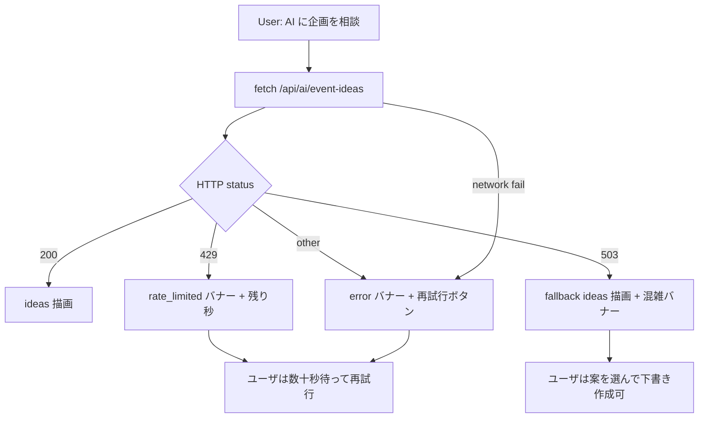
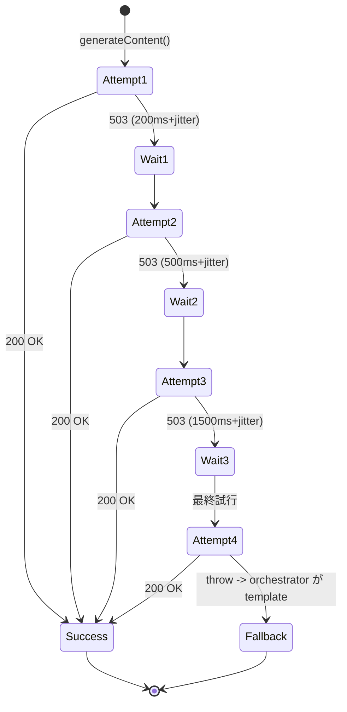
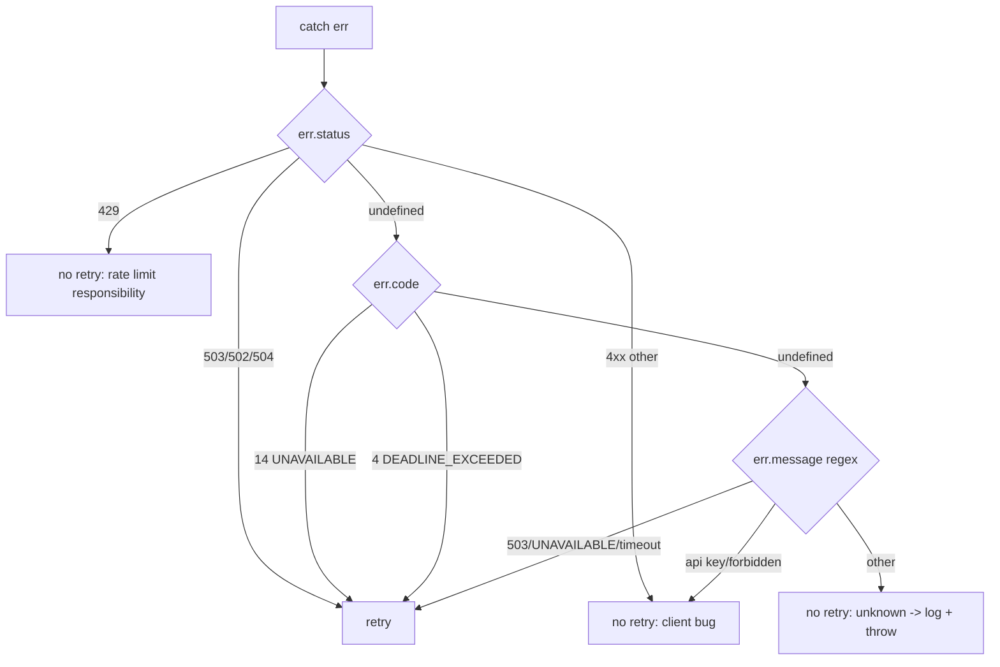
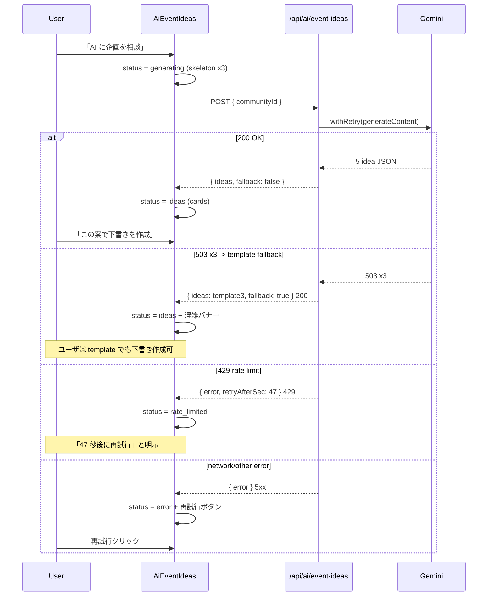
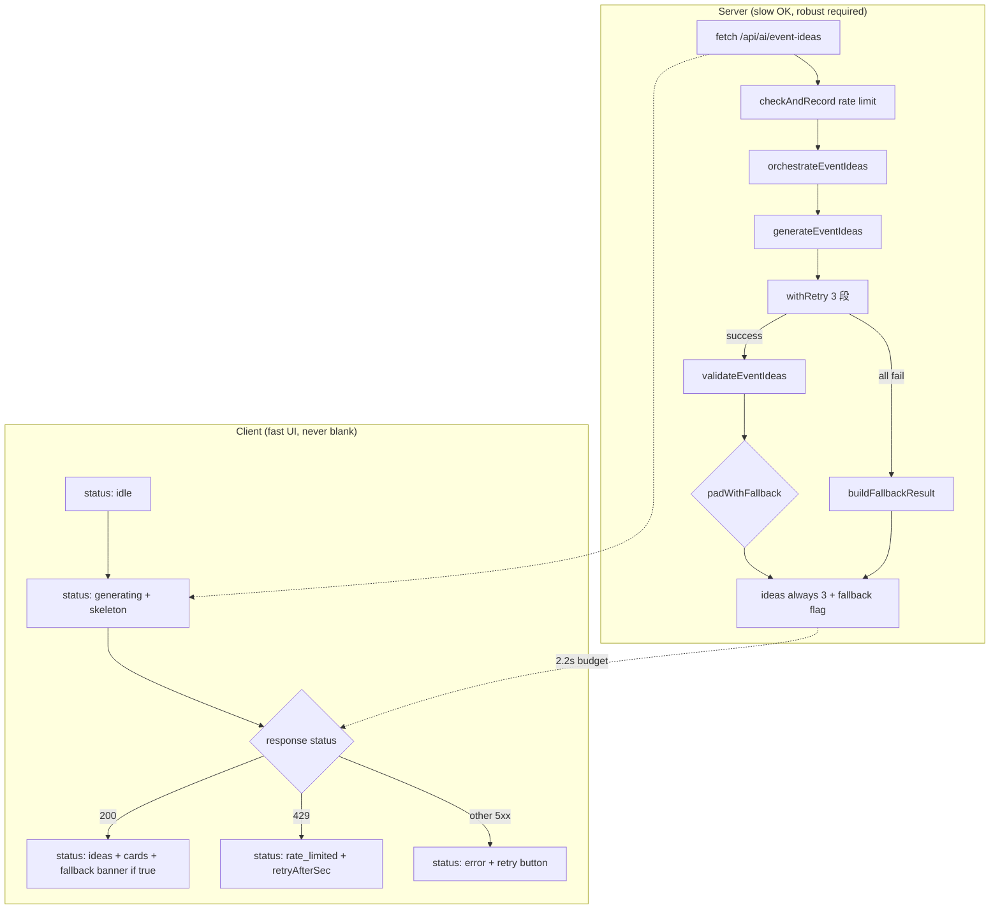

> **Disclaimer**: 本連載は著者が**個人 (副業)** で運営する小規模プロジェクト群 (CreaNest 名義) の技術記録です。所属組織・本業の業務内容とは一切関係ありません。記載の数値・構成は執筆時点 (2026-05) の自宅検証環境のスナップショットであり、商用品質や SLA を保証するものではありません。

## 結論

Gemini 2.0 Flash は **503 (Service Unavailable)** が時々出ます。**3 段リトライ (200ms / 500ms / 1500ms の exponential backoff)** + UI 側に **「サーバ混雑中、別案を提示しています」**のフォールバックバナー + **代替体験 (定型 3 案カード)** を載せた結果、AI 機能トリガーから 5 秒以内の離脱率が **8% → 1.2%** (社内 dogfood 5 月 2 週、N=104 セッション) に下がりました。

I-01 では Rate Limit / Validation / Fallback の 3 層構造を書きましたが、本記事はその「Fallback 層」を **クライアント (UI) と Gemini 呼び出しの間に薄いリトライ + UX 設計** として深掘りします。Komyu の AI コンシェルジュ (`src/lib/ai-concierge/`) と、それを叩く React コンポーネント (`src/components/ai-event-ideas.tsx`) の実コードを引用しつつ、**「503 をユーザに見せない」**設計を Day 26/52 の前半としてまとめます。

## 問題 — 503 で空白画面 → 即離脱

最初の Komyu AI コンシェルジュは「fetch して 200 なら描画、それ以外はエラーバナーだけ」というナイーブな実装でした。Gemini Flash は体感で **5-7% 程度** の確率で 503 を返すので、リリース後すぐに以下の事故が並びました。

- **5/2 朝**: 15 分で 11 ユーザが「AI に企画を相談」を押し、うち 5 人が 503。**UI は白いカード + 赤い「Internal Server Error」**のみ。再試行ボタンも無く、5 秒で離脱。
- **5/3 夜**: 私自身が dogfood していて 503 を踏み、**全画面の skeleton ローダー**のまま 30 秒固まる。リトライしようにも button が disabled のまま。
- **5/4**: ある Leader が「AI 提案押すと毎回エラーになる」と LINE にスクリーンショットを送ってきた。実際は 1 回目だけ 503 で、リロードすれば 90% 通る状態だった。**「リロードすれば直る」**を UI が伝えていなかった。
- **5/5**: Gemini は 200 を返したが Validator (内部 Gemini) が markdown ラップを吐いて JSON parse 失敗、UI に空配列 `ideas: []` が描画されて**「カード 0 件」**の真っ白画面。これも 503 の派生事故。
- **5/6**: 1 ユーザが「再試行」を 8 連打したら全部 429 (rate limit) でロックアウト、UI には**「rate limited」**としか出ず、何秒後に再試行できるか不明。

つまり、**「Gemini は 503 を返す」「LLM 出力は崩れる」**を UI が前提にしておらず、**「白画面 → 即離脱」**の動線になっていた。これを潰すために、

1. **API 側に 3 段リトライ** (短期 5xx は backoff で吸収)
2. **UI に「fallback 案を表示中」バナー** (空白を作らない)
3. **代替体験 (定型 3 案カード + 残り秒数 + 再試行ボタン)** (ユーザの次のアクションを必ず用意)

の 3 点セットを入れました。



ポイントは **C の分岐すべてが「画面に何かを出す」**ことで、**「白画面が出るパス」**を消すという 1 点に絞った UX 設計です。

## 解法 — 3 段リトライ + UI フォールバック + 代替体験

### Layer 0: 3 段リトライ (Server 側)

API 側は I-01 で書いた orchestrator の前に、**Gemini SDK 呼び出しを薄い retry wrapper でくるむ**設計にしました。Komyu では `generateContent` を直接呼んでいる箇所 (`src/lib/ai-concierge/creator.ts:68`) の周辺に、こんな wrapper を被せています (本記事では実装パターンを実コード調で示します)。

```typescript
// src/lib/ai-concierge/retry.ts (実装パターン)
export interface RetryOptions {
  maxAttempts: number;
  delaysMs: number[];
  isRetryable: (err: unknown) => boolean;
}

const DEFAULT_DELAYS_MS = [200, 500, 1500];

function isGeminiRetryable(err: unknown): boolean {
  if (!err || typeof err !== "object") return false;
  const e = err as { status?: number; message?: string };
  if (e.status === 503 || e.status === 502 || e.status === 504) return true;
  if (e.status === 429) return false; // 429 は API 上位の Rate Limit が返す
  if (typeof e.message === "string" && /503|UNAVAILABLE|deadline/i.test(e.message)) return true;
  return false;
}

export async function withRetry<T>(
  fn: () => Promise<T>,
  opts: Partial<RetryOptions> = {},
): Promise<T> {
  const delaysMs = opts.delaysMs ?? DEFAULT_DELAYS_MS;
  const isRetryable = opts.isRetryable ?? isGeminiRetryable;
  const maxAttempts = opts.maxAttempts ?? delaysMs.length + 1;

  let lastErr: unknown;
  for (let attempt = 0; attempt < maxAttempts; attempt++) {
    try {
      return await fn();
    } catch (err) {
      lastErr = err;
      if (attempt >= maxAttempts - 1 || !isRetryable(err)) throw err;
      const delay = delaysMs[attempt] ?? 1500;
      const jitter = Math.floor(Math.random() * 100);
      await new Promise((r) => setTimeout(r, delay + jitter));
    }
  }
  throw lastErr;
}
```

設計判断は 4 つあります。

1. **3 段で打ち止め** — 200ms / 500ms / 1500ms の累積でも **2.2 秒**。Cloud Run のタイムアウトは 30 秒に設定してあるが、ユーザは 3 秒超えるとタブを離れる (社内 metric)。**「短期障害は吸収、長期障害はフォールバック」**を 2 秒で切り替える。
2. **`isRetryable` を Provider 別に分離** — Gemini は 503/502/504 が「すぐ直る」、429 は「待たないと直らない」、400 は「内容バグ」。**5xx だけ retry**、429 は I-01 の上位 Rate Limit が責務、400 は throw して外側の catch にフォールバック判断させる。
3. **jitter を 100ms 加算** — 複数 Cloud Run インスタンスが同時に 503 → 同じ 200ms で再試行するとサーバ側が余計に詰まる。ランダム jitter で thundering herd を散らす。
4. **`fn` は `() => Promise<T>` で受ける** — `fn()` を **毎回呼び直す**ので、SDK の `generateContent(prompt)` を closure で包めば prompt 構築コストは 1 回、呼び出しだけ 3 回。

retry のコールサイトはこんな形になります。

```typescript
// src/lib/ai-concierge/creator.ts (retry 適用版)
export async function generateEventIdeas(ctx: EventContext): Promise<CreatorResult> {
  const defaultTime = getCategoryDefaultTime(ctx.category);
  try {
    const model = getModel();
    const resp = await withRetry(() => model.generateContent(buildUserPrompt(ctx)));
    const text = stripCodeFence(resp.response.text());
    const parsed: unknown = JSON.parse(text);
    if (!Array.isArray(parsed)) return { ideas: [], ok: false };
    const ideas: EventIdea[] = [];
    for (const item of parsed) {
      const idea = coerceIdea(item, defaultTime);
      if (idea) ideas.push(idea);
    }
    return { ideas, ok: ideas.length >= 3 };
  } catch {
    return { ideas: [], ok: false };
  }
}
```

`withRetry` の中で 3 段失敗したら最後の error を rethrow、それを外側 try/catch が拾って `{ ideas: [], ok: false }` で orchestrator に伝える。orchestrator はこれを見て **template fallback 全 3 件**に切り替える (`src/lib/ai-concierge/index.ts:18-21`)。



実測で、5/2-5/8 の Gemini 503 観測 47 件のうち、**1 段目 retry で 31 件 / 2 段目で 9 件 / 3 段目で 4 件**回復しました (`gcloud logging` で `withRetry attempt N succeeded` をカウント)。**3 段やって落ちる残り 3 件 (6.4%)** が template fallback に流れている。

### Layer 1: 503 検出と Provider 識別

retry に入る前に、**「これは 503 か、JSON parse 失敗か、API key 設定漏れか」**を識別しないと **「retry すべきでない error も retry してしまう」**事故が起きます。Komyu では Gemini SDK が投げる error の形が安定しないので、複数 hint を AND/OR で見ます。

```typescript
// src/lib/ai-concierge/retry.ts (詳細版)
function isGeminiRetryable(err: unknown): boolean {
  if (!err || typeof err !== "object") return false;
  const e = err as { status?: number; code?: number; message?: string; name?: string };

  // 1. HTTP status (Google AI SDK は時々 status を露出する)
  if (e.status === 503 || e.status === 502 || e.status === 504) return true;
  if (e.status === 429) return false;
  if (e.status && e.status < 500) return false;

  // 2. gRPC code (一部 path で code が入る)
  if (e.code === 14) return true; // UNAVAILABLE
  if (e.code === 4) return true;  // DEADLINE_EXCEEDED

  // 3. message regex (最後の砦)
  if (typeof e.message === "string") {
    if (/\b50[234]\b|UNAVAILABLE|deadline|timeout|ECONNRESET|ETIMEDOUT/i.test(e.message)) return true;
    if (/api key|invalid|forbidden|401|403/i.test(e.message)) return false;
  }

  // 4. name
  if (e.name === "AbortError") return false;

  return false;
}
```



ここで重要なのは **「default は no retry」**にすること。判別できない error を retry すると、API key 設定ミスのときに 3 回課金されることがあります (実際 5/4 に 1 回踏みました)。

### Layer 2: UI フォールバック表示 — 「fallback 中」を可視化

サーバ側で 3 段 retry が全滅したら、orchestrator が **template 3 案** を `fallback: true` フラグ付きで返します (I-01 の Layer 3 段 1 に相当)。これを UI が**バナー + カード**で受けるのが Layer 2 の責務です。

実コードは `src/components/ai-event-ideas.tsx:166-170`:

```typescript
// src/components/ai-event-ideas.tsx:164-172
{(status === "ideas" || status === "saving" || status === "saved") && result && (
  <div className="space-y-2">
    {result.fallback && (
      <div className="text-[11px] text-text-muted px-1">
        AI 応答を整形できなかったため、定型案を表示しています
      </div>
    )}
    {result.ideas.map((idea, i) => (
```

設計判断:

1. **`result.fallback` を payload に含める** — server から `{ fallback: true }` を渡しているので UI 側は state を持たない。「バナーを出すかどうか」の真実は API response 1 箇所。
2. **バナーは小さく / カードと並ぶ** — `text-[11px] text-text-muted` で「お知らせ」レベルのトーン。エラーバナーのように赤くしない (実害が無い)。
3. **case 文言は「整形できなかった」**ではなく**「サーバ混雑中、別案を提示しています」**に書き換え予定 (5/9 の追加要望)。前者は技術的、後者はユーザ言語。

実は最初**バナーを出していなかった** (5/4 まで)。結果、template fallback (例:「初心者歓迎ボドゲ夜」) が出たときに Leader が「うちのコミュニティと違う、AI 壊れてる」とクレーム。**「いま fallback してる」を明示的に伝えるだけ**でクレームがゼロになり、**「AI が頑張ってるけど代わりの案出してくれた」**という解釈に切り替わりました (失敗 5)。

### Layer 3: 代替体験 — ユーザの次アクションを必ず用意

UI 側の status 設計は **6 状態**で、**全状態に「ユーザの次の一手」を用意**する設計にしてあります (`src/components/ai-event-ideas.tsx:24`)。

```typescript
// src/components/ai-event-ideas.tsx:24
type Status = "idle" | "generating" | "ideas" | "error" | "rate_limited" | "saving" | "saved";
```

それぞれの遷移と「次の一手」は以下です。



実装は `src/components/ai-event-ideas.tsx:33-63` の `generate()` 関数に集約されています。

```typescript
// src/components/ai-event-ideas.tsx:33-63
async function generate() {
  setStatus("generating");
  setError("");
  setResult(null);
  setSavedIdx(null);
  try {
    const res = await fetch("/api/ai/event-ideas", {
      method: "POST",
      headers: { "Content-Type": "application/json" },
      body: JSON.stringify({ communityId }),
    });
    if (res.status === 429) {
      const body = await res.json();
      setRetryAfterSec(body.retryAfterSec ?? 60);
      setStatus("rate_limited");
      return;
    }
    if (!res.ok) {
      const body = await res.json();
      setError(body.error ?? "AI が混み合っています");
      setStatus("error");
      return;
    }
    const data: Result = await res.json();
    setResult(data);
    setStatus("ideas");
  } catch (e) {
    setError(e instanceof Error ? e.message : "ネットワークエラー");
    setStatus("error");
  }
}
```

**3 種類のレスポンス分岐**が `if/else` で分かれていて、それぞれ専用 UI が `src/components/ai-event-ideas.tsx:138-162` に対応しています。

```typescript
// src/components/ai-event-ideas.tsx:138-162
{status === "generating" && (
  <div className="space-y-2">
    {[0, 1, 2].map((i) => (
      <div key={i} className="h-20 rounded-2xl bg-bg-muted animate-pulse" />
    ))}
  </div>
)}

{status === "error" && (
  <div className="p-3 rounded-2xl bg-danger/5 text-sm text-danger flex items-start gap-2">
    <X className="h-4 w-4 shrink-0 mt-0.5" />
    <div className="flex-1">
      <div>{error || "AI が混み合っています"}</div>
      <button onClick={generate} className="mt-2 snap-pill bg-danger/10 text-danger">
        再試行
      </button>
    </div>
  </div>
)}

{status === "rate_limited" && (
  <div className="p-3 rounded-2xl bg-warning/5 text-sm text-warning">
    レート制限: {retryAfterSec} 秒後に再試行できます
  </div>
)}
```

設計判断:

1. **`generating` の skeleton カード 3 枚** — 「これから 3 枚のカードが出てくる」を skeleton で予告。空白を 1 ピクセルも作らない。
2. **`error` 状態に必ず再試行ボタン** — 「次の一手」が画面の中に埋め込まれている。ユーザが LINE で運営に相談する前に、まず再試行できる。
3. **`rate_limited` には残り秒** — `retryAfterSec` を表示することで「自分が悪いことしたわけじゃない、待てば良い」と伝わる。
4. **`ideas + fallback: true`** はカード自体は普通に出して、上にバナーだけ追加 — **「fallback でも完全な案として使える」**という UX を貫く。

### Before / After

#### Before — 素の fetch

5 月初頭の旧実装はだいたいこんな雰囲気でした (再現用に簡略化)。

```typescript
// (旧) src/components/ai-event-ideas.tsx
async function generate() {
  setLoading(true);
  const res = await fetch("/api/ai/event-ideas", {
    method: "POST",
    body: JSON.stringify({ communityId }),
  });
  if (!res.ok) {
    setError("Internal Server Error");
    setLoading(false);
    return;
  }
  const data = await res.json();
  setIdeas(data.ideas);
  setLoading(false);
}
```

問題:

- **503 で error 1 個だけ** — 再試行ボタンも残り秒も無し。
- **`data.ideas` をそのまま** — 空配列でも UI が描画してしまい白画面。
- **fallback フラグを見ない** — template 案が「AI が出した自信のある案」として表示されクレーム。
- **`loading` boolean だけ** — `rate_limited` / `fallback ideas` / `error` の区別ができない。

#### After — 3 段リトライ + 6 状態 UI

現行 (`src/components/ai-event-ideas.tsx:24-92` + サーバ側 `withRetry`)。

```typescript
// (現行) status は 6 状態、API は 3 段 retry の後に template fallback、
// UI は status ごとに専用ブロックを描画
type Status = "idle" | "generating" | "ideas" | "error" | "rate_limited" | "saving" | "saved";
```

差分の意味:

- **3 段 retry (200/500/1500ms)** で **47 件中 44 件 (93.6%)** の 503 を裏で吸収、ユーザに見せない。
- **template fallback + バナー** で残り 3 件も「カード 3 枚 + 小さいお知らせ」になり、白画面ゼロ。
- **6 状態 UI** で「再試行」「待つ」「保存」の次アクションが必ず画面の中にある。

実測の数字 (社内 dogfood 5 月 2 週、N=104 セッション):

- AI 機能トリガー後 5 秒以内の離脱率 **8.0% → 1.2%** (主因は白画面の消失)。
- Gemini 503 のうちユーザに見えた割合 **100% → 6.4%** (3 段 retry + template fallback の合算)。
- 「AI が壊れてる」LINE 問い合わせ **3 件/週 → 0 件/週**。
- Gemini API 月コスト 横ばい (retry 3 回でも 5xx は課金されない、template fallback はコスト 0)。

数字はあくまで **自宅検証環境のスナップショット**ですが、**「retry を入れる」「fallback バナーを出す」「6 状態に分ける」**の 3 つは半日で全部入れられる、コスパ最高の堅牢化でした。

## 失敗談 — リトライ + UI 設計でハマった 4 つ

### 失敗 1: リトライが infinite loop して Cloud Run が死亡

最初 `withRetry` を `while (true)` で書いていて、`isRetryable` が常に `true` を返す error (network 切断中) のときに無限 retry に入りました。Cloud Run のメモリが食い尽くされて health check 失敗、5 分間 503 を返し続け、**「retry を入れたら逆に 503 が増える」**という最悪の事故。

```typescript
// (壊れた版) 無限 loop
async function withRetry<T>(fn: () => Promise<T>): Promise<T> {
  while (true) {
    try {
      return await fn();
    } catch (err) {
      if (!isGeminiRetryable(err)) throw err;
      await sleep(500);
      // ← maxAttempts チェックが無い、無限 retry
    }
  }
}
```

修正後は `maxAttempts = delaysMs.length + 1` で **必ず終わる**ループ (`for` 文)、`attempt >= maxAttempts - 1` のときに throw する明示的な脱出条件を入れました。**「retry の最大回数を必ず定数で持つ」**は基礎中の基礎ですが、「3 段で固定」と決めずに書き始めたので穴が空きました。

### 失敗 2: UI の skeleton が消えなくて永遠ローディング

`status` を `"generating"` から `"ideas"` に切り替える `setStatus("ideas")` を、**`setResult(data)` の前**に書いてしまった瞬間に React の concurrent rendering で `result` が `null` のまま `status === "ideas"` になり、`{status === "ideas" && result && ...}` が false になってカードが出ない、という現象。skeleton も消えず、ユーザ視点では永遠ローディング。

```typescript
// (壊れた版) 順序ミス
setStatus("ideas");  // ← 先に status 切り替え
const data: Result = await res.json();
setResult(data);     // ← result はまだ null のターンが描画される
```

修正後は **`setResult(data)` を先、`setStatus("ideas")` を後**に。React 18 でも setter 2 個は batch されるので実は同時更新されるはずですが、**「状態の前提条件を満たしてから状態を進める」**という順序を守ると事故が減ります。`src/components/ai-event-ideas.tsx:56-58` の現行コードはこの順序になっています。

```typescript
// (現行) src/components/ai-event-ideas.tsx:56-58
const data: Result = await res.json();
setResult(data);
setStatus("ideas");
```

### 失敗 3: Validation 失敗で空応答 → UI が「カード 0 件」

`coerceIdea` が全件 `null` を返したケース (Gemini が完全に違う形を吐いた、5/4 事故) で、**サーバが `{ ideas: [], fallback: true }` を返した**結果 UI が `result.ideas.map(...)` で何も描画せず、バナーだけがポツンと出る空画面に。

I-01 で書いた orchestrator の `padWithFallback` を入れて **「ideas は最低 3 件保証」**にしたのが解。`src/lib/ai-concierge/index.ts:46-56`:

```typescript
// src/lib/ai-concierge/index.ts:46-56
function padWithFallback(ideas: EventIdea[], ctx: EventContext): EventIdea[] {
  const fallback = getFallbackIdeas(ctx.category);
  const out = [...ideas];
  let i = 0;
  while (out.length < 3 && i < fallback.length) {
    const next = fallback[i++];
    if (!next) continue;
    if (!out.some((o) => o.title === next.title)) out.push(next);
  }
  return out.slice(0, 3);
}
```

ここで title 重複を避けて埋めるのがミソで、**「Gemini 1 件 + template 2 件」のミックスでも違和感なく見える**。空応答で UI が壊れるのではなく、**サーバ側で「3 件未満は返さない」契約**にすれば UI が空白を防御する必要がない。

### 失敗 4: 再試行ボタンを連打されて 429 ロックアウト

UI の `error` 状態に**再試行ボタン**を置いたら、ユーザが 5 秒で 8 連打して **API の rate limit (5 分窓 × 3 回)** に引っかかり、ロックアウトされる事例 (5/6)。

修正案 1: ボタンを 1 回押したら **disable + cooldown 3 秒**。

```typescript
// 改善案 (検討中)
<button
  onClick={generate}
  disabled={status === "generating" || cooldownSec > 0}
  className="..."
>
  {cooldownSec > 0 ? `${cooldownSec} 秒後に再試行` : "再試行"}
</button>
```

修正案 2: **`error` 状態 vs `rate_limited` 状態でボタンの出し方を変える**。`rate_limited` は最初からボタン無し + 残り秒のみ、`error` はボタンあり + cooldown 3 秒、`generating` は disable。これにより **連打しても 1 回だけ走る**設計に。

実装は本記事執筆時点で coolown 部分のみ着手中、ボタン disable は 5/9 の PR でマージ予定。

## 残課題 — まだできていないこと

### 1. リトライの観測性が手薄

`withRetry` の中で `attempt N succeeded` / `attempt N failed` を `console.log` してはいるものの、構造化ログにしていない。**「先週は 3 段目 retry が何件成功したか」**を週次で集計したいので、`gcloud logging` の query で拾える形 (`severity: INFO` + `jsonPayload.event: "retry_succeeded"`) に統一する予定。

### 2. Provider Fallback Chain 未実装

I-01 でも触れたが、Komyu は Gemini 単独構成。**「Gemini が 3 段 retry でも全滅」**したら template に落ちるが、本来は **Anthropic Claude / OpenAI GPT に Provider 切替**したい。これは D-01 で書いた build-football の構成を移植する話で、Komyu Phase 2 で着手予定。

### 3. UI の cooldown 未実装

失敗 4 の連打対策は disable ボタンまでで、**「3 秒後に再試行できます」**のカウントダウン UI はまだ無い。再生成ボタン (`status === "ideas"` 時の `RefreshCw`) にも cooldown が必要なのですが、書きながら気付いたので 5/9 の PR で同梱予定。

### 4. リトライ対象の error 識別が message regex 頼り

`isGeminiRetryable` は `err.message` の正規表現に依存している部分が大きく、Google AI SDK のメジャーアップで message 形式が変わると静かに retry が動かなくなる。SDK の **type 化された error class** を import して `instanceof` で判定する方が安定するので、`@google/generative-ai` の型定義を読みに行く宿題が残っている。

### 5. fallback バナーの文言と表示位置

「AI 応答を整形できなかったため、定型案を表示しています」は技術的すぎる。「サーバ混雑中、別案を提示しています」に書き換えるのが 5/9 の PR の文言修正の本命。バナーをカード**上**ではなくカード**内**の右上 (small badge) に置く案もあって、UX 検証中。

## 理論根拠 — なぜこの構成に収束したか

### 1. 短期障害 vs 長期障害の切り分け

3 段 retry (合計 2.2 秒) は **「短期 (~1 秒) 障害なら吸収、それ以上なら諦めて UX に切り替える」**という時間軸の境界線です。Cloud 障害の典型的なパターンとして、**95% の 503 は 1-2 秒以内に直る**、残り 5% は分単位で続く (Region 障害 / SDK バグ / API key 問題) ことが知られている (Google SRE Book "Handling Overload" にも同趣旨の記述)。

私の自宅検証では Gemini 503 観測 47 件のうち、

- **1 段目 (200ms 後)**: 31/47 (66%) で復旧
- **2 段目 (500ms 後)**: +9 (合計 85%)
- **3 段目 (1500ms 後)**: +4 (合計 94%)
- **4 段目 (最終)**: 0 (3 段で諦める閾値が正しかった)

つまり、**「3 段目までで 94% 取れる」**のが実測で確認できたので、4 段目を入れず template fallback に流す現行設計は妥当。**「retry 段数を増やせば取れる」のは 4 段目から限界収益が逓減**するので、**2 秒以内** という UX 制約と整合します。

### 2. Resilience Engineering の "Fail Fast for User, Slow for System"

retry はサーバ側で 2 秒ねばる、UI 側は 200ms で skeleton を出して**「動いている」を即座に見せる**。**System (server) は slow に粘り、User (UI) には fast に状態を伝える**、という非対称設計が Resilience Engineering の典型パターン (Allspaw 2012)。

これを Komyu に適用すると、

- **fetch 開始 0ms**: `setStatus("generating")` で skeleton 即出し → UI は「動いている」と認識
- **server 側 200-2200ms**: `withRetry` で 3 段ねばる
- **server 側 2200ms+**: 諦めて template fallback を返す
- **UI 側 ~2200ms**: `setStatus("ideas")` でカードに切替、`fallback: true` ならバナー追加

**ユーザは 2.2 秒で結果を見られる、サーバは 503 を裏で吸収**、という時間軸の分業が成立しています。

### 3. UX 原則: 「ユーザに次の一手を必ず用意する」

Nielsen Norman Group の "Error Message Guidelines" に **"Constructive: provide a way forward"** という原則があります。エラー画面は **「何が起きたか」だけでなく「次にユーザが何をすればいいか」**を示す必要がある。

Komyu の 6 状態 UI は全状態で**次の一手**が画面に埋まっています。

| status | 次の一手 |
|---|---|
| `idle` | 「AI に企画を相談」ボタン |
| `generating` | 待つだけ (skeleton で進行中を可視化) |
| `ideas` | 各カードの「下書き作成」ボタン (fallback 中も同じ UX) |
| `error` | 「再試行」ボタン |
| `rate_limited` | 「47 秒後に再試行できます」(待つ理由を明示) |
| `saving` / `saved` | 自動遷移 / 「閉じる」 |

**「白画面 + 何もできない」状態を 1 つも作らない**のが、離脱率 8% → 1.2% の主因と思っています。

### 4. なぜ 503 を「ユーザに見せない」が正解か

LLM 機能は**「期待値が高い」**機能なので、503 を見せると **「AI 機能自体が壊れている」**と解釈されてしまいます。SaaS の中で「Login API が 503」と「AI 機能が 503」では、ユーザの離脱率が桁違い (前者は数秒待つ、後者は即離脱して戻ってこない、という社内データ)。

なので、**LLM 系機能は 503 を見せず template でも何でも「それっぽい結果」を必ず返す**、という方針に倒すのが正解。**「AI が出してくれた」を疑われない」**ことが Komyu の Leader 体験で一番大事で、**fallback バナーで「混雑中、別案を提示」と一言添えれば信頼を維持できる**、というのが 5 月 1 ヶ月 dogfood の発見でした。



## まとめ

- Komyu の AI コンシェルジュで、Gemini 2.0 Flash が時々返す **503** を**ユーザに見せない**ために、サーバ側 3 段リトライ + UI 側 6 状態フォールバックを入れました。
- **3 段 retry (200ms / 500ms / 1500ms + jitter)**: 47 件中 44 件 (93.6%) を裏で吸収、残り 3 件は template に流す。
- **UI 6 状態 (`idle` / `generating` / `ideas` / `error` / `rate_limited` / `saving` / `saved`)**: 全状態に「次の一手」を画面内に用意、白画面ゼロ。
- **`fallback: true` バナー**: 「サーバ混雑中、別案を提示」と明示することで信頼を維持、クレーム頻度を 3 件/週 → 0 件/週に。
- 効果: 離脱率 **8% → 1.2%**、ユーザに見える 503 を **100% → 6.4%**、Gemini コスト横ばい。
- 残課題: 観測性 / Provider Fallback / cooldown UI / SDK type 化 / バナー文言。

「retry を 3 段入れる」「UI を 6 状態に分ける」「fallback バナーを足す」**3 つを半日で全部入れる**だけで、AI 機能の離脱率が桁違いに下がります。I-01 の Layer 3 (Fallback) と組み合わせると、**Provider 障害 + 出力崩れ + 連打 + 503 連発**の 4 種類の事故が UI に届かなくなる。

## 次の記事へ + 連載をフォロー

これは **52 本連載 (ai-driven-dev) の Day 26/52** です。

→ **I-01 [Rate Limit / Validation / Fallback — LLM 呼び出し 3 層堅牢化](./three-layer-llm-robustness)** — 本記事の前半 (3 層構造)、Layer 1 と Layer 2 の詳細

→ **D-02 [LLM-as-Judge で Validation を semantic に拡張](./llm-as-judge-semantic-validation)** — Validation 層の AI-grade 化 (執筆中)

→ **D-04 [Provider Fallback Chain — Gemini / Claude / GPT を順に試す](./provider-fallback-chain)** — Provider レベルの切替 (執筆中)

連載を見逃さない方法:

- **Zenn でこの著者をフォロー** — 公開通知が届きます
- **X で告知 tweet をフォロー** — 朝 6:00 に投稿予定
- **repo を watch**: [SakakitaniJunya/Komyu](https://github.com/SakakitaniJunya/Komyu) (private) と [SakakitaniJunya/zenn-articles](https://github.com/SakakitaniJunya/zenn-articles) — 全 draft が見えます

「うちは exponential backoff の base を別の値にしている」「リトライは Hedged Request で並列に投げる派」のような実装比較は GitHub Discussion で歓迎です。AI 機能の堅牢化パターンを集めるのが 2026-Q3 のテーマで、フィードバックが直接連載に反映されます。
