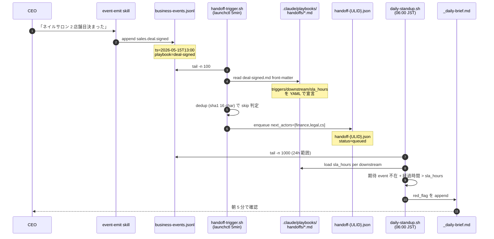
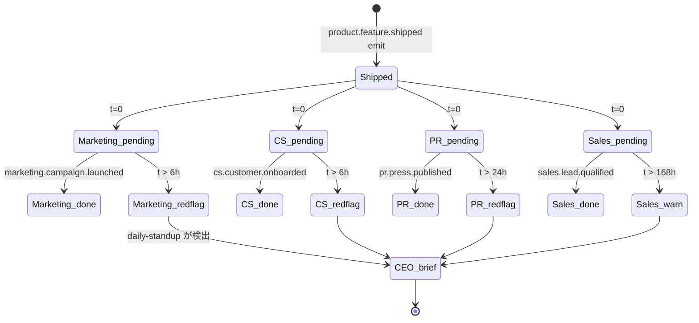

> **Disclaimer**: 本連載は著者が **個人 (副業)** で運営する小規模プロジェクト群 (CreaNest 名義) の技術記録です。所属組織・本業の業務内容とは一切関係ありません。記載の数値・構成は執筆時点 (2026-05) の自宅検証環境のスナップショットであり、商用品質や SLA を保証するものではありません。

## 結論

成約 → Marketing 6h / CS 6h / PR 24h / Sales 168h の連鎖を、1 つの Markdown playbook で宣言します。Slack も Notion も Asana も使いません。`docs/`-relative な `.claude/playbooks/handoffs/*.md` の YAML front-matter が SSOT で、`handoff-trigger.sh` がそれを読んで `.claude/pipeline/queue/handoff-{ULID}.json` に next dept を投入します。

- **3 本の playbook** (`deal-signed.md` / `launch-readiness.md` / `vc-pitch-handoff.md`) で **4 部署 (Marketing / CS / PR / Sales)** + **3 部署 (Finance / Legal / CS)** + **3 部署 (PR / Finance / Legal)** の handoff chain を宣言
- **SLA** は front-matter の `sla_hours` のみで宣言: **6h / 24h / 48h / 72h / 168h** の 5 段階
- **bash 387 行** の `handoff-trigger.sh` が `tail -n 100` + `jq` で chain match → `enqueue` するだけ。新規 SaaS / Postgres / Kafka 不要
- **Slack 化はしない** (memory `feedback_komyu_backend_separation` 系で「分離 5/16-5/30 / Slack 化はその後」と凍結中)

これが連載 H/B 軸の **Day 50/52** で、H-01「Cross-Department Event Bus」の **chain dispatcher 詳細編** にあたる位置付けです。H-01 で「JSONL 1 本で 13 部署が連動する」を書いたので、本記事は「**JSONL を読んで次部署を決める chain 表記** を Markdown に閉じ込める」テクニックを掘ります。

> 用語: **handoff playbook** = ある event_type を受信した時に、どの部署が何時間以内に何を出力するかを宣言する `.md` ファイル。YAML front-matter で機械可読、本文で人間 (= 主に AI agent) 可読。Phase 0 の Cross-Department Event Bus (ADR-0010) における唯一の subscribe 宣言場所。

## 問題 — 部署間 handoff が口頭で蒸発する

13 部署 director を立てた直後、1 ヶ月で気付いた事実があります。**Sales が成約しても Finance / Legal / CS が動かない**。各 director は独立した Claude session で起動するので互いの出力を見ず、harness-loop は GitHub Issue/PR の polling だけで動くので、ビジネス系の動き (成約 / 入金 / launch / press 公開) は CEO が次の director を呼ぶまで一切連動しませんでした。

```
Before (2026-05-08 まで):
  CEO「ネイルサロン 2 店舗目決まった」
   ↓
  /sales 起動 → sales/state.md に追記 (それだけ)
   ↓
  Finance: 知らない / Legal: 知らない / CS: 知らない
   ↓
  3 日後 CEO「あれ請求書出した?」(忘却で売上漏れ)
```

H-01 で書いた **append-only ledger (`business-events.jsonl`)** は publisher 側を解決しましたが、consumer 側 — 「ある event を誰が受け取って何時間以内に何をするか」の宣言場所 — がまだ無い状態でした。最初の選択肢は 2 つです。

1. **`handoff-trigger.sh` の case 文に直書き** — 速いが「何が起きるか」が CEO から見えない
2. **Slack workflow / Notion automation** — 見えるが SaaS 依存、CEO の cognitive load が増える

実際 v0 では (1) を採用していました。`match_chain()` の case 文に `sales.deal.signed → finance,legal,cs` をハードコードし、SLA は head of stub function に hard-coded した整数で持っていました。これは初日は動きましたが、**2 日目に CEO が `cat handoff-trigger.sh` を読まないと「成約後何が起きるか」が分からない**、という運用破綻を起こしました。bash の case 文は機械的すぎて、人間 (= CEO + 後から見る AI agent) が「Sales が成約したら何が起きる?」の SSOT として読めないわけです。

> 用語: **SSOT (Single Source of Truth)** = ある事実が 1 箇所だけに書かれており、他の場所はそこから派生するという原則。本記事では「`sales.deal.signed` 受信時の連鎖」が **playbook md の front-matter のみ** に書かれており、bash も Claude session も全部そこを読みに来る、という構造を SSOT と呼びます。

## 解法 — Markdown playbook が SSOT、bash は consumer

設計原則は **playbook を書いただけで連鎖が成立する**。新しい event_type を追加したら、対応する `.md` を 1 本書けば handoff-trigger.sh 側のコード変更ゼロで連鎖が動く、を目標にします (Phase 0 では一部 case 文がまだ残っていますが、Phase 1.5 で完全に front-matter parser に統一する `pipeline-kit/ops/README.md:140` で予告済み)。

採用するのは:

1. **playbook 3 本** (`.claude/playbooks/handoffs/deal-signed.md` / `launch-readiness.md` / `vc-pitch-handoff.md`)
2. **YAML front-matter で `triggers` / `downstream` / `sla_hours` を宣言**
3. **本文 (Markdown) で AI agent 向けに required payload と fallback を記述**
4. **`handoff-trigger.sh` (387 行) が ledger tail → chain match → queue 投入**

これだけで「成約 → 24h Finance / 48h Legal / 24h CS」「launch → 6h Marketing / 6h CS / 24h PR / 168h Sales」「VC pitch → 72h PR / 72h Finance / 72h Legal」の 3 連鎖が成立します。新規 SaaS 契約はゼロ、CI 追加コストもゼロです。

### 全体フロー



CEO は「決まった」と発話するだけ、5 分後に queue が立ち、翌朝 06:00 に SLA 違反が `_daily-brief.md` に並びます。**playbook を書く以外に CEO がやることは何もありません**。

### playbook の構造 — `deal-signed.md` を例に

実物を全部引きます (本文は省略、front-matter は完コピ)。`pipeline-kit/.claude/playbooks/handoffs/deal-signed.md` ではなく、devops-hub repo 直下の `.claude/playbooks/handoffs/deal-signed.md:1-19` です。

```markdown
---
slug: deal-signed
title: Sales 成約 → Finance / Legal / CS の連鎖
triggers:
  - sales.deal.signed
downstream:
  - actor: finance
    output: invoice.issued
    sla_hours: 24
    notes: 請求書を発行、payment.received 監視を開始
  - actor: legal
    output: contract.signed
    sla_hours: 48
    notes: 契約書を最終化、署名済 PDF を archive、reg compliance 確認
  - actor: cs
    output: customer.onboarded
    sla_hours: 24
    notes: onboarding flow 開始、Day 1-7 のタスクをスケジュール
---
```

front-matter のフィールド設計の 4 原則:

1. **`slug`** — playbook の unique id。`handoff-trigger.sh` の queue file 命名と `daily-standup.sh` の violation tag に使う
2. **`triggers`** — 配列。複数 event_type を 1 playbook で受けたい場合に拡張可能 (現状は 1 本/playbook)
3. **`downstream`** — 配列。各 entry が `{actor, output, sla_hours, notes}` の 4-tuple
4. **`sla_hours`** — 整数。**hours 単位** (minutes でも days でもなく)。**6 / 24 / 48 / 72 / 168** の 5 段階を Phase 0 vocabulary として fix

`output` は **期待される対応 event の event_type 名** です。例えば `finance.invoice.issued` が SLA 内に ledger に出ていなければ red flag になります。これが SLA の機械的検出を可能にする鍵で、**event_type 名と output 名の一致** が playbook の唯一の制約です (memory `feedback_design_doc_visual` で「設計書はビジュアル優先」と決めた通り、本文では Mermaid と表でこれを冗長に書きます)。

### 3 つの playbook の構造比較

```mermaid
classDiagram
    class HandoffPlaybook {
        +string slug
        +string title
        +string[] triggers
        +Downstream[] downstream
    }
    class Downstream {
        +string actor
        +string output
        +int sla_hours
        +string notes
    }
    class DealSigned {
        slug = "deal-signed"
        triggers = [sales.deal.signed]
    }
    class LaunchReadiness {
        slug = "launch-readiness"
        triggers = [product.feature.shipped]
    }
    class VcPitchHandoff {
        slug = "vc-pitch-handoff"
        triggers = [strategy.decision.committed]
        trigger_payload_filter = {kind: vc-pitch-ready}
    }
    HandoffPlaybook <|-- DealSigned
    HandoffPlaybook <|-- LaunchReadiness
    HandoffPlaybook <|-- VcPitchHandoff
    HandoffPlaybook *-- Downstream
```

3 本それぞれの downstream 表を本文埋込で並べます。

**`deal-signed.md`** (`.claude/playbooks/handoffs/deal-signed.md:6-19`):

| actor | output | sla_hours |
|---|---|---:|
| finance | invoice.issued | **24** |
| legal | contract.signed | **48** |
| cs | customer.onboarded | **24** |

**`launch-readiness.md`** (`.claude/playbooks/handoffs/launch-readiness.md:6-23`):

| actor | output | sla_hours |
|---|---|---:|
| marketing | marketing.campaign.launched | **6** |
| pr | pr.press.published | **24** |
| cs | cs.customer.onboarded | **6** |
| sales | sales.lead.qualified | **168** |

**`vc-pitch-handoff.md`** (`.claude/playbooks/handoffs/vc-pitch-handoff.md:1-21`):

| actor | output | sla_hours |
|---|---|---:|
| pr | pr.press.published | **72** |
| finance | finance.runway.alert | **72** |
| legal | legal.contract.drafted | **72** |

vc-pitch-handoff だけ追加の `trigger_payload_filter: {kind: vc-pitch-ready}` を持っているのが特徴です。`strategy.decision.committed` は VC pitch 以外でも emit されるので、payload の中の `kind` フィールドで playbook を分岐させる必要があります。これは Phase 0 では `match_chain()` の case 文で hard-code して逃げています (`handoff-trigger.sh:120-200`)。Phase 1.5 で front-matter parser に統一する際は、`trigger_payload_filter` を再帰的に jq filter として扱う設計にする予定です。

### handoff-trigger.sh — playbook を read する consumer

`pipeline-kit/ops/handoff-trigger.sh` は **387 行 / bash 3.2 互換 / jq 必須** です (`wc -l` 実測)。役割は ledger を tail して、playbook chain table に従って次部署 director を queue に投入することです。Phase 0 では front-matter の YAML parse は省略して、`match_chain()` 関数に case 文として chain 表を持っています (Phase 1.5 で front-matter parser に統一)。

核 1: dedup key 生成 (`pipeline-kit/ops/handoff-trigger.sh:80-95`):

```bash
# event JSON 1 行から sha1 16 文字を計算
dedup_key() {
  local event_json="$1"
  local material
  material="$(printf '%s' "${event_json}" \
    | jq -c '{ts,actor,event_type,project,payload,decision_id}')"
  if command -v shasum >/dev/null 2>&1; then
    printf '%s' "${material}" | shasum -a 1 | cut -c1-16
  else
    printf '%s' "${material}" | sha1sum | cut -c1-16
  fi
}
```

核 2: chain match (`pipeline-kit/ops/handoff-trigger.sh:120-200` から抜粋):

```bash
match_chain() {
  local event_type="$1" playbook_hint="$2" payload="$3"
  local kind
  kind="$(printf '%s' "${payload}" | jq -r '.kind // ""')"

  case "${event_type}" in
    sales.deal.signed)
      printf 'deal-signed:finance,legal,cs'
      return 0 ;;
    product.feature.shipped)
      printf 'launch-readiness:marketing,pr,cs,sales'
      return 0 ;;
    strategy.decision.committed)
      if [ "${kind}" = "vc-pitch-ready" ]; then
        printf 'vc-pitch-handoff:pr,finance,legal'
        return 0
      fi
      ;;
  esac
  return 1
}
```

核 3: queue 投入 (`pipeline-kit/ops/handoff-trigger.sh:215-240`):

```bash
enqueue() {
  local event_json="$1" playbook_slug="$2" next_actors_csv="$3"
  local ulid; ulid="$(gen_ulid)"
  local queue_file="${QUEUE_DIR}/handoff-${ulid}.json"

  jq -nc \
    --arg ulid "${ulid}" \
    --arg playbook "${playbook_slug}" \
    --argjson next_actors "$(printf '%s' "${next_actors_csv}" | jq -R 'split(",")')" \
    --argjson source_event "${event_json}" \
    '{ulid:$ulid, status:"queued", kind:"handoff",
      playbook:$playbook, next_actors:$next_actors, source_event:$source_event}' \
    > "${queue_file}"

  log "ENQUEUE: ${queue_file##*/} playbook=${playbook_slug} next=${next_actors_csv}"
}
```

queue file は **将来 `harness-loop.sh` が pick して `run-orchestrator.sh` で next dept director を起動する** 想定です。Phase 0 は **「queue を立てるところまで」** が責務で、director 自動起動は Phase 1 解凍後 (Komyu β E2E 達成後の 5/22 以降) に追加します。

ここで重要な設計判断は「**queue を立てるところで一旦止める**」ことです。最初は「emit したら自動で next dept director が起動するべき」と考えていましたが、Phase 0 で full automation を入れると **暴走時の被害が読めない** という結論になりました。具体的には `legal.contract.signed` が誤発火した瞬間に CS / Finance / Marketing 3 director が並列起動し、それぞれ GitHub Issue を勝手に立てて、PR を勝手に出して、Cloud Run に勝手に deploy する未来が見えたわけです。

### SLA タイマーの状態遷移 — launch-readiness 4 部署連鎖

`launch-readiness.md` は **4 部署 (Marketing / CS / PR / Sales)** が出力すべき event を front-matter で宣言します。各 actor の SLA は **6h / 6h / 24h / 168h**。



`daily-standup.sh` は 06:00 JST に launchctl 起動して、ledger を tail (24h 分) し、各 playbook の `downstream[].sla_hours` を front-matter から読み込んで、`shipped_at + sla_hours` 経過後に `output` event が ledger に存在しなければ red_flag を `_daily-brief.md` に append します。**SLA は監視の単位**であり、**front-matter の `sla_hours` だけが SLA の SSOT** です。bash 側にも Claude session 側にも別途の閾値を持たない、という分離が肝です。

### Required payload と本文 — AI agent 向けの「役割定義」

front-matter は機械可読パートですが、本文側は **AI agent (= 各部署 director) が何を入力に取り、何を出力するか** を人間語で書きます。`deal-signed.md:21-60` を抜粋します:

```markdown
## Required payload (event 側)

```json
{
  "customer": "<会社名 or 個人名>",
  "mrr_delta": 20000,
  "contract_id": "<内部識別子>",
  "product": "nailsalon | komyu | soccer-note | yomi-note | ..."
}
```

## 連鎖 (24-48h 以内)

### 1. Finance — 24h 以内

- 期待出力: `finance.invoice.issued`
- 必要入力: customer, mrr_delta, payment_terms, due_date
- 連動 milestone: 該当 project の `_state.md` の MRR snapshot 更新
- 失敗 fallback: 24h 経過時点で `ceo.escalation.opened` を emit
```

各 downstream entry には:

- **期待出力** (= front-matter の `output` と一致する event_type 名)
- **必要入力** (= 当該部署 director が prompt 組立に使うフィールド)
- **連動 milestone** (= 既存 `.claude/business-pipeline/{milestone}/` への hook)
- **失敗 fallback** (= SLA 超過時に追加で emit すべき event)

の 4 項目が必ず並びます。**この粒度で書けば AI agent 側は迷いません**。実際 `/finance` を起動した時に「context として `.claude/playbooks/handoffs/deal-signed.md` を読み、自分の section の `必要入力` を payload から抽出して、`期待出力` を生成する」という単純な instruction で動きます。Phase 1.5 で `run-orchestrator.sh` が director 起動時にこの md を context injection する設計を、Phase 0 段階で playbook 側を整えて準備しておく、という戦略です。

### 自然文 → emit を成立させる skill description

CEO が CLI を打たない体験を成立させるのは `event-emit` skill です。`~/.claude/skills/event-emit/SKILL.md:1-10` の実物:

```markdown
---
name: event-emit
description: |
  Use this skill whenever the CEO mentions a business event in conversation
  that should be recorded in the cross-department event bus —
  sales 成約 / 入金 / 契約締結 / 機能 launch / press 公開 / 補助金申請 /
  採用確定 / NPS 観測 / churn signal / VC pitch 確定 等。
  Trigger on Japanese phrases:
  "成約した", "入金あった", "契約締結", "launch した", "公開した",
  "申請した", "決まった", "サインした", "shipped", "released".
  Calls `pipeline-kit/ops/emit-event.sh` to append a record to
  `.claude/events/business-events.jsonl` per ADR-0006.
---
```

CEO が「ネイルサロン 2 店舗目決まったよ、月 2 万」と発話した瞬間、skill が actor=sales / type=sales.deal.signed / project=nailsalon / payload.mrr_delta=20000 / **`--playbook deal-signed`** を抽出して emit-event.sh を呼びます。**この `--playbook` フラグが「どの chain に乗るか」のヒント**で、handoff-trigger.sh の `match_chain()` 第 2 引数として効きます。

## 失敗談 — playbook 設計で踏んだ罠 4 つ

### 1. 最初は `--downstream finance,legal,cs` を emit 側で渡していた

v0 では emit-event.sh に `--downstream` フラグを生やしていました。これだと **emit 側 (publisher) が consumer の subscribe を決める** ことになり、Creator ≠ Evaluator (CLAUDE.md C-002) を破ります。

**Before** (壊れた版):

```bash
pipeline-kit/ops/emit-event.sh \
  --actor sales \
  --type sales.deal.signed \
  --downstream finance,legal,cs \
  --payload '{"customer":"Salon X"}'
```

**After** (`pipeline-kit/ops/README.md:114` 現行、`--downstream` 削除済):

```bash
pipeline-kit/ops/emit-event.sh \
  --actor sales \
  --type sales.deal.signed \
  --playbook deal-signed \
  --payload '{"customer":"Salon X"}'
```

ADR-0010 §4 (`docs/adr/0010-cross-dept-event-bus-genealogy-v1.md:57-63`) で arch reviewer から指摘されて、`--downstream` を削除し、subscribe は **playbook 側の YAML front-matter のみで宣言** するように修正しました。emit 側は `--playbook deal-signed` を渡すだけ (= 「どの chain に乗るか」のヒント)、`handoff-trigger.sh` の `match_chain()` が playbook を読んで next dept を決定する、という分離です。

教訓: **「誰が誰の subscribe を決めるか」は責務の境界そのもの**。Phase 0 の小さい実装でも、後から structural mitigate するのは大変なので、最初から publisher と consumer を分離する。

### 2. SLA を hours / minutes / days で混在させた

最初は SLA 単位を統一していませんでした。Marketing は「30 分」、CS は「半日」、Sales は「1 週間」と日本語で書いていて、`handoff-trigger.sh` 側で全部 hours 換算する parser を書いていました。

**Before** (v0 hand-written 版):

```yaml
downstream:
  - actor: marketing
    sla: "30分"
  - actor: cs
    sla: "半日"
  - actor: sales
    sla: "1週間"
```

**After** (`launch-readiness.md:6-22` 現行):

```yaml
downstream:
  - actor: marketing
    sla_hours: 6
  - actor: cs
    sla_hours: 6
  - actor: pr
    sla_hours: 24
  - actor: sales
    sla_hours: 168
```

教訓: **単位は 1 つに統一**。**Phase 0 vocabulary として `sla_hours` 整数のみ** に固定し、6/24/48/72/168 の 5 段階に絞りました。168h = 1 週間、72h = 3 日、48h = 2 日、24h = 1 日、6h = 半日。**5 段階以上は人間が覚えられない** という運用知見です。

### 3. handoff-trigger を foreground で `tail -f` していた

最初は `tail -f business-events.jsonl | while read` の foreground 常駐で動かしていました。これだと **Mac sleep 時に止まる**、**SSH 切断で死ぬ**、**ターミナル落とすと死ぬ**、と 3 重の脆さがあります。

**Before** (v0):

```bash
# bad: foreground tail -f
tail -f .claude/events/business-events.jsonl | while IFS= read -r line; do
  process_event "${line}"
done
```

**After** (launchctl plist + `--once` mode):

```xml
<!-- ~/Library/LaunchAgents/com.devops-hub.handoff-trigger.plist -->
<key>StartInterval</key>
<integer>300</integer>  <!-- 5 minutes -->
<key>ProgramArguments</key>
<array>
  <string>/path/to/handoff-trigger.sh</string>
  <string>--once</string>
  <string>--tail</string>
  <string>100</string>
</array>
```

5 分間隔で `--once` 起動、最近 100 件を再評価して dedup 済 event は skip、新規だけ enqueue するモデルに切り替えました。**自宅 iMac (sleep 無効化済)** が常駐 host (memory `project_home_imac_always_on`) なので、launchctl が確実に発火します。Mac sleep 問題はそもそも発生しません。

教訓: **polling + dedup state** は foreground tail より頑健。memory `feedback_use_claude_cli_not_api` 系で「自動化は launchctl + bash で完結」と決めた根拠の 1 つです。

### 4. `trigger_payload_filter` を最初は YAML で書いていなかった

`vc-pitch-handoff.md` は `strategy.decision.committed` event を受けますが、この event は VC pitch 以外でも emit されます (例: feature pivot 決定 / pricing 変更 / etc)。最初は payload の中身を見ずに全部の `strategy.decision.committed` を vc-pitch-handoff の chain に乗せていました。**結果、pricing 変更を CEO が emit したら PR / Finance / Legal が誤発火** してしまいました。

**Before** (v0):

```yaml
triggers:
  - strategy.decision.committed
```

**After** (`vc-pitch-handoff.md:1-7` 現行):

```yaml
triggers:
  - strategy.decision.committed
trigger_payload_filter:
  kind: vc-pitch-ready
```

`payload.kind == "vc-pitch-ready"` の event だけ vc-pitch-handoff chain に乗せる、という追加 filter です。Phase 0 では `handoff-trigger.sh` の `match_chain()` の case 文に `if [ "${kind}" = "vc-pitch-ready" ]; then` を hard-code して逃げていますが、Phase 1.5 で front-matter parser に統一する予定です。

教訓: **同じ event_type が複数の chain で消費される場合、payload filter が必要**。最初から **「event_type と playbook は 1:N」** という前提で設計する。

## 残課題

### 1. front-matter parser の bash 実装 (Phase 1.5)

現状 `match_chain()` は bash case 文に chain 表を持っています。これは Phase 0 の暫定実装で、playbook 側の front-matter 改修が bash と二重メンテになるリスクがあります。Phase 1.5 で:

- `yq` (jq の YAML 版) を依存に追加
- `match_chain()` を `yq -o=json '.downstream[].actor' deal-signed.md` で動的に解決
- bash 側の case 文を全削除

する予定です。これで **playbook を 1 本書いただけで chain が成立する** 状態になります。`pipeline-kit/ops/README.md:140` で予告済。

### 2. SLA 違反時の自動 escalation

現状は `daily-standup.sh` が red flag を `_daily-brief.md` に書くだけで、**CEO が朝確認しない限り対応されない**。Phase 1 で `ceo.escalation.opened` event を自動 emit する設計を追加予定ですが、これは「**SLA 違反 → 自動 director 起動**」を意味するので、暴走対策 (= ADR-0010 で言及した dry-run 期間) を先に整える必要があります。

### 3. retroactive SLA の扱い

過去の event を後から ledger に append したくなる瞬間があります (例: 5/9 の補助金申請を、5/12 になってから「あ、emit し忘れてた」と気付く)。今は `ts` を遡らせると `daily-standup.sh` の SINCE フィルタが噛み合わず、SLA 違反が **3 日前のものとして検出される** バグがあります。

対策候補:

- `recorded_at` (実際 ledger に書いた時刻) と `ts` (event 発生時刻) を分離
- retroactive event は別ファイル (`business-events-backfill.jsonl`) に書く
- SLA タイマーを `recorded_at` ベースに切替

H-01 で書いた通り Phase 1.5 の Firestore migration と一緒に再検討します。

### 4. playbook の chain 内 dependency

現状 `deal-signed.md` の downstream は **並列 3 部署** (Finance / Legal / CS) として宣言されていますが、実運用上「**Legal が contract.signed を出してから初めて Finance が invoice.issued を出すべき**」という直列依存があります。今の playbook 表現では「並列 SLA」しか書けず、直列依存を表現できません。

候補は YAML 上で `depends_on: legal` を downstream entry に追加する案ですが、循環依存検出が必要になり Phase 0 の bash 387 行では実装が重いので、現状は人間 (= 各 director の prompt) で対応しています。Phase 1.5 で graph として持ち直します。

## 理論根拠 — Markdown SSOT が moat になる理由

### 1. ADR-0005 の Phase 0 制約 + ADR-0010 の Genealogy 第 1 世代

ADR-0005 で Phase 0 の coordination 範囲は **L1-L3 file-based** に凍結しました。Postgres / Outbox / Inngest / MCP server は L4 以降の Phase 1+ マターです。1 人会社で運用 1 年もしないうちに Postgres を立てると、**移行コストではなく運用 cognitive load** で潰れます。

ADR-0010 で `business-events.jsonl` を「Decision Genealogy 第 1 世代 ledger」と位置付けたのと同じく、playbook md は **subscribe 宣言の第 1 世代 SSOT** です。Phase 1.5 で Firestore に migrate する際、**playbook md → Firestore document** の変換 script を 1 本書けば移行できる、という設計です。md は使い捨てではなく初期化の素材です。

### 2. AI agent の context として最適

Markdown は LLM が **無前処理で読める唯一の構造化フォーマット** です。JSON / YAML 単独だと意図が伝わらず、Excel / Notion だと parser が必要です。Markdown front-matter + 本文の組合せは:

- **front-matter (YAML)** = 機械可読 (bash + jq でも解ける)
- **本文 (Markdown)** = LLM 可読 (Claude が prompt にそのまま流せる)

の **二重構造** を 1 ファイルで実現します。これは設計者 (= 私) が後から見ても、AI agent が起動時に context として読んでも、人間 (= 後の hire / VC pitch 同席者) が読んでも、同じ理解に至るための装置です。memory `feedback_design_doc_visual` で「設計書はビジュアル優先」と決めたのと整合的で、**playbook md は実行可能な設計書** という位置付けになります。

### 3. SaaS を増やさない設計が CEO 工数の moat

別の言い方をすると、**Slack workflow / Notion automation / Zapier** で同じことができるはずです。しかしそれらは:

- **CEO が別 SaaS にログインする必要がある** (cognitive switch コスト)
- **設定変更が GUI クリックで残らない** (差分が git に出ない)
- **AI agent が context として読めない** (API 経由でも構造が SaaS 依存)

の 3 重の弱点があります。Markdown playbook は:

- **`.md` 編集 → `git diff` で変更履歴が残る**
- **`grep -r 'sla_hours: 24' .claude/playbooks/`** で全 SLA 24h の chain を一発検索
- **AI agent (= director) が起動時に直接 read** できる

ので、**SaaS 依存ゼロで cognitive load も最小**。これが 1 人会社における handoff 設計の唯一最適解だと考えています。memory `feedback_ai_ops_three_leg` で「AI Ops 自体を商品化しない、OSS化しない」と決めた通り、Markdown SSOT 設計は **moat 候補ではあるが商品ではない** という位置付けで、内部運営の multiplier として継続します。

### 4. Decision Genealogy spine への接続

playbook md の `slug` は `business-events.jsonl` の `playbook` フィールドに格納されており、**event 1 行から playbook を逆引きできる** 設計になっています。Phase 1.5 で Firestore に migrate する際、`decisions` collection の各 doc に `playbook_id` を持たせれば、**「あの decision はどの chain で動いたか」** を graph として描けます。

具体的には:

- `decisions.{decision_id}.playbook_id = "deal-signed"`
- `decisions.{decision_id}.parents = ["DEC-20260515-01"]` (前駆 decision-id)
- `decisions.{decision_id}.outcome = {nps_delta: +5, churn_at_30d: 0}` (Phase 1.5 で蓄積)

を 1 つの graph として持つことで、「**Sales 成約 → CS onboarding → 30 日後の churn 0** という chain が再現性を持つか」を数値化できます。memory `project_decision_genealogy_moat` で確定した「唯一の革新候補は意思決定品質の数値化エンジン」の前段として、playbook md は **再現可能な chain の宣言** という役割を担います。

## 数字まとめ

実測値を一覧します:

- **3 本の handoff playbook** (`.claude/playbooks/handoffs/{deal-signed,launch-readiness,vc-pitch-handoff}.md`、`ls .claude/playbooks/handoffs/*.md | wc -l` 実測)
- **SLA 段階 5 種**: 6h / 24h / 48h / 72h / 168h
- **連鎖部署: deal-signed 3 / launch-readiness 4 / vc-pitch-handoff 3** (downstream 配列長 実測)
- **`handoff-trigger.sh` は 387 行** (`wc -l` 実測)
- **launchctl plist 1 本** (`com.devops-hub.handoff-trigger.plist`、5 min 間隔)
- **dedup key = sha1 16 文字** (`pipeline-kit/ops/handoff-trigger.sh:80-95`)
- **bash 3.2 互換 + jq 必須** (依存ライブラリ 1 種のみ)
- **新規 SaaS 契約 0 件** (Slack/Notion/Asana/Zapier 不採用)

## Before / After

### CEO の体験

**Before** (2026-05-08 まで):

```
CEO「ネイルサロン 2 店舗目決まった」
 ↓ /sales 起動
sales/state.md に追記 (それだけ)
 ↓
Finance: 知らない / Legal: 知らない / CS: 知らない
 ↓
3 日後 CEO「あれ請求書出した?」(忘却で売上漏れ)
```

**After** (`deal-signed.md` 採択後):

```
CEO「ネイルサロン 2 店舗目決まった」(自然文)
 ↓ event-emit skill が発火
emit-event.sh が business-events.jsonl に append
 ↓ 5 分後 handoff-trigger.sh が cron 発火
deal-signed.md の front-matter を読んで
handoff-{ULID}.json が queue に立つ (next: finance,legal,cs)
 ↓ 翌朝 06:00 daily-standup.sh
sla_hours を読んで SLA 違反を _daily-brief.md に append
 ↓ CEO 朝 5 分で red flag 確認
忘却ゼロで連鎖完了
```

### Subscribe 宣言の場所

**Before**: `handoff-trigger.sh` の case 文に「sales.deal.signed → finance,legal,cs」が hard-code。CEO は cat して読まないと連鎖を理解できない。SLA は別の hard-code 整数。

**After**: `.claude/playbooks/handoffs/deal-signed.md` の YAML front-matter に **subscribe + SLA + 期待出力 + notes** が一元宣言。CEO は md 1 本読めば連鎖が分かる。AI agent は context として直接食える。

## まとめ

Markdown 1 本で handoff chain を宣言する最小構造は、つきつめると 4 ファイルで成立します:

- `.claude/playbooks/handoffs/{deal-signed,launch-readiness,vc-pitch-handoff}.md` (subscribe + SLA 宣言)
- `pipeline-kit/ops/handoff-trigger.sh` (387 行 bash、tail + jq + chain match + enqueue)
- `pipeline-kit/ops/daily-standup.sh` (06:00 JST、SLA 違反検出)
- `~/Library/LaunchAgents/com.devops-hub.handoff-trigger.plist` (5 min polling)

ここに `event-emit` skill が「CEO 自然文 → emit-event.sh 呼び出し」を被せて、CEO が CLI を打たない体験を実現します。Phase 1.5 で Firestore Decision Genealogy graph に昇格する際、playbook md は **subscribe 宣言の第 1 世代 SSOT** として位置付けます。

ADR-0010 が凍結した Phase 0 範囲はここまでです。**front-matter parser 統一 / SLA 違反自動 escalation / retroactive SLA / 直列依存 chain** は Phase 1 以降の宿題として置きました。Komyu β (5/15) と CreaNest 法人登記 (5/22) を越えてから、実イベントから帰納して playbook を改訂する方針です。

## 次の記事へ + 連載をフォロー

これは **52 本連載 (ai-driven-dev) の Day 50/52** です。

→ **H-01 13 部署が JSONL 1 本で連動する Cross-Department Event Bus** (公開済) — 本記事の publisher 編。emit-event.sh + ledger schema を掘っています。

→ **B-04 13 部署 director の State Cron Autonomy** (準備中) — playbook が指す `state.md` 側の cron 設計を掘ります。

→ **H-02 docs MECE Audit Skill — 1,164 ファイルを毎ターン MECE で監査する** (準備中) — Stop hook + skill で playbook md の整合を強制する話。

連載を見逃さない方法:

- **Zenn でこの著者をフォロー** — 公開通知が届きます
- **X で告知 tweet をフォロー** — 朝 6:00 に投稿予定
- **repo を watch**: [SakakitaniJunya/zenn-articles](https://github.com/SakakitaniJunya/zenn-articles) — 全 draft が見えます
- **devops-hub OSS**: 本記事の元コードは [SakakitaniJunya/devops-hub](https://github.com/SakakitaniJunya/devops-hub) に全部入っています。`.claude/playbooks/handoffs/` 配下に 3 本の md がそのまま置いてあります。

誤りや「ここをもっと深く」のリクエストは GitHub Issue でお気軽に。
