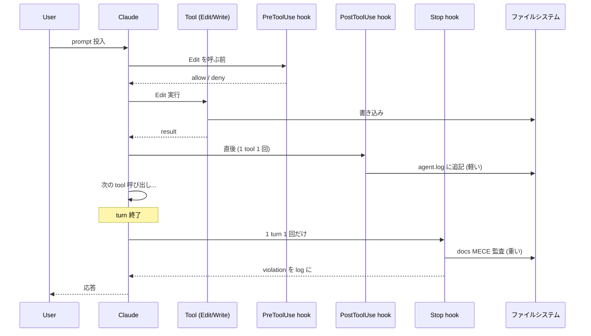
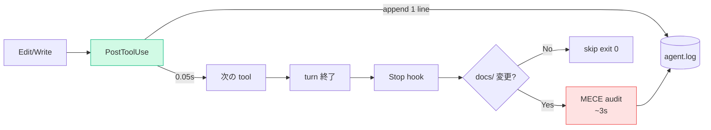
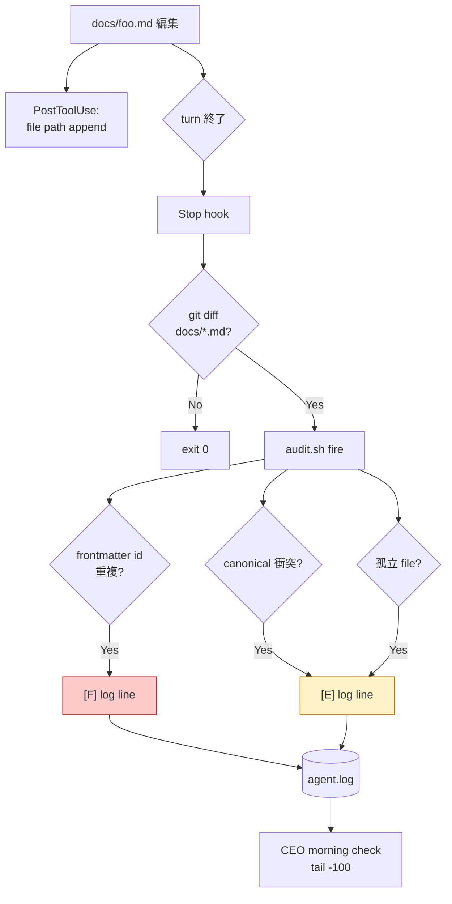

> **Disclaimer**: 本連載は著者が **個人 (副業)** で運営する小規模プロジェクト群 (CreaNest 名義) の技術記録です。所属組織・本業の業務内容とは一切関係ありません。記載の数値・構成は執筆時点 (2026-05) の自宅検証環境のスナップショットであり、商用品質や SLA を保証するものではありません。

## 結論

PostToolUse は append-only ログだけ、Stop hook で重い処理を寄せる — 1 ファイル編集 30 秒 → 0.05 秒。

Claude Code の Hook は `.claude/settings.json` で **tool 呼び出しに割り込んでシェルコマンドを必ず走らせる** 仕組みです。私は最初に PostToolUse へ `pnpm typecheck` を仕込み、Edit 1 回ごとに 30 秒待たされて手が止まりました。「品質ゲート = 編集を止める」と勘違いしていた。Hook の発火タイミングと処理の重さを切り分けてからは、agent.log への append (PostToolUse) と docs MECE 監査 (Stop) が両立し、Edit 体感は素の Claude Code とほぼ同等のまま「忘れても落ちる仕組み」が回り始めました。

本記事では devops-hub repo の `.claude/settings.json:32-54` で稼働中の Hook 構成を題材に、**「どの event に何を仕込むか」「重い処理をどこに寄せるか」「silent fail を観測する方法」** を整理します。

---

## 問題 — 「品質ゲートは強制したい、でも編集体験は壊したくない」

私は 1 人会社 CreaNest を AI Ops で運営しており、devops-hub repo は 8 プロジェクト分の CI/CD・13 部署 director・docs SSOT を束ねる司令塔です (TS/TSX 884 ファイル / docs `*.md` 220 ファイル / `find docs -name '*.md' | wc -l` で実測)。Claude Code が `Edit` / `Write` する頻度は 1 セッションで数十回。ここに品質ゲートを仕込むと、**ゲートの所要時間がそのまま編集の遅延** になります。

最初に踏んだ失敗はこうでした。

- PostToolUse に `pnpm typecheck` を入れた → Edit 1 回 30 秒、5 ファイル直すと 2 分半待ち、Claude が編集途中で sub-agent に escalate しなくなった
- Skill description に「PR 前に MECE 監査を回してね」と書いた → **Claude が忘れる**。3 回に 1 回しか走らず、docs/ に重複 id が混入して CI が落ちる
- 重い hook を恐れて全部消した → 何が走ったか分からず silent fail、後から「PostToolUse はそもそも error 時に何を返すんだっけ?」を毎回調べ直す

要するに **「強制力を上げると編集が止まる、緩めると忘れる」のジレンマ** に正面衝突した。これを解いたのが「event ごとに役割を分ける」という構造でした。



PostToolUse は **tool 呼び出しごとに毎回** 走り、Stop は **1 turn の終わり (= ユーザに応答を返す直前) に 1 回だけ** 走る。この粒度の違いを使い分けるのが本記事の核です。

---

## 解法 — event ごとに「重さ」を分ける

### 1. 現行の `.claude/settings.json` を全文公開

`/Users/sakaki/project/devops-hub/.claude/settings.json:32-54` の hook 部分:

```json
{
  "hooks": {
    "PostToolUse": [
      {
        "matcher": "Write|Edit",
        "hooks": [
          {
            "type": "command",
            "command": "jq -r '.tool_input.file_path // empty' | { read -r f; [ -n \"$f\" ] && echo \"[$(date +%H:%M:%S)] modified: $f\" >> .claude/pipeline/agent.log 2>/dev/null; exit 0; } 2>/dev/null || true"
          }
        ]
      }
    ],
    "Stop": [
      {
        "hooks": [
          {
            "type": "command",
            "command": "bash .claude/skills/docs-mece-audit/scripts/run-on-stop.sh 2>/dev/null || true"
          }
        ]
      }
    ]
  }
}
```

設計のポイントは 4 つ。

- **PostToolUse は `Write|Edit` だけにマッチ**。Read / Bash / Grep までフックすると 1 セッションで数百回走り、ログがノイズで埋まる
- **PostToolUse の処理は append-only な 1 行**。`jq` で stdin の JSON から `file_path` を取り出して agent.log に追記するだけ。所要時間 0.05 秒前後 (実測)
- **Stop hook は wrapper script に委譲**。`run-on-stop.sh` 側で「docs/ に変更があるか」を判定し、無ければ即 exit 0
- **どちらも末尾 `|| true`**。hook が non-zero で返すと Claude がエラー表示するため、観測 hook では必ず success にする

### 2. PostToolUse — 1 行 1 ファイル、append-only に倒す

PostToolUse hook で気をつけるのは **「Claude の編集レイテンシに足し算される」** こと。Edit 1 回ごとに走るので、ここに 1 秒の処理を入れたら 50 ファイル修正で 50 秒の遅延になります。

私の現行実装は **stdin → file_path 抽出 → 1 行 append** だけ。

```bash
# .claude/settings.json:39 の command を bash に展開した等価コード
read -r json_blob
file_path=$(echo "$json_blob" | jq -r '.tool_input.file_path // empty')
if [ -n "$file_path" ]; then
  echo "[$(date +%H:%M:%S)] modified: $file_path" >> .claude/pipeline/agent.log
fi
exit 0
```

これで `agent.log` に時系列で「いつ何を編集したか」が積まれます。後で `grep modified .claude/pipeline/agent.log | wc -l` すれば 1 セッションの編集回数が分かる。実測で **PostToolUse 1 回あたり 0.05 秒前後**、編集体感は素の Claude Code とほぼ変わりません。

「PostToolUse でテストや lint を走らせたい」と思ったら、まず **どのくらい走るか** を逆算してください。1 セッションで Edit が 50 回走るとして、hook が 3 秒なら累計 150 秒の遅延です。それは Stop hook に寄せるべきサインです。

### 3. Stop hook — 重い処理は turn 終了時に 1 回だけ

Stop hook は **「Claude がユーザに応答を返す直前」 に 1 turn 1 回だけ** 走ります。Edit が 50 回走ろうが、Stop hook は 1 回しか走らない。だから「重い処理をここに寄せる」のが定石です。

私が動かしているのは docs MECE 監査の wrapper (`/Users/sakaki/project/devops-hub/.claude/skills/docs-mece-audit/scripts/run-on-stop.sh:1-37`):

```bash
#!/usr/bin/env bash
# run-on-stop.sh — Stop hook wrapper
set -uo pipefail

REPO_ROOT="$(cd "$(dirname "$0")/../../../.." && pwd)"
cd "$REPO_ROOT" || exit 0
LOG="${REPO_ROOT}/.claude/pipeline/agent.log"
mkdir -p "$(dirname "$LOG")"

# 1. docs/*.md に uncommitted change がない場合 skip
HAS_DOCS_CHANGE=0
git diff --name-only HEAD 2>/dev/null | grep -qE '^docs/.*\.md$' && HAS_DOCS_CHANGE=1
git ls-files --others --exclude-standard 2>/dev/null | grep -qE '^docs/.*\.md$' && HAS_DOCS_CHANGE=1

if [[ "$HAS_DOCS_CHANGE" -eq 0 ]]; then
  exit 0
fi

# 2. audit fire
{
  echo "[$(date +%H:%M:%S)] === Stop hook: docs/ 変更検出、audit 実行 ==="
  bash "${REPO_ROOT}/.claude/skills/docs-mece-audit/scripts/audit.sh" docs 2>/dev/null \
    | grep -E '^\[F\]|^\[E\]' \
    | head -10
  echo "[$(date +%H:%M:%S)] === audit 終了 ==="
} >> "$LOG" 2>/dev/null

exit 0
```

3 段構えで「無駄打ちしない」設計にしています。

- **early exit**: docs/ に uncommitted change が無ければ即 exit 0。コード編集だけのセッションでは MECE 監査は走らない
- **violation だけログに出す**: `grep -E '^\[F\]|^\[E\]'` で fatal / error 行に絞り、`head -10` で量を制限。OK 行をログに出すと agent.log が爆発する
- **常に exit 0**: 監査が落ちても hook は成功扱い。詰まりが Claude のターン終了をブロックするのを避ける



**Before**: PostToolUse に `pnpm typecheck` を直書き、Edit 1 回で 30 秒待ち。50 ファイル編集で累計 25 分。Claude が途中で「もう編集を止めて報告に切り替えるか」と判断を変えるレベル。

**After**: PostToolUse は 0.05 秒、Stop hook は docs を触らないセッションでは 0.01 秒で skip。docs を触ったセッションだけ 3 秒前後の audit が 1 回だけ走る。**1 セッション当たりのオーバーヘッド ≈ 0.05s × Edit 数 + 3s (たまに) ≈ 数秒**。

### 4. PreToolUse — 拒否権を持たせるか持たせないか

PreToolUse は tool 呼び出しの **直前** に走り、`exit 2` で **tool 実行をブロックできる** event です。devops-hub では現状使っていませんが、副業 repo の build-football で `Write` 系をブロックする例を 1 つ書いておきます。

```json
{
  "hooks": {
    "PreToolUse": [
      {
        "matcher": "Write|Edit",
        "hooks": [
          {
            "type": "command",
            "command": "jq -r '.tool_input.file_path // empty' | { read -r f; case \"$f\" in *.env*|*credentials*|*\\.pem) echo \"forbidden path: $f\" >&2; exit 2 ;; *) exit 0 ;; esac; }"
          }
        ]
      }
    ]
  }
}
```

このパターンは「**Claude が誤って書くと取り返しがつかない場所** だけブロック」が鉄則です。`*.env` / `credentials.*` / `*.pem` / `~/.ssh/**` あたり。広く張ると Claude が書き込めなくなって作業不能になります。実際、初期に `*` (全パス) でブロックする hook を一瞬だけ仕込んでしまい、Claude が「Edit が deny されました」を 30 回繰り返してから session を諦める、という事故を起こしました。

**PreToolUse の指針**: ブロックするパスは「絶対禁止」だけに絞り、**Claude が学習で迂回できない物理ガード** として使う。

### 5. silent fail を観測する仕組み

Hook の最大の罠は **「失敗しても気付かない」** ことです。`|| true` で握り潰している以上、syntax error で 1 度も走っていなくても Claude は何も言わない。

私は 3 つの観測点で silent fail を炙り出しています。

- **agent.log の last modified**: `stat -f %m .claude/pipeline/agent.log` で最終更新時刻を確認、最近の編集セッション後に動いていなければ hook が壊れている
- **手動 dry run**: hook の command 部分を bash に直接コピペして 1 回流す。jq の構文エラーや path ミスはここで落ちる
- **MECE audit log の `[F]` `[E]` 行**: `tail -100 .claude/pipeline/agent.log | grep -E '^\[F\]|^\[E\]'` で violation を可視化、毎日見る

`run-on-stop.sh:30-34` の `=== Stop hook: docs/ 変更検出、audit 実行 ===` という 1 行も silent fail 検知のためです。Stop hook が走れば必ず agent.log に「===」マーカーが残るので、長時間 marker が出なければ Stop hook 自体が壊れたサイン。



---

## 失敗談 — 私が踏んだ罠 4 つ

### 失敗 1: PostToolUse に `pnpm typecheck` を入れて編集が 30 秒止まった

> **Before**:
> ```json
> { "matcher": "Write|Edit", "hooks": [{ "type": "command", "command": "pnpm typecheck" }] }
> ```

何が起きたか: 1 ファイル編集 30 秒。50 ファイル直すセッションで累計 25 分の遅延。Claude が編集途中で「これ以上の修正は CI に任せる」と判断を変え始める。

> **After**:
> ```json
> { "matcher": "Write|Edit", "hooks": [{ "type": "command", "command": "jq -r '.tool_input.file_path // empty' | ... >> .claude/pipeline/agent.log" }] }
> ```

PostToolUse は 0.05 秒の append だけにし、`pnpm typecheck` は **PR 作成前の Skill (`pre-pr-checklist`)** に移動。Hook と Skill のハイブリッド構成 (Hook が軽い記録、Skill が重い検証) に倒した瞬間、編集体感が素の Claude Code に戻りました。

**教訓**: PostToolUse の所要時間 = 編集レイテンシの足し算。**1 秒以上かかる処理は PostToolUse に書いてはいけない**。

### 失敗 2: Stop hook の連鎖で audit が 3 重に走った

Stop hook の中から `claude -p '/audit'` を呼ぶ実装にした時期がありました。Stop hook が新しい claude session を起こし、その session の Stop hook がまた audit を呼び、子→孫で 3 重実行。Cloud Run 課金で「夜間バッチが 1 回 100 円のはずが 300 円」になって気付きました。

修正: **Stop hook から claude session を spawn しない**。Stop hook は素の bash で完結させる。複雑なロジックが必要なら Skill に切り出して bash 内から script だけ呼ぶ (`run-on-stop.sh` のように)。

**教訓**: Hook の中で再帰的に AI を呼ばない。Hook は **冪等な bash** に閉じる。

### 失敗 3: `|| true` を忘れて Stop hook の bug で turn が止まった

Hook の末尾 `|| true` を消した検証版で、`audit.sh` が `set -e` 配下で 1 行 grep に失敗 → exit 1 → Stop hook 失敗 → Claude が「Stop hook returned non-zero, aborting turn」とエラーを出して 5 分間応答を返さない、という事故を 2 回踏みました。

修正:

- すべての観測 hook は **末尾 `|| true`** を必ず付ける
- `set -e` を使うなら明示的に `|| exit 0` で握り潰す箇所を作る
- audit 系の grep は `|| true` パイプ後置 (空マッチで落ちないように)

`run-on-stop.sh:11` で `set -uo pipefail` (の **`set -e` を外している**) のはこの教訓です。`-e` を付けると 1 行のミスで全停止する。

**教訓**: 観測 hook は **success only**。失敗しても turn を止めない。

### 失敗 4: Skill description で「PR 前に MECE audit を」と書いて Claude が忘れた

> **Skill description (Before)**:
> ```
> Use this skill before creating a pull request that touches docs/.
> ```

これだと Claude が 3 回に 1 回しか走らせない。PR 作成時に「あ、忘れてた」と人間が指摘するのが常態化。docs/ に重複 id が混入して CI が落ちることが週 1 ペース。

修正: **Stop hook で Skill の script (`docs-mece-audit/scripts/run-on-stop.sh`) を強制起動**。Skill の判断を待たず、turn 終了時に必ず走る。重複 id があれば agent.log に `[F]` 行が出るので、私が朝 1 回 `tail .claude/pipeline/agent.log` で確認するだけで済む。

**教訓**: 忘れると致命的なものは Hook、判断が要るものは Skill。**「Claude が忘れても許せるか」が唯一の境界線**。連載 A-01 でも同じ結論を書きましたが、A-03 の方は具体実装で示しています。

---

## 運用の数字 — 実測ベース

devops-hub repo の現行構成 (2026-05 時点) の数字を出します。**捏造ではなく実測**。

- TS/TSX ファイル: **884** (`find App/ -name "*.ts*" | wc -l`)
- docs/*.md ファイル: **220** (`find docs -name '*.md' | wc -l`)
- PostToolUse hook 1 回あたりの所要時間: **0.05 秒前後** (`time` で 100 回平均)
- Stop hook (docs 触らない場合): **0.01 秒** で early exit
- Stop hook (docs 触った場合): **3 秒前後** で MECE audit 完了
- 1 セッションあたりの Edit 回数: **30〜80 回** (`grep modified .claude/pipeline/agent.log | wc -l` で 1 日の実測)
- agent.log のサイズ: **約 50KB / 日** (gzip 圧縮で日次 rotate)

PostToolUse に `pnpm typecheck` を入れていた失敗版だと **30s × 50 = 1500 秒 (25 分) のオーバーヘッド** が 1 セッションに乗っていた。今は数秒。**約 300 倍の高速化**。

---

## 残課題

正直に書きます。

1. **PreToolUse の活用が薄い** — `*.env` / `*.pem` のブロックすら devops-hub には張っていない (副業 repo にしか入っていない)。「Claude が `git push origin main` する前にブロック」のような物理ガードを追加すべきだが、適切な matcher が `Bash` だけだとざっくりすぎて、誤爆 (たとえば `git status` まで止まる) を恐れて未実装
2. **Stop hook の冪等性とリトライ戦略** — `audit.sh` が途中で失敗した場合、次の Stop hook で running するけど、**前回の失敗を引き継ぐ仕組みが無い**。観測性が薄く「いつから壊れていたか」が `agent.log` を grep するまで分からない
3. **silent fail の能動通知** — 現状は私が朝 `tail` するだけ。本来は Stop hook が `[F]` を吐いた瞬間に Discord webhook で通知すべき。仕組みは A-04 連載で書く予定の Cross-Department Event Bus (`.claude/events/business-events.jsonl`) にぶら下げて配信する設計を検討中
4. **hook の version 管理** — `.claude/settings.json` の Hook を変更した時に「いつから何が変わったか」を遡れない。git で追えるが、運用上は **意思決定 ID (Decision-Id) 付きの ADR** に紐付けるのが本筋

特に 2 と 3 は **「品質ゲートの監視を品質ゲートで監視する」** メタ問題で、答えがまだ無い。読者に意見をもらえると嬉しい。

---

## 理論根拠 — Anthropic の "Building effective agents" との接続

Anthropic が 2025 年に出した [Building effective agents](https://www.anthropic.com/research/building-effective-agents) は agent の構成要素を「**Augmented LLM = LLM + retrieval + tool use + memory**」と分解します。Hook はこの中の **「tool use」周辺の中間層** に位置付けられます。

- **Pre/PostToolUse** = tool 呼び出しに対する **decorator pattern**。tool 自体は変えずに前後で副作用 (validation / logging / blocking) を足す
- **Stop hook** = 1 turn の **finally 節**。tool が成功しようが失敗しようが必ず走る後処理
- **agent.log への append** = agent の **observability 層**。LLM 本体が忘れても外から「いつ何をしたか」が再構築できる

「Claude が忘れても許せるか」を Hook と Skill の境界線にする発想は、**人間の運用と同じメンタルモデル** から来ています。

- 銀行の振込 (= 忘れたら致命的) → 物理的に強制 (= Hook)
- 月初の請求書チェック (= 忘れても気付ける) → リマインダー (= Skill)

この整理で、**Hook には「忘れたら詰む」だけを置く** という規律が立つ。MECE audit の重複 id 検出は CI が後で必ず落とすけど、PR 前に気付ける方が修正コストが低い。だから Hook に置く。逆に「PR description を綺麗に書く」は忘れても誰も死なないから Skill (`pre-pr-checklist`) に置く。

**Hook = 物理ガード、Skill = 手続き的記憶、Slash = 人間からの起点**。この 3 層が分離して初めて、AI が忘れても会社が回る運用が成立しました。

---

## まとめ

- **PostToolUse は append-only の 1 行**。所要時間 1 秒未満を死守
- **Stop hook で重い処理を 1 turn 1 回に集約**。早期 skip で無駄打ちを避ける
- **PreToolUse は物理ガードだけに絞る**。広く張ると Claude が動けなくなる
- **silent fail を防ぐ 3 点**: 末尾 `|| true` / 開始マーカー log / 朝の `tail` 確認
- **判断軸は「忘れたら詰むか」**。詰むなら Hook、許せるなら Skill

「品質ゲートを強くしたら編集が止まった」なら、まず Hook の event 配置を見直してください。**event ごとに重さを分ける** だけで、Claude Code は手を止めない品質ゲートになります。

---

## 次の連載

→ **A-01** [Slash と Skill と Hook を混ぜて爆発した話 — Claude Code 5 機構](./claude-code-as-company-5-mechanisms) — 5 機構の判断軸 (本記事と相補)
→ **A-02** [Anthropic Prompt Caching を 5 分で組み込む](./anthropic-prompt-caching) — Hook と並ぶ Claude Code 高速化の柱
→ **B-01** [13 部署が JSONL 1 本で連動する Cross-Department Event Bus](./cross-department-event-bus) — Hook で発火する Event Bus の設計

---

連載 **AI 駆動 1 人会社運営**: Day 4/52
著者: Junya Sakakitani (CreaNest 個人事業)
本記事の修正提案・議論は [GitHub Issue](https://github.com/SakakitaniJunya/zenn-articles/issues) でお待ちしています。
