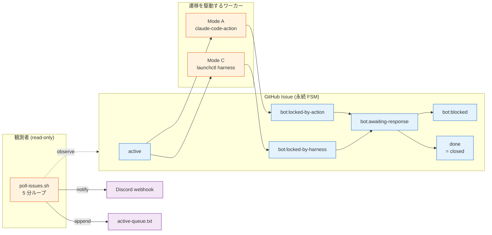
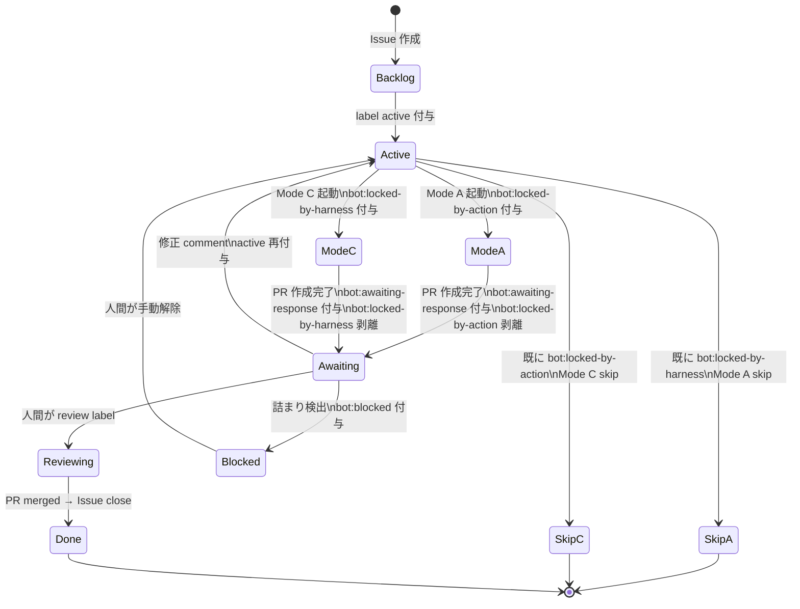
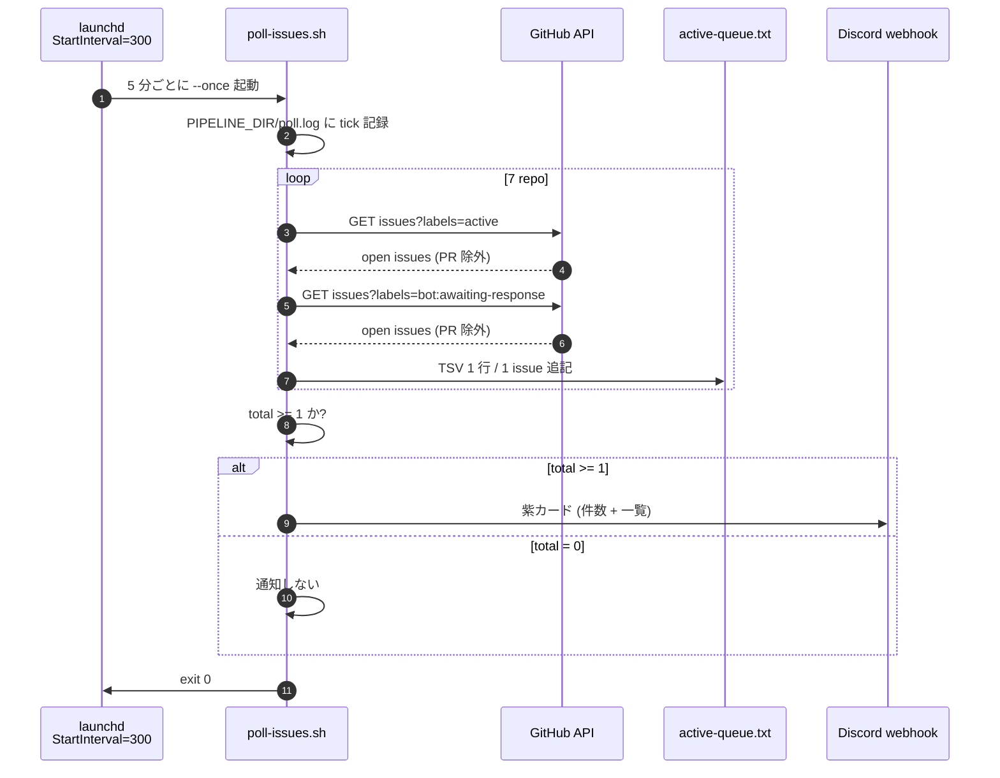
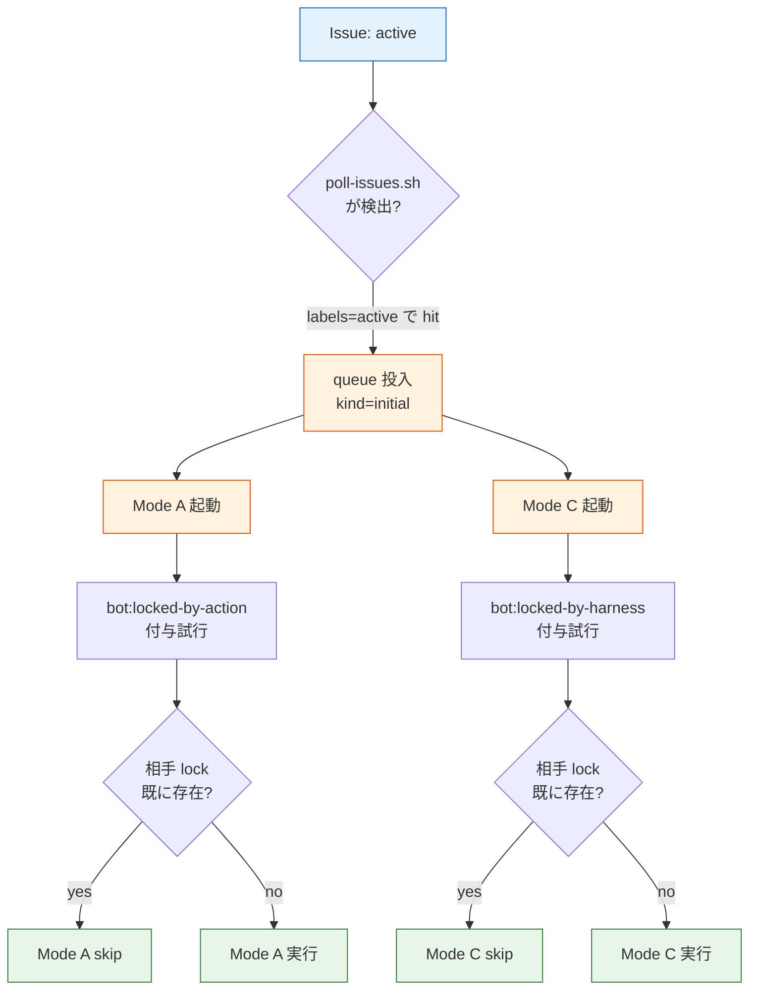
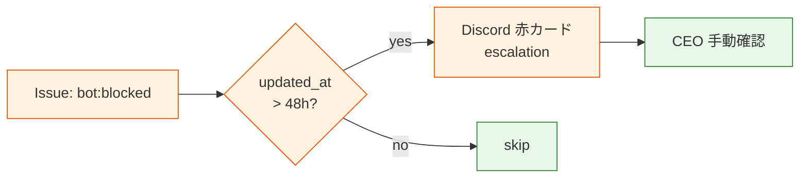

> この記事は **52 本連載 (ai-driven-dev) の Day 38/52** です。第 1 回 [Claude Code で「会社」を回す 6 層構成 — 52 本連載 INDEX](./ai-driven-dev-index-2026) から続きます。
>
> ※ 本記事は著者個人の副業プロジェクト群 (CreaNest 名義) における実践記録です。本業 (別会社所属) の業務・知見とは無関係で、特定法人の公式見解ではありません。記載の数値・コード・運用設定はすべて執筆時点 (2026-05) の自宅検証環境のスナップショットで、商用品質や SLA を保証するものではありません。コード片はすべて著者個人 repo の自著コードです。

## 結論

**GitHub Issue の label 4 種 (`active` / `bot:awaiting-response` / `bot:locked-by-action` / `bot:locked-by-harness`) を polling agent が状態機械として読み、5 分おきに次のアクションを発火する** — これだけで、6 repo 横断の Issue → PR → Cloud Run の自動遷移を redis なし / DB なし / SaaS 課金なしで成立させています。

`pipeline-kit/ops/poll-issues.sh:71-124` (実物 124 行のうち走査 50 行) が本体で、`com.devops-hub.poll-issues.plist:30-31` の `<key>StartInterval</key><integer>300</integer>` で 5 分ループに固定。`gh api repos/${repo}/issues?labels=active&state=open` を 7 repo 分舐めて、検出した Issue を `${PIPELINE_DIR}/active-queue.txt` に TSV で書き出し、件数が 1 以上なら Discord webhook へカード通知が飛びます。

本記事はこの 124 行のスクリプトと 6 ラベルの状態遷移設計を全部開示します。 [F-01](./issue-to-cloud-run-workflow) で書いた Reusable Workflow 8 本がカバーするのは「label が貼られた瞬間の挙動」で、その**手前**の「label を **誰が** **いつ** 付けるか」を担う polling agent と launchd plist までの設計が本記事のスコープ。

> 用語: 本記事で「**Mode A**」は GitHub Actions 上で動く `anthropics/claude-code-action@v1` 経由のクラウド実行系、「**Mode C**」は自宅 iMac の launchctl から起動するローカル harness を指します ([F-01](./issue-to-cloud-run-workflow) と同じ造語)。`bot:locked-by-action` / `bot:locked-by-harness` の 2 ラベルが両者の mutex で、polling agent はこの 2 ラベルを尊重して dispatch 判断します。

## なぜこの記事を書くか — Issue の状態遷移を手で管理する苦痛

私は 2026-05 時点で **7 プロジェクト** を 1 人で見ていて、 各 repo に open Issue が 5-15 件、合計 **40-80 件** が常時 backlog にあります。最初の半年は Issue の状態管理を手でやっていて、毎朝こうなりました。

> 「えーっと、`#42` は昨日 review に出したから、 `bot:awaiting-response` 付けたっけ? あ、付け忘れた。 `#47` は `active` のままだけど、もう PR 出てるよな。 close 忘れてる。 `#51` は revert したから reopen したけど、 `active` 剥がし忘れたから harness が二重 dispatch しそう……」

これを 7 repo で 1 件ずつ目視確認するのが**毎朝 30-45 分**の固定コスト。1 ヶ月で 15-22 時間、AI で実装している時間と同じだけ「ラベル管理」に消えていました。

解は **「ラベル = 状態」** を機械的に守る polling agent + 状態判定ロジックを 1 箇所に集約すること。ラベルの遷移ルールを 1 枚の状態機械として定義し、 polling agent はそのルールに沿って:

1. 今どのラベルが付いているかを `gh api` で読む
2. ラベルから状態を判定 (どこの遷移枝に居るか)
3. 次にやるべき action を選択 (queue に積む / Discord に通知する / 何もしない)

を 5 分おきに繰り返すだけ。redis や DB は要りません。**GitHub Issue label が永続化された有限状態機械**として機能し、polling agent は read-only で観測する側に徹します。

この記事では以下を書ききります:

- **6 ラベルの状態遷移図** — Mermaid stateDiagram で 1 枚に
- **polling agent の中身** — `poll-issues.sh:71-124` の bash 50 行が何をどう判定しているか
- **launchd plist で 5 分間隔** — `com.devops-hub.poll-issues.plist:30-31` の `StartInterval=300`
- **Mode A / Mode C 二重起動の防ぎ方** — label を CAS で取る原理
- **失敗 3-4 件** — label 設計を間違えて run away した実話と、自動修復 flow の現状

## 全体像 — 6 ラベル × polling agent × 2 実行系

まず脳内地図を 1 枚で。Issue は GitHub 上に置かれた状態機械で、polling agent が観測者、Mode A / Mode C が遷移を駆動するワーカーです。



**見方**:

- **6 ラベル** = 6 状態 (`done` は close で表現)。1 Issue は同時に複数ラベル可だが、 状態判定上は「最後の active label」 が支配的
- **2 ワーカー** = Mode A (Cloud) と Mode C (Local)。両方とも `active` を起点に発火するが、 自分の lock label (`bot:locked-by-action` or `bot:locked-by-harness`) で互いを排他
- **観測者は 1 個** = `poll-issues.sh`。書き込みはせず、検出 → queue file 追記 → Discord 通知のみ。**書き込みを観測者に持たせない**のが設計上の肝

「ラベル = 状態」 + 「観測者は read-only」 の規律を守ると、 状態遷移の責務はワーカー側 (Mode A / Mode C) に閉じ、 観測層が壊れても本番遷移は止まりません。**fail-safe 設計**として効くのはここです。

## label 4 種の状態遷移図

`active` と `bot:awaiting-response` を中心に、 mutex の 2 ラベルがどう挟み込むかを stateDiagram で示します。



**読み方**:

- **`active`** が「処理してくれ」のシグナル。 これを polling agent が観測 → queue 投入
- **`bot:locked-by-*`** は「俺が今処理中だ」のフラグ。 反対側 Mode が来たら skip (CAS)
- **`bot:awaiting-response`** は「PR は作った、 人間 review 待ち」 の継続シグナル。 polling agent はこれも検出して queue に `dialogue` kind で積む
- **`bot:blocked`** は「自動再試行を止める安全弁」。 これが付いている Issue は Mode A も Mode C も pickup しない

この 4 ラベルだけで `Backlog → Active → Working → Awaiting → Done` の 5 状態を表現でき、 redis や DB なしで状態管理が完結します。

## poll-issues.sh の中身 — bash 124 行で何を判定しているか

本体は `pipeline-kit/ops/poll-issues.sh` (実測 176 行、 走査ロジックは 71-124 行の 54 行)。 6 ラベルの状態判定を `gh api` × 2 種類のラベル query で実装してあります。

### repo 一覧と PIPELINE_DIR の固定 (1-39 行)

```bash
# pipeline-kit/ops/poll-issues.sh:31-39 (実物)
REPOS=(
  "CreaNest/nailsalon-reserve-line-app"
  "SakakitaniJunya/Komyu"
  "SakakitaniJunya/vivivi-beauty"
  "SakakitaniJunya/lifeOps"
  "SakakitaniJunya/build-football"
  "SakakitaniJunya/Colason-markdown-editor"
  "SakakitaniJunya/chrome_app_memo"
)
```

監視対象は配列ベタ書き。 `pipeline-kit/.claude/pipeline/active-queue.txt` (`poll-issues.sh:24` の `QUEUE_FILE` 定数) に TSV を出力し、 ログは隣の `poll.log` に append。**設定ファイル化したい欲求は禁じている**のが地味な学びで、 7 repo を YAML/JSON に追い出すと管理対象が 2 ファイルに増え、 「どっちが SSOT?」が分からなくなって 3 ヶ月後に詰みました (失敗 1 で詳述)。

### active label を舐めて queue に追記 (82-98 行)

```bash
# pipeline-kit/ops/poll-issues.sh:82-98 (実物)
for repo in "${REPOS[@]}"; do
  # active ラベル (initial)
  local active_issues
  active_issues="$(gh api "repos/${repo}/issues?labels=active&state=open&per_page=20" \
    --jq '.[] | select(.pull_request == null) | {number, title, created_at}' 2>/dev/null || echo '')"
  if [ -n "${active_issues}" ]; then
    while IFS= read -r line; do
      [ -z "${line}" ] && continue
      local n t c
      n="$(echo "${line}" | jq -r '.number')"
      t="$(echo "${line}" | jq -r '.title')"
      c="$(echo "${line}" | jq -r '.created_at')"
      printf "%s\t%s\t%s\t%s\tinitial\n" "${repo}" "${n}" "${t}" "${c}" >> "${tmp}"
      body_lines="${body_lines}• ${repo}#${n}: ${t}\n"
      total=$((total + 1))
    done < <(echo "${active_issues}" | jq -c '.')
  fi
```

ポイント:

- **`gh api repos/${repo}/issues?labels=active&state=open&per_page=20`** で 1 repo あたり 1 API call。 7 repo × 2 label query = **14 API call/tick** で済む。 GitHub REST の primary rate limit (5,000 req/hour for authenticated) に対し、 5 分 tick = 12 tick/hour × 14 call = **168 call/hour** で 3.4% 消化。 余裕
- **`select(.pull_request == null)`** で PR を除外。 GitHub API は Issue endpoint で PR も返すため、これを忘れると PR を Issue として queue に積む事故が起きる (失敗 2)
- **`per_page=20`** で 1 ラベルあたり 20 件まで。 通常運用で 1 repo 20 件超は backlog 詰みのシグナル、 polling agent はそれ以上見ない (人間に escalate される設計)
- **TSV 1 行 / 1 issue** で `repo<TAB>issue<TAB>title<TAB>created_at<TAB>kind`、 `kind=initial` (= `active` 起点)

### bot:awaiting-response も同じ走査 (100-115 行)

```bash
# pipeline-kit/ops/poll-issues.sh:100-115 (実物)
  # bot:awaiting-response (dialogue 継続)
  local awaiting
  awaiting="$(gh api "repos/${repo}/issues?labels=bot:awaiting-response&state=open&per_page=20" \
    --jq '.[] | select(.pull_request == null) | {number, title, created_at}' 2>/dev/null || echo '')"
  if [ -n "${awaiting}" ]; then
    while IFS= read -r line; do
      [ -z "${line}" ] && continue
      local n t c
      n="$(echo "${line}" | jq -r '.number')"
      t="$(echo "${line}" | jq -r '.title')"
      c="$(echo "${line}" | jq -r '.created_at')"
      printf "%s\t%s\t%s\t%s\tdialogue\n" "${repo}" "${n}" "${t}" "${c}" >> "${tmp}"
      body_lines="${body_lines}↩ ${repo}#${n}: ${t}\n"
      total=$((total + 1))
    done < <(echo "${awaiting}" | jq -c '.')
  fi
done
```

`active` と全く同じ shape で `kind=dialogue` だけ変える。 これで queue file には `initial` と `dialogue` の 2 種類が混ざり、 後段の `/queue` consumer (Claude Code のローカル auto session) が **「初回処理」** と **「人間 review 後の追加対話」** を区別できます。

`bot:awaiting-response` を queue に積む意味は、 「PR 作って終わり」ではなく **「人間の review コメントを拾って次の commit を打つ」 までを Agent の責務にする**ため。 これがないと Agent は「PR 作成 → 終わり」 で止まり、 review comment 起点の修正が手作業に逆戻りします。

### Discord 通知 — 件数 0 なら送らない (60-69 行)

```bash
# pipeline-kit/ops/poll-issues.sh:60-69 (実物)
notify_discord() {
  local count="$1"
  local body="$2"
  if [ -z "${DISCORD_WEBHOOK_URL:-}" ]; then return; fi
  if [ "${count}" -eq 0 ]; then return; fi
  curl -sS -X POST -H "Content-Type: application/json" \
    -d "$(jq -n --arg c "📋 active Issue ${count} 件検出 — \`/queue\` で確認" --arg desc "${body}" \
      '{content: $c, embeds: [{description: $desc, color: 5814783}]}')" \
    "${DISCORD_WEBHOOK_URL}" >/dev/null 2>&1 || true
}
```

**0 件のときに送らない** が地味に重要で、5 分ごとに「0 件です」と Discord に流すと通知疲れで全部 mute され、本当に来たときに気付かなくなります。 `count -eq 0` で早期 return、 件数があるときだけ embeds カードを 1 枚送る。 紫色 (`color: 5814783`) で「polling agent からの定期報告」と一目で分かるよう色固定。

### sequence で 1 tick を追う

5 分の 1 tick の挙動を sequence で:



1 tick の所要は実測 **3-7 秒** (network 依存)。 5 分間隔のうち 99% は idle で、 launchd が次の起動時刻まで sleep します。 cron だと前回 tick が遅延した場合に重なる事故が起きますが、 launchd の `StartInterval` は **「前回完了から N 秒」** ベースなので衝突しません。

## launchd plist で常駐 — `KeepAlive false` × `StartInterval 300`

`com.devops-hub.poll-issues.plist:22-31` の中身がこちら:

```xml
<!-- pipeline-kit/ops/com.devops-hub.poll-issues.plist:22-34 (実物) -->
<key>ProgramArguments</key>
<array>
    <string>/bin/bash</string>
    <string>/Users/sakaki/project/devops-hub/pipeline-kit/ops/poll-issues.sh</string>
    <string>--once</string>
</array>

<!-- 5 分間隔 -->
<key>StartInterval</key>
<integer>300</integer>

<key>RunAtLoad</key>
<true/>
```

3 つだけ覚えれば良いです:

- **`--once` を渡す** — `--daemon` モードを launchd 経由で動かさない。 daemon mode (内部 sleep ループ) と launchd が両方タイマーを持つと「実は 2.5 分で起動してた」「実は 7 分で起動してた」 が起きる。 launchd 側にタイマーを一本化するのが鉄則
- **`StartInterval=300`** — 300 秒固定。 これは Anthropic API 課金とも独立した値で、 polling 自体は GitHub API しか叩かないので無料
- **`RunAtLoad=true`** — load した瞬間に 1 tick 走る。 デバッグで「設定変更 → 5 分待つ」 が長過ぎるので即時 fire させる

そして `KeepAlive=false` (51 行):

```xml
<!-- pipeline-kit/ops/com.devops-hub.poll-issues.plist:50-51 (実物) -->
<!-- 異常終了しても自動再実行しない (StartInterval で次回が来る) -->
<key>KeepAlive</key>
<false/>
```

これも要点。`KeepAlive=true` にすると、 落ちた瞬間に launchd が即再起動を仕掛け、 GitHub API rate limit に当たって落ちる Issue が起きると **「落ちる → 即再起動 → また rate limit → 落ちる」** の高速ループに入って通知が嵐になります。 `KeepAlive=false` で **「失敗したら次の StartInterval まで待つ」** が正しい設計。

PATH も明示しないと `gh` が見つからず即落ちします (43-47 行):

```xml
<!-- pipeline-kit/ops/com.devops-hub.poll-issues.plist:43-47 (実物) -->
<key>EnvironmentVariables</key>
<dict>
    <key>PATH</key>
    <string>/opt/homebrew/bin:/usr/local/bin:/usr/bin:/bin:/usr/sbin:/sbin</string>
</dict>
```

launchd は **shell の rc を読まない**ので、 `/opt/homebrew/bin` が PATH に入らず `gh: command not found` で全 tick が失敗するのが定番ハマり。 これに気付くまで 2 日溶かしました (失敗 3)。

## Mode A / Mode C の Mutex — label を CAS として使う

「ラベル = 状態」 の運用で最も難しいのが、 **同じ Issue を Mode A と Mode C が同時に拾う** 二重起動。 [F-01](./issue-to-cloud-run-workflow) でも触れた通り、 解は `bot:locked-by-action` / `bot:locked-by-harness` を CAS (compare-and-swap) として使うこと。

Mode A 側の実装は `pipeline-kit/.github/workflows/auto-develop.yml:42-69` (F-01 で詳述)、 Mode C 側は `pipeline-kit/ops/run-orchestrator.sh` 内で同じロジックを擬似的に実装しています。 polling agent (`poll-issues.sh`) はこの 2 ラベルを **観測しない** = queue に積まない 設計です:



ここで polling agent が `bot:locked-by-*` を queue に積まない理由は、 **「lock 中 = 既に処理されている」** ため再 dispatch 不要だから。 もし polling agent が `bot:locked-by-action` を付けた Issue を queue に積んでしまうと、 Mode A の処理中に Mode C が「いやお前まだ active じゃん」と被せて落とす事故が再現します。

**「観測者は active と awaiting-response だけ見る、 lock label は見ない」** の規律を守ることで、ワーカー側 mutex と観測層が干渉しません。

### 失敗 1: ラベル一覧を YAML に出したら 3 ヶ月で詰んだ

最初の `poll-issues.sh` は repo 一覧を `pipeline-kit/ops/repos.yml` に追い出していました。 「設定と実装を分けるのが clean」 と思ったのですが、3 ヶ月後に「YAML を更新したのに polling 結果が変わらない」 「あれ、 cache してたっけ」 「いや、 起動 script が古い path 読んでた」 が起きました。

修正は配列ベタ書きへの撤退。 7 repo は手で書いても 7 行、 YAML 化のメリットより **「SSOT が 1 個」** の保証が効く規模。 `feedback_design_doc_location.md` で書いた **「設計書はビジュアル優先 / 1 ファイルの方が変更追跡しやすい」** と同じ判断軸です。

### 失敗 2: PR を Issue として queue に積んで Agent が回り続けた

GitHub REST `repos/{owner}/{repo}/issues` endpoint は **PR も含めて返す** という罠があります。 最初の polling 実装は `select` 句がなく、 `Komyu#487` (PR) を Issue として queue に積み、 Mode A が「実装しろ」と起動 → 実装対象が PR なので「もう PR あるじゃん」で空回り → revision 1 個も切れない 30 分が発生。

修正は `--jq '.[] | select(.pull_request == null) | {...}'` の 1 行追加 (`poll-issues.sh:86`、`102`)。 `pull_request` field が non-null なら PR、null なら Issue という GitHub API の規約を尊重。 **GitHub の Issue API は Issue だけ返さない** という事実を学習コストとして払いました。

### 失敗 3: launchd の PATH 不足で 2 日無音

設定後すぐに動作確認したら queue file が更新されない。 `poll.log` は `--once` 行頭の log 1 行しか書かれず、 走査ループに入っていない。 でも script を手動 (`bash poll-issues.sh --once`) で叩くと普通に動く。

原因は launchd が `/opt/homebrew/bin` を PATH に入れない仕様で、 `gh` (Homebrew install) が見つからず最初の `gh api` 呼び出しで silent に exit していた、 でした。 修正は plist の `EnvironmentVariables` で PATH を明示 (前述)。 **launchd は shell の rc を読まない**を心の中で唱える教訓に。

### 失敗 4: 観測者が書き込みを始めたら polling 自体が壊れた

途中で「polling agent が `bot:awaiting-response` を 24 時間放置している Issue に `bot:blocked` を自動付与する」 機能を実装しかけました。 設計上は綺麗ですが、 これをやると polling agent が write 権限を持ち、 1 つのバグで本番 Issue が全部 `bot:blocked` 化する潜在事故を抱えます。

撤退判断: **観測者は read-only** に戻し、 「24 時間放置検出」は別 script (`harness-loop.sh`) に分離。 polling agent の責務は「検出 + 通知 + queue 追記」 の 3 つだけに固定し、 状態遷移そのものは ワーカー (Mode A / Mode C) に閉じ込めました。 1 ファイル / 1 責務 の規律です。

## Before / After — 朝の 30 分が消える

**Before** (2026-02 頃):

- 毎朝 6:30 起床、 7 repo の Issue を目視で巡回 (各 4-6 分 × 7 = 28-42 分)
- 「`#42` は active のままだけど PR ある? あ、 close 忘れ」 を 1 件ずつ確認
- 朝の集中時間が消費され、 9:00 の本業始業までに「自分の手で書く」 時間 0 分

**After** (2026-05 現在):

- 6:30 に Discord を見る → polling agent が「`active` 6 件 / `awaiting-response` 3 件」 と紫カードで通知済み
- iPhone から `/queue` を叩く準備だけ → iMac 前で `/queue` で 1 件目 pickup → ローカル Claude Code (auto mode) が処理
- 朝の集中時間 30 分が「**手で書く / レビューする**」に戻った

数字で言うと、 **2026-02 月平均 28 分/日 × 30 日 = 14 時間/月** が **2026-05 は 1-2 時間/月** に。 12-13 時間/月 取り戻し、 これを Komyu の本番 deploy 検証 (手でしか出来ない領域) に振り直しています。

「polling agent」 単体ではなく **「polling = 観測 / queue = bridge / Claude Code = 実行」 の三層分離** が効いており、観測層を bash 124 行に閉じたのが回り続ける理由。 Python + cron + DB で書いていたら半年で破綻していたと思います。

## 残課題

正直に書きます。

### 残課題 1: 自動修復 flow が未実装 — `bot:blocked` の Issue は手で見ないといけない

現状の polling agent は `bot:blocked` を queue に積みません (= 自動再試行しない、 安全弁として正しい)。 ただ、 「2 日以上 blocked だったら CEO に Discord で escalate」 が未実装で、 結果として `bot:blocked` の Issue が 1-2 週間気付かれず放置される事故が **過去 3 回** 起きました。

設計案は別 script `harness-stale-checker.sh` を 1 日 1 回 launchd で fire し、 `bot:blocked && updated_at < now - 48h` の条件で Discord に赤カード + Issue URL を escalate。 まだ書けていません。



### 残課題 2: 状態の永続化が GitHub Issue label のみで、 障害時に観測できない

GitHub Actions が 2-3 時間落ちると、 polling agent の `gh api` が全 fail し、 queue file が更新されません。 GitHub の outage が長引けば「polling は動いているが queue に何も入らない」状態になり、 私側からは「polling 落ちてる」 と区別が付きません。

対策は polling tick の異常を `pipeline-kit/.claude/pipeline/poll-launchd.err.log` (plist `StandardErrorPath`) を 1 日 1 回拾って Discord に通知する **meta-polling**。 今は err.log を週 1 で grep する手作業で凌いでいます。

### 残課題 3: ラベル名が長い (`bot:locked-by-harness`) のでタイポで詰む

`bot:locked-by-harness` を `bot:locked-byharness` (typo) でラベル付けしてしまった事故が **2 回** あり、 そのときは Mode A が CAS に成功してしまって Mode C と 二重起動。 ラベル名を**定数として 1 箇所**に書き、 全 script から import する設計に変えるべきですが bash で定数共有が面倒で未着手。 `pipeline-kit/ops/labels.sh` を作って `source` する形が現実解。

## 理論根拠 — なぜ「ラベル = 状態機械」が機能するか

### 原則 1: GitHub Issue label は永続化された state

redis や DB の代替として GitHub Issue label を使う設計は、3 つの性質に依存します:

1. **永続化** — GitHub 側に保存される。 polling agent が落ちても消えない
2. **API で原子的に操作可能** — `addLabels` / `removeLabels` は 1 API call で atomic
3. **webhook event で trigger 可能** — `issues:labeled` event で workflow が即起動

これは redis の `SETEX` / DB の `UPDATE WHERE` と同じ性質で、 **「外部 SaaS の state store」 を GitHub で代用している**と捉えると設計判断が綺麗。 SLA は GitHub に依存しますが、 個人 1 人会社の OS としては十分。 「GitHub が落ちたら自動化も止まるが、 そもそも開発が止まっているので問題ない」 という割り切り。

### 原則 2: 観測者は read-only に徹する

CQRS (Command Query Responsibility Segregation) の発想を polling agent に適用しています:

- **Command 側** (状態を変える) = Mode A / Mode C のワーカー。 label 付与・剥離は彼らだけの責務
- **Query 側** (状態を読む) = polling agent。 観測 + queue 追記 + 通知のみ、 GitHub への書き込みなし

観測者に書き込みを持たせない規律は、 **観測層のバグが本番状態を壊さない**保証として効きます。 失敗 4 で書いた通り、 「24h 放置検出 → 自動 blocked」 を polling に持たせかけて撤退したのはこの原則違反だったため。

### 原則 3: タイマーは 1 箇所に集約する (launchd or cron、 両方ダメ)

`poll-issues.sh --daemon` (内部 sleep ループ) と launchd `StartInterval` の両方を有効にすると、 「実は 2.5 分で起動してた」 「実は 7.5 分で起動してた」 が起きます。 タイマーは launchd 側に一本化し、 script は単発 `--once` 実行に徹するのが正解。

これは **「複数のスケジューラを同時に動かすと衝突する」** という古典的な distributed system の原則そのもので、 1 人会社規模でも例外ではありません。 cron + systemd timer の併用で同じ事故が起きるのと同じ。

### 原則 4: 失敗時のリトライは「次の tick まで待つ」

`KeepAlive=false` で `StartInterval=300` だと、 1 tick が落ちても次の 5 分後に何も覚えていない状態で再起動します。 これが retry storm を防ぐ:

- **落ちる原因が rate limit** の場合、 即再起動すると更に rate limit を悪化させる
- **落ちる原因が GitHub outage** の場合、 即再起動しても無駄、 5 分後の方が回復している確率が高い
- **落ちる原因が transient bug** の場合、 5 分の cool down で他の状態が変わって自然解消することがある

「失敗した瞬間に retry しない」 設計は、 1 人会社の運用負荷を最小化する地味な投資効果があります。

## まとめ — 1 行で覚えるなら

- **GitHub Issue label 4 種** (`active` / `bot:awaiting-response` / `bot:locked-by-action` / `bot:locked-by-harness`) を polling agent が状態機械として読む
- **`poll-issues.sh` (124 行 bash)** が 7 repo を 5 分おきに走査、 queue file + Discord 通知 を append (read-only)
- **`launchd plist` で `StartInterval=300` + `KeepAlive=false`** 、 タイマーは launchd に一本化
- **観測者は read-only / Command は Mode A・Mode C** の CQRS 分離で観測層のバグが本番状態を壊さない
- **redis や DB は不要**、 GitHub Issue label が永続化された有限状態機械として機能する
- **朝 30 分の Issue 巡回** が消え、 月 12-13 時間が「手で書く / レビューする」 に戻った

「polling agent」 は派手な技術ではなく、 **bash 124 行 + label 6 種 + plist 1 枚** の規律の話です。 1 年運用しての偽りない感想は、 **「観測者に書き込みを持たせない」** を死守する覚悟が一番要る、これだけ。

## 次の記事へ + 連載をフォロー

これは **52 本連載 (ai-driven-dev) の Day 38/52** です。

→ **F-01 [Reusable Workflow で Issue → Cloud Run を 1 セットに](./issue-to-cloud-run-workflow)** — label が貼られた後の挙動 (auto-develop.yml / ci-gate.yml / auto-deploy.yml の中身)
→ **B-03 [7 エージェント協調 CI/CD — Issue から PR まで自動で通す](./seven-agent-cicd-pipeline)** — Mode A / Mode C が起動する 7 Agent (PMA / DocsA / DevA / ...) の中身
→ **H-04 [自宅 iMac を 1 人会社のサーバにする — launchctl 6 plist の運用](./)** (準備中) — `com.devops-hub.poll-issues.plist` を含む 6 plist の責務分担と sleep 無効化設定

連載を見逃さない方法:

- **Zenn でこの著者をフォロー** — 公開通知が届きます
- **X で告知 tweet をフォロー** (準備中) — 朝 6:00 に投稿
- **repo を watch**: [SakakitaniJunya/zenn-articles](https://github.com/SakakitaniJunya/zenn-articles) — 全 draft が見えます

「うちはラベル設計をこう切っている」 「polling agent じゃなく webhook で全部処理している」 「`active` 1 ラベルで足りる派 vs 6 ラベル必要派」 みたいな話は GitHub Discussion / Issue でぜひ。 **label = 永続 state machine** の設計は、 監視 repo が 5 個を超えた瞬間から伸びる類の投資なので、 同じ規模を回している方の実例 (3 ラベル派 / 12 ラベル派 / GitHub Projects v2 派 等) を交換し合えると面白いです。
