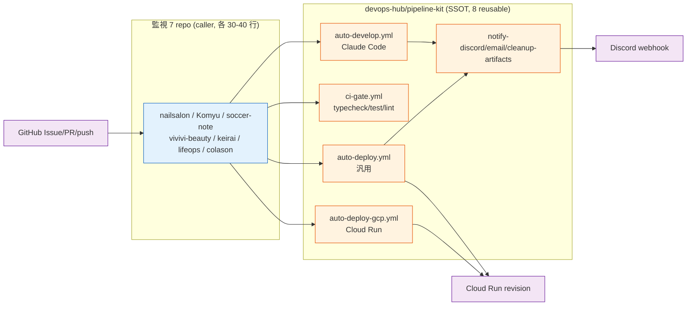
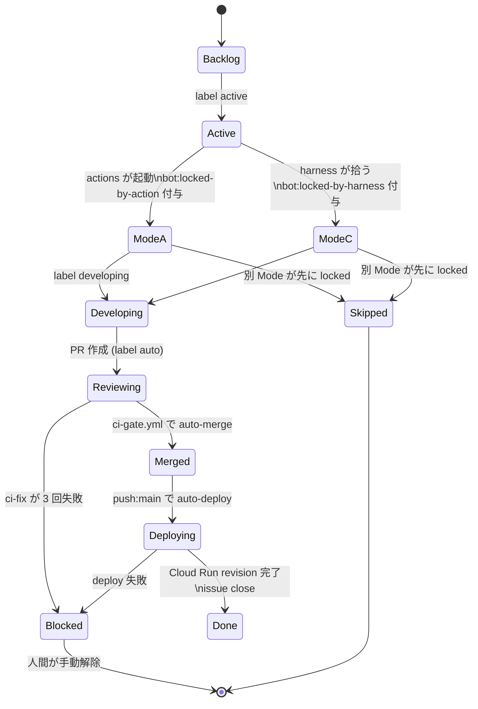
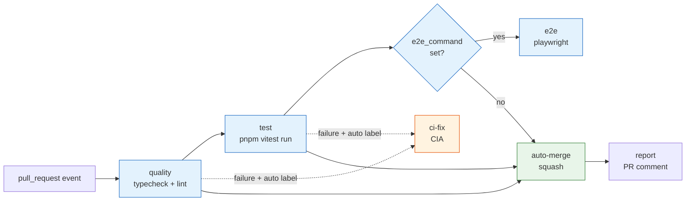
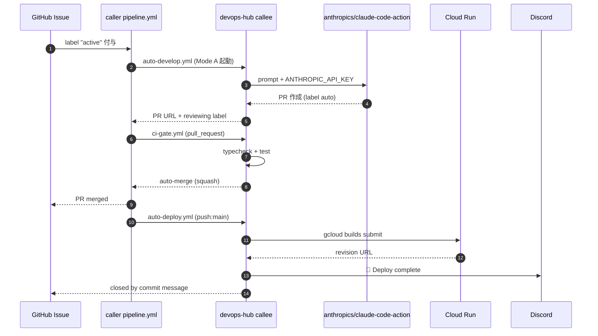

> この記事は **52 本連載 (ai-driven-dev) の Day 11/52** です。第 1 回 [Claude Code で「会社」を回す 6 層構成 — 52 本連載 INDEX](./ai-driven-dev-index-2026) から続きます。
>
> ※ 本記事は著者個人の副業プロジェクト群 (CreaNest 名義) における実践記録です。本業 (別会社所属) の業務・知見とは無関係で、特定法人の公式見解ではありません。記載の数値・コード・workflow 設定はすべて執筆時点 (2026-05) の自宅検証環境のスナップショットで、商用品質や SLA を保証するものではありません。コード片はすべて著者個人 repo の自著コードです。

## 結論

**Reusable Workflow 8 本** で、6 プロジェクト横断の **Issue → Claude Code → PR → CI → Cloud Run → Discord 通知** を 1 セットにしました。各プロジェクトの `.github/workflows/pipeline.yml` は **40 行ちょうど** (`pipeline-kit/.github/workflows/pipeline.yml:1-43` の template そのまま) で、 issue に `active` ラベルを 1 個貼れば、朝には PR が立ち、CI が緑になり、main にマージされ、Cloud Run に revision が出て、Discord に通知が飛ぶ、という流れが機械的に回ります。

本記事では `pipeline-kit/.github/workflows/` に置いた **8 本の Reusable Workflow** (`auto-develop.yml` / `ci-gate.yml` / `auto-deploy.yml` / `auto-deploy-gcp.yml` / `notify-discord.yml` / `notify-email.yml` / `cleanup-artifacts.yml` / `pipeline.yml` template) の責務分担と、 ラベル駆動 (`active` / `auto` / `bot:blocked` / `bot:locked-by-action` / `bot:locked-by-harness`) の状態遷移、そして 6 プロジェクトに同じ template を配って横断運用するときのハマりどころを書ききります。

> 用語: 本記事で「**Mode A**」と書くのは GitHub Actions 上で動く `claude-code-action` 経由のクラウド実行系、「**Mode C**」は自宅 iMac の launchctl から起動するローカル harness を指す内部造語です。両者は同じ 7 Agent ([B-03 の 7 エージェント協調 CI/CD](./seven-agent-cicd-pipeline)) を共有し、`bot:locked-by-action` / `bot:locked-by-harness` の 2 ラベルで mutex を取って二重起動を防ぎます。

## なぜこの記事を書くか

私は 2026-05 時点で **7 プロジェクト (nailsalon / keirai / komyu / vivivi-beauty / lifeops / soccer-note / colason)** を 1 人で見ていて、 各 repo に独自の workflow を書き散らかしたら最初の 1 ヶ月で破綻しました。`Komyu/.github/workflows/ci.yml` の最終形が **30 行** (実物 `Komyu/.github/workflows/ci.yml:1-30`) で済むのは、 重い処理を全部 `SakakitaniJunya/devops-hub/.github/workflows/*.yml@main` に追い出したからで、 この **「pipeline-kit を SSOT にする」** 発想が回り始めた時点で、新規プロジェクト追加コストが「workflow 1 ファイル = 40 行コピー」まで落ちました。

本記事はその 8 本の Reusable Workflow を全部開示し、ラベル駆動の状態遷移を Mermaid 3 枚 + YAML 5-6 件で示します。**「Issue を書いて寝る」と Cloud Run に revision が出る** までの配線図です。

## 全体像 — 6 プロジェクト × 8 Reusable Workflow

まず脳内地図を 1 枚で固定します。各プロジェクト repo は薄い caller workflow 1 本だけを持ち、重い処理は devops-hub に一本化されます。



**見方**:

- **caller (各 repo)** は workflow 1 本 / 40 行で済む。 中身は `uses: SakakitaniJunya/devops-hub/.github/workflows/*.yml@main` を 3-4 個並べるだけ
- **callee (devops-hub)** に Reusable Workflow 8 本が SSOT として置かれる。 各 callee は `workflow_call:` で `inputs:` / `secrets:` 契約を公開する
- **3 つの GitHub event (issues:labeled / pull_request / push:main)** が caller の 3 job をそれぞれ trigger する
- **Discord 通知** は 8 本のうち 4 本 (auto-develop / auto-deploy / auto-deploy-gcp / notify-discord) から flow する。 重複しないよう `event_type` で色分け

この **「caller 薄く callee 厚く」** が肝で、新規 repo 追加時のコピペは template 1 ファイル。本体ロジックは devops-hub の `@main` を上書きするだけで全 repo に伝播します。

## caller workflow の完全形 — 40 行で 3 event を捌く

各プロジェクトに置く caller の実物がこちらです。`pipeline-kit/.github/workflows/pipeline.yml:12-43` (template そのもの):

```yaml
# pipeline-kit/.github/workflows/pipeline.yml:12-43 (template、各プロジェクトにコピー)
name: Pipeline
on:
  issues:
    types: [labeled]
  pull_request:
  push:
    branches: [main]

jobs:
  auto-develop:
    if: github.event_name == 'issues' && github.event.label.name == 'active'
    uses: SakakitaniJunya/devops-hub/.github/workflows/auto-develop.yml@main
    secrets: inherit

  ci:
    if: github.event_name == 'pull_request'
    uses: SakakitaniJunya/devops-hub/.github/workflows/ci-gate.yml@main
    with:
      test_command: "pnpm vitest run"
      typecheck_command: "pnpm typecheck"
      lint_command: "pnpm lint"

  deploy:
    if: github.event_name == 'push' && github.ref == 'refs/heads/main'
    uses: SakakitaniJunya/devops-hub/.github/workflows/auto-deploy.yml@main
    secrets: inherit
    with:
      project_name: ${{ github.event.repository.name }}
      email_enabled: true
      artifact_cleanup_enabled: true
      artifact_keep_generations: 5
```

**3 つの job が完全に排他**で、 同じ workflow ファイル内で event 別に `if:` 分岐します。`issues:labeled active` → `auto-develop.yml`、 `pull_request` → `ci-gate.yml`、 `push:main` → `auto-deploy.yml`。

**`secrets: inherit`** は地味に重要で、 caller と callee で secret セットが一致するなら `ANTHROPIC_API_KEY` / `GCP_SA_KEY` / `DISCORD_WEBHOOK_URL` を毎回列挙せずに 1 行で済みます。

## auto-develop.yml — Claude Code が PR を立てる本体

8 本のうち最も重い callee がこの `auto-develop.yml`。 issue に `active` ラベルが貼られた瞬間に走り、 Claude Code 経由で PMA → DocsA → DevA → ... → PRA まで動かして PR を作るところまでを 1 job で完結させます。

主要部分の抜粋 (`pipeline-kit/.github/workflows/auto-develop.yml:102-165`):

```yaml
# pipeline-kit/.github/workflows/auto-develop.yml:102-160 (実物、抜粋)
- name: Claude Code - Agent Pipeline
  id: claude
  if: steps.mutex_check.outputs.skipped != 'true'
  uses: anthropics/claude-code-action@v1
  with:
    anthropic_api_key: ${{ secrets.ANTHROPIC_API_KEY }}
    prompt: |
      あなたは PMA (Pipeline Manager Agent) です。

      ## Issue #${{ steps.issue.outputs.number }}
      タイトル: ${{ steps.issue.outputs.title }}
      本文: ${{ steps.issue.outputs.body }}

      ## サイズ判定
      AC ≤ 2 単一 → small / AC ≤ 5 単一 → medium / それ以外 → large

      ## 実行手順
      1. UTC TS 付き feature ブランチ作成 (並行衝突回避):
         TS=$(date -u +%Y%m%d-%H%M%S)
         BRANCH="feat/issue-${{ steps.issue.outputs.number }}-${TS}"
         git checkout -b "$BRANCH"
      2. サイズ別チェーン (large: 仕様 → 検証 → 実装 → テスト → レビュー / medium・small: 実装 → テスト → レビュー)
      3. any 禁止 / coverage 80% / pnpm typecheck && pnpm vitest run
      4. PR 作成 (gh pr list --head で重複防止、既存なら comment、新規なら label "auto" 付与)
      5. 詰まったら bot:blocked
```

ポイント:

- **`anthropics/claude-code-action@v1`** に `prompt:` を heredoc で渡せば PMA prompt が動く。 7 Agent の役割分担は prompt 内部に閉じている ([B-03](./seven-agent-cicd-pipeline))
- ブランチ名に UTC タイムスタンプを付け、 同じ Issue を 2 回 dispatch しても `feat/issue-42-20260509-021200` で衝突しない
- PR 作成前に `gh pr list --head` で重複チェック (失敗 1 で詳述)
- `auto` ラベル付きで PR を作る → `ci-gate.yml` の auto-merge トリガーになる

### Mode A / Mode C mutex — ラベルを排他制御に使う

GitHub Actions 上の `auto-develop.yml` (Mode A) と自宅 iMac で動く launchctl harness (Mode C、 `pipeline-kit/ops/run-orchestrator.sh`) は **同じ Issue を別経路で拾える**ため、 何もしないと両方が同時発動 → 同じ branch で `non-fast-forward` で片方落ち、残った PR は commit が混ざって意味不明になる事故が連発しました。

解は **GitHub Issue label を mutex として使う** (`auto-develop.yml:42-69`):

```yaml
# pipeline-kit/.github/workflows/auto-develop.yml:42-69 (実物)
- name: Mutex - skip if Mode C holds lock
  id: mutex_check
  uses: actions/github-script@v7
  with:
    script: |
      const issue_number = ${{ steps.issue.outputs.number }};
      const live = await github.rest.issues.get({
        owner: context.repo.owner, repo: context.repo.repo, issue_number,
      });
      const labels = live.data.labels.map(l => typeof l === 'string' ? l : l.name);
      if (labels.includes('bot:locked-by-harness')) {
        core.setOutput('skipped', 'true');
        core.notice('Mode C is processing — skipping Mode A');
        return;
      }
      core.setOutput('skipped', 'false');
      // CAS: Mode A 占有 label を付与
      await github.rest.issues.addLabels({
        owner: context.repo.owner, repo: context.repo.repo, issue_number,
        labels: ['bot:locked-by-action']
      });
```

`bot:locked-by-harness` があれば Mode A は即 skip、 無ければ自分が `bot:locked-by-action` を付けてから前進する単純な CAS (compare-and-swap)。 ラベルは GitHub API 側で原子的に付与されるので race window は label 読み取り → 付与の数百 ms に圧縮できます (完全 0 ではない)。

ラベル駆動の状態遷移を 1 枚で:



「ラベル = 状態」の規律は [B-03 の 7 Agent パイプライン](./seven-agent-cicd-pipeline) と共通で、`bot:blocked` で自動再試行を止める安全弁も共有しています。

### 失敗 1: PR 重複防止を入れる前は同 Issue に PR が 3 本立った

最初の `auto-develop.yml` には重複チェックがなく、 caller workflow が retry で 3 回起動した結果、 `feat/issue-42-...-021200` / `-021800` / `-022100` の 3 ブランチで PR 3 本が並ぶ事故が起きました。 最初の PR が merge されると 2 本目以降は base conflict で止まり、reviewing label が剥がれず runner 時間を 3 倍消費。

修正は前述の `gh pr list --head` チェックと TS 混入の 2 段防御。 さらに pipeline-kit 側 concurrency guard で同 Issue の同時起動 PR を 1 本に絞り込み。 **重複防止は git 層 / GitHub API 層 / ラベル層の 3 層に重ねる**が学び。

## ci-gate.yml — 4 つの quality gate と auto-merge

`auto-develop.yml` の後は `ci-gate.yml` (`pipeline-kit/.github/workflows/ci-gate.yml:1-182`) が引き継ぎ、 5 jobs の依存グラフはこう:



主要な抜粋 — `auto` ラベル付き PR が緑になったら squash merge する仕組み (`ci-gate.yml:111-130`):

```yaml
# pipeline-kit/.github/workflows/ci-gate.yml:111-130 (実物)
auto-merge:
  needs: [quality, test]
  if: |
    success() &&
    contains(github.event.pull_request.labels.*.name, 'auto')
  runs-on: ubuntu-latest
  permissions: { contents: write, pull-requests: write }
  steps:
    - name: Auto Merge (squash)
      uses: actions/github-script@v7
      with:
        script: |
          await github.rest.pulls.merge({
            owner: context.repo.owner, repo: context.repo.repo,
            pull_number: context.payload.pull_request.number,
            merge_method: 'squash'
          });
```

`contains(github.event.pull_request.labels.*.name, 'auto')` が踏み絵で、 PRA が付ける `auto` ラベルがある PR だけ自動 squash。 人間が立てた PR には `auto` を付けないので暴走しません。

失敗時は `ci-fix` job (= CIA) が同じ workflow 内で起動 (`ci-gate.yml:73-109`、 `if:` に `failure() && contains(...labels..., 'auto') && secrets.ANTHROPIC_API_KEY != ''` を貼り、prompt で「型エラー / テスト失敗 / lint / build」のみ自動修正、環境変数や外部障害は即コメント報告)。 **ci-fix が動くのは `auto` ラベル付きのみ**が肝で、これを書かないと人間 PR にも CIA が無断 push する事故が起きます ([B-03 の失敗 4](./seven-agent-cicd-pipeline))。

### 失敗 2: ci-gate を入れる前、6 repo で CI が 6 種類

最初は各 repo の `.github/workflows/ci.yml` をコピペで作り、 nailsalon は `pnpm vitest run --coverage`、 keirai は `npm test`、 komyu は `pnpm test:ci` と書き方の揺れが残り、半年後に「typecheck の Node version は 18 / 20 / 22 のどれが正解?」が分からなくなりました。

修正: `ci-gate.yml` の `inputs:` で `test_command` `typecheck_command` `lint_command` `e2e_command` `node_version` を全部パラメータ化 (`ci-gate.yml:4-19`)。 default は Komyu に揃え (`pnpm vitest run` / `pnpm typecheck` / `pnpm lint` / Node 22)。

```yaml
# pipeline-kit/.github/workflows/ci-gate.yml:4-19 (実物)
inputs:
  test_command:
    type: string
    default: "pnpm vitest run"
  typecheck_command:
    type: string
    default: "pnpm typecheck"
  lint_command:
    type: string
    default: "pnpm lint"
  e2e_command:
    type: string
    default: ""
  node_version:
    type: string
    default: "22"
```

`Komyu/.github/workflows/ci.yml` 自体は 30 行で、 重い処理は `pipeline-kit` に追い出してあるため、 改修したい時は devops-hub 1 ファイル直すだけで全 6 repo に伝播。 **これが「pipeline-kit を SSOT にする」の本質的な投資効果**です。

## auto-deploy.yml — 汎用と GCP 専用の 2 系統

デプロイ要件は repo ごとに散らばるので 2 系統に分けています:

1. **`auto-deploy.yml`** (`pipeline-kit/.github/workflows/auto-deploy.yml:1-161`) — 汎用版。 `deploy_command` 文字列を受けて実行 (Vercel / Firebase Hosting / Render 任意先)
2. **`auto-deploy-gcp.yml`** (`pipeline-kit/.github/workflows/auto-deploy-gcp.yml:1-103`) — Cloud Build / Cloud Run 専用。 `deploy_config` で cloudbuild.yaml を指定し `gcloud builds submit` を流す

ポイント:

- `if: secrets.GCP_SA_KEY != ''` で GCP 不要 repo は auth step を skip。 secret 有無の分岐は callee 側で `secrets:` を `required: false` 指定が前提 (`auto-deploy.yml:23-39`)
- `outputs.deploy_status` で deploy 結果を caller に返却 (`auto-deploy.yml:44-47`)。 notify-email / cleanup-artifacts の condition に使う
- Discord 通知は callee 内に閉じる。 caller が `project_name` と `event_type` だけ知れば良い形のほうが綺麗

GCP 専用版の本体は `gcloud builds submit` 直書き (`auto-deploy-gcp.yml:29-34`):

```yaml
# pipeline-kit/.github/workflows/auto-deploy-gcp.yml:29-34 (実物)
- name: Deploy via Cloud Build
  run: |
    gcloud builds submit \
      --config=${{ inputs.deploy_config }} \
      --substitutions=SHORT_SHA=$(git rev-parse --short HEAD) \
      .
```

`SHORT_SHA` substitution を渡すと Cloud Run の image tag に commit SHA が刻まれ、**revision XXX がどの commit か gcloud だけで遡れる**ようになります。

### 失敗 3: pnpm v10 force-legacy-deploy 罠で 1 週間 Cloud Run に出なかった

Komyu monorepo (`packages/ui-*` を含む pnpm workspace) を Cloud Run 化した直後、 `gcloud builds submit` が `pnpm install --frozen-lockfile` で `Cannot resolve workspace dependencies` を吐いて落ち続けました。 ローカルでは pnpm v10 で素通りするのに CI だけ失敗、 というやつです。

原因は 3 つ重なっていました (DEC-20260505-06):

1. `force-legacy-deploy` flag を `package.json` の `pnpm.config` から外していた
2. `packages/ui-*` の `COPY` step が Dockerfile から漏れていた
3. `.gcloudignore` blacklist で `packages/` 配下が無視されていた

修正後、revision `komyu-00064-2n5` で初めて本番反映できました。 学びは **Reusable Workflow を SSOT にしても、各 repo の Dockerfile / .gcloudignore は個別で踏むので、 callee に閉じ込めきれない泥は残る** という割り切り。「caller 側に必要な調整チェックリスト」を別途 docs 化する方針に切り替えています。

## auto-deploy のトリガーとハンドオフ

caller の `deploy:` job は `push:main` で起動するので、 PR auto-merge → main push → deploy が連鎖します。 sequence で書くと:



1 回の label 操作から **4 つの workflow run が連鎖** (issues:labeled → `auto-develop.yml` → pull_request → `ci-gate.yml` → push:main → `auto-deploy.yml` → 任意で `notify-email.yml` / `cleanup-artifacts.yml`)。

Discord 通知はこの 4 段階それぞれで色分けカードが飛びます (`notify-discord.yml:33-44` の event_type → color マッピング):

```yaml
# pipeline-kit/.github/workflows/notify-discord.yml:33-44 (実物)
case "${{ inputs.event_type }}" in
  pipeline_start) COLOR=15773518; EMOJI="🟡" ;;
  pr_created)     COLOR=6012126;  EMOJI="🔵" ;;
  ci_passed)      COLOR=6076508;  EMOJI="🟢" ;;
  ci_failed)      COLOR=14308447; EMOJI="🔴" ;;
  deploy_success) COLOR=2856274;  EMOJI="🚀" ;;
  deploy_failed)  COLOR=14308447; EMOJI="🔴" ;;
  issue_closed)   COLOR=7111485;  EMOJI="✅" ;;
  escalation)     COLOR=16736587; EMOJI="🛑" ;;
esac
```

朝、Discord を見ると Issue 1 件あたりカードが 4 つ縦に並び、 黄→青→緑→ロケットの順なら成功、 どこかで赤が出ていれば人間が見るべき issue、と一目で分かるようにしてあります。

### 失敗 4: Issue close を deploy 成功時にやったら revert PR で issue が close され続けた

`auto-deploy-gcp.yml:80-103` の `Close Linked Issues` step (deploy 成功時に commit message の `#NNN` を close) が、 1 度 revert PR を merge したときに動き、 `feat: ... (#42)` commit が再 deploy されたタイミングで Issue #42 が**閉じられた後にもう一度** close API を呼ばれ、 GitHub timeline に冗長な `state: 'closed'` 遷移が残って通知が二重に飛びました。

修正案は「PR body の `Closes #NNN` を GitHub 側に任せる」 default 動線への撤退で、 `Close Linked Issues` step は順次廃止予定 ([残課題 1](#残課題))。

## notify-email / cleanup-artifacts — 補助 callee

残り 2 callee は `auto-deploy.yml:132-160` から `needs: deploy` で連鎖呼び出しされる補助役:

- **`notify-email.yml`** — SMTP メール通知 (vivivi-beauty 等の法人向けのみ)。 `MAIL_*` `SMTP_*` 6 secret 必要
- **`cleanup-artifacts.yml`** — workflow artifact を `keep_generations` (default 5) 世代だけ残し削除。 artifact 90 日保持に頼ると storage 課金が膨らむため強制 cleanup

cleanup-artifacts は **artifact 名でグルーピング → 各グループで最新 N 世代を残す** のが肝で、 グルーピングしないと `coverage-2026-05-08` `coverage-2026-05-09` ... が全部別 artifact 扱いになり、「最新 5 個」が事実上全保持に化けます (`cleanup-artifacts.yml:34-65`)。

## Before / After — caller 厚く callee 散らかす から caller 薄く callee 集約 へ

最初に書いていた CI/CD は各 repo にベタ書きで、 3 つの job (ci / deploy / cleanup) を 1 ファイル 80 行で各 repo にコピペしていました。 結果 **6 repo で node-version / cloudbuild.yaml path / Discord color code が微妙にズレ**、 3 ヶ月で誰も全体を把握できなくなりました。

**After** は前述の `pipeline.yml` template (40 行) を全 caller に配るだけ。 caller は 6 repo 全 30-40 行、 callee 8 本は devops-hub 1 箇所に集約。 **Node 18 → 22 / Discord color / cleanup 世代数 — 修正箇所は devops-hub の 1 ファイル**で済みます。 「caller 薄く callee 集約」は monorepo 派生の SSOT 戦略を multi-repo に応用した形で、 **6 repo 横断運用で 3 ヶ月以上回らないなら間違いなくこっちに倒すべき**、というのが 1 年後の偽りない感想です。

## 残課題

正直に書きます。

### 残課題 1: deploy 後の Issue close 動線が壊れている

`auto-deploy-gcp.yml:80-103` の `Close Linked Issues` は revert PR との相性が悪く、廃止して PR body の `Closes #NNN` だけで GitHub 純正動線に任せたい。 現状は revert 時に「issue を手動 reopen」運用。 また Reusable Workflow を改修するとき `@v1` 等の version pin を打ち、caller 側 `@main` から `@v1.0.0` に切り替える規律化が必要 (今は全 caller が `@main` 直参照で伝播事故リスクあり)。

### 残課題 2: auto-merge が branch protection と二重ガード

`ci-gate.yml:111-130` の auto-merge は PR 作者権限で squash merge する実装ですが、main branch の branch protection が「require 1 approval」を要求するため、 bypass token を持つ repo でしか動かず、 持っていない vivivi-beauty 等では PR が緑のまま積み残ります。 公式の `auto_merge` (enableAutoMerge mutation) に切り替えれば素直に書けるはず。

### 残課題 3: notify-discord.yml が呼ばれていない

8 本目の `notify-discord.yml` は callee として独立しているのに、 現状 `auto-develop.yml` / `auto-deploy.yml` 内で個別に curl を書いているため呼ばれていません (= 重複実装)。 抽出して 1 本化したいが、secret 引き渡しの bridging が面倒で未着手。「Reusable に切るほど共通化メリットが出るか?」を慎重に判断したい部分です。

## 理論根拠 — なぜ Reusable Workflow を SSOT にするのが効くか

### 原則 1: Single Source of Truth

Reusable Workflow の本質は **「呼び出し側が薄い参照になり、 修正は callee 1 箇所で済む」**。 caller を厚く書くと修正コストが repo 数に線形、callee に集約すれば O(1)。 GitHub Actions に限らず Terraform module / Helm chart / pipeline DSL すべてに共通する原則で、 **「分岐は inputs で吸収、本体は 1 箇所」** が黄金律。

### 原則 2: Label を State Machine の遷移トリガーにする

`active` `auto` `bot:blocked` `bot:locked-by-action` `bot:locked-by-harness` `developing` `reviewing` の 7 ラベルが Issue の状態を表現します。 ラベルは GitHub API で原子的に付け外しでき、 webhook event (`issues:labeled`) で workflow trigger に直結。 redis や DB を立てずとも、 **GitHub Issue label が永続化された有限状態機械**として使える、というのが本記事で最も伝えたい設計原則。

### 原則 3: Mutex は API 層で取り、 git 層では取らない

Mode A と Mode C の二重起動は git の branch lock や lockfile では防げません (異なる VM / 異なる時刻で動く)。 GitHub Issue label を CAS に使えば、 単一の真実を 2 つの実行系が共有でき、 race window を「label 読み取り → 付与の数百 ms」に圧縮できる。 完全 race-free ではないが、 重複起動された 2 本目が「label が既にある」を検出して skip するため、最悪でも 1 つは前進する **fail-safe** に倒せています。

この 3 原則を守ると、「Issue → Cloud Run の自動化」は **特別な CI/CD ライブラリ不要**、 GitHub Actions 標準 + `anthropics/claude-code-action@v1` + ラベル設計だけで動く。 devops-hub の Reusable Workflow 8 本は合計 **約 670 行** (`wc -l pipeline-kit/.github/workflows/*.yml` 実測 671 行)、 caller template は **40 行**。これだけで 6 プロジェクト横断の Issue → PR → Cloud Run → Discord が 1 セットになります。

## まとめ — 1 行で覚えるなら

- Reusable Workflow **8 本** で 6 プロジェクト横断 Issue → Cloud Run を 1 セットに
- caller は **40 行**、 callee は約 **670 行** (devops-hub に集約)
- 3 event (issues:labeled / pull_request / push:main) を 1 caller で捌き、 各 job は `if:` 分岐で排他
- **Mode A / Mode C mutex は GitHub label** で取る (`bot:locked-by-action` / `bot:locked-by-harness`)
- `auto` ラベル PR は ci-gate.yml が緑になり次第 squash auto-merge → main push が auto-deploy.yml → Cloud Run
- 「caller 薄く callee 集約」は SSOT 戦略の multi-repo 応用、 6 repo 以上なら最初から倒すべし

「Issue → Cloud Run」は派手な技術ではなく、 **Reusable Workflow に集約 / ラベルで状態遷移 / mutex も label** という規律の話です。 1 年運用しての偽りない感想として、 **callee に集約したら caller を絶対太らせない** という規律を 1 人で守り続ける覚悟が一番要ります。

## 次の記事へ + 連載をフォロー

これは **52 本連載 (ai-driven-dev) の Day 11/52** です。

→ **F-04 [auto label と PR auto-merge の運用設計](./)** (準備中) — 本記事の `auto` ラベルと branch protection の bypass を詳述
→ **B-03 [7 エージェント協調 CI/CD — Issue から PR まで自動で通す](./seven-agent-cicd-pipeline)** — auto-develop.yml の中身 (PMA / DocsA / DevA / ...) の設計
→ **A-03 [Cloud Run × pnpm v10 monorepo の地雷集](./)** (準備中) — auto-deploy-gcp.yml で踏んだ force-legacy-deploy / .gcloudignore / packages COPY の 3 罠を完全解説

連載を見逃さない方法:

- **Zenn でこの著者をフォロー** — 公開通知が届きます
- **X で告知 tweet をフォロー** (準備中) — 朝 6:00 に投稿
- **repo を watch**: [SakakitaniJunya/zenn-articles](https://github.com/SakakitaniJunya/zenn-articles) — 全 draft が見えます

「うちの Reusable Workflow はこう切っている」「caller / callee の境界をこっちに引いた方がワークするぞ」みたいな話は GitHub Discussion / Issue でぜひ。 **8 本の callee 構成と labels = state machine の設計**は repo 規模が増えれば増えるほど伸びる類の投資なので、 5 repo 以上回している方の実例 (3 callee 派 / 12 callee 派 / GitLab CI 派 等) を交換し合えると面白いです。
