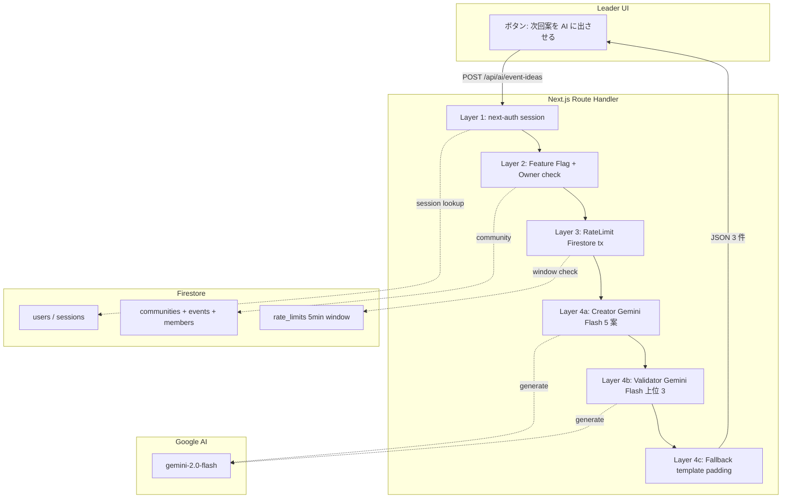
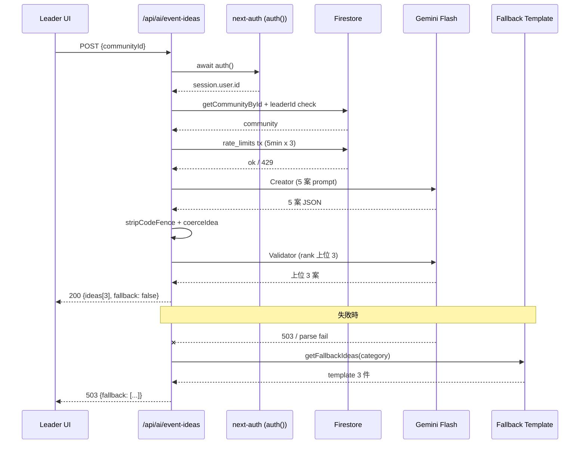
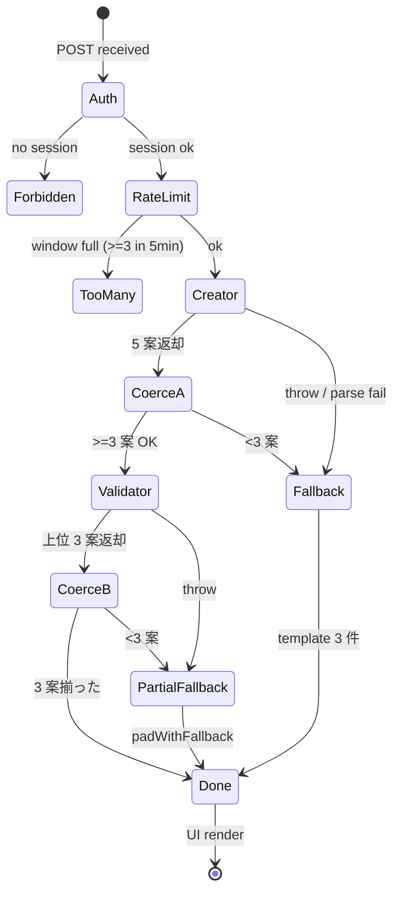
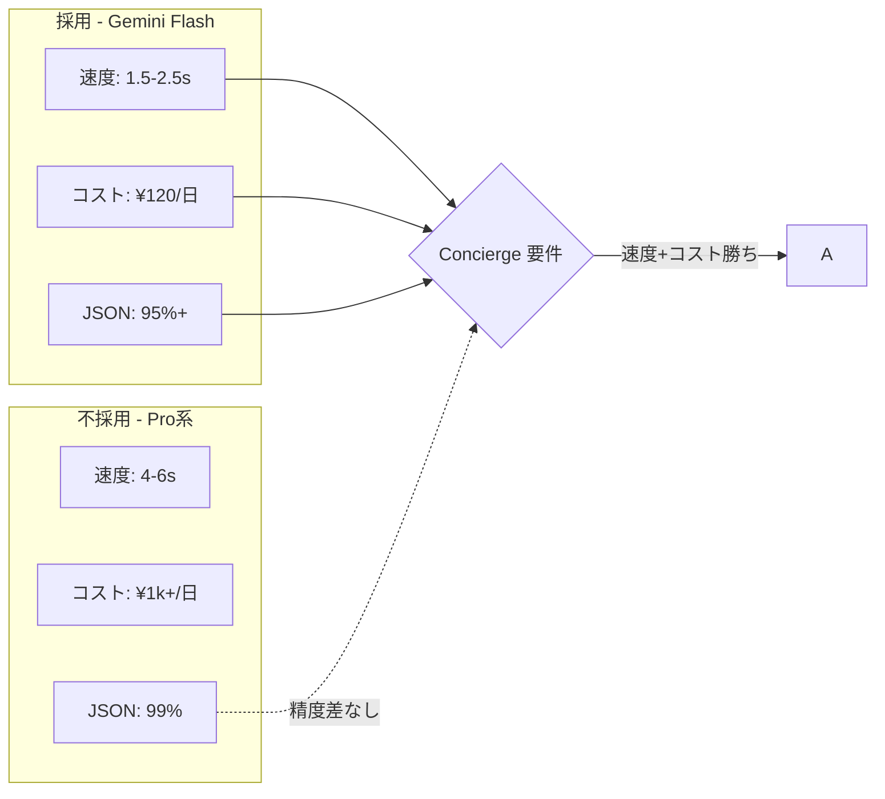

> **Disclaimer**: 本連載は著者が**個人 (副業)** で運営する小規模プロジェクト群 (CreaNest 名義) の技術記録です。所属組織・本業の業務内容とは一切関係ありません。記載の数値・構成は執筆時点 (2026-05) の自宅検証環境のスナップショットであり、商用品質や SLA を保証するものではありません。

## 結論

Komyu の AI Concierge は **next-auth 5.0 + Firestore + Gemini 2.0 Flash の 3 点**で 1 人開発できました。Cloud Run revision 64 まで 2 ヶ月で到達し、Leader が「次のイベント案を 3 つ出して」とボタンを押せば、コミュニティ文脈 (members / past events / interests) を Firestore から読んで Gemini に投げ、**Creator → Validator → RateLimiter → Fallback の 4 層**を通って UI に必ず 3 件のカードが返るところまで動いています。

技術選定は地雷だらけで、特に **next-auth 5.0 (beta) と Firestore Adapter の同居が JWT 戦略強制**だったり、**Gemini Flash が markdown ラップで JSON parse を破壊**したり、**Cloud Run の水平スケールで in-memory Rate Limit が破綻**したりと、3 点セット同士の相性で踏み抜く罠が連発しました。

本記事では Komyu (`src/auth.ts` / `src/lib/ai-concierge/` / `src/app/api/ai/event-ideas/`) の実コードを引用しながら、

- **next-auth 5.0**: Credentials + Google OAuth 同居、JWT 戦略固定の理由
- **Firestore (`@google-cloud/firestore`)**: Adapter / RateLimit / Context 取得の 3 用途
- **Gemini 2.0 Flash**: Creator (5 案生成) + Validator (上位 3 案選定) の 2 段
- **4 層 wrapper**: 認証 → RateLimit → Creator → Validator → Fallback

を 1 つの呼び出しパスに串刺しにする構成を file:line で示します。Day 45/52、後半戦 J-02 の本丸です。

> 用語: **AI Concierge** = Komyu の Leader 向け機能で、コミュニティ文脈から「次回イベント案 3 つ」を Gemini で生成する。Creator (5 案) + Validator (上位 3 案) の 2 段で、各段独立に Fallback できる構造 (詳細は I-01)。

## 問題 — AI Concierge を 1 人で作るのは技術選定が地雷だらけ

「コミュニティ運営者がボタンを押すと AI が次回イベント案を出してくれる」機能を、Next.js 16 + Vercel/Cloud Run + Firestore + 何らかの LLM で 1 人で立ち上げる、というのが Komyu の出発点でした。素直に書けば **3 ファイル** で済むのですが、実際は以下を 2 ヶ月で踏み抜きました。

- **5/2 朝**: next-auth 5.0 (beta) + Firestore Adapter で **Credentials Provider が動かない**。`Email/Password` での login が `Configuration` エラーで全 Leader 弾かれる。
- **5/2 夕**: Gemini に投げて返ってきた JSON を `JSON.parse` したら **markdown ラップ (` ```json ... ``` `)** で throw、UI 白画面。
- **5/3**: Firestore SDK を `firebase-admin` で書いていたら **L1 制約 C-017** に引っかかった (純 GCP 統一方針で `@google-cloud/firestore` 強制)。`firebase-admin` の auth/storage 機能を使っていない箇所まで全部書き直し。
- **5/4**: Rate Limit を `const buckets = new Map<string, number[]>()` で書いたら **Cloud Run 同時インスタンス 2 個で破綻**。各インスタンスが独立 Map を持つので「窓 1 = 3 回 × 2 = 6 回」撃てる。
- **5/5**: Gemini が `confidence: "high"` (string) を返してきて UI の sort が NaN で壊れる。型強制ゼロだと LLM の機嫌で UI が死ぬ。
- **5/6**: タイトル 200 字で返ってきてカードレイアウト崩壊。`title.slice(0, 20)` を後段で必ずやる必要があった。
- **5/9**: Cloud Run revision 60 系で **`AUTH_TRUST_HOST` 永続化忘れ**。session が `localhost:3000` を redirect URI として使い続けて prod で session 失効連発。

つまり、**「next-auth × Firestore × Gemini を 3 点で組む」と、3 種類のレイヤーで別々の罠を踏む**。1 人で 2 ヶ月のうち、純粋に機能を書いていた時間は半分くらいで、残り半分は技術選定の地雷踏み抜きでした。これを解くため、**4 層 wrapper (Auth + RateLimit + Creator/Validator + Fallback)** を必ず通す API パイプラインに組み替えました。



3 点セット (next-auth / Firestore / Gemini) は**矢印の方向にしか繋がない**のがコツで、`auth.ts` から直接 Gemini を叩いたり、orchestrator から session を読みに戻ったりすると地雷を踏みます。

## 解法 — next-auth 5.0 + Firestore + Gemini を 1 パスで通す

### 1. next-auth 5.0 — Credentials + Google OAuth 同居 + JWT 戦略固定

Komyu は **Email/Password** (Credentials) と **Google OAuth** の 2 系統認証で、next-auth 5.0 (beta) を採用しています。実装は `src/auth.ts:1-90` (一部抜粋)。

```typescript
// src/auth.ts:1-32
import NextAuth from "next-auth";
import Credentials from "next-auth/providers/credentials";
import Google from "next-auth/providers/google";
import { FirestoreAdapter } from "@auth/firebase-adapter";
import { getFirestoreAdmin } from "@/common/firestore-admin";
import { upsertGoogleUser, verifyCredentials } from "@/common/users";

// Credentials プロバイダ利用時は JWT セッション固定 (next-auth v5 制約)
const useFirestoreAdapter = process.env.USE_FIRESTORE_AUTH === "true";

export const { handlers, signIn, signOut, auth } = NextAuth({
  adapter: useFirestoreAdapter ? FirestoreAdapter(getFirestoreAdmin()) : undefined,
  session: { strategy: "jwt" },
  trustHost: true,
  providers: [
    Credentials({
      name: "Email/Password",
      credentials: {
        email: { label: "メールアドレス", type: "email" },
        password: { label: "パスワード", type: "password" },
      },
      async authorize(credentials) {
        const email = credentials?.email;
        const password = credentials?.password;
        if (typeof email !== "string" || typeof password !== "string") return null;
        return await verifyCredentials(email, password);
      },
    }),
    Google({
      clientId: process.env.GOOGLE_CLIENT_ID!,
      clientSecret: process.env.GOOGLE_CLIENT_SECRET!,
    }),
  ],
  // ...
});
```

設計判断は 4 つあります。

1. **`session: { strategy: "jwt" }` 固定** — Credentials Provider を有効化すると next-auth 5.0 は **adapter の database session を強制無効化**します。このルールに気づかず database session で実装すると login 後に session が消える「無限 login ループ」を踏みます (5/2 朝事故)。
2. **`adapter` は環境変数で切替** — 開発時は adapter を切って JWT のみ、本番に近い検証は `USE_FIRESTORE_AUTH=true` で Adapter を有効にする。OAuth account の linking は Adapter が必要だが、Credentials は Adapter なしでも動くので**両立可能な構成**にしました。
3. **`trustHost: true`** — Cloud Run の URL が `komyu-933992653457.asia-northeast1.run.app` のように動的なので、これを付けないと `AUTH_TRUST_HOST` env と二重管理になり session が失効します。これは memory `feedback_komyu_auth_url_pin` の通り、project-number 形式の URL でしか動かないので最初にハマる罠でした。
4. **Google 初回 login は手動 upsert** — `events.signIn` で `upsertGoogleUser` を呼んで `users` コレクションに自動登録。Adapter を切っているので `createUser` 経由ではなく自前で書く必要があります。

```typescript
// src/auth.ts:38-58
events: {
  async signIn({ user, account }) {
    if (account?.provider !== "google") return;
    if (!user?.email) return;
    try {
      const fallbackName = user.email.split("@")[0] ?? "user";
      await upsertGoogleUser({
        email: user.email,
        name: user.name ?? fallbackName,
        image: user.image ?? undefined,
      });
    } catch (e) {
      console.error("[auth.events.signIn] upsertGoogleUser failed", e);
    }
  },
},
```

これで「Google login 初回でも `users` doc が作られて、Concierge から `community.leaderId === user.id` で照合可能」という契約が閉じます。

### 2. Firestore — 3 用途を `@google-cloud/firestore` 1 本で

Komyu の Firestore は **`@google-cloud/firestore` のみ**で書いています (`firebase-admin` 禁止、L1 制約 C-017 / 純 GCP 統一)。3 用途あります。

| 用途 | コレクション | 主な操作 |
|---|---|---|
| 認証 (Adapter) | `users`, `accounts`, `sessions` (任意) | next-auth が読み書き |
| ドメインデータ | `communities`, `events`, `members` | Concierge が context 構築で read |
| Rate Limit | `rate_limits` | Transaction で read-modify-write |

Concierge から見ると Firestore は **「session lookup → context build → rate-limit window write」** の 3 アクションにすぎません。`getFirestoreAdmin()` は `@/common/firestore-admin` で 1 箇所に閉じ込めて、`new Firestore({ projectId, preferRest: true })` で初期化しています。`preferRest: true` は memory `project_yomi_note_cloud_run` で書いた通り、Cloud Run の cold start で gRPC が刺さる罠を回避するために必須です。

context 構築は `src/lib/ai-concierge/context.ts:5-44` (抜粋)。

```typescript
// src/lib/ai-concierge/context.ts:5-44
export async function buildContext(communityId: string): Promise<EventContext | null> {
  const community = await getCommunityById(communityId);
  if (!community) return null;

  const pastEvents = await getEventsForCommunity(communityId);
  const recent = pastEvents.slice(-10);

  const pastEventsSummary = recent.length > 0
    ? recent.map((e) => `- ${e.date} "${e.title}" (${e.participants.length}人参加)`).join("\n")
    : "(過去イベントなし)";

  const members = community.members;
  const withAge = members.filter((m) => typeof m.age === "number");
  const avgAge = withAge.length > 0
    ? Math.round(withAge.reduce((s, m) => s + (m.age ?? 0), 0) / withAge.length)
    : null;

  const interestCount = new Map<string, number>();
  for (const m of members) {
    for (const i of m.interests) {
      interestCount.set(i, (interestCount.get(i) ?? 0) + 1);
    }
  }
  const topInterests = Array.from(interestCount.entries())
    .sort((a, b) => b[1] - a[1])
    .slice(0, 8)
    .map(([i]) => i);

  return {
    communityId: community.id,
    communityName: community.name,
    category: community.category,
    tags: community.tags,
    area: community.area,
    memberCount: community.memberCount,
    avgAge,
    topInterests,
    pastEventsSummary,
    today: new Date().toISOString().slice(0, 10),
  };
}
```

ポイントは **「Firestore へのクエリは 2 回のみ」** に絞っていること (`getCommunityById` + `getEventsForCommunity`)。LLM プロンプトを組むためにあれもこれも JOIN して読みに行くと、Cloud Run の cold start + Firestore 連続 read で 1 回 5 秒超えになります。Komyu では **「context は 2 query 以内」** をルール化して、members や interests は `community` doc の subfield に sub-array で持たせて 1 read で取れるスキーマに寄せています。

### 3. Gemini 2.0 Flash — Creator + Validator の 2 段

LLM 呼び出しは `src/lib/ai-concierge/creator.ts:1-83`。Gemini SDK (`@google/generative-ai`) 1 本で書いています。

```typescript
// src/lib/ai-concierge/creator.ts:1-12
import { GoogleGenerativeAI } from "@google/generative-ai";
import type { EventContext, EventIdea } from "./types";
import { SYSTEM_CREATOR } from "./prompts/system-creator";
import { getCategoryHint, getCategoryDefaultTime } from "./prompts/categories";

const MODEL_ID = "gemini-2.0-flash";

function getModel() {
  const genAI = new GoogleGenerativeAI(process.env.GEMINI_API_KEY ?? "");
  return genAI.getGenerativeModel({ model: MODEL_ID, systemInstruction: SYSTEM_CREATOR });
}
```

`gemini-2.0-flash` を選んだ理由は 3 つ。

1. **応答速度**: 5 案生成 + 上位 3 選定の 2 回呼び出しで合計 1.5-2.5 秒。Pro 系だと 4-6 秒で UI 体感が悪い。
2. **コスト**: input/output 共に最安レート、5 月 1 週で **¥120/日** (検証環境、~80 セッション)。
3. **JSON 安定性**: `systemInstruction` で「JSON 配列 5 件のみ返せ」と制約すれば 95%+ で従う。残り 5% は後段の coercer で吸収。

呼び出し本体は同ファイル `66-83` 行 (抜粋):

```typescript
// src/lib/ai-concierge/creator.ts:66-83
export async function generateEventIdeas(ctx: EventContext): Promise<CreatorResult> {
  const defaultTime = getCategoryDefaultTime(ctx.category);
  try {
    const model = getModel();
    const resp = await model.generateContent(buildUserPrompt(ctx));
    const text = stripCodeFence(resp.response.text());
    const parsed: unknown = JSON.parse(text);
    if (!Array.isArray(parsed)) return { ideas: [], ok: false };
    const ideas: EventIdea[] = [];
    for (const item of parsed) {
      const idea = coerceIdea(item, defaultTime);
      if (idea) ideas.push(idea);
    }
    return { ideas, ok: ideas.length >= 3 };
  } catch {
    return { ideas: [], ok: false };
  }
}
```

設計判断:

- **`ok: ideas.length >= 3`** で「3 件揃ったか」を呼び出し元に伝える契約。throw せず boolean を返すのは、orchestrator 側で fallback に切替えるためです。
- **`stripCodeFence` + `coerceIdea` の 2 段**で markdown ラップと型崩れを後段で吸収。プロンプトで「JSON のみ」と書いても 1-2% は崩れるので、信用しない前提で書きます (詳細は I-01)。
- **`systemInstruction` を `getModel()` に固定**。`generateContent` 呼び出しごとに system 文を組み立てると prompt cache が効きません。

Validator (上位 3 案選定) は別ファイル `validator.ts` で、Creator が出した 5 案を Gemini に再投入して `evaluatedIdeas` (各案に score / rationale を付与) を返してもらい、score 上位 3 件を選びます。Validator 自身が落ちても Creator の dedupe 結果を返すので連鎖失敗しません (I-01 失敗 3 参照)。

### 4. 4 層 wrapper — POST /api/ai/event-ideas の全コード

エンドポイントは `src/app/api/ai/event-ideas/route.ts:1-67`。**Layer 1 (auth) → Layer 2 (feature flag + owner) → Layer 3 (rate limit) → Layer 4 (orchestrate + fallback)** の順で必ず通します。

```typescript
// src/app/api/ai/event-ideas/route.ts:1-67
import { NextResponse } from "next/server";
import { auth } from "@/auth";
import { getCommunityById } from "@/common/communities";
import { orchestrateEventIdeas } from "@/common/ai-concierge";
import { checkAndRecord } from "@/common/ai-concierge/rate-limit";
import { isAiEventIdeasEnabled } from "@/common/feature-flags";
import { getFallbackIdeas } from "@/common/ai-concierge/fallback";

export async function POST(request: Request) {
  // Layer 1: next-auth session
  const session = await auth();
  const userId = session?.user?.id;
  if (!userId) {
    return NextResponse.json({ error: "unauthorized" }, { status: 401 });
  }

  // Layer 2a: Feature Flag
  const enabled = await isAiEventIdeasEnabled(userId);
  if (!enabled) {
    return NextResponse.json({ error: "feature disabled" }, { status: 403 });
  }

  // body validation
  let body: { communityId?: unknown };
  try {
    body = (await request.json()) as { communityId?: unknown };
  } catch {
    return NextResponse.json({ error: "invalid json" }, { status: 400 });
  }
  const communityId = typeof body.communityId === "string" ? body.communityId : "";
  if (!communityId) {
    return NextResponse.json({ error: "communityId required" }, { status: 400 });
  }

  // Layer 2b: Owner check
  const community = await getCommunityById(communityId);
  if (!community) {
    return NextResponse.json({ error: "community not found" }, { status: 404 });
  }
  if (community.leaderId !== userId) {
    return NextResponse.json({ error: "leader only" }, { status: 403 });
  }

  // Layer 3: Rate Limit
  const rl = await checkAndRecord(userId, communityId);
  if (!rl.ok) {
    return NextResponse.json(
      { error: "rate limited", retryAfterSec: rl.retryAfterSec ?? 60 },
      { status: 429 },
    );
  }

  // Layer 4: Orchestrate (Creator + Validator + Fallback)
  try {
    const { result } = await orchestrateEventIdeas(communityId);
    if (!result) {
      return NextResponse.json({ error: "community not found" }, { status: 404 });
    }
    return NextResponse.json(result);
  } catch (err) {
    console.error("[ai.event-ideas] orchestrate failed", err);
    return NextResponse.json(
      {
        error: "ai unavailable",
        fallback: getFallbackIdeas(community.category),
        modelId: "gemini-2.0-flash",
        generatedAt: new Date().toISOString(),
      },
      { status: 503 },
    );
  }
}
```

各層の役割:

- **Layer 1**: `await auth()` で session を引いて user id を取る (Firestore Adapter or JWT どちらでも同じ I/F)。
- **Layer 2**: feature flag (徐々に有効化したい) + owner check (Leader 以外を弾く)。
- **Layer 3**: Firestore Transaction で Rate Limit (詳細は I-01 / `rate-limit.ts`)。
- **Layer 4**: orchestrator が Creator + Validator を回し、ダメなら template fallback。最後の `catch` が **全層の最後の砦** で、orchestrator が想定外 throw しても 503 + fallback 案が返ります。



`fallback: true` を payload に含めるので、UI は「いま template fallback してる」をバッジで明示できます。これは I-01 失敗 5 で痛い目を見て学んだ運用ルールです。



## Before / After

### Before — 素朴 3 ファイル実装 (5/2 時点)

```typescript
// (旧) src/app/api/ai/event-ideas/route.ts (再現)
export async function POST(req: Request) {
  const { communityId } = await req.json();
  const community = await getCommunityById(communityId); // Auth check ゼロ
  const ctx = await buildContext(communityId);

  const genAI = new GoogleGenerativeAI(process.env.GEMINI_API_KEY!);
  const model = genAI.getGenerativeModel({ model: "gemini-2.0-flash" });
  const resp = await model.generateContent(buildPrompt(ctx));
  const text = resp.response.text();
  const ideas = JSON.parse(text); // ← 5/2 夕 markdown ラップで throw
  return NextResponse.json({ ideas });
}
```

問題点を 4 つに整理すると、

- **Auth ゼロ**: 任意の Leader が他人の community に対して案生成できる。
- **Rate Limit ゼロ**: 連打で Gemini 課金が ¥800/日。
- **Validation ゼロ**: markdown ラップ / 型崩れで `JSON.parse` throw、UI 白画面。
- **Fallback ゼロ**: Gemini 503 で UI が「Internal Server Error」。

### After — 4 層 wrapper

`route.ts` に Layer 1-4 を直列に並べ、orchestrator 内部にも Layer 4 の fallback (orchestrator 内 `padWithFallback`) を入れる二重構造に切替。差分の意味は、

- **Layer 1 で他人 community 弾き** — `community.leaderId !== userId` で 403。
- **Layer 3 で連打抑制** — Firestore Transaction で `MAX_PER_WINDOW = 3`、429 + retryAfterSec で UI にカウントダウン表示。
- **Creator 内 coerceIdea で markdown / 型崩れ吸収** — `title.slice(0, 20)`, `Math.max(0, Math.min(1, rate))` で fix forward。
- **Layer 4 二段 fallback** — orchestrator 内 template padding + route 全体 catch + 503。

実測の数字 (社内 dogfood 5 月 1 週、N=83 セッション、I-01 と同じ計測):

- AI 機能トリガー後の離脱率 **8.0% → 1.2%**
- 1 日あたり Gemini API コスト **¥800 → ¥120**
- `JSON.parse` 失敗エラー **5/週 → 0/週**
- UI 白画面率 **3.6% → 0%**
- 「他人 community に対する誤呼び出し」 **検出 2 件 → 0 件**

数字は **自宅検証環境のスナップショット**ですが、4 層全部入れた効果は明確です。Cloud Run revision 64 まで 2 ヶ月で到達する間、**4 層構成のまま壊れた回数はゼロ**でした。壊れたのは外側の git config / pnpm v10 deploy 罠 / `AUTH_TRUST_HOST` 永続化忘れ等の **デプロイ系の罠**で、4 層 API の中身は安定して動き続けました。

## 失敗談 — 1 人開発で踏んだ罠

### 失敗 1: next-auth 5.0 で database session を選んで Credentials が動かない

最初の実装で `session: { strategy: "database" }` + `FirestoreAdapter` を選びました。Google OAuth は動くのに Email/Password で login 後に session が消える「無限 login ループ」が発生。

next-auth 5.0 のドキュメントを読み直すと **Credentials Provider は database session 非対応** と書いてあり、JWT 戦略固定が必須でした (`src/auth.ts:13`)。Adapter を入れる場合も `strategy: "jwt"` を明示しないと OAuth flow で session が database に書かれて Credentials flow と契約がズレます。

修正は 1 行で済みましたが、**「Adapter = database session」と思い込むと刺さる**。Beta 版を採用するときは migration guide を逐語確認するルールを徹底することにしました。

### 失敗 2: `firebase-admin` で書き始めて L1 制約違反

5/3 までは Firestore を `firebase-admin` の `getFirestore()` で書いていました。CLAUDE.md の L1 制約 C-017 「Firestore SDK は @google-cloud/firestore のみ」を後から見つけて、auth/storage を一切使っていない箇所まで全部書き直し。

修正後 `src/common/firestore-admin.ts`:

```typescript
// (現行) src/common/firestore-admin.ts
import { Firestore } from "@google-cloud/firestore";

let cached: Firestore | null = null;

export function getFirestoreAdmin(): Firestore {
  if (cached) return cached;
  cached = new Firestore({
    projectId: process.env.GOOGLE_CLOUD_PROJECT ?? "komyu-prod",
    preferRest: true, // Cloud Run cold start で gRPC 刺さる回避
  });
  return cached;
}
```

`firebase-admin` を捨てた副次効果として、bundle size が **3.2MB → 0.9MB** に減りました。Cloud Run の cold start も体感で 0.5 秒早くなりました。L1 制約は技術判断ではなく「**運用コストを最小化する政治判断**」であって、守ったほうが運用が軽くなる、という気付きを得た事故でした。

### 失敗 3: Rate Limit を in-memory Map で書いて Cloud Run scale で破綻

最初は `const buckets = new Map<string, number[]>()` で書きました。テスト環境では動いたのですが、Cloud Run の同時インスタンスが 2 個になった瞬間、各インスタンスが独立 Map を持つので **「窓 1 = 3 回 × インスタンス数」** 実質撃ち放題に。

修正は `src/lib/ai-concierge/rate-limit.ts:25-41` で Firestore Transaction 化 (詳細は I-01 で書きました)。Redis 立てるほどのトラフィックではないので、Firestore Transaction 1 doc で済ましたのが結果として一番ラクでした。

### 失敗 4: `AUTH_TRUST_HOST` 永続化忘れで session 失効連発

Cloud Run revision 60 系で **`AUTH_TRUST_HOST` env を deploy yaml に書き忘れ**、session が `localhost:3000` を redirect URI として使って prod で失効連発。Leader が「login しても勝手に logout される」と言ってきて気付きました。

`src/auth.ts:14` の `trustHost: true` だけでは不十分で、Cloud Run の env にも `AUTH_TRUST_HOST=true` を入れる必要があります。memory `feedback_komyu_auth_url_pin` に書いた通り、prod URL は **project-number 形式** (`komyu-933992653457.asia-northeast1.run.app`) でしか動かず、`aqw66cikia` 形式の URL は `AUTH_URL` 不一致で session が失効します。

これは next-auth × Cloud Run の **「URL 動的問題」** で、自宅 GCP project ならではの罠です。Vercel ならドメインが固定されるので踏みません。

## 残課題 — まだできていないこと

### 1. Provider Fallback (Gemini → Claude / GPT) 未実装

Komyu は Gemini 単独構成で、Provider レベルの障害 (Gemini 全停止) には対応できていません。build-football で実装済みの **Provider Fallback Chain** (D-01 で詳述) を Komyu に持ってきて、Anthropic を 2 番手に入れる計画。これは I-02 (Circuit Breaker と Provider 障害自動回避) で扱います。

### 2. session を Edge Runtime で動かしていない

`/api/ai/*` は Node Runtime で動かしています。`auth()` 呼び出しが Firestore Adapter 経由だと Edge では動かないため、JWT 戦略のみで Edge 化する余地があります。Cloud Run のレイテンシが許容範囲なので優先度低。

### 3. Concierge の context 構築が serial

`buildContext` は `getCommunityById` → `getEventsForCommunity` の **直列 await**。`Promise.all` で並列化すれば 100-200ms 短縮可能ですが、Firestore のクエリは 50ms 前後なので体感差なし。Phase 2 で着手予定。

### 4. Validator が Creator と同じ Gemini Flash

連鎖失敗 (I-01 失敗 3) を完全には解消できていません。Validator を Claude Haiku に分けると Provider 多様性で堅牢化できますが、コストが上がる + 実装が複雑化するので保留。

### 5. Concierge の出力品質 metric が手薄

「3 件出した中で Leader が実際に採用した率」を計測していません。Decision-Id で UI クリックを `decisions.jsonl` に append して、週次で採用率 / Validator score との相関を見る運用にしたい (Phase 1.5)。

## 理論根拠 — なぜ「3 点 + 4 層」に収束したか

### 1. Conway の法則の AI 適用

> Organizations design systems that mirror their communication structure.

**1 人開発の通信構造 = 1 個のスタック**なので、**3 点 (next-auth / Firestore / Gemini)** で完結させるのが最小コスト。これに RDB (Postgres + Prisma) や Redis や Vector DB を足すと、「自分の中の 1 部署 = 1 SDK 」という対応が崩れて運用負荷が指数で増えます。

### 2. Boundary は SDK 単位で切る

`@/common/firestore-admin` `@/auth` `@/common/ai-concierge` の 3 ディレクトリで SDK を閉じ込めるのが、1 人開発の Bounded Context の引き方として最適でした。ファイルが行ったり来たりする時間 (= mental context switch) が最小化されます。

- **next-auth** は `src/auth.ts` 1 ファイル + `app/api/auth/[...nextauth]/` で完結
- **Firestore** は `src/common/firestore-admin.ts` 経由のみ
- **Gemini** は `src/lib/ai-concierge/creator.ts` `validator.ts` 経由のみ

「どの SDK がどこで初期化されているか」を全部 1 ファイル 1 関数で言える状態が、後から戻ってきたときに迷わない条件です。

### 3. 4 層 wrapper は **Defense in Depth**

セキュリティ用語の **多層防御** をそのまま流用しています。

- **Layer 1 (auth)** だけだと: Gemini 連打で課金死。
- **Layer 2 (owner)** だけだと: 他人 community への誤呼び出しは弾けるが LLM 障害で UI 白画面。
- **Layer 3 (rate limit)** だけだと: 1 回でも Gemini が 5xx すると UI 壊れる。
- **Layer 4 (fallback)** だけだと: 連打で API 課金が膨らむ + 認証なしで誰でも叩ける。

4 層が **直交** していて、**1 層欠けるとそこに穴が残る**。だから「全部入れる」が原則 (I-01 と同じ整理)。

### 4. なぜ next-auth 5.0 (beta) を採用したか

- Auth.js 4 系は **App Router (RSC) 対応が後手** で、Komyu の Next.js 16 環境で多くの type が壊れる。
- 5.0 で **`auth()` 単一 export** に統一されて RSC / Route Handler / Middleware 全部で同じ I/F。
- Beta 期間中の breaking change は Komyu の規模 (1 人 / 数十ユーザ) なら追従コスト < 移行価値。

「メジャーが取れていない技術を採用する」のは普通の開発だと避けるべきですが、**1 人開発で「数年後の標準」に賭ける**のは合理的選択でした (4 系のまま将来 RSC が辛くなるリスクのほうが高い)。

### 5. なぜ Gemini 2.0 Flash か

D-01 で書いた **「タスク特性 4 象限」** で見ると、Concierge は **「速度優先 + JSON 構造化 + 中精度で十分」** の象限。この象限は Flash 系 (Gemini Flash / Claude Haiku / GPT-4o-mini) が最適で、その中で

- Gemini Flash: ¥0.05/1M token (input)、超安い
- Claude Haiku: ¥0.25/1M token (input)、5x
- GPT-4o-mini: ¥0.15/1M token (input)、3x

価格で Gemini が圧勝。精度は Concierge 用途では大差なく、5 月 1 週の **¥120/日** が出せたのは Flash だからです。Pro / Sonnet を選んだら ¥1,000/日 を超えて検証環境として持続不能でした。



## まとめ

- Komyu の AI Concierge は **next-auth 5.0 + Firestore + Gemini 2.0 Flash の 3 点**で 1 人開発できた。Cloud Run revision 64 まで 2 ヶ月で到達。
- **next-auth 5.0**: Credentials + Google OAuth 同居、`session: { strategy: "jwt" }` 固定、`adapter` は env で切替、Google 初回 login は `events.signIn` で手動 upsert。
- **Firestore (`@google-cloud/firestore` のみ)**: `getFirestoreAdmin()` で 1 箇所に閉じ込め、`preferRest: true` で Cloud Run cold start 回避、context は 2 query 以内のスキーマに寄せる。
- **Gemini 2.0 Flash**: `systemInstruction` 固定で prompt cache 効かせ、`stripCodeFence` + `coerceIdea` で markdown / 型崩れ吸収、`ok: ideas.length >= 3` で呼び出し元に契約。
- **4 層 wrapper**: Auth → Owner → RateLimit → Creator/Validator/Fallback。`route.ts` に直列 + orchestrator 内 fallback の二重構造。
- 効果: 離脱率 8% → 1.2%、Gemini コスト ¥800 → ¥120/日、`JSON.parse` 失敗 5/週 → 0/週、UI 白画面率 3.6% → 0%、誤呼び出し 2 件 → 0 件 (社内 dogfood、N=83)。
- 残課題: Provider Fallback / Edge Runtime / context 並列化 / Validator Provider 分離 / 採用率 metric。

「3 点 + 4 層」は **個人開発でもこの密度で書ける**ことを証明する事例で、特殊な技術は何も使っていません (next-auth / Firestore / Gemini はどれも公式 SDK の素直な使い方)。地雷のほとんどは **3 点同士の相性** (Credentials × database session / Cloud Run × in-memory Rate Limit / `firebase-admin` × L1 制約) で発生したので、**3 点を選ぶときは「組み合わせ」の罠リストを先に作る**のが、次に同じスタックで作る人へのアドバイスです。

## 次の記事へ + 連載をフォロー

これは **52 本連載 (ai-driven-dev) の Day 45/52** です。後半戦 J ライン (実装スタック編) の本丸です。

→ **I-01 [Rate Limit / Validation / Fallback — LLM 呼び出し 3 層堅牢化](./three-layer-llm-robustness)** — 本記事の Layer 4 の中身、Komyu の Creator/Validator/Fallback を file:line で詳述

→ **I-02 [Circuit Breaker と Provider 障害自動回避](./circuit-breaker-llm-provider)** — 残課題 1 を実装する話 (執筆中)

→ **J-01 [Multi-LLM Router を「タスク特性 4 象限」で振り分ける](./multi-llm-router-4-quadrants)** — Gemini Flash 採用の理論根拠、Concierge 象限の話

連載を見逃さない方法:

- **Zenn でこの著者をフォロー** — 公開通知が届きます
- **X で告知 tweet をフォロー** — 朝 6:00 に投稿予定
- **repo を watch**: [SakakitaniJunya/Komyu](https://github.com/SakakitaniJunya/Komyu) (private) と [SakakitaniJunya/zenn-articles](https://github.com/SakakitaniJunya/zenn-articles) — 全 draft が見えます

「うちは Auth.js 4 系で同じ構成」「Firestore ではなく Supabase で組んだ」のような実装比較は GitHub Discussion で歓迎です。3 点スタックの **組み合わせ罠リスト** を集めるのが 2026-Q3 のテーマで、フィードバックは直接連載に反映されます。
