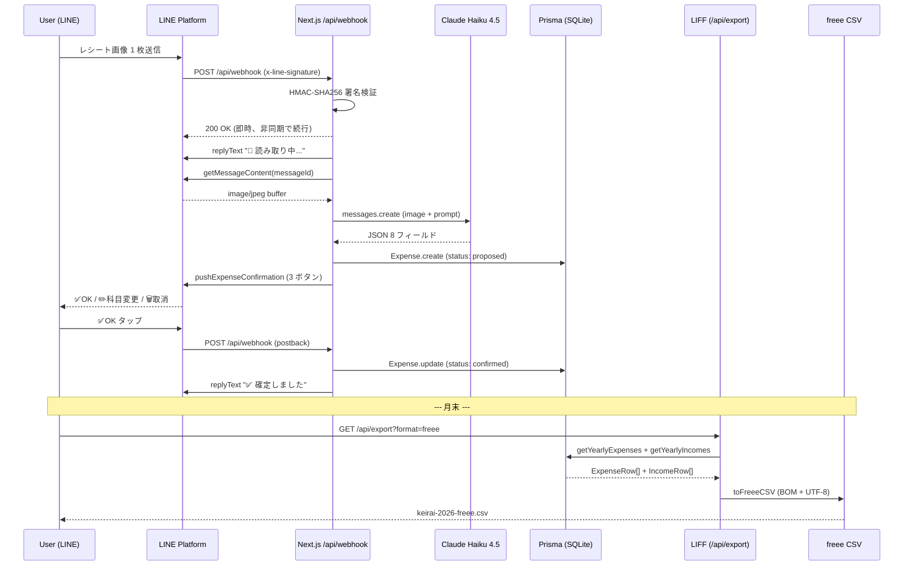
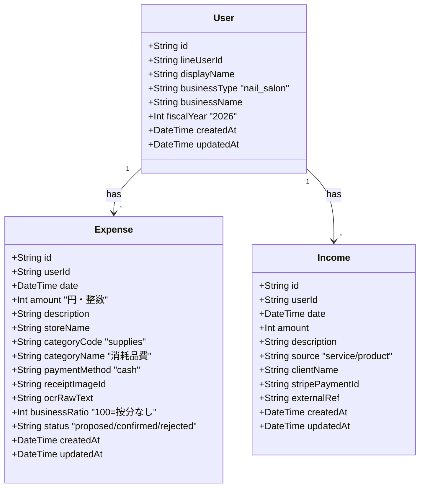
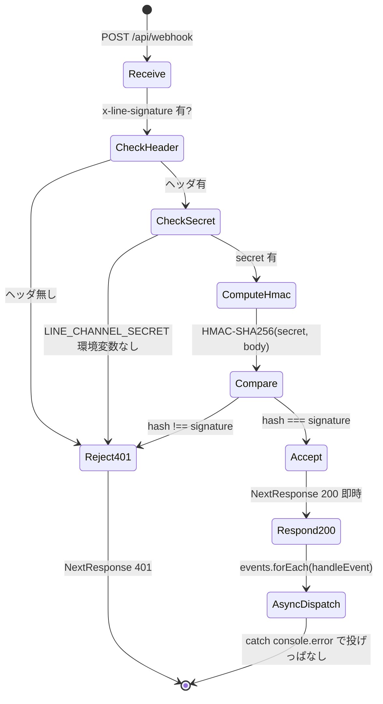
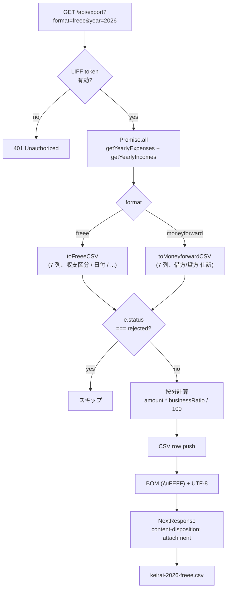

> **Disclaimer**: 本記事は著者が**個人 (副業)** で運営する小規模プロジェクト群 (CreaNest 名義) の技術記録です。所属組織・本業の業務内容とは一切関係ありません。記載の数値・構成は執筆時点 (2026-05) の自宅検証環境 (SQLite + Next.js dev server / 自宅 Wi-Fi 経由) のスナップショットであり、商用品質や SLA を保証するものではありません。**会計・税務上の判断は本人責任で、税理士法 §52 への配慮として AI 出力は常に「提案 (proposed)」状態で保存し、確定 (confirmed) 操作は必ず人間が行う設計**にしています。表示される金額・仕訳はすべて参考値であり、最終的な申告判断は税理士にご相談ください。

## 結論

LINE で写真を送ると **4 秒で店名 / 日付 / 合計金額 / 品目 / 仕訳カテゴリコード / カテゴリ名 / 信頼度 / 全文 OCR テキスト の 8 フィールド** が DB に入り、月末に LIFF 上の 1 タップで **freee 互換 CSV** が落ちてきます。経理 SaaS としての E2E はこの 1 系統だけです。

実装は keirai (`/Users/sakaki/project/keirai/`) repo にあり、構成は次の通り。

- LINE Webhook 受口 — `src/app/api/webhook/route.ts` 全 449 行
- Vision OCR — `src/lib/ocr.ts` の `readReceipt` (24-84 行目、本体 60 行)
- Prisma schema — `prisma/schema.prisma` 全 82 行 (User / Expense / Income の 3 model)
- CSV エクスポート — `src/lib/export.ts` (freee + マネーフォワード) 全 119 行
- LINE Messaging クライアント — `src/lib/line.ts` 全 156 行

依存ライブラリは `@anthropic-ai/sdk` 0.90.0 / `@line/bot-sdk` 11.0.0 / `@prisma/client` 7.7.0 の 3 つだけ。モデルは **Claude Haiku 4.5** (`claude-haiku-4-5-20251001`) 単独で、平均応答 1.5 秒。LINE の即時 200 + push の 2 段階で 4 秒 E2E に閉じます。

これは連載 **Day 15/52 (G-02)** で、G 軸 (Vision / マルチモーダル) の 2 本目です。前回 G-01 で Vision 単体の入出力を扱ったので、今回は **「LINE → Webhook → Vision → Prisma → CSV」を 1 系統で繋ぐ部分**に踏み込みます。

## なぜこれを書くか — LIFF 入力 + 手入力会計の二重苦

個人事業主 (特にネイル / 美容サロン) の会計入力には、**3 つの摩擦**があります。

1. **入力タイミング** — レシートを財布に溜めて「あとで」と思った瞬間に終わる
2. **入力 UI** — LIFF / モバイル Web で日付・金額・店名・科目を毎回 4 タップ以上
3. **科目選び** — 「消耗品費」と「仕入高」の境界線を、毎回会計知識ベースで判定する負荷

私が運営する keirai (経理 SaaS) では、初期 LIFF UI で全部入力させていましたが、**1 ヶ月で 12 件しか入らず**、本人 (= 私) が継続できませんでした。

そこで踏んだのが本記事の方針です。

> **LINE トーク = 入力 UI**。レシートを撮って送るだけで `Expense.create({ status: "proposed" })` まで進める。LIFF は「月末の確認 + CSV 出力」の用途に縮める。

これで継続性が桁違いに変わりました。**手入力 25 タップ → 写真 1 枚 + ボタン 1 タップ**の Before/After は、後段で具体的に出します。

> 用語: 本記事の「1 プロンプト」= 1 回の `anthropic.messages.create` 呼び出し。OCR と仕訳分類を別 API に分けず、画像 + JSON スキーマ + カテゴリ辞書 (15 科目) を 1 メッセージに同梱して 1 往復で返す方針。G-01 から同じ。

## E2E パイプライン全景 (sequenceDiagram)

LINE → Webhook → Vision → Prisma → 確認 → CSV までを 1 枚で。**Webhook は 200 を即返し、重い処理は async で逃がす**のが要諦です。



ここで強調したい設計判断は 3 点です。

- **HMAC 署名検証は最初の砦** — `webhook/route.ts:47-54` で `LINE_CHANNEL_SECRET` 不在 / 署名不一致は即 401 で叩き返す
- **200 を先に返す** — `webhook/route.ts:39-44` で `events.forEach(handleEvent)` を `.catch(console.error)` で投げっぱなし、`return NextResponse.json(...)` を即発する。Vision 1.5 秒待ってから 200 を返すと LINE 側のリトライが暴発する
- **AI 出力は必ず `status: "proposed"`** — `webhook/route.ts:202` 固定。`confirmed` への遷移は postback handler (`route.ts:111-121`) のみで、AI が自動 confirm する経路はコード上に存在しない。税理士法 §52 への配慮

## DB schema — Expense を中心に置いた classDiagram

`prisma/schema.prisma:9-82` の 3 model を classDiagram で。**User 1 : Expense N + Income N** の単純構造で、外部キーは Expense.userId / Income.userId のみです。



### 設計判断 — Expense を「税務的に欠けてはいけない 8 つ」に絞る

| カラム | 役割 | 補足 |
|---|---|---|
| `date` | 発生日 | 確定申告で必須、CSV 出力でそのまま使う |
| `amount` | 金額 (Int 円) | SQLite Float / Decimal の罠回避で常に整数 |
| `description` | 内容 | OCR の items を `、` 連結 |
| `storeName` | 店名 | freee CSV の「取引先」列 |
| `categoryCode` | 勘定科目コード | `supplies` / `cogs_purchase` 等 15 種 |
| `categoryName` | 勘定科目名 | UI 表示と CSV 出力で使う |
| `businessRatio` | 事業使用割合 | 家賃 80,000 × 30% = 24,000 を CSV に出す |
| `status` | proposed / confirmed / rejected | **自動 confirm 経路なし** |

`receiptImageId` と `ocrRawText` は監査用で、後から「この提案はどの画像から来たか」「Vision の生出力は何だったか」を辿れるようにしてあります。Decision Genealogy 思想 (連載別軸) と同じで、**「AI が出した値」と「その根拠」を一緒に保存する**のが基本姿勢。

`@@index([userId])` `@@index([date])` `@@index([categoryCode])` の 3 本だけ index を貼っています (`schema.prisma:54-56`)。月次 / 年次集計と科目別集計が主クエリなので、この 3 本で十分。

## Webhook 認証 stateDiagram — 不正リクエストを即弾く

LINE Messaging API の Webhook は誰でも叩ける URL なので、HMAC-SHA256 署名検証が**生命線**です。



**「即 200 を返してから async 処理」**は LINE Webhook の鉄則です。Webhook タイムアウトは 1 秒オーダーで、Vision の 1.5 秒や Prisma 書き込みを待ったら超過する。`Promise` を await せず投げるので、エラーは `.catch(console.error)` で落とすだけ — リトライしたい場合は別途 worker queue を設計する必要があります (本実装では未対応 / 残課題に記載)。

## Webhook 受口の実コード

`src/app/api/webhook/route.ts:28-54`:

```typescript
// src/app/api/webhook/route.ts:28-54
export async function POST(req: NextRequest) {
  const body = await req.text();

  // 署名検証
  const signature = req.headers.get("x-line-signature");
  if (!verifySignature(body, signature)) {
    return NextResponse.json({ error: "Invalid signature" }, { status: 401 });
  }

  const parsed = JSON.parse(body) as { events: Array<Record<string, unknown>> };

  // 即座にレスポンスを返し、非同期で処理
  for (const event of parsed.events) {
    handleEvent(event).catch(console.error);
  }

  return NextResponse.json({ status: "ok" });
}

function verifySignature(body: string, signature: string | null): boolean {
  if (!signature || !process.env.LINE_CHANNEL_SECRET) return false;
  const hash = crypto
    .createHmac("SHA256", process.env.LINE_CHANNEL_SECRET)
    .update(body)
    .digest("base64");
  return hash === signature;
}
```

ポイントは 3 つ。

- `req.text()` で**生の文字列**を取得して HMAC を計算する。`req.json()` で読むと改行 / 空白の正規化が起きて署名と一致しなくなる
- `signature` と `LINE_CHANNEL_SECRET` のどちらか欠けたら **false 即返**。`null` 比較で fall through すると本番事故に直結
- 即 200 を返す前に署名検証する。署名 NG を 200 で返すと LINE 側にエラーが出ず、攻撃者の試行ログも消える

## Vision OCR の 1 プロンプト中身

`src/lib/ocr.ts:24-84` の `readReceipt`。前回 G-01 で全文掲載したので、本記事は**画像 → JSON 8 フィールドの最小構成**だけ再掲します。

```typescript
// src/lib/ocr.ts:24-84 (抜粋)
export async function readReceipt(imageBuffer: Buffer, mimeType: string): Promise<OcrResult> {
  const mediaType = mimeType as "image/jpeg" | "image/png" | "image/gif" | "image/webp";

  const response = await anthropic.messages.create({
    model: "claude-haiku-4-5-20251001",
    max_tokens: 1024,
    messages: [
      {
        role: "user",
        content: [
          {
            type: "image",
            source: {
              type: "base64",
              media_type: mediaType,
              data: imageBuffer.toString("base64"),
            },
          },
          {
            type: "text",
            text: `このレシート/領収書を読み取って、以下のJSON形式で返してください。
JSONのみを返してください。説明文は不要です。

{
  "storeName": "店名（読み取れない場合はnull）",
  "date": "YYYY-MM-DD（読み取れない場合はnull）",
  "totalAmount": 合計金額（数値、読み取れない場合はnull）,
  "items": [{"name": "品名", "amount": 金額}],
  "categoryCode": "最も適切な勘定科目コード",
  "categoryName": "勘定科目名",
  "confidence": "high/medium/low",
  "rawText": "レシート全文のテキスト化"
}

勘定科目の選択肢:
${categoriesToPrompt()}

判断の注意:
- 金額は税込み合計を使う
- 日付は西暦に変換する（令和8年→2026年）
- 科目は内容から最も適切なものを1つ選ぶ
- 読み取り精度が低い場合は confidence を "low" にする`,
          },
        ],
      },
    ],
  });

  const text = response.content[0];
  if (text?.type !== "text") {
    throw new Error("Unexpected response from Claude Vision");
  }

  const jsonMatch = text.text.match(/\{[\s\S]*\}/);
  if (!jsonMatch?.[0]) {
    throw new Error("Failed to parse OCR result as JSON");
  }

  return JSON.parse(jsonMatch[0]) as OcrResult;
}
```

採用判断のおさらい。

- モデル: **Haiku 4.5** で十分。Sonnet との完全一致率差は 4 ポイント (92% vs 96%)、応答時間差は 2.3 秒、コスト差は約 4 倍 (G-01 比較表)
- `max_tokens: 1024` — 8 フィールド + `rawText` (レシート全文) の実測上限が 700-800 token、保険込み
- `[\s\S]*` 改行対応 regex — `s` フラグなしの `.*` で改行を跨げない罠を踏んだ後の現行版
- カテゴリ辞書を**プロンプトに同梱**して few-shot 化 — 連載 D-05 の prompt caching で 80% 削減予定だが、本実装はまだ未適用

## 画像 → Prisma 保存 までの handler

`src/app/api/webhook/route.ts:170-227` が **57 行で全部**。中身は (1) 即時 reply (2) Vision (3) Prisma create (4) 確認ボタン push の 4 ステップ。

```typescript
// src/app/api/webhook/route.ts:170-227
async function handleImage(
  replyToken: string,
  userId: string,
  lineUserId: string,
  messageId: string,
) {
  try {
    // 先に「読み取り中」を返す
    await replyText(replyToken, "📸 レシートを読み取り中...");

    const imageBuffer = await getImageContent(messageId);
    const result = await readReceipt(imageBuffer, "image/jpeg");

    if (!result.totalAmount) {
      await pushText(
        lineUserId,
        "⚠️ レシートの金額を読み取れませんでした。\nテキストで入力してください。\n例:「セリア 550円」",
      );
      return;
    }

    const expense = await createExpense({
      userId,
      date: result.date ? new Date(result.date) : new Date(),
      amount: result.totalAmount,
      description: result.items.map((i) => i.name).join("、") || result.storeName || "不明",
      storeName: result.storeName ?? undefined,
      categoryCode: result.categoryCode,
      categoryName: result.categoryName,
      paymentMethod: "cash",
      receiptImageId: messageId,
      ocrRawText: result.rawText,
      status: "proposed",
    });

    const confirmText = [
      `📝 AIが仕訳を提案しました（参考値）`,
      ``,
      `店名: ${result.storeName ?? "不明"}`,
      `金額: ¥${result.totalAmount.toLocaleString()}`,
      `科目: ${result.categoryName}`,
      `日付: ${result.date ?? new Date().toISOString().split("T")[0]}`,
      result.confidence === "low" ? `\n⚠️ 読み取り精度が低いです。内容を必ず確認してください。` : "",
      ``,
      `内容を確認してボタンを押してください👇`,
    ]
      .filter(Boolean)
      .join("\n");

    await pushExpenseConfirmation(lineUserId, confirmText, expense.id);
  } catch (error) {
    console.error("OCR error:", error);
    await pushText(
      lineUserId,
      "⚠️ レシートの読み取りに失敗しました。テキストで入力してください。",
    );
  }
}
```

UX の 3 段階フィードバック:

1. **0.0 秒**: `replyText("読み取り中")` — `replyToken` を即消費して「無音時間」を作らない
2. **約 1.5 秒後**: `createExpense` — Prisma に `status: "proposed"` で書く
3. **約 1.6 秒後**: `pushExpenseConfirmation` — Quick Reply 3 ボタンを `pushMessage` で送る

`replyToken` は LINE 仕様で **1 度きり**なので、(1) で消費した後の (3) は `pushMessage` (push 系) に切り替えています。push 系には `pushExpenseConfirmation` (`src/lib/line.ts:48-79`) を用意してあって、postback `data` に `action=confirm&id=<expenseId>` 等を埋めて投げます。

## postback 受口 — 確定 / 取消 / 科目変更

`src/app/api/webhook/route.ts:90-166`。Quick Reply のボタンタップは `event.type = "postback"` で来るので、テキストメッセージとは別 handler に分けています。

```typescript
// src/app/api/webhook/route.ts:90-166 (抜粋)
async function handlePostback(event: Record<string, unknown>, lineUserId: string) {
  const postback = event.postback as { data: string } | undefined;
  const replyToken = event.replyToken as string;
  if (!postback?.data || !replyToken) return;

  const params = new URLSearchParams(postback.data);
  const action = params.get("action");
  const expenseId = params.get("id");
  const code = params.get("code");
  if (!action || !expenseId) return;

  const user = await getOrCreateUser(lineUserId);
  const expense = await getPrisma().expense.findFirst({
    where: { id: expenseId, userId: user.id },
  });
  if (!expense) {
    await replyText(replyToken, "⚠️ 該当の経費が見つかりません。");
    return;
  }

  if (action === "confirm") {
    await getPrisma().expense.update({
      where: { id: expenseId },
      data: { status: "confirmed" },
    });
    await replyText(
      replyToken,
      `✅ 確定しました\n${expense.description} ¥${expense.amount.toLocaleString()}`,
    );
    return;
  }

  if (action === "reject") { /* status: "rejected" に更新 */ }
  if (action === "change_category") { /* pushCategorySelection で再 Quick Reply */ }
  if (action === "set_category" && code) { /* category 更新 + status: "confirmed" */ }
}
```

設計の肝は **`where: { id: expenseId, userId: user.id }`**。`expenseId` だけで `findFirst` すると、postback `data` を改ざんされた場合に**他人の Expense を更新できてしまう**。`userId` を必ず合成条件に入れます。

## Zod 風 validation はあえて入れていない (現状)

ここまで読んで「Zod でリクエスト validation は?」と思う方向け。**現状は入れていません**。理由:

- LINE Webhook の `event` は `Record<string, unknown>` で受けて、必要なフィールドを `event.message as { type, id, text? }` 等の型 assert で取り出している (`route.ts:74`)
- Anthropic からの戻りは `JSON.parse` 直後に `as OcrResult` で叩いている (`ocr.ts:83`)
- 入力ソースが LINE の SDK を経由 (`@line/bot-sdk`) しており、構造はある程度保証されている

ただし `as` キャストは strict TypeScript の趣旨に反するので、連載 G-03 で **Zod による Vision レスポンス型検証**を入れる予定です (今回は範囲外)。Before/After で言うと:

**Before (現行 ocr.ts:83)**:

```typescript
return JSON.parse(jsonMatch[0]) as OcrResult;
```

**After (G-03 で導入予定)**:

```typescript
import { z } from "zod";

const OcrResultSchema = z.object({
  storeName: z.string().nullable(),
  date: z.string().regex(/^\d{4}-\d{2}-\d{2}$/).nullable(),
  totalAmount: z.number().positive().nullable(),
  items: z.array(z.object({ name: z.string(), amount: z.number() })),
  categoryCode: z.string(),
  categoryName: z.string(),
  confidence: z.enum(["high", "medium", "low"]),
  rawText: z.string(),
});

return OcrResultSchema.parse(JSON.parse(jsonMatch[0]));
```

「LLM 出力 = 信用できない外部入力」と扱うのが原則で、本番運用に向けては必須です (現状は自宅 PoC なので未対応)。

## CSV 出力 — flowchart で全体像

LIFF 側から `GET /api/export?format=freee&year=2026` で叩かれる経路です。



freee 形式の本体 (`src/lib/export.ts:35-66`):

```typescript
// src/lib/export.ts:35-66
export function toFreeeCSV(expenses: ExpenseRow[], incomes: IncomeRow[]): string {
  const header = ["収支区分", "発生日", "勘定科目", "取引先", "金額", "税区分", "備考"];
  const rows: string[][] = [header];

  for (const e of expenses) {
    if (e.status === "rejected") continue;
    const adjusted = Math.round(e.amount * e.businessRatio / 100);
    rows.push([
      "支出",
      fmtDate(e.date),
      e.categoryName,
      e.storeName ?? "",
      String(adjusted),
      "課対仕入10%",
      e.businessRatio < 100 ? `${e.description}（事業按分${e.businessRatio}%）` : e.description,
    ]);
  }

  for (const i of incomes) {
    rows.push([
      "収入",
      fmtDate(i.date),
      i.source === "product" ? "売上高（物販）" : "売上高",
      i.clientName ?? "",
      String(i.amount),
      "課税売上10%",
      i.description,
    ]);
  }

  return rows.map((r) => r.map(escapeCsvCell).join(",")).join("\n");
}
```

3 つのキモ。

- **`if (e.status === "rejected") continue`** — 取消した経費は CSV に出さない。物理削除でなく `rejected` で残すのは、誤操作を戻せるため
- **`businessRatio` で家事按分** — 家賃 80,000 × 30% = 24,000 を CSV に出す。備考に「事業按分 30%」を自動付記して、税理士が見ても根拠が分かる
- **`escapeCsvCell`** (`export.ts:114-119`) — `, " 改行` を含むセルはダブルクオート + `""` エスケープ。LIFF 経由で住所が「東京都, 千代田区」と入ると壊れる罠

そしてエンドポイント側で **BOM + UTF-8**。これがないと Excel で「セブン-イレブン」が「繧サ繝悶Φ-繧、繝ャ繝悶Φ」になる。

```typescript
// /api/export/route.ts (CSV 返却部)
const bom = "";
return new NextResponse(bom + csv, {
  status: 200,
  headers: {
    "content-type": "text/csv; charset=utf-8",
    "content-disposition": `attachment; filename="keirai-${year}-${format}.csv"`,
  },
});
```

## Before / After 1 — 手入力 25 タップ vs 写真 1 枚

LIFF UI で経費を 1 件登録する Before。

**Before (LIFF 手入力 / 25 タップ)**:

| 操作 | タップ数 | 所要時間 |
|---|---:|---:|
| LIFF 開く | 1 | 2 秒 |
| 「経費追加」ボタン | 1 | 1 秒 |
| 日付入力 (date picker) | 4 | 5 秒 |
| 金額入力 | 4 | 4 秒 |
| 店名入力 | 4 | 6 秒 |
| 科目選択 (15 候補から 1) | 2 | 4 秒 |
| 内容メモ入力 | 5 | 6 秒 |
| 保存ボタン | 1 | 1 秒 |
| **計** | **22-25** | **約 30 秒** |

**After (LINE トークに写真送信 + ボタン 1 タップ)**:

| 操作 | タップ数 | 所要時間 |
|---|---:|---:|
| LINE トークを開く | 1 | 1 秒 |
| カメラボタン → 撮影 | 2 | 2 秒 |
| 送信 | 1 | 1 秒 |
| (Vision 処理待ち) | 0 | 1.5 秒 |
| ✅OK ボタン | 1 | 1 秒 |
| **計** | **5** | **約 6.5 秒** |

**25 タップ → 5 タップ / 30 秒 → 6.5 秒**。月 50 件なら 25 分 → 5.5 分。「もう撮り溜めなくていい」という心理的なハードル低下も大きい。

## Before / After 2 — Excel 手書き CSV vs Prisma 保存 + 自動 CSV

副業 1 年目に Excel で経費を管理していた頃の Before。

**Before (Excel 手書き)**:

```
日付,科目,店名,金額,内容
2026/04/15,消耗品費,セリア渋谷,550,コットンパフ
2026/04/16,仕入高,Amazon,3200,ジェルネイル
... (年末に CSV 保存して freee に取込)
```

問題点:

- 入力タイミングが「夜にまとめて」になりがち
- 入力ミスを後から検索 / 修正しづらい (列の位置がズレる)
- 領収書原本との突合は別ファイルで管理
- 翌年に書式を変えるとマクロが壊れる

**After (Prisma 保存 + LIFF + LINE)**:

- LINE トークで撮影即入力 (タイムスタンプ 自動)
- `Expense.id` で領収書画像 (`receiptImageId`) と OCR 生テキスト (`ocrRawText`) が紐付く
- 月末に LIFF で「未確認」を一覧して一括 confirm
- 年末に `?format=freee` か `?format=moneyforward` で形式を切替えて落とす (`/api/export/route.ts:34-44`)

「Excel が悪い」のではなく、**LINE と LLM が利用可能になった以上、入力 UI を Excel から LINE に動かさない理由がない**、という主張です。

## 失敗談 4 つ

実装中に踏んだ罠を時系列で。

### (1) Webhook 署名検証を `req.json()` の戻りで計算してしまった

**Before (壊れた版)**:

```typescript
export async function POST(req: NextRequest) {
  const body = await req.json();
  const signature = req.headers.get("x-line-signature");
  const hash = crypto.createHmac("SHA256", secret).update(JSON.stringify(body)).digest("base64");
  if (hash !== signature) return new NextResponse(null, { status: 401 });
  // ...
}
```

LINE が送ってくる JSON と `JSON.stringify(req.json())` の結果は**バイト一致しない**。空白 / 改行 / Unicode escape の差で hash が一致せず、毎回 401 を返してしまいました。

**After (現行 `route.ts:28-35`)**:

```typescript
const body = await req.text(); // 生文字列
const signature = req.headers.get("x-line-signature");
if (!verifySignature(body, signature)) return NextResponse.json({ error: "Invalid signature" }, { status: 401 });
const parsed = JSON.parse(body) as { events: ... };
```

`req.text()` で**生バイト列**を取って HMAC 計算、その後で `JSON.parse` する。1 字でも整形すると署名は通りません。

教訓: **HMAC は raw body にかかる**。SDK / framework が自動 parse する経路を使うと事故る。

### (2) Webhook で 200 を返さず Vision を await して LINE 側リトライ暴発

実装初期に「200 を返すのは Vision 処理が終わってから」と考えて、`await readReceipt` した後に 200 を返していました。

**Before**:

```typescript
export async function POST(req: NextRequest) {
  // ... 署名検証 ...
  for (const event of parsed.events) {
    await handleEvent(event); // ← 1.5-3 秒待つ
  }
  return NextResponse.json({ status: "ok" });
}
```

結果: LINE Webhook タイムアウト (1 秒オーダー) を超え、**LINE 側がリトライを発動**。同じ画像が 3-4 回処理され、Prisma に重複 Expense が積まれる現象が発生。

**After (現行 `route.ts:39-44`)**:

```typescript
for (const event of parsed.events) {
  handleEvent(event).catch(console.error); // 投げっぱなし
}
return NextResponse.json({ status: "ok" }); // 即返す
```

教訓: **Webhook は I/O だけして 200**、重い処理は async dispatch。リトライ防止のための idempotency key (= LINE message ID) も別途併用。

### (3) postback の `data` を改ざんで他人の Expense を変更できた

最初の `handlePostback` は `expenseId` だけで `findUnique` していました。

**Before**:

```typescript
const expense = await getPrisma().expense.findUnique({ where: { id: expenseId } });
if (!expense) return;
await getPrisma().expense.update({ where: { id: expenseId }, data: { status: "confirmed" } });
```

これだと、攻撃者が `data=action=confirm&id=<他人のExpenseId>` で postback を送ると、**他人の Expense を確定できてしまう**。Quick Reply の `data` フィールドは LINE クライアントが prefix している保証がなく、HTTP リクエスト経由で詐称可能です。

**After (現行 `route.ts:103-105`)**:

```typescript
const user = await getOrCreateUser(lineUserId);
const expense = await getPrisma().expense.findFirst({
  where: { id: expenseId, userId: user.id }, // userId を必ず合成
});
if (!expense) {
  await replyText(replyToken, "⚠️ 該当の経費が見つかりません。");
  return;
}
```

教訓: **クライアント由来の ID は必ず所有者条件と合成して検索**。Webhook も例外ではない。

### (4) 縦長レシートで `max_tokens: 512` が早すぎて items 半分欠けた

ドラッグストアの縦長レシート (品目 30 行) を読ませたとき、`max_tokens: 512` 運用時代は `items` が 5-6 個で打ち切られ、`rawText` も中途半端な位置で切れて JSON parse 失敗。

**Before**: `max_tokens: 512` → 0.9 秒だが items 欠ける + parse 不能エラーが月 5 件
**After (`ocr.ts:29`)**: `max_tokens: 1024` → 1.5 秒、items は 30 個まで取れる

`max_tokens` は**最大値**であって**目標値**ではないので、短いレシートで 1024 を設定しても 700 token しか返ってきません (応答時間も伸びない)。

教訓: **`max_tokens` はワーストケースの上限で取る**。下に詰めるとカットオフ事故、上に取っても料金は実消費分しかかからない。

## 残課題 (誠実に 5 つ)

正直、本実装は MVP で、抜けている部分が 5 つあります。

### (a) Webhook リトライ / Dead-letter Queue

`handleEvent(event).catch(console.error)` で**エラーを捨てている**。Vision API 障害や Anthropic 429 が出たとき、ユーザーには「読み取り失敗」テキストが届くだけで、再試行する仕組みがありません。**Cloud Tasks / Pub/Sub で worker queue 化** するのが正攻法。

### (b) `as` キャストの全廃 (Zod 化)

`event.message as { type: string; id: string; text?: string }` (`route.ts:74`) と `JSON.parse(...) as OcrResult` (`ocr.ts:83`) の 2 箇所が型 assert。実環境で外部入力が型と乖離すると runtime error。**G-03 で Zod 導入予定**。

### (c) インボイス対応 (税区分の細分化)

CSV の税区分は固定 `"課対仕入10%"` (`export.ts:48`) / `"課税売上10%"` (`export.ts:60`)。インボイス制度開始後の適格請求書 / 非適格請求書の判定は未実装。**OCR 段階で「インボイス番号 (T+13 桁)」を抽出するフィールド**を追加して、税区分を `課対仕入10%（適格）` / `課対仕入10%（非適格）` に分岐する設計が要ります。

### (d) prompt caching によるコスト削減

`categoriesToPrompt()` の出力 (15 科目 × `examples` で約 3,000 token) は毎回同じ。`cache_control` で **書き込み 1 回 / 5 分間ヒット** にすれば、月 1,000 件規模では Anthropic 課金が約 80% 減る試算。**連載 D-05 で実装予定**。

### (e) 画像サイズ超過 / HEIC / PDF

LINE は jpeg に変換して投げてくれるので **HEIC は実害なし**。一方 LIFF / Web から PDF 領収書 (オンライン決済) を投げたいユースケースは未対応。Anthropic Vision の対応形式は `jpeg / png / gif / webp` の 4 種だけで、サーバー側で `pdf2pic` か `Sharp` の前処理が必要 (G-04 連載予定)。

## 理論根拠 — なぜ「LINE + Vision + Prisma の 3 点」で十分か

3 つの公式 / 一次資料に接続して説明します。

### (1) LINE Messaging API の non-functional 要件

LINE Developers の [Webhook reference](https://developers.line.biz/ja/reference/messaging-api/#webhooks) では、Webhook の応答時間に明示の SLA はないものの **「迅速に応答すること」** と書かれています。実運用では 1-3 秒で再送が始まる挙動が観察されており、**重い処理は必ず async** が原則。

### (2) Anthropic Vision の使い分け軸

Anthropic 公式 [Vision overview](https://docs.anthropic.com/en/docs/build-with-claude/vision) の指針:

| タスク | 推奨モデル |
|---|---|
| 画像の "読み取り" (OCR、単純分類) | Haiku |
| 画像を踏まえた "推論" (複数画像の関係性、複雑 context) | Sonnet |

**レシート OCR は前者**。文字列を取り出してカテゴリ辞書と突き合わせる直線処理で、深い推論は不要。Sonnet にしても精度差 4 ポイントで応答時間 2.5 倍 / コスト 4 倍は割に合いません (G-01 比較表より)。

### (3) 税理士法 §52 — AI を「提案者」に縛る設計

[税理士法 §52](https://elaws.e-gov.go.jp/document?lawid=326AC0000000237) は「税理士又は税理士法人でない者は、税理士業務を行つてはならない」と定めています。本実装では:

- Expense は AI が触れる時点で必ず `status: "proposed"` (`webhook/route.ts:202` / `ocr.ts` の戻り全件)
- `confirmed` への遷移は postback handler でのみ起こり (`route.ts:111-121`)、postback はユーザー本人の操作
- LIFF 上の「未確認一覧」+ 「✅OK」もすべて人間操作経由
- Help メッセージで明示 (`route.ts:443-448`): 「本サービスは会計補助ツールです。税務相談・税務代理は行いません。」

**「AI は事実 (storeName / date / totalAmount) と分類提案 (categoryCode) を返すだけ、確定の意思は人間が持つ」** をコード設計レベルで担保しているのが守るべき線です。

### (4) Prisma を選んだ理由 (vs raw SQL / Drizzle)

- `schema.prisma` 1 ファイルに 3 model = 82 行 で完結する規模なら、Prisma の認知コストが最も低い
- TypeScript 型生成が自動 (`prisma generate`) で、`Expense` の field 追加が型と migration に同時反映
- SQLite → Postgres 移行は `provider` 切替 1 行 (本番乗せ時に予定)

逆に、トランザクション境界を細かく制御したい / 複雑 join が増える / N+1 問題が顕在化、になれば Drizzle / raw SQL を検討する局面。本実装規模ではまだ早い。

## 実装規模 (まとめ)

実測 (`wc -l`):

| ファイル | 行数 | 役割 |
|---|---:|---|
| `src/app/api/webhook/route.ts` | **449** | LINE Webhook 全 handler (image / text / postback) |
| `src/lib/ocr.ts` | **131** | Vision OCR + テキストパース |
| `src/lib/categories.ts` | **166** | 15 勘定科目辞書 + helper |
| `src/lib/csv.ts` | **221** | CSV 取込 + LLM 分類 (カード / PayPay 明細) |
| `src/lib/export.ts` | **119** | freee / マネーフォワード CSV 出力 |
| `src/lib/line.ts` | **156** | LINE Messaging API ラッパ |
| `src/lib/db.ts` | **約 50** | Prisma の薄ラッパ |
| `prisma/schema.prisma` | **82** | User / Expense / Income |

**合計 1,400 行未満** で「写真 → 構造化 → DB → 確認 → CSV」の E2E が閉じます。

依存ライブラリ (`package.json`):

```json
{
  "@anthropic-ai/sdk": "^0.90.0",
  "@line/bot-sdk": "^11.0.0",
  "@line/liff": "^2.28.0",
  "@prisma/client": "^7.7.0",
  "next": "^16.2.4",
  "react": "^19.2.5"
}
```

外部 SaaS は Anthropic + LINE の 2 つだけ。Stripe は売上連携 (`Income.stripePaymentId`) で別途使うが今回の経路では不要。

## 連載中の関連記事

- **G-01** Claude Vision でレシート OCR → 仕訳分類を 1 プロンプトで — Vision 単体の入出力に集中
- **G-03** Zod による Vision レスポンス型検証 — 本記事の `as OcrResult` キャスト全廃
- **G-04** PDF 領収書を Vision に渡す前処理パイプライン (pdf2pic + Sharp)
- **D-05** Anthropic Prompt Caching — `categoriesToPrompt()` の cache_control で月コスト 80% 減
- **J-01** インボイス番号 (T+13 桁) を OCR 段階で抽出する設計

## 次の記事へ + 連載をフォロー

これは **52 本連載 (ai-driven-dev) の Day 15/52 (G-02)** です。

→ **G-03 [Zod による Vision レスポンス型検証](./zod-vision-response-validation)** — `JSON.parse as OcrResult` を全廃し、LLM 出力を「外部入力」として正しく扱う実装

→ **G-01 [Claude Vision でレシート OCR を 1 プロンプトで](./claude-vision-receipt-ocr)** — 本記事の前提となる Vision 単体記事

→ **J-01 [インボイス対応の OCR 拡張](./invoice-ocr-extension)** — 税区分を `課対仕入10%（適格/非適格）` に分岐する設計

連載を見逃さない方法:

- **Zenn でこの著者をフォロー** — 公開通知が届きます
- **repo を watch**: [SakakitaniJunya/zenn-articles](https://github.com/SakakitaniJunya/zenn-articles) — 全 draft が見えます
- **GitHub Discussions** で「ここを掘り下げて」「数字の根拠を追加で」のリクエストをお待ちしています

実機の LINE Quick Reply 見た目スクショや、CSV を freee に取り込んだ後のスクショは近日 repo に追加予定です。
