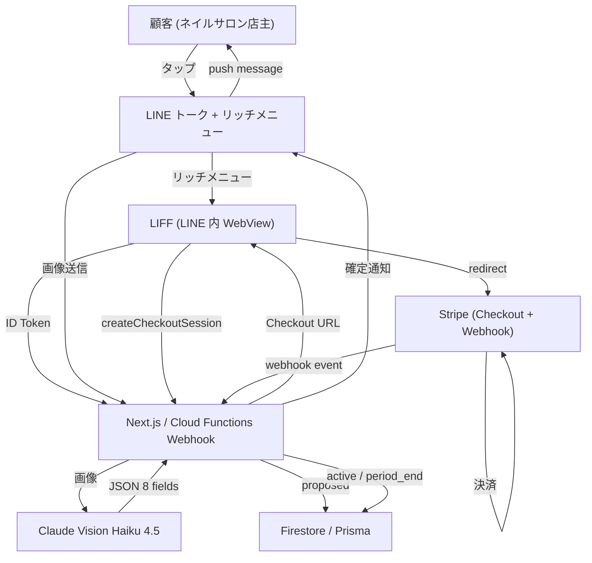
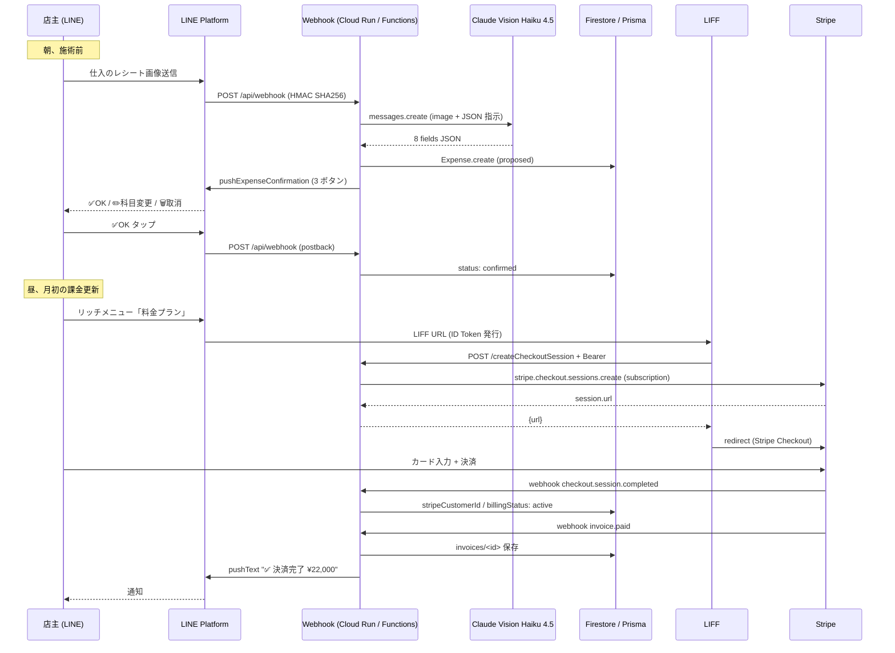
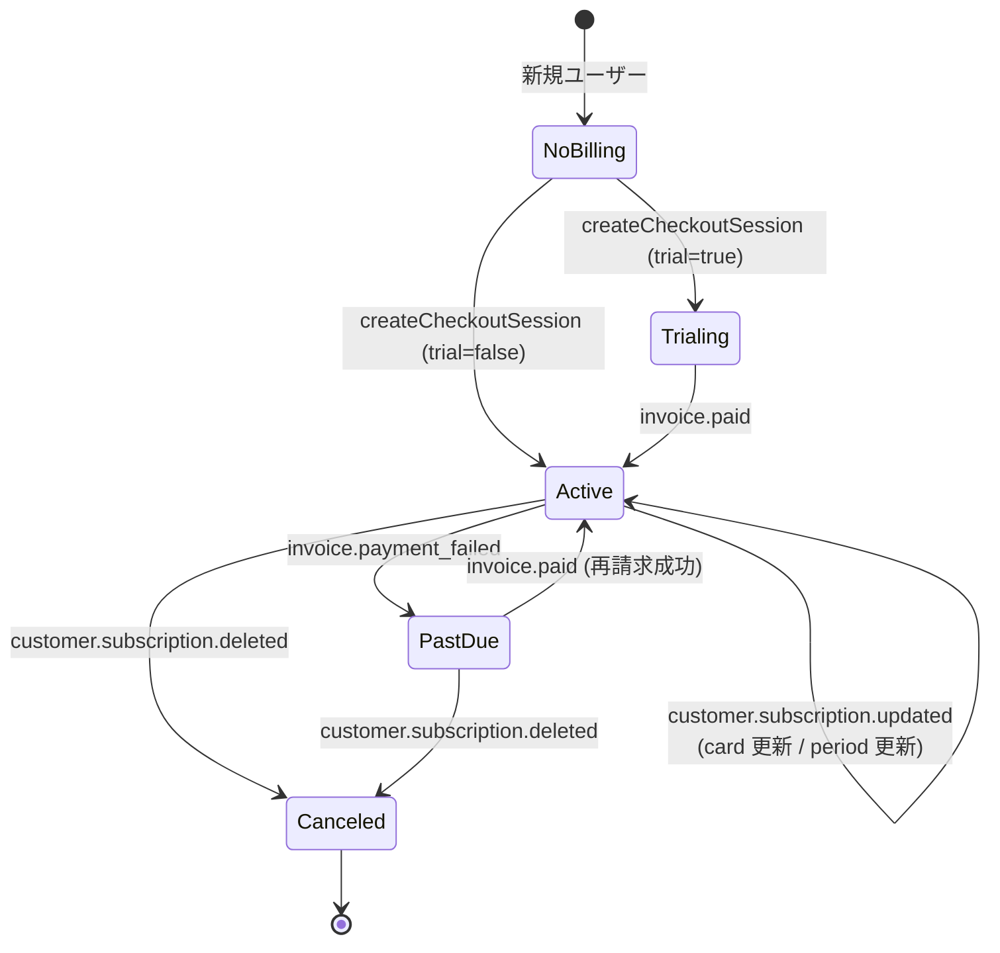

> **Disclaimer**: 本記事は著者が**個人 (副業)** で運営する小規模プロジェクト群 (CreaNest 名義) の技術記録です。所属組織・本業の業務内容とは一切関係ありません。記載の数値・構成は執筆時点 (2026-05) の実運用 / 自宅検証環境のスナップショットであり、商用品質や SLA を保証するものではありません。**会計・税務・決済まわりは本人責任**で、税理士法 §52 への配慮として AI 出力は常に「提案」状態で扱い、確定操作は人間が行う設計にしています。Stripe 本番運用に関する金額・挙動はあくまで著者環境の観測であり、各事業者の運用条件で変わります。

## 結論

日本の中小零細 (1 店舗ネイルサロン / 個人事業主経理 / 小規模美容室) に SaaS を売るなら、**LIFF × Claude Vision × Stripe の 3 点セット**が最小構成です。1 つでも欠けると顧客は使ってくれません。確定収益として nailsalon-reserve-line-app (1 店舗 ¥20,000/月、Stripe live で `¥50` E2E 検証済) を回した結論で、keirai (経理 SaaS) の Phase 0 でも同じ 3 点を踏襲しています。

各役割を 1 行で。

- **LIFF** = 入口 (LINE トーク + リッチメニューが「アプリストア」、新規 DL 不要)
- **Claude Vision (Haiku 4.5)** = 入力負担ゼロ (写真 1 枚で 8 フィールド構造化、平均 1.5 秒)
- **Stripe (Checkout + Webhook)** = 課金 (Checkout に投げて Webhook で Firestore / Prisma を更新する `2 endpoint + 5 イベント` 最小構成)

これは連載 **Day 24/52 (J-01)** で、J 軸 (統合・経済圏) の入口です。前提として G-01 (Vision OCR 単体) と G-02 (Webhook → Vision → Prisma → CSV E2E) を既読推奨ですが、本記事は **「3 点セットを 1 つの SaaS で繋ぐ全景」** に焦点を当てます。

## なぜこれを書くか — IT リテラシ前提の SaaS は売れない

ネイルサロンのオーナー / 個人事業主 / 美容師に話を聞くと、IT 系 SaaS が突き当たる壁は同じ 3 つです。

1. **アカウント作成で離脱する** — Google / Apple ID 連携でも「LINE じゃない」が嫌がられる。新しい ID / パスワード管理は習慣になく、メール認証リンクが見つからない事故も多い
2. **手入力 UI で離脱する** — 日付ピッカー、金額キーボード、科目セレクタ。1 件 30 秒、月 50 件で 25 分は誰もやらない
3. **クレカ登録で離脱する** — Web の決済フォームを警戒する層がまだ厚い。Stripe / PayPal 等の「日本人が知らない決済名」が出ると手が止まる

私は keirai と nailsalon を運営しながら **「3 つ全部解かない限り 1 件も決済まで通らない」** ことを学びました。

具体的には:

- 1 店舗顧客 (ネイルサロン nail-salon2、Stripe live ¥22,000/月) は **「LINE のリッチメニュー → 確認画面 → ✅OK」だけ**で予約管理 / 決済確認まで終わる UI を提示してから、毎月の入金が安定しました
- keirai (経理 SaaS、現在は私自身で運用中) は手入力 LIFF UI で 1 ヶ月 12 件しか入らず、写真送信 + ボタン UI に変えてから入力数が桁違いに増えました

つまり、**LIFF が入口を解き、Vision が入力 UI を解き、Stripe が課金を解く**。1 つでも欠けると 0 件です。

## 3 点セットの相互作用

3 点セットがどう連動するかを 1 枚で。



3 つの矢印に注目してください。

- **`User → LINE → LIFF`** = 入口 (アプリインストール 0、ID 作成 0)
- **`LINE → Webhook → Vision → DB`** = 入力 (写真送信だけで Expense / Reservation が `status: proposed`)
- **`LIFF → Stripe → Webhook → DB`** = 課金 (Checkout 経由で `billingStatus: active`、ユーザーは LIFF 内で完結)

各経路の責務を分けて実装することで、**「LIFF を伸ばすと入口が、Vision を伸ばすと入力が、Stripe を伸ばすと課金が独立に強くなる」** 設計になります。逆にこれを 1 ファイルで書くと配線地獄になります。

## UX フロー — 1 日のユーザー操作

ある 1 日の店主 (= 顧客) の操作を sequenceDiagram で。



ポイントは **「LINE トークが常にスタート地点」** ということ。サインインも、料金プラン選択も、レシート送信も、すべて LINE トークから始まります。これが日本の中小零細層に刺さる一番の理由で、Web ブラウザに新しい URL を打ってもらう設計はもう成立しません。

## 課金状態遷移

Stripe 側の課金状態を Firestore に映す stateDiagram。`billingStatus` が SaaS 側の唯一の真実 (single source of truth) で、Stripe webhook がこれを更新します。



5 状態 × 5 イベントで全部閉じるのが Stripe Webhook の良いところ。実装も `switch (event.type)` の 5 case で済みます (`nailsalon/functions/src/handlers/billing.ts:433-552`)。

- `checkout.session.completed` → `stripeCustomerId` 取得 + `billingStatus: active`
- `invoice.paid` → `invoices/<id>` ドキュメント生成 + `billingStatus: active`
- `invoice.payment_failed` → `billingStatus: past_due`
- `customer.subscription.updated` → `currentPeriodEnd` / カード情報を反映
- `customer.subscription.deleted` → `billingStatus: canceled`

## 各点の最小コード

### (1) LIFF — 「リッチメニュー → LIFF URL → ID Token」を 60 行で

`keirai/src/components/LiffProvider.tsx:32-99` が中核。React Context 配信で、子コンポーネントは `useLiff()` で `lineUserId / displayName / idToken` を取り出すだけ。

```typescript
// keirai/src/components/LiffProvider.tsx:37-90 (抜粋)
useEffect(() => {
  let cancelled = false;

  async function init() {
    try {
      const liffId = process.env.NEXT_PUBLIC_LIFF_ID;
      const devUserId = process.env.NEXT_PUBLIC_LIFF_DEV_USER_ID;

      if (!liffId && devUserId) {
        // 開発モード: LIFF を使わず固定ユーザー
        if (!cancelled) {
          setUser({ lineUserId: devUserId, displayName: "Dev User", idToken: "dev-token" });
          setLoading(false);
        }
        return;
      }

      if (!liffId) throw new Error("NEXT_PUBLIC_LIFF_ID is not configured");

      const { default: liff } = await import("@line/liff");
      await liff.init({ liffId });

      if (!liff.isLoggedIn()) {
        liff.login({ redirectUri: window.location.href });
        return; // redirect されるのでここで終わり
      }

      const idToken = liff.getIDToken();
      const profile = await liff.getProfile();
      if (!idToken) throw new Error("Failed to get LIFF ID token");

      if (!cancelled) {
        setUser({ lineUserId: profile.userId, displayName: profile.displayName, idToken });
        setLoading(false);
      }
    } catch (err) {
      if (!cancelled) {
        setError(err instanceof Error ? err.message : String(err));
        setLoading(false);
      }
    }
  }

  void init();
  return () => { cancelled = true; };
}, []);
```

設計判断 4 つ。

- **`@line/liff` を `await import` で動的読み込み** — SSR 時に `window` 不在で死ぬのを回避。Next.js App Router の `"use client"` だけでは足りない (LIFF SDK は `window.location` を即触る)
- **`devUserId` フォールバック** — `NEXT_PUBLIC_LIFF_DEV_USER_ID` を `.env.local` に置けば LINE 経由でなくてもダッシュボードが開ける。開発で LINE を毎回開かなくていい
- **`liff.login({ redirectUri })`** — 未ログインなら自分の URL に戻ってくる redirect で再入場
- **`getIDToken()` を直接配る** — 子コンポーネントが API 呼び出し時に `Authorization: Bearer <idToken>` を付ける前提

サーバー側の検証は `keirai/src/lib/liff-auth.ts:34-66`:

```typescript
// keirai/src/lib/liff-auth.ts:34-66
export async function verifyLiffIdToken(req: NextRequest) {
  const channelId = process.env.LIFF_CHANNEL_ID;
  if (!channelId) return { ok: false, status: 500, error: "LIFF_CHANNEL_ID not configured" };

  const idToken = extractIdToken(req);
  if (!idToken) return { ok: false, status: 401, error: "Missing ID token" };

  try {
    const params = new URLSearchParams({ id_token: idToken, client_id: channelId });
    const res = await fetch("https://api.line.me/oauth2/v2.1/verify", {
      method: "POST",
      headers: { "content-type": "application/x-www-form-urlencoded" },
      body: params.toString(),
    });
    if (!res.ok) {
      const text = await res.text();
      return { ok: false, status: 401, error: `LINE verify failed: ${text}` };
    }
    const payload = (await res.json()) as LineIdTokenPayload;
    return { ok: true, user: { lineUserId: payload.sub, displayName: payload.name } };
  } catch (err) {
    return { ok: false, status: 500, error: `ID token verification error: ${String(err)}` };
  }
}
```

LINE の `oauth2/v2.1/verify` に投げて `sub` (= lineUserId) を取り出すだけ。**JWT 自前検証は不要** で、LINE 公式 endpoint に丸投げするのが推奨フローです。これで「他人の lineUserId を詐称して API を叩く」攻撃は防げます。

### (2) Vision OCR — 1 プロンプトで 8 フィールド

中身は G-01 / G-02 で詳述したので最小再掲。`keirai/src/lib/ocr.ts:24-84` の `readReceipt`:

```typescript
// keirai/src/lib/ocr.ts:24-84 (抜粋)
export async function readReceipt(imageBuffer: Buffer, mimeType: string): Promise<OcrResult> {
  const mediaType = mimeType as "image/jpeg" | "image/png" | "image/gif" | "image/webp";

  const response = await anthropic.messages.create({
    model: "claude-haiku-4-5-20251001",
    max_tokens: 1024,
    messages: [
      {
        role: "user",
        content: [
          { type: "image", source: { type: "base64", media_type: mediaType, data: imageBuffer.toString("base64") } },
          {
            type: "text",
            text: `このレシート/領収書を読み取って、以下のJSON形式で返してください。
JSONのみを返してください。説明文は不要です。
{
  "storeName": "店名（読み取れない場合はnull）",
  "date": "YYYY-MM-DD（読み取れない場合はnull）",
  "totalAmount": 合計金額（数値、読み取れない場合はnull）,
  "items": [{"name": "品名", "amount": 金額}],
  "categoryCode": "最も適切な勘定科目コード",
  "categoryName": "勘定科目名",
  "confidence": "high/medium/low",
  "rawText": "レシート全文のテキスト化"
}
勘定科目の選択肢:
${categoriesToPrompt()}
判断の注意:
- 金額は税込み合計を使う
- 日付は西暦に変換する（令和8年→2026年）
- 科目は内容から最も適切なものを1つ選ぶ
- 読み取り精度が低い場合は confidence を "low" にする`,
          },
        ],
      },
    ],
  });

  const text = response.content[0];
  if (text?.type !== "text") throw new Error("Unexpected response from Claude Vision");
  const jsonMatch = text.text.match(/\{[\s\S]*\}/);
  if (!jsonMatch?.[0]) throw new Error("Failed to parse OCR result as JSON");
  return JSON.parse(jsonMatch[0]) as OcrResult;
}
```

採用判断のおさらい (詳細は G-01 の比較表):

- **Haiku 4.5** で十分。Sonnet との差は完全一致率 4 ポイント、応答時間 2.3 秒、コスト 4 倍 — 釣り合わない
- カテゴリ辞書 (`categoriesToPrompt()` の 15 科目) を**プロンプトに同梱**して few-shot 化
- `[\s\S]*` で改行対応、JSON mode 不在 (2026-05 時点) の代替

### (3) Stripe Checkout — 60 行で課金 URL を返す

`nailsalon/functions/src/handlers/billing.ts:249-307` の `createCheckoutSession`。LIFF からタップされる「料金プラン」ボタンの先で、Stripe Checkout の URL を返すだけの薄い API:

```typescript
// nailsalon-reserve-line-app/functions/src/handlers/billing.ts:249-307
export const createCheckoutSession = functions.https.onRequest(
  regionOptions,
  async (req: Request, res: Response) => {
    setCorsHeaders(res);
    if (req.method === "OPTIONS") { handleCorsPreflightOptions(res); return; }
    if (req.method !== "POST") { res.status(405).json({ error: "Method not allowed" }); return; }

    try {
      const { successUrl, cancelUrl } = req.body;
      if (!successUrl || !cancelUrl) {
        res.status(400).json({ error: "successUrl and cancelUrl are required" });
        return;
      }

      const db = getFirestore();
      const profileDoc = await db.collection("settings").doc("billing").get();
      const profile = profileDoc.exists ? profileDoc.data() : null;

      if (profile?.billingStatus === "active") {
        res.status(409).json({ error: "既にサブスクリプションが有効です" });
        return;
      }

      const priceId = process.env.STRIPE_PREMIUM_PRICE_ID;
      if (!priceId) {
        res.status(500).json({ error: "STRIPE_PREMIUM_PRICE_ID is not set" });
        return;
      }

      // メール: profile (請求先) → storeInfo (店舗情報) の優先順
      let email = profile?.invoiceEmail;
      if (!email) {
        const storeDoc = await db.collection("settings").doc("storeInfo").get();
        email = storeDoc.data()?.email || "";
      }

      const stripe = getStripe();
      const sessionParams: any = {
        mode: "subscription",
        line_items: [{ price: priceId, quantity: 1 }],
        success_url: successUrl,
        cancel_url: cancelUrl,
        metadata: { source: "nailsalon-admin" },
      };

      if (profile?.stripeCustomerId) {
        sessionParams.customer = profile.stripeCustomerId;
      } else if (email) {
        sessionParams.customer_email = email;
      }

      const session = await stripe.checkout.sessions.create(sessionParams);
      res.json({ url: session.url });
    } catch (error: unknown) {
      console.error("createCheckoutSession error:", error);
      res.status(500).json({ error: "Failed to create checkout session" });
    }
  }
);
```

設計判断 4 つ。

- **`mode: "subscription"`** — サブスク前提。one-shot の場合は `mode: "payment"` で `line_items` の price だけ変える
- **`successUrl` / `cancelUrl` を req.body から渡す** — LIFF のホスティング URL を直接埋め込まないことで、LIFF / Web / 管理画面どこから呼ばれても再利用できる
- **`stripeCustomerId` 既存なら customer 指定** — 同じ顧客で再 Checkout すると Stripe 側でカード情報が引き継がれる。ない場合は `customer_email` だけ渡し Stripe に customer を作らせる
- **`metadata: { source: "nailsalon-admin" }`** — webhook 側で「どの SaaS 経由で作った session か」を識別。複数 LIFF / 複数アプリ運用時の必需品

### (4) Stripe Webhook — `2 endpoint + 5 event` で全閉

Webhook 側 (`nailsalon/functions/src/handlers/billing.ts:399-560`) は **署名検証 + switch** が骨格:

```typescript
// nailsalon-reserve-line-app/functions/src/handlers/billing.ts:399-465 (抜粋)
export const stripeWebhook = functions.https.onRequest(
  regionOptions,
  async (req: Request, res: Response) => {
    if (req.method !== "POST") { res.status(405).json({ error: "Method not allowed" }); return; }

    try {
      const stripe = getStripe();
      const webhookSecret = process.env.STRIPE_WEBHOOK_SECRET;
      if (!webhookSecret) {
        console.error("STRIPE_WEBHOOK_SECRET is not set — rejecting webhook");
        res.status(500).json({ error: "Webhook secret not configured" });
        return;
      }

      const signature = req.headers["stripe-signature"] as string;
      if (!signature) {
        res.status(400).json({ error: "Missing stripe-signature header" });
        return;
      }

      // Firebase Functions v1 provides rawBody on the request
      const rawBody = (req as any).rawBody;
      if (!rawBody) {
        res.status(500).json({ error: "Request body not available for verification" });
        return;
      }

      const event = stripe.webhooks.constructEvent(rawBody, signature, webhookSecret);
      console.log(`Stripe webhook: ${event.type} (${event.id})`);

      const db = getFirestore();

      switch (event.type) {
        case "checkout.session.completed": {
          const session = event.data.object as any;
          if (session.mode !== "subscription") break;
          const customerId = typeof session.customer === "string" ? session.customer : session.customer?.id;
          const subscriptionId = typeof session.subscription === "string" ? session.subscription : session.subscription?.id;
          if (!customerId || !subscriptionId) break;

          const subscription = await stripe.subscriptions.retrieve(subscriptionId);
          const firstItem = subscription.items?.data?.[0];
          const periodEnd = firstItem?.current_period_end
            ? admin.firestore.Timestamp.fromMillis(firstItem.current_period_end * 1000)
            : null;

          const updateData: Record<string, unknown> = {
            stripeCustomerId: customerId,
            stripeSubscriptionId: subscriptionId,
            billingStatus: "active",
            currentPeriodEnd: periodEnd,
            updatedAt: admin.firestore.FieldValue.serverTimestamp(),
          };

          // カード情報を fallback chain で解決 (default_payment_method / latest_invoice / customer.invoice_settings)
          const pmId = await resolvePaymentMethodId(stripe, subscription, customerId);
          await applyCardMetadata(stripe, pmId, updateData);

          await db.collection("settings").doc("billing").set(updateData, { merge: true });
          break;
        }

        case "invoice.paid": { /* invoices/<id> ドキュメント生成 */ break; }
        case "invoice.payment_failed": { /* billingStatus: past_due */ break; }
        case "customer.subscription.updated": { /* card / period 反映 */ break; }
        case "customer.subscription.deleted": { /* billingStatus: canceled */ break; }
        default:
          console.log(`Unhandled billing event: ${event.type}`);
      }

      res.json({ received: true });
    } catch (error: unknown) {
      if (error instanceof Stripe.errors.StripeSignatureVerificationError) {
        console.error("Stripe signature verification failed:", error.message);
        res.status(400).json({ error: "Invalid webhook signature" });
        return;
      }
      console.error("Stripe webhook error:", error);
      res.status(500).json({ error: "Webhook handler error" });
    }
  }
);
```

肝は 4 つ。

- **`req.rawBody`** を取って `stripe.webhooks.constructEvent(rawBody, signature, secret)` に渡す。LINE Webhook と同じく**生バイト列**で署名検証しないと事故る (LINE と完全に同じ罠)
- **`StripeSignatureVerificationError` を別 catch** で 400 返却。500 で返すと Stripe 側の dashboard に「Server error」しか出ず原因が見えない
- **`{ merge: true }`** で部分更新。`set` で全置換すると `invoiceEmail` 等の他フィールドが消える
- **`resolvePaymentMethodId` の fallback chain** — `subscription.default_payment_method` → `latest_invoice.payment_intent.payment_method` → `customer.invoice_settings.default_payment_method` の 3 段。Payment Link 経由だと初回 invoice まで `default_payment_method` が `null` のことがあり、これが「カードが登録されているのに UI に出ない」バグの原因 (後述)

## DB schema — 課金状態を `settings/billing` に閉じ込める

Firestore (nailsalon) では `settings/billing` を single source of truth に:

| フィールド | 型 | 役割 |
|---|---|---|
| `stripeCustomerId` | string | Stripe Customer Object の id |
| `stripeSubscriptionId` | string | 現行 Subscription |
| `billingStatus` | enum | active / past_due / canceled / trialing |
| `currentPeriodEnd` | Timestamp | 次回請求日 (UI で「次回 6/15」と出す) |
| `defaultPaymentMethodLast4` | string | カード末尾 4 桁 (UI 表示用、生 PAN は持たない) |
| `defaultPaymentMethodBrand` | string | "visa" / "master" 等 |
| `invoiceEmail` | string | 請求先メール (Stripe の customer.email と分離) |

**生 PAN や CVV は絶対に持たない** (PCI DSS スコープ外を維持)。`last4` と `brand` だけ Stripe から逆引きして UI に出すのが正解で、これで「カードが登録されています」表示が成立します。

請求書の履歴は別コレクション `invoices/<stripeInvoiceId>` に。`invoice.paid` webhook で生成 / `getInvoices` API で `billingYearMonth desc` で 24 ヶ月取り出し:

```typescript
// nailsalon-reserve-line-app/functions/src/handlers/billing.ts:355-393 (抜粋)
export const getInvoices = functions.https.onRequest(
  regionOptions,
  async (req: Request, res: Response) => {
    // ...
    const snapshot = await db.collection("invoices")
      .orderBy("billingYearMonth", "desc")
      .limit(24)
      .get();

    const invoices = snapshot.docs.map((doc) => {
      const data = doc.data();
      return {
        id: doc.id,
        stripeInvoiceId: data.stripeInvoiceId,
        billingYearMonth: data.billingYearMonth,
        amountTotal: data.amountTotal,
        currency: data.currency || "jpy",
        status: data.status,
        invoicePdfUrl: data.invoicePdfUrl || null,
        hostedInvoiceUrl: data.hostedInvoiceUrl || null,
        // ...
      };
    });
    res.json({ invoices });
  }
);
```

`invoicePdfUrl` と `hostedInvoiceUrl` は Stripe が hosted で出してくれるので、自前で PDF 生成しないのが鉄則。**「Stripe が持ってる情報は Stripe に置いて URL だけコピーする」** が省力化のコツ。

## Before / After 1 — 1 店舗顧客の管理画面

nailsalon (1 店舗顧客 ¥22,000/月) の運営で、Before / After は **「料金プラン UI」** で顕著です。

**Before (Web 標準のサブスク UI)**:

| 操作 | クリック | 所要時間 |
|---|---:|---:|
| Web に URL 直打ち | 1 | 10 秒 |
| メール / パスワードでサインイン | 7-10 | 30 秒 |
| 料金プラン選択 | 2 | 5 秒 |
| クレカ番号 / 期限 / CVV / 名前 / 国 / 郵便番号 入力 | 18-22 | 60 秒 |
| 確認 + 決済 | 2 | 5 秒 |
| **計** | **30-37** | **約 110 秒** |

**After (LIFF + Stripe Checkout)**:

| 操作 | クリック | 所要時間 |
|---|---:|---:|
| LINE トーク開く | 1 | 1 秒 |
| リッチメニュー「料金プラン」 | 1 | 1 秒 |
| LIFF 開く (ID Token 自動) | 0 | 2 秒 |
| 「アップグレード」ボタン | 1 | 1 秒 |
| Stripe Checkout に redirect (LINE 内) | 0 | 2 秒 |
| カード情報入力 (Apple Pay / Google Pay 経由なら指紋 1 タップ) | 1-3 | 5-10 秒 |
| **計** | **4-6** | **約 12-17 秒** |

**30+ クリック → 5 クリック / 110 秒 → 15 秒**。さらに Apple Pay / Google Pay が使えると指紋認証 1 回で終わるので、「カード番号を打つ」体験すら消えます。

## Before / After 2 — レシート入力の摩擦

経理 SaaS (keirai) の Before / After は G-02 でも触れましたが、再掲。

**Before (LIFF 手入力 / 22-25 タップ / 30 秒)**:

```
LIFF 開く → 経費追加 → date picker (4) → 金額キーボード (4)
→ 店名 (4) → 科目選択 (2) → メモ (5) → 保存 (1) = 22-25 タップ
```

**After (LINE 写真送信 / 5 タップ / 6.5 秒)**:

```
LINE トーク開く (1) → カメラ + 撮影 (2) → 送信 (1) → ✅OK (1) = 5 タップ
```

**月 50 件で 25 分 → 5.5 分**。タップ数より「習慣に組み込めるか」が本質で、LINE はすでに毎日開く場所なので時間予算が要りません。

## 失敗談 4 つ

実装時に踏んだ罠。1 つでも軽視すると本番で事故ります。

### (1) LIFF endpoint URL を本番ドメインに合わせ忘れて 404 連発

LIFF コンソールで設定する **「エンドポイント URL」** は LIFF アプリの実際のホスト URL を指す必要があります。`https://localhost:3000` で開発したまま本番をリリースすると、LINE 内 WebView が `localhost` を呼んで真っ白になります。

**Before (壊れた版)**:

```
LIFF コンソール:
  Endpoint URL: https://localhost:3000/billing
本番:
  ユーザーがリッチメニューをタップ → 真っ白 → 離脱
```

**After (現行)**:

```
LIFF コンソール:
  Endpoint URL: https://nail-salon2-XXXXX.an.r.appspot.com/billing
  Scope: profile, openid
  Bot 連携: on (= リッチメニュー連携可)
```

**教訓**: LIFF の endpoint URL は **「LIFF アプリ本体の deploy URL」** であって自前のドメインや LINE 公式アカウントのプロフィール URL ではない。私は最初これを混同して 1 日溶かしました。

加えて、リッチメニュー側の URL は `https://liff.line.me/<liff-id>` 形式 (LIFF の short URL) で埋めるのが正解です。endpoint URL を直接書いてはいけません (ID Token が発行されない)。

### (2) Stripe Webhook 署名検証を JSON parse 後に計算して 400 連発

LINE Webhook と完全に同じ罠を Stripe でも踏みました。

**Before (壊れた版)**:

```typescript
export const stripeWebhook = functions.https.onRequest(async (req, res) => {
  const event = stripe.webhooks.constructEvent(
    JSON.stringify(req.body), // ← JSON parse 後の再 stringify
    req.headers["stripe-signature"] as string,
    webhookSecret
  );
  // → StripeSignatureVerificationError: No signatures found matching the expected signature for payload
});
```

**After (現行 `billing.ts:421-428`)**:

```typescript
const rawBody = (req as any).rawBody; // Firebase Functions v1 が生バイトを置く
if (!rawBody) {
  res.status(500).json({ error: "Request body not available for verification" });
  return;
}
const event = stripe.webhooks.constructEvent(rawBody, signature, webhookSecret);
```

**教訓**: HMAC は **raw body** にかかる。Firebase Functions v1 は `req.rawBody` を提供してくれるが、Express の `body-parser` を挟むと潰れることがあるので、`bodyParser.raw({ type: 'application/json' })` を webhook 専用に当てる必要があります。Cloud Run / Next.js では `req.text()` で生文字列を取る (LINE と同じ流儀)。

実は私はこれで本番 webhook が 30 分 dead state に入り、Stripe dashboard で **「Failed」が積み上がって自動 retry が走ってる」** のを見て事故に気付きました。Stripe は `2xx` を返さないと最大 3 日リトライしてくれるので**復旧後に過去イベントが流れ込む**のが救いです。

### (3) Vision コスト爆発 — カテゴリ辞書を毎回フル送信して月 $40

実装初期、`categoriesToPrompt()` の出力 (約 3,000 token) を毎リクエストで送っていて、**月 1,200 件で $38** 行きました。Haiku 4.5 の input は安いですが、辞書をデカくすると効きます。

**Before (現行のまま、prompt caching 未適用)**:

```
input tokens: 約 3,500 (画像 base64 + カテゴリ辞書 + 指示文)
output tokens: 約 800 (8 fields JSON)
1 リクエスト約 $0.032 (Haiku 4.5)
月 1,200 件 → $38.4
```

**After (連載 D-05 で導入予定 — prompt caching)**:

```typescript
// 設計のみ、本実装は未適用
content: [
  { type: "image", source: { type: "base64", ... } },
  {
    type: "text",
    text: categoriesToPrompt(),
    cache_control: { type: "ephemeral" }, // ← カテゴリ辞書を 5 分キャッシュ
  },
  { type: "text", text: "このレシートを読み取って..." },
],
```

`cache_control: ephemeral` を辞書ブロックに付けると、**5 分以内のヒットで input cost が 90% 減**。月 $38 → $4 想定で、規模が伸びるほど効きます (詳細は連載 D-05)。

**教訓**: **「LLM コスト = (input + output) × 件数」で、input が定型なら必ず cache_control する**。「辞書を毎回送る = 毎回 input fee」と意識する。

### (4) Stripe `default_payment_method` が `null` で「カード反映バグ」発生

これは 2026-05-09 時点で nailsalon に**残っている**未修正バグです (1 件、生死には関わらない)。

**現象**: Payment Link 経由で初回 Checkout 完了後、`subscription.default_payment_method` が `null` のまま webhook が届き、UI で「カードが未登録」と表示される。実際には `latest_invoice.payment_intent.payment_method` には正しく登録されている。

**Before (1 段だけ見ていた壊れた版)**:

```typescript
const pmId = subscription.default_payment_method ?? null;
// → null のとき何もできない
```

**After (現行 `billing.ts:67-145` の `resolvePaymentMethodId` fallback chain)**:

```typescript
// 3 段の fallback
async function resolvePaymentMethodId(
  stripe: Stripe,
  subscription: StripeNS.Subscription,
  customerId: string,
): Promise<string | null> {
  // 1. subscription.default_payment_method (preferred)
  const direct = subscription.default_payment_method;
  if (typeof direct === "string") return direct;
  if (direct && "id" in direct) return direct.id;

  // 2. latest_invoice.payment_intent.payment_method (Payment Link path)
  const latestInvoiceId = typeof subscription.latest_invoice === "string"
    ? subscription.latest_invoice : subscription.latest_invoice?.id;
  if (latestInvoiceId) {
    try {
      const invoice = await stripe.invoices.retrieve(latestInvoiceId, { expand: ["payment_intent"] });
      const pi = (invoice as any).payment_intent;
      if (pi && typeof pi !== "string" && pi.payment_method) {
        return typeof pi.payment_method === "string" ? pi.payment_method : pi.payment_method.id;
      }
    } catch (e) {
      console.warn("latest_invoice.payment_intent retrieve failed:", e);
    }
  }

  // 3. customer.invoice_settings.default_payment_method
  try {
    const customer = await stripe.customers.retrieve(customerId);
    if ((customer as StripeNS.DeletedCustomer).deleted) return null;
    const inv = (customer as StripeNS.Customer).invoice_settings?.default_payment_method;
    return typeof inv === "string" ? inv : inv?.id ?? null;
  } catch (e) {
    console.warn("customer retrieve failed:", e);
  }
  return null;
}
```

**教訓**: Stripe の subscription / invoice / customer は **3 つの場所にカード情報の参照を持つ**。Checkout Session で作ると 1 番、Payment Link で作ると 2 番、Customer Portal で更新すると 3 番、と入る場所が変わるので fallback chain 必須。これを書く前は「カードを登録したのに表示されない」というクレームに毎回手作業で対応していました。

## 残課題 5 つ

正直な抜け。商用化フェーズでは順次解消が必要。

### (a) 課金 idempotency

Stripe webhook は同じイベントが**重複配送される**仕様 (at-least-once)。今は `event.id` を Firestore に書いて重複防止 — を**実装していません**。`invoices/<stripeInvoiceId>.set({...}, { merge: true })` の merge で偶然冪等になっているだけで、`amountTotal` が累積するロジックを足したら破綻します。**`webhook_events/<event.id>` コレクションで dedup** が正攻法。

### (b) インボイス番号 (T+13 桁) 抽出

CSV の税区分は固定 `課対仕入10%` 。Vision の `categoryCode` 抽出に**インボイス番号フィールドを追加**すれば、適格請求書 / 非適格請求書を分岐して `課対仕入10%（適格）` / `課対仕入10%（非適格）` に振れます。Anthropic Vision で「T+13 桁のインボイス番号」を構造化する prompt 拡張は連載 J-02 で実装予定。

### (c) Apple Pay / Google Pay 自動有効化

Stripe Checkout は Apple Pay / Google Pay を **「ドメイン認証」** すれば自動でボタン表示します。本番 nailsalon では認証済ですが、新規 SaaS で立ち上げる際にこのステップが抜ける。**Terraform / IaC でドメイン認証を自動化**するのが規模が増えたときの本命。

### (d) Customer Portal の文面ローカライズ

Stripe Billing Portal は日本語化されていますが、**「キャンセル」「カード変更」のラベルが Stripe 標準のままで店主が迷う**。Stripe Portal は branding 設定でロゴ + 色だけ替えられますが、ラベル文言までは触れません。**自前で Customer Portal 相当の UI を書く**のが商用ライン。本実装は MVP ということで Stripe Portal をそのまま使っています。

### (e) Webhook リトライ + Dead-letter

`handleEvent(event).catch(console.error)` で**エラーを捨てている** (LINE 側、G-02 でも記載)。Stripe 側は webhook 失敗で自動リトライしますが、**Anthropic 429 → Vision 失敗 → Expense 作成失敗** の連鎖を詰めるとユーザに「失敗しました」テキストだけ届く。**Cloud Tasks / Pub/Sub で worker queue 化**するのが正攻法。

## 理論根拠 — なぜ「日本」だけ LIFF が刺さるのか

ここからが本記事の主張です。3 点セットの本質は **「日本固有の経済圏」** にあります。

### (1) LINE のシェア — 月間 9,500 万 (LINEヤフー 2026 公式)

[LINEヤフー株式会社の決算資料](https://www.lycorp.co.jp/ja/ir/library/) によれば、LINE の日本国内月間アクティブユーザは **9,500 万** を超えており、これは日本人口の 75% 以上に相当します。Web ブラウザに新しい URL を打ってもらう設計より、**「LINE トーク内で完結する設計」** の方が母集団的に大きい。

これは欧米には存在しない条件です (WhatsApp / Telegram はメッセンジャー機能が中心で、ミニアプリ体験は LINE / WeChat / KakaoTalk に限定的)。中国 WeChat ミニプロが先行例で、**LINE は日本国内において「アプリストアの代替インフラ」** になっています。

### (2) Anthropic Vision の使い分け軸

Anthropic 公式 [Vision overview](https://docs.anthropic.com/en/docs/build-with-claude/vision) の 2 軸:

| タスク | 推奨モデル | 月 1,200 件試算 |
|---|---|---:|
| 画像 "読み取り" (OCR、単純分類) | Haiku | $4 (cache 後) |
| 画像 "推論" (複数画像の関係性、複雑 context) | Sonnet | $20+ |

レシート / メニュー / 注文票 / 検査票はすべて **(1) のタスク** で、Haiku で十分。SaaS の月コストを $5 以下に抑えるなら必須選択です。

### (3) Stripe の日本対応

[Stripe Japan の公式ドキュメント](https://stripe.com/jp/docs) によれば、Stripe は 2024 年以降に **コンビニ決済 / 銀行振込 (Stripe Bank Transfer) / Apple Pay / Google Pay** を日本マーケットでフルサポート。これは:

- 「カード持ってない」ユーザにコンビニ決済を提示できる
- 「カード入力面倒」ユーザに Apple Pay 指紋 1 タップを提示できる
- 「請求書必要」B2B 顧客に Stripe 自動生成 PDF (`invoicePdfUrl`) を送れる

**「日本でクレカ嫌い問題」を Stripe 一本で吸収できる** ようになったのが 2024-2025 で、これが本構成の最後のピースです。

### (4) 1 SaaS = 1 LINE 公式アカウント = 1 Stripe Account の経済圏

設計上、**「LIFF アプリ ID」「LINE 公式アカウント」「Stripe Account」が 1:1:1 で対応** します。これは:

- 顧客は「ネイルサロン X 専用 LINE」に友だち追加するだけ
- LIFF endpoint = ネイルサロン X 用ダッシュボード (本実装の `/billing` 等)
- Stripe Customer = ネイルサロン X のオーナー (LINE userId と Firestore で紐付け)

**「1 つの LINE アカウントが 1 つの SaaS のサインイン代わり」** になり、IT 弱者ほど摩擦が減る設計です。これを「Web に普通の SaaS を作って LINE 連携を後付けする」とコストが 3 倍になります — 最初から LINE 中心に設計すべき。

## 実装規模

実測 (`wc -l`):

```
nailsalon-reserve-line-app/functions/src/handlers/billing.ts   726 行 (Stripe 全 webhook + Checkout + Portal)
nailsalon-reserve-line-app/functions/src/index.ts               72 行 (entry point)
keirai/src/components/LiffProvider.tsx                         135 行 (LIFF 初期化 + ID Token 配信)
keirai/src/lib/liff-auth.ts                                     95 行 (LIFF ID Token 検証)
keirai/src/lib/ocr.ts                                          131 行 (Vision OCR readReceipt)
keirai/src/app/api/webhook/route.ts                            449 行 (LINE Webhook 全 handler)
```

**合計 1,600 行未満**で「LIFF 入口 + Vision 入力 + Stripe 課金 + LINE Webhook」の E2E が閉じます。1 人で 2 週間で書ける規模感。

依存ライブラリ (本記事で触れた範囲):

```json
{
  "@anthropic-ai/sdk": "^0.90.0",
  "@line/bot-sdk": "^11.0.0",
  "@line/liff": "^2.28.0",
  "@prisma/client": "^7.7.0",
  "stripe": "^22.0.0",
  "firebase-admin": "^12.0.0",
  "next": "^16.2.4",
  "react": "^19.2.5"
}
```

外部 SaaS は **Anthropic + LINE + Stripe + Firebase / GCP の 4 つ** だけ。これより少ない構成は今のところ存在しないと思います。

## 連載中の関連記事

- **G-01** Claude Vision でレシート OCR を 1 プロンプトで — Vision 単体の入出力
- **G-02** LINE 画像 → Webhook → Vision → Prisma → CSV E2E — 本記事の前段 (LINE + Vision + DB)
- **J-02** インボイス番号 (T+13 桁) を OCR 段階で抽出する設計 (本記事 残課題 (b) の実装)
- **J-03** 1 SaaS = 1 LINE 公式 = 1 Stripe Account の運用設計 (Terraform IaC)
- **D-05** Anthropic Prompt Caching — 本記事 失敗談 (3) の解消 (cache_control 適用)

## 次の記事へ + 連載をフォロー

これは **52 本連載 (ai-driven-dev) の Day 24/52 (J-01)** です。

→ **G-01 [Claude Vision でレシート OCR を 1 プロンプトで](./claude-vision-receipt-ocr)** — Vision 単体の入出力に集中、本記事の前提
→ **G-02 [LINE 画像 → Webhook → Vision → Prisma → CSV E2E](./line-vision-prisma-csv-e2e)** — 本記事の LINE + Vision + DB 部分
→ **J-03 1 SaaS = 1 LINE 公式 = 1 Stripe Account の運用設計** — 本記事の続き (近日公開)

連載を見逃さない方法:

- **Zenn でこの著者をフォロー** — 公開通知が届きます
- **repo を watch**: [SakakitaniJunya/zenn-articles](https://github.com/SakakitaniJunya/zenn-articles) — 全 draft が見えます
- **GitHub Discussions** で「Stripe 設定の細部を見たい」「LIFF コンソールのスクショを追加して」のリクエストをお待ちしています

LIFF コンソール / Stripe Dashboard の実機スクショと、本番 webhook のログサンプル (個人情報を伏せた状態) は近日 repo に追加予定です。
