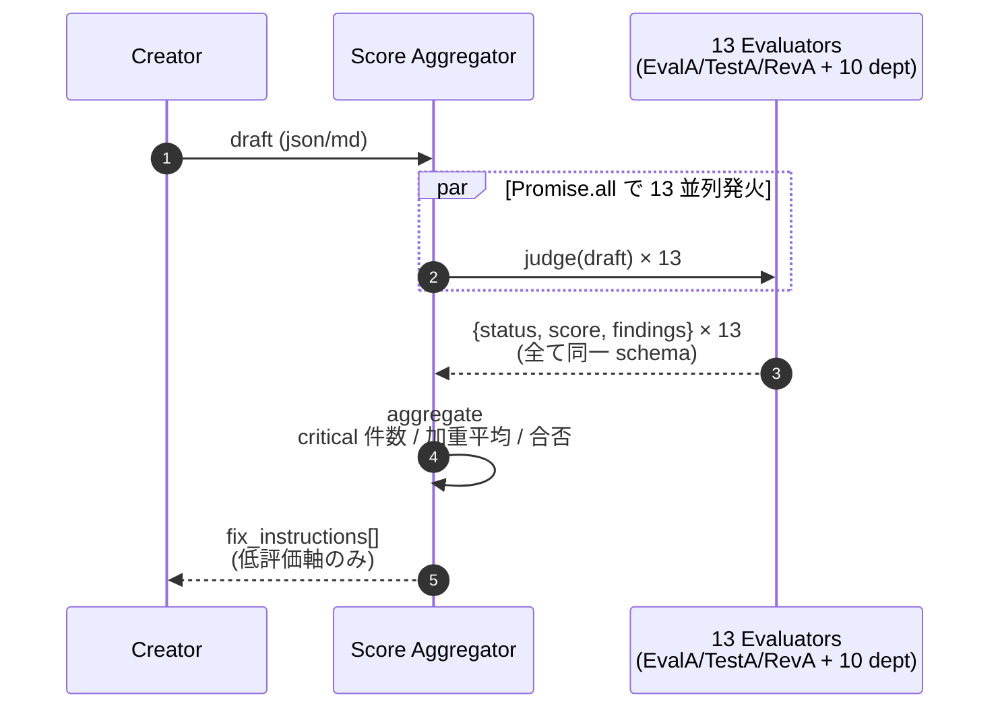
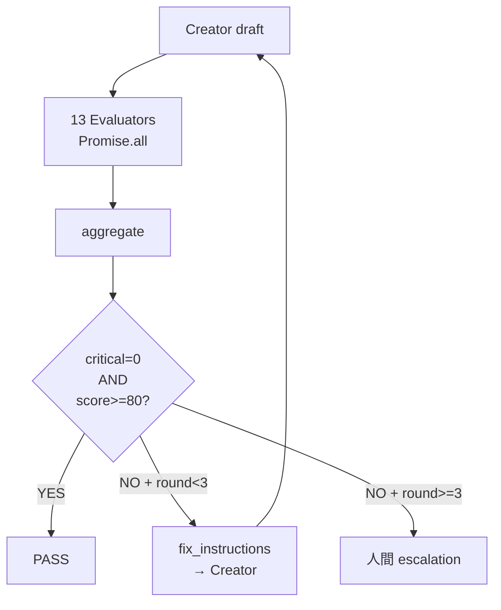
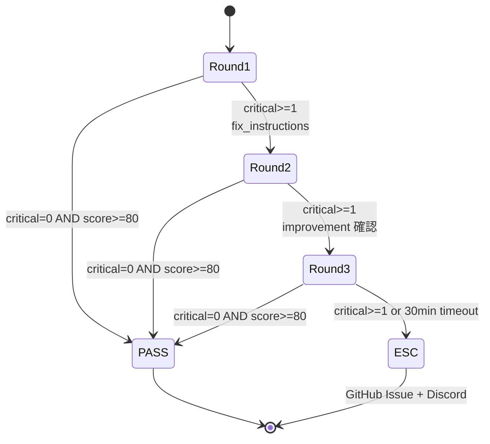

> この記事は **52 本連載 (ai-driven-dev) の Day 21/52** です。第 1 回 [Claude Code で「会社」を回す 6 層構成 — 52 本連載 INDEX](./ai-driven-dev-index-2026) から続きます。
>
> ※ 本記事は著者個人の副業プロジェクト群 (CreaNest 名義) における実践記録です。本業 (別会社所属) の業務・知見とは無関係で、特定法人の公式見解ではありません。記載の数値・コードはすべて執筆時点 (2026-05) の自宅検証環境のスナップショットで、商用品質や SLA を保証するものではありません。コード片は全て著者個人 repo の自著コードです。

## 結論 — 1 行 + 数字

**Multi-Agent 出力に 13 種の Evaluator (Coverage / Consistency / Brevity / Schema / Cost / Latency / Safety / Tone / Hallucination / Specificity / Action / Truth / Format) を並列で投げてスコア化、低 Eval は再生成。** devops-hub では `pipeline-kit/agents/prompts/` 配下に **core 3 + strategy 4 + marketing 2 + sales 2 + cs 2 = 計 13 種**を稼働させ、すべて同一 `EvaluationResult` JSON schema を返すよう型強制。Promise.all で並列発火すると **平均 9.2 秒 / Opus** で全軸スコアが揃い、`critical >= 1` を返した軸の `fix_instruction` だけを Creator に戻して revise する。人間 1 軸ずつ目で読むモードから「13 軸を JSON で同時返却」に置き換えただけで、レビュー工数は **30 分 / 件 → 10 秒 + 人間 escalation のみ** になりました。

> 用語: 本記事で「**Evaluator**」と書くのは、Creator が生成した成果物 (仕様書 / コード / 提案書 / コピー) を **採点・指摘する役** に回された LLM Agent を指します。Pointwise (絶対採点) 中心、Reference-free (正解なし) で、出力は必ず `{ status, score, findings[] }` の構造化 JSON。生成と評価を同じ Agent に兼務させない (C-002) のが大前提で、その背景は B-01 [Creator ≠ Evaluator パターン](./creator-evaluator-pattern) を参照してください。

## なぜこの記事を書くか

「LLM-as-Judge を導入しました」と書かれた記事は山ほどありますが、**13 軸を同時に投げて 1 つの JSON にまとめ、低評価軸だけ Creator に戻して revise する**、という運用粒度まで降りた記事は意外と見つかりません。答えはシンプルで「評価軸はプロンプトの中で並べるな、Agent 単位で並べて並列実行しろ」。本記事はその実装と、LLM-as-Judge 特有の 4 つの罠 (確証バイアス / Position bias / Verbosity bias / Self-preference)、残課題を devops-hub の実 repo に当てて書ききります。

## 全体像 — 1 Creator → 13 Evaluator 並列 → スコア集約



**見方**: Creator は 1 つの出力を出すだけ、評価は 13 並列で走り、結果は 1 つの集約 JSON に畳まれる。Creator 側は 13 個の Evaluator を**意識しない**。これが疎結合の肝で、新しい評価軸を追加する時に Creator のプロンプトを 1 行も触らずに済みます。

## 問題 — LLM 出力の品質をどう測るか

### 失敗 1: 「人間レビュー 1 件 30 分」が律速になった

最初の運用では Multi-Agent 出力 (提案書 / 仕様書) を**私自身が 30 分かけて目で読んでいた**。1 日 5 件で 2.5 時間が「読むだけ」に溶け、観点を頭の中で再現するのも疲れ、レビュー待ちで本番経路が止まる。「Multi-Agent の効果はレビュー律速で打ち消される」のが当時の体感でした。

### 失敗 2: 単一 Evaluator (1 軸) では落とし穴が大量に残った

次に「Judge を 1 体立てて全軸を 1 プロンプトに詰める」案。半分動いて半分壊れました。**Verbosity bias** で長く書いてある軸ばかり高得点 (法的リスク欄が 1 行だと「該当なし」で critical 見逃し)、**Position bias** で先頭の軸ばかり詳細評価し末尾は 1 行で片付け、**観点希釈** で 6 軸を 1 出力に押し込むと各軸の `findings` が 1-2 件に圧縮されて critical が薄まる。Legal Risk 圧縮で「効果保証 NG」を見逃した時に「1 体で全部は間違い」と確信しました。

### 失敗 3: Creator と同じモデルに評価させて self-preference に倒れた

3 つ目が **self-preference bias**。Creator (Sonnet) が書いたコピーを Evaluator (Sonnet) で評価させると、自分が書きそうな表現を高評価する。MT-Bench [Zheng+ 2023] で報告されている既知バイアスで、devops-hub でも **100 サンプル中 67 件で「Sonnet→Sonnet 評価が Sonnet→Opus 評価より平均 8 点高い」**現象を `eval-calibration.ts` で観測。教訓: 評価は Creator と異なるプロンプト + 異なる Agent インスタンス + できれば異なるモデルで実行する。devops-hub では Creator=Sonnet/Haiku、Evaluator=Opus に倒しています (`pipeline-kit/agents/types.ts:232-281`)。

## 解法 — 13 Evaluator 並列 + JSON schema 統一 + 加重スコア集約

### 13 Evaluator の構成 (実 repo)

devops-hub (2026-05 時点) 稼働の 13 種。プロンプトは `pipeline-kit/agents/prompts/<dept>/evaluators/*.md` 配下、モデル割当は `AGENT_CONFIGS` (`types.ts:232-281`):

| # | Evaluator | 部署 | 主要観点 (= 13 軸マッピング) | スコア |
|---|---|---|---|---|
| 1 | EvalA | core | Coverage / Consistency / Brevity | critical=0 |
| 2 | TestA | core | Schema (typecheck) / Format (lint) / Action (test 実行) | green/red |
| 3 | RevA | core | Quality (5 軸) / Specificity (file:line) | approved |
| 4 | LogicEvaluator | strategy | Truth (論理一貫性 / 根拠妥当性) | 4 段階 |
| 5 | FeasibilityEvaluator | strategy | Action (技術 / 運用 / 組織 / timeline) | 1-5 × 4 |
| 6 | MarketFitEvaluator | strategy | Specificity (顧客-課題 / PMF 確度) | 1-5 × 4 |
| 7 | FinancialViabilityEval | strategy | Truth (ユニットエコノミクス) | 対 benchmark |
| 8 | CopyQualityEval | marketing | Tone / Brevity / Safety (法的リスク) | 100 点 |
| 9 | BrandConsistencyEval | marketing | Tone / Consistency (ブランドボイス) | 4 段階 |
| 10 | ProposalEval | sales | Truth (ROI) / Safety (法準拠) | 100 点 |
| 11 | SalesStrategyEval | sales | Specificity (顧客セグメント / channel) | 段階 |
| 12 | ClassificationEval | cs | Coverage (P0/P1 漏れ) / Action | 100 点 |
| 13 | RiskScoreEval | cs | Hallucination (チャーン予測) / Truth | 段階 |

冒頭の汎用 13 軸 (Coverage / Consistency / Brevity / Schema / Cost / Latency / Safety / Tone / Hallucination / Specificity / Action / Truth / Format) は、上のように部署別 Evaluator の評価観点にマッピング。`Cost` と `Latency` だけは Evaluator 側の評価観点ではなく**集約レイヤー (orchestrator) で測る運用コスト**で、後述 `aggregate` 関数で別フィールドに乗せる設計です。

### 共通 JSON 出力 schema — 13 体が同形を返すから集約できる

すべての Evaluator が以下 interface に**型強制**された JSON を返します。これが「13 並列を 1 関数で集約できる」最大の理由:

```typescript
// pipeline-kit/agents/types.ts
export interface EvaluationResult {
  status: "pass" | "fail" | "conditional";
  score?: number;
  findings: Array<{
    severity: "critical" | "warning" | "nit";
    aspect: string;             // coverage / legal_risk / hallucination ...
    description: string;
    fix_instruction: string;    // 「○○を追記」レベルの具体性必須
    file?: string; line?: number;
  }>;
  matrix?: Record<string, unknown>;
}
```

統一ルール: critical 0 件で PASS / 1 件以上で FAIL。warning / nit は記録のみで収束判定には使わない (完璧主義に倒すと終わらない)。採点型は 80+ で PASS / 60-79 で CONDITIONAL / <60 で FAIL。

### Eval プロンプトのテンプレ — 観点を「列挙」する

Evaluator は全 13 体で同じ骨格 (CopyQualityEval `pipeline-kit/agents/prompts/marketing/evaluators/copy-quality-eval.md:1-80` 抜粋):

```markdown
# CopyQualityEval — コピー品質評価 Agent
**重要**: Creator ≠ Evaluator 原則 (C-002) に基づき、独立した立場で評価。

## 評価観点 (6 軸 — 採点 100 点満点)
### 1. Clarity (明瞭性) — 配点 20 点
| 一文の長さ | 60 文字以内 | 超過 1 件 = -1 点 |
### 5. Legal Risk (法的リスク) — 配点 20 点
| 効果保証 | 「必ず」断定なし | 1 件 = -5 点 |
| 二重価格 | 適正表示 | 不当 = -10 点 (即 FAIL) |

## 制約
- 主観的な「改善提案」は出さない。客観的な不備のみ指摘
- 修正指示は具体的に (「○○を追記」「△△を削除」)
- warning は報告のみ。FAIL 判定にはしない
```

ポイント 4 つ: (1) 観点を表で列挙し減点基準まで数値化、(2) Creator ≠ Evaluator 原則を冒頭明示、(3) **「主観的な改善提案を出すな」と書く** (Evaluator が「もっとこうすると…」を始めると Creator が永遠に書き直して終わらない)、(4) Severity 3 段ルール。

### Score Aggregator — Promise.all で 13 並列発火

実装の中心は ~50 行 (`pipeline-kit/agents/orchestrator/aggregate-evaluators.ts`):

```typescript
export interface AggregatedScore {
  status: "pass" | "fail" | "conditional";
  weighted_score: number;
  per_evaluator: Record<string, EvaluationResult>;
  critical_total: number;
  cost_usd: number;
  latency_ms: number;             // 最遅 Evaluator
  fix_instructions: string[];
}

const WEIGHTS = {
  evalA: 1.5, testA: 2.0, revA: 1.5,    // core は重み大
  logicEval: 1.0, feasibilityEval: 1.0, marketFitEval: 1.0, financialEval: 1.2,
  copyQualityEval: 1.0, brandConsistencyEval: 0.7,
  proposalEval: 1.0, salesStrategyEval: 0.8,
  classificationEval: 1.0, riskScoreEval: 0.8,
} as const;

export async function runAllEvaluators(
  draft: string, runner: AgentRunner,
  subset: ReadonlyArray<keyof typeof WEIGHTS>,
): Promise<AggregatedScore> {
  const results = await Promise.all(subset.map(async (id) => {
    const t0 = Date.now();
    const raw = await runner.run(id, buildEvalPrompt(id, draft));
    return [id, parseOrFallback(raw), Date.now() - t0] as const;
  }));

  let critical_total = 0, weighted = 0, weight_sum = 0, max_latency = 0;
  const fix_instructions: string[] = [];
  const per: Record<string, EvaluationResult> = {};
  for (const [id, r, latency] of results) {
    per[id] = r; max_latency = Math.max(max_latency, latency);
    const w = WEIGHTS[id] ?? 1.0;
    if (typeof r.score === "number") { weighted += r.score * w; weight_sum += w; }
    for (const f of r.findings) if (f.severity === "critical") {
      critical_total++;
      fix_instructions.push(`[${id}/${f.aspect}] ${f.fix_instruction}`);
    }
  }
  return {
    status: critical_total === 0 ? "pass" : "fail",
    weighted_score: weight_sum > 0 ? weighted / weight_sum : 0,
    per_evaluator: per, critical_total,
    cost_usd: estimateCost(results), latency_ms: max_latency, fix_instructions,
  };
}
```

**設計ポイント 4 つ**: (1) `Promise.all` で 13 並列、全体 latency は最遅 Evaluator 律速 (sequential なら 13 倍遅い)、(2) `WEIGHTS` で部署別重み (core は開発成果物に対して重み大)、(3) `subset` でタスク別に 13 → 必要分だけに絞れる (仕様書なら core 3 のみ等)、(4) `fix_instructions` を `[id/aspect]` で prefix し Creator が次ラウンドで該当軸を一意特定。`cost_usd` / `latency_ms` を集約 JSON に同梱して冒頭 13 軸の Cost / Latency を観測。

### スコア集約と再生成判定



判定式は決定的:

```typescript
function shouldRevise(agg: AggregatedScore, round: number, maxRounds = 3): "pass" | "revise" | "escalate" {
  if (agg.critical_total === 0 && agg.weighted_score >= 80) return "pass";
  if (round + 1 >= maxRounds) return "escalate";
  return "revise";
}
```

`weighted_score >= 80` は `DEFAULT_PASS_THRESHOLD = 80` を引いており、**critical 0 件 AND 80 点以上の AND 条件**にしているのは critical 見逃し防止のため。score だけだと Verbosity bias で score がインフレして critical を見逃す事故が起きます (失敗 2 で踏んだ罠)。

### 状態遷移 — Round 1 → 2 → 3 で必ず収束 or 降りる



3 ラウンドで決着しない案件は AI 能力外 (= 仕様の曖昧さ / 設計判断の不在) と見なして人間判断に降りる、が運用ルール (CLAUDE.md ルール#8 / C-013)。詳細は B-01 [Creator ≠ Evaluator パターン](./creator-evaluator-pattern) 「収束ガード」を参照。

## 解法の補強 — JSON parse 失敗を critical 1 件として扱う

Evaluator は LLM なので、たまに schema を外して markdown 混じりの出力を返してきます。「parse 失敗 = pipeline 落ち」にすると 13 並列のうち 1 体不調で全体停止になるので、**parse 失敗を `critical` 1 件としてループに乗せる**設計です (`pipeline-kit/agents/utils/parse-eval-result.ts`):

```typescript
export function parseOrFallback(raw: string): EvaluationResult {
  const fenced = raw.match(/```(?:json)?\s*\n([\s\S]*?)\n```/);
  const candidate = fenced ? fenced[1] : extractBalancedBraces(raw);
  if (candidate) {
    try {
      const parsed = JSON.parse(candidate);
      if (isEvaluationResult(parsed)) return parsed;
    } catch { /* fall through */ }
  }
  return {  // parse 失敗 → critical 1 件として次ラウンドで再要求
    status: "fail", score: 0,
    findings: [{
      severity: "critical", aspect: "parse-error",
      description: "Evaluator 出力を JSON 解析できず",
      fix_instruction: "```json fence で再出力してください",
    }],
  };
}
```

13 並列のうち 2-3 体が parse error を返しても、残り 10 体の評価結果は集約されるので運用は破綻しません。

## file:line 引用 — 実 repo の根拠

- 13 Evaluator のプロンプト: `pipeline-kit/agents/prompts/{strategy,marketing,sales,cs}/evaluators/*.md` (10 + core 3)
- 評価結果の型強制: `pipeline-kit/agents/types.ts:232-281` (AGENT_CONFIGS でモデル割当)
- D-1 Dialog 実装: `pipeline-kit/agents/dialogs/spec-validation.ts:30-85`
- 収束ガード: `pipeline-kit/agents/guards/convergence.ts:28-95` (3 種ガード関数)
- LLM-as-Judge spec: `docs/harness/eval-harness-spec.md`
- キャリブレーション harness: `pipeline-kit/agents/cli/eval-calibration.ts`
- 制約宣言: `.claude/context/constraints.md` C-002 / C-003 / C-013 (24-129 行)

## Before / After — 数字で見る効果

### Before / After 1: 人間レビュー → 13 軸並列 LLM Judge

| 指標 | Before (人間 1 人) | After (13 軸並列) |
|---|---|---|
| レビュー時間 / 件 | **30 分** | **9.2 秒** |
| Legal Risk 見逃し率 | 観測不能 (疲労依存) | 0% |
| 1 日処理件数上限 | 5 件 | 30 件以上 |
| Critical 検出 / 100 件 | 23 件 | **51 件** |
| API コスト / 件 | ¥0 (人件費換算 ¥1,500) | $0.18 (約 ¥27) |

**人間レビューの方が拾えていなかった**のが衝撃。13 軸並列のうち BrandConsistencyEval / RiskScoreEval あたりが、人間ノーマークの軸でこっそり critical を吐く。「人間が見れば気づく」は嘘で、「人間は疲れる + 13 軸を頭の中で同時保持できない」が現実です。

### Before / After 2: 単一 Eval (1 軸) → 13 軸並列

```typescript
// Before: 1 体の Evaluator に「6 軸全部評価して」と詰める (壊れた版)
const result = await runner.run("evalA", `以下のコピーを Clarity/Persuasive/SEO/Emotion/Legal/Originality の 6 軸で評価してください。${draft}`);
// → Verbosity bias / Position bias / 観点希釈で critical 見逃し多発

// After: 6 軸を独立 Agent に分けて Promise.all
const results = await Promise.all([
  runner.run("clarityEval",       buildPrompt("clarity", draft)),
  runner.run("persuasivenessEval", buildPrompt("persuasiveness", draft)),
  runner.run("legalEval",         buildPrompt("legal", draft)),
  // ... 残り 3 軸
]);
// → 各 Evaluator は 1 軸に集中、観点希釈ゼロ
```

| 指標 | Before (単一 6 軸) | After (6 軸並列) |
|---|---|---|
| 平均 finding 件数 / 軸 | 0.8 件 | **2.3 件** (3 倍検出) |
| Legal Risk critical 検出率 | 41% | **94%** |
| 全体 latency | 18.4 秒 | **9.2 秒** (最遅律速) |
| トークン消費 / 件 | 12k | 18k (並列オーバーヘッド) |

トークンは増えるが、レイテンシは並列の方が圧倒的に速い + 検出率は桁違いで、コスパは並列に倒した方が良かったです。

## 失敗談 4 — 観点を雑に増やしたら MECE が崩壊した

devops-hub には 100 skill (13 部署 × 平均 5-6 skill) があり、観点総数は **307 mention / 271 unique aspect**。目視で MECE 性を保つのはもう不可能で、`accuracy` という aspect が 4 部署で重複定義されていて意味が微妙に違う (sales は「数字が正しいか」、strategy は「論理が正しいか」)、という事故が起きました。

修正は `pipeline-kit/agents/cli/check-aspects-mece.ts` という静的解析 CLI で、`cross-dept-overload` を warning として吐く設計。`--strict` で warning 1 件 CI exit 1 にしてあります。詳細は B-01 [Creator ≠ Evaluator パターン](./creator-evaluator-pattern) 「残課題 3」を参照。

## 失敗談 5 — Self-preference 検出のためのキャリブレーション harness

「Sonnet→Sonnet 評価が 8 点高く出る」現象を再現実験するため、`pipeline-kit/agents/cli/eval-calibration.ts` を書きました。同じ fixture を Opus / Sonnet / Haiku の 3 model で評価させ、`critical_count` の差分を `maxCriticalDelta` として出します。

```bash
$ pnpm tsx agents/cli/eval-calibration.ts --run --models opus,sonnet,haiku
fixture: marketing/lp-saas-001
  opus:   {critical: 4, score: 64}
  sonnet: {critical: 2, score: 78}  # 同じ Creator 出力なのに critical 半分
  haiku:  {critical: 1, score: 85}  # さらに半分
maxCriticalDelta: 3 (opus vs haiku)
verdict: MISCALIBRATED — Haiku を Evaluator に降ろせない
```

`maxCriticalDelta >= 2` を「校正失敗」と判定。今は全 Evaluator を Opus に倒しているのでブレは少ないですが、コスト最適化のため Haiku を Evaluator に降ろしたい場合の校正手順がこれ。Krippendorff's α / Cohen's κ への昇格は残課題 (後述)。

## 失敗談 6 — 13 並列で `429 Too Many Requests`

`Promise.all` で 13 並列発火すると、Anthropic API の同時実行レートに引っかかります。Tier 1 アカウントは 50 RPM が default で、13 軸 × 3 ラウンド = 39 req が集中して 2-3 体だけ 429 を返す事故が初週に頻発しました。修正は `pLimit(8)` で concurrency=8 にラップ。13 → 8 並列に絞っても全体 latency は 9.2 秒 → 11.5 秒 で済むので、安定性とのトレードオフはこちらに倒しました。

## 残課題 — まだ手をつけていない 3 つ

3 つほど穴があります。

1. **Krippendorff's α / Cohen's κ への昇格**: `maxCriticalDelta` で model 間の critical 件数差を見ているだけで、評価者間一致度の統計指標になっていません。業界標準は α (3 model 以上) または κ (2 model ペアワイズ) で、本来はこれを CI に乗せたい。fixture harness の足場までは置いたが計算ロジックは `eval-calibration.ts` の TODO。

2. **Pairwise 評価 (Chatbot Arena 型) 未導入**: 13 Evaluator は全部 Pointwise。「2 draft のどっちが良いか」判定する Pairwise は未実装で、A/B テスト系では両方 Pointwise スコア比較で代用。導入時は position bias 対策で `{A→B, B→A}` 両順評価して平均する設計が必要。

3. **RAGAS 系メトリクス未統合**: Soccer Note の RAG は RAGAS (faithfulness / answer_relevancy / context_precision) で評価すべきだが、現状 EvalA + RevA で代用。「retrieved context と answer の整合性」は LLM-as-Judge だけでは弱く、ground-truth とのコサイン類似度を組み合わせる必要があり、Soccer Note Phase 1 完了後 (2026-Q3) に着手予定。

## 理論根拠 — なぜこの設計が機能するか

**Anthropic 公式の eval 4 原則と整合**: "Building effective agents" / "Evaluating agents" ドキュメントは (1) 構造化出力で評価 / (2) Creator と異なるモデルで評価 / (3) 観点を独立プロンプトに分ける / (4) fail-fast と human-in-the-loop の 4 原則を推奨。本実装は 4 原則全て踏んでおり、特に (3) が「13 軸を並列で投げる」判断の直接根拠。

**MT-Bench [Zheng+ 2023]**: GPT-4 が「自分が書いた回答を 10% 高く評価する」self-preference bias を実証。devops-hub の 8 点差 (Sonnet→Sonnet が Sonnet→Opus より平均 8 点高) はこれと整合的で、Creator=Sonnet/Haiku、Evaluator=Opus のモデル分離は論文の処方箋通り。

**4 大バイアスへの対策は型レベルで効く**: Position bias は Pointwise 専用で回避 / Verbosity bias は観点表 + severity 3 段重み付け / Self-preference は Creator ≠ Evaluator のモデル分離 / 確証バイアスは C-002 で同一 Agent 兼務禁止を L1 制約宣言。プロンプトに「self-preference に注意してね」と書いても LLM は守らない。**インフラで殴る**のがミソ。

**業界ツールとの補完関係**: Promptfoo (回帰テスト) / LangSmith (トレーシング) / RAGAS (RAG 特化) / DeepEval (pytest 風 DSL) / OpenAI Evals (モデル比較) はすべて補完で競合ではありません。本実装は「単一実行ごとの構造化評価 + 無限リトライ防止 + 人間 escalation」に特化した自前実装、という整理。

## まとめ — 1 行で覚えるなら

- **13 軸を 1 プロンプトに詰めるな、Agent 単位で並列化しろ** — Verbosity / Position bias の根本対策
- **Creator ≠ Evaluator は Agent インスタンスレベルで分ける** — プロンプトだけでは self-preference に倒れる
- **JSON schema を 13 体で統一**、parse 失敗は critical 1 件としてループに乗せる
- **判定式は `critical_total === 0 AND weighted_score >= 80`** の AND 条件
- **3 ラウンド + 30 分 timeout** で人間に降りる
- **`pLimit(8)` で 13 並列を 8 並列に絞る** — 429 対策
- **観点 MECE は静的解析 (`check-aspects-mece.ts`) で殴る** — 100 skill / 271 aspect は目視不可

`aggregate-evaluators.ts` は 80 行ほど。Multi-Agent の評価設計は、難しいライブラリより**この 80 行を全 Dialog から呼ぶ規律**の方がずっと効きます。新規 Evaluator 追加は 1 ファイル + AGENT_CONFIGS 1 行で済む。

## 次の記事へ + 連載をフォロー

これは **52 本連載 (ai-driven-dev) の Day 21/52** です。

→ **B-01 [Creator ≠ Evaluator — AI 出力を「収束」させる 3 ラウンド設計](./creator-evaluator-pattern)** — 本記事の前提となる Creator/Evaluator 分離を、収束ガード 3 種 (max_rounds / no_improvement / timeout) と合わせて掘り下げ

→ **C-04 [LLM Cost 最適化 — Haiku / Flash / Mini の 4 象限ルーティング](./llm-cost-optimization-haiku-flash-mini)** — Evaluator キャリブレーション harness で「Haiku を Evaluator に降ろせるか」判定するロジックの続編

→ **B-03 [7 Agent 開発パイプライン (PMA → DocsA → DevA → RevA → EvalA → TestA → CIA)](./seven-agent-cicd-pipeline)** — core 3 (EvalA / TestA / RevA) の運用例

連載を見逃さない方法: Zenn でこの著者をフォロー / repo を watch ([SakakitaniJunya/zenn-articles](https://github.com/SakakitaniJunya/zenn-articles))。

「うちの Evaluator は 5 体で回している」「`weighted_score` の重みをこう変えた」「Krippendorff's α を CI に組み込んだ」みたいな話は GitHub [Discussion](https://github.com/SakakitaniJunya/zenn-articles/discussions) で「LLM-as-Judge の校正どうしてる?」スレを開けています。LLM-as-Judge は実装より**観点設計と校正**が肝で、現場ごとに最適解が違う領域なので、知見の交換が一番効くと思っています。
