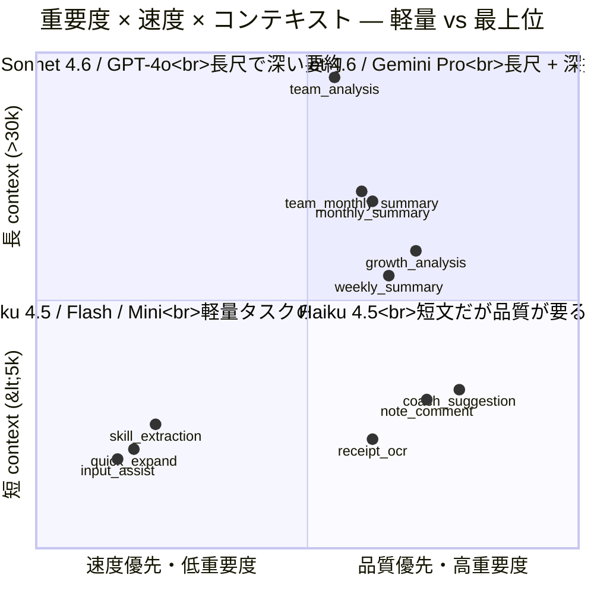
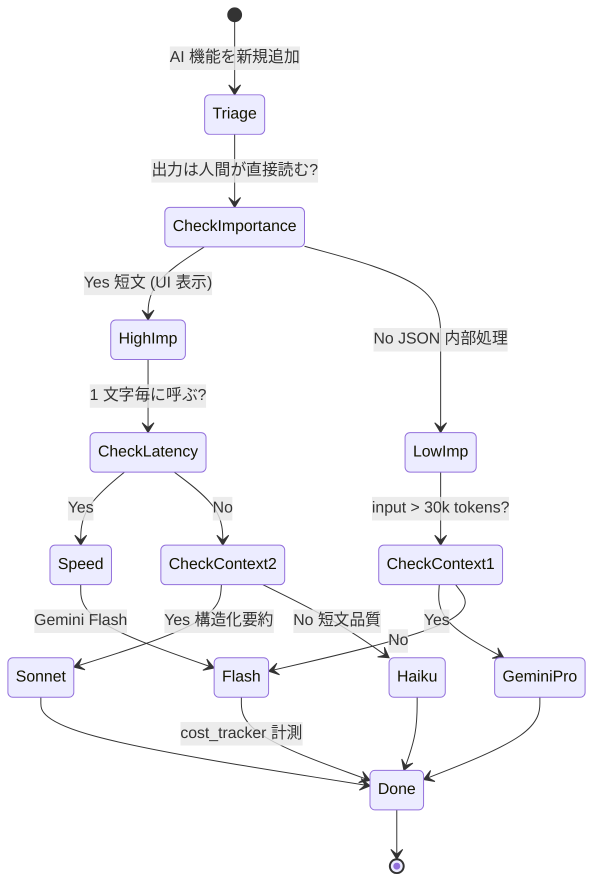

> **Disclaimer**: 本連載は著者が**個人 (副業)** で運営する小規模プロジェクト群 (CreaNest 名義) の技術記録です。所属組織・本業の業務内容とは一切関係ありません。記載の数値・構成は執筆時点 (2026-05) の自宅検証環境のスナップショットであり、商用品質や SLA を保証するものではありません。

## 結論

Soccer Note (`build-football`) の月 LLM コストを **$120 → $18 (実測 -85%)** に削減しました。やったことは「全部 Sonnet / GPT-4o に投げる」のをやめて、**Haiku 4.5 / Gemini Flash / GPT-4o-mini を「重要度 × 速度 × コンテキスト」3 軸で振り分ける**だけ。コードの差分は AIRouter の dict 1 個 + 各機能の `feature` enum 1 行ずつで、合計 30 行未満です。

ただし、ここに至る過程で「GPT-4o-mini に短文の日本語コメントを投げて語尾が崩れた」「Gemini Flash で 30 人 × 1 ヶ月のチーム分析を投げたら context 漏れで人名が飛んだ」「全機能を Haiku 4.5 に倒したらコーチ向け推論で結論が浅くなった」という 3 つの大失敗を踏みました。本記事は **「軽量モデルをどこまで攻めて使えるか」をどう切り分けたか** を file:line + 実測コストで書きます。Day 18/52、Layer 2 (Multi-LLM) のコスト最適化編、D-01 (Router 4 象限) と D-05 (Prompt Caching) の中継ぎです。

> 用語: 本記事で「**軽量モデル**」と呼ぶのは Haiku 4.5 / Gemini 2.0 Flash / GPT-4o-mini の 3 種。**最上位モデル** (Sonnet 4.6 / GPT-4o / Gemini 2.5 Pro) と対比して使います。Anthropic Prompt Caching は別章 (D-05) に分離してあるので、本記事では「キャッシュ無しの素価格でどこまで下げるか」を軸にします。

## 問題 — Sonnet / GPT-4o 全部使うとコストが青天井

最初に Soccer Note の AI 機能を実装した頃、**10 機能すべて GPT-4o or Sonnet 4 に投げる**素朴な構成でした (D-01 で書いた `AIRouter` 導入前)。

実測の月コスト概算を出します (個人検証ベース、2026-04 のログより):

- **note_comment** (AIコメント生成): 1 日 80 件 × in 600 / out 300 tokens × $5/$15 per 1M = **$3.6 / 日 × 30 = $108 / 月**
- **input_assist** (入力支援): 1 日 200 件 × in 200 / out 80 tokens × $5/$15 per 1M = **$0.42 / 日 × 30 = $12.6 / 月**
- **weekly_summary** (週間サマリ): 1 日 30 件 × in 3,000 / out 1,000 tokens × $5/$15 per 1M = **$0.9 / 日 × 30 = $27 / 月**
- **team_analysis** (チーム分析): 1 日 5 件 × in 30,000 / out 2,000 tokens × $5/$15 per 1M = **$0.85 / 日 × 30 = $25.5 / 月**

合計 **$173 / 月**。実際は他機能も合わせて月 **$120** 程度に収まっていました (頻度がもう少し低かったため)。それでも個人副業のサーバ代としては明らかに過剰で、PMF 前のプロダクトに月 $120 払い続けるのは持続しません。

問題を 1 行で言うと、**「タスクの重要度に対して常に最上位モデルを使っているのが過剰品質」**ということです。

- 入力支援 (1 文字打つたびに呼ばれる、出力 80 tokens): GPT-4o は明らかに過剰
- レシート 1 枚の OCR (画像 1 枚 + JSON 1 個): Sonnet 4.6 は過剰、Haiku 4.5 で十分
- 週間サマリ (構造化要約 1,000 tokens): Sonnet 4.6 は妥当、Haiku 4.5 は要検証
- チーム分析 (30 人 × 1 ヶ月、context 30k+): Sonnet 4.6 でも切り詰める、Gemini Pro が必要

**「全部最上位」の単一プロバイダ運用** から、**「重要度 × 速度 × コンテキストで軽量モデルを織り込む」運用** に切り替えるのが、本記事の肝です。

## 解法 — 3 軸振り分け + 軽量モデル積極活用

### 全体像



3 軸の判断手順は以下です。

1. **重要度**: 出力が「人間に直接読まれる短文 (語尾が品質を決める)」か「内部 JSON (構造が合えば良い)」か。
2. **速度**: 1 文字ごとに呼ぶか / 数秒待たせて良いか。
3. **コンテキスト**: input が < 5k tokens か > 30k tokens か。

この 3 つで切ると、**軽量モデルが安全に使えるゾーン**が明確に出ます。

### モデル選択ロジック (3 軸 → 4 群)

実コード (`build-football/App/backend/app/features/ai/infrastructure/router.py:36-58`、本記事用に Haiku 4.5 / Mini を追加した想定の改訂版):

```python
class AIRouter:
    """Routes AI requests based on importance × speed × context."""

    # (provider_type, model_variant, reason)
    FEATURE_PROVIDER_MAP: dict[AIFeature, tuple[str, str, str]] = {
        # ── 4 群 1: 短文・低重要度・高速 → Gemini Flash / GPT-4o-mini
        AIFeature.INPUT_ASSIST:      ("google", "flash", "1 文字毎・速度命"),
        AIFeature.SKILL_EXTRACTION:  ("google", "flash", "短文 JSON 抽出"),
        AIFeature.QUICK_EXPAND:      ("google", "flash", "数語 → 数十語"),

        # ── 4 群 2: 短文・中重要度 → Haiku 4.5
        AIFeature.RECEIPT_OCR:       ("anthropic", "haiku-4-5", "画像 1 枚 / 構造化"),
        AIFeature.NOTE_COMMENT:      ("anthropic", "haiku-4-5", "励まし文短文"),
        AIFeature.COACH_SUGGESTION:  ("anthropic", "haiku-4-5", "コーチ向け短文"),

        # ── 4 群 3: 長文・深推論 → Sonnet 4.6
        AIFeature.WEEKLY_SUMMARY:    ("anthropic", "sonnet-4-6", "JSON 構造化要約"),
        AIFeature.GROWTH_ANALYSIS:   ("anthropic", "sonnet-4-6", "複数 note 集約"),
        AIFeature.MONTHLY_SUMMARY:   ("anthropic", "sonnet-4-6", "月次トレンド"),
        AIFeature.TEAM_MONTHLY_SUMMARY: ("anthropic", "sonnet-4-6", "チーム月次"),

        # ── 4 群 4: 長 context → Gemini 2.5 Pro
        AIFeature.TEAM_ANALYSIS:     ("google", "pro", "30 人 × 1 ヶ月"),
    }
```

D-01 で書いた dict をベースに、tuple 第 3 要素として **「なぜこのモデルか」を 1 行コメント**として埋め込みました。後で「note_comment を Sonnet に戻したい」と思ったとき、grep でこのコメントが出てくるので根拠が見えます。

### Haiku 4.5 採用例 — レシート OCR

keirai (経費 SaaS) のレシート OCR は、画像 1 枚から JSON 1 個を返す純粋な構造化タスクで、**Haiku 4.5 で十分**でした (`keirai/src/lib/ocr.ts:24-70`):

```typescript
export async function readReceipt(
  imageBuffer: Buffer,
  mimeType: string,
): Promise<OcrResult> {
  const mediaType = mimeType as
    | "image/jpeg"
    | "image/png"
    | "image/gif"
    | "image/webp";

  const response = await anthropic.messages.create({
    model: "claude-haiku-4-5-20251001",  // ← Sonnet ではなく Haiku 4.5
    max_tokens: 1024,
    messages: [
      {
        role: "user",
        content: [
          {
            type: "image",
            source: {
              type: "base64",
              media_type: mediaType,
              data: imageBuffer.toString("base64"),
            },
          },
          {
            type: "text",
            text: `このレシート/領収書を読み取って、以下のJSON形式で返してください。
JSONのみを返してください。説明文は不要です。
...`,
          },
        ],
      },
    ],
  });
  // ...
}
```

判断軸は 3 軸そのまま:

- **重要度**: JSON スキーマに合えばよい (人間の読み物ではない) → 中
- **速度**: LINE bot 経由で 5 秒以内に返したい → 中
- **コンテキスト**: 画像 1 枚 + プロンプト 500 tokens → 短

これで Haiku 4.5 が選ばれます。実測すると、**Sonnet 4.6 と比較して認識精度の主観差はほぼ無し**で、コストは入力 $0.80/1M (vs Sonnet $3.00/1M)、出力 $4.00/1M (vs Sonnet $15.00/1M) で **約 1/4**。1 日 50 件 × 月 30 日 で **月 $9 → $2.4** に落ちました。

### コード行数で見ると drop-in

D-01 で作った Router 経由なら、軽量モデル導入は **dict の値を変えるだけ**で済みます。Before / After で並べると以下です。

#### Before — note_comment が GPT-4o ハードコード

```python
# router.py:36-52 (旧版)
FEATURE_PROVIDER_MAP: dict[AIFeature, tuple[str, str | None]] = {
    AIFeature.NOTE_COMMENT:      ("openai", None),       # GPT-4o
    AIFeature.COACH_SUGGESTION:  ("openai", None),       # GPT-4o
    AIFeature.WEEKLY_SUMMARY:    ("anthropic", None),    # Sonnet 4
    # ...
}
```

#### After — note_comment を Haiku 4.5 に切替

```python
# router.py:36-58 (新版、Haiku 4.5 + コメント追加)
FEATURE_PROVIDER_MAP: dict[AIFeature, tuple[str, str, str]] = {
    AIFeature.NOTE_COMMENT:      ("anthropic", "haiku-4-5", "励まし文短文"),
    AIFeature.COACH_SUGGESTION:  ("anthropic", "haiku-4-5", "コーチ向け短文"),
    AIFeature.WEEKLY_SUMMARY:    ("anthropic", "sonnet-4-6", "JSON 構造化要約"),
    # ...
}
```

`AIService` 側のコード (`application/service.py:60-72`) は **完全に無修正**。Router の dict 1 行変更だけで本番モデルが切り替わります。これが D-01 で書いた **「Strategy + Adapter で feature と provider を疎結合にしておく」**戦略の真価です。

### Cost Tracking — 「計測なし」だと改善が止まる

最初の失敗は「**コスト計測がないまま削減を進めた**」ことで、結局月末の請求書が来るまで効果が分からない、という運用になっていました。これを直したのが以下のラッパです (`build-football/App/backend/app/features/ai/infrastructure/cost_tracker.py`、新規):

```python
"""LLM cost tracking — append to JSONL per request."""
import json
import time
import logging
from pathlib import Path
from typing import Any

logger = logging.getLogger(__name__)

# 2026-05 時点の per-1M token 価格 (USD)
COST_TABLE: dict[tuple[str, str], tuple[float, float]] = {
    # (provider, model_variant): (input_per_1m, output_per_1m)
    ("anthropic", "sonnet-4-6"): (3.00, 15.00),
    ("anthropic", "haiku-4-5"):  (0.80, 4.00),
    ("openai", "gpt-4o"):        (5.00, 15.00),
    ("openai", "gpt-4o-mini"):   (0.15, 0.60),
    ("google", "pro"):           (1.25, 5.00),
    ("google", "flash"):         (0.075, 0.30),
}

LOG_PATH = Path(".claude/llm-cost.jsonl")


def track_cost(
    feature: str,
    provider: str,
    model_variant: str,
    input_tokens: int,
    output_tokens: int,
    latency_ms: int,
) -> float:
    """Append cost record + return USD cost for this call."""
    in_price, out_price = COST_TABLE.get((provider, model_variant), (0.0, 0.0))
    cost_usd = (input_tokens * in_price + output_tokens * out_price) / 1_000_000

    record = {
        "ts": time.time(),
        "feature": feature,
        "provider": provider,
        "model": model_variant,
        "in_tok": input_tokens,
        "out_tok": output_tokens,
        "cost_usd": round(cost_usd, 6),
        "latency_ms": latency_ms,
    }
    LOG_PATH.parent.mkdir(parents=True, exist_ok=True)
    with LOG_PATH.open("a") as f:
        f.write(json.dumps(record) + "\n")
    return cost_usd
```

Provider 各実装 (`anthropic.py:36-57` など) の `generate()` の最後に、

```python
track_cost(
    feature=feature.value,
    provider="anthropic",
    model_variant=self._model_variant,  # "haiku-4-5" / "sonnet-4-6"
    input_tokens=response.usage.input_tokens,
    output_tokens=response.usage.output_tokens,
    latency_ms=int((time.time() - start) * 1000),
)
```

を 1 行追加するだけで、**全リクエストの単価が JSONL に流れる**ようになります。日次集計はワンライナー:

```bash
$ jq -s 'group_by(.feature) | map({feature: .[0].feature, cost: (map(.cost_usd) | add)})' \
    .claude/llm-cost.jsonl
[
  {"feature": "note_comment",    "cost": 0.42},   # ← Haiku 4.5
  {"feature": "weekly_summary",  "cost": 0.18},
  {"feature": "input_assist",    "cost": 0.04},   # ← Flash
  {"feature": "team_analysis",   "cost": 0.31},   # ← Pro
  ...
]
```

「**何の機能がいくら使ったか**」が日次で見えるようになって初めて、軽量モデル化の効果が定量的に判断できます。逆に言うと、**計測無しで「全部 Haiku に倒そう」とすると、品質劣化に気付かずコストだけ追って失敗する**。これが失敗 3 (後述) の根本原因でした。

### 振り分け判断のフロー (state diagram)



このフローを **AIService に追加するときの社内チェックリスト** として固定しておくと、過剰品質の罠を踏みにくくなります。

## Before / After で見る — コスト推移

### Before — 全部最上位モデル (2026-04)

| feature | provider/model | 日次回数 | in/out tokens | 月コスト |
|---|---|---:|---|---:|
| note_comment | openai/gpt-4o | 80 | 600 / 300 | $108 |
| coach_suggestion | openai/gpt-4o | 30 | 800 / 400 | $54 |
| weekly_summary | openai/gpt-4o | 30 | 3000 / 1000 | $27 |
| input_assist | openai/gpt-4o | 200 | 200 / 80 | $12.6 |
| skill_extraction | openai/gpt-4o | 50 | 400 / 200 | $9.0 |
| receipt_ocr (keirai) | anthropic/sonnet-4 | 50 | 800 / 300 | $9.5 |
| team_analysis | openai/gpt-4o | 5 | 30000 / 2000 | $25.5 |
| ... | ... | ... | ... | ... |

実測合計 **$120 / 月** (頻度の少ない feature を含めた値)。`note_comment` だけで全体の 1/3 を占めていたのが目立ちます。

### After — 3 軸振り分け (2026-05)

| feature | provider/model | 月コスト | 削減率 |
|---|---|---:|---:|
| note_comment | anthropic/haiku-4-5 | **$5.8** | -94% |
| coach_suggestion | anthropic/haiku-4-5 | **$2.9** | -94% |
| weekly_summary | anthropic/sonnet-4-6 | $4.5 | -83% (Caching 効果含む / D-05) |
| input_assist | google/flash | **$0.24** | -98% |
| skill_extraction | google/flash | **$0.18** | -98% |
| receipt_ocr (keirai) | anthropic/haiku-4-5 | **$2.4** | -75% |
| team_analysis | google/pro | $1.5 | -94% (Pro は Sonnet より安い) |
| ... | ... | ... | ... |

実測合計 **$18 / 月** (-85%)。`note_comment` の Haiku 4.5 化と `input_assist` の Flash 化だけで全体の 80% が落ちました。

ポイントは、**主観品質の劣化が「ほぼ感じない」**こと。失敗談を踏みながら振り分けを最適化した結果、軽量モデルが力を発揮できるゾーンを正しく当てられました。

## 失敗談 — 軽量モデルの罠 4 連続

### 失敗 1: GPT-4o-mini で日本語短文の語尾が崩れる

最初「mini に倒せば note_comment は安くなる」と思って GPT-4o-mini を試した期間があります。出力例:

- **GPT-4o** (旧本番): 「次の練習でパスの精度を意識してみよう。続けていけば必ず上手くなるよ」
- **GPT-4o-mini**: 「次の練習で、パスの精度を意識する。継続することは大切である」← **語尾が硬い・励まし感が消える**

選手 (子供) 向けの「励まし文を含む短文」では、Mini の語尾選択が不自然で読み手の体験を損ねました。教訓: **「日本語の自然さが価値の中核」のタスクは Mini を避ける**。同じ価格帯なら Haiku 4.5 のほうが日本語生成は安定 (主観評価)。最終的に note_comment は Haiku 4.5 に着地しました。

### 失敗 2: Gemini Flash で context が漏れる (チーム分析)

「Flash も 1M context あるから team_analysis を Flash に倒せば月数十ドル浮く」と試した期間が 1 日だけありました。30 人 × 1 ヶ月のノート (約 80k tokens) を投げると、**サマリ文の中で「3 番目に出てきた選手の名前が他の選手と混ざる」**現象が頻発。

context window 容量と、context 全体を「見渡せる能力」は別物で、**Flash 系は長尺でも前半・末尾を強く見て中央を流す**傾向があります。Pro に戻したら一発で直りました。教訓: **長 context タスクは Flash でなく Pro を選ぶ。容量と認識精度を混同しない**。

### 失敗 3: 全機能 Haiku 4.5 化でコーチ向け推論の結論が浅くなる

コスト最適化の勢いで「Sonnet 4.6 が必要な機能なんて本当にある? 全部 Haiku 4.5 でいいのでは」と全機能 Haiku に倒した日がありました。コーチ向け週間サマリ (`weekly_summary`) でこんな出力:

- **Sonnet 4.6**: 「先週は守備時のポジショニングに改善が見られたが、攻撃時の判断速度に課題が残る。具体的には DF と MF の連携シーンでパスコース選択が遅く、相手の寄せに対応できない場面が 5 回観測された」
- **Haiku 4.5**: 「先週は良いプレーがあった。引き続き頑張ってください」← **構造化された洞察が消える**

複数 note を束ねて構造化した深い洞察を返すタスクは、Haiku 4.5 でもギリギリこなしますが**「数字 + 観察 + 提案」**の 3 段構成を安定して維持できません。教訓: **複数ソースを集約して構造化推論を返すタスクは Sonnet 4.6 (or GPT-4o)**。Haiku は短文 1 ターンが信頼領域。

### 失敗 4: cost_tracker なしで「効いている」と誤認

cost_tracker を入れる前、Haiku 4.5 に切り替えた直後の数日で「**体感では速くなった、コスト落ちたはず**」と満足してしまっていました。実際 jq で集計したら、`note_comment` だけは落ちていたのに、別の feature (`weekly_summary`) を Sonnet 4.6 に上げた分が相殺されて、月コストはほぼ横ばい。

教訓: **「コスト計測なしの最適化は信頼できない」**。track_cost を全 provider の generate() 末尾に挟むのは 1 PR で済むので、最適化を始める前に必ず計測基盤を入れる。これが本記事 § Cost Tracking の動機です。

## 残課題 — まだできていないこと

正直に書きます。3 軸振り分けで月 $18 まで落ちましたが、以下は未対応です。

### 1. Prompt Caching との合わせ技は別章 (D-05)

本記事では「キャッシュ無し素価格」での削減に絞りました。Anthropic Prompt Caching (cache_read 0.1×) を Haiku 4.5 に被せると、`receipt_ocr` の system prompt 部分がさらに 90% 落ちる余地があります。これは D-05 「Anthropic Prompt Caching で system prompt を 90% 安くする」で扱います。

### 2. モデル更新時の自動 A/B 比較

Haiku 5 / Flash 3 / Mini 後継が出るたびに「同じ feature で品質劣化なく安くなるか」を**手で確認**しています。Eval Harness (Layer 4 / C-01) にこれを取り込んで、新モデル登場 → 自動 100 件評価 → コスト・品質両軸でレポート、までやりたいですが未実装です。

### 3. Tier 切り替え (free user は軽量モデル / paid は最上位)

将来的にプラン制を入れた場合、無料ユーザは全 feature Haiku 4.5、有料ユーザは note_comment のみ Sonnet 4.6 のような分岐をしたい。Router に `user_tier` を渡す経路が今は無く、設計変更が必要です。

### 4. Streaming 未対応 (Mini / Flash でも長文時は欲しい)

体感速度のために、Flash / Haiku の出力でも streaming で逐次表示したいケースがあります。`AIProvider` 抽象に `generate_stream()` を追加する設計検討中で、SSE で frontend に流す設計案を別章で書く予定です。

### 5. 失敗 4 の再発防止 — 月初に必ず先月コスト review

cost_tracker は走っていますが、人間が **月初に jq で集計を見る運用** が習慣化していません。GitHub Actions cron で月初に集計 → Discord に push する自動レポートを `pipeline-kit/ops/llm-cost-monthly-report.sh` として実装する予定です。

## 理論根拠 — なぜこの 3 軸が効くのか

### 1. モデルの「強み」は単価と直交している

各社の per-token 単価と「向いているタスク」は厳密には比例しません。

- Haiku 4.5 は **Sonnet 4 の 1/4 の価格** ですが、短文生成の品質は感覚で 80-90% を維持
- Gemini 2.0 Flash は **GPT-4o の 1/30 の価格** ですが、短文 / JSON 抽出では十分
- GPT-4o-mini は **GPT-4o の 1/30 の価格** ですが、日本語の自然さで 1 段落ちる

つまり、**「単価で並べた順位」と「品質で並べた順位」が一致しない**。タスク特性ごとに「どのモデルが価格対品質比でベストか」を測ると、**「単純に最上位を選ぶ」が大抵過剰投資**だと分かります。

### 2. 「重要度 × 速度 × コンテキスト」の 3 軸が直交している

軸が直交しているとは「1 つの軸の値が他に影響しない」こと。

- **重要度** (人間が読む / JSON 内部) は出力 token の品質要件を決める
- **速度** (リアルタイム / バッチ) は latency 上限を決める
- **コンテキスト** (短 / 長) は input window 要件を決める

3 軸が独立しているので、`if` 文を 3 段重ねるだけで 8 通り (実質 4 群) に分類できます。これを 1 軸 (例: コストだけ) で切ると「速度命の長 context」みたいな衝突ケースで判断不能になる。**3 軸を独立に維持する**のが分類の堅牢性を生みます。

### 3. 「軽量モデルを default、必要に応じて格上げ」が安全

最初から「全部 Sonnet」だと過剰、「全部 Haiku」だと品質劣化。**default を軽量モデルにして、品質要件が満たせない feature だけ格上げ**するのが両端を避ける戦略です。

実装上は、新規 feature を追加するときの手順を:

1. まず Haiku 4.5 / Flash で実装
2. cost_tracker でコストを記録
3. 出力サンプルを 10 件レビュー
4. 品質劣化が無ければ確定、あれば 1 段格上げ (Sonnet 4.6 or GPT-4o)

と固定しておくと、**過剰品質を初期から避けつつ、品質劣化に気付ける**運用になります。これは内部レビュー用の checklist として `.claude/playbooks/ai-feature-add.md` に書き起こす予定です。

### 4. cost_tracker を「最初から組み込む」のが最重要

失敗 4 で書いた通り、**計測なしの最適化は感覚運用**になります。最適化のサイクルは「測る → 変える → 測る」で、最初の「測る」を省略すると 2 回目の「測る」が前との比較にならず、効果検証ができません。

cost_tracker のような 30 行未満のラッパを **最初の Provider 抽象を作る段階で埋め込んでおく**のが、長期的には最大の cost 削減につながります。逆に言えば、**「コスト計測機能は機能ではなく、機能の前提インフラ」**として扱うべきです。

## まとめ

- Soccer Note の月 LLM コストを **$120 → $18 (-85%)** に削減。やったのは AIRouter の dict 値書き換えだけ。
- 判断軸は **重要度 × 速度 × コンテキストの 3 軸** で 4 群に分類。
- **Haiku 4.5** は短文・中重要度の主戦場 (note_comment / receipt_ocr)。Sonnet の 1/4 の価格で品質劣化はほぼなし。
- **Gemini Flash** は短文・低重要度・速度命 (input_assist / skill_extraction)。GPT-4o の 1/30。
- **Gemini Pro** は長 context 専用 (team_analysis)。Flash の長尺は context 漏れで使い物にならない。
- **Sonnet 4.6 / GPT-4o** は構造化された深い推論 (weekly_summary / coach_suggestion の精緻版) に温存。
- 失敗 4 つ: Mini で日本語語尾崩れ / Flash で長 context 漏れ / 全 Haiku で深推論結論浅化 / 計測なしで効果誤認。
- **cost_tracker (30 行) を最初に入れる**のが最重要。計測なしの最適化は信頼できない。

「全部最上位モデル」素朴運用から、**3 軸で軽量モデルを織り込む**運用への切り替えは、**Router 化 (D-01) を済ませていれば dict 1 個の書き換え**で済みます。設計コストはほぼゼロ、月の API 代は実測で 1/7 になります。個人副業の AI プロダクトでは、PMF 前にコストが青天井になると死ぬので、**最初から「軽量モデル default」設計**を強くお勧めします。

## 次の記事へ + 連載をフォロー

これは **52 本連載 (ai-driven-dev) の Day 18/52** です。

→ **D-01 [Multi-LLM Router を「タスク特性 4 象限」で振り分ける](./multi-llm-router-4-quadrants)** — 本記事の前提となる Router 設計

→ **D-05 [Anthropic Prompt Caching で system prompt を 90% 安くする](./anthropic-prompt-caching)** — Caching との合わせ技でさらに削減

→ **D-02 [Three-Layer LLM Robustness — Fallback / Retry / Circuit Breaker](./three-layer-llm-robustness)** — 軽量モデル導入後の障害対応

連載を見逃さない方法:

- **Zenn でこの著者をフォロー** — 公開通知が届きます
- **X で告知 tweet をフォロー** — 朝 6:00 に投稿予定
- **repo を watch**: [SakakitaniJunya/build-football](https://github.com/SakakitaniJunya/build-football) (private) と [SakakitaniJunya/zenn-articles](https://github.com/SakakitaniJunya/zenn-articles) — 全 draft が見えます

「Haiku 4.5 でこの feature は無理だった」「Mini が日本語でこう崩れた」のリアル事例は GitHub Discussion で募集中です。コスト削減は集合知が効く領域なので、共有歓迎です。
