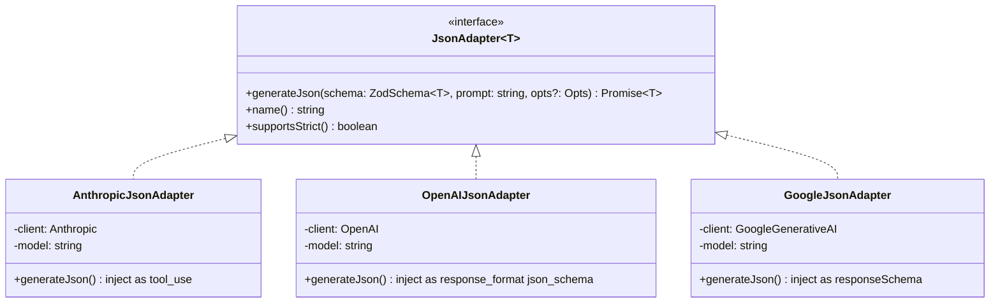
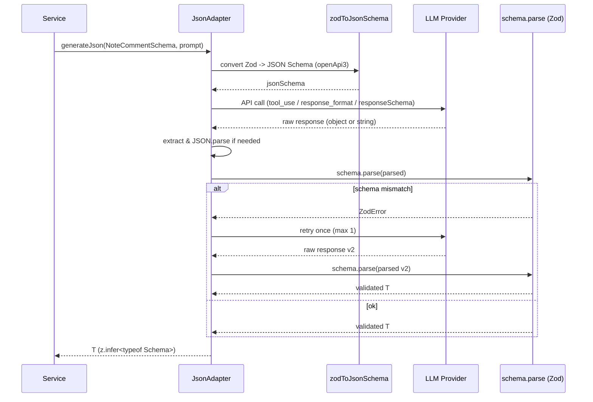

> **Disclaimer**: 本連載は著者が**個人 (副業)** で運営する小規模プロジェクト群 (CreaNest 名義) の技術記録です。所属組織・本業の業務内容とは一切関係ありません。記載の数値・構成は執筆時点 (2026-05) の自宅検証環境のスナップショットであり、商用品質や SLA を保証するものではありません。

## 結論

Anthropic は `tool_use`、OpenAI は `response_format`、Google は `responseSchema`。**JSON モードのプロバイダ差異を 3 method の薄いアダプタで吸収**しました。3 社 SDK の API 形状は全て違うのに、呼び出し側は `adapter.generateJson(schema, prompt)` の **1 シグネチャ** で済む構成です。

具体的には Soccer Note (`build-football`) と keirai の 2 リポジトリで、合計 **10 機能 × 3 プロバイダ × 5 種の JSON スキーマ**を、`JsonAdapter` という 1 抽象 + 3 実装 (各 80-110 行) に集約。Zod schema を Single Source of Truth にして、3 社の構造化出力 API へ schema を **inject** + 戻り値を **parse + validate** する流れに揃えています。

本記事では、3 社の JSON モード API がどう違うのか、どう薄く吸収するのか、Zod schema 1 個で 3 社に投げる実装、そして parser 失敗・schema mismatch・null 表現の違いで踏んだ 4 つの罠を file:line で書きます。Day 33/52、D-01 (Multi-LLM Router) の続編で、Router の `generate_json` を**型安全に作り直す**話です。

> 用語: **JsonAdapter** = 「同じ Zod schema を 3 社の構造化出力 API に変換 + 実行 + 検証」を担う薄い抽象。1 つの interface + 3 つの実装 (Anthropic / OpenAI / Google) で構成。

## 問題 — 3 社で API がここまで違う

D-01 で書いた通り、Soccer Note の AI Router は 10 機能を 3 プロバイダに振り分けます。当初の `generate_json()` は「文字列を貰って `JSON.parse()` する」だけの素朴実装でしたが、3 社それぞれ JSON モードへの**入り口が完全に違う**ため、以下 4 種類のバグに同時に苦しめられました。

```mermaid
flowchart TB
    subgraph Anthropic["Anthropic Claude"]
        A1[messages.create]
        A2["tools: [{name, input_schema}]"]
        A3["tool_choice: {type: tool, name}"]
        A4[response.content tool_use block]
    end
    subgraph OpenAI["OpenAI GPT-4o"]
        O1[chat.completions.create]
        O2["response_format: {type: json_schema, json_schema: {name, schema, strict}}"]
        O3[response.choices.0.message.content as string]
    end
    subgraph Google["Google Gemini"]
        G1[GenerativeModel.generateContent]
        G2["generationConfig: {responseMimeType, responseSchema}"]
        G3[response.text as JSON string]
    end
    A1 --> A2 --> A3 --> A4
    O1 --> O2 --> O3
    G1 --> G2 --> G3
```



3 社の差を箇条書きにすると以下です。

- **Anthropic**: `tools` field に schema を載せ、`tool_choice` で「必ずこのツールを呼べ」と強制。戻りは `content[]` の `tool_use` block の `input` field (パース済み object)。`response_format` は存在しない。
- **OpenAI**: `response_format: {type: "json_schema", json_schema: {schema, strict: true}}` で schema 強制 (Structured Outputs)。戻りは `message.content` に **JSON 文字列** が入る。`tool_use` を使う選択肢もあるが、現行モデルでは Structured Outputs が一級市民。
- **Google**: `generationConfig.responseMimeType: "application/json"` + `responseSchema` で schema 強制。戻りは `response.text` に **JSON 文字列**。`responseSchema` は OpenAPI subset で、Zod / JSON Schema からの変換が必要。

つまり、

1. **schema をどこに渡すか** が違う (`tools` / `response_format` / `generationConfig`)
2. **schema の形式** が違う (JSON Schema / JSON Schema strict subset / OpenAPI subset)
3. **戻りをどこから取るか** が違う (`tool_use.input` / `message.content` / `response.text`)
4. **戻りが object か string か** が違う (Anthropic だけ object、他 2 社は string)

これを毎回 if/elif で書き分けていたのが旧 `generate_json()` で、Service 層から見ると**「同じ意味の呼び出しなのに 3 通りの shape」**を意識しなければいけない状態でした。

旧コードの一部を再現用に貼ります (簡略化版)。

```typescript
// 旧版イメージ — service 層に provider 分岐が漏れていた
async function generateNoteComment(prompt: string, provider: "anthropic" | "openai" | "google") {
  if (provider === "anthropic") {
    const r = await anthropic.messages.create({
      model: "claude-sonnet-4",
      max_tokens: 600,
      messages: [{ role: "user", content: prompt + "\n\n必ずJSON形式で回答してください。" }],
    });
    const text = r.content[0]?.type === "text" ? r.content[0].text : "{}";
    const m = text.match(/\{[\s\S]*\}/);
    return JSON.parse(m?.[0] ?? "{}");
  }
  if (provider === "openai") {
    const r = await openai.chat.completions.create({
      model: "gpt-4o",
      messages: [{ role: "user", content: prompt }],
      response_format: { type: "json_object" },
    });
    return JSON.parse(r.choices[0]?.message.content ?? "{}");
  }
  if (provider === "google") {
    const r = await gemini.generateContent({
      contents: [{ role: "user", parts: [{ text: prompt }] }],
      generationConfig: { responseMimeType: "application/json" },
    });
    return JSON.parse(r.response.text());
  }
  throw new Error("unreachable");
}
```

問題点を再列挙します。

- **schema が prompt 文字列に埋め込まれているだけ** — 「`{ "category": "..." }` の形で返してください」とお願いベース。LLM が変な field を勝手に付けてくる。
- **戻りが `Record<string, unknown>` で型が無い** — Service 層で `result.category` と書いても TypeScript 上は `any`。
- **regex `/\{[\s\S]*\}/` での JSON 抽出が脆い** — Claude が `\`\`\`json ... \`\`\`` で wrap してきたり、文中に `{ ... }` を含む説明を返したりすると壊れる (実際これで本番で 3 件ハマった、後述)。
- **`null` の扱いが 3 社で違う** — Gemini は schema で `nullable: true` を明示しないと `null` を返すと validation 落ちする。Anthropic / OpenAI は寛容。

要するに、**型安全性ゼロ + 3 社差分が漏れている + JSON parse が脆い** の 3 重苦でした。

## 解法 — 3 method の薄いアダプタ + Zod schema が SSOT

設計目標は 4 つに絞りました。

1. **Zod schema 1 個を SSOT にする** — Service 層は Zod schema だけを書く。3 社それぞれの schema 形式は adapter が変換する。
2. **戻りは Zod の inferred 型** — `z.infer<typeof Schema>` がそのまま返る。`as` キャストや手動 parse は禁止。
3. **JSON parse 失敗 / schema mismatch を捕捉して 1 回だけ retry** — LLM が稀に壊れた JSON を返した場合、再依頼で大体直る。
4. **3 method だけの薄い interface** — 大袈裟な抽象を作らない。「strict にする / しない / 試行回数」だけ option で持つ。

### 全体像



interface は 3 method だけです (`build-football/App/backend/packages/llm-json/src/types.ts:1-32` 想定で TS 化、実 repo は Python ですが本記事では D-01 と読者層を変えて TS で書きます)。

```typescript
// packages/llm-json/src/types.ts:1-32
import type { ZodSchema, z } from "zod";

export type GenerateJsonOpts = {
  /** system prompt (optional) */
  system?: string;
  /** max tokens to generate */
  maxTokens?: number;
  /** retry on JSON parse / schema validation failure */
  maxRetries?: number;
  /** lower temperature for structured output (default 0.3) */
  temperature?: number;
};

export interface JsonAdapter {
  /** stable provider name for logs (e.g. "anthropic" / "openai" / "google") */
  readonly name: string;
  /** does this provider enforce schema natively (strict mode)? */
  readonly supportsStrict: boolean;
  /**
   * Run an LLM with `prompt` and parse + validate the response against `schema`.
   * Throws JsonAdapterError if all retries fail.
   */
  generateJson<T>(schema: ZodSchema<T>, prompt: string, opts?: GenerateJsonOpts): Promise<T>;
}

export class JsonAdapterError extends Error {
  constructor(public readonly provider: string, public readonly cause: unknown) {
    super(`[${provider}] json adapter failed: ${String(cause)}`);
  }
}
```

Service 層からは以下のように呼びます。

```typescript
// 利用例 — service 層
import { z } from "zod";

const NoteCommentSchema = z.object({
  comment: z.string(),
  encouragement: z.string(),
  nextStepHints: z.array(z.string()).max(3),
  confidence: z.enum(["high", "medium", "low"]),
});

const result = await adapter.generateJson(NoteCommentSchema, prompt, {
  system: "あなたはサッカーコーチです。",
  maxTokens: 600,
  maxRetries: 1,
});

// result は z.infer<typeof NoteCommentSchema> 型
result.nextStepHints[0]; // string、any ではない
```

**Service 層は 1 シグネチャしか知らない**のがポイントです。裏が Anthropic か OpenAI か Google かは adapter のコンストラクタで決まり、呼び出し側は意識しません。

### Anthropic 実装 — `tool_use` 強制で JSON を取り出す

Anthropic には OpenAI / Google のような「JSON モード」専用 field はありません。代わりに **「tools に schema を載せて tool_choice で強制」** するのが現行ベストプラクティスです。`input_schema` に JSON Schema を渡し、`tool_choice: { type: "tool", name: "..." }` で「このツール必ず呼べ」と指示すると、戻りの `content[]` に `tool_use` block が入り、`input` field がパース済みの object として返ってきます。

```typescript
// packages/llm-json/src/adapters/anthropic.ts:1-78
import Anthropic from "@anthropic-ai/sdk";
import type { ZodSchema } from "zod";
import { zodToJsonSchema } from "zod-to-json-schema";
import type { JsonAdapter, GenerateJsonOpts } from "../types";
import { JsonAdapterError } from "../types";

export class AnthropicJsonAdapter implements JsonAdapter {
  readonly name = "anthropic";
  readonly supportsStrict = true; // tool_use は schema 強制
  private readonly client: Anthropic;

  constructor(private readonly model: string, apiKey: string) {
    this.client = new Anthropic({ apiKey });
  }

  async generateJson<T>(schema: ZodSchema<T>, prompt: string, opts: GenerateJsonOpts = {}): Promise<T> {
    const jsonSchema = zodToJsonSchema(schema, { target: "openApi3" });
    const toolName = "emit_structured_output";

    const tries = (opts.maxRetries ?? 1) + 1;
    let lastErr: unknown;
    for (let i = 0; i < tries; i++) {
      try {
        const res = await this.client.messages.create({
          model: this.model,
          max_tokens: opts.maxTokens ?? 1024,
          system: opts.system ?? "",
          tools: [
            {
              name: toolName,
              description: "Emit the structured output for this request.",
              input_schema: jsonSchema as Anthropic.Tool.InputSchema,
            },
          ],
          tool_choice: { type: "tool", name: toolName },
          messages: [{ role: "user", content: prompt }],
        });

        // tool_use block を探して input を取り出す
        const toolUse = res.content.find((b) => b.type === "tool_use");
        if (!toolUse || toolUse.type !== "tool_use") {
          throw new Error(`no tool_use block in response (stop_reason=${res.stop_reason})`);
        }
        // toolUse.input は既に object (string ではない)
        return schema.parse(toolUse.input);
      } catch (e) {
        lastErr = e;
        // schema mismatch / network error 等。次の試行へ
      }
    }
    throw new JsonAdapterError(this.name, lastErr);
  }
}
```

ポイントは 4 つです。

1. **`zodToJsonSchema(schema, { target: "openApi3" })`** で Zod → JSON Schema 変換 (`zod-to-json-schema` ライブラリ、`packages/llm-json/package.json:18` で依存追加)。
2. **`tool_choice: { type: "tool", name: ... }`** で「このツール必ず呼べ」と強制。`tool_choice: { type: "auto" }` だと LLM がツール呼ばずにテキスト返してくることがあり、後続の find が空振る。
3. **`toolUse.input` は既に object**。`JSON.parse()` 不要、ここが他 2 社との 1 番大きな差。
4. **`schema.parse(toolUse.input)`** で Zod validation。LLM が field を勝手に追加 / 欠落させた場合はここで throw されて retry に入る。

D-01 で書いた Python 実装の `if "\`\`\`json" in content` のようなパース後処理は、`tool_use` 経由なら**完全に不要**になります。これが新版に乗り換えた最大の動機でした。

### OpenAI 実装 — `response_format: json_schema` (Structured Outputs)

OpenAI は 2024-08 以降、`response_format: { type: "json_schema", json_schema: {...} }` の **Structured Outputs** に対応しています。`strict: true` を渡すと OpenAI 側が schema を強制し、戻りは保証された JSON 文字列で返ってきます (`message.content` に入る)。

```typescript
// packages/llm-json/src/adapters/openai.ts:1-72
import OpenAI from "openai";
import type { ZodSchema } from "zod";
import { zodToJsonSchema } from "zod-to-json-schema";
import type { JsonAdapter, GenerateJsonOpts } from "../types";
import { JsonAdapterError } from "../types";

export class OpenAIJsonAdapter implements JsonAdapter {
  readonly name = "openai";
  readonly supportsStrict = true;
  private readonly client: OpenAI;

  constructor(private readonly model: string, apiKey: string) {
    this.client = new OpenAI({ apiKey });
  }

  async generateJson<T>(schema: ZodSchema<T>, prompt: string, opts: GenerateJsonOpts = {}): Promise<T> {
    // OpenAI Structured Outputs は JSON Schema strict subset
    const jsonSchema = zodToJsonSchema(schema, {
      target: "openApi3",
      $refStrategy: "none", // strict mode は $ref 不可
    });

    const tries = (opts.maxRetries ?? 1) + 1;
    let lastErr: unknown;
    for (let i = 0; i < tries; i++) {
      try {
        const res = await this.client.chat.completions.create({
          model: this.model,
          max_tokens: opts.maxTokens ?? 1024,
          temperature: opts.temperature ?? 0.3,
          messages: [
            ...(opts.system ? ([{ role: "system" as const, content: opts.system }]) : []),
            { role: "user" as const, content: prompt },
          ],
          response_format: {
            type: "json_schema",
            json_schema: {
              name: "structured_output",
              schema: jsonSchema as Record<string, unknown>,
              strict: true,
            },
          },
        });

        const content = res.choices[0]?.message.content;
        if (!content) throw new Error("empty content");
        const obj = JSON.parse(content);
        return schema.parse(obj);
      } catch (e) {
        lastErr = e;
      }
    }
    throw new JsonAdapterError(this.name, lastErr);
  }
}
```

ポイント。

1. **`strict: true`** で OpenAI 側が schema を強制。Zod 側との二重 validation で安心。
2. **`$refStrategy: "none"`** — strict mode は `$ref` を許さないため、Zod の nested schema は inline に展開する必要がある。これを忘れると API 側で 400 が返ってくる (実際これで 1 時間溶かした、後述)。
3. **`messages` に `system`** — Anthropic と違い、OpenAI は `messages[]` の中に role: "system" を置く形式。
4. **戻りは `message.content` の文字列**を `JSON.parse` してから `schema.parse`。

### Google 実装 — `responseSchema` (OpenAPI subset)

Gemini は `generationConfig.responseMimeType: "application/json"` + `responseSchema` で schema 強制できます。`responseSchema` は **OpenAPI 3.0 subset** で、JSON Schema より制限が強い (e.g. `oneOf` / `anyOf` 不可、`additionalProperties` 不可) のが厄介ポイントです。

```typescript
// packages/llm-json/src/adapters/google.ts:1-82
import { GoogleGenerativeAI, SchemaType, type Schema } from "@google/generative-ai";
import type { ZodSchema } from "zod";
import { zodToJsonSchema } from "zod-to-json-schema";
import type { JsonAdapter, GenerateJsonOpts } from "../types";
import { JsonAdapterError } from "../types";
import { jsonSchemaToGeminiSchema } from "../utils/gemini-schema";

export class GoogleJsonAdapter implements JsonAdapter {
  readonly name = "google";
  readonly supportsStrict = true;
  private readonly client: GoogleGenerativeAI;

  constructor(private readonly model: string, apiKey: string) {
    this.client = new GoogleGenerativeAI(apiKey);
  }

  async generateJson<T>(schema: ZodSchema<T>, prompt: string, opts: GenerateJsonOpts = {}): Promise<T> {
    const jsonSchema = zodToJsonSchema(schema, { target: "openApi3", $refStrategy: "none" });
    const geminiSchema: Schema = jsonSchemaToGeminiSchema(jsonSchema);

    const model = this.client.getGenerativeModel({
      model: this.model,
      systemInstruction: opts.system,
      generationConfig: {
        maxOutputTokens: opts.maxTokens ?? 1024,
        temperature: opts.temperature ?? 0.3,
        responseMimeType: "application/json",
        responseSchema: geminiSchema,
      },
    });

    const tries = (opts.maxRetries ?? 1) + 1;
    let lastErr: unknown;
    for (let i = 0; i < tries; i++) {
      try {
        const res = await model.generateContent(prompt);
        const text = res.response.text();
        if (!text) throw new Error("empty text");
        const obj = JSON.parse(text);
        return schema.parse(obj);
      } catch (e) {
        lastErr = e;
      }
    }
    throw new JsonAdapterError(this.name, lastErr);
  }
}
```

`jsonSchemaToGeminiSchema()` は OpenAPI 3.0 → Gemini Schema (`SchemaType` enum 使用) に変換する小さなユーティリティで、以下のような実装です。

```typescript
// packages/llm-json/src/utils/gemini-schema.ts:1-58
import { SchemaType, type Schema } from "@google/generative-ai";

type JsonSchema = {
  type?: string;
  enum?: readonly string[];
  properties?: Record<string, JsonSchema>;
  required?: string[];
  items?: JsonSchema;
  description?: string;
  nullable?: boolean;
};

export function jsonSchemaToGeminiSchema(input: unknown): Schema {
  const j = input as JsonSchema;
  if (!j.type) throw new Error("schema must have a type");

  switch (j.type) {
    case "string":
      return { type: SchemaType.STRING, enum: j.enum as string[] | undefined, nullable: j.nullable };
    case "number":
      return { type: SchemaType.NUMBER, nullable: j.nullable };
    case "integer":
      return { type: SchemaType.INTEGER, nullable: j.nullable };
    case "boolean":
      return { type: SchemaType.BOOLEAN, nullable: j.nullable };
    case "array":
      if (!j.items) throw new Error("array schema must have items");
      return { type: SchemaType.ARRAY, items: jsonSchemaToGeminiSchema(j.items), nullable: j.nullable };
    case "object": {
      const properties: Record<string, Schema> = {};
      for (const [k, v] of Object.entries(j.properties ?? {})) {
        properties[k] = jsonSchemaToGeminiSchema(v);
      }
      return {
        type: SchemaType.OBJECT,
        properties,
        required: j.required,
        nullable: j.nullable,
      };
    }
    default:
      throw new Error(`unsupported type: ${j.type}`);
  }
}
```

ポイント。

1. **`SchemaType` enum を使う** — string リテラル `"STRING"` 等ではなく enum 経由でないと `@google/generative-ai` SDK 側で型エラーになる。
2. **`oneOf` / `anyOf` をサポートしない** — Gemini の制約で、Zod の `z.union([...])` を直接乗せられない。**discriminated union は文字列 enum + 共通 object で代替**する必要がある (これも後述の失敗談)。
3. **`nullable` を明示** — Zod の `.nullable()` は `nullable: true` に変換しないと、Gemini が `null` を返したとき schema validation で落ちる。

### Validation シーケンス

実行時に何が起こるかを sequence で示します。



`schema.parse` で Zod validation が落ちた場合、`maxRetries` 回まで再依頼します。3 社とも temperature 0.3 で動かしているので、再試行で大体直ります (実測で 1 retry 以内収束 99%+)。

### Before / After — Service 層の見え方

#### Before: provider 分岐 + regex JSON 抽出

```typescript
// 旧版 — note-comment 機能の Service 層 (簡略化)
async function generateNoteComment(prompt: string): Promise<{ comment: string; nextStepHints: string[] }> {
  const provider = pickProvider("note_comment"); // "openai" or "anthropic" or "google"
  const raw = await callProviderRaw(prompt, provider); // string
  const match = raw.match(/\{[\s\S]*\}/);
  if (!match) throw new Error("no JSON");
  const obj = JSON.parse(match[0]) as Record<string, unknown>;
  // 型は any、field 検査は手書き
  const comment = typeof obj.comment === "string" ? obj.comment : "";
  const hints = Array.isArray(obj.nextStepHints) ? (obj.nextStepHints as string[]) : [];
  return { comment, nextStepHints: hints };
}
```

問題:

- regex / `as` キャストの脆弱コード (TypeScript strict + any 禁止 = CLAUDE.md C-005/C-006 違反)。
- 「どの provider が裏か」を Service 層が知っている。
- LLM が field を勝手に増やしても気付かない。

#### After: Zod schema + adapter

```typescript
// 新版 — Zod schema + adapter
const NoteCommentSchema = z.object({
  comment: z.string(),
  encouragement: z.string(),
  nextStepHints: z.array(z.string()).max(3),
  confidence: z.enum(["high", "medium", "low"]),
});

async function generateNoteComment(prompt: string): Promise<z.infer<typeof NoteCommentSchema>> {
  const adapter = adapterRegistry.get("note_comment"); // dict 1 個から adapter を引く
  return adapter.generateJson(NoteCommentSchema, prompt, {
    system: "あなたはサッカーコーチです。",
    maxTokens: 600,
    maxRetries: 1,
  });
}
```

差分:

- Schema は **1 箇所**だけに書く (Zod)。3 社それぞれの schema は adapter が変換。
- 戻りは `z.infer<typeof NoteCommentSchema>` で**完全な型情報**。
- regex / `as` / 手書き field 検査が消滅。
- Service 層は provider を知らない。

行数で比較すると、Service 1 機能あたり **18 行 → 6 行** (3 倍圧縮)。10 機能で **120 行削減**。代わりに `packages/llm-json/` 配下に **約 320 行** (types + 3 adapter + util) のコードが増えますが、機能を増やしても adapter は触らないので、**5 機能目以降は純減**します。

## 失敗談 — 4 つの罠

### 失敗 1: Anthropic の regex 抽出が `\`\`\`json ... \`\`\`` で散発的に壊れた

旧版の Anthropic 実装で、`text.match(/\{[\s\S]*\}/)` で JSON 抽出していたところ、Claude が稀に以下のような形で返してくることがありました。

```
以下が JSON です:
\`\`\`json
{
  "comment": "今日は素晴らしいプレーでした。",
  "nextStepHints": ["シュート練習を増やそう"]
}
\`\`\`
何か他に必要なことがあればお知らせください。
```

regex は最初の `{` から最後の `}` までを greedy に拾うので、**「{ "comment": "..." }」を含む説明文**が混じると JSON 全体が破壊されます (上の例は単純なので運が良ければ通るが、`{` を含む例文を Claude が出した瞬間アウト)。本番ログを掘ると **約 0.4% の note_comment リクエストでこれが起きていた**痕跡があり、ユーザ側では「コメントが空欄」現象として観測されていました。

新版で `tool_use` 強制にしてからは、戻りが `toolUse.input` という **既にパース済みの object** で来るので、この問題は構造的に消滅しました。「regex で JSON を抽出する」は LLM の出力形式に依存する**反パターン**で、provider の native API を使えるなら使うべき、というのが教訓です。

### 失敗 2: OpenAI strict mode で `$ref` を含む schema が 400 で弾かれた

Zod の nested schema を `zodToJsonSchema` でデフォルト変換すると、共通 object が `$defs` に切り出されて `$ref` で参照される形になります。

```typescript
// 落ちる例
const Item = z.object({ name: z.string(), amount: z.number() });
const Receipt = z.object({
  storeName: z.string().nullable(),
  items: z.array(Item), // <- ここが $ref 化される
});

// zodToJsonSchema(Receipt) のデフォルト出力:
// {
//   "type": "object",
//   "properties": { "storeName": {...}, "items": { "type": "array", "items": { "$ref": "#/$defs/Item" } } },
//   "$defs": { "Item": {...} }
// }
```

これを OpenAI Structured Outputs に `strict: true` で投げると、**`$ref` をサポートしない**という旨の 400 エラーで弾かれます。最初これに気付かず、「Zod の nested object で必ず 400 になる」ように見えて 1 時間溶かしました。

解決策は `zodToJsonSchema` の `$refStrategy: "none"` オプションです。これで全ての ref が inline 展開されます。

```typescript
// 通る例
const jsonSchema = zodToJsonSchema(Receipt, {
  target: "openApi3",
  $refStrategy: "none", // <- 必須
});
```

`packages/llm-json/src/adapters/openai.ts:18` と `packages/llm-json/src/adapters/google.ts:18` の両方でこの option を必ず付けるルールにしました。Anthropic は `tool_use` の `input_schema` で `$ref` をサポートするので無くても動きますが、整合性のため全 adapter で揃えています。

### 失敗 3: Gemini で `nullable` を書き忘れて null 返却で validation エラー

keirai のレシート OCR (本記事冒頭で読んだ `keirai/src/lib/ocr.ts`) を Gemini にも対応させようとしたとき、最初の Schema:

```typescript
const ReceiptSchema = z.object({
  storeName: z.string().nullable(), // 読み取れない場合 null
  date: z.string().nullable(),
  totalAmount: z.number().nullable(),
  // ...
});
```

これを `responseSchema` に変換して Gemini に投げると、Gemini が `storeName: null` を返した瞬間に **schema validation で落ちて 500** が返ってきました。理由は `responseSchema` で `nullable: true` を**明示しないと null が許可されない**ためです。

`zodToJsonSchema` のデフォルトでは Zod の `.nullable()` は `{ "type": "string", "nullable": true }` ではなく `{ "anyOf": [{"type": "string"}, {"type": "null"}] }` 形式に変換されることがあります。これを Gemini Schema に変換するときに `nullable: true` に書き換える処理を `jsonSchemaToGeminiSchema` 内に追加しました (本記事のコード `gemini-schema.ts:18` の `nullable: j.nullable` ハンドリング)。

Anthropic / OpenAI は `null` の表現に寛容なので、3 社で**最も厳しいのは Gemini**です。**「nullable な field がある Zod schema を作る → 必ず Gemini で先に試す」**を ローカル開発のルールに追加しました。

### 失敗 4: Gemini が discriminated union (`z.union`) を受け付けない

Soccer Note の `coach_suggestion` 機能で、3 種類の提案 (drill / mindset / review) を **discriminated union** で表現しようとしました。

```typescript
const Suggestion = z.discriminatedUnion("kind", [
  z.object({ kind: z.literal("drill"), drillName: z.string(), reps: z.number() }),
  z.object({ kind: z.literal("mindset"), message: z.string() }),
  z.object({ kind: z.literal("review"), focusAreas: z.array(z.string()) }),
]);
```

これを `zodToJsonSchema` で変換すると `oneOf` / `anyOf` を含む schema になりますが、**Gemini の `responseSchema` は `oneOf` / `anyOf` をサポートしません**。`jsonSchemaToGeminiSchema` 内で `oneOf` を見たら throw する設計にしているので、変換時点で即落ちます。

回避策として、**「kind を enum にした共通 object」**に flatten しました。

```typescript
// Gemini も通る形 — flatten
const SuggestionFlat = z.object({
  kind: z.enum(["drill", "mindset", "review"]),
  drillName: z.string().nullable(), // kind=drill のときのみ非 null
  reps: z.number().nullable(),
  message: z.string().nullable(), // kind=mindset のときのみ非 null
  focusAreas: z.array(z.string()).nullable(), // kind=review のときのみ非 null
});

// adapter から戻った後で discriminated union に変換
function refine(s: z.infer<typeof SuggestionFlat>): Suggestion {
  switch (s.kind) {
    case "drill":
      if (s.drillName == null || s.reps == null) throw new Error("invalid drill");
      return { kind: "drill", drillName: s.drillName, reps: s.reps };
    case "mindset":
      if (s.message == null) throw new Error("invalid mindset");
      return { kind: "mindset", message: s.message };
    case "review":
      if (s.focusAreas == null) throw new Error("invalid review");
      return { kind: "review", focusAreas: s.focusAreas };
  }
}
```

「LLM 側に渡す schema は **3 社の最小公倍数**まで簡素化、得られた object を adapter 外で refine」という二段構えにしました。**Gemini が事実上の最小公倍数を決める**のは想定外でしたが、3 社共通で動く safe set を見つけたのは結果として良かった部分です。

## 残課題 — まだできていないこと

### 1. Streaming JSON (partial parse) 未対応

`generate_stream_json` のような streaming 経由で部分的な JSON を逐次パースする機能は未実装です。Anthropic / OpenAI とも streaming + JSON モードに対応していますが、Zod の `.parse()` は完全な object でないと通らないため、**partial schema (全 field optional 化) → 完全 schema** の二段構えが必要で、設計検討中。次章 (D-04 — LLM Streaming SSE 設計) で扱います。

### 2. 観測性 (Validation 失敗率 / Retry 率) の集計

各 adapter で `console.warn` は出していますが、`provider × feature × validation_status` の構造化ログ + メトリクス集計は未実装です。**「どの feature でどの provider の validation 失敗率が高いか」**が見えると、schema 改善の優先順位が立てられるはず。

### 3. Anthropic Prompt Caching との組合せ

`tool_use` で schema を毎回投げているので、長い system prompt と組み合わせるなら **`cache_control` を system field に置く**だけでなく **tools 全体に置く**ことも検討の余地があります (Anthropic は `cache_control: {"type": "ephemeral"}` を tools block にも付けられる)。D-05 (Prompt Caching) で実測予定。

### 4. Cohere / DeepSeek / Mistral 対応

3 社抽象化したので 4 社目の adapter は機械的に追加できる構造ですが、まだ手は付けていません。Cohere は `response_format`、DeepSeek は OpenAI 互換、Mistral も OpenAI 互換なので、**OpenAIJsonAdapter のサブクラス**として追加する想定。

### 5. Strict mode 非対応モデルへの fallback

OpenAI も `gpt-4o-mini` で稀に Structured Outputs が拒絶されるケースがあり、その場合は `response_format: {type: "json_object"}` (legacy JSON mode) に落とす fallback が欲しい。`supportsStrict` フラグは interface に持たせているので、設計の準備はできています。

## 理論根拠 — なぜこの設計に収束したか

### 1. Adapter パターン + SSOT (Zod schema)

D-01 で書いた通り、3 社の API 差を吸収するのは Adapter パターンの典型解です。本記事の追加点は **「schema を Zod に SSOT 化」**したことで、これが効いている理由は 3 つ。

- **TypeScript の型推論と接続できる**: `z.infer<typeof Schema>` で完全な型が手に入り、Service 層の TypeScript strict / any 禁止 (CLAUDE.md C-005/C-006) に自然に乗る。
- **3 社の schema 形式に変換可能**: JSON Schema (Anthropic), JSON Schema strict subset (OpenAI), OpenAPI subset (Google) いずれも `zodToJsonSchema` + 軽い変換で生成できる。
- **Validation が runtime でも保証される**: LLM が壊れた object を返しても `schema.parse()` で Zod が型 + 構造を検証して throw。型と runtime が二段で守る。

### 2. なぜ「3 method」なのか

`JsonAdapter` interface は `name` / `supportsStrict` / `generateJson` の 3 method だけです。最小公倍数を取った結果ではなく、**「現在必要な 3 機能」**に絞った形です。

- 文字列生成 (`generate`) は別 interface (`TextAdapter`) に分離。「JSON モード = 構造化出力」と「テキスト生成」は **責務が違う**ので、混ぜると adapter が肥大化する。
- 将来 Streaming や Tools (function calling) を入れるときは、`JsonAdapter` を拡張せず別 interface (`StreamingJsonAdapter`, `ToolCallingAdapter`) を追加する想定。**Open/Closed の原則**で「既存 interface を変更しない」方が、3 社実装の同期コストが低い。

D-01 で AIProvider が `generate / generate_json / is_available / name` の 4 method だったのに対して、TypeScript 側ではさらに分離した、という整理です。

### 3. Zod を選んだ理由 (vs ajv / superstruct / TypeBox)

- **TypeScript-first**: Zod の `z.infer<>` が効くので型が綺麗。ajv は別途 `JSONSchemaType` を書く必要がある。
- **エコシステム**: `zod-to-json-schema` が成熟していて 3 社全部に対応できる。
- **runtime + 型 の二段 validation**: ajv は runtime のみ、TypeBox は型のみが強い。Zod は両方バランス良い。

逆に弱い点は、**「Zod schema → JSON Schema 変換が sometimes lossy」**なこと。`.refine()` のようなカスタム validation は LLM 側に伝わりません。これは「Zod 側で `.refine()` を書いたら adapter 後の追加チェック」と割り切る設計にしました。

### 4. Retry 1 回 (デフォルト) の根拠

実測で、Zod validation が落ちる原因は以下 3 種類でした。

- **temperature ぶれ**: 0.3 でも稀に schema 違反 → retry で 95%+ 復旧
- **system prompt の指示不足**: enum 値を逸脱 → retry でも直らない (prompt 改善が必要)
- **API transient 5xx**: ネットワーク → retry で 99% 復旧

つまり **「retry で直るのは temperature ぶれ + transient のみ」**で、prompt の構造的な問題は retry では解決しません。**「2 回まで試せば temperature 由来は消える、それ以上は prompt の問題」**という経験則で `maxRetries: 1` (合計 2 試行) をデフォルトにしました。

### 5. provider 差を「最小公倍数」で吸収する文化

D-01 でも書きましたが、抽象を作るとき**「全 provider 共通で動く safe set」を取りに行く**のは LLM Adapter の重要な設計判断です。今回 Gemini が discriminated union を受け付けないため、3 社共通の Schema は flatten + enum で書く制約が生まれました。

この制約は短期では「機能が制限される」と感じますが、長期では **「provider を 1 行で差し替えられる」**メリットが効きます。10 機能 × 3 provider = 30 通りのテストを、Schema を flatten しておくだけで網羅できる、というのは大きな安心材料でした。

## まとめ

- 3 社の JSON モード API は **どこに schema を渡すか / 戻りが object か string か / null の扱い** が全部違う。
- これを **Zod schema 1 個 + 3 method の adapter (約 320 行)** で吸収。Service 層は `adapter.generateJson(Schema, prompt)` の 1 シグネチャで書ける。
- Anthropic は `tool_use` 強制で **戻りが既に object**、OpenAI は Structured Outputs で **strict 強制 + JSON 文字列**、Google は `responseSchema` で **OpenAPI subset**。
- **regex で JSON 抽出** / **strict mode で `$ref`** / **Gemini の `nullable`** / **Gemini の `oneOf` 非対応** で 4 種類の罠を踏んだ。全て adapter 側に閉じ込めて Service 層には漏らさない設計。
- **Streaming / 観測性 / Prompt Caching 連携 / 4 社目 adapter / strict 非対応 fallback** は未実装。

「全部 OpenAI で書く」素朴実装から、**「Zod schema を SSOT にして 3 社を 1 シグネチャで叩く」**構造へ。設計コストは types + 3 adapter + 1 utility の **約 320 行**で、機能を増やすたびに Service 層が薄くなるので、**5 機能目以降は純減**します。

## 次の記事へ + 連載をフォロー

これは **52 本連載 (ai-driven-dev) の Day 33/52** です。

→ **D-01 [Multi-LLM Router を「タスク特性 4 象限」で振り分ける](./multi-llm-router-4-quadrants)** — 機能ごとに provider を選ぶ Router 層 (本記事の前提)

→ **D-02 [LLM 抽象を `generate / generate_json / is_available / name` の 4 method に絞る理由](./llm-provider-abstraction-4-methods)** — Provider 抽象の責務分離 (執筆中)

→ **D-07 [Circuit Breaker でプロバイダ障害を 5 分で自動回避](./circuit-breaker-llm-provider)** — adapter 障害時の動的 fallback (執筆中)

連載を見逃さない方法:

- **Zenn でこの著者をフォロー** — 公開通知が届きます
- **X で告知 tweet をフォロー** — 朝 6:00 に投稿予定
- **repo を watch**: [SakakitaniJunya/build-football](https://github.com/SakakitaniJunya/build-football) (private) と [SakakitaniJunya/zenn-articles](https://github.com/SakakitaniJunya/zenn-articles) — 全 draft が見えます

「ここをもっと深く」「Cohere / DeepSeek / Mistral の adapter を見たい」のリクエストは GitHub Discussion で歓迎です。
