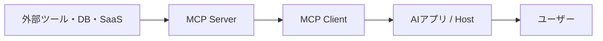
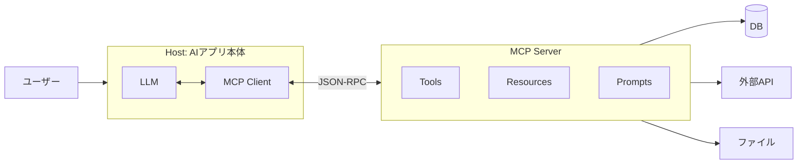
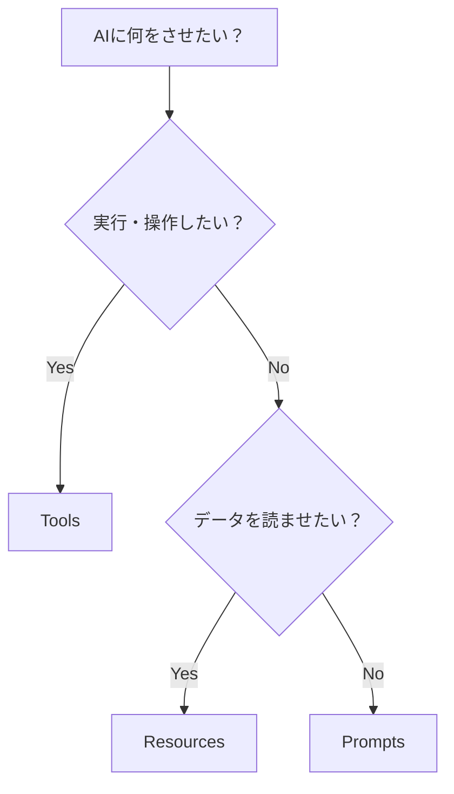
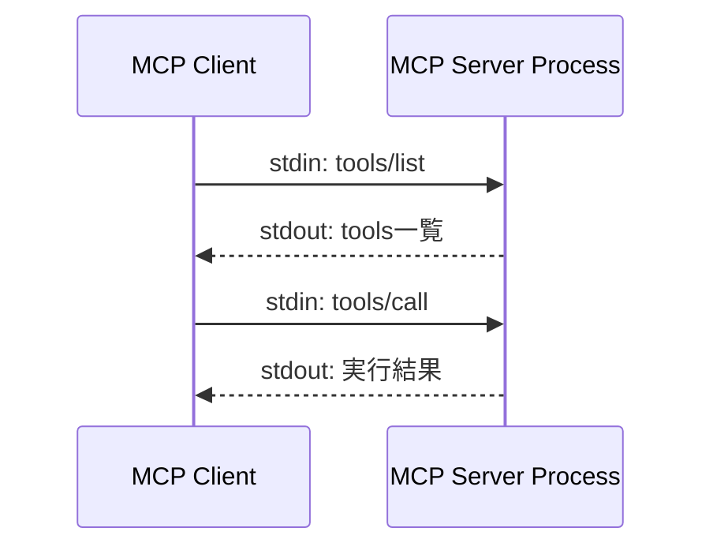
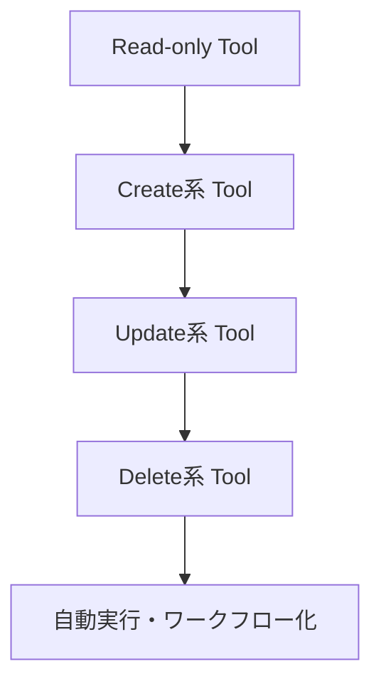
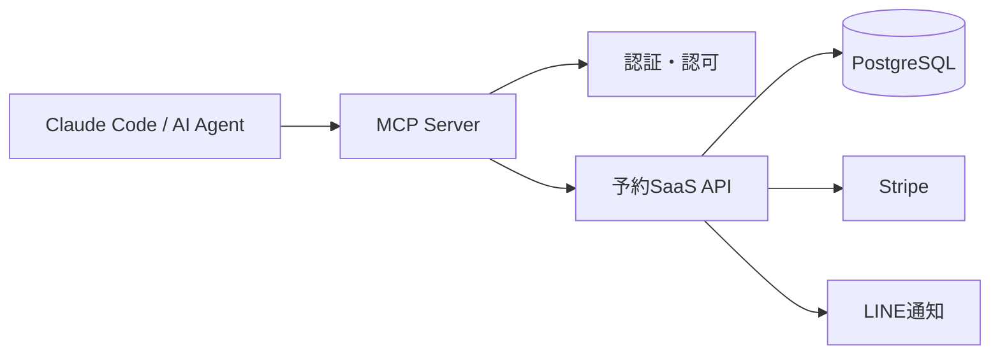
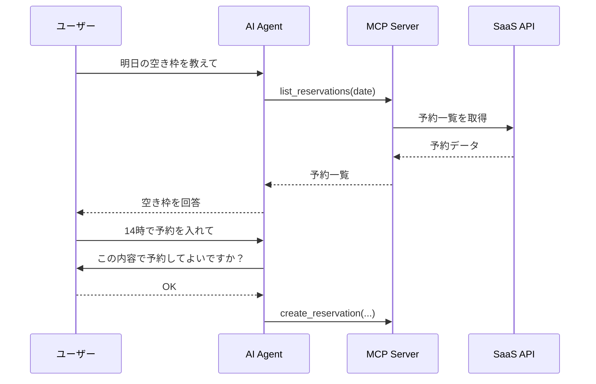

## はじめに

Claude Code、Cursor、GitHub Copilot などのAI開発ツールを使っていると、最近よく出てくるのが **MCP** です。

MCP は **Model Context Protocol** の略で、LLMアプリケーションと外部データソース・外部ツールをつなぐためのオープンプロトコルです。公式仕様では、MCPは「LLMアプリケーションと外部データソース・ツールをシームレスに統合するためのオープンプロトコル」と説明されています。([Model Context Protocol][1])

一言でいうと、MCPは **AIエージェント用のUSB-C** のようなものです。

ただし、MCPは「普通のWeb APIの置き換え」ではありません。

MCPは、AIクライアントに対して、

```txt
このツールを使えます
この引数を渡せます
このデータを読めます
このプロンプトテンプレートを使えます
```

と標準的な形で伝えるための仕組みです。

この記事では、MCPの基本構造を整理したうえで、TypeScriptで最小のMCP Serverを自作します。

---

## この記事でわかること

この記事では、以下を扱います。

| 項目 | 内容 |
| --- | --- |
| MCPとは何か | AIエージェントと外部ツールをつなぐ標準プロトコル |
| Host / Client / Server | MCPの登場人物 |
| Tools / Resources / Prompts | MCP Serverが公開できる3つの要素 |
| stdio / Streamable HTTP | MCPの代表的な通信方式 |
| TypeScript実装 | `add` Toolを持つ最小MCP Server |
| 実務設計 | 安全なTool設計、Read-only開始、認可、エラー設計 |
| .NET実装 | C# SDKでの最小構成 |

対象読者は、以下のような人です。

- Claude CodeやCursorでMCPという言葉を見たが、まだ仕組みが腹落ちしていない人
- 自社SaaSや社内ツールをAIエージェントから操作できるようにしたい人
- TypeScriptまたはC#でMCP Serverを自作してみたい人

---

## MCPが解決する課題

AIエージェントに外部操作をさせたい場合、よくある要望はこうです。

| やりたいこと | MCPなし | MCPあり |
| --- | --- | --- |
| GitHub Issueを読む | AIツールごとに個別連携を作る | GitHub用MCP Serverをつなぐ |
| DBを検索する | 独自APIを作り、AI側にも専用実装を書く | DB検索用MCP Toolを作る |
| Figmaの情報を読む | Figma APIをAIツールごとに実装する | Figma用MCP Serverをつなぐ |
| 社内ドキュメントを検索する | 独自RAG連携を作る | Document Search用MCP Serverを作る |
| ローカルファイルを操作する | クライアント依存の実装になる | Filesystem系MCP Serverをつなぐ |

MCPの嬉しさは、**AIクライアントとツールの間に共通の接続規格を作れること** です。

従来は、Claude用、Cursor用、社内AI用にそれぞれ個別の連携を作る必要がありました。

MCPを使うと、ツール側を **MCP Server** として実装し、AIアプリ側は **MCP Client** として接続します。



---

## MCPの基本構造

MCPには、主に3つの登場人物があります。

公式仕様でも、MCPは **Host / Client / Server** の構成で説明されています。HostはLLMアプリケーション、ClientはHost内の接続役、Serverは外部データや機能を提供する側です。また、通信にはJSON-RPC 2.0が使われます。([Model Context Protocol][1])



### Host

Hostは、Claude Code、Claude Desktop、Cursorのような **AIアプリ本体** です。

ユーザーと会話し、LLMを動かし、必要に応じてMCP Client経由で外部ツールを呼び出します。

### Client

Clientは、Hostの中にある **MCP Serverとの接続役** です。

ClientはMCP Serverに対して、

```txt
どんなToolがありますか？
どんなResourceがありますか？
このToolを実行してください
```

といったリクエストを送ります。

### Server

Serverは、ツールやデータを提供する側です。

自作する場合、多くの開発者が実装するのはこの **MCP Server** です。

たとえば、以下のようなものをMCP Serverとして作れます。

| MCP Serverの例 | できること |
| --- | --- |
| GitHub Server | Issue作成、PR取得、コード検索 |
| DB Server | SQL実行、顧客情報検索 |
| Figma Server | デザイン情報取得、レイヤー解析 |
| 社内ツール Server | 勤怠、見積、案件情報の取得 |
| 自作SaaS Server | 予約確認、ユーザー検索、売上集計 |

---

## MCP Serverが公開できる3つの要素

MCP Serverは、主に以下の3つをClientに公開できます。

公式仕様では、Serverが提供できる機能として **Resources / Prompts / Tools** が定義されています。Resourcesはコンテキストやデータ、Promptsはテンプレート化されたメッセージやワークフロー、ToolsはAIモデルが実行できる関数です。([Model Context Protocol][1])

| 種類 | 役割 | 例 |
| --- | --- | --- |
| Tools | AIが実行できる関数 | `create_issue`, `search_customer`, `run_sql` |
| Resources | AIやユーザーが参照できるデータ | `file://README.md`, `db://customers/123` |
| Prompts | 再利用できるプロンプトテンプレート | コードレビュー用、議事録要約用、PR作成用 |

### Tools

Toolsは、AIが実際に呼び出す関数です。

たとえば、以下のようなイメージです。

```ts
searchCustomer({ name: "田中" })
```

外部APIを呼ぶ、DBを検索する、Issueを作る、計算する、といった処理をToolとして公開します。

重要なのは、**AIが引数を組み立てて呼ぶ** という点です。

そのため、Toolの名前、説明、入力スキーマはかなり重要です。

### Resources

Resourcesは、AIが読み取れるデータです。

たとえば、以下のようなURIで表現されます。

```txt
file:///project/spec.md
customer://123
```

Resourcesは「操作する関数」というより、**参照できる文脈やデータ** に近いです。

### Prompts

Promptsは、よく使う指示テンプレートです。

たとえば、以下のようなテンプレートをMCP Server側から提供できます。

```txt
このPRを、セキュリティ・保守性・テスト観点でレビューしてください
```

チームで共通のレビュー観点や、定型ワークフローを配るときに便利です。

---

## Tools / Resources / Prompts の使い分け

最初はここが少し分かりにくいです。

ざっくり分けると、以下のように考えると理解しやすいです。

| やりたいこと | 使うもの | 理由 |
| --- | --- | --- |
| DBから顧客を検索したい | Tool | 検索処理を実行するから |
| READMEをAIに読ませたい | Resource | データを参照させたいから |
| PRレビューの定型指示を使いたい | Prompt | 指示テンプレートを再利用したいから |
| GitHub Issueを作りたい | Tool | 外部システムに副作用があるから |
| 設計書一覧をAIに見せたい | Resource | 文脈として読ませたいから |



---

## MCPの通信方式

MCPでは、メッセージ形式としてJSON-RPCを使います。

Transportとしては、標準入出力を使う **stdio** と、ネットワーク越しに使う **Streamable HTTP** が標準として定義されています。公式仕様では、MCPはJSON-RPCメッセージを使い、標準Transportとして `stdio` と `Streamable HTTP` を定義しています。([Transports - Model Context Protocol][2])

| Transport | 用途 | 例 |
| --- | --- | --- |
| stdio | ローカル実行 | Claude Codeからローカルプロセスとして起動する |
| Streamable HTTP | リモート実行 | クラウド上や社内ネットワーク上のMCP Serverに接続する |

### stdio

stdioは、MCP Serverをローカルプロセスとして起動し、標準入力・標準出力で通信する方式です。

ローカル開発では、まずstdioから始めるのが簡単です。



### Streamable HTTP

Streamable HTTPは、ネットワーク越しにMCP Serverへ接続する方式です。

TypeScript SDKのServer Guideでも、リモートサーバーにはStreamable HTTP、ローカルのプロセス起動型連携にはstdioを選ぶ、と説明されています。([TypeScript SDK Server Guide][3])

チーム利用、SaaS化、社内基盤化するならStreamable HTTPを検討します。

---

## MCP Serverを自作する

ここからは、TypeScriptで最小のMCP Serverを作ります。

今回は以下のToolを持つMCP Serverを作ります。

```txt
add(a, b) -> a + b を返す
```

なお、この記事では安定して使いやすい `@modelcontextprotocol/sdk` の構成で説明します。

---

## 1. プロジェクトを作成する

```bash
mkdir my-first-mcp-server
cd my-first-mcp-server
npm init -y
npm install @modelcontextprotocol/sdk@^1 zod
npm install -D typescript tsx @types/node
```

`package.json` を以下のようにします。

```json
{
  "type": "module",
  "scripts": {
    "dev": "tsx src/server.ts"
  },
  "dependencies": {
    "@modelcontextprotocol/sdk": "^1.0.0",
    "zod": "^3.25.0"
  },
  "devDependencies": {
    "@types/node": "latest",
    "tsx": "latest",
    "typescript": "latest"
  }
}
```

---

## 2. MCP Serverを実装する

`src/server.ts` を作ります。

```bash
mkdir src
touch src/server.ts
```

実装は以下です。

```ts
import { McpServer } from "@modelcontextprotocol/sdk/server/mcp.js";
import { StdioServerTransport } from "@modelcontextprotocol/sdk/server/stdio.js";
import { z } from "zod";

const server = new McpServer({
  name: "my-first-mcp-server",
  version: "1.0.0",
});

server.tool(
  "add",
  "Add two numbers and return the result.",
  {
    a: z.number().describe("First number"),
    b: z.number().describe("Second number"),
  },
  async ({ a, b }) => {
    const result = a + b;

    return {
      content: [
        {
          type: "text",
          text: `${a} + ${b} = ${result}`,
        },
      ],
    };
  }
);

const transport = new StdioServerTransport();
await server.connect(transport);
```

これで、AIクライアントから呼び出せる `add` Tool ができました。

---

## 3. 動かしてみる

```bash
npm run dev
```

ここで注意です。

stdioのMCP Serverは、通常のWebサーバーのようにブラウザで開くものではありません。

AIクライアントがプロセスを起動し、標準入力・標準出力でJSON-RPCメッセージをやり取りします。

そのため、`npm run dev` しても画面にWebページが表示されるわけではありません。

---

## 4. MCP Inspectorでテストする

MCP Serverは、MCP Inspectorを使うとテストしやすいです。

```bash
npx -y @modelcontextprotocol/inspector
```

Inspectorを起動したら、Transportに `stdio` を選び、以下のようなコマンドで接続します。

```bash
npx tsx /absolute/path/to/my-first-mcp-server/src/server.ts
```

接続後、`add` Toolを選び、以下のような引数で実行します。

```json
{
  "a": 1,
  "b": 2
}
```

以下のような結果が返れば成功です。

```txt
1 + 2 = 3
```

---

## 5. Claude Codeに接続する

Claude CodeにstdioのMCP Serverを追加する場合、以下のように登録できます。

Claude Code公式ドキュメントでも、ローカルstdioサーバーは `claude mcp add [options] <name> -- <command> [args...]` の形式で追加すると説明されています。([Claude Code Docs][4])

```bash
claude mcp add --transport stdio my-first-mcp-server -- \
  npx tsx /absolute/path/to/my-first-mcp-server/src/server.ts
```

登録できたか確認します。

```bash
claude mcp list
```

Claude Code内では、以下のコマンドで接続状態を確認できます。

```txt
/mcp
```

その後、Claude Codeに以下のように聞いてみます。

```txt
add toolを使って、123と456を足してください
```

Claude CodeがMCP Toolを呼び出し、結果を返してくれれば接続成功です。

---

## もう少し実用的なToolを作る

足し算だけだと実務感が薄いので、次は「プロジェクト配下のファイルを読むTool」を作ってみます。

ただし、AIにファイル操作を許す場合は安全設計が重要です。

最初にありがちな危険な実装は、以下のようなものです。

```ts
const text = await readFile(path, "utf-8");
```

これだと、AIが意図せずプロジェクト外のファイルを読んでしまう可能性があります。

そこで、今回は **プロジェクトルート配下だけ読める** ようにします。

```ts
import path from "node:path";
import { readFile } from "node:fs/promises";
import { McpServer } from "@modelcontextprotocol/sdk/server/mcp.js";
import { StdioServerTransport } from "@modelcontextprotocol/sdk/server/stdio.js";
import { z } from "zod";

const projectRoot = process.cwd();

const server = new McpServer({
  name: "project-helper",
  version: "1.0.0",
});

server.tool(
  "read_project_file",
  "Read a text file under the current project directory.",
  {
    relativePath: z
      .string()
      .describe("Path relative to the project root. Example: README.md"),
  },
  async ({ relativePath }) => {
    const targetPath = path.resolve(projectRoot, relativePath);

    if (!targetPath.startsWith(projectRoot + path.sep)) {
      return {
        isError: true,
        content: [
          {
            type: "text",
            text: "Access denied. Only files under the project root can be read.",
          },
        ],
      };
    }

    try {
      const text = await readFile(targetPath, "utf-8");

      return {
        content: [
          {
            type: "text",
            text,
          },
        ],
      };
    } catch (error) {
      return {
        isError: true,
        content: [
          {
            type: "text",
            text: `Failed to read file: ${relativePath}`,
          },
        ],
      };
    }
  }
);

await server.connect(new StdioServerTransport());
```

ポイントは、以下です。

| 観点 | 内容 |
| --- | --- |
| 入力 | 絶対パスではなく、プロジェクトルートからの相対パスにする |
| パス解決 | `path.resolve` で正規化する |
| 範囲制限 | `projectRoot` 配下だけ許可する |
| エラー | `isError: true` でAIが理解しやすい形にする |

MCPのTools仕様でも、Tool実行エラーは `isError: true` で返せると説明されています。また、Tool Execution Errorは、モデルが自己修正して再試行できるような実行時エラーに使われます。([Tools - Model Context Protocol][5])

---

## MCP Server設計のベストプラクティス

### 1. 最初はRead-onlyから始める

MCP Serverは、AIエージェントに外部操作を許す仕組みです。

そのため、最初から更新・削除・送信のような副作用の強いToolを作ると危険です。

まずはRead-onlyから始めるのがおすすめです。



特に、以下のようなものは慎重に扱うべきです。

| 対象 | 注意点 |
| --- | --- |
| DB | 最初はSELECT専用にする |
| ファイル | プロジェクト配下だけに制限する |
| Git | commit / push / force push は承認を挟む |
| クラウド | 課金や削除につながる操作は制限する |
| 顧客情報 | 認可、監査ログ、出力制限を入れる |
| メール・Slack | 送信前に人間の確認を入れる |

公式仕様でも、MCPは任意のデータアクセスやコード実行経路を可能にするため、セキュリティとTrust & Safetyを慎重に扱う必要があるとされています。([Model Context Protocol][1])

---

### 2. Toolは小さく作る

悪い例です。

```txt
manage_project()
```

これだと、何ができるのか曖昧です。

良い例です。

```txt
list_issues()
get_issue_detail()
create_issue()
summarize_issue()
```

AIに使わせるToolは、人間向けAPIよりも **意図が明確** な方が使いやすいです。

---

### 3. Tool名はAIが理解しやすくする

良いTool名の例です。

| 良いTool名 | 理由 |
| --- | --- |
| `search_customer_by_name` | 何を検索するか明確 |
| `create_github_issue` | 副作用が明確 |
| `get_latest_sales_summary` | 取得対象が明確 |
| `validate_sql_readonly` | 安全目的が明確 |

悪いTool名の例です。

| 悪いTool名 | 問題 |
| --- | --- |
| `exec` | 何でもできて危険 |
| `run` | 何を実行するか不明 |
| `handle` | 抽象的すぎる |
| `process_data` | 入出力が分からない |

MCPのTools仕様でも、Toolは名前、説明、入力スキーマなどのメタデータを持つと説明されています。Tool名は1〜128文字で、スペースや特殊文字を避けることが推奨されています。([Tools - Model Context Protocol][5])

---

### 4. 入力スキーマを厳密にする

MCP Toolは、AIが引数を組み立てます。

そのため、曖昧な入力は避けた方がよいです。

悪い例です。

```ts
query: z.string()
```

良い例です。

```ts
customerId: z.string().describe("Customer ID. Example: CUST-001")
fromDate: z.string().describe("Start date. Format: YYYY-MM-DD")
toDate: z.string().describe("End date. Format: YYYY-MM-DD")
```

AIが迷わないように、以下を明確にします。

| 観点 | 例 |
| --- | --- |
| 型 | string / number / boolean / enum |
| フォーマット | YYYY-MM-DD、ISO 8601など |
| 例 | `CUST-001`、`2026-05-01` |
| 制約 | 最大件数、許可値、必須項目 |

---

### 5. エラーはAIが直せる形で返す

悪い例です。

```txt
Error: invalid input
```

良い例です。

```txt
fromDate must be YYYY-MM-DD format. Example: 2026-05-01
```

AIエージェントは、エラー内容が具体的なら自分で修正して再実行できます。

特に以下のような情報を返すと、AIが復旧しやすくなります。

| 含める情報 | 例 |
| --- | --- |
| 何が悪いか | `fromDate` の形式が不正 |
| 期待する形式 | `YYYY-MM-DD` |
| 正しい例 | `2026-05-01` |
| 次の行動 | 日付を修正して再実行してください |

---

## C# / .NETで作る場合

.NETエンジニアなら、C# SDKでMCP Serverを作るのも自然です。

公式C# SDKのGetting Startedでは、`WithStdioServerTransport()` と `WithToolsFromAssembly()` を使い、属性付きメソッドをToolとして公開する例が紹介されています。([MCP C# SDK][6])

最小のstdio MCP Serverは以下のように書けます。

```csharp
using Microsoft.Extensions.DependencyInjection;
using Microsoft.Extensions.Hosting;
using Microsoft.Extensions.Logging;
using ModelContextProtocol.Server;
using System.ComponentModel;

var builder = Host.CreateApplicationBuilder(args);

builder.Logging.AddConsole(consoleLogOptions =>
{
    consoleLogOptions.LogToStandardErrorThreshold = LogLevel.Trace;
});

builder.Services
    .AddMcpServer()
    .WithStdioServerTransport()
    .WithToolsFromAssembly();

await builder.Build().RunAsync();

[McpServerToolType]
public static class EchoTool
{
    [McpServerTool, Description("Echoes the message back to the client.")]
    public static string Echo(string message) => $"hello {message}";
}
```

WPF、ASP.NET Core、社内業務API、金融系ツールなどをMCP化したい場合、C# SDKは相性が良いです。

特に、既存の.NET資産がある場合は、以下のようなMCP Serverを作れます。

| 既存資産 | MCP化の例 |
| --- | --- |
| WPF業務アプリ | 操作補助、設定確認、ログ取得 |
| ASP.NET Core API | 既存APIをAI向けToolとしてラップ |
| SQL Server / Oracle | Read-only検索Tool |
| バッチ処理 | 実行前確認付きのジョブ起動Tool |
| 社内管理画面 | 申請、確認、レポート取得Tool |

---

## 実用例：自社SaaSをMCP化するなら

たとえば、予約管理SaaSをMCP化するなら、以下のようなTool設計が考えられます。

| Tool | 説明 | 最初の安全度 |
| --- | --- | --- |
| `list_reservations` | 指定日の予約一覧を取得 | 高 |
| `get_customer_profile` | 顧客情報を取得 | 中 |
| `summarize_monthly_sales` | 月次売上を集計 | 高 |
| `list_unpaid_invoices` | 未払い請求一覧を取得 | 中 |
| `create_reservation` | 予約を作成 | 低 |
| `cancel_reservation` | 予約をキャンセル | 低 |



この構成にすると、AIに対して以下のように依頼できます。

```txt
明日の予約状況を確認して、空き枠を教えて
```

AIはMCP Server経由で予約情報を取得し、自然言語で回答できます。

ただし、予約作成やキャンセルのような副作用のある操作は、最初から完全自動化しない方が安全です。



---

## MCPを自作すべきケース・しないケース

MCPは便利ですが、何でもMCPにすればよいわけではありません。

| 判断軸 | MCPが向いている | MCPでなくてよい |
| --- | --- | --- |
| AIから使わせたい | ◎ | △ |
| 人間向けWeb API | △ | ◎ |
| 複数AIクライアントで使いたい | ◎ | △ |
| ローカルツール連携 | ◎ | △ |
| 単純なWebアプリ | △ | ◎ |
| 社内ツールのAI操作 | ◎ | △ |
| 高リスクな本番操作 | 慎重に設計 | 直接自動化は避ける |

MCPは「普通のAPIの代替」ではありません。

むしろ、**AIエージェントが安全に使えるようにラップしたインターフェース層** と考えると分かりやすいです。

---

## まとめ

MCPは、AIエージェントに外部ツールやデータソースを接続するための標準プロトコルです。

重要なポイントは以下です。

| ポイント | 内容 |
| --- | --- |
| MCPの目的 | LLMアプリと外部ツール・データを標準接続する |
| 主な構成 | Host / Client / Server |
| 通信形式 | JSON-RPC 2.0 |
| 公開できるもの | Tools / Resources / Prompts |
| Transport | stdio / Streamable HTTP |
| 自作の第一歩 | 小さなstdio Toolから作る |
| 実務の注意 | Read-only、入力スキーマ、安全設計、認可、監査ログ |

AIエージェント時代の開発では、単にアプリを作るだけでなく、**AIが安全に操作できるインターフェースを設計する力** が重要になります。

最初に作るなら、以下のような小さなMCP Serverがおすすめです。

```txt
- プロジェクトのREADMEを読む
- package.jsonを解析する
- TODOコメントを検索する
- Git branch状況を要約する
- DBをread-onlyで検索する
```

小さなToolを積み上げることで、自分専用のAI開発環境を作れます。

MCPは、AIに「知識」だけでなく「手」を与えるための仕組みです。

---

## 参考

[1]: https://modelcontextprotocol.io/specification/2025-11-25 "Specification - Model Context Protocol"
[2]: https://modelcontextprotocol.io/specification/2025-11-25/basic/transports "Transports - Model Context Protocol"
[3]: https://github.com/modelcontextprotocol/typescript-sdk/blob/main/docs/server.md "Building MCP servers - TypeScript SDK"
[4]: https://code.claude.com/docs/ja/mcp "MCP を使用して Claude Code をツールに接続する"
[5]: https://modelcontextprotocol.io/specification/2025-11-25/server/tools "Tools - Model Context Protocol"
[6]: https://csharp.sdk.modelcontextprotocol.io/concepts/getting-started.html "Getting Started | MCP C# SDK"
