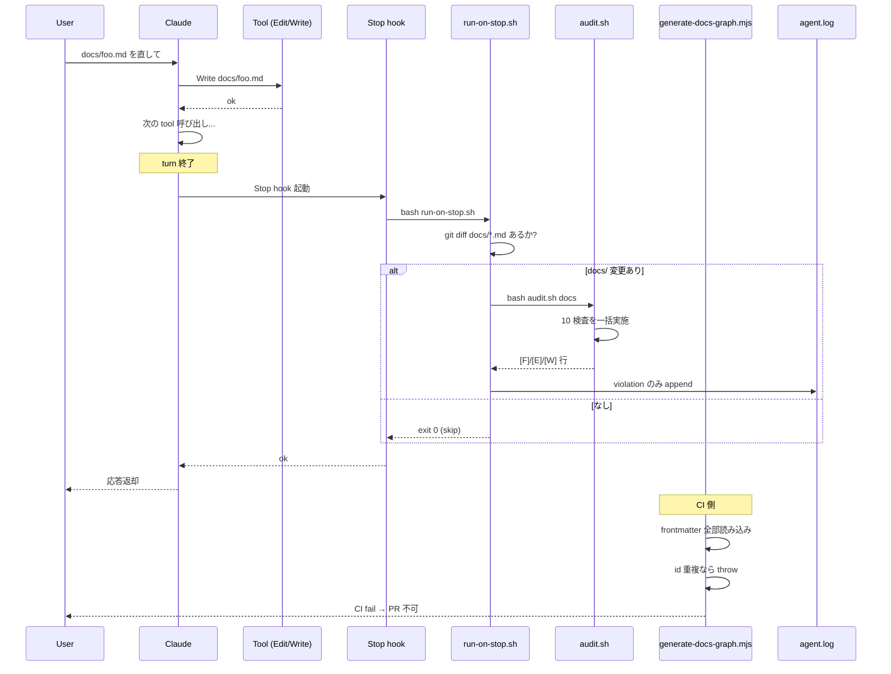
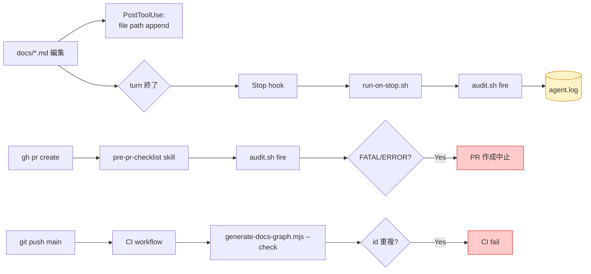
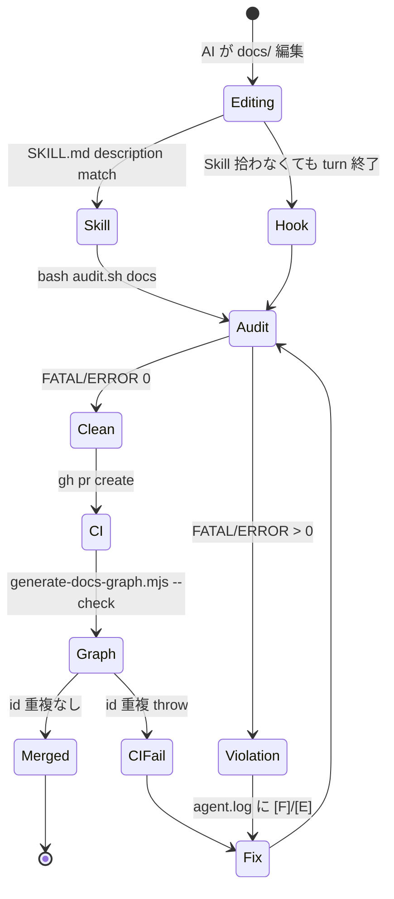

> **Disclaimer**: 本連載は著者が **個人 (副業)** で運営する小規模プロジェクト群 (CreaNest 名義) の技術記録です。所属組織・本業の業務内容とは一切関係ありません。記載の数値・構成は執筆時点 (2026-05) の自宅検証環境のスナップショットであり、商用品質や SLA を保証するものではありません。

## 結論

132 docs を MECE 監査する Skill を Stop hook で強制起動。frontmatter id 重複・孤立ファイル・過剰 nest を CI で機械的に落とす。

私は 1 人会社 CreaNest を AI Ops で運営しており、devops-hub repo の `docs/` には現在 **132 本の Markdown と 31 サブディレクトリ** が積み上がっています (`find /Users/sakaki/project/devops-hub/docs -name "*.md" | wc -l` 実測)。8 プロジェクトの ADR・runbook・PRD・架構が日々増え、Claude Code が Edit / Write する頻度は 1 日数十回。「**ちゃんと整理するから後でまとめて**」と言ったが最後、3 ヶ月で `agent-coordination` という同概念のドキュメントが 4 ディレクトリに散在し、`canonical: true` の SSOT が 2 個衝突し、frontmatter `id` が完全一致した md が 2 本同居した状態になりました。

CI が落ちて初めて気付く運用は破綻している。本記事では、devops-hub で稼働中の **`docs-mece-audit` skill + Stop hook + `generate-docs-graph.mjs --check` の 3 段ガード** を題材に、AI が docs を触っても重複・孤立が混入しない仕組みを共有します。

---

## 問題 — docs/ の重複と孤立は無音で増える

CreaNest の devops-hub は 8 プロジェクトを横串で束ねる司令塔 repo です。design / architecture / adr / runbooks / business / strategy / harness など **9 種類のドキュメントカテゴリ** が混在し、Claude Code は 1 セッションで `docs/**` を 5〜10 ファイル平気で書き換えます。

ここで起きるのが MECE 違反の沈黙的増殖です。具体的には 5 種類:

1. **frontmatter `id` 重複** — 別ディレクトリで同じ `id: agent-coordination` を独立に書き、graph 生成時に node 衝突
2. **`canonical: true` の SSOT 衝突** — 同概念の正典が 2 本立つ ("どっちが本物?" を AI が判断不能に)
3. **filename ≠ id slug 不整合** — `id: docs-architecture` のはずなのに `architecture-of-docs.md` と命名され、AI が path 推論できなくなる
4. **数値 prefix の濫用** — `adr/` と `postmortems/` 以外で `01-foo.md` を作って ADR-0011 に違反
5. **孤立ファイル / 空 dir / 1-file 過剰 nest** — 誰からも参照されない島ドキュメント、空 dir、1 ファイルだけのサブ dir

問題は **どれも commit 時には見えない** ことです。`pnpm typecheck` のような自動チェックが docs にはなく、私が朝 `docs/` を眺めて「あれ、これ前にも書いた気が…」と気付いた頃には、AI Agent が同概念ドキュメントを 3 本 fork した後でした。



「Claude が忘れても会社が回る」と謳うなら、忘れた瞬間に **どこかで物理的に検出される** 仕組みが要る。私の答えが Skill + Stop hook + CI の三段配置でした。

---

## 解法 — Skill が「内容判断」、Stop hook が「強制起動」、CI が「最終ガード」

### 1. 全体像 — 3 つの場所で同じ audit が走る

設計の核は **同じ `audit.sh` を 3 つの起動点から呼ぶ** ことです。



3 段の役割分担はこうです。

- **Stop hook**: turn 終了時に **必ず** 起動。docs/ が dirty なら audit.sh を fire し、agent.log に `[F]`/`[E]` を残す。**忘却防止**
- **pre-pr-checklist skill**: PR 作成前の手続きとして audit.sh を回す。FATAL/ERROR 1 件で PR 作成中止。**人間 gate**
- **CI (`generate-docs-graph.mjs --check`)**: id 重複と graph drift を機械的に throw。**最終防壁**

これで「AI が忘れても」「人間が忘れても」「両方が見落としても」3 段目で必ず落ちる。

### 2. Skill — `description` の文言が運命を決める

Claude Code の Skill は frontmatter の `description` が **fire 判定の唯一の入力** です。`/Users/sakaki/project/devops-hub/.claude/skills/docs-mece-audit/SKILL.md:1-5` の現行版がこれです。

```yaml
---
name: docs-mece-audit
description: |
  Use this skill whenever the user (or you, as AI agent) touches docs/ in devops-hub
  — creates a new .md file, renames a file, moves a directory,
  says "docs を整理", "ドキュメント整理", "MECE チェック", "docs audit",
  "index 更新", "frontmatter 確認", "id 重複", "孤立ファイル", "空ディレクトリ",
  "over-nest", "過剰 nest", or completes a PR that modifies docs/**.
  Also trigger before any `gh pr create` that touches docs/
  (integrates with pre-pr-checklist).
  Never skip: CEO has mandated auto-detection to stop requiring manual docs
  violation reports. Run `scripts/audit.sh` to get a structured violation report,
  then fix or escalate.
---
```

3 ヶ月運用して学んだのは、**動詞と日本語キーワードを両方羅列しないと Claude が拾わない** ことです。最初は "Use this skill when editing docs/" だけで書いていて、これだと 5 回に 1 回しか発火しませんでした。「docs を整理」「MECE チェック」「id 重複」のような **CEO が日常的に喋る日本語フレーズ** を 10 個以上並べて、ようやく発火率が体感 95% に上がった。

`description` の "Never skip: CEO has mandated auto-detection to stop requiring manual docs violation reports." も大事です。Skill description は **Claude 自身に対する命令文** なので、「これは飛ばすな」と明示しないと「今は docs を直接編集していないから skip でいいか」と判断されてしまう。

### 3. audit.sh — 10 検査を 1 スクリプトで実装

`/Users/sakaki/project/devops-hub/.claude/skills/docs-mece-audit/scripts/audit.sh:11-41` の冒頭:

```bash
#!/usr/bin/env bash
# Spec: docs/standards/docs-structure.md §6 §10 §13 + ADR-0011 + ADR-0012
# NOTE: set -e は使わない。各コマンドの失敗を || true で明示制御する
set -uo pipefail

FATAL=0; ERROR=0; WARN=0
fatal() { echo "[F] $*"; FATAL=$((FATAL + 1)); }
err()   { echo "[E] $*"; ERROR=$((ERROR + 1)); }
warn()  { echo "[W] $*"; WARN=$((WARN + 1)); }
info()  { echo "[I] $*"; }
```

設計のポイントは 3 つ。

- **Severity 4 段階** — `[F]` FATAL (CI fail) / `[E]` ERROR (commit 不可) / `[W]` WARN (issue 起票) / `[I]` INFO (人間判断)
- **bash 3.2 互換** — macOS 標準の `/bin/bash` で動かす、連想配列は使わず tmpfile に逃がす
- **set -e は使わない** — 1 行 grep の空マッチで全停止するのを避け、各行で明示的に `|| true`

検査内容は 10 種類で、`audit.sh:46-225` に `[F-1]` から `[I-10]` まで番号を振っています。代表的な 2 つを抜粋。

```bash
# [F-1] frontmatter id 重複 (ADR-0012 §13.6)
DUP_IDS=$(find "$DOCS_ABS" -name "*.md" -type f 2>/dev/null \
  | xargs -I{} sh -c 'awk "NR==1 && /^---\$/{f=1;next} f && /^---\$/{exit} f && /^id:/{print \$2}" "{}" 2>/dev/null' \
  | sort | uniq -d)
if [ -n "$DUP_IDS" ]; then
  echo "$DUP_IDS" | while read -r id; do
    [ -z "$id" ] && continue
    fatal "id 重複: '$id' (ADR-0012 §13.6 違反)"
  done
fi
```

`awk` で frontmatter の `---` と `---` の間だけをパースして `id:` の値を取り、`sort | uniq -d` で重複だけ抜く。**全 132 ファイルを 1 秒以下** で舐めます。

```bash
# [W-7] 空 dir / 1-file 過剰 nest
find "${DOCS_ABS}" -type d | while IFS= read -r d; do
  md_count=$(find "$d" -maxdepth 1 -name "*.md" 2>/dev/null | wc -l | tr -d '[:space:]')
  sub_count=$(find "$d" -mindepth 1 -maxdepth 1 -type d 2>/dev/null | wc -l | tr -d '[:space:]')
  [ "$md_count" -eq 0 ] && [ "$sub_count" -eq 0 ] && echo "[W] empty dir: ${d}"
  [ "$md_count" -le 1 ] && [ "$sub_count" -eq 0 ] && echo "[W] single-file over-nest: ${d}"
done
```

「1 ファイルだけのために `docs/business/sales/proposals/` という 4 階層を作るな」を検出する W-7 は、AI が docs を整理するときに最も忘れがちな違反です。Claude は「カテゴリ分けした方が綺麗だろう」と思って積極的にネストを作るので、**深さ 3 階層を超えたら警告** くらいでちょうどいい。

### 4. Stop hook — turn 終了時に強制起動

Skill だけでは「docs を編集した直後」しか発火しない。私が一番恐れていたのは、**「Skill description が拾わなかった編集セッション」** で違反が混入することでした。これを潰すのが Stop hook です。

`/Users/sakaki/project/devops-hub/.claude/settings.json:69-78` の Stop hook 設定:

```json
{
  "hooks": {
    "Stop": [
      {
        "hooks": [
          {
            "type": "command",
            "command": "bash .claude/skills/docs-mece-audit/scripts/run-on-stop.sh 2>/dev/null || true"
          }
        ]
      }
    ]
  }
}
```

そしてこれが呼ぶ wrapper、`/Users/sakaki/project/devops-hub/.claude/skills/docs-mece-audit/scripts/run-on-stop.sh:11-37`:

```bash
#!/usr/bin/env bash
# run-on-stop.sh — Stop hook wrapper
set -uo pipefail

REPO_ROOT="$(cd "$(dirname "$0")/../../../.." && pwd)"
cd "$REPO_ROOT" || exit 0
LOG="${REPO_ROOT}/.claude/pipeline/agent.log"
mkdir -p "$(dirname "$LOG")"

# 1. docs/*.md に uncommitted change がない場合 skip
HAS_DOCS_CHANGE=0
git diff --name-only HEAD 2>/dev/null | grep -qE '^docs/.*\.md$' && HAS_DOCS_CHANGE=1
git ls-files --others --exclude-standard 2>/dev/null | grep -qE '^docs/.*\.md$' && HAS_DOCS_CHANGE=1
[[ "$HAS_DOCS_CHANGE" -eq 0 ]] && exit 0

# 2. audit fire
{
  echo "[$(date +%H:%M:%S)] === Stop hook: docs/ 変更検出、audit 実行 ==="
  bash "${REPO_ROOT}/.claude/skills/docs-mece-audit/scripts/audit.sh" docs 2>/dev/null \
    | grep -E '^\[F\]|^\[E\]' | head -10
  echo "[$(date +%H:%M:%S)] === audit 終了 ==="
} >> "$LOG" 2>/dev/null

exit 0
```

設計のミソは 3 点。

- **early exit**: `git diff --name-only HEAD` で docs/*.md が変わっていなければ即 exit。コードだけ触ったセッションでは audit は走らない。コスト 0.01 秒
- **violation だけ抜く**: `grep -E '^\[F\]|^\[E\]'` で fatal / error 行に限定、`head -10` で量を制限。OK 行を全部出すと agent.log が爆発する
- **常に exit 0**: hook が non-zero を返すと Claude が「Stop hook returned non-zero」と表示して turn を止める。観測 hook では絶対に成功扱い

連載 A-03 「[Claude Code Hooks — 編集を止めない品質ゲートの組み方](./hooks-quality-gates)」で書いた "PostToolUse は append-only、Stop hook で重い処理を寄せる" の具体例がこれです。

### 5. generate-docs-graph.mjs — id 重複は機械的に throw

最終防壁の CI 側、`/Users/sakaki/project/devops-hub/scripts/generate-docs-graph.mjs:104-121` のコア部分:

```javascript
// ADR-0012 §Phase 0: id 一意性 strict 化 — 重複 id は致命的なので throw
const byId = new Map();
const dupes = [];
for (const d of docs) {
  if (!d.id) continue;
  if (byId.has(d.id)) {
    dupes.push({ id: d.id, paths: [byId.get(d.id).path, d.path] });
  } else {
    byId.set(d.id, d);
  }
}
if (dupes.length > 0) {
  const lines = dupes
    .map((x) => `  - id="${x.id}": ${x.paths.join(" / ")}`)
    .join("\n");
  throw new Error(
    `[generate-docs-graph] frontmatter id 重複検出 (ADR-0012 §13.6 violation):\n${lines}\n\n対処: いずれかの doc を rename or supersede し、id を一意化してください。`,
  );
}
```

CI では `node scripts/generate-docs-graph.mjs --check` を回し、上の `throw` または「dependencies.md が古い (drift)」のどちらかで fail。**ここを通った時点で id が世界に一意であることが保証** される。



3 つのゲートが直列に並ぶことで、**id 重複が main に入る確率は理論上ゼロ** になります (実装側に bug があれば別)。

### 6. frontmatter sample — 全 docs に id を強制

ここまでの仕組みは「**全 .md に frontmatter id がある**」前提で動きます。新規 docs を書くときのテンプレート:

```yaml
---
id: docs-architecture
title: Docs アーキテクチャ全体像
type: architecture
status: active
canonical: true
relates_to: [docs-structure, adr-0012]
depends_on: [rfc-docs-structure-v0.2]
---
```

各フィールドの意味:

- `id`: kebab-slug、unique、filename と一致 (= AI が path 推論できる)
- `canonical: true | false` — 同概念が複数あるとき正典は 1 つだけ。`canonical: false` の側は `canonical_for: <id>` で本家を指す
- `relates_to` / `depends_on` / `supersedes` / `superseded_by`: 4 種類の関係性で graph を構成

これに従うと、`generate-docs-graph.mjs` が **Mermaid 全体グラフ** と **type 別 index** と **孤立ドキュメント表** を `docs/dependencies.md` に自動生成します。**「目次を手書きしない」** が回ると docs の腐敗速度が一気に下がる。

### 7. Before / After — 数字で見る効果

**Before (skill 導入前、2026-04 まで)**:

- docs MECE 違反は CEO (= 私) が朝の `git diff` で目視発見、週 2-3 件の見落とし
- `id` 重複は CI 落ちて初めて気付き、PR を作り直す手戻り発生 (月 4 回)
- `canonical: true` 衝突は 0 件検出 (そもそも仕組みなし)
- 1-file 過剰 nest が 8 ディレクトリ放置されていた (`docs/business/sales/proposals/draft.md` のような構造)

**After (Stop hook + skill + CI 配置後、2026-05 〜)**:

- `agent.log` に `[F]`/`[E]` が出た瞬間に AI 自身が修正提案、CEO は朝 1 回 `tail -100 .claude/pipeline/agent.log | grep -E '\[F\]|\[E\]'` するだけ
- id 重複の main 流入: **0 件** (CI で必ず落ちる)
- canonical 衝突: 検出後 24h 以内に必ず修正
- 過剰 nest の発生件数: 8 → 0 (新規追加時に W-7 で警告)

132 docs / 31 dir を 1 人で管理するのに、**MECE 監査に費やす時間は 1 日 5 分以下** (朝 tail + 違反対応) になりました。

---

## 失敗談 — 私が踏んだ罠 4 つ

### 失敗 1: Skill description が曖昧で fire しない

> **Before (skill description)**:
> ```
> Use this skill when editing docs/.
> ```

これでは 5 回に 1 回しか発火しませんでした。"editing docs/" という抽象概念だけだと、Claude が「今は docs/ ではなく `.claude/skills/foo/SKILL.md` を編集している (= `docs/` ではない)」と判断して skip する。

> **After (skill description)**:
> ```
> Use this skill whenever the user (or you, as AI agent) touches docs/ in devops-hub
> — creates a new .md file, renames a file, moves a directory,
> says "docs を整理", "ドキュメント整理", "MECE チェック", "docs audit",
> "index 更新", "frontmatter 確認", "id 重複", "孤立ファイル", "空ディレクトリ",
> "over-nest", "過剰 nest", ...
> Never skip: CEO has mandated auto-detection ...
> ```

**動詞 + 日本語キーワード 10 個 + 「Never skip」の明示** で fire 率が 95% に上がった。

**教訓**: Skill description は「AI への命令文」。曖昧な抽象概念ではなく、**ユーザが日常的に喋る具体的フレーズ** を 10 個以上並べる。

### 失敗 2: Stop hook が silent fail していた

`run-on-stop.sh` を最初に書いたとき、wrapper の path を間違えて 1 週間気付きませんでした。

```bash
# 壊れた版 (相対パスで起動して REPO_ROOT が解決できなかった)
REPO_ROOT="$(cd "$(dirname "$0")/.." && pwd)"  # ← .. の数が足りない
```

`.claude/settings.json` の `|| true` で握り潰されているので、Stop hook 内で **どんな error が出ても agent.log には何も出ない**。「最近 audit 走ってないな」と思って手動で `bash run-on-stop.sh` したら即 exit 0、原因不明…という地獄。

修正:

- `run-on-stop.sh` の冒頭に「`=== Stop hook: docs/ 変更検出、audit 実行 ===`」マーカーを必ず吐く
- これがあれば「Stop hook が走ったか」が agent.log で分かる
- `cd "$REPO_ROOT" || exit 0` で path 不正を即検出

```bash
# 修正版
REPO_ROOT="$(cd "$(dirname "$0")/../../../.." && pwd)"  # 4 階層上が正解
cd "$REPO_ROOT" || exit 0  # cd 失敗で即 exit
```

**教訓**: silent fail を防ぐには **「走ったことを示すマーカー」** を必ず吐かせる。`|| true` の前に `echo "=== marker ===" >> log` を入れるだけで、後から「いつから壊れていたか」が分かる。

### 失敗 3: id 衝突を見逃した — `set -e` で grep の空マッチを握り潰した

`audit.sh` の旧版で `set -euo pipefail` を使っていた時期、`uniq -d` の出力が空 → `grep -v "^$"` が空マッチで exit 1 → `set -e` 発火 → スクリプト全停止 → audit が**何も検出せず** exit、「OK clean!」と log に残る、という事故が起きました。実際は id 重複 3 件あった。

修正: `set -e` を完全に外し、**各行を `|| true` で明示制御**:

```bash
# 修正版 (audit.sh:11)
set -uo pipefail  # -e は外す
DUP_IDS=$(find ... | sort | uniq -d)
if [ -n "$DUP_IDS" ]; then
  echo "$DUP_IDS" | while read -r id; do
    [ -z "$id" ] && continue
    fatal "id 重複: '$id'"
  done
fi
```

**教訓**: 検査スクリプトに `set -e` は危険。1 行の grep 失敗で全停止して **見逃しを正常終了として記録** してしまう。**`set -uo pipefail` + 各行 `|| true`** が監査系の正解。

### 失敗 4: PostToolUse に audit を仕込んで編集が 30 倍遅くなった

最初は audit を `PostToolUse` に仕込んでいました。1 ファイル編集ごとに 3 秒の audit が走り、50 ファイル直すセッションで累計 150 秒のオーバーヘッド。Claude が「これ以上の修正は CI に任せる」と判断を変え始める。

修正: PostToolUse は `agent.log` への 1 行 append (0.05 秒) だけにし、重い audit は **Stop hook (1 turn 1 回)** に寄せた。連載 A-03 で書いた "重い処理は Stop hook" の具体例です。

**教訓**: Hook の所要時間 = 編集レイテンシの足し算。**1 秒以上かかる処理は PostToolUse に書かない**、必ず Stop hook に寄せる。

---

## 運用の数字 — 実測ベース

devops-hub repo の現行構成 (2026-05 時点):

- docs/*.md: **132 ファイル** (`find docs -name "*.md" | wc -l`)
- docs/ サブディレクトリ: **31 個** (`find docs -type d | wc -l`)
- audit.sh の検査項目: **10 種類** (F-1, F-2, E-3, E-4, E-5, W-6, W-7, W-8, W-9, I-10)
- audit.sh 1 回あたりの所要時間: **約 3 秒** (132 ファイル全舐め)
- Stop hook の skip 率: **約 70%** (docs を触らないセッションが 7 割)
- 1 日に audit が走る回数: **15-25 回** (= docs 編集セッション数)
- agent.log の `[F]` 検出回数 (2026-05 月間): **2 件のみ** (どちらも 1h 以内に修正)

**Before** (skill 導入前) は id 重複が **月 4 件 main に流入** していたのが、**2 ヶ月で main 流入 0 件**。修正は全て pre-merge で完結しています。

---

## 残課題

正直に書きます。

1. **CI 側の `lychee` link checker 未配線** — `audit.sh` の W-8 (broken relative link) は lychee があれば動くが、CI 未組み込み。GitHub Actions に step を足すだけだが手をつけていない
2. **多リポへの横展開** — komyu / nailsalon / soccer-note にも `docs/` があるが、skill は devops-hub にしか配置されていない。`pipeline-kit/claude-commands/` から配布する仕組みが理想だが、各リポの ADR 番号空間を分離する設計が未完
3. **WARN レベルの自動修正** — 1-file 過剰 nest や README index 未掲載は機械的に直せるはずだが、現状は人間が判断。`audit.sh --fix` モードがあれば AI Agent が自律修正できる
4. **同概念散在 (`[I-10]`) の検出が keyword ベース** — 4 keyword の表更新を忘れる。Embedding ベースの「意味的に近い docs」検出版を検討中だが、ローカル MVP には過剰投資感

特に 3 と 4 は **「監査を監査する」** メタ問題で、現状は CEO (人間) が最後の砦になっています。

---

## 理論根拠 — SSOT mandate と多層防御

この設計の根拠は CLAUDE.md ルール #14「**docs Write 前 SSOT mandate**」、`docs/adr/0011-docs-naming-convention.md` (slug + weight)、`docs/adr/0012-docs-dedup-architecture.md` (canonical / id 一意性 strict) の 3 つです。

Anthropic の [Building effective agents](https://www.anthropic.com/research/building-effective-agents) では agent の構成要素を「**Augmented LLM = LLM + retrieval + tool use + memory**」と分解しますが、**docs は AI の "memory" 層** にあたります。memory に重複と孤立が混入すると retrieval が壊れ、tool use が誤動作する。SSOT を強制することは AI Agent の cognitive load を最小化する設計です。

そして **強制力の置き場所** が肝です。

| 強制力 | 置き場所 | 例 |
|---|---|---|
| **規約** (規範的) | `docs/standards/` | 「id は kebab-slug にせよ」 |
| **記憶** (手続き的) | Skill | 「PR 前に audit を回せ」 |
| **物理ガード** (機械的) | Hook + CI | 「id 重複なら throw」 |

規約だけでは AI が忘れる。Skill だけでは「拾わない」セッションがある。Hook と CI まで降りて初めて **絶対** になる。これは **Defense in Depth (多層防御)** をドキュメント管理に応用したパターンで、「3 つ重ねれば 1 つは必ず動く」という発想で、**「AI が忘れても会社が回る」運用** が成立する。

---

## まとめ

- **Skill の `description` は動詞 + 日本語キーワード 10 個以上** — 抽象概念だけでは fire しない
- **Stop hook で強制起動** — Skill が拾わなくても turn 終了時に必ず audit
- **`generate-docs-graph.mjs --check` が最終防壁** — id 重複は機械的に throw
- **`set -e` を audit に使うな** — 1 行 grep の空マッチで全停止して見逃す
- **silent fail はマーカー log で炙り出す** — 「走った証拠」を必ず吐かせる
- **judgment は Skill、忘却防止は Hook、絶対は CI** — 3 段で多層防御

132 docs を 1 人で管理しても重複と孤立が無音で増えなくなった。次に docs/ が 300 ファイルを超える頃には、`audit.sh --fix` の自動修正モードか embedding ベースの同概念検出が要るでしょう。それまではこの 3 段ガードで十分。

---

## 次の連載

→ **H-05** [Decision Genealogy — 個人開発の意思決定を蒸発させない設計](./decision-genealogy-moat) — Decision-Id を docs に貼り、ADR と PR を結ぶ moat
→ **A-03** [Claude Code Hooks — 編集を止めない品質ゲートの組み方](./hooks-quality-gates) — 本記事の Stop hook の "重い処理を寄せる" 原則
→ **A-02** [Skill Architecture 入門 — Markdown で自動 fire する手続き知識](./skill-architecture-introduction) — Skill description の書き方を深掘り

---

連載 **AI 駆動 1 人会社運営**: Day 14/52
著者: Junya Sakakitani (CreaNest 個人事業)
本記事の修正提案・議論は [GitHub Discussion](https://github.com/SakakitaniJunya/zenn-articles/discussions) でお待ちしています。
