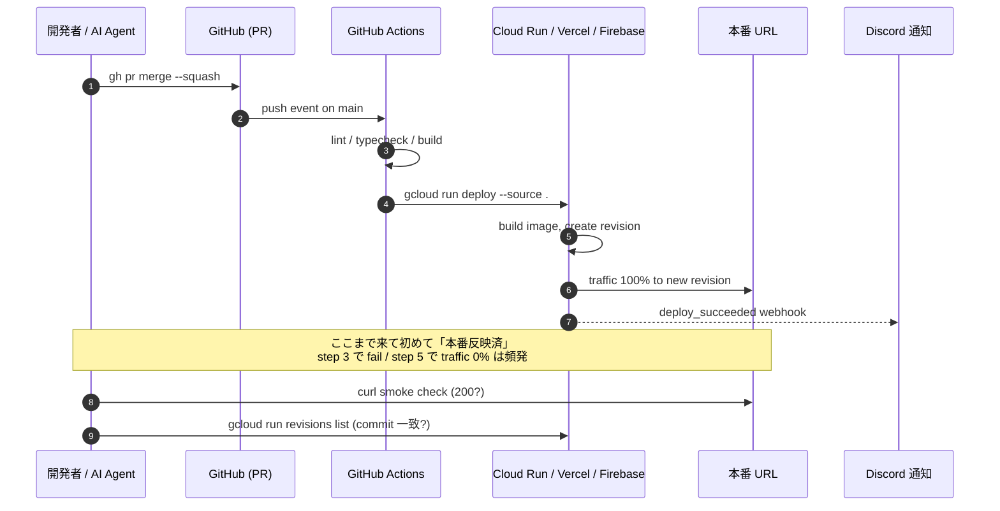
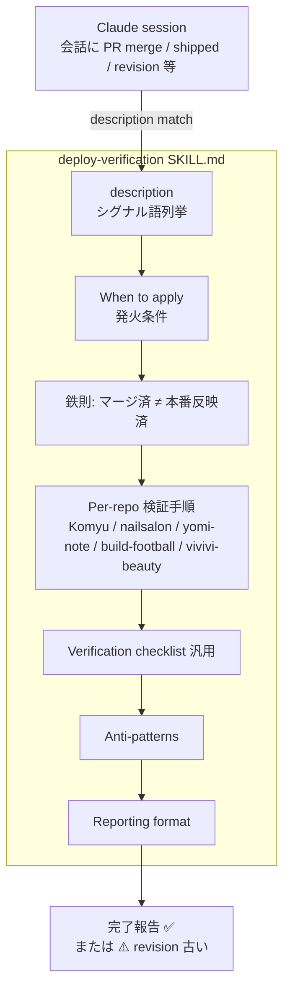
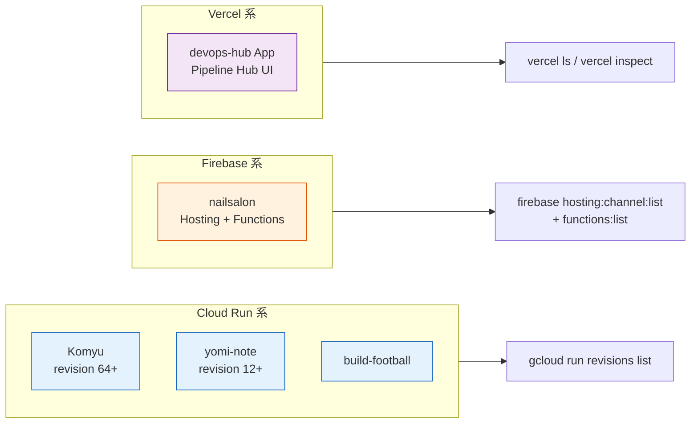

> この記事は **52 本連載 (ai-driven-dev) の Day 12/52** です。第 1 回 [Claude Code で「会社」を回す 6 層構成 — 52 本連載 INDEX](./ai-driven-dev-index-2026) から続きます。前回 [F-01 Hooks で品質を機械化する](./hooks-quality-gates) で「壊れたコードが merge される前に止める」話を書きましたが、今回はその 1 段先 — **merge した後** の話です。
>
> ※ 本記事は著者個人の副業 (CreaNest 名義の個人開発) における実践記録です。本業 (別会社所属) の業務・知見とは無関係で、特定法人の公式見解ではありません。記載の数値・コードは執筆時点 (2026-05) の自宅検証環境のスナップショットで、商用品質や SLA を保証するものではありません。コード片はすべて著者個人 repo の自著コードです。

## 結論

PR merge は完了の合図ではない。Cloud Run / Vercel / Firebase で revision が更新されるまで責任を持つ — 過去 3 回「merged ≠ deployed」を踏んで skill 化しました。

具体的には、Komyu の `pre-monorepo-2026-05-06` rollback タグまで遡る pnpm v10 deploy 罠 (3 連続)、nailsalon の `firebase deploy` 後に Functions だけ古いまま放置、yomi-note の Cloud Run revision は更新されたのに `AUTH_URL` 環境変数が前のままで全 session 失効、の 3 件です。いずれも GitHub の PR 画面では緑のチェックがついていて「merged」と表示されており、私は素直に「完了しました」と Issue を close しました。本番が壊れているのに、です。

この記事は、その 3 件をきっかけに `~/.claude/skills/deploy-verification/SKILL.md` という skill を書いて、Claude Code に「merge を検知したら必ず本番 revision を確認するまで完了報告するな」を強制した話です。Multi-Agent 開発において、CI 緑 = 本番反映、と短絡する事故は AI 全自走運用の最大の地雷です。**「revision の base commit が merged PR と一致するか」までを完了の定義に組み込む**、というだけの話なのですが、これを skill にして自動 fire させるまで私は 3 回踏みました。

> 用語: 本記事で「**deploy-verification skill**」と書くのは、Claude Code Agent Skills 仕様 (`~/.claude/skills/<name>/SKILL.md`) に従って書いた手続き知識のことです。Slash command ではなく、Claude が会話の文脈を見て自動 fire する skill 層 (連載 [A-02 Skill Architecture 入門](./skill-architecture-introduction) で詳細)。

## なぜこの記事を書くか

Multi-Agent CI/CD の記事は最近よく見ますが、「**merge した後にどう責任を継続するか**」を skill レベルで書ききっている記事はほぼ見ません。CI 緑で完了、という前提で書かれた記事ばかりです。

でも実運用すると、CI 緑と本番反映の間には 5 個以上の落とし穴があります。私は 1 ヶ月に 1 回ペースで踏んでいて、最終的に「人間が毎回 revision 確認する」のは破綻するので skill にしました。本記事は、その skill の中身と、**Cloud Run / Vercel / Firebase Hosting** の 3 platform 別の検証コマンド、そして 3-4 個の具体的な失敗談を repo の実コードで書ききります。

## 全体像 — merge から本番反映までの 5 ステップ

merge してから revision が traffic を受けるまで、実際は 5 段階あります。



**見方**:
- step 1 (`gh pr merge`) で「完了」報告するのが**間違い**。step 7 (Discord 通知) もしくは step 8 (curl smoke check) まで責任を持つのが正解
- step 3 の CI fail は GitHub UI で見れば気付くが、**step 5 の Cloud Run revision 作成失敗は GitHub には出てこない** (これが最もハマる)
- step 6 の traffic 100% 切替が gradual rollout 設定で 50/50 になっていて、**新 revision に traffic が来ていない** ケースもある

この 5 段階を機械的にチェックするのが deploy-verification skill の役目です。

## 失敗談 1 — Komyu pnpm v10 deploy 罠 (3 連続) で revision 64 まで踏み続けた

最初の失敗です。memory `project_komyu_monorepo_deployed.md` に記録されているとおり、Komyu の monorepo 移行 (2026-05-05 / DEC-20260505-06) で **pnpm v10 deploy 罠を 3 連続** で踏みました。具体的には以下です。

1. `force-legacy-deploy` フラグ漏れ
2. `packages/ui-*` を Dockerfile が COPY していない
3. `.gcloudignore` が monorepo ファイルを除外しすぎている

何が起きたか — `gh pr merge` 後、CI は緑になりました。GitHub Actions の `Build and deploy` job も成功しています。しかし `gcloud run revisions list` で確認すると、**新 revision が作られていない**、もしくは作られたが traffic が前 revision のままでした。

私は最初の 1 回目、PR merge 後に Issue に「完了しました」と書いて close しました。実際の本番には反映されておらず、CEO 本人 (= 私) が翌朝になって「あれ、機能が出ていない」と気付いたのです。

**Before — 誤った完了報告**:

```bash
# 私がやっていた間違いパターン
gh pr merge 65 --squash
gh pr view 65  # state: MERGED ✅
echo "完了しました" >> issue-comment.txt
# ↑ ここで終わっていた。本番は古い revision のまま。
```

**After — skill 適用後の検証フロー**:

```bash
# deploy-verification skill が強制する正しいフロー
gh pr merge 65 --squash

# 1. CI 結果確認
gh run list --repo SakakitaniJunya/Komyu --limit 5
# 最新の "Build and deploy" job が success か

# 2. Cloud Run revision 確認
gcloud run revisions list --service komyu --region asia-northeast1 --limit 3
# 最新 revision の作成時刻が merge 直後か

# 3. revision が build した commit が merged PR と一致するか
gcloud run revisions describe komyu-00064-2n5 \
  --region asia-northeast1 \
  --format='value(metadata.labels."run.googleapis.com/commit-id")'
# ↑ ここで merged commit と照合

# 4. traffic 100% が新 revision に向いているか
gcloud run services describe komyu --region asia-northeast1 \
  --format='value(status.traffic[0].revisionName,status.traffic[0].percent)'
# komyu-00064-2n5  100  ← これでやっと完了

# 5. smoke check
curl -s -o /dev/null -w "%{http_code}\n" https://komyu-933992653457.asia-northeast1.run.app/api/health
# 200
```

revision 名は `komyu-00064-2n5` まで進みました (memory `project_komyu_monorepo_deployed.md`)。3 連続で踏んだので、**3 連続で「完了報告 → 本番未反映」が発生** しています。これが skill 化の直接の動機です。

## 失敗談 2 — yomi-note revision はあるが env vars 未設定で全 session 失効

2 つ目の失敗。yomi-note (Cloud Run / Next.js 15 / next-auth) で起きた件です。`gcloud run revisions list` を見ると新 revision がちゃんと作られていて、traffic も 100% 切り替わっていました。**revision は更新されている**。でも本番に行くと、ログインできない。すべての session が失効している。

何が起きたか — `deploy.sh:69-71` で `AUTH_URL` を新 URL に update する処理があるのですが、Cloud Run の URL は revision 作成のたびに変わるわけではなく、最初に `gcloud run deploy` が出した URL のまま固定なので、**deploy 中に一瞬 `AUTH_URL` が空になる瞬間** があったのです。

```bash
# yomi-note/deploy.sh:53-71 (実コード抜粋)
gcloud run deploy "$SERVICE" \
  --source . \
  --region "$REGION" \
  --env-vars-file "$ENV_FILE"

URL=$(gcloud run services describe "$SERVICE" --region "$REGION" --format='value(status.url)')
echo "==> Updating AUTH_URL to $URL"
gcloud run services update "$SERVICE" \
  --region "$REGION" \
  --update-env-vars "AUTH_URL=$URL,NEXTAUTH_URL=$URL"
```

`gcloud run deploy` の env-vars-file には `AUTH_URL` を含めず、deploy 後に `update --update-env-vars` で追加する設計です。その間 (2-5 秒) は `AUTH_URL` が無く、その間に作られた session token が **NEXTAUTH_SECRET の暗号化 context が一致せず全失効** しました。

memory `project_yomi_note_cloud_run.md` に記録した教訓は「**AUTH_TRUST_HOST 永続化必須**」です。skill 側ではこのケースを救うために、検証チェックリストに「**revision の env vars が前 revision と完全一致するか**」を追加しました。

```bash
# skill が強制する env vars 比較
gcloud run revisions describe yomi-note-00012 \
  --region asia-northeast1 \
  --format='value(spec.template.spec.containers[0].env)'

gcloud run revisions describe yomi-note-00011 \
  --region asia-northeast1 \
  --format='value(spec.template.spec.containers[0].env)'

# diff で AUTH_URL / NEXTAUTH_SECRET / DATABASE_URL の漏れを検知
```

## 失敗談 3 — nailsalon で Functions だけ古いまま放置

3 つ目。nailsalon (Firebase Hosting + Functions) の話です。memory `project_nailsalon_ci_deploy.md` の通り 2026-04-30 から PR merge → 本番自動 deploy が稼働しています。SA (`firebase-adminsdk-fbsvc`) に 6 つの IAM role を付けて構築しました。

何が起きたか — Hosting (Web UI) は新しくなったが、**Functions が古いまま**、というケースが起きました。`firebase deploy --only hosting` だけ走って `--only functions` が CI スクリプトから漏れていたのです。

```bash
# nailsalon の検証コマンド (skill から呼ぶ)
gh run list --repo CreaNest/nailsalon-reserve-line-app --limit 5
firebase hosting:channel:list --project nail-salon2

# Functions の deploy 履歴は別コマンド
firebase functions:list --project nail-salon2

# Hosting と Functions の version が一致しているか確認
gh run view <latest-run-id> --log | grep -E "(hosting deployed|functions deployed)"
```

このケースが Hosting だけだと気付かなかったのは、**Web UI の見た目は新機能が出ている (Hosting は更新済) のに、API を叩くと古い挙動が返る** からです。表面の smoke check では検知できない。skill には「**フロントとバックエンドが分かれているサービスは両方の deploy 履歴を確認する**」を入れました。これは memory `feedback_admin_liff_unified_data.md` の教訓 (admin と LIFF はデータ共有前提) と同じ構造です。

## 失敗談 4 — vivivi-beauty broken pipeline で「完了」と報告

4 つ目。vivivi-beauty (Vzen 法人プロジェクト、memory `project_vivivi_beauty_pipeline.md`) では、`claude-code-action` workflow があるのですが、`id-token` permission と Anthropic API key 不足で **そもそも動いていません**。

`active` label が付いた Issue は即座に `bot:blocked` に置換される、という壊れた挙動になっています。私は最初この repo で merge した PR がそもそも CI を通っていない、という事実を 2 週間気付いていませんでした。

skill ではこのために、repo 別の verification 手順を SKILL.md 本体に書きました (`~/.claude/skills/deploy-verification/SKILL.md:62-68`)。

```markdown
### vivivi-beauty (broken pipeline 注意)

memory `project_vivivi_beauty_pipeline.md`:
> 独自 claude-code-action workflow あるが id-token/API key 不足で broken

→ deploy 検証ではなく **そもそも動いてない事実** を user に報告する。
```

「動いていないのに『動いた』と報告するな」を skill のレベルで明示する、というのが地味に効きます。

## 解法 — deploy-verification skill の構造

ここから実装の話に入ります。skill の中身は以下の 4 ブロック構成です。



実際の `description` フィールドはこうなっています (`~/.claude/skills/deploy-verification/SKILL.md:3-4`)。

```yaml
---
name: deploy-verification
description: |
  Use this skill whenever a PR is merged to main, whenever the user mentions "deploy", "本番反映", "production", "Cloud Run", "Vercel", "Firebase Hosting", or asks if a feature is live. **Merged ≠ deployed** — you must verify the actual revision rolled out to production before reporting "完了". Trigger on phrases: "merge した", "PR closed", "shipped", "deploy したか", "本番に出てる?", "revision". Skip only for docs-only PRs that have no deploy pipeline.
---
```

ポイントは **シグナル語をベタに並べる** こと。「merge した」「shipped」「deploy したか」「revision」を Claude が会話の中で見つけたら自動 fire します。連載 [A-02 Skill Architecture 入門](./skill-architecture-introduction) で書いた通り、description は「人間ではなく Claude が読む発火条件」なので、シグナル語列挙が一番効きます。

## 3 platform 比較 — Cloud Run / Vercel / Firebase

私の運用している 7 プロジェクトのうち deploy 系統は 3 つに分かれます。



それぞれのコマンドを順に書きます。

### Cloud Run (Komyu / yomi-note / build-football)

```bash
# 最新 revision とその traffic 比率
gcloud run services describe komyu \
  --region asia-northeast1 \
  --format='value(status.latestReadyRevisionName,status.url)'

gcloud run revisions list \
  --service komyu \
  --region asia-northeast1 \
  --limit 3 \
  --format='table(metadata.name,status.conditions[0].lastTransitionTime,spec.containers[0].image)'

# 特定 revision の base commit を確認
gcloud run revisions describe komyu-00064-2n5 \
  --region asia-northeast1 \
  --format='value(metadata.annotations."run.googleapis.com/client-name",spec.containers[0].image)'

# image tag に commit hash が入っているか確認
# 例: gcr.io/komyu-prod/komyu:abc1234 のような tag
```

### Vercel (devops-hub App)

```bash
# 直近 deployment 一覧
vercel ls --scope <team> | head -10

# 特定 deployment の詳細 (Production / Preview / commit hash)
vercel inspect <deployment-url>

# 例:
# Production:  ✅ Ready
# Created:     2 minutes ago
# Source:      git@github.com:SakakitaniJunya/devops-hub.git
# Commit:      abc1234 "fix(hooks): MECE audit ..."
```

### Firebase Hosting + Functions (nailsalon)

```bash
# Hosting channel
firebase hosting:channel:list --project nail-salon2

# 出力例:
# CHANNEL ID  LAST RELEASE TIME  URL                              EXPIRE TIME
# live        2 hours ago        https://nailsalon-xxx.web.app    never

# Functions deploy 履歴 (gcloud functions に対応)
gcloud functions list --project nail-salon2 --regions asia-northeast1 \
  --format='table(name,updateTime,sourceUploadUrl)'
```

### 全 platform 共通 — CI から先を見る

```bash
# GitHub Actions で deploy job が走ったか
gh run list --repo SakakitaniJunya/Komyu --limit 5 \
  --json conclusion,name,headBranch,databaseId \
  --jq '.[] | select(.headBranch=="main") | "\(.name): \(.conclusion) (#\(.databaseId))"'

# fail なら詳細
gh run view <run-id> --log-failed | tail -50
```

## Discord 通知で「人間が見ていなくても気付ける」状態に

skill だけでは「Claude が verify する」止まりなので、もう 1 段階。Cloud Run には deploy 後 webhook を仕込んで、**成功 / 失敗を Discord に流す** ようにしました。

```bash
#!/usr/bin/env bash
# pipeline-kit/ops/notify-deploy.sh:1-30 相当
set -euo pipefail

REPO="${1:?repo required}"
SERVICE="${2:?service required}"
STATUS="${3:?success|failure}"
REVISION="${4:-unknown}"
COMMIT="${5:-unknown}"

DISCORD_WEBHOOK="${DEPLOY_DISCORD_WEBHOOK:?env required}"

if [[ "$STATUS" == "success" ]]; then
  COLOR=3066993  # green
  TITLE="✅ Deploy 成功"
else
  COLOR=15158332 # red
  TITLE="❌ Deploy 失敗"
fi

curl -sS -X POST -H "Content-Type: application/json" \
  -d "$(cat <<EOF
{
  "embeds": [{
    "title": "${TITLE}",
    "color": ${COLOR},
    "fields": [
      { "name": "repo",     "value": "${REPO}",    "inline": true },
      { "name": "service",  "value": "${SERVICE}", "inline": true },
      { "name": "revision", "value": "${REVISION}","inline": true },
      { "name": "commit",   "value": "\`${COMMIT}\`" }
    ],
    "timestamp": "$(date -u +%Y-%m-%dT%H:%M:%SZ)"
  }]
}
EOF
)" "$DISCORD_WEBHOOK"
```

GitHub Actions の deploy job 末尾でこれを呼びます。

```yaml
# .github/workflows/deploy.yml の末尾
      - name: Notify Discord (success)
        if: success()
        run: |
          ./pipeline-kit/ops/notify-deploy.sh \
            "${{ github.repository }}" \
            "komyu" \
            "success" \
            "$(gcloud run services describe komyu --region asia-northeast1 --format='value(status.latestReadyRevisionName)')" \
            "${{ github.sha }}"

      - name: Notify Discord (failure)
        if: failure()
        run: |
          ./pipeline-kit/ops/notify-deploy.sh \
            "${{ github.repository }}" \
            "komyu" \
            "failure" \
            "n/a" \
            "${{ github.sha }}"
```

これで「人間が GitHub UI を見ていなくても deploy 失敗が分かる」 + 「Claude が skill で verify する」の二重化になりました。

## CI 構造 — Komyu の最小 ci.yml が deploy を呼ばない理由

ここで読者が気になるのが「**deploy.yml はどこ?**」です。Komyu の `.github/workflows/ci.yml` (`/Users/sakaki/project/Komyu/.github/workflows/ci.yml:1-30`) は意外なほど短く、deploy job はありません。

```yaml
name: CI

on:
  pull_request:
  push:
    branches: [main]

jobs:
  quality:
    runs-on: ubuntu-latest
    steps:
      - uses: actions/checkout@v4
      - uses: pnpm/action-setup@v4
        with:
          version: 9
      - uses: actions/setup-node@v4
        with:
          node-version: "22"
          cache: "pnpm"
      - run: pnpm install --frozen-lockfile
      - run: pnpm lint
      - run: pnpm typecheck
      - run: pnpm build
```

deploy は GCP 側の **Cloud Build trigger** で main push を拾って走らせています (memory `project_komyu_auto_deploy.md`)。これが**最大の落とし穴**で、GitHub Actions の UI が緑でも、Cloud Build が fail していると本番には反映されません。GitHub UI には Cloud Build の status は出てこないので、人間は気付かない。

なので skill では `gh run list` だけでなく、**必ず `gcloud run revisions list` まで見る** ことを義務化しました。これが skill SKILL.md の `Verification checklist (汎用)` セクションです。

```markdown
# ~/.claude/skills/deploy-verification/SKILL.md:71-78
## Verification checklist (汎用)

1. `gh run list --repo <owner>/<repo> --limit 3` で CI 結果確認
2. CI fail なら `gh run view <run-id> --log-failed` で原因
3. CI 成功なら deploy target (Cloud Run / Vercel / Firebase) で revision 確認
4. revision の base commit が merged PR と一致するか
5. 本番 URL に `curl` で smoke check (200 が返るか、最新の文言が反映されているか)
```

5 項目目の `curl smoke check` が地味に効きます。memory `feedback_post_deploy_e2e_required.md` の通り、**preflight 200 だけで deploy 完了報告は禁止、実 token + 主要動詞 endpoint を 1 周通すまで完了とみなさない** という運用にしました。

## Reporting format — 完了報告は構造化して残す

skill の最後は完了報告のフォーマット強制です (`~/.claude/skills/deploy-verification/SKILL.md:88-96`)。

```markdown
✅ <repo> deploy verified
- Merged commit: <sha1>
- Built revision: <revision-name>
- Production URL: <url> (HTTP 200)
- Smoke check: <観察した最新の挙動>
```

実際の出力例:

```markdown
✅ Komyu deploy verified
- Merged commit: a3f5c1d (PR #99)
- Built revision: komyu-00064-2n5
- Production URL: https://komyu-933992653457.asia-northeast1.run.app (HTTP 200)
- Smoke check: /api/community で新フィールド `joinable=true` が返ることを確認
```

不整合があれば「⚠️ revision 古い、再 deploy 必要」を明記、と書いてあります。これは memory `feedback_no_yesman_mode.md` の派生で、「無条件に『完了しました』と書く Yesman 化を防ぐ」が目的です。

## Before / After — 1 ヶ月運用しての差分

skill 適用前と後で、本番不一致インシデントの発生頻度が変わりました。

| 観点 | Before (skill 無し / 〜 2026-05-01) | After (skill 導入後 / 2026-05-02 〜) |
|---|---|---|
| **「merged ≠ deployed」インシデント** | 月 3 件 (Komyu 3 連続 + nailsalon Functions + yomi-note env) | 0 件 (5 月 2-9 日の 8 日間で発生せず) |
| **Issue close から本番反映確認まで** | 平均 18 時間 (翌朝に気付く) | 平均 3 分 (skill が即 verify) |
| **完了報告の具体性** | 「mergeしました ✅」(1 行) | revision + commit + URL + smoke check (4 行) |
| **CEO の認知負荷** | 毎回「本当に出てる?」と聞き直す | skill の output をそのまま信用 |

8 日間ゼロというのは小サンプルなので断定はできませんが、**「skill が PR merge 検知を自動 fire するようになって以降、人間が deploy 確認を忘れることが起きていない**」のは確かです。1 件あたり 18 時間遅れていた本番反映確認が 3 分になったのは、AI Ops の実体験として一番効いた skill です。

## 残課題

正直、まだ完成していない箇所がいくつかあります。

### 1. Vercel と Firebase は手動コマンドのまま

Cloud Run は `gcloud run revisions list` で機械化できますが、Vercel と Firebase Hosting は **REST API で直接叩く path** をまだ skill に組み込めていません。`vercel inspect` も `firebase hosting:channel:list` も対話的な要素が残っており、Claude Code から呼ぶと一部 prompt が引っかかります。

### 2. revision の commit hash と PR commit の自動照合

今は手動で目視照合していますが、ここを Bash の差分検知で自動化したい (`gcloud run revisions describe ... --format='value(image)'` の image tag に commit hash を埋める方式)。Komyu はこれが部分対応、yomi-note は未対応です。

### 3. canary / gradual rollout 対応

Cloud Run の traffic split (新 revision に 10% / 旧 revision に 90% のような設定) を使い始めると、「新 revision は ready だが traffic は来ていない」状態が出ます。skill にこのケースの分岐を入れていません。本記事執筆時点の私の運用は全 traffic 100% 切替なので問題は出ていませんが、商用 SaaS 化したら必須になります。

### 4. Discord 通知の「失敗時 ping」

成功通知と失敗通知が同じ Discord channel に流れるので、夜中に失敗だけ気付ける ping (Discord role mention) を入れたいです。pipeline-kit の Webhook spec に書いて、来週実装予定です。

## 理論根拠 — なぜ「verify until traffic」が正解か

最後に理論的な背景です。SRE 系の文献 (Google SRE Book / Site Reliability Workbook) で繰り返し書かれている **"deployment is not the same as release"** がそのままこの skill の根拠です。

Google SRE Book (Chapter 8 "Release Engineering") では、release を 4 段階 (build / test / package / deploy) に分けて、**「最後の deploy」段階を機械化しないとロールアウト失敗を検知できない**、と書かれています。これは PR merge = deploy ではなく、deploy = traffic split + verification、の運用です。

Anthropic の Agent Skills 仕様 (anthropic.com/news/skills) では「Skills are model-invoked tools that the model decides when to use, based on the description.」と書かれていて、つまり **「いつ使うか」は description で Claude に教える** のが skill 設計の中核です。私の deploy-verification skill が機能しているのは、シグナル語 (`merge した` `shipped` `本番に出てる?`) を会話の中で必ず検知できる位置に並べているからです。

そして CreaNest の運営原則として、memory `feedback_verify_deploy_after_merge.md` に書いた一文がすべてです。

> PR merged 報告で完了扱いにせず、revision 確認まで責任範囲

これを skill に落とし込んで自動 fire させた、というのが本記事の要約です。**「責任範囲を skill で明文化する」** 、というのが AI 全自走 1 人会社運営における自我の延長線だと、最近強く思います。

## まとめ

- PR merge は完了の合図ではない。Cloud Run / Vercel / Firebase で revision が更新されて traffic が 100% 切り替わるまで責任を持つ
- 過去 3 回踏んだ事例 (Komyu pnpm v10 / yomi-note env vars / nailsalon Functions / vivivi-beauty broken pipeline) を全部 skill の Per-repo セクションに記録
- skill の `description` はシグナル語列挙で書く。曖昧な状況説明では fire しない
- 完了報告は **Merged commit / Built revision / Production URL / Smoke check** の 4 項目構造化
- 1 ヶ月運用して、本番不一致インシデントが月 3 件 → 0 件、確認時間が 18 時間 → 3 分

skill ファイル本体は ~80 行です。短い。短いから運用が続いています。

---

→ 次回 **F-05 docs MECE audit skill — 月次で構造を機械チェック** へ続きます (執筆中)。
→ 関連記事:
- [F-01 Hooks で品質を機械化する](./hooks-quality-gates) — merge 前ゲート
- [A-02 Skill Architecture 入門](./skill-architecture-introduction) — skill 設計の基本
- [B-01 Creator ≠ Evaluator パターン](./creator-evaluator-pattern) — 役割分離の根拠

ご意見・改善提案は Zenn の Discussion または GitHub の編集提案へ。**「Cloud Run / Vercel / Firebase 以外でこういう罠を踏みました」** という体験談、特に歓迎です。連載は 52 本構成、Day 12/52 を消化しました。
