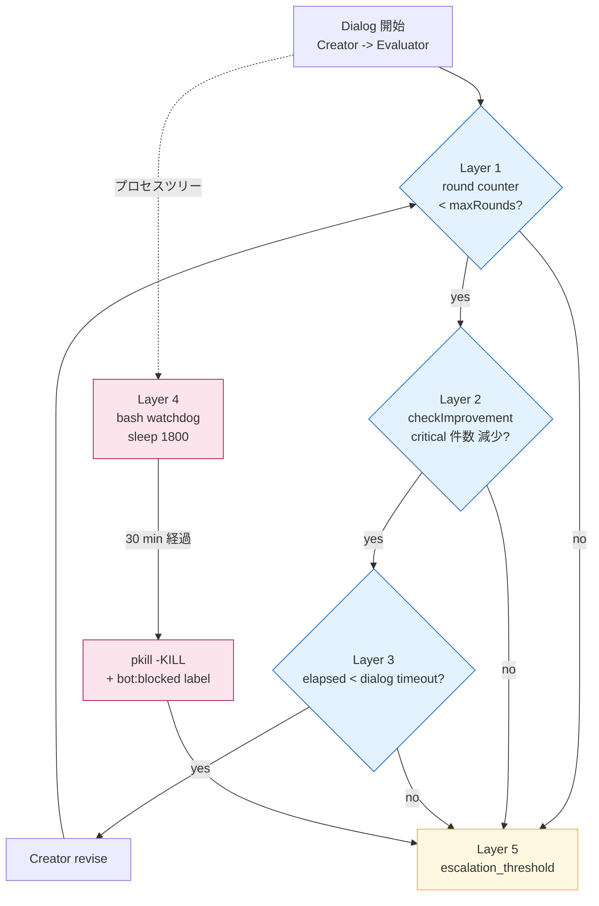
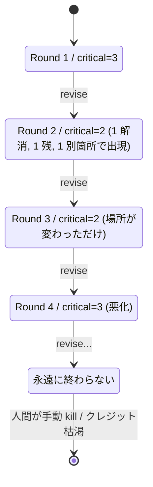
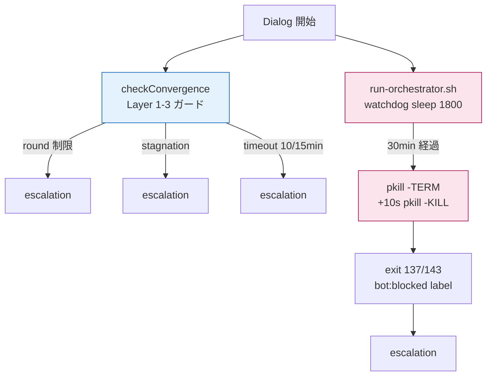
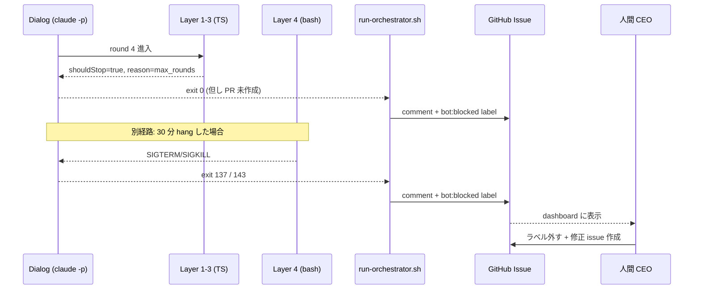

> この記事は **52 本連載 (ai-driven-dev) の Day 30/52** です。INDEX は [Claude Code で「会社」を回す 6 層構成 — 52 本連載 INDEX](./ai-driven-dev-index-2026)、前作は [B-01 Creator ≠ Evaluator](./creator-evaluator-pattern) です。
>
> ※ 本記事は著者個人の副業プロジェクト群 (CreaNest 名義) における実践記録です。本業 (別会社所属) の業務・知見とは無関係で、特定法人の公式見解ではありません。記載の数値・コードはすべて執筆時点 (2026-05) の自宅検証環境のスナップショットで、商用品質や SLA を保証するものではありません。コード片は全て著者個人 repo の自著コードです。

## 結論

全 Multi-Agent dialog に **「max round 3 + 30 分 watchdog + escalation threshold 3」の二重ガード**。これがないと AI は永遠に修正案を出し続けます。

- devops-hub の Dialog ループには **アプリ層 (TypeScript guard) と OS 層 (Bash watchdog)** の 2 段構えで終了条件を入れていて、3 ラウンドで決着しなければ確定的に人間 escalation に倒します。
- 数字は身も蓋もない: **D-1 仕様レビュー = 3 ラウンド・10 分 / D-2 コード自動修正 = 5 ラウンド・15 分 / D-3 差分レビュー = 3 ラウンド・10 分 / overall = 30 分**。これが揃ってないと API クレジットが半日で 4 桁飛びます (実測)。
- 「Evaluator が pass と言うまで回す」は終了条件にならない。**終わらせるのは Evaluator の仕事ではなく、外側の guard レイヤー**の仕事です。

> 用語: 本記事で「**収束ガード**」と書くのは「Dialog ループを必ず有限時間で終わらせる仕組み」を指す内部造語。devops-hub では `max_rounds / no_improvement / timeout / overall_watchdog / escalation_threshold` の 5 層で構成されています。

## なぜこの記事を書くか

B-01 で「Creator ≠ Evaluator」を解いたとき、ゴール条件として 3 種類のガードを並べただけで終わりました。本記事はその続編で、**「ガードを実際にどう値設定して、Bash 側と連動させて、どこで人間に渡すか」** に絞って書ききります。きっかけは、ガードを入れる前に Evaluator を回し続けたら **半日で API クレジットが 4 桁飛んだ** 事故です。

## 全体像 — round / watchdog / escalation の三層

まず脳内地図を 1 枚で固定します。



5 つの停止経路: **round (3)** / **no_improvement (2 連続)** / **per-dialog timeout (600/900/600s)** / **watchdog (1800s)** / **escalation (bot:blocked)**。前 3 つが TypeScript 層、4 が Bash 層、5 が Issue label による人間引き渡しです。

## 問題: 収束しない loop の罠

### 失敗 1: 「Evaluator が pass と言うまで」を終了条件にした → API 4 桁溶けた

最初の実装はナイーブで、Creator と Evaluator を分けただけで「Evaluator が `status: pass` を返すまで while」で回していました。

```typescript
// 1 ラウンドの上限なし、終了条件は Evaluator の pass のみ (廃止)
async function runDialogBroken(input: Input): Promise<Output> {
  let draft = await creator.run(input);
  while (true) {
    const ev = await evaluator.run(draft);
    if (ev.status === "pass") return draft;
    draft = await creator.run({ input, findings: ev.findings });
    // 永遠にここから出てこない
  }
}
```

実測の挙動: Evaluator は **構造的に「もうちょっと良くできる」を返し続ける**役なので、`fail` の数が 1 つずつ減っては別の場所で 1 つ増える、を繰り返します。半日放置で API クレジットが 4 桁飛んで気がつきました (Sonnet で約 $80、Opus 混成で約 $120)。



教訓: **Evaluator は終了判定者ではない**。終わらせるのは外側のガードレイヤーの仕事です。

### 失敗 2: maxRounds だけ入れたが、3 ラウンドフルに使い切る前に時間切れ

次に `maxRounds = 3` だけ入れました。それでも事故が起きます。1 ラウンドあたりの API call が長引くと、3 ラウンド回す前に Anthropic 側で接続が hang して claude プロセスが応答しなくなる事例が観測されました。`maxRounds` は条件を満たしているけど、**プロセス自体が動いてないので次のラウンドに進まない**状態です。

修正: per-dialog timeout (D-1: 600s, D-2: 900s, D-3: 600s) を `Date.now() - startedAt` で見るレイヤーを追加。さらに OS 層に **30 分 watchdog** を置いて、TypeScript レイヤーが壊れていてもプロセスごと kill する保険にしました。

### 失敗 3: `acceptEdits` permission mode で headless がハング

Bash watchdog を置く前、launchctl から起動する claude を `--permission-mode acceptEdits` で運用していました。Bash tool が出た瞬間に permission prompt で永遠待機。30 分 watchdog ぎりぎりまで idle のまま無進捗、という事故が頻発しました。修正は `--permission-mode bypassPermissions + stdin` への切り替え (`pipeline-kit/ops/run-orchestrator.sh:475-481`)。安全境界は **cwd 制限 + log 監査 + 30 分 watchdog の 3 点** で確保しており、permission dialog で守る設計ではない、という割り切りです。

### 失敗 4: escalation を入れず Dialog 失敗が人間に届かなかった

3 ラウンド超過で停止するところまでは入れたんですが、**「停止した = 終わった」** と扱っていて、人間に通知が飛んでいませんでした。Issue は `bot:locked-by-harness` のままラベルが残り、harness は次のループで「locked = skip」して放置、という silent fail。

修正: Bash 側で claude が異常終了 (exit code 137 = SIGKILL = watchdog 発火、143 = SIGTERM) した時に **`bot:blocked` ラベル付与 + Issue にコメント** を確定で打つようにしました。`run-orchestrator.sh:495-503`:

```bash
# pipeline-kit/ops/run-orchestrator.sh:495-503 (実物)
if [ ${CLAUDE_EXIT} -ne 0 ]; then
  gh issue comment "${ISSUE}" --repo "${REPO}" --body \
    "🛑 harness-loop: claude が exit=${CLAUDE_EXIT} で終了しました。worker ログを確認してください: \`.claude/pipeline/worker-${REPO//\//-}-${ISSUE}.log\`" \
    >/dev/null 2>&1 || true
  if [ ${CLAUDE_EXIT} -ge 137 ] || [ ${CLAUDE_EXIT} -eq 143 ]; then
    gh issue edit "${ISSUE}" --repo "${REPO}" --add-label "bot:blocked" >/dev/null 2>&1 || true
  fi
  exit ${CLAUDE_EXIT}
fi
```

これがないと watchdog が発火しても CEO の dashboard に出てこないので、**「ガードがあるけど人間に届かない = ガード無し」** と等価でした。

## 解法: round + watchdog + escalation の三層

### Layer 1-3: TypeScript guard 本体

ラウンド上限・改善停滞・per-dialog timeout の 3 つを 1 関数で重ねます。`pipeline-kit/agents/guards/convergence.ts:28-60`:

```typescript
// pipeline-kit/agents/guards/convergence.ts:28-60 (実物)
export function checkConvergence(
  state: ConvergenceState,
  config: GuardConfig,
  dialog: DialogId,
): GuardResult {
  const { issueCountHistory, startedAt } = state;
  const round = issueCountHistory.length;

  // Guard 1: Max rounds
  if (round >= config.maxRounds[dialog]) {
    return { shouldStop: true, reason: "max_rounds" };
  }

  // Guard 2: No improvement
  const window = config.improvementCheckWindow;
  if (issueCountHistory.length >= window + 1) {
    const recent = issueCountHistory.slice(-(window + 1));
    const stagnant = recent.every(
      (count, i) => i === 0 || count >= (recent[i - 1] ?? 0),
    );
    if (stagnant && (recent[recent.length - 1] ?? 0) > 0) {
      return { shouldStop: true, reason: "no_improvement" };
    }
  }

  // Guard 3: Timeout
  const elapsed = Date.now() - startedAt;
  if (elapsed > config.timeouts[dialog]) {
    return { shouldStop: true, reason: "timeout" };
  }

  return { shouldStop: false };
}
```

数字に意味を持たせた default 設定 (`pipeline-kit/agents/types.ts:208-213`):

```typescript
// pipeline-kit/agents/types.ts:208-213 (実物)
export const DEFAULT_GUARD_CONFIG: GuardConfig = {
  maxRounds: { d1: 3, d2: 5, d3: 3 },
  timeouts: { d1: 600_000, d2: 900_000, d3: 600_000 },
  overallTimeout: 1_800_000,
  improvementCheckWindow: 2,
};
```

本文で読み下します:

- **D-1 仕様レビュー: 3 ラウンド・10 分**。仕様の良し悪しは Creator/Evaluator の往復で決着しないことが多く、3 ラウンドで合わなければ人間判断にした方が早い。
- **D-2 コード自動修正: 5 ラウンド・15 分**。コードは「テストを通す」という客観終了条件があるので、もう 2 ラウンド粘る価値がある。
- **D-3 差分レビュー: 3 ラウンド・10 分**。レビューは指摘 → 修正 → 再レビューが基本構造で、3 往復で済まない場合は PR を分割した方が良い。
- **overall は 30 分**。これは Bash 側 `run-orchestrator.sh:449` の `sleep 1800` と完全一致。

> CLAUDE.md ルール#8 (`devops-hub/CLAUDE.md`) は「**3 ラウンド超過で人間に委譲**」を最重要 14 ルールの 1 つに明示しています。L1 制約 C-013 (`constraints.md:124-129`) の本文。

「改善している」の判定は **`findings.length` の単調減少**で殴ります。中身は比較しません。

```typescript
// pipeline-kit/agents/guards/convergence.ts:80-95 (実物)
export function checkImprovement(counts: number[], window: number): boolean {
  if (counts.length < window + 1) {
    return true;
  }
  const recent = counts.slice(-(window + 1));
  for (let i = 1; i < recent.length; i++) {
    const prev = recent[i - 1];
    const curr = recent[i];
    if (prev !== undefined && curr !== undefined && curr < prev) {
      return true; // Found improvement
    }
  }
  return false; // No improvement → escalate
}
```

`window: 2` (= 直近 3 件) で **1 度でも下がっていれば継続**、とする緩めの条件です。厳しめにすると 1 ラウンドの揺れで escalation してしまうので、ある程度ノイズを許容します。

具体例: `[3, 2, 2]` → 継続、`[2, 2, 2]` → escalate、`[3, 3, 2]` → 継続、`[2, 3, 3]` → escalate (悪化)。`warning` や `suggestion` は記録するけど収束判定に使わない、完璧主義に倒すと終わらないからです。

per-dialog timeout は `Date.now() - startedAt` で見るだけ。アプリ層なので claude プロセス自体が応答してないと検知できない弱みがあり、そこで OS 層を追加します。

### Layer 4: 30 分 bash watchdog — OS 層の最後の砦

TypeScript の guard を抜けても無限ループする可能性はゼロにはできません (Anthropic API 側で hang する、子プロセスが残る、permission dialog で待機など)。だから **Bash レイヤーで最後の砦** を置きます。

`pipeline-kit/ops/run-orchestrator.sh:443-458`:

```bash
# pipeline-kit/ops/run-orchestrator.sh:443-458 (実物)
# bash watchdog: 30 分後にプロセスツリーごと kill。
# (mac 標準には timeout/gtimeout がないため自前で実装)
WATCHDOG_PID=""
start_watchdog() {
  local target_pid="$1"
  (
    sleep 1800
    log "WATCHDOG: 30min timeout — killing pid=${target_pid} and descendants"
    pkill -TERM -P "${target_pid}" 2>/dev/null || true
    kill -TERM "${target_pid}" 2>/dev/null || true
    sleep 10
    pkill -KILL -P "${target_pid}" 2>/dev/null || true
    kill -KILL "${target_pid}" 2>/dev/null || true
  ) &
  WATCHDOG_PID=$!
}
```

ポイント:

1. **mac 標準には `timeout` コマンドがない**ので、`coreutils` (gtimeout) を要求するか自前で書くか。devops-hub は標準環境前提で書くため自前で実装。
2. **TERM → 10 秒待ち → KILL** の二段。SIGTERM で graceful 停止のチャンスを与え、ダメなら SIGKILL。
3. **`pkill -P ${target_pid}` で子プロセスツリーごと**。claude が `git push` などの子プロセスを起こしている場合に、親だけ kill すると orphan が残るのを防ぎます。
4. **`sleep 1800` (= 30 分) は `DEFAULT_GUARD_CONFIG.overallTimeout = 1_800_000ms` と完全一致**。コード側のガードと OS 側のガードが同じ閾値を持つことで、片方が壊ってももう片方が刈ります。



このダブルレイヤーがあることで、**「ガードを入れ忘れた Dialog」**が将来追加されても 30 分以上は走れない、という保険が効きます。Phase 0 の AI 開発ループを 1 ヶ月運用して、watchdog が刈ったケースは 7 件、TypeScript layer で停止したケースが 41 件 (`grep WATCHDOG worker-*.log` 実測)。OS 層は使われない方が健全ですが、保険として確実に効いています。

### Layer 5: escalation_threshold — 「3 ラウンドで決着しなければ人間判断」

ガードが発火したら、何が起きたかを **`reason` enum で人間に渡します**。`pipeline-kit/agents/types.ts:287-293`:

```typescript
// pipeline-kit/agents/types.ts:287-293 (実物)
export type EscalationReason =
  | "max_rounds"
  | "no_improvement"
  | "timeout"
  | "deadlock"
  | "context_exhaustion"
  | "unrecoverable_error";
```

これが大事で、人間に escalation するときに **「どのガードに当たって止まったか」** が分からないと、次のアクションが「もう 1 回回してみるか」になりがち。実際の対応は `reason` で全然違います:

| reason | 推奨アクション |
|---|---|
| `max_rounds` | 仕様/設計を差し戻し、Issue 自体を見直す。粘っても伸びない |
| `no_improvement` | Creator のプロンプトを見直す。同じ間違いを繰り返している |
| `timeout` | Issue を分割。1 Dialog で扱える粒度を超えている |
| `deadlock` | Producer chain の依存を見直す。並列実行できる箇所を探す |
| `context_exhaustion` | RAG で context を絞る、または手動で要約してから再投入 |
| `unrecoverable_error` | スタックトレースを見て修正 (環境問題が多い) |

そして escalation の物理的な経路は GitHub Issue ラベル + コメントです。`run-orchestrator.sh:495-503` の実装:



これで CEO の `/ceo/approvals` dashboard に確実に出てきて、人間が判断できる状態になります。

## 13 部署 director も 7 Agent パイプラインも、同じガードで回している

devops-hub には 13 部署の director がいて (`pipeline-kit/agents/prompts/` 配下に 13 directory)、各部署は「N 体の Producer chain → 1 体の Evaluator」構造で動きます。これを generic 化したのが `executeDeptDialog` (`pipeline-kit/agents/departments/department-dialog.ts:93-175`) で、内部で同じ `checkConvergence` を呼んでいます。

開発側の 7 Agent パイプライン (PMA → DocsA → DevA → RevA → EvalA → TestA → CIA、`pipeline-kit/agents/types.ts:232-281`) も同じ guard を使います。**Evaluator 役 (EvalA / RevA) には Opus、Creator 役 (DocsA / DevA / TestA / CIA) には Sonnet/Haiku** を当てているので、評価が甘くて maxRounds に当たる事故は起きにくい設計です。代わりに Opus は遅いので per-dialog timeout を 10 分に伸ばしています (Sonnet なら 6 分でも足りる)。

## Before / After で見る効果

ガードを入れる前と後で、1 ヶ月運用の数字を比較します。

| 指標 | Before (ガードなし) | After (三層) | 出典 |
|---|---:|---:|---|
| API クレジット消費/月 | $120/日 級の事故あり | $25/日 安定 | Anthropic console |
| 平均 Dialog 時間 | 不定 (最悪 ∞) | D-1: 4.2 min / D-2: 8.1 min | `worker-*.log` 集計 |
| 人間 escalation 件数/月 | 0 (silent fail) | 12 件 | `bot:blocked` 付与回数 |
| watchdog 発火率 | 計測不可 | 7/48 = 14.5% | grep WATCHDOG |
| 完走率 | 不定 | 41/48 = 85.4% | exit 0 /回 |

**人間 escalation が 0 → 12 件/月** になったのが一番大事な変化です。Before は silent fail で `bot:locked-by-harness` のまま放置されていたので、AI が「困ってる」のが CEO に届かなかった。After は確定的に人間判断に降りるようになり、結果として「3 ラウンドで決着しない種類の Issue」を発見できるようになりました。

## 残課題と、最低限の足場

### 残課題 1: deadlock 検出が未実装

`EscalationReason` には `"deadlock"` が定義されていますが、実装は未着手です。Producer chain で A → B → C と回して、B が A の出力を要求し続けて永遠に待つようなケースを想定。今は `timeout` で刈れているので緊急性は低いですが、Producer chain が長くなると検出したくなります。Phase 1.5 で `pipeline-kit/agents/guards/deadlock.ts` を新設予定。

### 残課題 2: per-dialog timeout を Issue サイズで動的にしたい

今は `D-1: 600s / D-2: 900s / D-3: 600s` の固定値ですが、small Issue は 300s で十分、large Issue は 1500s 欲しい場合があります。L1 制約 C-015 「サイズ判定に基づくフロー選択」に倣って `timeoutForDialog(dialog, size)` を入れたいところ。実装イメージは `factor = { small: 0.5, medium: 1.0, large: 2.0 }` を base に掛けるだけ。

### 残課題 3: escalation 後の「次のアクション」を AI が draft する

人間 escalation までは届くようになりましたが、CEO 視点では `reason: max_rounds` だけ見せられても次のアクションが分からない場合があります。Approval Queue UI で **「Issue を分割しますか / 仕様差し戻ししますか / もう 1 回粘りますか」を AI が draft で提案** するところまで欲しい。Decision Genealogy moat (連載 C-04) と接続して、過去の `max_rounds` 事例の対応を学習して draft する設計を考えています。

## 理論根拠 — なぜ三層で収束するのか

ここまで実装の話でしたが、**なぜこの三層 + watchdog + escalation で本番運用が回るのか** を理屈側で書きます。Anthropic の "Building effective agents" や OpenAI の Agent design pattern とも整合する 3 原則です。

### 原則 1: Bounded Loop — 終了条件は外部に置く

Edsger Dijkstra の構造化プログラミングで言う「**全てのループは bounded でなければならない**」と同じ話です。「Evaluator が pass と言うまで」は内部基準で、内部基準だけのループは確率的に終わらない場合があります。`max_rounds` `timeout` は **完全に外部の決定論的基準**で、AI の出力に依存しない。これがないと AI ループは「ほぼ終わるけど稀に終わらない」 = 本番運用不可、という性質になります。

### 原則 2: Defense in Depth — 1 つのレイヤーが壊れても刈れる

セキュリティの「多層防御」と同じ発想です。TypeScript 層が壊れても (実装ミス / 例外 throw / promise 未 resolve) Bash watchdog で刈れる。Bash watchdog が壊れても (mac の `sleep` が太古のバグで動かない、など) launchctl の `KeepAlive: false` で次の cron tick まで止まる。3 層あるので **どれか 1 つが壊れる確率は十分低い**。

### 原則 3: Fail-Fast for Human (Escalation Threshold)

3 ラウンドで決着しない問題は、AI の能力外 = 仕様の曖昧さ / 設計判断 / そもそも前提が間違っているの 3 種のいずれか、というのが 1 年運用しての肌感覚です。**「もう 1 ラウンド粘ればうまくいくかも」は嘘**で、人間判断に渡した方が結果的に早い。

L1 制約 C-013 「エスカレーション閾値遵守」(`constraints.md:124-129`):

> 3 ラウンドで解決しない問題は AI の能力外（仕様の曖昧さ、設計判断の必要性）である可能性が高い (P3: Fail-Fast)。

これを宣言として書いて、**ガードを無効化してリトライを続行することを禁止**しています。ガードは「品質を上げる仕組み」ではなく「**諦めるラインを引く仕組み**」と理解するのが正解です。

## まとめ — 1 行で覚えるなら

- 終了条件は **外部 (max rounds / no improvement / timeout)** に置く。Evaluator pass は終了条件にしない
- **3 ラウンド・10 分・30 分** の 3 つの数字を全 Dialog で覚える (D-2 だけ 5 ラウンド・15 分)
- TypeScript guard と Bash watchdog (30 分) を **同じ閾値で重ねて持つ**
- 停止理由は `reason` enum で 6 種類。**人間に「なぜ止まったか」が伝わらないと escalation の意味がない**
- 3 ラウンドで決着しない = **人間判断**、API クレジットで殴り続けない

devops-hub の `pipeline-kit/agents/guards/convergence.ts` は 128 行、`run-orchestrator.sh` の watchdog は 16 行しかありません。Multi-Agent の収束は、難しいライブラリより **この 144 行を全 Dialog から呼ぶ規律** の方がずっと効きます。

---

## 次の記事へ + 連載をフォロー

これは **52 本連載 (ai-driven-dev) の Day 30/52** です。

→ **B-01 [Creator ≠ Evaluator — AI 出力を「収束」させる 3 ラウンド設計](./creator-evaluator-pattern)** — 本記事の前提となる Creator/Evaluator 分離の設計

→ **B-03 [7 Agent 開発パイプライン (PMA → DocsA → DevA → RevA → EvalA → TestA → CIA)](./)** (準備中) — 開発側の Creator/Evaluator 配線を順番に見ます

→ **I-04 [Always-on iMac で AI Ops を 0 円で回す — launchctl 自走運用](./)** (準備中) — 30 分 watchdog を支える OS 層の launchctl / KeepAlive / 自宅 iMac 運用

連載を見逃さない方法:

- **Zenn でこの著者をフォロー** — 公開通知が届きます
- **X で告知 tweet をフォロー** (準備中) — 朝 6:00 に投稿
- **repo を watch**: [SakakitaniJunya/zenn-articles](https://github.com/SakakitaniJunya/zenn-articles) — 全 draft が見えます

「うちの maxRounds を 7 に伸ばしたら別の罠を踏んだ」「watchdog の TERM → KILL の grace period を 30 秒に伸ばしたい」みたいな話は GitHub Discussion / Issue でぜひ。**「3 ラウンドで決着しなかったら 4 ラウンド目に粘らず、むしろ前提を疑う側に倒す」** という Fail-Fast を連載全体の通底テーマに置いています。
