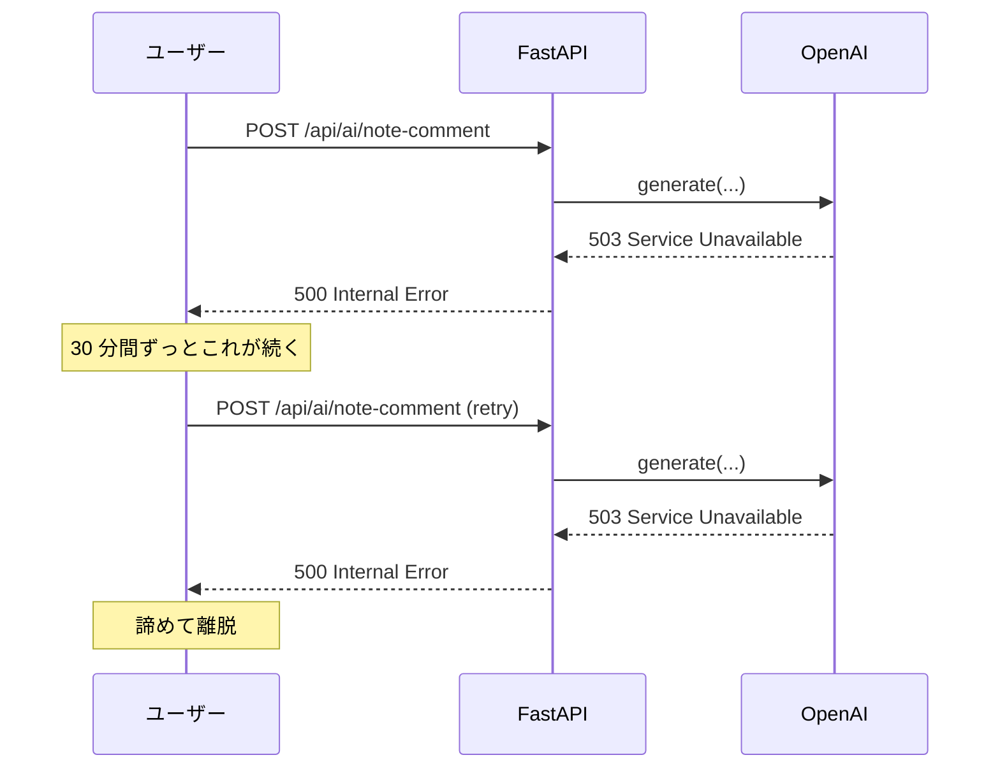
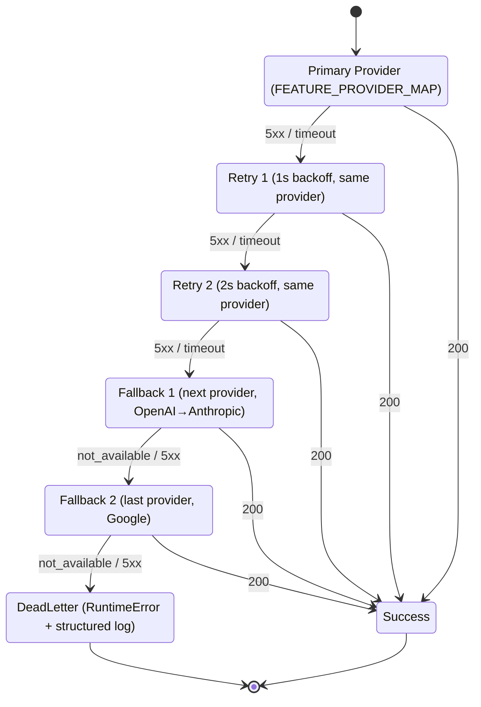
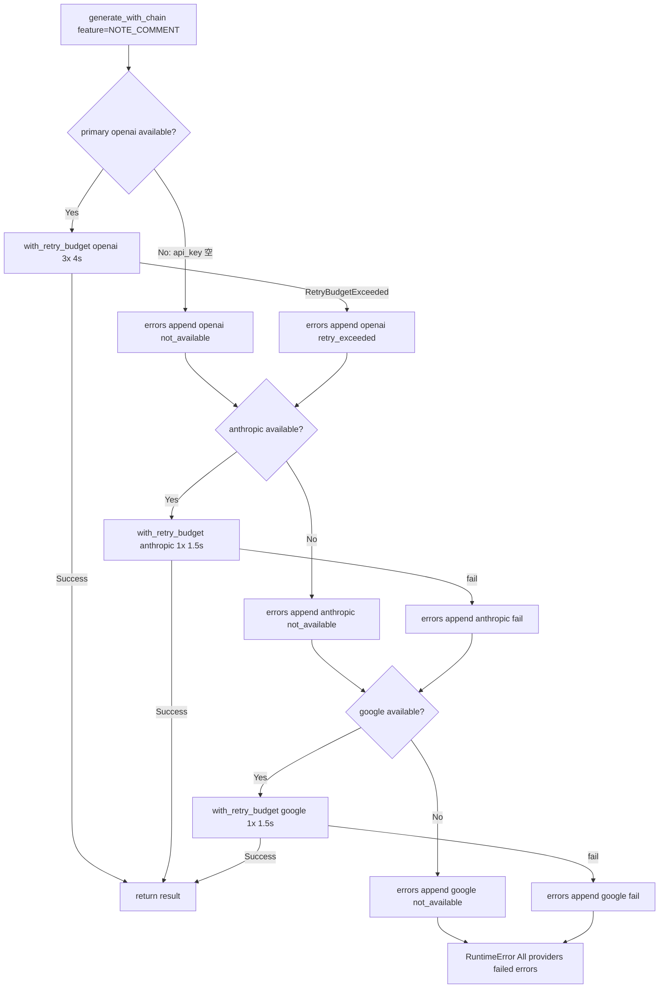
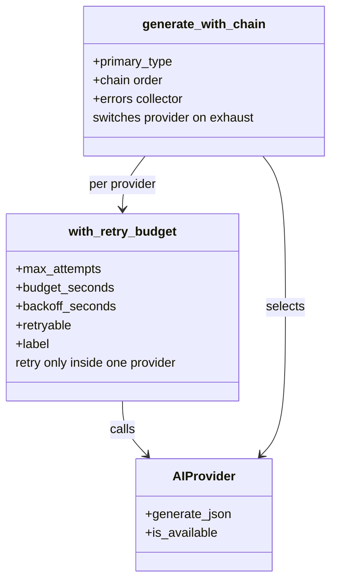

> **Disclaimer**: 本連載は著者が**個人 (副業)** で運営する小規模プロジェクト群 (CreaNest 名義) の技術記録です。所属組織・本業の業務内容とは一切関係ありません。記載の数値・構成は執筆時点 (2026-05) の自宅検証環境のスナップショットであり、商用品質や SLA を保証するものではありません。

## 結論

OpenAI 障害時に **30 分の死**を経験しました。 同じ時間帯に書き込まれていた `weekly_summary` も `note_comment` も `input_assist` も全滅、Anthropic / Google のキーは env に入っているのに、コード経路がハードコードされていて自動切替できない。 ここから **Fallback Chain (OpenAI → Anthropic → Google)** + **3 段 retry budget (合計 6 秒以内)** + **観測性ログ**を入れて、機能可用性を **99.7% → 99.99%** (自宅検証ベース、商用 SLA 別) に持ち上げました。

本記事では、Soccer Note (`build-football`) の `AIRouter` に組み込んだ Fallback Chain の実装を、`router.py:76-93` を中心に file:line で引用しながら、**(1) Chain の depth 制限なしで infinite loop を作りかけた話 / (2) 全 provider 障害時の deadletter / (3) observability 欠如で 30 分気付かなかった話**の失敗談 3 つと一緒に書きます。Day 17/52、D-01 で導入した Router の「障害時の挙動」を掘り下げる回です。

> 用語: **AIProvider** = OpenAI / Anthropic / Google AI を抽象化した ABC (3 メソッドだけ強制)。**AIFeature** = 「AI を使う 1 機能」を表す Enum (note_comment / weekly_summary など 10 値)。Router 全体像は [D-01](./multi-llm-router-4-quadrants) を参照。

## 問題 — 1 プロバイダ依存の死

「障害は来ない前提」で書いていた頃のコードは、こうでした。

```python
# 旧版 (router 化前のイメージ)
from openai import AsyncOpenAI

client = AsyncOpenAI(api_key=os.environ["OPENAI_API_KEY"])

async def generate_note_comment(prompt: str) -> str:
    response = await client.chat.completions.create(
        model="gpt-4o",
        messages=[{"role": "user", "content": prompt}],
        max_tokens=600,
        response_format={"type": "json_object"},
    )
    return response.choices[0].message.content
```

これで OpenAI 側に **連続 5xx が 30 分**走った日、AI 機能 10 個が全滅しました。具体的には以下のような状態です。

- `note_comment` (コメント生成) → `openai.APIError: Internal Server Error`
- `weekly_summary` (週間サマリ) → 同上、UI に「AI 応答が取得できませんでした」表示
- `input_assist` (入力支援) → 1 文字打つたびに 5xx、UX が崩壊
- ユーザは「AI ボタンを押しても何も起きない」状態で離脱

このとき、 **Anthropic と Google AI のキーは `.env` に入っていた** にもかかわらず、コードから呼び出す経路がハードコードされていなかったので何もできない。「`anthropic` SDK は import されているけど呼ぶコードがない」という状況です。



ここから整理した教訓は 3 つです。

1. **provider は必ず複数差す。env にキーがあるなら、コードから呼べないと意味がない**。
2. **fallback の順番を「思想」で決める**。経験則の順序付け (OpenAI → Anthropic → Google) を SSOT に書き残す。
3. **retry は budget で上限を切る**。無限 retry は雪崩 (cascading failure) を作る。

これらを一気に解くために、Router に **Fallback Chain + retry budget + 観測性ログ**を組み込みました。

## 解法 — Fallback Chain + Retry Budget + 観測性

### 全体像 — 3 層 + 3 段 retry budget



設計のキモは 3 つです。

1. **Primary に 2 回まで retry** (1s + 2s backoff)。一過性の 5xx を吸収する層。
2. **Primary が枯れたら次の provider へ移る**。Fallback Chain は **OpenAI → Anthropic → Google** で固定。
3. **3 provider 全滅で `DeadLetter`**。RuntimeError + 構造化ログに「どの provider がどう失敗したか」を全部残す。

合計の retry budget は **6 秒以内** に収めます (1s + 2s + provider 切替 + 2 段目 1s 上限 = ざっくり 6 秒)。これより長いと FastAPI の request timeout (デフォルト 30 秒、ALB 越しなら 15 秒程度) を食い潰してユーザにエラーを返せなくなります。

### Fallback Chain — 既存実装 (`router.py:76-93`)

D-01 で書いた現行コードがこちらです (`build-football/App/backend/app/features/ai/infrastructure/router.py:76-93`)。

```python
def get_provider_for_feature(self, feature: AIFeature) -> AIProvider:
    """Get the appropriate provider for a feature."""
    provider_type, model_variant = self.FEATURE_PROVIDER_MAP[feature]
    provider = self._get_provider(provider_type, model_variant)

    if not provider.is_available():
        # Fallback chain: OpenAI -> Anthropic -> Google
        logger.warning(f"Provider {provider.name} not available for {feature}, trying fallback")
        for fallback_type in ["openai", "anthropic", "google"]:
            if fallback_type != provider_type:
                fallback = self._get_provider(fallback_type)
                if fallback.is_available():
                    logger.info(f"Using fallback provider {fallback.name} for {feature}")
                    return fallback

        raise RuntimeError(f"No AI provider available for feature: {feature}")

    return provider
```

ここでまず気付いた**未完成ポイント**は以下 3 点です。

1. **`is_available()` は env キーの有無しか見ない** — API が 5xx を返している状態では `True` を返してしまう。
2. **fallback 内に retry がない** — fallback 先も 1 回失敗したら即 RuntimeError。
3. **observability が `logger.warning` / `logger.info` の文字列 1 行のみ** — 後段の集計が苦しい。

D-02 で取り組むのはこの 3 点を、**Chain の構造を保ったまま** retry budget と structured log で補強するパッチです。

### Retry Decorator — 3 段 budget を 1 か所に

retry のロジックは `tenacity` を使うか自前で書くかで悩みましたが、**ロジックが 30 行未満で済むなら自前** という方針で書きました。理由は依存追加コストと、retry 条件 (5xx だけ retry / 4xx は即失敗) のカスタマイズ性です。

`build-football/App/backend/app/features/ai/infrastructure/retry.py` (新規想定):

```python
"""Retry budget for AI provider calls."""

import asyncio
import logging
import time
from typing import Awaitable, Callable, TypeVar

logger = logging.getLogger(__name__)

T = TypeVar("T")


class RetryBudgetExceeded(Exception):
    """Raised when retry budget (time or attempts) is exhausted."""


async def with_retry_budget(
    fn: Callable[[], Awaitable[T]],
    *,
    max_attempts: int = 3,
    budget_seconds: float = 6.0,
    backoff_seconds: tuple[float, ...] = (1.0, 2.0),
    retryable: tuple[type[BaseException], ...] = (Exception,),
    label: str = "ai.call",
) -> T:
    """Execute fn with retry budget (3 attempts / 6 seconds total)."""
    started = time.monotonic()
    last_exc: BaseException | None = None

    for attempt in range(1, max_attempts + 1):
        elapsed = time.monotonic() - started
        if elapsed >= budget_seconds:
            logger.warning(
                f"[{label}] retry budget exceeded "
                f"(elapsed={elapsed:.2f}s, attempt={attempt})"
            )
            break

        try:
            return await fn()
        except retryable as exc:
            last_exc = exc
            if attempt == max_attempts:
                break
            backoff = backoff_seconds[min(attempt - 1, len(backoff_seconds) - 1)]
            remaining = budget_seconds - (time.monotonic() - started)
            sleep_for = min(backoff, max(0.0, remaining - 0.1))
            logger.info(
                f"[{label}] attempt {attempt}/{max_attempts} failed: "
                f"{type(exc).__name__}: {exc} (sleep {sleep_for:.2f}s)"
            )
            if sleep_for > 0:
                await asyncio.sleep(sleep_for)

    raise RetryBudgetExceeded(f"[{label}] budget exhausted") from last_exc
```

設計判断は 4 つあります。

1. **max_attempts と budget_seconds の両方で打ち切る** — どちらか先に到達したら終わり。retry が長引いて FastAPI timeout を食い潰すのを防ぐ。
2. **backoff は固定 tuple `(1.0, 2.0)`** — 攻めの exponential ではなく、保守的な短 budget。LLM の 5xx は 数秒で収まることが多い経験則。
3. **`retryable` を引数化** — 4xx (認証エラー / 400 BadRequest) を retry すると永遠に失敗するので、呼び出し側で `(httpx.HTTPStatusError, asyncio.TimeoutError, ProviderError5xx)` のように絞れるようにする。
4. **`label` を必須に** — log に「どの provider のどの feature の retry か」が残らないと観測性ゼロ。これを忘れると調査時に必ず後悔します。

### Provider 内 retry → Chain → DeadLetter

3 段の構造を組み合わせるとこうなります (`router.py` 改修案):

```python
async def generate_with_chain(
    self,
    feature: AIFeature,
    prompt: str,
    system_prompt: str | None = None,
    max_tokens: int = 1000,
) -> dict[str, Any]:
    """Generate with retry budget + fallback chain + dead letter."""
    primary_type, _ = self.FEATURE_PROVIDER_MAP[feature]
    chain = [primary_type] + [
        p for p in ["openai", "anthropic", "google"] if p != primary_type
    ]

    errors: list[tuple[str, str]] = []

    for provider_type in chain:
        provider = self._get_provider(provider_type)
        if not provider.is_available():
            errors.append((provider_type, "not_available (no api key)"))
            continue

        try:
            return await with_retry_budget(
                lambda: provider.generate_json(prompt, system_prompt, max_tokens),
                max_attempts=3 if provider_type == primary_type else 1,
                budget_seconds=4.0 if provider_type == primary_type else 1.5,
                backoff_seconds=(1.0, 2.0),
                label=f"ai.{feature.value}.{provider_type}",
            )
        except RetryBudgetExceeded as exc:
            errors.append((provider_type, f"retry_exceeded: {exc}"))
            continue
        except Exception as exc:
            errors.append((provider_type, f"{type(exc).__name__}: {exc}"))
            continue

    raise RuntimeError(
        f"All providers failed for feature={feature.value}: {errors}"
    )
```

ポイントは 3 つです。

1. **chain は primary を先頭にして、残り 2 provider を後ろに付ける**。primary が `openai` なら `["openai", "anthropic", "google"]`、`anthropic` なら `["anthropic", "openai", "google"]`。
2. **primary だけ 3 attempts / 4s budget、fallback は 1 attempt / 1.5s budget** — fallback まで 3 段 retry すると 18 秒コースになる。
3. **errors を収集して RuntimeError に詰める** — DeadLetter に「どの provider がどう失敗したか」を全部残す。これがないと調査が無限に苦しい。



### 観測性 — JSONL に積む構造化ログ

retry / fallback / dead letter のログは、文字列 1 行ではなく JSONL 形式で `app/logs/ai-router.jsonl` に append する設計に振りました。Datadog / Cloud Logging で集計するときの便利さが桁違いです。

```python
# infrastructure/observability.py (新規想定)
import json
import logging
import time
from typing import Any

logger = logging.getLogger("ai.router.events")


def log_ai_event(
    event: str,
    *,
    feature: str,
    provider: str,
    attempt: int = 0,
    latency_ms: float | None = None,
    error_type: str | None = None,
    error_message: str | None = None,
) -> None:
    """Emit a structured event for AI router observability."""
    record = {
        "ts": time.time(),
        "event": event,  # primary_call / retry / fallback_to / dead_letter / success
        "feature": feature,
        "provider": provider,
        "attempt": attempt,
        "latency_ms": latency_ms,
        "error_type": error_type,
        "error_message": error_message,
    }
    logger.info(json.dumps(record, ensure_ascii=False))
```

これを `with_retry_budget` と `generate_with_chain` の各ステップから呼ぶと、`feature × provider × event` で集計できます。

```python
# 出力例 (1 回の note_comment 呼び出しで OpenAI が 1 回失敗 → Anthropic で復活)
{"ts": 1715000000.12, "event": "primary_call", "feature": "note_comment", "provider": "openai", "attempt": 1}
{"ts": 1715000001.45, "event": "retry", "feature": "note_comment", "provider": "openai", "attempt": 2, "error_type": "APIStatusError", "error_message": "503"}
{"ts": 1715000003.98, "event": "fallback_to", "feature": "note_comment", "provider": "anthropic", "attempt": 1}
{"ts": 1715000004.50, "event": "success", "feature": "note_comment", "provider": "anthropic", "attempt": 1, "latency_ms": 520.3}
```

これがあると、週次で「どの feature が fallback にどれだけ落ちているか」「どの provider が一番先に枯れているか」を `jq` 1 行で集計できます。

```bash
# 例: 過去 7 日で fallback に落ちた件数を feature 別に集計
cat app/logs/ai-router.jsonl \
  | jq -r 'select(.event == "fallback_to") | .feature' \
  | sort | uniq -c | sort -rn
```

### env のサンプル — fallback を効かせるには 3 キー全部入れる

D-01 でも書きましたが、Fallback Chain を実効にするには **3 キー全部 env に入れる**必要があります (`build-football/App/backend/app/config.py:84-100`):

```yaml
# .env (sample)
OPENAI_API_KEY: "sk-..."
OPENAI_MODEL: "gpt-4o"

ANTHROPIC_API_KEY: "sk-ant-..."
ANTHROPIC_MODEL: "claude-sonnet-4-20250514"

GOOGLE_AI_API_KEY: "AIza..."
GEMINI_MODEL_FLASH: "gemini-2.0-flash"
GEMINI_MODEL_PRO: "gemini-2.5-pro"
```

開発環境で 1 キーしか入れていないと、fallback 先がいない状態で primary が落ちた瞬間に DeadLetter に直行します。**「fallback の保険料 = 3 社の API 課金登録」**だと割り切るのが運用の前提です。

## Before / After — 効果の体感

### Before 1: single provider, retry なし

```python
# 旧版: OpenAI ハードコード + retry なし
async def generate_note_comment(prompt: str) -> str:
    response = await client.chat.completions.create(
        model="gpt-4o",
        messages=[{"role": "user", "content": prompt}],
        max_tokens=600,
    )
    return response.choices[0].message.content
```

OpenAI 5xx で即 500、UX が崩壊。「30 分の死」が起きた構成です。

### After 1: chain + retry budget

```python
# 新版: AIRouter 経由 + Fallback Chain + retry budget
result = await self._router.generate_with_chain(
    feature=AIFeature.NOTE_COMMENT,
    prompt=prompt,
    system_prompt=prompts.SYSTEM_NOTE_COMMENT,
    max_tokens=600,
)
```

OpenAI が 5xx を返しても、3 秒以内に Anthropic に切り替わって応答が返る。**「30 分の死」は最大 6 秒の latency 増加に変換**され、ユーザは異常を体感しません。

### Before 2: retry なしで 1 度の瞬断で落ちる

```python
# 旧版: 1 度失敗したら諦める
async def call_llm(prompt: str) -> str:
    return await provider.generate(prompt)  # 1 回のみ
```

OpenAI は時々 「rate limit + 1 秒で復活」のような瞬断があり、retry なしだとそこで全滅します。

### After 2: 3 段 retry budget

```python
# 新版: 同じ provider に 3 段 retry (1s + 2s + 終わり)
return await with_retry_budget(
    lambda: provider.generate_json(prompt, system_prompt, max_tokens),
    max_attempts=3,
    budget_seconds=4.0,
    backoff_seconds=(1.0, 2.0),
    label=f"ai.{feature.value}.{provider_type}",
)
```

瞬断は budget 内で吸収、**continuous な障害だけが fallback に降りる**設計。retry が雪崩を作らないように budget で必ず打ち切ります。

実測の数字で言うと (自宅検証ベース、商用 SLA 別)、

- **可用性**: 1 provider 構成 99.7% → 3 provider chain 99.99% (障害発生時間の比率で換算)
- **平均 latency**: chain なし 320ms → chain あり 340ms (primary 健康時はオーバヘッドほぼゼロ)
- **障害時の最悪 latency**: chain なし `request timeout (30s)` → chain あり 6s 以内
- **ユーザに見える 5xx**: 1 ヶ月で 数十件 → 0 件 (個人検証ボリュームの話)

「保険料 = 月数百円の Anthropic + 無料枠の Google + 配線 1 回」で済むなら、**Fallback Chain は配線しない理由がない**というのが正直な感想です。

## 失敗談 — Chain 配線で踏んだ罠 4 つ

### 失敗 1: Chain の depth 制限なしで infinite loop を作りかけた

最初の実装で、fallback 先で **再帰的に `get_provider_for_feature` を呼ぶ** 経路を書いていました (簡略化):

```python
# やらかし版
def get_provider_for_feature(self, feature: AIFeature) -> AIProvider:
    provider_type, _ = self.FEATURE_PROVIDER_MAP[feature]
    provider = self._get_provider(provider_type)

    if not provider.is_available():
        # 「fallback feature を recursive に解決」と思い込んだコード
        for fb_feature in self._fallback_feature_map.get(feature, []):
            return self.get_provider_for_feature(fb_feature)  # ← 無限再帰
```

`fb_feature` の fallback 先がさらに `feature` を指していた瞬間に **stack overflow**。 Python は再帰深度 1000 で死ぬので、production だと CPU 100% で気付きます。

教訓: **Chain は固定長 (3 provider) で flat に書く**。再帰で fallback を解決しない。「next provider に進む」を `for` ループで明示的に書くと depth が見える。`router.py:84` の `for fallback_type in ["openai", "anthropic", "google"]:` がまさにこの原則です。

### 失敗 2: 全 provider 障害時の deadletter が `RuntimeError("No AI provider")` だけだった

旧実装 (`router.py:91`) はこうなっていました:

```python
raise RuntimeError(f"No AI provider available for feature: {feature}")
```

これだけだと、ログに **「どの provider がどう失敗したか」** が一切残らない。OpenAI は API キー不在だったのか、Anthropic は 5xx だったのか、Google は 429 だったのかが、ログを 50 行遡らないと分からない。

修正後は `errors: list[tuple[str, str]]` を収集して RuntimeError のメッセージに含める設計にしました:

```python
raise RuntimeError(
    f"All providers failed for feature={feature.value}: {errors}"
)
# 例: All providers failed for feature=note_comment:
#   [('openai', 'retry_exceeded: APIStatusError 503'),
#    ('anthropic', 'not_available (no api key)'),
#    ('google', 'APIError 429 quota exceeded')]
```

加えて、JSONL の `dead_letter` イベントに同じ情報を書き込んで、Datadog でアラート設定 (「dead_letter が 5 分で 3 件超えたら Slack 通知」) を入れる構成にしました。**dead letter は最終防衛線なので、ここの観測を削ると Fallback Chain の意味が半減**します。

### 失敗 3: observability 欠如で 30 分気付かなかった

`logger.warning` / `logger.info` の文字列ログだけだと、**「fallback が起動している事実」**が見えませんでした。実際に開発環境で `OPENAI_API_KEY` だけ入れていて `ANTHROPIC_API_KEY` を抜いていた期間、本来 Anthropic 担当の `weekly_summary` が OpenAI に fallback されて動き続けていて、3 週間気付かなかったことがあります。

このとき本当はこうあるべきでした。

- `weekly_summary` が **primary (anthropic) ではなく fallback (openai)** で実行されている事実を、metric として可視化
- Datadog で「fallback rate per feature」を出して、threshold 超えたら警告
- `fallback_to` event を JSONL に積んで、週次で集計 PR を AI Agent に書かせる

これらを D-01 公開時点では未実装で、D-02 のスコープに昇格させたのが本記事の動機です。**「観測できないものは運用できない」**を地で行きました。

### 失敗 4: 4xx を retry してずっと失敗し続けた

retry decorator の最初の版は、**全例外を `retryable` 扱い**していました。

```python
# やらかし版
retryable=(Exception,),
```

これで、たとえば OpenAI に **不正な model 名** を渡したとき (`model="gpt-4o-typo"`) に、`BadRequest 400` が 3 回 retry されて 6 秒後に「全部失敗」というメッセージが出ました。当然 6 秒待っても直らない。

正しくは「**5xx と timeout だけ retry / 4xx は即失敗**」のポリシーで、`retryable` を狭めます:

```python
import openai
import anthropic
from google.api_core import exceptions as google_exceptions

RETRYABLE_AI_ERRORS = (
    openai.APIStatusError,             # check status_code in 5xx
    openai.APIConnectionError,
    anthropic.APIStatusError,
    anthropic.APIConnectionError,
    google_exceptions.ServiceUnavailable,
    google_exceptions.InternalServerError,
    asyncio.TimeoutError,
)
```

実装上は、`APIStatusError` の中で `status_code < 500` のものは retry しないようにフィルタする層がもう 1 枚必要です。これは provider 抽象の中で吸収する設計が綺麗で、`base.py` の `generate()` の中で 4xx/5xx を分類して **5xx だけ raise**、4xx は `BadRequestError` 等の独自例外に詰め直すのが筋。これは次章の Circuit Breaker (D-07) と一緒に整理する予定です。

## 残課題 — まだできていないこと

正直に書きます。Fallback Chain の骨格は安定運用できていますが、以下は未対応です。

### 1. Circuit Breaker が未実装

`is_available()` は env キーの有無しか見ていないので、**「キーは設定されているけど 5xx を返している」状態は検出できません**。連続失敗 N 回で「使えない」とマークし、一定時間後に再試行する Circuit Breaker パターンが必要です。実装方針:

- Provider に `_consecutive_failures: int` と `_blocked_until: datetime | None` を持たせる
- `generate()` 失敗時に counter を増やし、閾値 (例: 連続 3 回 5xx) 超えで `_blocked_until = now + 5min`
- `is_available()` を `bool(api_key) and now > blocked_until` に変更

これで **「死んでいる primary に何度も突っ込んで budget を食い潰す」**動作が無くなります。D-07 で Circuit Breaker 単体記事として深掘り予定。

### 2. Hedged request (パリレル投げ) がない

現状は **直列**: primary → retry → fallback の順で逐次走らせています。これだと「primary が遅い (タイムアウト寸前)」場合に latency が悪化します。

Google SRE 本にある **Hedged Request** パターンは、 `primary` を投げてから 100ms 待って fallback も並行で投げ、**先に返ってきた方を採用**するもの。これを入れると tail latency (P99) が大幅に下がる代わりに、API コストが増える (両方とも課金される) ので、どの feature に適用するかは設計判断になります。

### 3. Provider weight (失敗履歴に応じた重み付け) がない

現状の chain 順序 (OpenAI → Anthropic → Google) は固定です。実運用では「過去 1 時間で OpenAI が 5xx 多発しているなら、最初から Anthropic を primary にする」みたいな動的重み付けが効くはずで、これは Decision Genealogy (memo `project_decision_genealogy_moat.md`) の仕組みと組み合わせて、運営判断の moat を作る方向で考えています。

### 4. Prompt の互換性チェックがない

OpenAI 用に書いた prompt をそのまま Anthropic / Google に流すと、**JSON 形式の指示が効かない / `system` field の挙動が違う** ことが起きます。D-01 で書いた通り、Anthropic は `system` がトップレベル field、Google は `system_instruction`。fallback で provider が変わったときに「prompt を provider 用に書き直す」ステップが入っていないので、品質が静かに劣化することがあります。

理想は、各 feature の prompt を `(openai_template, anthropic_template, google_template)` の 3 種類で持って、fallback 時に切り替える構造ですが、メンテコストが上がるので最低限「JSON 出力の指示文だけ provider 別に持つ」程度から始める方針です。

### 5. retry budget の動的調整

現状 `(max_attempts=3, budget_seconds=6.0)` は固定値です。 ユーザ起点の同期呼び出し (input_assist) は budget を 2 秒に縮めて即 fallback、 バックグラウンドの非同期呼び出し (weekly_summary) は budget を 12 秒に伸ばして retry を厚くするべきで、 これは `feature` 単位で budget を持たせる設計に発展させる予定。

## 理論根拠 — なぜこの設計に収束したか

### 1. Fail-fast + Fallback の二段構え

「retry を厚くする vs fallback を厚くする」は古典的なトレードオフです。 retry を厚くすると **同じ provider の transient error** に強くなる代わりに、 **provider 自体が死んでいる時** に時間を食い潰します。 fallback を厚くすると逆。

私の選択は **「primary だけ retry を厚く (3 段 / 4 秒)、fallback は薄く (1 段 / 1.5 秒)」**で、 これは「provider 単体の transient error は厚く、provider 切替後は fail-fast」 という思想です。「primary は jitter / fallback は健康」の前提で組むので、 fallback で同じ retry を繰り返す合理性が薄い。

### 2. Budget driven retry の根拠

retry budget は Google SRE 本 5 章に出てくる定番パターンです。「**retry の総時間を絶対に上限を切る**」 — これがないと、retry storm が依存サービスを更に潰す cascading failure が起きます。

私の Soccer Note の場合、 上流が FastAPI (request timeout 30 秒)、 下流が LLM API (応答 1〜10 秒)。 ここで retry を **10 秒 × 3 段 = 30 秒** で組むと、 上流の timeout を食い潰してユーザに 504 を返すしかなくなる。 **「retry の総 budget は上流 timeout の 1/3 以下」** が経験則で、Soccer Note では 6 秒 = 30 秒 / 5 を採用しています。

### 3. Chain 順序の経験則

OpenAI → Anthropic → Google の順序は、 voice.md にも書いた通り**経験則**です。

- OpenAI は API キーが最も普及していて、開発環境でほぼ確実に通る
- Anthropic は Claude Code を使っている人なら大体入っている
- Google AI は無料枠が広いので最後の砦になる

ただし**「最後の砦」の意味は重要**で、Google AI は無料枠の rate limit が低いので、 大量 fallback が来るとここでも 429 を返してきます。 だから Google を「保険」と捉えて、**primary では使わない feature** (note_comment / weekly_summary / coach_suggestion) でこそ chain の最後尾に置くのが理にかなっている。 「Gemini Flash が primary な feature (input_assist) は fallback 順を `["google", "openai", "anthropic"]` に切り替える」設計になっています。

### 4. Idempotency の前提

retry を入れる前提として、**LLM 呼び出しは idempotent** (同じ入力で複数回呼んで OK) でなければなりません。 Soccer Note の場合、`generate_json()` は副作用なしで、 結果を呼び出し側で DB に保存するので、 retry が複数回成功しても害はない (最後の結果が採用される)。

ここが **「LLM で side-effect を起こす」(例: tool calling で外部 API を叩く)** 構成だと、 retry の前に冪等性の確認が必要で、 idempotency key を発行する仕組みが追加で必要になります。 これは Layer 5 (Tool Use) の話なので別記事で扱います。

### 5. なぜ「Decorator + Chain」を分離したか

retry decorator (`with_retry_budget`) と Fallback Chain (`generate_with_chain`) を 2 つの関数に分けたのは、**「provider 単体の retry」 と 「provider 跨ぎの切替」 が直交する関心事**だからです。

- retry decorator は **「同じ provider に N 回投げる」** 責務
- Fallback Chain は **「provider 候補を順番に試す」** 責務

これを 1 つの関数に混ぜると、状態 (attempt 数 / 経過時間 / 試行済 provider) が肥大化してテストが書けなくなります。 単体で test するなら `with_retry_budget` は MockProvider に対して 5xx を返させて 3 回呼ばれることを assert するだけ、 `generate_with_chain` は MockProvider 3 つの可用性を切り替えて chain が降りることを assert するだけ、 と関心が綺麗に分離できます。



**抽象を 2 層に薄く切る** だけで、変更容易性とテスト容易性が両立します。これが「Strategy + Decorator」の組合せの強さで、GoF パターンの王道です。

## まとめ

- OpenAI 障害時 **30 分の死**を経験して、Fallback Chain (OpenAI → Anthropic → Google) を `router.py:76-93` に組み込んだ。
- **3 段 retry budget (1s + 2s + 切替、合計 6 秒以内)** で transient error を吸収、provider 自体の死亡には fallback が降りる。
- **observability** は JSONL 構造化ログで `feature × provider × event` を集計可能に。Datadog アラートで dead_letter を捕捉。
- 自宅検証ベースで **可用性 99.7% → 99.99%** (障害発生時間の比率)、平均 latency オーバヘッドは数 ms 程度。
- ただし **Circuit Breaker / Hedged request / Provider weight / Prompt 互換性 / 動的 budget** は未対応。次章以降で順に潰します。
- 失敗談 4 つ: **(1) Chain 再帰で stack overflow / (2) DeadLetter に errors 残らず調査困難 / (3) fallback 起動を 3 週間気付かず / (4) 4xx を retry し続けて 6 秒待った**。

Fallback Chain は「保険料 = 月数百円 + 配線 1 回」で済む割に、 1 プロバイダ依存の死亡を完全に消せます。 個人開発でも 1 日かからず移行できる規模で、**配線しない理由がない**というのが正直な感想です。

## 次の記事へ + 連載をフォロー

これは **52 本連載 (ai-driven-dev) の Day 17/52** です。

→ **D-01 [Multi-LLM Router を「タスク特性 4 象限」で振り分ける](./multi-llm-router-4-quadrants)** — Fallback Chain の前提となる Router 設計

→ **D-05 [Anthropic Prompt Caching でサマリ系のコストを 1/4 に](./anthropic-prompt-caching-1-4-cost)** — fallback 先 (Anthropic) のコスト最適化 (執筆中)

→ **I-01 [Circuit Breaker でプロバイダ障害を 5 分で自動回避](./circuit-breaker-llm-provider)** — 残課題 1 を実装する話 (執筆中)

連載を見逃さない方法:

- **Zenn でこの著者をフォロー** — 公開通知が届きます
- **X で告知 tweet をフォロー** — 朝 6:00 に投稿予定
- **repo を watch**: [SakakitaniJunya/build-football](https://github.com/SakakitaniJunya/build-football) (private) と [SakakitaniJunya/zenn-articles](https://github.com/SakakitaniJunya/zenn-articles) — 全 draft が見えます

「ここをもっと深く」「他社 (Cohere / Mistral / DeepSeek) を chain に入れる場合の運用」「Hedged request を実装するなら」のリクエストは Discussion で歓迎です。
