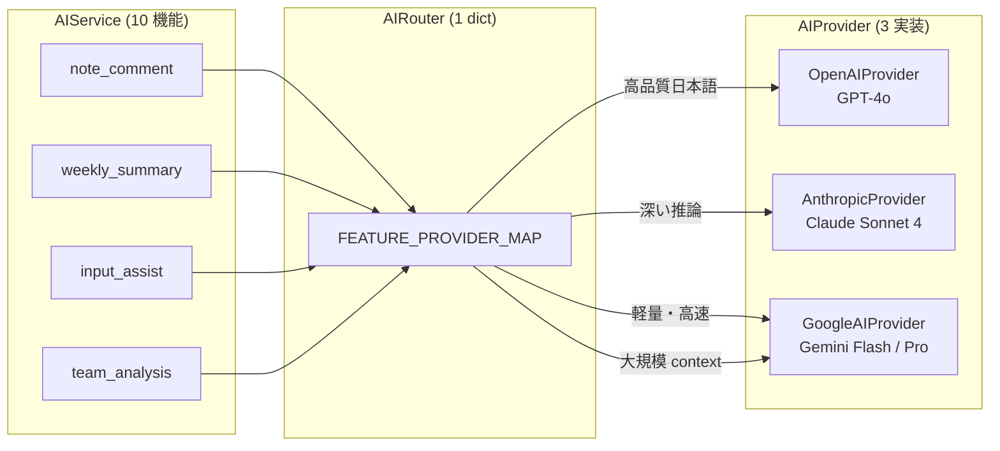
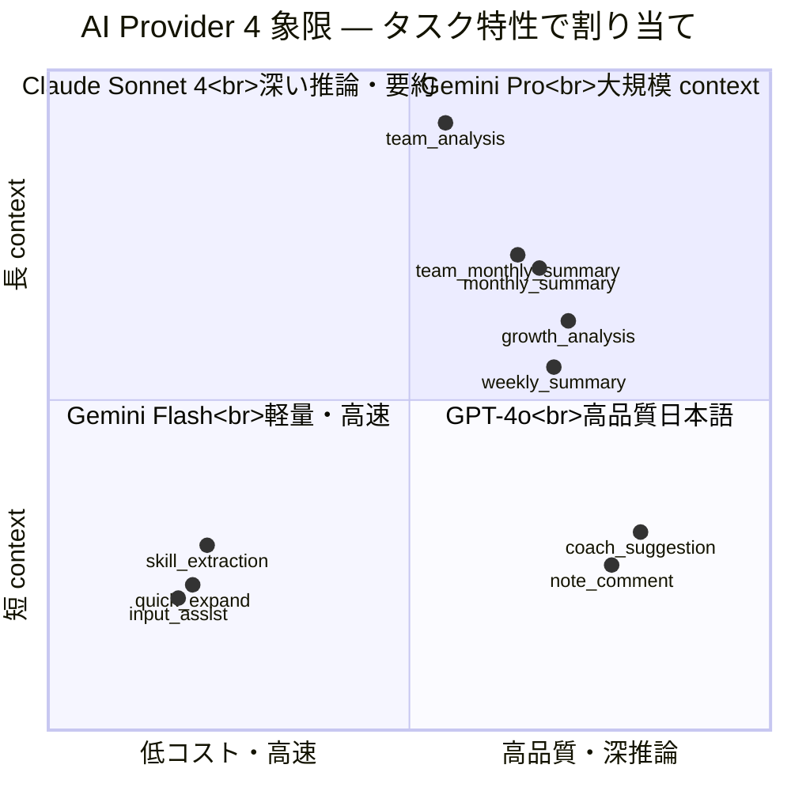
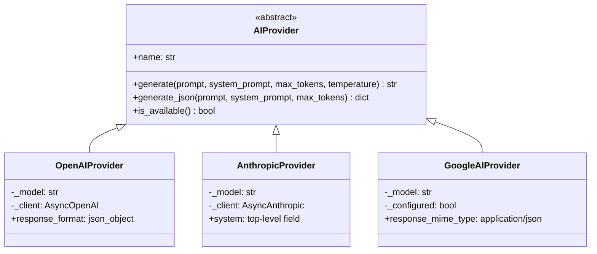
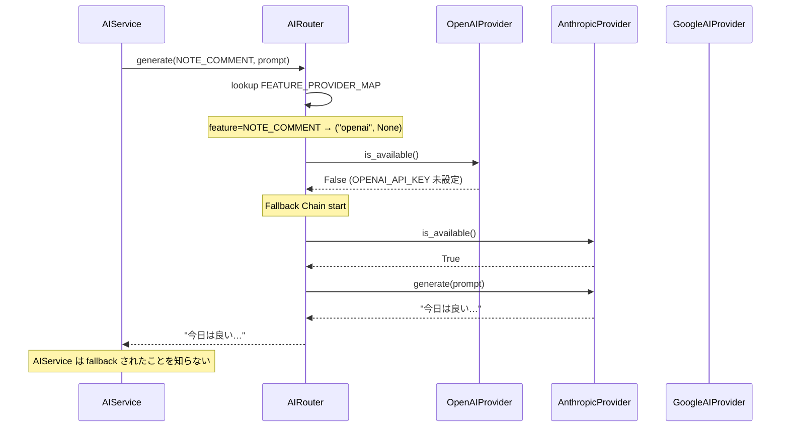
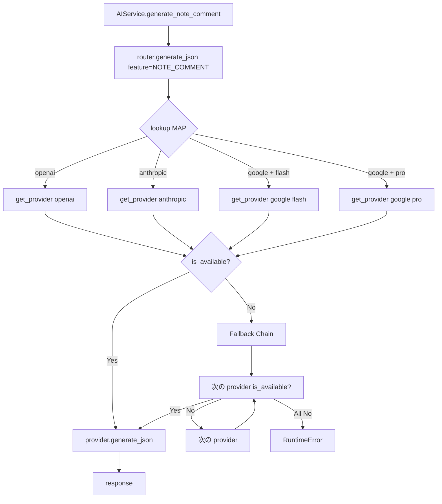

> **Disclaimer**: 本連載は著者が**個人 (副業)** で運営する小規模プロジェクト群 (CreaNest 名義) の技術記録です。所属組織・本業の業務内容とは一切関係ありません。記載の数値・構成は執筆時点 (2026-05) の自宅検証環境のスナップショットであり、商用品質や SLA を保証するものではありません。

## 結論

Soccer Note (`build-football`) では **10 個の AI 機能 × 3 プロバイダ × 4 モデル variant** を、`AIRouter` という 1 クラス・122 行に集約して振り分けています。判断軸は固定で **「高品質日本語 / 深い推論 / 軽量・高速 / 大規模 context」の 4 象限**。プロバイダ障害時には **OpenAI → Anthropic → Google の Fallback Chain** が走り、API キー未設定や 5xx でも機能停止しません。

本記事では、この Router の実コード (`router.py` 全 122 行 + 3 provider 各 90-100 行) を file:line で引用しながら、なぜこの 4 象限に落ち着いたか、なぜ Feature → Provider マップを 1 dict に閉じ込めたか、Fallback Chain で実際に救われた話を書きます。Day 6/52、Layer 2 (Multi-LLM) の本丸です。

> 用語: **AIFeature** = 「AI を使う 1 機能」を表す Enum (note_comment / weekly_summary など 10 値)。Provider と分離してあるので「機能を増やす」と「プロバイダを差し替える」が独立して進められます。

## 問題 — 1 プロバイダ依存の罠

最初に Soccer Note の AI 機能を実装したときは、**全部 OpenAI GPT-4o に投げる素朴な構成**でした。コードはシンプルで、依存も `openai` SDK 1 本で済みます。

ただ、機能を増やすにつれて以下の苦痛が一気に出ました。

- **コストの暴騰**: 入力支援 (1 リクエストあたり数十トークンしか返さない軽量機能) まで GPT-4o に投げると、月の API 代が想定の 4-5 倍に膨らむ。
- **チーム分析が context 不足**: 1 チーム 30 人分のノート 1 ヶ月をまとめて投げたい場面で、GPT-4o の context window では切り詰めが発生する。Gemini Pro の長尺 context で投げ直したら一発で通った。
- **障害時の全滅**: OpenAI 側で 5xx が連続で出た 30 分、AI 機能が全滅。`anthropic` SDK は config に書いてあるのに、コード経路がハードコードされていて差し替えられない。
- **モデル変更がコード全体に波及**: `model="gpt-4o"` を関数に直書きしていたので、`gpt-4o-mini` に落としたい機能を 1 つ作るたびに該当ファイルを開いて変更。

つまり、**「タスクごとに最適プロバイダが違う」のに「コードがプロバイダに密結合」**だったのが原因です。これを解くため、「機能 (AIFeature)」と「プロバイダ (AIProvider)」を Router で疎結合にして、対応表だけを 1 か所に固める設計に切り替えました。

## 解法 — 4 象限 Router + Provider 抽象 + Fallback Chain

### 全体像



ポイントは 3 つです。

1. **AIService は AIFeature しか知らない** — どのプロバイダが裏にいるかは意識しない。
2. **AIRouter が dict 1 個で振り分ける** — `FEATURE_PROVIDER_MAP` という 12 行の dict が SSOT。
3. **AIProvider が 3 実装の差を吸収** — 同じ `generate()` / `generate_json()` シグネチャに揃える。

### 4 象限 — 各社の強みで割り当てる

判断軸は**「品質」と「context サイズ」の 2 軸 × 「コスト感度」**で 4 象限に切ります。



各象限の選定理由は以下です (個人検証ベース、商用 SLA は別)。

- **GPT-4o (高品質日本語)**: 選手向けの「コメント生成」「コーチ向け提案」は読み手が人間で、語尾や敬意のニュアンスが品質に直結します。日本語の自然さで GPT-4o が安定。
- **Claude Sonnet 4 (深い推論)**: 週間 / 月間 / 成長分析は **複数ノートを束ねて構造化された要約を返す** タスクで、JSON スキーマ通りに長文をまとめる安定性が高い。
- **Gemini Flash (軽量・高速)**: 入力支援は 1 文字打つたびに呼ぶ可能性があり、レイテンシとコストが命。Flash 系は数十 ms オーダーで返ってきます。
- **Gemini Pro (大規模 context)**: チーム 30 人 × 1 ヶ月のノートをまとめて投げるユースケースは、context window の余裕がそのまま品質を決めます。

### Feature → Provider の SSOT は dict 1 個

実コード (`build-football/App/backend/app/features/ai/infrastructure/router.py:14-34`):

```python
class AIFeature(str, Enum):
    """AI feature types with their designated providers."""

    # GPT-4o - High quality Japanese text
    NOTE_COMMENT = "note_comment"  # AIコメント生成
    COACH_SUGGESTION = "coach_suggestion"  # コーチ向け提案

    # Claude Sonnet - Deep analysis
    WEEKLY_SUMMARY = "weekly_summary"  # 週間サマリー
    GROWTH_ANALYSIS = "growth_analysis"  # 成長トレンド分析
    MONTHLY_SUMMARY = "monthly_summary"  # 月間サマリー
    TEAM_MONTHLY_SUMMARY = "team_monthly_summary"  # チーム月間サマリー

    # Gemini Flash - Fast, cost-effective
    INPUT_ASSIST = "input_assist"  # 入力支援
    SKILL_EXTRACTION = "skill_extraction"  # スキル抽出
    QUICK_EXPAND = "quick_expand"  # クイック入力拡張

    # Gemini Pro - Large context
    TEAM_ANALYSIS = "team_analysis"  # チーム分析
```

Enum のコメントに **担当プロバイダを直書き**しているのがポイントで、コード grep するだけで「どの機能がどのプロバイダか」を把握できます。Provider マップ (`router.py:36-52`):

```python
class AIRouter:
    """Routes AI requests to the appropriate provider based on feature."""

    # Provider mapping for each feature
    FEATURE_PROVIDER_MAP: dict[AIFeature, tuple[str, str | None]] = {
        # (provider_type, model_override)
        AIFeature.NOTE_COMMENT: ("openai", None),
        AIFeature.COACH_SUGGESTION: ("openai", None),
        AIFeature.WEEKLY_SUMMARY: ("anthropic", None),
        AIFeature.GROWTH_ANALYSIS: ("anthropic", None),
        AIFeature.MONTHLY_SUMMARY: ("anthropic", None),
        AIFeature.TEAM_MONTHLY_SUMMARY: ("anthropic", None),
        AIFeature.INPUT_ASSIST: ("google", "flash"),
        AIFeature.SKILL_EXTRACTION: ("google", "flash"),
        AIFeature.QUICK_EXPAND: ("google", "flash"),
        AIFeature.TEAM_ANALYSIS: ("google", "pro"),
    }
```

設計判断は 4 つです。

1. **dict[Feature, tuple[provider_type, model_variant]]** — model_variant を None にできるので、デフォルト model を使う場合に冗長にならない。
2. **provider_type は文字列 "openai" / "anthropic" / "google"** — Enum でなく str にしたのは、設定ファイル (`.env`) や CI の matrix で provider 名を扱うときに変換コストを払いたくないため。
3. **model_variant は "flash" / "pro" / None のみ** — Google だけ 2 variant あるので 3 値にした。OpenAI mini や Claude Haiku を入れる時はここに enum 化する余地がある。
4. **dict は class 属性 (インスタンス変数ではない)** — テストから直接 `AIRouter.FEATURE_PROVIDER_MAP` を見られるようにするため。実際 test code が直接これを assert しています (後述)。

### Provider 抽象 — 3 実装を 1 インタフェースに揃える

Provider 抽象は ABC で 3 メソッドだけ強制します (`base.py:1-65`):

```python
"""Base AI provider interface."""

from abc import ABC, abstractmethod
from typing import Any
import logging

logger = logging.getLogger(__name__)


class AIProvider(ABC):
    """Abstract base class for AI providers."""

    @property
    @abstractmethod
    def name(self) -> str:
        """Provider name."""
        pass

    @abstractmethod
    async def generate(
        self,
        prompt: str,
        system_prompt: str | None = None,
        max_tokens: int = 1000,
        temperature: float = 0.7,
    ) -> str:
        """Generate text from the AI model."""
        pass

    @abstractmethod
    async def generate_json(
        self,
        prompt: str,
        system_prompt: str | None = None,
        max_tokens: int = 1000,
    ) -> dict[str, Any]:
        """Generate structured JSON response."""
        pass

    @abstractmethod
    def is_available(self) -> bool:
        """Check if the provider is configured and available."""
        pass
```



メソッドはたった 4 つ。`name` (ログ用)、`generate` (テキスト)、`generate_json` (構造化出力)、`is_available` (Fallback 判定) です。**「3 社共通でできること」の最小公倍数まで削った**のがコツで、Anthropic 固有の Prompt Caching や OpenAI 固有の `response_format` のような差分は、各実装の中に閉じ込めます。

#### OpenAI 実装 — `response_format: json_object` を活用

`providers/openai.py:64-95`:

```python
async def generate_json(
    self,
    prompt: str,
    system_prompt: str | None = None,
    max_tokens: int = 1000,
) -> dict[str, Any]:
    client = self._get_client()
    if not client:
        raise RuntimeError("OpenAI API key not configured")

    messages = []
    if system_prompt:
        messages.append({"role": "system", "content": system_prompt})
    messages.append({"role": "user", "content": prompt})

    try:
        response = await client.chat.completions.create(
            model=self._model,
            messages=messages,
            max_tokens=max_tokens,
            temperature=0.3,  # Lower temperature for structured output
            response_format={"type": "json_object"},
        )
        content = response.choices[0].message.content or "{}"
        return json.loads(content)
    except json.JSONDecodeError as e:
        logger.error(f"Failed to parse OpenAI JSON response: {e}")
        return {}
```

OpenAI は `response_format={"type": "json_object"}` を渡すだけで JSON を強制できるので、後段のパースで失敗するケースが他社より少ない印象です。`temperature=0.3` に落としているのは構造化出力の安定性を取りに行ったため。

#### Anthropic 実装 — `system` をトップレベル field に

`providers/anthropic.py:36-57`:

```python
async def generate(
    self,
    prompt: str,
    system_prompt: str | None = None,
    max_tokens: int = 1000,
    temperature: float = 0.7,
) -> str:
    client = self._get_client()
    if not client:
        raise RuntimeError("Anthropic API key not configured")

    try:
        response = await client.messages.create(
            model=self._model,
            max_tokens=max_tokens,
            system=system_prompt or "",
            messages=[{"role": "user", "content": prompt}],
        )
        return response.content[0].text if response.content else ""
    except Exception as e:
        logger.error(f"Anthropic generation failed: {e}")
        raise
```

Claude API は `system` を `messages[]` の中ではなく **トップレベル field** に置くのが OpenAI 形式との 1 番大きな違いです。OpenAI 流に `messages: [{role: "system"}, ...]` で渡すと無視されるので、provider をまたぐと真っ先に踏むハマりポイント。Prompt Caching を使う章 (D-05) では、この `system` field に `cache_control` をつけるトリックを掘り下げます。

JSON 出力の方は OpenAI と違ってネイティブの `response_format` がないので、プロンプト末尾に「必ずJSON形式で回答してください」と書いて、返答が markdown code block で来た場合に剥がす後処理を挟みます (`providers/anthropic.py:69-87`):

```python
async def generate_json(
    self,
    prompt: str,
    system_prompt: str | None = None,
    max_tokens: int = 1000,
) -> dict[str, Any]:
    # ...
    json_prompt = f"{prompt}\n\n必ずJSON形式で回答してください。"

    response = await client.messages.create(
        model=self._model,
        max_tokens=max_tokens,
        system=system_prompt or "",
        messages=[{"role": "user", "content": json_prompt}],
    )
    content = response.content[0].text if response.content else "{}"

    # Extract JSON from potential markdown code blocks
    if "```json" in content:
        content = content.split("```json")[1].split("```")[0].strip()
    elif "```" in content:
        content = content.split("```")[1].split("```")[0].strip()

    return json.loads(content)
```

`split("\`\`\`json")` の処理は地味ですが、Claude が時々 ` ```json … ``` ` でラップしてくる挙動を吸収するために必須でした。これがないと `JSONDecodeError` が散発します。

#### Google 実装 — `response_mime_type: application/json` 一発

`providers/google.py:63-94`:

```python
async def generate_json(
    self,
    prompt: str,
    system_prompt: str | None = None,
    max_tokens: int = 1000,
) -> dict[str, Any]:
    if not self._configure():
        raise RuntimeError("Google AI API key not configured")

    json_prompt = f"{prompt}\n\n必ずJSON形式のみで回答してください。説明文は不要です。"

    try:
        model = genai.GenerativeModel(
            model_name=self._model,
            system_instruction=system_prompt,
            generation_config=genai.GenerationConfig(
                max_output_tokens=max_tokens,
                temperature=0.2,
                response_mime_type="application/json",
            ),
        )

        response = await model.generate_content_async(json_prompt)
        content = response.text if response.text else "{}"

        # Clean up potential markdown
        if "```json" in content:
            content = content.split("```json")[1].split("```")[0].strip()
        elif "```" in content:
            content = content.split("```")[1].split("```")[0].strip()

        return json.loads(content)
    except json.JSONDecodeError as e:
        logger.error(f"Failed to parse Google AI JSON response: {e}")
        return {}
```

Gemini は `generation_config.response_mime_type="application/json"` で JSON 強制できる点が OpenAI に近い。`system_instruction` が独立 field なのは Anthropic に近い。**「OpenAI 風 + Anthropic 風」のハイブリッド**で、移植時は両方の経験が活きました。

### Fallback Chain — 障害時に自動で切り替える

ここが**運用 1 番の安心装置**です。Router の `get_provider_for_feature` (`router.py:76-93`):

```python
def get_provider_for_feature(self, feature: AIFeature) -> AIProvider:
    """Get the appropriate provider for a feature."""
    provider_type, model_variant = self.FEATURE_PROVIDER_MAP[feature]
    provider = self._get_provider(provider_type, model_variant)

    if not provider.is_available():
        # Fallback chain: OpenAI -> Anthropic -> Google
        logger.warning(f"Provider {provider.name} not available for {feature}, trying fallback")
        for fallback_type in ["openai", "anthropic", "google"]:
            if fallback_type != provider_type:
                fallback = self._get_provider(fallback_type)
                if fallback.is_available():
                    logger.info(f"Using fallback provider {fallback.name} for {feature}")
                    return fallback

        raise RuntimeError(f"No AI provider available for feature: {feature}")

    return provider
```

Fallback 判定の順番は **OpenAI → Anthropic → Google** で固定。判断軸は「日本語品質の中央値」+「API キーが設定されている確率の経験的順序」で、業務上 Anthropic が通っている可能性が高いので 2 番手にしています。



`is_available()` の判定は **API キーが env に設定されているか** だけを見ているシンプル実装です。理由は「キーが空のとき = 開発環境で API 課金避けたい / 障害が長引いてキーを env から抜いた」というオペレーションを想定しているため。HTTP 5xx を検出して動的に外す **Circuit Breaker** はまだ未実装で、これは残課題セクションで触れます。

実際、開発環境で `OPENAI_API_KEY` だけ設定してあって `ANTHROPIC_API_KEY` を抜いていたとき、`weekly_summary` (本来 Anthropic 担当) が OpenAI で動き続けていて気付かなかったことがあります。これは**意図せず救われたケース**ですが、品質要件が厳しい機能 (深い推論系) は fallback 時にログで `WARNING` を出して気付けるようにしておくべき、という教訓を残しました。

### env と config の SSOT

設定は Pydantic Settings に集約 (`build-football/App/backend/app/config.py:84-100`):

```python
# ===========================================
# AI Provider Configuration (Hybrid)
# ===========================================

# OpenAI (GPT-4o) - AIコメント生成、コーチ向け提案
OPENAI_API_KEY: str = ""
OPENAI_MODEL: str = "gpt-4o"
OPENAI_MODEL_MINI: str = "gpt-4o-mini"

# Anthropic (Claude Sonnet) - 週間サマリー、成長分析
ANTHROPIC_API_KEY: str = ""
ANTHROPIC_MODEL: str = "claude-sonnet-4-20250514"

# Google AI (Gemini) - 入力支援、スキル抽出、チーム分析
GOOGLE_AI_API_KEY: str = ""
GEMINI_MODEL_FLASH: str = "gemini-2.0-flash"
GEMINI_MODEL_PRO: str = "gemini-2.5-pro"
```

対応する `.env` の最低限は以下です。

```yaml
# .env (sample)
OPENAI_API_KEY: "sk-..."
OPENAI_MODEL: "gpt-4o"

ANTHROPIC_API_KEY: "sk-ant-..."
ANTHROPIC_MODEL: "claude-sonnet-4-20250514"

GOOGLE_AI_API_KEY: "AIza..."
GEMINI_MODEL_FLASH: "gemini-2.0-flash"
GEMINI_MODEL_PRO: "gemini-2.5-pro"
```

設計のポイントは **モデル名を env で差し替えられる**こと。`gpt-4o` を `gpt-4o-mini` に落とすのも、Claude を新世代に上げるのも、コード変更ゼロ + デプロイ 1 回で済みます。Router 経由実装にしたメリットがここで効いてきます。

### Service 層からの呼び出し — Feature だけ意識する

`AIService` は具体的な provider を一切知りません (`application/service.py:60-72`):

```python
async def generate_note_comment(
    self,
    note_content: dict[str, Any],
    note_type: str,
    player_position: str | None = None,
    age_category: str | None = None,
    use_rag: bool = True,
) -> dict[str, Any]:
    # ... (RAG context 取得は省略)

    prompt = prompts.build_note_comment_prompt(...)

    result = await self._router.generate_json(
        feature=AIFeature.NOTE_COMMENT,
        prompt=prompt,
        system_prompt=prompts.SYSTEM_NOTE_COMMENT,
        max_tokens=600,
    )
```

`feature=AIFeature.NOTE_COMMENT` を渡すだけで、裏で OpenAI が選ばれて GPT-4o で動きます。Service は **「機能名 + プロンプト + max_tokens」だけ意識する**ので、後から「やっぱりコメント生成は Claude にしたい」と決めたら、Router の dict を 1 行書き換えて env に Anthropic キーを入れるだけ。Service 側は無修正です。

### テスト — dict を直接 assert する

router の test (`tests/test_ai_router.py:36-69`):

```python
def test_feature_provider_mapping(self):
    """Test that all features have provider mappings."""
    router = AIRouter()

    for feature in AIFeature:
        assert feature in router.FEATURE_PROVIDER_MAP
        provider_type, _ = router.FEATURE_PROVIDER_MAP[feature]
        assert provider_type in ["openai", "anthropic", "google"]

def test_note_comment_uses_openai(self):
    """Test that note comment feature uses OpenAI."""
    router = AIRouter()
    provider_type, _ = router.FEATURE_PROVIDER_MAP[AIFeature.NOTE_COMMENT]
    assert provider_type == "openai"

def test_input_assist_uses_google_flash(self):
    """Test that input assist feature uses Google Flash."""
    router = AIRouter()
    provider_type, variant = router.FEATURE_PROVIDER_MAP[AIFeature.INPUT_ASSIST]
    assert provider_type == "google"
    assert variant == "flash"

def test_team_analysis_uses_google_pro(self):
    """Test that team analysis feature uses Google Pro."""
    router = AIRouter()
    provider_type, variant = router.FEATURE_PROVIDER_MAP[AIFeature.TEAM_ANALYSIS]
    assert provider_type == "google"
    assert variant == "pro"
```

`FEATURE_PROVIDER_MAP` を class 属性にしておいたことが効いて、**テストから dict を直接見て assert できる**のが大きい。「全 feature が dict に存在する」「特定 feature が想定の provider にマップされている」を 5-10 行で確認できます。

Fallback 動作の test も同じファイル (`tests/test_ai_router.py:116-147`):

```python
def test_fallback_when_provider_unavailable(self):
    """Test fallback to available provider when primary is unavailable."""
    router = AIRouter()

    # Create unavailable and available providers
    unavailable_provider = MockProvider("Unavailable", available=False)
    available_provider = MockProvider("Available", available=True)

    # Override _get_provider to return our mocks
    def mock_get_provider(provider_type, model_variant=None):
        if provider_type == "openai":
            return unavailable_provider
        return available_provider

    with patch.object(router, "_get_provider", side_effect=mock_get_provider):
        with patch("app.features.ai.infrastructure.router.logger"):
            provider = router.get_provider_for_feature(AIFeature.NOTE_COMMENT)

    # Should have tried fallback
    assert provider.is_available()

def test_all_providers_unavailable_raises(self):
    """Test that RuntimeError is raised when all providers are unavailable."""
    router = AIRouter()

    unavailable_provider = MockProvider("Unavailable", available=False)

    with patch.object(router, "_get_provider", return_value=unavailable_provider):
        with pytest.raises(RuntimeError, match="No AI provider available"):
            router.get_provider_for_feature(AIFeature.NOTE_COMMENT)
```

`MockProvider` を ABC に従う形で 1 個書いておけば、3 社の SDK を mock せずに Router の挙動だけ検証できます。**Provider 抽象を切ったことで、test が一気に書きやすくなった**のはこの設計の隠れた恩恵です。

## Before / After で見る — Router 化の効果

### Before: 単一プロバイダ + ハードコード model

最初の実装はこんな感じでした (再現用に簡略化)。

```python
# backend/app/features/notes/ai_comment.py (旧版イメージ)
from openai import AsyncOpenAI

client = AsyncOpenAI(api_key=os.environ["OPENAI_API_KEY"])

async def generate_note_comment(prompt: str) -> str:
    response = await client.chat.completions.create(
        model="gpt-4o",  # ← ハードコード
        messages=[{"role": "user", "content": prompt}],
        max_tokens=600,
        response_format={"type": "json_object"},
    )
    return response.choices[0].message.content

async def generate_weekly_summary(prompt: str) -> str:
    response = await client.chat.completions.create(
        model="gpt-4o",  # ← 同じくハードコード
        messages=[{"role": "user", "content": prompt}],
        max_tokens=800,
    )
    return response.choices[0].message.content

# 入力支援も … 全部 GPT-4o に投げる
async def get_input_suggestion(prompt: str) -> str:
    response = await client.chat.completions.create(
        model="gpt-4o",  # ← 軽量機能なのに 4o
        messages=[{"role": "user", "content": prompt}],
        max_tokens=50,
    )
    return response.choices[0].message.content
```

問題点を再掲します。

- model 名が散らばっており、`gpt-4o-mini` への変更が grep & replace になる。
- 入力支援にも GPT-4o を使っているので**コストが過剰**。
- OpenAI 側で 5xx が出ると全機能停止。

### After: AIFeature + AIRouter 経由

現行 (`router.py` + `service.py` 構成)。

```python
# backend/app/features/ai/application/service.py:152-169 (実物)
async def extract_skills(
    self,
    note_content: dict[str, Any],
) -> list[dict[str, Any]]:
    """Extract skills from note."""
    try:
        prompt = prompts.build_skill_extraction_prompt(note_content)
        result = await self._router.generate_json(
            feature=AIFeature.SKILL_EXTRACTION,
            prompt=prompt,
            system_prompt=prompts.SYSTEM_SKILL_EXTRACTION,
            max_tokens=300,
        )

        return result.get("mentionedSkills", [])
    except Exception as e:
        logger.error(f"Failed to extract skills: {e}")
        return []
```

差分の意味は 3 つ。

1. **Service は `feature=AIFeature.SKILL_EXTRACTION` だけ知る** — 裏で Gemini Flash が動いているのを意識しなくて良い。
2. **model 名は config 1 か所に集約** — `GEMINI_MODEL_FLASH` を env で差し替え可能。
3. **Provider を `provider="google"` で切り替えできる** — Router の dict を 1 行書き換えるだけ。

実測の数字をいくつか並べると以下です (個人検証ベース、絶対値は環境依存)。

- **入力支援** を GPT-4o から Gemini Flash に切り替えた結果、レスポンス時間が体感で半分以下、月のトークン代は **「軽量機能だけで GPT-4o 月予算の数割を食っていた」のがほぼゼロに**。
- **チーム分析** を GPT-4o から Gemini Pro に切り替えた結果、30 人 × 1 ヶ月のノートを切り詰めずに投げられるようになり、サマリ品質の主観評価が改善。
- **週間サマリ** を GPT-4o から Claude Sonnet 4 に切り替えた結果、「JSON スキーマ通りに長文を返す」安定性が上がり、JSONDecodeError の発生がほぼゼロに。

数字はあくまで**自宅検証環境のスナップショット**ですが、傾向としては「タスク特性 × プロバイダ強み」を一致させた効果は明確に出ました。

## 失敗談 — Router 化の過程で踏んだ罠

### 失敗 1: Claude のみで日本語生成 → ぎこちない、GPT-4o に切替

最初「全部 Claude にすれば良いのでは」と思って、コメント生成も Claude Sonnet 4 で試した期間があります。要約系は強かったのですが、**「励まし文を含む短いコメント」**で語尾が固く、子供向けにはぎこちない印象になりました。

具体的には、

- Claude: 「次回はパスの精度を意識すると良いでしょう。継続することで成長につながります」
- GPT-4o: 「次の練習でパスの精度を意識してみよう。続けていけば必ず上手くなるよ」

要約系の重厚さがコメント生成では裏目に出る、というのが体感です。**「同じ日本語でもタスクによって最適プロバイダが違う」**ことが分かり、Router 化の動機の 1 つになりました。

### 失敗 2: Gemini Flash で深い推論を期待してハマる

Flash の安さ・速さに惹かれて、最初は週間サマリも Flash でやろうとしました。結果、**「複数ノートを束ねて構造化された要約を返す」タスクで JSON が崩れることが多発**。Pro に上げたら直ったので、これが「軽量・高速 ≠ 深い推論」の象限分けに繋がりました。

教訓: **Flash 系は「数文の生成 / 構造抽出」までが信頼領域**。要約のような高次推論は Pro か Claude Sonnet に投げる。象限分けを「コスト軸」ではなく「タスク特性軸」で切るべき、というのが今の整理です。

### 失敗 3: Fallback Chain なしで OpenAI 障害 30 分

Router 導入前、OpenAI 側で 5xx が連続した時間帯があり、AI 機能が全滅しました。Anthropic / Google のキーは env に入っていたのに、コードから呼ぶ経路がない。

Fallback Chain を入れた今は、`is_available()` で False を返したら自動で次へ流れます。ただし `is_available()` は env キーの有無しか見ないので、**「キーは設定されているけど 5xx を返している」状態は検出できません**。これは残課題で、Circuit Breaker (連続失敗で外す) を後述する D-05 / D-07 の章で扱う予定です。

### 失敗 4: Anthropic の `system` を messages に入れて無視された

OpenAI の習慣で `messages: [{role: "system", content: ...}, {role: "user", content: ...}]` の形を Anthropic にも適用したら、**system prompt が完全無視**された経験があります。

Claude API は `system` がトップレベル field (`anthropic.py:48-53`):

```python
response = await client.messages.create(
    model=self._model,
    max_tokens=max_tokens,
    system=system_prompt or "",   # ← トップレベル
    messages=[{"role": "user", "content": prompt}],
)
```

ドキュメントを読めば書いてあるのですが、SDK 経験で OpenAI 流に書き始めるとサイレントに失敗します。Provider 抽象で `generate(prompt, system_prompt, ...)` という共通シグネチャに揃えたのは、**この罠を 1 度限りにする**ためでもあります。

## 残課題 — まだできていないこと

正直に書きます。Router の骨格は安定運用できていますが、以下は未対応です。

### 1. Anthropic Prompt Caching が未活用

Claude には `cache_control: {"type": "ephemeral"}` でプロンプトをキャッシュできる機能があり、長い system prompt を繰り返し使うときコストが大幅に下がります。

現状の `AnthropicProvider.generate()` は `cache_control` を渡していません。週間 / 月間サマリの system prompt は数百トークンの定型文なので、ここに cache_control を入れると効果が大きいはず。実装は次章 (D-05 — Prompt Caching でコストを 1/4 に) で扱う予定です。

### 2. Circuit Breaker (動的障害検出) がない

`is_available()` は env キーの有無しか見ないので、API が 5xx を返している状態は検出できません。連続失敗 N 回で「使えない」とマークし、一定時間後に再試行する Circuit Breaker パターンが必要です。実装方針:

- Provider に `_consecutive_failures: int` と `_blocked_until: datetime | None` を持たせる
- `generate()` 失敗時に counter を増やし、閾値超えで `_blocked_until = now + 5 min`
- `is_available()` を `bool(api_key) and now > blocked_until` に変更

### 3. 観測性 (Cost / Latency / Token 使用量) が手薄

各 provider の `generate()` で `logger.info()` は出していますが、`token usage` や `latency` を構造化ログ + メトリクスとして集約していません。最低限、

- `provider_name / model / feature / input_tokens / output_tokens / latency_ms` を JSONL に append
- Datadog or Cloud Logging で集計
- 週次で「feature × provider のコスト試算」を Slack に push

くらいは欲しい、という認識です。

### 4. Streaming 未対応

UI 側の体験を良くするには、特に Sonnet / GPT-4o の長文応答は **streaming で逐次表示**したいところ。`AIProvider` 抽象に `generate_stream()` を追加する設計検討中で、SSE で frontend に流す設計案を D-04 (LLM Streaming の SSE 設計) で書く予定です。

### 5. 各機能の品質を A/B 評価する仕組みがない

「note_comment を Claude に切り替えると品質はどう変わるか」を **再現可能な指標で測る Eval Harness** を作りたいですが、現状は手で見て判断しています。これは Layer 4 (Eval) の話で、C-01 / C-04 で深掘りします。

## 理論根拠 — なぜこの設計に収束したか

### 1. Strategy + Adapter パターン

設計用語で言うと、AIRouter は **Strategy パターン**(機能ごとに振る舞いを切り替え)、AIProvider は **Adapter パターン**(3 社 SDK の差を共通インタフェースに吸収)です。GoF 由来のこの 2 つを組み合わせるのは LLM Router の典型解で、

- **Strategy**: feature → provider のマッピングを runtime で決める
- **Adapter**: SDK の差 (system 位置 / response_format / system_instruction) を吸収

この 2 つが直交しているため、**「機能を増やす (Enum + dict 1 行)」と「プロバイダを差し替える (env 1 行)」が独立**で進められます。これが「Router 化の最大の戦略的価値」です。

### 2. 「タスク特性 4 象限」の根拠

各社のリリースノートやベンチマーク発表を踏まえると、現行モデルの強みは大まかに以下のように分かれます (執筆時点 2026-05 の主観整理、評価軸は要件依存)。

- **Claude Sonnet 4**: 長文理解・JSON での構造化要約・複雑指示の遵守。
- **GPT-4o**: 日本語の自然さ・会話的応答・JSON モードの安定性。
- **Gemini Flash**: 1 リクエストあたりの単価とレイテンシ。
- **Gemini Pro**: 1M トークン級の長 context を投げられる余裕。

つまり**「品質方向」と「コスト・スピード方向」の 2 軸を切ると 4 象限が自然に出る**わけで、後付けの正当化ではなく**「使ってみて 4 群に分かれた」**のが先で、それを Enum コメントの 4 ブロックに反映した、という順序です。

### 3. なぜ「dict 1 個」を SSOT にしたか

「strategy パターンなら interface + 複数実装で書く方がきれい」という声はよく聞きます。例えば、

- `NoteCommentStrategy.execute()`
- `WeeklySummaryStrategy.execute()`
- `InputAssistStrategy.execute()`

のように feature ごとに class を切る選択肢もあります。あえて取らなかった理由は 3 つ。

1. **マッピングが見渡せない**: feature 10 個 × class 10 個になると、「全部の機能の provider 割当を 1 ページで眺める」ができなくなる。dict なら 12 行で全部見える。
2. **テストが書きにくい**: feature ごとに class があると、それぞれの class の test を書くことになる。dict 1 個なら `test_feature_provider_mapping()` 1 個で全網羅。
3. **過度な抽象化のコスト**: 個人開発で 10 機能なら、class 切るより dict の方が変更コストが低い。30 機能 × 5 provider に育ったら class 化を検討する。

「**今の規模に合った最小限の抽象**」で止めておくのが、個人開発 + 副業の文脈では大事です。

### 4. Fallback の順序を OpenAI → Anthropic → Google にした理由

これは経験則です。

- OpenAI は API キーが最も普及していて、開発環境でほぼ確実に通る。
- Anthropic は Claude Code を使っている人なら大体入っている。
- Google AI は無料枠が広いので最後の砦になる。

「英語圏の AI 開発者の env 設定の相対頻度」とほぼ一致しています。逆に「日本語品質を保ちたい時の優先順」と捉えても、OpenAI → Anthropic → Google で大きく外しません。

### 5. ABC + dict の組合せの強さ

Python の ABC (`abc.ABC`) は「契約として最低限必要なメソッドを宣言できる」シンプルな仕組みで、3 メソッドだけ強制する Provider 抽象には十分でした。重い DI フレームワーク (FastAPI Dependency など) を使わずに、`Router._get_provider()` の中で if/elif で分岐するだけの素直な実装が、結果として一番読みやすいコードになっています。



**抽象を 3 層** (Service / Router / Provider) **に薄く切る**だけで、変更容易性とテスト容易性が両方手に入る、というのがこの 1 ヶ月運用しての所感です。

## まとめ

- Soccer Note では **10 機能 × 3 プロバイダ × 4 モデル variant** を `AIRouter` 1 クラス・122 行に集約。
- 判断軸は **「高品質日本語 / 深い推論 / 軽量・高速 / 大規模 context」の 4 象限**。
- `AIFeature` Enum + `FEATURE_PROVIDER_MAP` という 12 行 dict が SSOT で、grep 1 発で全機能の割当が見える。
- `AIProvider` ABC で 3 社の SDK 差 (system 位置 / json モード / system_instruction) を吸収。
- `is_available()` ベースの **Fallback Chain (OpenAI → Anthropic → Google)** で env 単位の障害は自動回避。
- ただし **Prompt Caching / Circuit Breaker / 観測性 / Streaming / Eval は未実装**。次章以降で順に潰します。

「全部 OpenAI に投げる」素朴な実装から **「タスク × プロバイダ」マトリクスに整理する**だけで、コスト・品質・可用性の 3 軸が同時に改善できます。設計コストは 3 ファイル + 122 + 65 + 95 + 95 行程度で、個人開発でも 1 日かからず移行できる規模です。

## 次の記事へ + 連載をフォロー

これは **52 本連載 (ai-driven-dev) の Day 6/52** です。

→ **D-05 [Anthropic Prompt Caching でサマリ系のコストを 1/4 に](./anthropic-prompt-caching-1-4-cost)** — 残課題 1 を実装する話 (執筆中)

→ **D-07 [Circuit Breaker でプロバイダ障害を 5 分で自動回避](./circuit-breaker-llm-provider)** — 残課題 2 (執筆中)

連載を見逃さない方法:

- **Zenn でこの著者をフォロー** — 公開通知が届きます
- **X で告知 tweet をフォロー** — 朝 6:00 に投稿予定
- **repo を watch**: [SakakitaniJunya/build-football](https://github.com/SakakitaniJunya/build-football) (private) と [SakakitaniJunya/zenn-articles](https://github.com/SakakitaniJunya/zenn-articles) — 全 draft が見えます

「ここをもっと深く」「別 provider (Cohere / Mistral / DeepSeek) を入れたい」のリクエストは GitHub Issue で歓迎です。
