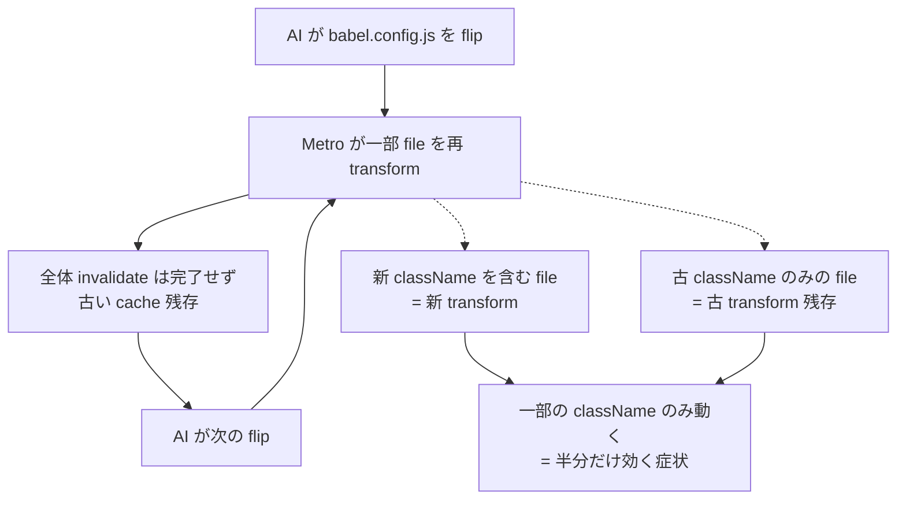
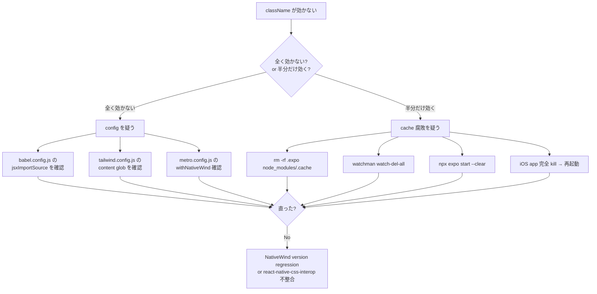

## TL;DR

NativeWind v4 + Expo SDK 53 + pnpm monorepo + iOS で `className` が「半分だけ効く」(色は当たるがフォントサイズが当たらない / Button は効くが Input は効かない / 一部画面だけテーマ未適用) 症状は、**ほぼ確実に Metro / Expo / iOS dev client の cache 腐敗** です。babel preset / metro.config / tailwind.config / pnpm symlink を flip しても直りません。**`rm -rf .expo node_modules/.cache && npx expo start --clear`** の 1 コマンドで完治します。

弊社の自社プロダクト Komyu (Next.js 16 + React Native の monorepo) で、前任 AI セッションが **10 時間** 設定を行ったり来たりして「半分しか直らない」状態のまま停止していた現象を、引き継いだ別セッションが 30 分で診断 → 1 コマンドで解決した記録です。

## なぜこの記事を書くか

NativeWind の「className が効かない」記事は山ほどあります。が、ほとんどが「全く効かない」ケース (= config の話) で、**「半分だけ効く」症状の切り分け** を書いている記事はほとんど見つけられませんでした。

「全く効かない」と「半分だけ効く」は、見た目は似ていても **原因の階層が違います**。本記事はその切り分けの記録です。同じ症状で AI に config を flip させ続けている方が 1 人でも救われたら本望です。

## 症状 (Before)

弊社の Komyu mobile (Expo SDK 53 / NativeWind 4.2.3 / pnpm monorepo / DS package を [packages/ui-mobile/](https://github.com/SakakitaniJunya/Komyu) として分離) で、iOS シミュレータ確認時に以下が発生しました。

[packages/ui-mobile/src/AuthScreen.tsx:30](https://github.com/SakakitaniJunya/Komyu) — タイトル `<Text>` の className 抜粋:

```tsx
<Text className="text-3xl font-bold mb-2 text-brand-700">{title}</Text>
```

このうち、**`text-brand-700` (色) は効くが `text-3xl` (フォントサイズ) は効かない**。同じ要素、同じ className 文字列内で、色だけ当たってサイズだけ当たらない、という不可解な状態でした。

[packages/ui-mobile/src/Input.tsx:18](https://github.com/SakakitaniJunya/Komyu) — `TextInput` の className:

```tsx
<TextInput
  className={`border ${borderClass} rounded-lg px-3 py-3 text-base bg-white`}
  ...
/>
```

こちらは **全く何も効かない**。border も padding も font-size も背景色も無視。一方 [packages/ui-mobile/src/Button.tsx:54](https://github.com/SakakitaniJunya/Komyu) の `Pressable` + `Text` の className は普通に効きます。

つまり症状は 2 種類:

1. 同じ要素内で **色は効くがサイズは効かない**
2. **Button は効くが Input は効かない** (どちらも DS package 内、どちらも公式の React Native primitive を使用)

## 前任 AI が 10 時間積んだ patch (アンチパターン)

前任セッションは原因を「config のどこかにある」と仮定し、以下を 10 時間かけて往復しました。

- `babel-preset-expo` の `jsxImportSource: "nativewind"` を付けたり外したり
- `nativewind/babel` preset を追加したり削除したり
- `index.js` workaround を作って消して作って消して
- `metro.config.js` を最小化したり、`watchFolders` / `nodeModulesPaths` を機能追加したり
- pnpm の symlink を `node_modules/nativewind` 配下に手動 rebind
- `.npmrc` を `node-linker=hoisted` + `shamefully-hoist=true` に変えて再 install

結果: **半分しか直らない**。前任 AI は session 末に「私は原因を完全に理解できていません」と正直に降りていきました。

## 真因 (After)

引き継いだ別セッションが最初にやったのは **「config が間違っているか」を 5 分で確認する** ことでした。

[apps/mobile/babel.config.js:1-9](https://github.com/SakakitaniJunya/Komyu):

```javascript
module.exports = function (api) {
  api.cache(true);
  return {
    presets: [
      ["babel-preset-expo", { jsxImportSource: "nativewind" }],
      "nativewind/babel",
    ],
  };
};
```

[apps/mobile/metro.config.js:1-26](https://github.com/SakakitaniJunya/Komyu):

```javascript
const { getDefaultConfig } = require("expo/metro-config");
const { withNativeWind } = require("nativewind/metro");
const path = require("path");

const projectRoot = __dirname;
const workspaceRoot = path.resolve(projectRoot, "..", "..");

const config = getDefaultConfig(projectRoot);

config.watchFolders = [
  path.resolve(workspaceRoot, "apps", "web", "src", "common"),
  path.resolve(workspaceRoot, "packages", "ui-mobile"),
  path.resolve(workspaceRoot, "packages", "ui-shared"),
];

config.resolver.nodeModulesPaths = [
  path.resolve(projectRoot, "node_modules"),
  path.resolve(workspaceRoot, "node_modules"),
];
config.resolver.disableHierarchicalLookup = false;

module.exports = withNativeWind(config, { input: "./global.css" });
```

[apps/mobile/tailwind.config.js:1-15](https://github.com/SakakitaniJunya/Komyu):

```javascript
const path = require("path");

const uiMobileSrc = path.resolve(__dirname, "../../packages/ui-mobile/src/**/*.{ts,tsx}");

module.exports = {
  content: [
    "./app/**/*.{ts,tsx}",
    "./components/**/*.{ts,tsx}",
    "./src/**/*.{ts,tsx}",
    uiMobileSrc,
  ],
  presets: [require("nativewind/preset")],
  ...
};
```

**全部 NativeWind v4 公式 Expo Router setup と完全一致** していました。前任 AI が修正しようとしていた箇所は、最初から正しかったのです。

念のため content glob が DS package を本当に拾えているか実測します。

```bash
$ cd apps/mobile && node -e "
const fg = require('fast-glob');
const path = require('path');
const pattern = path.resolve(__dirname, '../../packages/ui-mobile/src/**/*.{ts,tsx}');
fg(pattern).then(files => console.log('matched:', files.length));
"
matched: 22
```

22 ファイル、全て hit。`AuthScreen.tsx` も `Input.tsx` も含まれています。Tailwind は理論上、これらの className を全てスキャンして CSS を生成できる状態でした。

**config に問題は無い。** ではなぜ動かないのか。

## 仮説: Metro transform cache の部分腐敗

Metro は babel.config.js の変更を検知して transform cache を invalidate します。が、**前任 AI が 10 時間で何十回も config を flip させた結果、cache が「部分的に invalidate された状態」のまま、一部の file は古い transform 結果のまま** だったというのが最も自然な説明です。



NativeWind v4 の className は **babel transform で `style` prop に置換される** ため、cache 内に残った古い transform 結果は「className がそもそも `style` に変換されていない」状態です。これがそのまま実行されると、className を React Native primitive がスタイルプロップとして解釈できず、何も適用されません。

## 解決 (1 コマンド)

```bash
cd apps/mobile
rm -rf .expo node_modules/.cache
watchman watch-del-all 2>/dev/null
npx expo start --clear --ios
```

これだけです。iOS シミュレータが立ち上がった後の Metro 出力:

```
› Opening exp://10.49.178.84:8081 on iPhone 17 Pro
Waiting on http://localhost:8081
Logs for your project will appear below.
iOS Bundled 2610ms node_modules/expo-router/entry.js (1771 modules)
```

**2610ms で 1771 modules を再 transform**。バンドル投下後、AuthScreen の `text-3xl` も Input の `border / px-3 / py-3 / text-base` も、全て正しく適用されました。config の修正は **ゼロ行**。

## 切り分けフロー (再発防止)

次に NativeWind の className 適用問題に遭遇した時、最初に走らせるべき判定フローです。



ポイントは **「全く効かない」と「半分だけ効く」を別の症状として扱う** ことです。同じ「動かない」でも原因の階層が違います。

| 症状 | 原因 | 最初に走らせる |
|---|---|---|
| **全く効かない** | config (preset / content glob / jsxImportSource) | config 4 点読み合わせ |
| **半分だけ効く** | Metro cache 腐敗 | `rm -rf .expo node_modules/.cache` |
| **特定 component だけ動かない** | `cssInterop` 対応漏れ or `style` prop override | DOM 構造 + style merge 確認 |

## 教訓

1. **「半分だけ動く」は cache 腐敗の強いシグナル**。設定を flip し始める前に必ず cache 全消しを 1 回試す
2. AI セッションで config を 2 回以上 flip させたら、**その都度 cache 全消しを挟む**。Metro の invalidate は信用しすぎない
3. **native (Pods) 再ビルドは NativeWind 由来の症状には不要**。className 変換は JS layer のみで完結するので、`pod install` や `expo run:ios` で時間を溶かさない
4. AI に「config を直して」と頼む前に、**「config が正しいか確認して」と頼む** だけで結論が逆になることがある (本件はまさにそれ)

## 残課題

- NativeWind の Metro cache が「部分的に invalidate された状態」になる再現条件をまだ特定できていません。babel.config.js の頻繁な編集が引き金であることは間違いないですが、何回 flip すれば腐敗するかは未検証です
- 自動化として、AI セッションが config を 2 回以上編集したら `rm -rf .expo node_modules/.cache` を強制実行する hook を入れる方が安全だと考えています。次回検討します
- iOS dev client 自体の bundle 永続化挙動も別途調査予定です (今回は Metro 側の cache 腐敗で説明できましたが、dev client 側にも独立したキャッシュレイヤがあります)

## 理論根拠

NativeWind v4 のドキュメント (https://www.nativewind.dev/v4/getting-started/expo-router) は、`babel-preset-expo` の `jsxImportSource: "nativewind"` + `nativewind/babel` 併用を **公式構成として推奨** しています。本件の babel.config.js はこの通りであり、変更すべき点は最初からありませんでした。

Metro の transform cache は `.expo` 配下と `node_modules/.cache` 配下に分散して保存されます。Metro の公式 docs (https://metrobundler.dev/docs/configuration) には、`babel.config.js` 変更時の cache 自動 invalidate について明記されていますが、**「部分腐敗」のケースは公式に触れられていません**。本件は実測上、`rm -rf` による物理削除でのみ完治しました。

「Creator ≠ Evaluator」の原則 ([別記事参照](https://zenn.dev/sakakijunya/articles/agent-self-review-3-failures)) に照らせば、前任 AI が **「自分が直前に編集した config が正しい」と評価し続けた** こと自体が今回の根因とも言えます。引き継いだセッションは「config が正しいかを 0 から検証する」立場 (= Evaluator) を取れたため、5 分で「config 自体は無罪」を確定できました。

---

→ Day N/52: AI 駆動開発で踏んだ失敗のうち、**AI セッション間の引き継ぎがなぜ重要か** を実例で示した記事になりました。フォロー & コメント歓迎です。
