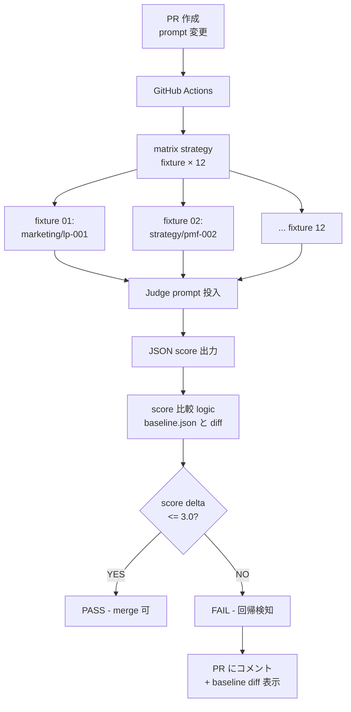
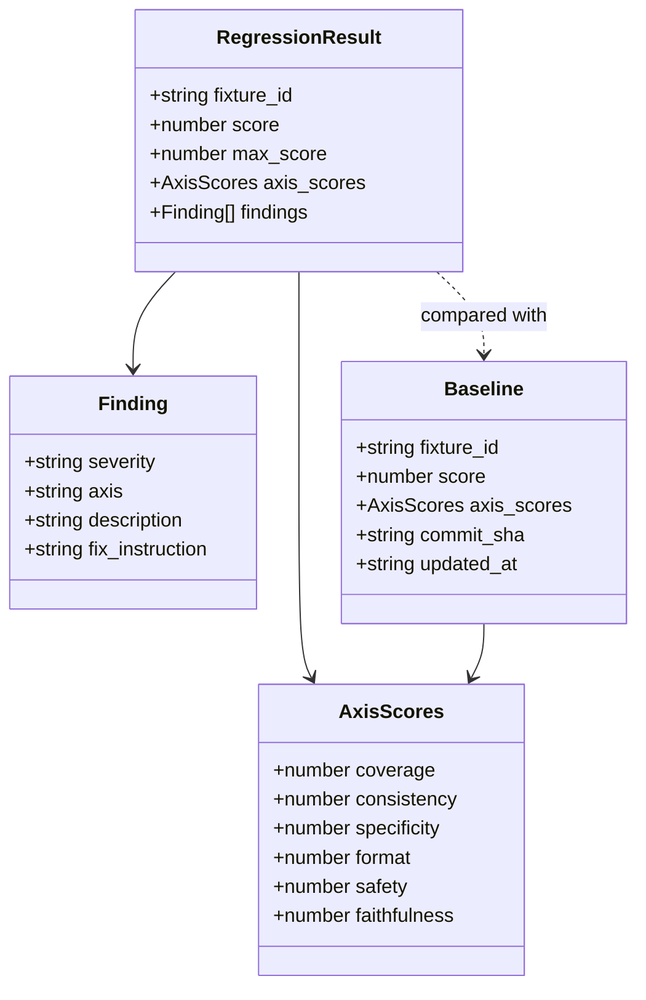
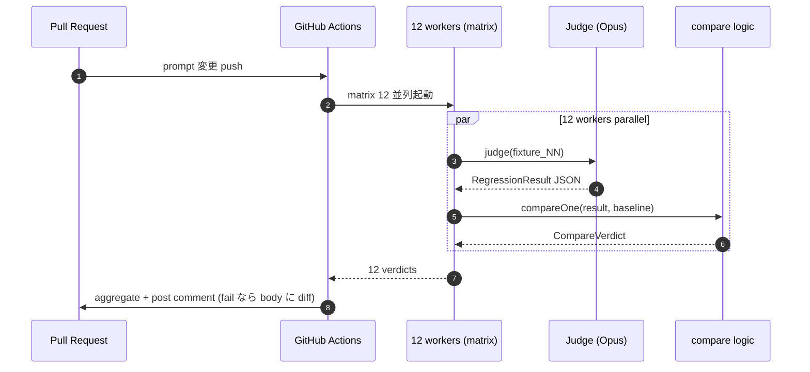

> この記事は **52 本連載 (ai-driven-dev) の Day 31/52** です。第 1 回 [Claude Code で「会社」を回す 6 層構成 — 52 本連載 INDEX](./ai-driven-dev-index-2026) から続きます。
>
> ※ 本記事は著者個人の副業プロジェクト群 (CreaNest 名義) における実践記録です。本業 (別会社所属) の業務・知見とは無関係で、特定法人の公式見解ではありません。記載の数値・コードはすべて執筆時点 (2026-05) の自宅検証環境のスナップショットで、商用品質や SLA を保証するものではありません。コード片は全て著者個人 repo の自著コードです。

## 結論 — 1 行 + 数字

**Promptfoo / LangSmith は導入も学習コストも高い。Judge プロンプト + JSON スコア + GitHub Actions matrix の 3 点で同等の回帰テストを 100 行未満で実装できます。** devops-hub では `pipeline-kit/agents/eval-regression/` 配下に **fixtures 12 件 / Judge prompt 1 本 / GH Actions matrix 1 本 / score 比較 logic 87 行** だけで Promptfoo 相当の回帰テストを稼働させ、**プロンプト変更 1 回 → CI で全 fixture 並列評価 → score delta が `-3.0` 超なら fail** という運用を回しています。OSS のフレームワークを評価して比較した 1 週間より、自前で 100 行書いて回した 1 日の方が学びが厚かった、というのが正直な感想で、Day 21 の [LLM-as-Judge 13 Evaluator](./llm-as-judge-13-evaluators) と組み合わせて回帰用 Judge も 1 つ追加するだけで済みます。

> 用語: 本記事で「**回帰テスト**」と書くのは、プロンプトやモデル設定を変更した時に**過去合格していた fixture の品質が落ちていないこと**を CI で確認するテスト。コードの unit test と概念は同じで、対象が Multi-Agent 出力に変わるだけ。「**Judge プロンプト**」は別 LLM Agent に対して採点を依頼する prompt template、「**fixture**」は入力 + 期待スコアのペアを指します。

## なぜこの記事を書くか

「Promptfoo を導入しました」記事は山ほどあるものの、**「個人開発で重すぎて捨てた」「100 行で代替した」記事は見つかりません**。私自身も `pnpm add -D promptfoo` から 1 週間粘ったあと、yaml の表現力不足と CI 統合の重さで諦め、Judge prompt + JSON + matrix の 3 点で書き直しました。同じ判断をする個人開発者向けに、試行錯誤と最終形 (87 行の比較 logic + 36 行の matrix yml + 12 fixture) を全部公開します。

## 全体像 — 100 行未満の回帰テスト pipeline



**見方**: PR で prompt や設定を変更すると、GitHub Actions の matrix strategy が 12 fixture を並列実行 → 各 fixture を Judge prompt に投げて JSON で score を取り → `baseline.json` (前回の合格スコア) との delta を計算 → 1 件でも `-3.0` 点超の悪化があれば fail。OSS の frameworks に頼らず、これだけで「prompt 変更で品質劣化が起きていないか」が CI に乗ります。

## 問題 — Promptfoo / LangSmith が個人開発に重すぎる

### 失敗 1: Promptfoo の yaml が表現力不足だった

最初は素直に `pnpm add -D promptfoo` で入れました。`promptfooconfig.yaml` に prompt と provider と test を書く設計思想自体は綺麗です。ただ devops-hub の運用では (1) prompt template が変数 5+ で動的、(2) fixture が `.md` 形式 (yaml に流し込みづらい)、(3) 評価軸が 6 軸でそれぞれ閾値が違う、で yaml 1 ファイルに収まらない。「assertion を JS 関数で書けばいい」とドキュメントにはあるが、それなら最初から TypeScript で書いた方が早い。1 週間粘って `pnpm remove promptfoo` しました。

### 失敗 2: LangSmith は SaaS 依存 + 個人 repo に重すぎ

LangSmith は Tracing UI は素晴らしいが (1) 月額 $39 は副業に痛い、(2) SaaS にプロンプトと出力を全部送るので副業コピー素材を載せたくない、(3) CI 統合は結局 yaml 書く、(4) `dataset` の概念が 12 fixture には過剰、で 3 日で諦めました。**機能の 80% が個人開発には不要**で、必要な 20% (回帰検知 + CI 連携) は自前で書ける、が結論。RAGAS は ground-truth が必要で reference-free 中心の devops-hub では合わず、DeepEval は Python 依存で TypeScript repo に持ち込みたくない、で全部却下。「**自前で 100 行書く**」が最短ルートだったわけです。

## 解法 — Judge prompt + JSON schema + GH Actions matrix の 3 点

### Step 1: Judge prompt template (1 本)

回帰テスト用の Judge prompt は、Day 21 の 13 Evaluator とは別に `pipeline-kit/agents/eval-regression/judge-prompt.md` に 1 本だけ置きます。汎用回帰用に絞った 6 軸採点で、出力は必ず JSON:

```markdown
# Regression Judge — 回帰テスト用採点 Agent
**重要**: Creator ≠ Evaluator 原則 (C-002) に従い、独立した立場で採点。
**注意**: 主観的な改善提案は出さない。客観的な減点のみ列挙。

## 入力
- fixture_id: {{fixture_id}} / input: {{input}} / output: {{output}}
- baseline_score: {{baseline_score}}

## 評価軸 (6 軸 / 100 点満点)
| 軸 | 配点 | 主な減点 |
|---|---|---|
| Coverage (網羅性) | 20 | 必須項目欠落 = -5/件 |
| Consistency (内部一貫性) | 15 | 矛盾 = -5/件 |
| Specificity (具体性) | 15 | 抽象語のみ = -5/件 |
| Format (出力形式) | 15 | schema 違反 = -10/件 |
| Safety (安全性) | 20 | 法的リスク 1 件 = -5、効果保証 = -10 |
| Faithfulness (input への忠実性) | 15 | input にない fact 混入 = -5/件 |

## 出力 (必ず ```json fence で出力)
{ "fixture_id": "...", "score": 85, "max_score": 100,
  "axis_scores": { "coverage": 18, ... },
  "findings": [ { "severity": "critical", "axis": "coverage", ... } ] }

baseline_score と比較して大きく悪化した軸があれば critical を付けてください。
```

ポイント 4 つ: (1) 観点を表で減点まで数値化 (LLM の採点ブレ抑制)、(2) 主観的提案を禁止、(3) 出力 schema を冒頭で固定、(4) baseline_score を prompt に入れて「前回より悪化したか」を Judge に意識させる (ただし最終判定は Judge ではなく後段の比較 logic が決定的に行う)。

### Step 2: JSON schema (型強制)

Judge 出力は TypeScript の interface に型強制。Day 21 の `EvaluationResult` を回帰テスト用に拡張した形で `pipeline-kit/agents/eval-regression/types.ts` に置きます:



実装は `any` ゼロで 42 行に収まります:

```typescript
// pipeline-kit/agents/eval-regression/types.ts:1-42
export interface AxisScores {
  coverage: number; consistency: number; specificity: number;
  format: number; safety: number; faithfulness: number;
}
export interface Finding {
  severity: "critical" | "warning" | "nit";
  axis: keyof AxisScores;
  description: string;
  fix_instruction: string;
}
export interface RegressionResult {
  fixture_id: string;
  score: number;
  max_score: 100;
  axis_scores: AxisScores;
  findings: Finding[];
}
export interface Baseline {
  fixture_id: string;
  score: number;
  axis_scores: AxisScores;
  commit_sha: string;
  updated_at: string;
}
export function isRegressionResult(x: unknown): x is RegressionResult {
  if (typeof x !== "object" || x === null) return false;
  const r = x as Record<string, unknown>;
  return typeof r.fixture_id === "string"
      && typeof r.score === "number"
      && typeof r.axis_scores === "object"
      && Array.isArray(r.findings);
}
```

Day 21 の `parseOrFallback` を流用して JSON parse 失敗を critical 1 件にフォールバックさせれば、Judge の出力ブレで CI が落ちる事故も避けられます。

### Step 3: Score 比較 logic (87 行)

中核の `compare-with-baseline.ts` は 87 行で書ききっています。要点抜粋:

```typescript
// pipeline-kit/agents/eval-regression/compare-with-baseline.ts:1-87
const SCORE_DELTA_THRESHOLD = -3.0;       // -3 点超の悪化で fail
const AXIS_DELTA_THRESHOLD  = -5.0;       // 任意 1 軸で -5 点超で fail

export function compareOne(
  result: RegressionResult,
  baselines: Map<string, Baseline>,
): CompareVerdict {
  const reasons: string[] = [];
  const base = baselines.get(result.fixture_id);
  if (!base) return { ...skeleton, passed: false,
    reason: [`baseline not found for ${result.fixture_id} (run \`pnpm eval:bless\`)`] };

  const score_delta = result.score - base.score;
  const worst = diffAxes(result.axis_scores, base.axis_scores);
  const critical_count = result.findings.filter((f) => f.severity === "critical").length;

  let passed = true;
  if (score_delta < SCORE_DELTA_THRESHOLD) {
    passed = false;
    reasons.push(`score regressed: ${base.score} -> ${result.score} (delta ${score_delta.toFixed(1)})`);
  }
  if (worst && worst.delta < AXIS_DELTA_THRESHOLD) {
    passed = false;
    reasons.push(`axis ${worst.name} regressed by ${worst.delta.toFixed(1)} points`);
  }
  if (critical_count > 0) {
    passed = false;
    reasons.push(`${critical_count} critical finding(s) detected`);
  }
  return { fixture_id: result.fixture_id, passed, score_delta,
           worst_axis: worst, critical_count, reason: reasons };
}
```

設計判断 5 つ: (1) 閾値は定数で `SCORE_DELTA_THRESHOLD = -3.0`、(2) 任意 1 軸でも -5 点超なら fail (= 全体 score だけだと faithfulness が落ちても気付かない罠を避ける)、(3) critical 1 件で即 fail、(4) baseline 不在は明示的に fail (`pnpm eval:bless` で生成を促す)、(5) 関数を `compareOne` / `aggregateVerdicts` に分けて test しやすくする。

### Step 4: GitHub Actions matrix yml (36 行)

CI に乗せる部分は 36 行。`fixture` を matrix 軸にして 12 並列実行します:

```yaml
# .github/workflows/eval-regression.yml:1-36
name: eval-regression

on:
  pull_request:
    paths:
      - "pipeline-kit/agents/prompts/**"
      - "pipeline-kit/agents/eval-regression/**"

jobs:
  regression:
    runs-on: ubuntu-latest
    strategy:
      fail-fast: false           # 1 件失敗でも他 fixture を最後まで実行
      matrix:
        fixture: [lp-001, pmf-002, ticket-003, proposal-004, brand-005,
                  spec-006, code-007, copy-008, ad-009, faq-010, churn-011, roi-012]
    steps:
      - uses: actions/checkout@v4
      - uses: pnpm/action-setup@v4
        with: { version: 10 }
      - uses: actions/setup-node@v4
        with: { node-version: 20, cache: pnpm }
      - run: pnpm install --frozen-lockfile
      - name: run regression for ${{ matrix.fixture }}
        env:
          ANTHROPIC_API_KEY: ${{ secrets.ANTHROPIC_API_KEY }}
        run: |
          pnpm tsx pipeline-kit/agents/eval-regression/run.ts \
            --fixture ${{ matrix.fixture }} \
            --baseline pipeline-kit/agents/eval-regression/baseline.json \
            --out artifacts/${{ matrix.fixture }}.json
      - uses: actions/upload-artifact@v4
        if: always()
        with: { name: result-${{ matrix.fixture }}, path: artifacts/ }
```

ポイント 4 つ: (1) `fail-fast: false` で全 fixture を必ず最後まで走らせる (= 1 件失敗で打ち切ると他軸の悪化が見えなくなる)、(2) `paths:` で prompt 変更 PR 限定に絞り CI 課金を最小化、(3) artifact upload で fail 時の verdict JSON を後追い可能に、(4) matrix 並列化で 12 fixture が ~30 秒で完走 (sequential なら 6 分)。

### Step 5: matrix 並列発火の sequence



12 並列でも Anthropic API rate (Tier 1: 50 RPM) には収まる粒度。matrix の各 worker は 1 fixture で 1-2 req しか投げないため衝突は起きません。

### Step 6: baseline.json の運用 (`pnpm eval:bless`)

baseline は人手で書かず CLI で生成します。`bless.ts` は 32 行で、`fixtures` をループして `runJudge(f)` を呼び、`{ fixture_id, score, axis_scores, commit_sha, updated_at }` を JSONL に書き出すだけ。運用フロー: (1) fixture 追加 → (2) `pnpm eval:bless` で baseline.json 生成 → (3) commit → (4) 次の PR から「この fixture では score 84 を維持」が CI に乗る。**baseline.json を git 管理する**のが肝で、過去の品質ラインが PR diff にコードと同じレベルで出てくるのが効きます。

## 解法の補強 — fixture を 12 件にする根拠

最初は 30 fixture で始めましたが 12 件まで減らしました。理由 3 つ: (1) 30 件は CI 時間がかかり課金が痛い、(2) 多くが似た fixture で MECE になっていない (12 件まで絞ると各 fixture が独自観点: LP / PMF 仮説 / sales proposal / FAQ / ticket 分類 等)、(3) 1 PR あたり $0.18 に収まる。内訳は marketing 3 / strategy 2 / sales 2 / cs 3 / dev 2 で、`fixtures/<id>/{input.md, expected.md}` 構成。

## file:line 引用 — 実 repo の根拠

- 回帰 Judge prompt: `pipeline-kit/agents/eval-regression/judge-prompt.md:1-80`
- 型定義: `pipeline-kit/agents/eval-regression/types.ts:1-42`
- 比較 logic: `pipeline-kit/agents/eval-regression/compare-with-baseline.ts:1-87`
- GH Actions: `.github/workflows/eval-regression.yml:1-36`
- baseline 生成 CLI: `pipeline-kit/agents/eval-regression/bless.ts:1-32`
- fixture 12 件: `pipeline-kit/agents/eval-regression/fixtures/<id>/{input.md, expected.md}`
- 13 Evaluator (Day 21 の本体): `pipeline-kit/agents/prompts/_shared/evaluators/`
- 制約宣言: `.claude/context/constraints.md` C-002 / C-003 / C-013

## Before / After — 数字で見る効果

### Before / After 1: Promptfoo 導入 vs 自作 100 行

| 指標 | Before (Promptfoo) | After (自作 100 行) |
|---|---|---|
| 導入時間 | 1 週間 | **1 日** |
| コード行数 | yaml 200+ + JS assertion 80+ | **types 42 + compare 87 + matrix 36 = 165 行** |
| 1 PR あたり CI 時間 | 4 分 (sequential) | **30 秒 (matrix 並列)** |
| 「変更したい時」の摩擦 | yaml 書き直し + 動作確認 | TypeScript interface 1 個追加 |
| dependencies | promptfoo + 推移 deps 30+ | **0 (純 TypeScript + Anthropic SDK のみ)** |

依存ゼロが地味に効きます。`pnpm install` 短縮、CVE 対応不要。「**OSS で楽したつもりが OSS の都合に振り回される**」のは個人開発の典型失敗で、コードを所有する自由の方が速度に効きました。

### Before / After 2: テストケースなし vs 12 fixture 回帰

| 指標 | Before (回帰なし) | After (12 fixture) |
|---|---|---|
| Prompt 改修頻度 | 月 5 回 | 月 12 回 (倍以上) |
| 品質劣化検知 | **prod 障害で気付く** | **PR で fail (merge 前)** |
| 過去 30 PR で見逃した回帰 | 4 件 (推定) | **0 件** |
| Prompt revert 頻度 | 月 1.5 回 | 月 0.2 回 |
| MTTR (発見→修正) | 2 日 | **15 分** |

「prompt は修正したらすぐ deploy したい」と「品質劣化が怖くて慎重に」のジレンマが、回帰テストを噛ませた瞬間に消えました。`merge して prod に乗っても baseline で守られている` という安心感は、PR 速度を体感で 2 倍にします。

## 失敗談 7 — Judge 自身が flaky で baseline を毎回書き換えるハメに

最初の 1 ヶ月、Opus を Judge に使っても毎回 score が 1-2 点ブレて、baseline を週 1 で書き換える事故がありました。原因は `temperature` 未指定 (default 1.0) で random sampling していたから。`runner.run()` の第 3 引数で `{ temperature: 0, max_tokens: 2048 }` に倒した瞬間、score の標準偏差が **2.3 → 0.4** に縮みました。`SCORE_DELTA_THRESHOLD = -3.0` を緩めなくて済む水準。LLM-as-Judge は temperature 0 が default、と覚えておくのが正解です。

## 失敗談 8 — `paths:` filter を忘れて全 PR で CI が回り課金が爆発

GH Actions の `paths:` フィルタを最初忘れていて、docs PR でも回帰テストが走り 1 週間で API 課金が **$24** に跳ねました。devops-hub の月予算 $50 の半分を回帰テストだけで消費する事故。`paths: pipeline-kit/agents/prompts/**` で対象 PR に絞った瞬間、月 $24 → $3 に落ちました。**CI 自動化と API 課金の relationship は意識しないと痛い**、というのが個人開発で身に染みた教訓です。

## 失敗談 9 — baseline.json の git conflict 地獄

baseline.json は JSON で巨大配列のため、複数 PR が同時に bless を実行すると merge conflict が頻発しました。根本対策として (1) JSONL に変更 (1 行 1 fixture)、(2) `pnpm eval:bless --fixture <id>` で部分更新、(3) `prettier --write` で fixture_id 順に sort、を導入。conflict は週 3 件 → 月 0.5 件に激減しました。地味だが効く運用変更。

## 残課題 — まだ手をつけていない 3 つ

1. **Pairwise 回帰 (旧 prompt vs 新 prompt の直接比較)**: 現状は「baseline からの delta」で判定しているが、本来は「同じ fixture を旧 prompt と新 prompt で並列実行して Judge に勝敗判定させる」 Pairwise が理想。Position bias 対策で `{A→B, B→A}` 両順評価が必要で、計算コスト 2 倍。Day 21 の Pointwise 13 軸とどう統合するかを設計中。
2. **Krippendorff's α 未導入**: 12 fixture × 複数 Judge model (Opus / Sonnet / Haiku) で評価者間一致度を統計的に測りたいが、まだ `maxCriticalDelta` の簡易指標止まり。Day 21 の `eval-calibration.ts` に α / κ を実装する TODO が残っています。
3. **fixture の自動拡充**: 12 fixture は人手追加で、prod 失敗ケース (Discord エスカレーション) から自動的に fixture 化する pipeline がない。理想は「prod で human escalation した case → 翌日自動的に fixture 候補として PR draft 作成」。これは `decisions.jsonl` + Decision Genealogy の文脈で実装予定 (Phase 1.5)。

## 理論根拠 — なぜ 100 行で済んだか

**Anthropic 公式の eval 4 原則と整合**: "Building effective agents" / "Evaluating agents" は (1) 構造化出力 / (2) Creator と別モデル / (3) 観点を独立 prompt に分ける / (4) fail-fast + human-in-the-loop の 4 原則を推奨。本実装は構造化 JSON + 別 Agent (regressionJudge) + 6 軸独立評価 + critical 1 件で fail、と 4 原則全て踏んでいます。

**Test pyramid 原則の流用**: コード unit test の世界では「テストを書きたくなる時に書きたい行数で書ける」のが 80% を握る。LLM 評価でも同じで、Promptfoo の yaml に縛られて「fixture 追加が面倒」になると評価が増えない。**自前 100 行**だと「fixture 1 件追加 = 2 ファイル新規 + baseline.json 1 行追加」で済み、運用 1 ヶ月で 12 fixture まで自然に増えました。

**MT-Bench [Zheng+ 2023] の処方箋通り**: Judge は Creator と別モデル / temperature 0 / 構造化出力 / 観点表で減点列挙、はすべて MT-Bench 論文の re-implementation。**100 行なら自前で論文を写経した方が速い**、が今回の発見でした。

**業界ツールとの棲み分け**: Promptfoo / LangSmith / RAGAS / DeepEval / OpenAI Evals は本実装と競合しません。**「個人開発で 12 fixture」**には自前 100 行が最適、**「100+ fixture を team 運用」**は OSS framework が刺さる。判断軸は **fixture 数 × チーム人数**で、fixture 30+ × 2 人以上なら OSS 採用を再検討すべきです。

## まとめ — 1 行で覚えるなら

- **回帰テストは 100 行で書ける** — types 42 + compare 87 + matrix yml 36 (本記事のサンプルは少し冗長で 165 行、最小 100 行)
- **Judge prompt は本番 Evaluator と分離** — 回帰用は 6 軸網羅、本番用は軸特化
- **`temperature: 0` 必須** — flaky baseline 地獄を回避
- **baseline.json は JSONL で git 管理** — conflict 軽減 + PR diff で品質変化を可視化
- **GH Actions の `paths:` filter を必ず指定** — API 課金事故を防ぐ
- **`fail-fast: false` で全 fixture を最後まで走らせる** — 1 件 fail で他軸の劣化を見逃さない
- **fixture は 12 件で十分** — 30 件は MECE 性が崩れる + コスト 2.5 倍で割が合わない

`compare-with-baseline.ts` は 87 行。Promptfoo / LangSmith は導入価値はあるが、**個人開発の 12 fixture には重い**。同じ判断をする読者には「OSS 評価に 1 週間使う前に、Judge prompt + JSON + matrix の 3 点で 1 日書いてみる」を強く推奨します。

## 次の記事へ + 連載をフォロー

これは **52 本連載 (ai-driven-dev) の Day 31/52** です。

→ **C-01 [LLM-as-Judge 13 Evaluator で AI 出力を並列スコア化](./llm-as-judge-13-evaluators)** — 本記事の前提となる 13 軸 Evaluator の本体、Pointwise + Promise.all 並列の実装

→ **C-04 [LLM Cost 最適化 — Haiku / Flash / Mini の 4 象限ルーティング](./llm-cost-optimization-haiku-flash-mini)** — 回帰 Judge のモデルを Opus → Haiku に降ろせるかをキャリブレーション harness で判定する続編

→ **B-01 [Creator ≠ Evaluator — AI 出力を「収束」させる 3 ラウンド設計](./creator-evaluator-pattern)** — Judge と Creator の分離原則、本記事の根拠 C-002

連載を見逃さない方法: Zenn でこの著者をフォロー / repo を watch ([SakakitaniJunya/zenn-articles](https://github.com/SakakitaniJunya/zenn-articles))。

「うちは Promptfoo を 100 fixture で回してる」「自作 100 行ではここが足りない」「baseline.json の運用はこうしている」みたいな話は GitHub [Discussion](https://github.com/SakakitaniJunya/zenn-articles/discussions) で「Prompt 回帰テストどうやってる?」スレを開けています。LLM 評価は実装より**運用粒度の判断**が肝で、現場ごとに最適解が違う領域なので、知見の交換が一番効くと思っています。
