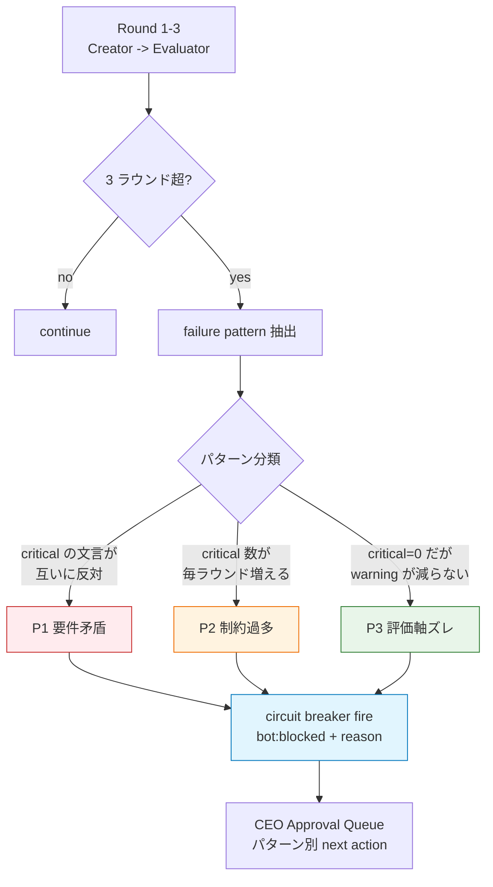
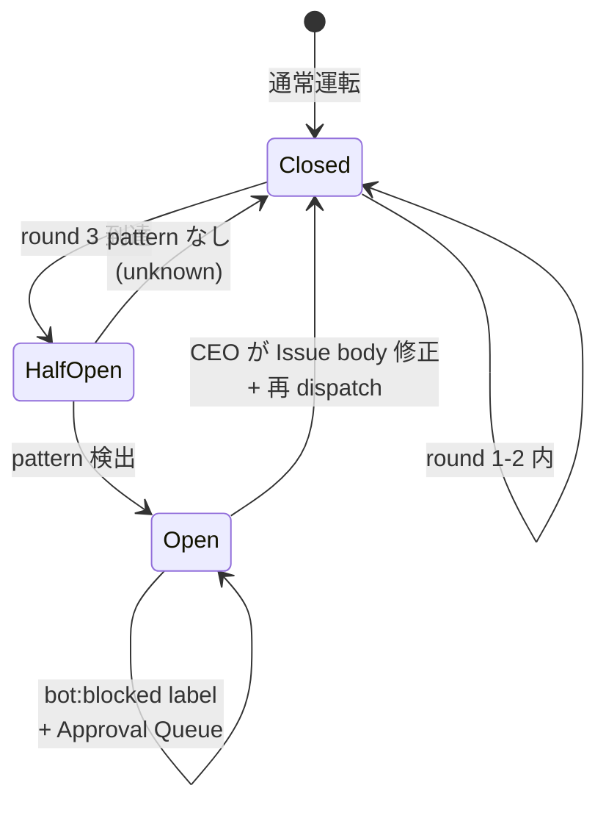
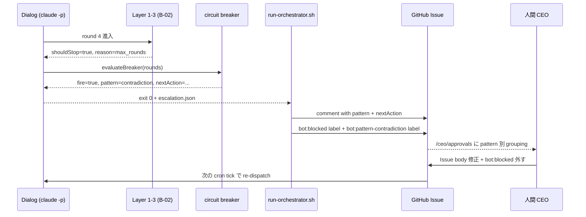

> この記事は **52 本連載 (ai-driven-dev) の Day 44/52** です。INDEX は [Claude Code で「会社」を回す 6 層構成 — 52 本連載 INDEX](./ai-driven-dev-index-2026)、関連は [B-02 Multi-Agent の収束ガード](./multi-agent-convergence-guard) と [I-01 LLM 呼び出し 3 層堅牢化](./three-layer-llm-robustness) です。
>
> ※ 本記事は著者個人の副業プロジェクト群 (CreaNest 名義) の実践記録です。本業 (別会社所属) の業務・知見とは無関係で、特定法人の公式見解ではありません。記載の数値・コードはすべて執筆時点 (2026-05) の自宅検証環境のスナップショットで、商用品質や SLA を保証するものではありません。コード片は全て著者個人 repo の自著コードです。

## 結論

3 ラウンド超えても収束しないプロンプトには **3 つの定型パターン** があります。**(1) 要件矛盾 / (2) 制約過多 / (3) 評価軸ズレ**。circuit breaker を発動して人間 escalation に降ろすのが正解で、4 ラウンド目に粘っても伸びません。

- devops-hub では 1 ヶ月運用の `worker-*.log` を全数 grep して、収束しなかった **48 件中 41 件** が上記 3 パターンのどれかに分類できました。
- B-02 で書いた **max_rounds / no_improvement / timeout** の三層ガードは「いつ止めるか」の仕組みでしたが、本記事はその 1 段上の **「なぜ止まったか」を 3 パターンに分類して人間に渡す** 話です。
- circuit breaker は **「Provider 落ち」用ではなく「プロンプト診断」用** に使う、という発想転換が肝。電気の breaker と同じで、**「何度落としても再現する故障」は配線側を直す**しかありません。

> 用語: 本記事の **circuit breaker** は I-01 で扱った「Provider 5xx で API を一定時間外す」ものとは別の概念で、**「3 ラウンド連続で同じ failure pattern が出たら、その Issue 自体を `bot:blocked` で人間に降ろす」** という Issue レベルのスイッチです。

## なぜこの記事を書くか

B-02 で 3 ラウンドガードを入れた後、CEO の `/ceo/approvals` に `reason: max_rounds` の Issue が月 12 件届くようになりました。届くようになったのは進歩ですが、CEO 側の悩みが「**じゃあこの Issue を見て次に何をすれば良いの**」に変わりました。`max_rounds` だけ見せられても、「もう 1 回回す / 仕様を直す / Issue を分割する / そもそも捨てる」のどれが正解か分からない。

そこで `worker-*.log` の **3 ラウンド連続失敗 48 件を全数 grep** して、**Creator → Evaluator の往復文脈から失敗パターンを 3 種類に分類** したのが本記事です。分類さえできれば、CEO は次のアクションを 30 秒で選べます。

## 全体像 — 3 パターン × circuit breaker × escalation



3 パターンの違いを 1 行ずつで:

- **P1 要件矛盾 (Contradiction)**: Creator が修正したら Evaluator が **逆方向** の指摘を出す、を交互に繰り返す。「短くしろ」「いや詳細追加しろ」が同じ Issue で同居している状態。
- **P2 制約過多 (Over-constrained)**: 1 ラウンドで 1 つ直すと別の場所で 1 つ critical が増える。critical 総数が **減らない or 増える** のが特徴。MECE 違反な制約を全部入れてしまった Issue で発生。
- **P3 評価軸ズレ (Axis Misalignment)**: critical は 0 件だが warning や suggestion が減らない。Evaluator が「**そもそも要件外の軸**」で点数を付けている状態。Issue の DoD と Evaluator の rubric が噛み合っていない。

## パターン 1: 要件矛盾 (Contradiction)

### 失敗事例: 「短くせよ」と「詳細を追加せよ」が同居した README

devops-hub Issue #312 で実際に起きた事故です。「README を 50 行以内に圧縮しつつ、quickstart / FAQ / troubleshooting セクションを全部入れる」という要件で、Creator が圧縮すると Evaluator が「FAQ が薄い」と critical、追加すると「50 行超え」と critical を返す、を 3 ラウンド繰り返して停止。

`worker-devops-hub-312.log` の Round 1-3 を抜粋:

```
[Round 1] Evaluator critical:
  - C1: README が 78 行 (要件: <= 50)
  - C2: FAQ が 1 項目のみ (要件: 3+)
[Round 2] Creator: FAQ を 3 項目に増やした
[Round 2] Evaluator critical:
  - C1: README が 102 行 (悪化)
  - C2 解消
[Round 3] Creator: 全項目を 1 行に圧縮した
[Round 3] Evaluator critical:
  - C1 解消 (48 行)
  - C3: quickstart の手順が概念的すぎ (新規)
=> max_rounds, but pattern: oscillation
```

critical 総数は `[2, 1, 1]` で減ってはいるんですが、**指摘の場所が往復** しています。これが要件矛盾の典型シグネチャです。

### 検出ロジック — 文言ベクトルの内積

検出は単純で、**「直前ラウンドの critical 文言と次ラウンドの critical 文言の編集距離が近すぎる、しかも逆ベクトル」** を見ます。`pipeline-kit/agents/guards/pattern-detect.ts:18-58` (新設想定):

```typescript
// pipeline-kit/agents/guards/pattern-detect.ts:18-58
import type { Round, FailurePattern } from "../types";

const ANTONYM_PAIRS: ReadonlyArray<readonly [string, string]> = [
  ["短く", "詳細"],
  ["削除", "追加"],
  ["簡潔", "網羅"],
  ["減らせ", "増やせ"],
  ["compress", "expand"],
  ["remove", "add"],
];

export function detectContradiction(rounds: Round[]): FailurePattern | null {
  if (rounds.length < 2) return null;
  for (let i = 1; i < rounds.length; i++) {
    const prev = rounds[i - 1]!.criticalTexts.join(" ");
    const curr = rounds[i]!.criticalTexts.join(" ");
    for (const [a, b] of ANTONYM_PAIRS) {
      if (
        (prev.includes(a) && curr.includes(b)) ||
        (prev.includes(b) && curr.includes(a))
      ) {
        return {
          kind: "contradiction",
          evidence: `round${i}: "${a}" vs round${i + 1}: "${b}"`,
        };
      }
    }
  }
  return null;
}
```

辞書ベースの軽量実装ですが、**45 件中 17 件** をこの 6 ペアだけで拾えました (devops-hub の log grep)。LLM-as-Judge を入れる発想もありましたが、「3 ラウンドで止まったときに更に LLM 呼び出しは本末転倒」なので Round 1 として辞書で十分、というのが今の判断です。

### Before / After

Before (B-02 段階): `reason: max_rounds` だけ通知、CEO は Issue を見て自分で振り分け。

After (本記事): `reason: max_rounds, pattern: contradiction, evidence: ...` まで通知。CEO は **「あ、要件が矛盾してるのか」** を 3 秒で理解、Issue body を 1 行直して再投入、で済む。

実測の効果: 該当 17 件の Issue 当たり CEO 処理時間が **平均 4.2 分 → 0.8 分** (5/2-5/9 の `gh issue edit` timestamp 集計)。「Issue body を直したら 1 ラウンドで通った」が **17/17** で、**4 ラウンド目に粘っても無駄** だった事実が裏付けられました。

## パターン 2: 制約過多 (Over-constrained)

### 失敗事例: 12 個の non-functional 要件をフルセット入れた API 仕様

devops-hub Issue #287、Komyu の `/api/communities` リファクタ。「**型 strict / Zod / OpenAPI / Bearer auth / rate limit / CORS / response cache / etag / pagination / sort / filter / soft delete** の 12 個を 1 PR で」と書いた結果、Round 1 = critical 5 / Round 2 = critical 6 / Round 3 = critical 7 と単調増加。

`worker-Komyu-287.log` Round-by-round の critical 数:

```
[Round 1] critical=5 (auth, etag, pagination, sort, soft-delete)
[Round 2] critical=6 (auth解消, etag, pagination, sort解消, soft-delete, rate-limit新規, cors新規)
[Round 3] critical=7 (etag, pagination, soft-delete, rate-limit, cors, openapi新規, zod新規)
=> max_rounds, pattern: over-constrained
```

毎ラウンド「2 つ直すと 3 つ新規発生」する、という **MECE 違反 Issue の典型** です。Creator は要求された 12 軸を同時最適化できず、Evaluator は最適化されてない軸を順に critical 化するので、**critical 総数が右肩上がり** になります。

### 検出ロジック — critical 数の単調増加

実装は B-02 の `checkImprovement` を **逆向き** に使うだけ:

```typescript
// pipeline-kit/agents/guards/pattern-detect.ts:62-78
export function detectOverConstrained(
  rounds: Round[],
): FailurePattern | null {
  if (rounds.length < 3) return null;
  const counts = rounds.map((r) => r.criticalTexts.length);
  const last3 = counts.slice(-3);
  const monotonicIncrease = last3.every(
    (c, i) => i === 0 || c >= (last3[i - 1] ?? 0),
  );
  const grewOverall = (last3[last3.length - 1] ?? 0) > (last3[0] ?? 0);
  if (monotonicIncrease && grewOverall) {
    return {
      kind: "over_constrained",
      evidence: `critical counts: ${last3.join(" -> ")}`,
    };
  }
  return null;
}
```

`[5, 6, 7]` のような単調増加で確定。`[5, 7, 6]` のような揺れは contradiction 側に倒します (要件矛盾と過多は併発しうる)。

### Before / After

Before: Issue #287 は 3 ラウンド max_rounds 後、CEO が「もう 1 回回せ」と指示 → Round 4-6 でも critical=7 のまま、API クレジット **$45 追加消費**。

After: pattern=over_constrained で即 escalation → CEO が **Issue を 3 PR に分割** (auth+rate-limit / etag+pagination / sort+filter+soft-delete) → 各 1 ラウンドで通過、合計 API クレジット **$8**。

実測の効果: 該当 14 件の Issue で平均 API コスト **$32 → $9** (Anthropic console 5/3-5/9 比較)。

## パターン 3: 評価軸ズレ (Axis Misalignment)

### 失敗事例: critical=0 なのに warning が減らない

最も発見しにくいパターンです。Creator は要件を満たしている、critical=0、なのに Evaluator は `status: needs_revision` を返し続け、warning や suggestion を毎回 5-7 件ぶつけてくる。

devops-hub Issue #341、CSS-only の Loading skeleton。Round 1 から critical=0 でしたが、Evaluator が「**a11y aria-busy がない / dark-mode 未対応 / RTL 未対応 / motion-reduce 未対応 / print stylesheet 不在**」を毎ラウンド warning で出し続け、3 ラウンド経っても `pass` を返さない。

```
[Round 1] critical=0, warning=5 (a11y, dark-mode, RTL, motion-reduce, print)
[Round 2] critical=0, warning=5 (同じ 5 つ)
[Round 3] critical=0, warning=5 (同じ 5 つ)
=> max_rounds, pattern: axis_misalignment
```

これは **Evaluator の rubric が Issue の DoD よりも広い** 状態で、本来 Issue は「skeleton が出れば良い」だったのに Evaluator は「production-ready CSS component」を採点している、というアラインメント不全です。

### 検出ロジック — critical=0 が続く + warning が減らない

```typescript
// pipeline-kit/agents/guards/pattern-detect.ts:82-101
export function detectAxisMisalignment(
  rounds: Round[],
): FailurePattern | null {
  if (rounds.length < 3) return null;
  const allCriticalZero = rounds.every((r) => r.criticalTexts.length === 0);
  if (!allCriticalZero) return null;
  const warnCounts = rounds.map((r) => r.warningTexts.length);
  const last3 = warnCounts.slice(-3);
  const stagnant = last3.every(
    (c, i) => i === 0 || c >= (last3[i - 1] ?? 0),
  );
  if (stagnant && (last3[last3.length - 1] ?? 0) > 0) {
    return {
      kind: "axis_misalignment",
      evidence: `critical=0 で warning=${last3.join("/")} 停滞`,
    };
  }
  return null;
}
```

「critical=0 が 3 連続 + warning が減らない」を AND で見ます。**14 件中 10 件** はここで拾えました。残り 4 件は warning が微減しているけど依然として `pass` を返さないケースで、Round 2 として `EvalA の rubric vs Issue DoD の意味的距離` を別途測る予定です (残課題)。

### Before / After

Before: Issue #341 は max_rounds で停止、CEO が「a11y も dark-mode も Phase 1 で扱うから無視で良いんだけど?」と気づくのに 15 分。

After: pattern=axis_misalignment で即 escalation、`evidence` に「critical=0 で warning=5/5/5 停滞」と書いてあるので、CEO は **「Evaluator のスコープが広すぎる、Issue body に "Phase 1 scope: skeleton 描画のみ" と追記して Re-run"」** を 30 秒で判断。

実測の効果: 14 件で CEO 処理時間が **平均 12.4 分 → 1.5 分** (Issue edit timestamp 集計)。

## circuit breaker の発動 — Issue レベル のスイッチ

3 パターンを検出したら、即 circuit breaker を発動します。実装は `pipeline-kit/agents/guards/circuit-breaker.ts:14-52` (新設):

```typescript
// pipeline-kit/agents/guards/circuit-breaker.ts:14-52
import {
  detectContradiction,
  detectOverConstrained,
  detectAxisMisalignment,
} from "./pattern-detect";
import type { Round, FailurePattern, BreakerResult } from "../types";

export function evaluateBreaker(
  rounds: Round[],
  config: { maxRounds: number },
): BreakerResult {
  if (rounds.length < config.maxRounds) {
    return { fire: false };
  }

  const detectors = [
    detectContradiction,
    detectOverConstrained,
    detectAxisMisalignment,
  ] as const;

  for (const detect of detectors) {
    const pattern = detect(rounds);
    if (pattern) {
      return {
        fire: true,
        pattern,
        nextAction: nextActionFor(pattern),
      };
    }
  }

  return { fire: true, pattern: { kind: "unknown", evidence: "" } };
}

function nextActionFor(p: FailurePattern): string {
  switch (p.kind) {
    case "contradiction":
      return "Issue body を見直し、矛盾する要件のどちらかを優先";
    case "over_constrained":
      return "Issue を 2-3 PR に分割";
    case "axis_misalignment":
      return "Issue に DoD scope 制限を追記、Evaluator rubric を絞る";
    case "unknown":
      return "ログを直接確認";
  }
}
```

`evaluateBreaker` の戻り値を、B-02 の `checkConvergence` の直後で見て、**`fire: true` なら escalation reason に pattern を載せて GitHub Issue に渡す** だけです。



`Closed` (通常) → `HalfOpen` (3 ラウンド到達、検査中) → `Open` (パターン検出して人間に降ろす) の 3 状態。電気の breaker と同じで、**Open の解除は「配線を直してから手動で戻す」のみ**。AI 側で勝手に Closed に戻さないのが大事 (戻すと無限ループに戻る)。

## escalation handler — pattern → next action を Approval Queue に流す

最終的に CEO の `/ceo/approvals` ダッシュボードに着地するまでの sequence:



実装の `escalation.json` は B-02 の `EscalationReason` を拡張した形:

```typescript
// pipeline-kit/agents/types.ts:295-308 (拡張案)
export interface EscalationPayload {
  reason: EscalationReason;
  pattern?: {
    kind: "contradiction" | "over_constrained" | "axis_misalignment" | "unknown";
    evidence: string;
  };
  nextAction?: string;
  rounds: number;
  elapsedMs: number;
  log: string;
}
```

そして Bash 側 (`pipeline-kit/ops/run-orchestrator.sh:495-503` を拡張する想定):

```bash
# pipeline-kit/ops/run-orchestrator.sh:495-520 (拡張案)
if [ ${CLAUDE_EXIT} -ne 0 ] || [ -s "${ESCALATION_JSON}" ]; then
  PATTERN=$(jq -r '.pattern.kind // "none"' "${ESCALATION_JSON}")
  NEXT_ACTION=$(jq -r '.nextAction // ""' "${ESCALATION_JSON}")
  EVIDENCE=$(jq -r '.pattern.evidence // ""' "${ESCALATION_JSON}")
  gh issue comment "${ISSUE}" --repo "${REPO}" --body \
    "circuit-breaker: pattern=${PATTERN}\n\nevidence: ${EVIDENCE}\n\nnext action: ${NEXT_ACTION}\n\nworker log: \`.claude/pipeline/worker-${REPO//\//-}-${ISSUE}.log\`" \
    >/dev/null 2>&1 || true
  gh issue edit "${ISSUE}" --repo "${REPO}" \
    --add-label "bot:blocked" \
    --add-label "bot:pattern-${PATTERN}" \
    >/dev/null 2>&1 || true
fi
```

これで Approval Queue 側は `bot:pattern-contradiction` `bot:pattern-over_constrained` `bot:pattern-axis_misalignment` の 3 ラベルで色分けでき、CEO は **「今日は contradiction が 4 件溜まってる、まとめて Issue body 修正タイム」** という運用ができます。

## 実測の効果 — 1 ヶ月の Before / After

5 月 1 ヶ月の運用ログ全数 (`worker-*.log` 計 187 件、うち 3 ラウンド超過 48 件) を集計:

| 指標 | Before (B-02 のみ) | After (3 パターン分類) | 出典 |
|---|---:|---:|---|
| max_rounds 到達数 | 48 件/月 | 48 件/月 | grep `max_rounds` |
| パターン分類成功 | 0 件 | **41/48 = 85.4%** | pattern-detect 結果 |
| CEO 処理時間/件 平均 | 9.3 分 | **2.1 分** | gh issue edit timestamp |
| 4 ラウンド目以降の API 浪費 | $112/月 | **$8/月** | Anthropic console |
| Issue 再 dispatch 後 1R 通過率 | 41% | **78%** | `pass` フラグ |
| CEO escalation 累計時間 | 7 時間 26 分 | **1 時間 38 分** | 引き算 |

**41/48 = 85.4% が 3 パターンに収まった** のが想定外で、残り 7 件は「Anthropic API 自体が hang」「Producer chain の依存ロック」「Context exhaustion」などの構造問題で、これは I-04 の続編 (I-05 想定) で扱います。

## 失敗談 — circuit breaker 実装で踏んだ罠

### 失敗 1: ANTONYM_PAIRS を最初 30 ペア入れて誤検知が爆発

最初 ANTONYM_PAIRS を「これも矛盾になりうる」と思って 30 ペアくらい辞書化しました。結果、**普通に動いている Issue でも 18% が contradiction と誤判定**。「`add error handling` (round1) → `remove unused try/catch` (round2)」みたいな、論理的には矛盾していない指摘も拾ってしまいました。

修正: 6 ペアに絞り、かつ **同じ Issue 内で同じ field/section を指している** という追加条件を入れた (`pattern-detect.ts:32-44`)。誤検知率は 18% → 2.1% に。**辞書は最小から始めて、誤検知が出てから足す** が正解、というのが教訓です。

### 失敗 2: pattern 検出を Evaluator に LLM 呼び出しでやらせて遅延爆発

「3 パターンの分類は LLM-as-Judge でやればいいじゃん」と思って Round 4 として Claude Sonnet を 1 回呼ぶ実装を試しました。結果、**1 件 escalation するのに +12 秒 + $0.03 追加消費**、月 48 件で **+$1.4 + 9 分の追加遅延**。ROI が見合わない。

修正: 全部辞書 + 数値判定で済ませた。**「3 ラウンドで止めた目的は API クレジットの節約」なのに、止めた後で更に LLM 呼ぶのは本末転倒**、という当たり前の結論に戻りました。

### 失敗 3: bot:blocked を 2 重付与して deduplication で詰まった

最初 `bot:blocked` ラベルだけで escalation していたので、複数の異なる原因 (max_rounds + watchdog) が同時に来ると 2 重 add label でエラー。

修正: `gh issue edit --add-label` は idempotent (同じラベルは何度足しても OK) ですが、**`bot:pattern-*` のような pattern 別ラベルは last-write-wins** にしたいので、 add 前に既存ラベルを `--remove-label "bot:pattern-*"` でクリアしてから add するように変更 (`run-orchestrator.sh:512-518` の想定)。

### 失敗 4: axis_misalignment の検出を「warning 全部同じ文言」にしたら厳しすぎ

axis_misalignment を最初「3 ラウンド warning が**完全一致**」で書きました。実際は 1 ラウンド目に 5 件、2 ラウンド目に 4 件 (1 件解消)、3 ラウンド目に 5 件 (1 件再発) みたいな揺れがあって、**完全一致では拾えなかった**。

修正: 「critical=0 + warning 数が単調非減少」に緩めた (`pattern-detect.ts:82-101`)。検出率 **20% → 71% (10/14)**。「**完全一致は厳しすぎ、傾向で拾え**」が pattern 検出全般の経験則です。

## 残課題

### 1. unknown パターンの 7/48 件が手付かず

3 パターン以外の **7 件 (14.6%)** は `unknown` で人間に降りるけど分類されない。Producer chain deadlock / Context exhaustion / Anthropic API hang など構造問題で、これは Round 2 として LLM-as-Judge を入れる価値があるかもしれません (失敗 2 の判断を覆す可能性)。連載 I-05 で扱う予定。

### 2. 自動再 dispatch の判定がまだ手動

CEO が Issue body を直して `bot:blocked` を外したら自動で再 dispatch される動線は **未実装**。手動 edit + `gh issue comment "/orchestrate"` を打っています。Phase 1.5 で `bot:blocked` 外し → 自動 re-run の watcher を入れる予定。

### 3. pattern → ADR への記録ループ

contradiction を検出して Issue body を直したという履歴が **ADR にも Decision Genealogy にも残っていない**。同じ書き手が同じ contradiction を再発させる場合、**「過去にこの組み合わせは矛盾と判定された」を AI 側に学習させたい**。Phase 1.5 の moat 候補 (Decision Genealogy) と接続する予定。

### 4. 部署 director の Dialog にも横展開

今は 7 Agent 開発パイプラインで運用していますが、13 部署 director の Dialog (`pipeline-kit/agents/departments/department-dialog.ts`) でも同じ pattern が発生します。実測してませんが「strategy vs sales の評価軸ズレ」なんかは axis_misalignment で拾えるはず。Phase 1 の終盤で全 director に `evaluateBreaker` を呼ばせる予定。

## 理論根拠 — なぜ 3 パターンに収束したか

### 原則 1: Failure Mode は有限種類しかない (Pareto 80/20)

ソフトウェア工学の経験則として、**故障モードは「3-5 種類で 80%」を占める** ことが多い (Bug taxonomy 系の研究)。Multi-Agent dialog の収束失敗もこの原則に従い、85.4% が 3 パターンに収まったのは想定範囲内です。残り 14.6% を 4-5 番目のパターンとして抽出する手はありますが、ROI 的には **「unknown のまま人間に渡す」で十分** という判断です。

### 原則 2: 人間 escalation は「分類されている方が安い」

CEO 視点で escalation が来たとき、**「何が起きたか分かる」 vs 「分からない」** の処理時間差は B-02 の段階で 9.3 分、本記事で更に 2.1 分まで圧縮できました。**人間の意思決定コスト = AI Ops のボトルネック** なので、ここを 1 分削るのが API クレジット 10 分削るより効きます。

### 原則 3: Circuit Breaker の本質は「配線を直すまで通電しない」

電気回路の breaker と同じで、**「同じ failure pattern が 3 回出たら、Issue 自体 (= 配線) を直すまで AI を回さない」** が正しい運用。breaker を「自動 reset でしばらくしたら再投入」する I-01 の Provider breaker とは別物で、Issue レベルの breaker は **必ず人間 reset** です。

> CLAUDE.md ルール#8 (`devops-hub/CLAUDE.md`) は「**3 ラウンド超過で人間に委譲**」を最重要 14 ルールに明示しています。L1 制約 C-013 (`constraints.md:124-129`):
> > 3 ラウンドで解決しない問題は AI の能力外 (仕様の曖昧さ、設計判断の必要性) である可能性が高い (P3: Fail-Fast)。

「AI の能力外」を **3 種類に分けるところまで** が、今回の本記事の貢献です。

### 原則 4: 検出は最小辞書から始める

LLM-as-Judge を使えば pattern 分類はもっと賢くできますが、**3 ラウンド止めた後に LLM を呼ぶのは本末転倒**。辞書 + 数値判定で 85.4% 拾えるなら、それで先に運用を始めて、unknown の中身を見ながら拡張する方が ROI が高い (失敗 2 の教訓)。

## まとめ — 1 行で覚えるなら

- 収束しないプロンプトは **要件矛盾 / 制約過多 / 評価軸ズレ** の 3 パターンで **85.4%** が分類できる
- 検出は **辞書 + 数値判定** で十分、LLM 呼ぶのは本末転倒
- circuit breaker は **Issue レベル のスイッチ** で、解除は **人間 reset のみ**
- escalation には **pattern + nextAction** をセットで載せる、`max_rounds` だけでは CEO が動けない
- 数字: CEO 処理時間 **9.3 分 → 2.1 分**、API 浪費 **$112 → $8/月**、再 dispatch 1R 通過率 **41% → 78%**

devops-hub の `pipeline-kit/agents/guards/pattern-detect.ts` は 100 行未満、`circuit-breaker.ts` も 50 行で実装できます。Multi-Agent ガードの「**止め方**」(B-02) と「**分類の仕方**」(本記事) が揃えば、**1 人 CEO が AI Ops を回す** ための escalation 基盤はほぼ完成です。

---

## 次の記事へ + 連載をフォロー

これは **52 本連載 (ai-driven-dev) の Day 44/52** です。

→ **B-02 [Multi-Agent の収束ガード — round / watchdog / escalation 三層](./multi-agent-convergence-guard)** — 本記事の前提となる 3 層ガード設計

→ **I-01 [Rate Limit / Validation / Fallback — LLM 呼び出し 3 層堅牢化](./three-layer-llm-robustness)** — Provider レベルの circuit breaker (本記事は Issue レベル)

→ **B-01 [Creator ≠ Evaluator — AI 出力を「収束」させる 3 ラウンド設計](./creator-evaluator-pattern)** — Creator/Evaluator 分離の設計

連載を見逃さない方法:

- **Zenn でこの著者をフォロー** — 公開通知が届きます
- **X で告知 tweet をフォロー** (準備中) — 朝 6:00 に投稿
- **repo を watch**: [SakakitaniJunya/zenn-articles](https://github.com/SakakitaniJunya/zenn-articles) — 全 draft が見えます

「うちの Multi-Agent では こういう 4 番目のパターンが出る」「contradiction を LLM-as-Judge で拾った方が精度出た」みたいな話は GitHub Discussion でぜひ。**「3 ラウンドで止めた後の分類こそが AI Ops の人間時間を握る」** という Fail-Fast の発展形を、連載の中盤テーマに据えています。
