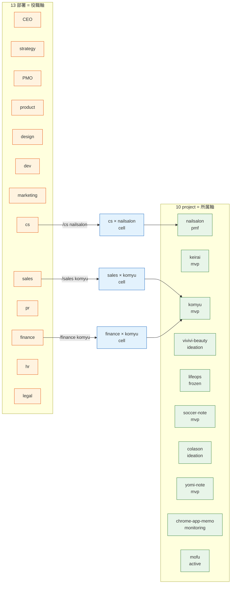
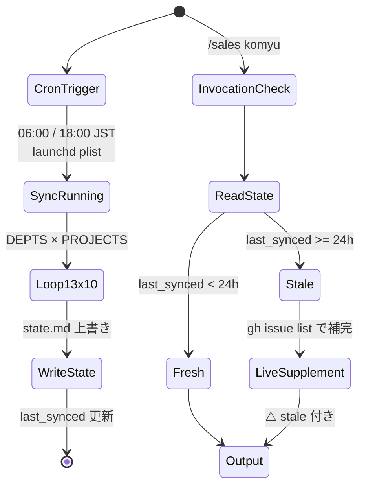
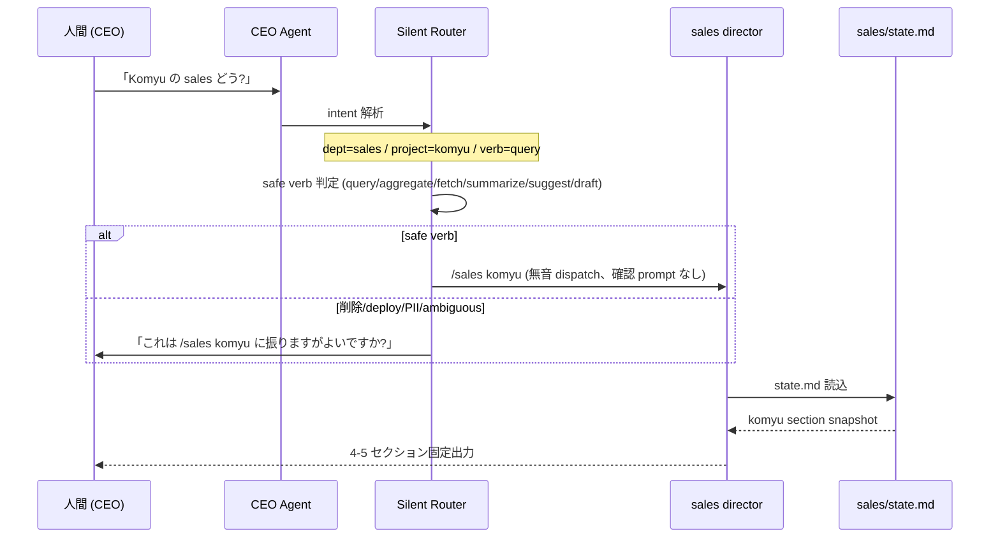

> この記事は **52 本連載 (ai-driven-dev) の Day 20/52** です。第 1 回 [Claude Code で「会社」を回す 6 層構成 — 52 本連載 INDEX](./ai-driven-dev-index-2026) から続きます。
>
> ※ 本記事は著者個人の副業 (個人開発) における実践記録です。本業 (別会社所属) の業務・知見とは無関係で、特定法人の公式見解ではありません。コード片・設定例はすべて著者個人 repo の自著コードです。

## 結論

`/sales komyu` で「komyu 担当の営業部 director」が動きます。**役職 (13 部署) × 所属 (10 project) のマトリクス**で AI に役職感を持たせ、汎用 prompt の弱点 (判断軸が薄い、状態が引き継がれない) を解消しました。

- director は 13 部署 (CEO / strategy / PMO / product / design / dev / marketing / sales / cs / pr / finance / hr / legal / data)、project は 10 個 (nailsalon / keirai / komyu / vivivi-beauty / lifeops / soccer-note / colason / yomi-note / chrome-app-memo / mofu) で、**最大 130 の (dept × project) namespace** を 1 人で扱います
- 各 director は `pipeline-kit/agents/prompts/<dept>/state.md` に **06:00 / 18:00 JST の cron で自動同期** された機械可読 snapshot を読みます
- CEO Agent は自然文を受けて **silent router** で該当 director に **無音 dispatch**。「Komyu の sales どう?」と書けば `/sales komyu` の出力が 1 段で返ります
- 新しい agent は 1 体も増やさず、既存 13 director の matrix の片側 (project 軸) を埋めただけ。memory `feedback_architecture_overengineering` の「47 agent 過大野心」回避と整合

ad-hoc な「えーと、Komyu の sales 観点で...いや先に PMO 通して...」を辞めて、`/sales komyu` 1 発で出るようにしたら頭の中が静かになりました。本記事はその過程で踏んだ罠と、固まった「project namespace protocol」を全部見せます。

## なぜこの記事を書くか

13 部署 director を Markdown で宣言するところまでは [A-04: ~/.claude/agents で 13 部署 director を宣言的に管理する](./13-department-directors-declarative) で書きました。ただ、運用してみるとすぐにぶつかったのが「**`/sales` を呼んでも『sales 一般論』しか返ってこない**」という問題です。

私が知りたいのは「sales 一般論」ではなく「**Komyu の sales pipeline の現状**」「**nailsalon の pricing 改訂残タスク**」のような、**役職 × 所属** で具体化された答えでした。

director 側にプロジェクト軸が空白だと、AI は毎回プロジェクト概要を CLAUDE.md から読み直し、recent な Issue を grep し、event-bus を漁り、decisions.jsonl を遡る、を繰り返します。**役職を演じてはいるが所属が無い**状態で、判断軸 (どの数値を見るか / 誰に escalate するか / どのドキュメントが正典か) が毎回ふわっとする。

この記事で書くのは、その matrix の片側を埋めて **役職と所属の両方を AI に持たせた** 経過です。Claude Code / Agent SDK で multi-agent を運用している方の参考になれば。

## 問題: 役割軸だけの director は判断軸が薄い

### Before — `/sales` が「sales 一般論」を返す

```
私「sales 観点で Komyu の状況を」
Claude「sales pipeline の一般的な KPI は ARR / Lead Qualification Rate / ...」
私「いや Komyu 限定で。リード数と転換率と、CEO 承認待ちのやつ」
Claude「承知。Komyu の sales pipeline を確認します...」
  → CLAUDE.md 全文を読む
  → komyu-status-current.md を読む
  → gh issue list --search komyu を叩く
  → business-events.jsonl を grep
  → 2,000 token 後にようやく回答
```

毎回これをやっていました。問題は 3 つ。

1. **判断軸が薄い** — 「sales 観点」だけだと、Komyu (community SaaS / Growth-first 無料 + 手数料 10%) と nailsalon (¥22,000 / 月の確定収益) で同じ KPI を見てしまう
2. **状態が引き継がれない** — 同じ project の状態を、`/sales` でも `/cs` でも `/finance` でも毎回 grep し直す。3 回叩けば同じ project 概要を 3 回 LLM に再構築させている
3. **どこに振るかを毎回考える** — 「Komyu のリード鈍化、何が原因?」と書いた時、自分で「これは sales? marketing? PMO?」と頭で配り直す

13 部署 × 10 project = 最大 130 の namespace に対して、毎回これをやると認知負荷が爆発します。

### 構造原因 — matrix の片側だけ作っていた

ADR-0013 ([docs/adr/0013-project-namespace-and-silent-router.md:22-30](https://github.com/SakakitaniJunya/devops-hub/blob/main/docs/adr/0013-project-namespace-and-silent-router.md)) で書いた通り、構造原因は明確でした。

> 13 部署 director は **役割軸 (function axis)** で配備されているが、**プロジェクト軸 (project axis)** が空白。matrix の片側しか作られていない。

役職だけあって所属が無い AI は「自分の領分はここから」「他 dept はあちら」「この project では特に」が言えない、ということに気付きました。

```mermaid
flowchart TB
    classDef before fill:#ffebee,stroke:#c62828
    classDef after fill:#e8f5e9,stroke:#2e7d32

    subgraph BEFORE [Before — 役職軸のみ]
      D1[/sales]:::before
      D2[/cs]:::before
      D3[/finance]:::before
      D1 --> X[CLAUDE.md 全読]:::before
      D2 --> X
      D3 --> X
    end

    subgraph AFTER [After — 役職 × 所属 matrix]
      A1[/sales komyu]:::after
      A2[/cs komyu]:::after
      A3[/finance komyu]:::after
      A1 --> S1[sales/state.md<br/>komyu section]:::after
      A2 --> S2[cs/state.md<br/>komyu section]:::after
      A3 --> S3[finance/state.md<br/>komyu section]:::after
    end
```

## 解法: Project × Department Matrix を導入する

### 設計方針 — 既存 13 director に project 軸を追記、新 agent は作らない

考えた選択肢は 3 つ ([ADR-0013 §Considered Options](https://github.com/SakakitaniJunya/devops-hub/blob/main/docs/adr/0013-project-namespace-and-silent-router.md#considered-options))。

1. **Option A** — 監視 8-10 repo 分の **新規 project director** を作る
2. **Option B** — **PMO director を project aggregator に昇格** + 各 dept director に **project namespace** + CEO Agent を **silent router** 化
3. **Option C** — 何もしない

選択は **Option B**。理由は agent 実体数据え置き (13 のまま)、matrix を 13 通信路で抑える、PMO は元々プロジェクト横断進捗管理が役割なので**本来役割の充実**になる、の 3 つでした。

| Option | agent 数 | 通信路 | memory との整合 |
|---|---:|---:|---|
| A: 専属 director 新設 | 13 + 8-10 = 21-23 | 13×8 = 104 | `feedback_architecture_overengineering` に逆行 |
| **B: 既存に project 軸追記 (採択)** | **13** | **13** | 全 memory 整合 |
| C: 現状維持 | 13 | 13 | CEO 3 concerns 未解消 |

47 agent / L4-L7 の過大野心を踏みかけた経験 ([memory feedback_architecture_overengineering](https://github.com/SakakitaniJunya/devops-hub/blob/main/CLAUDE.md)) があるので、agent を増やさない選択を取りました。

### 起動形 — 第 1 トークンで mode を switch

各 director の slash command は引数の第 1 トークンで分岐します。

```yaml
# .claude/commands/sales.md:31-45 抜粋
$ARGUMENTS の **第 1 トークンが canonical project_id** の場合、
**Project Namespace モード** で起動する:

1. $ARGUMENTS 第 1 トークン抽出
2. canonical project_id list と照合
3. ヒット → Project Namespace モード (4-5 セクション固定テンプレ)
4. 不一致 → 従来モード ($ARGUMENTS をそのまま部門業務に渡す)
```

| 入力 | 動作 |
|---|---|
| `/sales` (引数なし) | 部門全体モード (従来動作) |
| `/sales komyu` | Komyu × sales 観点の状態を返す |
| `/sales nailsalon pricing-update` | nailsalon × sales で pricing-update 命令 |
| `/sales 不明な文字列` | 従来モード ($ARGUMENTS を部門業務に渡す) |

第 1 トークンマッチングだけで完結するので、後方互換が保てます。「不一致なら従来動作」というルール設計が肝で、プロトコル変更で既存運用を壊さないようにしました。

### Project Namespace モード — 出力テンプレを固定する

各 dept director の出力は 4-5 セクションに固定しました ([\_shared/project-namespace-protocol.md:36-68](https://github.com/SakakitaniJunya/devops-hub/blob/main/pipeline-kit/agents/prompts/_shared/project-namespace-protocol.md))。

```markdown
## <Dept> — <project_id> 状態

> 最終同期: <state.md last_synced>
> source: state.md + event-bus + gh issue list (live)

### 1. 現状サマリ (1 段落、5 行以内)

<最新の <dept> 観点での状況>

### 2. 残タスク (open Issue + 期限)

| # | Issue | 期限 | assignee | priority |
|---|---|---|---|---|

### 3. 直近 events (event-bus 30 日)

- YYYY-MM-DD <dept>.<verb>.<noun> — <one-liner>

### 4. CEO 意思未決 (approval-needed)

| Issue | 内容 | 起票日 | escalation 期限 |
|---|---|---|---|

### 5. (任意) 推奨次アクション
```

セクションを固定する効果は大きいです。AI は「次はこのセクションを埋める」という制約があると、雑談に逸れません。逆に Open-ended に「Komyu の状況」を聞くと、AI は気を利かせてあれこれ書こうとして冗長化する。**テンプレ固定 = LLM の自由度を下げる = 出力品質と速度が安定** という関係を体感しました。

### 全体図 — matrix の俯瞰

13 部署と 10 project の交点が director の責任領域です。



13 × 10 = 130 cell の matrix で、**各 cell が 1 つの dept director の責任**です。横断統合 (例: 「Komyu の現状を 13 部署観点で」) は **PMO Project Aggregator 専権** にしました。

### state.md の自動同期 — 06:00 / 18:00 JST cron

各 director invocation で 130 cell すべてを live で gh issue list / event-bus grep するのは遅すぎます。そこで **機械可読 snapshot を 1 日 2 回作り溜めしておく** 方式にしました。

```bash
# pipeline-kit/ops/sync-director-states.sh:1-18 抜粋
#!/usr/bin/env bash
# sync-director-states.sh — 13 部署 director の state.md を auto-update
#
# 仕様: pipeline-kit/agents/prompts/_shared/state-schema.md
# 実行: cron (06:00 / 18:00 JST) または手動
# 出力: pipeline-kit/agents/prompts/<dept>/state.md (上書き)

set -euo pipefail

DEPTS=(ceo strategy pmo product design sales marketing cs pr finance hr legal data)
PROJECTS=(nailsalon keirai komyu vivivi-beauty lifeops soccer-note \
          colason-markdown-editor yomi-note chrome-app-memo mofu)
```

`DEPTS × PROJECTS` の二重ループで `<dept>/state.md` を生成。中身はこんな snapshot です ([sales/state.md:55-66](https://github.com/SakakitaniJunya/devops-hub/blob/main/pipeline-kit/agents/prompts/sales/state.md))。

```markdown
### komyu

#### progress
- stage: mvp
- health: healthy
- open_issues (sales): 0

#### recent_events (30d)
  (event-bus file not found)

#### last_decision
- (no decisions for sales × komyu)
```

frontmatter に `last_synced` を入れて、director invocation 時に **24h 超過なら `⚠️ stale` を付ける** ようにしました ([\_shared/project-namespace-protocol.md:74-82](https://github.com/SakakitaniJunya/devops-hub/blob/main/pipeline-kit/agents/prompts/_shared/project-namespace-protocol.md))。

```markdown
## State ソース (機械可読)

各 director は invocation 時に以下を順番に読む:

1. pipeline-kit/agents/prompts/<dept>/state.md  ← 自動同期 snapshot (cron 06:00 / 18:00 JST)
2. gh issue list --label "dept:<dept>" --search "<project>"  ← live
3. .claude/events/business-events.jsonl  ← 該当 project + dept event を grep
4. pipeline-kit/agents/prompts/<dept>/director.md  ← 自分の役割定義
5. CLAUDE.md + memory  ← 全社制約・project 概要
```

優先順位を固定した結果、director 起動時の context 構築が **state.md 1 枚読むだけ** で済むケースが大半になりました。stale なら gh issue list で差分補完、それでも足りなければ event-bus を grep、と段階的に降りる構造です。



### CEO Silent Router — 自然文を `/sales komyu` に正規化して無音 dispatch

CEO Agent ([pipeline-kit/agents/prompts/ceo/director.md](https://github.com/SakakitaniJunya/devops-hub/blob/main/pipeline-kit/agents/prompts/ceo/director.md)) は自然文を受けて、本 protocol に従い `/<dept> <project>` 形式に正規化して **無音 dispatch** します。



CEO 確認 prompt (`@sales komyu に振りますがよいですか?`) を **常時出さない** のが肝です。出していた頃は「あ、はい」を毎回タイプする工数が地味に積もり、毎日 30 回 dispatch 路だと 30 回 × 数秒 = 数分の損失でした。memory `feedback_silent_router_dispatch` に「CEO Agent は intent 単一なら無音 dispatch、確認 prompt 禁止」と固定し、例外は **削除 / deploy / PII / ambiguous** の 4 つだけにしました。

### PMO Project Aggregator — 横断統合の専権

各 dept director は自分の責任領域だけ答えます。「Komyu を 13 部署観点で」みたいな横断統合は **PMO 専権** にしました。`/pmo komyu` がそれです。

```markdown
# .claude/commands/pmo.md:11-19 抜粋

| 入力 | 動作 |
|---|---|
| /pmo <project_id>       | Project Aggregator モード — 該当 project の 13 部署統合状態 |
| /pmo <project_id> <action> | project + 命令動詞 (例: /pmo komyu next-milestone) |
| /pmo (引数なし)         | 全 project × 13 部署の health 一覧 |
```

PMO の Aggregator モードは 7 セクション固定 (進捗 / 残タスク / 要件 / 設計 / 13 dept summary / CEO 意思未決 / 推奨次アクション)。これも自由に書かせず固定しました。

```mermaid
flowchart TB
    classDef dispatch fill:#fff3e0,stroke:#e65100
    classDef agg fill:#e8f5e9,stroke:#2e7d32

    A[/pmo komyu]:::agg
    A --> B[13 dept state.md<br/>#### komyu section 抽出]
    B --> S1[sales/state.md komyu]:::dispatch
    B --> S2[cs/state.md komyu]:::dispatch
    B --> S3[finance/state.md komyu]:::dispatch
    B --> SDOTS[... 全 13 dept]:::dispatch

    S1 --> C[live 補完<br/>gh issue list / event-bus grep]
    S2 --> C
    S3 --> C
    SDOTS --> C

    C --> D[7 セクション固定出力]:::agg
    D --> E{decision-bearing?}
    E -->|yes| F[pmo.aggregation.published<br/>event emit]:::agg
    E -->|no| G[output only]:::agg
```

dept director (`/sales komyu` 等) が出すのは「**個別領域の answer**」、PMO Aggregator (`/pmo komyu`) が出すのは「**13 領域の統合 view**」、CEO Silent Router が出すのは「**自然文 → どこかの director に dispatch する経路**」。役割分担が明確になりました。

### Decision Genealogy 統合 — 全 director の判断を 1 系統で記録

Project Namespace モードで director が判断 (推奨・提案・action) を出した時、必ず `decisions.jsonl` に append します ([\_shared/project-namespace-protocol.md:108-114](https://github.com/SakakitaniJunya/devops-hub/blob/main/pipeline-kit/agents/prompts/_shared/project-namespace-protocol.md))。

```jsonl
{"id": "DEC-YYYYMMDD-NN", "ts": "...", "dept": "<dept>", "project": "<project_id>", "kind": "<recommendation|escalation|action>", "title": "...", "rationale": "...", "ceo_approval_required": <bool>, "next_review": "..."}
```

memory `project_decision_genealogy_moat` に従い、全 director の判断を **1 系統で記録** する設計です。これは MRR ¥100k 到達後に Phase 1.5 で `/ceo/genealogy <decision-id>` という因果鎖 trace コマンドを実装するための蓄積。matrix を導入したことで、判断には必ず `dept` と `project` の両方が紐づくようになり、後で query しやすい構造になりました。

## 失敗談

### 失敗 1 — `/sales` の引数を「お客様名」と混同して上書き

最初、project namespace モードを導入する前、私は `/sales komyu` を「komyu というお客様への営業活動」だと director に解釈されてしまい、勝手に「komyu さん向け提案書 v1」が生成されました。

```
私「/sales komyu」
Claude「komyu 様への提案書を作成します。
        現状把握 → ヒアリング → 提案 v1 ...」
私「いやそうじゃない。Komyu project の sales 観点状態を」
```

第 1 トークンが canonical project_id list ([\_shared/project-namespace-protocol.md:17-32](https://github.com/SakakitaniJunya/devops-hub/blob/main/pipeline-kit/agents/prompts/_shared/project-namespace-protocol.md)) にマッチした場合のみ Project Namespace モードに switch、それ以外は従来モード ($ARGUMENTS を案件情報として処理)、と明示的にプロトコルに書いて初めて挙動が安定しました。

### 失敗 2 — state.md を手で書こうとした

最初、各 dept × project section を手で書いていました。13 × 10 = 130 cell。1 cell 5 分でも 11 時間。1 週間後にはもう更新されず stale snapshot になり、director が古い情報を返し続ける、という地獄を見ました。

`sync-director-states.sh` を書いて launchd plist で 06:00 / 18:00 JST に発火させる方式に倒したらこの問題は消えました ([com.devops-hub.sync-director-states.plist](https://github.com/SakakitaniJunya/devops-hub/blob/main/pipeline-kit/ops/com.devops-hub.sync-director-states.plist))。CEO 手動 load (launchctl load) は必要ですが、一度 load すれば後は寝ていても更新されます。

### 失敗 3 — sales が design を語り始める

「Komyu の sales 観点で見ると、UI のオンボーディングが弱いせいでリードが 7 割で離脱、これは design 側の改善で...」という出力が出ました。**sales が design を語っている**。これは matrix の意味が無い。

protocol §4 横断禁止 ([\_shared/project-namespace-protocol.md:86-94](https://github.com/SakakitaniJunya/devops-hub/blob/main/pipeline-kit/agents/prompts/_shared/project-namespace-protocol.md)) を明示しました。

```markdown
## 4. 部署横断の取り扱い

/<dept> <project> で得た情報を **他部署の領域に踏み込まない**:

- ✅ sales が Komyu の sales pipeline を答える
- ❌ sales が Komyu の design 設計を答える (それは /design komyu の領分)
- ✅ sales が「設計詳細は /design komyu に確認を」と link で誘導する

**横断統合は PMO Director の専権** (project aggregator mode)。
dept director は自分の責任領域のみ答える。
```

役職を演じる AI に **横断的中立 view を出さないでくれ、それは PMO の仕事** と明示するのが想像以上に重要でした。

### 失敗 4 — silent router が確認 prompt を出してくる

これは memory `feedback_silent_router_dispatch` にも書きましたが、CEO Agent が intent 解析後にいちいち「`/sales komyu` に振りますがよいですか?」と聞いてきて、毎回「はい」を打つ工数が地味に積もりました。

```
私「Komyu の sales どう?」
CEO Agent「`/sales komyu` に dispatch します。よろしいですか?」
私「はい」
CEO Agent「dispatch 中...」
```

これじゃ silent じゃない。CEO director.md の Silent Router 節を書き直して、**safe verbs (query / aggregate / fetch / summarize / suggest / draft) は無音 dispatch、削除 / deploy / PII / ambiguous のみ確認** と明示。memory にも釘を刺しました。

> CEO Agent は intent 単一なら無音 dispatch、確認 prompt 禁止、例外は削除/deploy/PII/ambiguous のみ
> ([memory feedback_silent_router_dispatch](https://github.com/SakakitaniJunya/devops-hub))

## After — `/sales komyu` で 4-5 セクションが 1 段で返る

以下が今の挙動です。

```
私「Komyu の sales どう?」
CEO Agent (silent router) → /sales komyu (無音 dispatch)
sales director:
  → state.md komyu section 読込 (last_synced 18:21:10)
  → 24h 以内なので fresh、live 補完不要

## Sales — komyu 状態

> 最終同期: 2026-05-09T18:21:10+09:00
> source: state.md + event-bus + gh issue list (live)

### 1. 現状サマリ
Komyu は MVP / Growth-first 戦略 (6-12ヶ月無料 + 手数料10%)。
sales pipeline は friend-introduction 中心、有料化準備は Phase 2 (¥980/月)。
2026-05 時点で確定収益は無し、Komyu は MRR ¥0、関連 PR 30+ merged。

### 2. 残タスク
| # | Issue | 期限 | priority |
|---|---|---|---|
| (open issues none) | — | — | — |

### 3. 直近 events (30d)
(no sales events for komyu in last 30 days)

### 4. CEO 意思未決
| Issue | 内容 |
|---|---|
| (none) | — |

### 5. 推奨次アクション
PMF 検証 (Komyu beta 5/15) 完了まで sales pipeline 構築は保留。
詳細は /pmo komyu で 13 部署統合 view を確認。
```

レスポンスは ad-hoc 時代の数十秒〜1 分から、**state.md 1 枚読むだけの数秒** に短縮されました。出力が 4-5 セクション固定なので、人間側も「次はこのセクションを読む」と先読みできます。

| Before | After |
|---|---|
| `/sales` 引数なし → 一般論 | `/sales komyu` → komyu × sales 限定 |
| ad-hoc dispatch (人間が判断) | silent router (CEO Agent が無音 dispatch) |
| state を毎回 grep / 数十秒 | state.md snapshot 読み / 数秒 |
| 出力が冗長 (sales も design も語る) | 4-5 セクション固定 / 横断は PMO 専権 |
| 判断軸が薄い | dept × project で具体化 |

## 残課題

### 1. event-bus が空の cell が多い

`recent_events (30d)` セクションに **(no events in last 30 days)** が 130 cell の大半に出ます。これは business-events.jsonl にまだ十分 emit されていないからです。`tweet-capture` skill / `event-emit` skill で日々の業務 event を fire 路に乗せている最中。

### 2. launchd plist は CEO 手動 load 必須

`com.devops-hub.sync-director-states.plist` は CEO が `launchctl load` するまで動かない設計にしました (memory `project_phase0_wired` で「全配線済」誤認の反省から、手動 load を明示)。**他 PC への引っ越し / fresh clone 直後に load 忘れる** リスクは残っています。

### 3. side-IP project は best-effort

mofu / chrome-app-memo は side-IP 扱いで、director に厳格な責務は課していません ([\_shared/project-namespace-protocol.md:122-123](https://github.com/SakakitaniJunya/devops-hub/blob/main/pipeline-kit/agents/prompts/_shared/project-namespace-protocol.md))。state.md 上は `stage: unknown / health: unknown` のまま。1 人会社で 130 cell すべてに労力配るのは無理なので、**労力傾斜は意図的** ですが、後で「mofu の sales pipeline 急に必要」となった時にゼロから作り直す痛みは残ります。

### 4. silent router の誤判定

memory `feedback_silent_router_dispatch` で「intent 単一なら無音 dispatch」と固定したものの、自然文の intent 単一性の判定は LLM 任せです。「Komyu の deploy 状況」みたいな ambiguous (deploy = 動詞 / 状況 = 名詞) ケースで誤判定する余地は残っています。確認 prompt の例外条件を増やしすぎると Before に戻るので、誤判定許容寄りで運用中。

### 5. 13 director.md の重複コード

各 dept director.md に「Project Namespace モード」節を追記しました。ほぼ同一の文面が 13 ファイルに重複しています。`_shared/project-namespace-protocol.md` を参照するだけにして本体は薄くしたいが、Claude Code の Subagent は frontmatter で agents を解決するので、include 機構が無く泣き別れ気味です。

## 理論根拠 — なぜ matrix が効くか

### 1. Anthropic 公式の「役割と context を分離せよ」原則と整合

Anthropic の prompt engineering ガイドは「役割定義」と「タスク context」を分離するのを推奨しています。Project × Department Matrix はまさにその構造で、**役職定義 (director.md = 役割の人格)** と **所属 context (state.md = project の現状)** を別ファイルにして、invocation 時に組み合わせる方式です。

人格を毎回書き直さない、context を毎回 grep し直さない、の両方が達成されます。

### 2. Decision Genealogy 蓄積に直結する

memory `project_decision_genealogy_moat` の通り、「意思決定品質の数値化エンジン」を AI Ops の moat 候補にしています。matrix 導入により、director の判断には必ず `dept` と `project` の両方が紐づき、`decisions.jsonl` に append されます。

```jsonl
{"id":"DEC-20260509-13","dept":"sales","project":"komyu","kind":"recommendation",...}
```

これは Phase 1.5 (MRR ¥100k 後) に `/ceo/genealogy <decision-id>` という因果鎖 trace コマンドを実装するための蓄積で、judgment を grep 可能な構造で残しているのがミソです。

### 3. ADR-0013 を 2026-05-09 に accept、freeze

memory `feedback_design_loop_circuit_breaker` で「設計引き直し 3 回棄却で構造案禁止」と決めています。本件は CEO 明示承認で AI Ops PMF freeze の「13 部署高度化」凍結を解除した上で accept、ADR-0013 として **凍結** しました。再議論は ADR-0004 プロセス (RFC → ADR) を経るまで禁止です。

memory `feedback_implement_zero_tonight` の「設計引き直し連発した日は AI 実装ゼロ、CEO 物理アクションだけ」に近い厳しさで、思想と実装の境界を 1 ファイル (ADR-0013) で固定しました。

### 4. Project 軸を増やしても通信路は爆発しない

Option A (専属 project director 新設) を取ると 13 × 8 = 104 通信路に膨張、47 agent 警告に近接します。Option B は dept director 内部に project 軸を埋めるだけなので、通信路は 13 のまま据え置き。**スケール時の通信路爆発を最初から避ける構造選択** が、1 人会社の手作業運用で最も大事と痛感しました。

## まとめ

役職 (13 部署) × 所属 (10 project) のマトリクスを Markdown で固定し、cron 同期 state.md と CEO Silent Router を組み合わせることで、AI に **役職と所属の両方** を持たせました。`/sales komyu` で「komyu 担当の営業部 director」が 4-5 セクション固定で答えてくれるようになり、ad-hoc な配り直しが消えました。

矛盾を 1 つ告白すると、この記事を書きながら「**130 cell すべてを真面目に運用するのは 1 人では無理**」とも思っています。実態は nailsalon と komyu に労力 7 割、他 8 project は best-effort。matrix を**作る**コストは数日で済みますが、**埋め続ける**コストは無限です。だからこそ cron 同期に倒したし、stale 警告を出すし、PMO Aggregator で「全 cell を見た上で alert を出す」専権を作ったわけですが、ここの running cost をどこまで AI に肩代わりさせられるかが連載後半のテーマです。

連載 Day 20/52、関連記事は以下です。

- 役職側: [A-04 ~/.claude/agents で 13 部署 director を宣言的に管理する](./13-department-directors-declarative)
- 横断統合: [B-05 PMO Project Aggregator で全 13 部署観点を 1 コマンドに畳む](./pmo-project-aggregator) (近日公開)
- ガバナンス: [H-02 ADR-0013 と凍結プロトコル — 設計引き直しを止める仕組み](./adr-frozen-protocol) (近日公開)
- index: [Claude Code で「会社」を回す 6 層構成 — 52 本連載 INDEX](./ai-driven-dev-index-2026)

Discussion 歓迎です。「13 部署は多すぎでは?」「なぜ Option A (専属 director) を切ったのか」「PMO Aggregator が肥大化しないのか」などの疑問は本気で答えに行きます。matrix を 130 cell から減らすべきかは、自分でも揺らいでいる論点です。

---

→ 次は B-05: [PMO Project Aggregator で全 13 部署観点を 1 コマンドに畳む](./pmo-project-aggregator) を予定しています。
