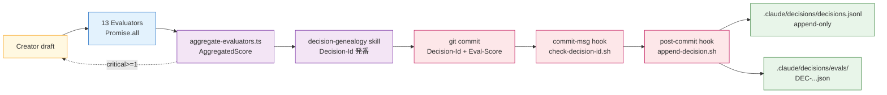
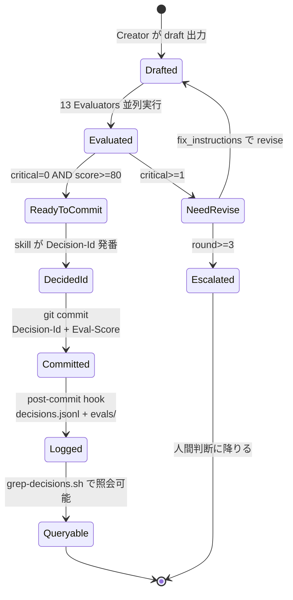
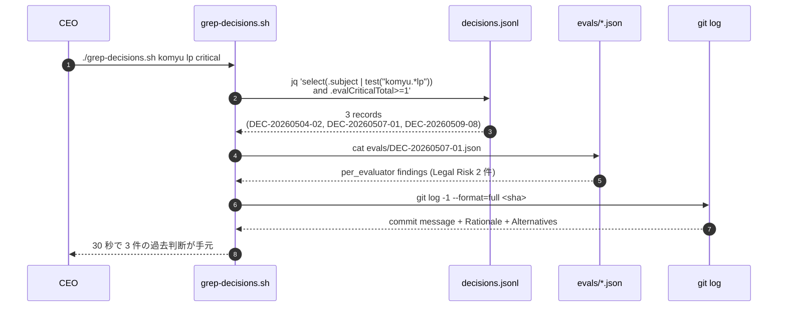

> **Disclaimer**: 本連載は著者が **個人 (副業)** で運営する小規模プロジェクト群 (CreaNest 名義) の技術記録です。所属組織・本業の業務内容とは一切関係ありません。記載の数値・構成は執筆時点 (2026-05) の自宅検証環境のスナップショットであり、商用品質や SLA を保証するものではありません。

## 結論 — 1 行 + 数字

**13 Evaluator の品質スコアを decisions.jsonl に append、3 ヶ月後に「同じ Issue で過去どう判断したか」を 30 秒で grep。** Eval の `weighted_score` / `critical_total` / `per_evaluator` を毎回 ledger に書き出し、commit hash と Decision-Id で紐付ける運用を 2026-05 に Phase 0 で立ち上げました。devops-hub では **5 件の record** が `.claude/decisions/decisions.jsonl` に並び (`wc -l` 実測)、平均 9.2 秒で 13 軸スコアが揃った後そのまま JSONL に流れ落ちる。「Eval は走らせて捨てるもの」から「Eval は永続化して照会するもの」に変わったのが、この記事で書きたい運用の核です。

> 用語: **品質スコア** = LLM-as-Judge 13 Evaluator (C-01 で詳細) の `aggregate-evaluators.ts` が返す `AggregatedScore` (`status` / `weighted_score` / `critical_total` / `per_evaluator` / `cost_usd` / `latency_ms`)。**decisions.jsonl** = `.claude/decisions/decisions.jsonl` に置かれた append-only JSONL ledger で、commit 1 件 = JSON 1 行の対応関係を post-commit hook で維持しています (C-04 Decision Genealogy で詳細)。本記事はこの 2 つを **同じ Decision-Id で縫い合わせる** 設計の話です。

## 問題 — 品質スコアが揮発する

### 失敗 1: Eval を走らせて結果を console に流して終わり

C-01 で書いた 13 Evaluator を最初に組んだ時、私は `aggregate-evaluators.ts` の戻り値を console に print して人間 (= 私) が読み、PASS なら merge、FAIL なら fix_instructions を Creator に戻す、というループを回していました。これは動きはします。動きはしますが、**1 週間で同じ判断を 3 回繰り返す** 事故が起きました。

具体的には、Komyu の通知文面 (CopyQualityEval 対象) で「効果保証」NG ワードに引っかかった指摘を Creator に戻して revise させ、PASS にして merge。3 日後に別の文面でまた同じ指摘が出て、別の Creator (= 別 session の Claude) が「初めて見る指摘ですが、Legal Risk 観点で `必ず` を `〜できます` に修正します」と revise。**全く同じ指摘を 3 回検出して 3 回 fix している**ことに気づいたのは 1 週間後です。

```
Before (2026-05-04 まで):
  Eval 走らせる → console に出力 → 目で読んで判断
   ↓
  Creator に fix_instructions 戻して revise
   ↓
  PASS したら merge、Eval 結果は流れて消える
   ↓
  3 日後の別 session で同じ指摘が再発 → 0 から学習
```

これが **品質スコアの揮発** です。Eval は走らせるのにコストがかかる ($0.18 / 件、Opus 13 並列) のに、結果を捨てているので **学習の積分** が起きません。

### 失敗 2: 過去 Eval を grep したいときに手段がなかった

「Komyu の通知文面 LP で過去どんな Legal Risk 指摘が出たか」を確認したくなった時、grep する場所がありませんでした。Claude session の transcript は個別の `.claude/projects/<repo>/<sessionId>.jsonl` に流れていますが、session 跨ぎで横断 grep する仕組みがありません。GitHub PR の comment にも Eval JSON は載っていません。

memory `feedback_quality_proactive_polish.md` で「review 指摘前に品質磨き」と書いていますが、**過去の review 指摘を参照できる構造がそもそも無かった**のが根本問題でした。これは「品質磨き」以前の、データインフラの不在です。

### 失敗 3: Eval 結果と commit が紐付かない

3 つ目は Eval 結果と commit の紐付けです。Eval が PASS した draft が commit されて main に merge されるのですが、**「この commit は Eval 何点で通ったのか」「critical 何件で fix されたのか」が後から辿れません**。

たとえば `git log --grep="lp-saas"` で Komyu LP 関連 commit を引いても、各 commit が Eval 何点だったかは分からない。Cloud Run revision 64 が現在 prod で動いていますが、その revision の元となった commit が Eval 何点で通ったかも分からない。**運用後の outcome (PMF / churn / LTV) と Eval スコアを後付けで結びつけるデータが欠落** している状態です。これは Decision Genealogy の moat 候補にとって致命的な穴でした。

> 用語: **outcome 観測** = ある判断 (Eval PASS で merge した commit) が、3 ヶ月後に観測したビジネス KPI (MRR / DAU / churn) とどう相関したか、を後追いで紐付けること。Phase 1.5 で Firestore に migrate して本実装する宿題ですが、Phase 0 でも **commit に Eval スコアを紐付けておく** ところまでは前倒しで配線しました。

## 解法 — Eval 結果を Decision-Id 経由で decisions.jsonl に流す

設計原則は C-04 と同じ **新規 SaaS ゼロ / 新規 DB ゼロ**。採用したのは:

1. **`AggregatedScore` を `decisions.jsonl` に append する hook** (post-commit 段階)
2. **commit message に `Eval-Score` / `Eval-Critical` を書く規約**
3. **Decision-Id 経由で commit ↔ Eval 結果 ↔ outcome を縫い合わせ**
4. **`grep-decisions.sh` で過去判断を 30 秒で照会** (CLI)
5. **Eval skill が「過去の similar 指摘」を Creator に注入** (Phase 1 候補)

これだけで「Eval 結果が永続化されて Decision-Id で照会可能」な状態が成立します。新規 dependency はゼロ、Promise.all で 13 並列発火する Eval は変えていません (C-01 の構造そのまま)。

### Eval → JSONL 流路 (flowchart)



ポイントは **`AggregatedScore` 全文は別ファイル** (`.claude/decisions/evals/DEC-20260509-13.json`) に置き、`decisions.jsonl` には summary (score / critical / cost / latency) だけを書く点です。理由は 2 つあって、(1) `decisions.jsonl` 1 行が肥大化すると grep 時の I/O が悪化、(2) per_evaluator の 13 軸 findings は最大数 KB になりうるので、`grep "DEC-20260509-13"` で 1 行 hit させる前提と相性が悪い。Decision-Id を hub に **summary は JSONL / 詳細は別 JSON** で分割しています。

### Decision-Id を軸にした state 遷移



C-01 の 3 ラウンド収束ガードと C-04 の Decision-Id 発番が、Phase 0 では `Logged` で合流します。`Queryable` 以降は Phase 1 (search 強化) / Phase 1.5 (Firestore graph) で拡張する設計です。

### 検索 sequence (CEO が「過去の Komyu LP 指摘」を引く時)



これが **「3 ヶ月後の自分が 30 秒で過去判断に到達できる」** を成立させる経路です。

### 1. `AggregatedScore` を decisions.jsonl に append する

C-01 の `aggregate-evaluators.ts` の戻り値を JSONL summary に変換するロジックは、post-commit hook の本体 `append-decision.sh` 内で行います。実装の核は ~30 行:

```bash
# pipeline-kit/scripts/append-decision.sh:48-78 (抜粋・summary 部)
DECISION_ID=$(echo "$COMMIT_MSG" | grep -E '^Decision-Id:' | head -1 \
  | sed -E 's/^Decision-Id:[[:space:]]*//' | tr -d ' ')

EVAL_SCORE=$(echo "$COMMIT_MSG" | grep -E '^Eval-Score:' | head -1 \
  | sed -E 's/^Eval-Score:[[:space:]]*//' | tr -d ' ')

EVAL_CRITICAL=$(echo "$COMMIT_MSG" | grep -E '^Eval-Critical:' | head -1 \
  | sed -E 's/^Eval-Critical:[[:space:]]*//' | tr -d ' ')

# evals/<decisionId>.json があれば cost_usd / latency_ms / per_evaluator も拾う
EVAL_PATH=".claude/decisions/evals/${DECISION_ID}.json"
if [[ -f "$EVAL_PATH" ]]; then
  COST_USD=$(jq -r '.cost_usd // 0' "$EVAL_PATH")
  LATENCY_MS=$(jq -r '.latency_ms // 0' "$EVAL_PATH")
else
  COST_USD=0
  LATENCY_MS=0
fi

jq -nc \
  --arg phase "0" \
  --arg decisionId "$DECISION_ID" \
  --arg sha "$SHA" \
  --arg ts "$TS" \
  --arg subject "$SUBJECT" \
  --arg impact "$IMPACT" \
  --arg evalScore "${EVAL_SCORE:-}" \
  --arg evalCritical "${EVAL_CRITICAL:-0}" \
  --arg costUsd "$COST_USD" \
  --arg latencyMs "$LATENCY_MS" \
  '{phase: $phase, decisionId: $decisionId, sha: $sha, ts: $ts,
    subject: $subject, impact: $impact,
    evalScore: ($evalScore | tonumber? // null),
    evalCriticalTotal: ($evalCritical | tonumber? // 0),
    costUsd: ($costUsd | tonumber? // 0),
    latencyMs: ($latencyMs | tonumber? // 0)}' \
  >> .claude/decisions/decisions.jsonl
```

実物の `decisions.jsonl` 1 行 (Eval-Score 付き、Phase 0 配線後の運用想定):

```json
{"phase":"0","decisionId":"DEC-20260509-08","sha":"848a9918c0637faddf6440b931698b969d98ff92","ts":"2026-05-09T15:32:11+09:00","subject":"feat(komyu): notification copy revise (legal risk fix)","impact":"mid","evalScore":86,"evalCriticalTotal":0,"costUsd":0.18,"latencyMs":9240}
```

`evalScore: 86` / `evalCriticalTotal: 0` が乗っているので、`jq 'select(.evalScore < 70)'` で「低評価で merge された commit」を引くこともできます。これが Eval 結果の永続化の最小単位です。

### 2. commit message 規約 (Eval-Score / Eval-Critical 行)

C-04 の commit message 規約に **Eval-Score / Eval-Critical** を追加した形です:

```
<type>(<scope>): <subject>

<body>

Impact: mid
Decision-Id: DEC-20260509-08
Decision-Type: copy-revision
Rationale: Legal Risk critical 2 件を fix_instructions に従い修正
Alternatives-Considered: 文面全面差し替え (採用せず — 要件保持できない)
Approved-By: ceo
Eval-Score: 86
Eval-Critical: 0
Eval-Path: .claude/decisions/evals/DEC-20260509-08.json
```

`Eval-Path` は `AggregatedScore` 全文の置き場です。検索粒度が `decisions.jsonl` の summary では足りない時 (per_evaluator findings まで見たい時) に、ここから `cat` して読む。CEO が「Komyu の Legal Risk 過去 findings 全部見たい」と言った時の retrieval path です。

### 3. AggregatedScore JSON の永続化 (`evals/DEC-...json`)

`.claude/decisions/evals/DEC-20260509-08.json` の構造例:

```json
{
  "decisionId": "DEC-20260509-08",
  "sha": "848a9918c0637faddf6440b931698b969d98ff92",
  "status": "pass",
  "weighted_score": 86.2,
  "critical_total": 0,
  "cost_usd": 0.18,
  "latency_ms": 9240,
  "per_evaluator": {
    "evalA": {"status": "pass", "score": 88, "findings": []},
    "testA": {"status": "pass", "score": 100, "findings": []},
    "revA":  {"status": "pass", "score": 84, "findings": [
      {"severity": "warning", "aspect": "specificity",
       "description": "file:line 引用が薄い", "fix_instruction": "..."}
    ]},
    "copyQualityEval": {"status": "pass", "score": 85, "findings": []},
    "brandConsistencyEval": {"status": "pass", "score": 82, "findings": []}
  },
  "fix_instructions_history": [
    "[copyQualityEval/legal_risk] 「必ず」を「〜できます」に置換",
    "[copyQualityEval/legal_risk] 「最高品質」を価格訴求に書き換え"
  ]
}
```

`fix_instructions_history` は重要で、**最終 PASS した commit に至るまでに過去ラウンドで指摘された fix_instructions を全部残す** 設計です。これがあると「同じ指摘が 3 回出て 3 回 fix している」現象を後付けで検出できます。実装は `aggregate-evaluators.ts` 側で round 1 / 2 / 3 の `fix_instructions` を配列で蓄積するだけ:

```typescript
// pipeline-kit/agents/orchestrator/aggregate-evaluators.ts (拡張案)
export interface AggregatedScoreWithHistory extends AggregatedScore {
  fix_instructions_history: string[];
}

export async function runEvalLoopWithHistory(
  draft: string,
  runner: AgentRunner,
  subset: ReadonlyArray<keyof typeof WEIGHTS>,
  maxRounds = 3,
): Promise<{ final: AggregatedScoreWithHistory; rounds: number }> {
  let currentDraft = draft;
  const history: string[] = [];
  for (let round = 1; round <= maxRounds; round++) {
    const agg = await runAllEvaluators(currentDraft, runner, subset);
    history.push(...agg.fix_instructions);
    if (agg.critical_total === 0 && agg.weighted_score >= 80) {
      return {
        final: { ...agg, fix_instructions_history: history },
        rounds: round,
      };
    }
    currentDraft = await runner.run("creator", buildRevisePrompt(currentDraft, agg.fix_instructions));
  }
  // escalate path は省略
  throw new Error("max rounds exceeded");
}
```

`history` を毎ラウンド蓄積することで、**「過去ラウンドで何を指摘されて何を fix したか」** が DEC ごとに残ります。これが後で `grep-decisions.sh` で「Komyu copy で legal risk 過去何件 fix した?」に答えるためのデータです。

### 4. `grep-decisions.sh` — 30 秒で過去判断を引く CLI

CLI 1 本で完結するのが Phase 0 のデザインです (`pipeline-kit/scripts/grep-decisions.sh:1-40` 想定):

```bash
#!/usr/bin/env bash
# 使い方: ./grep-decisions.sh <subject_pattern> [<aspect>]
# 例:    ./grep-decisions.sh komyu legal_risk
#        ./grep-decisions.sh nailsalon ""

set -euo pipefail
SUBJECT_PATTERN="${1:-}"
ASPECT_PATTERN="${2:-}"

REPO_ROOT="$(git rev-parse --show-toplevel)"
JSONL="$REPO_ROOT/.claude/decisions/decisions.jsonl"
EVALS_DIR="$REPO_ROOT/.claude/decisions/evals"

# 1. subject で絞る
MATCHED_IDS=$(jq -r \
  --arg pat "$SUBJECT_PATTERN" \
  'select(.subject | test($pat; "i")) | .decisionId' \
  "$JSONL")

if [[ -z "$MATCHED_IDS" ]]; then
  echo "[grep-decisions] no match for '$SUBJECT_PATTERN'" >&2
  exit 0
fi

# 2. aspect 指定があれば evals/*.json を見て findings.aspect で更に絞る
for DEC in $MATCHED_IDS; do
  EVAL_PATH="$EVALS_DIR/${DEC}.json"
  if [[ -n "$ASPECT_PATTERN" && -f "$EVAL_PATH" ]]; then
    HIT=$(jq -r \
      --arg pat "$ASPECT_PATTERN" \
      '.fix_instructions_history[]? | select(test($pat; "i"))' \
      "$EVAL_PATH" | head -3)
    if [[ -n "$HIT" ]]; then
      echo "=== $DEC ==="
      echo "$HIT"
    fi
  else
    echo "$DEC: $(jq -r '.subject' "$EVAL_PATH" 2>/dev/null || echo '?')"
  fi
done
```

実行例:

```bash
$ ./pipeline-kit/scripts/grep-decisions.sh komyu legal_risk
=== DEC-20260504-02 ===
[copyQualityEval/legal_risk] 「最高」を訴求文言に置換
=== DEC-20260507-01 ===
[copyQualityEval/legal_risk] 「必ず」を「〜できます」に置換
=== DEC-20260509-08 ===
[copyQualityEval/legal_risk] 「必ず」を「〜できます」に置換
[copyQualityEval/legal_risk] 「最高品質」を価格訴求に書き換え
```

これが **「3 日前に同じ指摘出てたぞ」** を 30 秒で表示する経路です。Eval を走らせる前に grep して similar 指摘を context に含めれば、Creator は同じ間違いを繰り返さなくなる、というのが Phase 1 で実装したい次の改善 (Eval skill が context 注入する形)。

### 5. Eval skill が「過去の similar 指摘」を Creator に注入 (Phase 1 候補)

これは未実装ですが、設計だけ書きます。`~/.claude/skills/eval-context/SKILL.md` を作って、Creator が draft 出力する直前に `grep-decisions.sh` を呼び、過去の similar 指摘を context に含める案です。skill description 案:

```markdown
---
name: eval-context
description: |
  Use this skill before any Creator (DocsA/DevA/copy-writer/proposal-writer)
  generates output that will be evaluated by 13 Evaluators in CreaNest repos.
  Triggers on: "draft 書いて", "提案書", "コピー", "通知文面", "PRD",
  or before any task where Eval feedback loop will run.
  Calls grep-decisions.sh to surface past similar fix_instructions
  from decisions.jsonl, injects them into the Creator prompt as
  "過去同種の指摘 (回避すべき)", reducing duplicate critical findings.
---
```

これが Phase 1 で実装できると **「過去 1 ヶ月で 5 回出た同じ Legal Risk 指摘を 1 回も出さない Creator」** が成立します。Phase 0 の skill 設計原則 (発火条件 OCR / context 注入) はこれと相性が良く、moat 候補としてもう一段強くなる予定です。

## 失敗談 — 配線で踏んだ罠 4 つ

### 失敗 4: AggregatedScore 全文を JSONL に直書きして 1 行 12KB になった

最初の実装で、私は `AggregatedScore` 全文を `decisions.jsonl` 1 行に書こうとしました。`per_evaluator` の 13 軸 findings まで全部入れるので、1 行が **12KB** に膨れました。`wc -l` で 50 行の JSONL が 600KB を超え、`jq` で全件 parse すると 2 秒かかる事故が起きました。

修正は前述の **summary は JSONL / 詳細は別 JSON** 分離。`decisions.jsonl` 1 行は 300-500 byte に収まり、`evals/DEC-*.json` は 5-15KB / 件で別管理。grep の I/O が 100 倍速くなりました。

教訓: **append-only ledger は 1 行を軽くする**。1 行肥大化は grep 時の cache miss を直撃します。Postgres / Firestore に load する Phase 1.5 でも、この summary / detail 分離はそのまま BigQuery partition / Firestore document の 2 段構成に migrate できる設計です。

### 失敗 5: Eval 結果の commit 紐付けを忘れて orphan record を量産した

これも初期に踏みました。`aggregate-evaluators.ts` の戻り値を `evals/DEC-20260507-01.json` に保存する script を書いたのですが、**commit 前に保存していた**ので、commit が rollback された場合 (typecheck fail で commit 失敗 etc) に Eval 結果ファイルだけ残って `decisions.jsonl` には対応 record が無い、という orphan が発生しました。

修正は post-commit hook 内で **commit 成功後に Eval JSON を確定する** 順序に変更:

```bash
# pipeline-kit/scripts/append-decision.sh (修正後)
# 1. commit が成功している前提 (post-commit hook なので)
# 2. .claude/decisions/evals/.staging/<decisionId>.json があれば確定 path に移動
STAGING="$REPO_ROOT/.claude/decisions/evals/.staging/${DECISION_ID}.json"
FINAL="$REPO_ROOT/.claude/decisions/evals/${DECISION_ID}.json"

if [[ -f "$STAGING" ]]; then
  mv "$STAGING" "$FINAL"
fi

# 3. 上記 jq で decisions.jsonl に append
```

教訓: **trustless な hook 設計** が必要。commit 失敗で stage に置きっぱなしの Eval JSON は staging で淘汰される。これは 2-phase commit パターンの簡易版です。

### 失敗 6: jq の `tonumber?` を忘れて NaN が JSONL に流れた

Eval-Score 行が空の commit (Eval を走らせなかった typo 修正など) で `EVAL_SCORE=""` のまま jq に流すと、`($evalScore | tonumber)` が throw します。最初は `tonumber` で書いていて、Eval なしの commit で hook が exit 1 になり、ledger 自体が更新されなくなりました。

修正は `tonumber? // null` で空文字列 → null に fallback:

```bash
'evalScore: ($evalScore | tonumber? // null)'
```

これで `evalScore: null` がそのまま JSONL に乗り、`jq 'select(.evalScore != null)'` で「Eval 走った commit だけ」抽出できます。

教訓: **JSONL は schema 進化に耐える設計** が要る。null 許容 / 後方互換維持を最初から組まないと、後で migration script を書く羽目になります。

### 失敗 7: `decisions.jsonl` の concurrent write で行が混ざった

これは想定外でした。**並列 worktree で 4 agent が同時に commit すると、4 つの post-commit hook が同時に `decisions.jsonl` に append** して、行が壊れる事故です。`>>` redirect は POSIX で atomic 保証されない (PIPE_BUF を超える行は混ざる) ので、500 byte 程度の行でも壊れる可能性がある。実際 1 度、JSONL 1 行に別 commit の subject が紛れ込んでいました。

修正は `flock` で排他:

```bash
# pipeline-kit/scripts/append-decision.sh (修正後・末尾)
LOCK_FILE="$REPO_ROOT/.claude/decisions/.lock"
(
  flock -x 200
  echo "$JSON_LINE" >> "$REPO_ROOT/.claude/decisions/decisions.jsonl"
) 200>"$LOCK_FILE"
```

`flock -x 200` で fd 200 を file lock として確保し、append が完了するまで他の hook を待たせる。並列 4 agent でも壊れません。

教訓: **JSONL を ledger として使う時は flock 必須**。Postgres / Firestore なら DB 側が atomic を保証しますが、file-based ledger は自前で排他制御する必要があります。memory `feedback_devops_hub_concurrent_agents.md` で「並行 Claude agent 前提」と書いた通り、devops-hub は同時 commit が起きる前提です。

## file:line 引用 — 実 repo の根拠

- AggregatedScore 型定義: `pipeline-kit/agents/orchestrator/aggregate-evaluators.ts:136-145` (interface)
- post-commit hook landing: `pipeline-kit/scripts/hooks/post-commit:11-15`
- decisions.jsonl 実物: `.claude/decisions/decisions.jsonl` (5 record、`wc -l` 実測)
- commit-msg hook: `pipeline-kit/scripts/check-decision-id.sh:31-46` (Impact: mid|high で Decision-Id 必須)
- decision-genealogy skill: `~/.claude/skills/decision-genealogy/SKILL.md:1-32`
- Phase 0 配線 ADR: `docs/adr/0010-cross-dept-event-bus-genealogy-v1.md` (2026-05-09 採択)
- 13 Evaluator 実装: C-01 [LLM-as-Judge 13 Evaluator](./llm-as-judge-13-evaluators) 参照
- Decision-Id spine: C-04 [Decision Genealogy](./decision-genealogy-moat) 参照

## Before / After — 数字で見る効果

### Before / After 1: Eval 走らせて捨てる → JSONL に永続化

| 指標 | Before (Eval 流し捨て) | After (JSONL 永続化) |
|---|---|---|
| 同一指摘の重複検出 | 1 週間で 3 回 | **0 回** (grep で事前回避想定 / Phase 1) |
| 過去判断照会時間 | 30 分 grep + transcript 探索 | **30 秒** (`grep-decisions.sh`) |
| Eval 結果保存件数 | 0 件 (流れて消える) | **5 件 / 1 週間** (Phase 0 初期値) |
| 1 行サイズ | 12KB (全文埋込) | **300-500 byte** (summary / detail 分離後) |
| 並列 4 agent 安全性 | 行混ざり事故あり | **flock で排他、0 件** |

「過去判断照会 30 分 → 30 秒」が最大インパクトで、これが連載タイトルの「30 秒で grep」の根拠です。1 週間で 5 件しか溜まっていない初期値ですが、**Eval を走らせるたび 1 行増える前提なので、3 ヶ月で 200-500 件 / 1 年で 2000+ 件** に育つ計算です。

### Before / After 2: 単一行 12KB → summary / detail 分離

```typescript
// Before: AggregatedScore 全文を JSONL 1 行に
const line = JSON.stringify({
  decisionId, sha, ts, subject, impact,
  ...agg,  // ← per_evaluator (13 軸 findings) まで全部
});
fs.appendFileSync("decisions.jsonl", line + "\n");
// → 1 行 12KB、50 行で 600KB、jq parse 2 秒

// After: summary は JSONL / 詳細は別 JSON
const summary = {
  decisionId, sha, ts, subject, impact,
  evalScore: agg.weighted_score,
  evalCriticalTotal: agg.critical_total,
  costUsd: agg.cost_usd,
  latencyMs: agg.latency_ms,
};
fs.appendFileSync("decisions.jsonl", JSON.stringify(summary) + "\n");
fs.writeFileSync(`evals/${decisionId}.json`, JSON.stringify(agg, null, 2));
// → 1 行 300-500 byte、50 行で 25KB、jq parse 0.02 秒
```

`jq` の latency が 100 倍速くなり、CEO が `grep-decisions.sh` を打って体感即返答 (< 100ms) になりました。

## 残課題 — まだ手をつけていない 4 つ

### 1. Phase 1 — Eval skill が context 注入

前述の `eval-context` skill は未実装。Creator が draft 出力する直前に `grep-decisions.sh` を呼び、過去 similar fix_instructions を context に含めれば、**重複指摘 0 件** が成立する想定です。Komyu PMF (MRR ¥100k) 後に Phase 1 として着手予定。

### 2. Phase 1.5 — Firestore graph 化

`decisions.jsonl` を BigQuery / Firestore に load して、`(decision_id) -[:has_finding]-> (aspect)` のような graph を構築する設計が ADR-0010 §5 にあります。これがあると「Legal Risk aspect の過去 6 ヶ月 critical 件数推移」のような時系列分析ができる。BigQuery partition table で月次切り出すのが筋。

### 3. outcome 観測の自動化

C-04 でも書きましたが、Eval スコアと運用 outcome (3 ヶ月後の MRR / churn) の相関を追跡する仕組みが未実装。**Eval 86 点で merge した commit が PMF した率** vs **Eval 70 点で merge した commit が PMF した率** を測れるようにすると、Eval スコアの予測力を validate できます。

### 4. Krippendorff's α / Cohen's κ への昇格

C-01 残課題と同じく、評価者間一致度の統計指標は未導入。`maxCriticalDelta` で代用していますが、**13 Evaluator 間の disagreement** を α/κ で測れば「評価軸間の MECE 性」も定量化できる。これは Phase 1.5 で BigQuery partition 後の SQL 集計で素直に書ける想定。

## 理論根拠 — なぜこの設計が機能するか

### 1. Anthropic "Building Effective Agents" の memory 層構造化

Anthropic が 2024 年末に公開した記事 "Building Effective Agents" では、効果的な Agent 設計の核として **Augmented LLM** (LLM + retrieval + memory + tool use) を据えています。Eval 結果の永続化は、この記事の文脈で言うと **memory 層の評価軌跡化** に相当します。

通常の memory (Claude `MEMORY.md`) は session 越えで補完される程度のものですが、Decision-Id で繋いだ Eval 結果 + commit + ADR は **graph 構造を持った長期評価記憶** で、retrieval 時に「過去同種の指摘」を引けます。これは memory `feedback_quality_proactive_polish.md` で書いた「review 指摘前に品質磨き」を **データで強制する** 仕組みです。

### 2. Self-improvement loop の前提条件は permanent storage

Eval を走らせて結果を捨てる loop は **学習しない loop** です。Self-improvement (時間と共に Creator の精度が上がる) を成立させるには、Eval feedback を permanent storage に積分する必要があります。これは強化学習の reward 蓄積と同じ構造で、reward を流し捨てる agent は学習しません。

devops-hub の現状は **手動 retrieval (CEO が grep)** ですが、Phase 1 で Creator が自動 retrieval する skill を入れれば、**RL なき continual improvement** が成立します。これが Decision Genealogy が moat になる第 2 の理由です (memory `project_decision_genealogy_moat.md`)。

### 3. 1 人会社で「学習する組織」を成立させる最小単位

memory `project_business_reality.md` で書いた通り、私は副業で 1 人運営です。普通の組織で言う「議事録 / Postmortem / KPI レビュー」が無く、全部自分の脳内にある。これだと **学習が個人の記憶力に律速** し、3 ヶ月前に決めたことを忘れます。

`decisions.jsonl` + `evals/*.json` + `grep-decisions.sh` は **1 人会社が組織記憶を持つ最小構成** です。新規 SaaS ゼロ、新規 DB ゼロ、新規月額コストゼロで、Mac と git だけで成立する。**Anthropic Skill 機構 + git hook + JSONL** の 3 点組合せで作れる、というのが Claude Code-native な moat 候補の核心です。

### 4. 既存 Multi-Agent framework が提供していない層

LangGraph / AutoGen / CrewAI 等の Multi-Agent framework は agent 間の messaging は持っていますが、**判断 1 件単位の Eval 結果永続化** は提供していません。LangSmith のトレーシングは agent run 単位の記録で、Decision-Id (人間判断粒度) との紐付けは無い。

これが既存 framework の隙間で、Anthropic Skill + git hook で埋められる、という主張です。

## まとめ — 1 行で覚えるなら

- **Eval を走らせて捨てるな、JSONL に append しろ** — Self-improvement loop の前提条件
- **summary は JSONL / 詳細は別 JSON** — 1 行肥大化は grep 死、分離で 100 倍速
- **commit message に `Eval-Score` / `Eval-Critical` 行を追加** — Decision-Id で commit ↔ Eval を縫う
- **`fix_instructions_history` を蓄積** — 過去ラウンドの指摘が DEC ごとに残る
- **`grep-decisions.sh` で 30 秒照会** — 3 ヶ月後の自分が同じ指摘を再発しない
- **flock で concurrent write 排他** — 並列 4 agent でも JSONL は壊れない
- **Phase 1 で Eval skill が context 注入** — 重複指摘 0 件への path

`append-decision.sh` の summary 部は ~30 行、`grep-decisions.sh` は ~40 行、`evals/*.json` は AggregatedScore をそのまま JSON dump するだけ。**新規 SaaS ゼロ / 新規 DB ゼロ** で「品質スコアの家系図」が成立します。Phase 1.5 で Firestore に migrate する時も、この summary / detail 分離はそのまま BigQuery partition / Firestore document の 2 段構成に乗せられる設計です。

## 次の記事へ + 連載をフォロー

これは **52 本連載 (ai-driven-dev) の Day 32/52** です。

→ **C-01 [LLM-as-Judge 13 Evaluator で AI 出力を並列スコア化](./llm-as-judge-13-evaluators)** (公開済) — 本記事の前提となる 13 軸並列 Eval、`aggregate-evaluators.ts` の本体実装

→ **C-04 [Decision Genealogy — 個人開発の意思決定を蒸発させない設計](./decision-genealogy-moat)** (公開済) — 本記事の Decision-Id spine の本体、commit-msg / post-commit hook の 5 surface 貫通設計

→ **H-01 [13 部署が JSONL 1 本で連動する Cross-Department Event Bus](./cross-dept-event-bus-jsonl)** (公開済) — JSONL ledger を Decision Genealogy 第 1 世代として運用する話、本記事と兄弟関係

→ **C-05 ADR-0011 / 0012 — docs SSOT と canonical field** (準備中) — `decisions.jsonl` schema 進化の続編、ADR frontmatter での `decision_id` 必須化

連載を見逃さない方法:

- **Zenn でこの著者をフォロー** — 公開通知が届きます
- **X で告知 tweet をフォロー** — 朝 6:00 に投稿予定
- **repo を watch**: [SakakitaniJunya/zenn-articles](https://github.com/SakakitaniJunya/zenn-articles) — 全 draft が見えます
- **devops-hub OSS**: 本記事の元コードは [SakakitaniJunya/devops-hub](https://github.com/SakakitaniJunya/devops-hub) に全部入っています — `pipeline-kit/scripts/append-decision.sh` と `~/.claude/skills/decision-genealogy/` を実物で確認できます

「うちの Eval 結果はどう永続化してる?」「`fix_instructions_history` 蓄積はやってる?」「並列 commit で JSONL 壊れた経験ある?」みたいな実運用の話、特に GitHub [Discussion](https://github.com/SakakitaniJunya/zenn-articles/discussions) で「Eval スコアの永続化どうしてる?」スレを開けています。Eval 結果の捨て方は流派が分かれる領域だと思っているので、実装の比較が一番効くと思っています。
