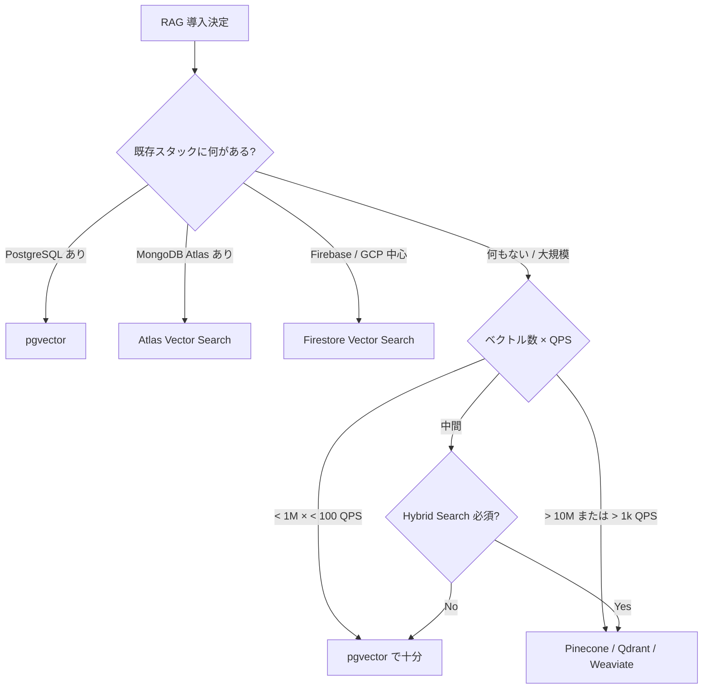
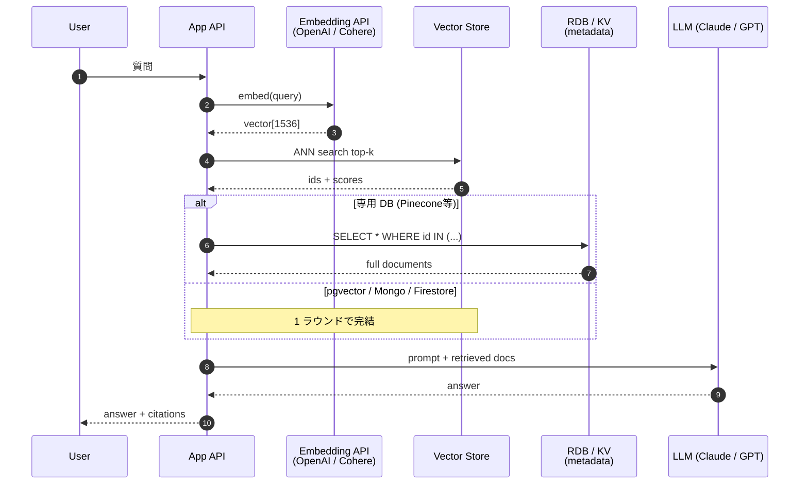
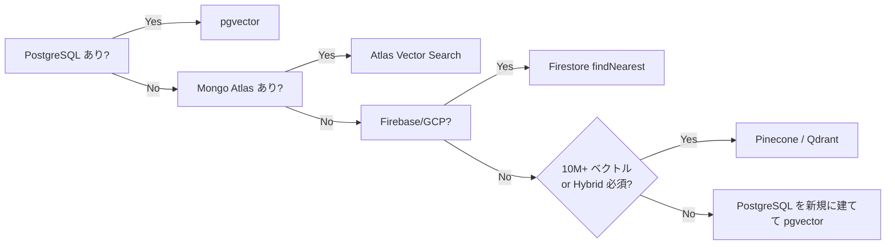

> RAG の入門記事 (例: [開発者のための RAG システムとベクトルデータベース実装ガイド (後編)](https://zenn.dev/acntechjp/articles/aa5f8e17e5af11)) で PostgreSQL + pgvector が選ばれることが多いのですが、現場で実際に問われるのは「**pgvector で良いのか、それとも Pinecone / Qdrant / Mongo Atlas / Firestore に逃げるべきか**」です。本記事はその選定を「決め切る」ための実務ガイドです。

「RAG を入れたい。ベクトル DB は何を使えば良いか」と毎週のように問われます。答えはほぼ毎回「pgvector で始めて良い」ですが、毎回「ほぼ」と付くのが厄介で、その「残り 2 割」を雑に判断すると半年後にデータ移行で泣きます。

本稿では、ベクトル DB の **4 つの流派** を実装サンプル付きで比較し、どの軸で選ぶべきかを決め切ります。読了後、自プロジェクトで使う DB を 30 秒で答えられる状態を目指します。

## 問題: 「ベクトル DB 戦争」に巻き込まれない

ベクトル DB の選定は、以下のような擬似的な問いに引きずられがちです。

- 「専用 DB の方が速いのでは?」 → 速度差は規模次第。10 万ベクトル未満なら誤差。
- 「pgvector はスケールしないのでは?」 → 1 億ベクトルまで実例あり (後述)。
- 「Pinecone は楽そう」 → ロックイン + コスト + 既存 DB との JOIN 不能。
- 「Mongo / Firestore は中途半端」 → むしろ既存スタックに乗るなら最強の選択。

結局のところベクトル DB 選定は、**「データ重力 (data gravity)」に従う**のが正解です。既にある DB の隣にベクトル列を生やすのが最も TCO が低く、運用も簡単です。専用 DB を主役にしてはいけません。



これだけ。本稿の結論を 1 枚にすると上図です。残りは各 DB の使い方と、選択を間違えないための実測データです。

## 解法: 4 流派を 1 つずつ動かす

### 流派 1: PostgreSQL + pgvector — 「8 割の正解」

[pgvector](https://github.com/pgvector/pgvector) は PostgreSQL 拡張で、`VECTOR(n)` 型と HNSW / IVFFlat インデックスを提供します。**RDB に普通の列としてベクトルが乗る**ため、トランザクション・JOIN・既存の ORM (Prisma / TypeORM) がそのまま使えます。

```sql
-- pgvector 0.7+ / PostgreSQL 16+
CREATE EXTENSION IF NOT EXISTS vector;

CREATE TABLE documents (
  id         BIGSERIAL PRIMARY KEY,
  tenant_id  BIGINT NOT NULL,
  content    TEXT NOT NULL,
  embedding  VECTOR(1536) NOT NULL,  -- OpenAI text-embedding-3-small
  created_at TIMESTAMPTZ NOT NULL DEFAULT now()
);

-- HNSW (高精度 / メモリ多め)
CREATE INDEX ON documents
  USING hnsw (embedding vector_cosine_ops)
  WITH (m = 16, ef_construction = 64);

-- マルチテナント分離は普通の B-tree で
CREATE INDEX ON documents (tenant_id);
```

クエリは普通の SQL です。

```typescript
// TypeScript (pg + pgvector npm)
import { Pool } from "pg";
import pgvector from "pgvector/pg";

const pool = new Pool({ connectionString: process.env.DATABASE_URL });
await pgvector.registerType(pool);

type SearchHit = { id: number; content: string; distance: number };

export async function searchSimilar(
  tenantId: number,
  queryEmbedding: number[],
  k: number,
): Promise<SearchHit[]> {
  const { rows } = await pool.query<SearchHit>(
    `
    SET LOCAL hnsw.ef_search = 40;
    SELECT id, content, embedding <=> $1 AS distance
      FROM documents
     WHERE tenant_id = $2
     ORDER BY embedding <=> $1
     LIMIT $3;
    `,
    [pgvector.toSql(queryEmbedding), tenantId, k],
  );
  return rows;
}
```

`<=>` は cosine distance 演算子です。`<->` は L2、`<#>` は内積 (符号反転)。

**規模感**: pgvector 公式ベンチマーク (HNSW + 768 次元) では、**1M ベクトルで p95 < 10ms、recall@10 = 0.99** が実測されています ([pgvector benchmarks](https://github.com/pgvector/pgvector#performance) で公開)。1 億ベクトル超 (1B+) の運用事例も [Supabase blog](https://supabase.com/blog/pgvector-vs-pinecone) が公開しており、「pgvector はスケールしない」は誤解です。

**Before / After**: 私が最初に書いていたコードは IVFFlat + `lists = 100` 決め打ちでした。50 万ベクトルを超えた時点で recall が 0.85 まで落ち、HNSW に張り替え + `ef_search` をクエリごとに設定する形に直しました。**ivfflat は「学習が必要」「データ追加後に再 INDEX が必要」という運用負債が大きく、新規採用なら HNSW 一択** です。

```sql
-- Before: 運用が辛かった IVFFlat
CREATE INDEX ON documents USING ivfflat (embedding vector_cosine_ops)
  WITH (lists = 100);
-- → データ追加で recall が劣化、REINDEX 必須

-- After: HNSW + クエリ単位の ef_search
CREATE INDEX ON documents USING hnsw (embedding vector_cosine_ops)
  WITH (m = 16, ef_construction = 64);
-- ef_search はクエリ単位で 10-100 を動的調整
```

### 流派 2: MongoDB Atlas Vector Search — 「document DB に同居」

ベクトルを **既存のドキュメントの 1 フィールド** として扱う発想です。MongoDB Atlas (cloud のみ。self-host MongoDB には未提供) の `$vectorSearch` aggregation stage で利用します。

```javascript
// Atlas Vector Search index 定義 (Atlas UI / API)
{
  "fields": [
    {
      "type": "vector",
      "path": "embedding",
      "numDimensions": 1536,
      "similarity": "cosine"
    },
    {
      "type": "filter",
      "path": "tenantId"
    }
  ]
}
```

```typescript
// TypeScript (mongodb 公式ドライバ)
import { MongoClient } from "mongodb";

type DocHit = { _id: string; content: string; score: number };

const client = new MongoClient(process.env.MONGO_URI!);
const col = client.db("rag").collection<DocHit>("documents");

export async function searchSimilar(
  tenantId: string,
  queryEmbedding: number[],
  k: number,
): Promise<DocHit[]> {
  return col
    .aggregate<DocHit>([
      {
        $vectorSearch: {
          index: "vector_index",
          path: "embedding",
          queryVector: queryEmbedding,
          numCandidates: k * 10,
          limit: k,
          filter: { tenantId },
        },
      },
      { $project: { content: 1, score: { $meta: "vectorSearchScore" } } },
    ])
    .toArray();
}
```

`numCandidates` が p95 と recall のトレードオフ調整つまみです。`k * 10` から始めて、recall が足りなければ `k * 20-30` に上げます。

**いつ選ぶか**: 既に MongoDB Atlas で document を管理しており、**新規 DB を増やさず RAG を載せたい**場合。Hybrid search (`$search` + `$vectorSearch`) を 1 つの aggregation で書ける利便性も大きいです。

**いつ避けるか**: self-host MongoDB は Vector Search 非対応です。「self-host で行く」と決まっているなら pgvector か Qdrant を選びます。

### 流派 3: Firestore Vector Search — 「サーバレス + モバイル」の正解

Google の Firestore は 2024 年から `VectorValue` 型と `findNearest` クエリをネイティブサポートしています ([Firestore vector search](https://cloud.google.com/firestore/docs/vector-search))。Cloud Functions / Cloud Run / Firebase Auth との接続が前提のプロジェクトなら、これが最短経路です。

```typescript
// TypeScript (@google-cloud/firestore)
// CLAUDE.md C-017: Firestore SDK は @google-cloud/firestore のみ
import { Firestore, FieldValue, VectorValue } from "@google-cloud/firestore";

const db = new Firestore({ preferRest: true });

type Doc = { content: string; embedding: VectorValue; tenantId: string };

export async function insertDocument(
  tenantId: string,
  content: string,
  embedding: number[],
): Promise<void> {
  await db.collection("documents").add({
    tenantId,
    content,
    embedding: FieldValue.vector(embedding),
    createdAt: FieldValue.serverTimestamp(),
  });
}

export async function searchSimilar(
  tenantId: string,
  queryEmbedding: number[],
  k: number,
): Promise<Array<{ id: string; content: string }>> {
  const snap = await db
    .collection("documents")
    .where("tenantId", "==", tenantId)
    .findNearest({
      vectorField: "embedding",
      queryVector: FieldValue.vector(queryEmbedding),
      limit: k,
      distanceMeasure: "COSINE",
    })
    .get();

  return snap.docs.map((d) => ({
    id: d.id,
    content: d.get("content") as string,
  }));
}
```

**実務で詰まる点**: Firestore の vector index は **composite index** として明示的に作成が必要で、`tenantId == ? AND findNearest(embedding)` の組合せで先に `firebase firestore:indexes` で deploy しておかないとクエリが落ちます。私が yomi-note で `reflections` collection に composite index 申請を忘れて 1 日詰まったのと同じ罠です。

**規模感**: Firestore の vector index は **ベクトル数の上限が collection 単位で 1 万**程度から始まり、document サイズ上限 (1MB) の中に embedding を載せます。**大量 (100M+) には向きません**。逆に、**ユーザ単位で数百〜数千ベクトル**で済むパーソナルアシスタント / メモアプリ / 顧客別 FAQ にはぴったりです。

### 流派 4: 専用 DB (Pinecone / Qdrant / Weaviate) — 「規模か機能で正当化」

**専用 DB を選ぶのは、既存 DB の制約を超えた時だけ**です。具体的には以下のいずれか。

1. **1,000 万 ベクトル超 + 1k QPS 超** — pgvector でも理論上行けますが、運用工数が爆発する
2. **Hybrid Search (sparse + dense) が必須** — BM25 + ベクトルの加重和を本気で運用したい
3. **Multi-region read replica が必須** — エッジ近くで低レイテンシ検索

代表的な 3 つの位置づけは以下です。

- **Pinecone** — フルマネージド SaaS。Serverless tier で $0 から起動可能、namespace でマルチテナント分離。Hybrid search ([sparse-dense vectors](https://docs.pinecone.io/guides/data/upsert-sparse-dense-vectors)) 対応。**運用ゼロを買う**選択肢。
- **Qdrant** — Rust 製。**payload filter (構造化フィルタ) が最も強い**。self-host / Qdrant Cloud 両対応。
- **Weaviate** — GraphQL ベース。modular vectorizer (HuggingFace / OpenAI 等を内部呼び出し) を持つため、**embedding 生成も DB に閉じ込めたい**ケースで有利。

```typescript
// Pinecone (serverless tier)
import { Pinecone } from "@pinecone-database/pinecone";

const pc = new Pinecone({ apiKey: process.env.PINECONE_API_KEY! });
const index = pc.index("documents").namespace("tenant-42");

export async function searchSimilar(
  queryEmbedding: number[],
  k: number,
): Promise<Array<{ id: string; score: number; content: string }>> {
  const res = await index.query({
    vector: queryEmbedding,
    topK: k,
    includeMetadata: true,
    filter: { lang: { $eq: "ja" } },
  });
  return res.matches.map((m) => ({
    id: m.id,
    score: m.score ?? 0,
    content: (m.metadata?.content as string) ?? "",
  }));
}
```

専用 DB は **既存 RDB と JOIN できない**ことが最大のコストです。「ベクトル検索で 100 件取って、users テーブルと JOIN して権限フィルタ」を素直に書けません。アプリ側で 2 段検索になり、N+1 や整合性問題が湧きます。

## 4 流派の比較を 1 シーケンス図に

実行時のレイテンシ構造を sequence で見ると、運用のクセが分かります。



**専用 DB は必ず 2 ラウンド** (vector store → RDB) になります。pgvector / Mongo / Firestore は **1 ラウンドで本文まで取り切れる**のが運用上の最大の差です。p95 が 50ms 違うかどうか、ではなく、**コードの単純さが 1 ラウンド分違う**のが本当の差です。

## 比較表 (4 流派 × 7 軸)

| 軸 | pgvector | Mongo Atlas | Firestore | 専用 DB |
|---|---|---|---|---|
| **既存スタック適合** | RDB あれば最強 | Atlas あれば最強 | GCP/Firebase なら最強 | 単独 |
| **トランザクション** | ◎ ACID | ○ Replica set | △ 単一 doc のみ | ✕ |
| **JOIN / 構造化フィルタ** | ◎ SQL 全部 | ○ aggregation | ○ where + findNearest | △ payload filter |
| **規模上限の現実値** | 1B+ (Supabase 実績) | 100M+ | < 10M (現実的) | 10B+ |
| **Hybrid Search** | △ 自前 | ◎ $search + $vectorSearch | ✕ 未対応 | ◎ (Pinecone/Weaviate) |
| **コスト構造** | RDB に同居 / 増分小 | Atlas tier 込み | document 課金 | 別 SaaS / +$70-200/月 |
| **運用 (DBA 観点)** | 既存 PG 運用流用 | Atlas 運用流用 | ゼロ運用 | 別系統で増える |

## 残課題: ここから先で詰まる 4 つ

ベクトル DB が動くだけでは RAG は使い物になりません。本番運用に乗せると、以下の 4 つで詰まります。これは DB 選定とは独立した、**RAG の共通課題**です。

### 1. Re-indexing 戦略 — embedding モデル変更時の地獄

OpenAI の text-embedding-3-small は 1536 次元、text-embedding-3-large は 3072 次元、Cohere embed-multilingual-v3.0 は 1024 次元 ([OpenAI Embeddings](https://platform.openai.com/docs/guides/embeddings) / [Cohere docs](https://docs.cohere.com/docs/cohere-embed))。**embedding モデルを変えた瞬間に全ベクトルが無価値になる**ため、再 embed 戦略を最初から組んでおく必要があります。

実務的には embedding バージョン列を持って、shadow column で並走させるのが安全です。

```sql
ALTER TABLE documents
  ADD COLUMN embedding_v2 VECTOR(3072),
  ADD COLUMN embedding_model TEXT NOT NULL DEFAULT 'text-embedding-3-small';
```

旧モデルで答えながら、バックグラウンドで `embedding_v2` を埋め、完了したら切替。これを「**ベクトルの blue-green デプロイ**」と私は呼んでいます。

### 2. Hybrid Search — 「ベクトルだけ」では recall@10 が頭打ちになる

純粋なベクトル検索は固有名詞 / コード片 / 型番に弱い、というのは [Anthropic Contextual Retrieval](https://www.anthropic.com/news/contextual-retrieval) でも数字で示されている通りです (BM25 を足すと top-20 失敗率が **35%** 改善という公開数値あり)。

- pgvector → ts_vector (BM25 的) と reciprocal rank fusion を自前
- Mongo Atlas → `$search` + `$vectorSearch` を 1 aggregation
- Firestore → 未対応 (アプリ側で別検索が必要)
- Pinecone / Weaviate → ネイティブ対応

「Hybrid Search が必須か」が、流派選択を割る最大の軸です。

### 3. Re-ranker の挿入位置

top-k で 50 件取って Cohere Rerank / Cross-encoder で top-5 に絞る、というのが現代の標準です。これはどの DB を選んでも同じで、**ベクトル DB の責務は recall を上げて top-50 を確実に返すこと**で、precision は re-ranker に任せます。`top-k = 5` で直叩きしている RAG はだいたい再現性が低いです。

### 4. Observability — 何を見れば「RAG が壊れている」と分かるか

ベクトル DB は「壊れていることが分かりにくい」のが本当に厄介です。最低でも以下を計測します。

- **retrieval hit rate** — 正解文書が top-k に含まれた割合 (golden set 必須)
- **embedding 生成 latency** (外部 API 依存。Cohere / OpenAI 障害で全停止する)
- **distance histogram** — 全クエリの最近傍距離を histogram で。突然 0.9+ が増えたら何かが壊れている
- **top-k diversity** — 同じ文書ばかり返るようになったら index 劣化サイン

## 理論根拠: なぜ「データ重力」に従うべきか

最後に、「結局 pgvector」「結局 Atlas」と既存 DB に寄せる選択がなぜ正しいのかを言語化しておきます。

1. **ベクトル検索は「メイン処理」ではない** — RAG パイプライン全体の中でベクトル検索のレイテンシは多くの場合 LLM 生成の 10-20% 程度です (p95 で LLM 生成が 2-5s に対しベクトル検索は 20-100ms 規模)。専用 DB に切り替えて 50ms 縮めても、全体への寄与は 1-2% です。
2. **メタデータと整合させる方が遥かに難しい** — 「最近 30 日 + tenant_id 一致 + 削除されていない + 自分が閲覧権限ある」を SQL で書けるか、payload filter DSL で書くかは、**コードの寿命に直結**します。
3. **embedding はいずれ作り直す** — モデルが進化するため、3 年使い続ける embedding はほぼ存在しません。**ベクトルは消える前提のキャッシュに近い**ものだと捉えると、「本体 DB の隣に置く」のが運用上自然です。

[Confluent CEO Jay Kreps の "Data Gravity"](https://www.confluent.io/learn/data-gravity/) や、[Sam Newman の "Coupling and Cohesion"](https://samnewman.io/talks/coupling/) で繰り返し語られてきた原則そのものです。「主役は既にある DB」「ベクトルは付随する 1 つの列 / 1 つの index」と捉えてください。

## まとめ: 30 秒で答えるフロー

冒頭の Mermaid をもう一度貼ります。これだけ覚えてください。



「Pinecone から検討」は逆順です。**まず手元にある DB から見て、足りなくなったら専用 DB に逃げる**。これが、データ移行で泣かない最短ルートです。

### 参考リンク

- [pgvector — GitHub](https://github.com/pgvector/pgvector)
- [MongoDB Atlas Vector Search](https://www.mongodb.com/products/platform/atlas-vector-search)
- [Firestore Vector Search](https://cloud.google.com/firestore/docs/vector-search)
- [Pinecone Docs](https://docs.pinecone.io/)
- [Qdrant Docs](https://qdrant.tech/documentation/)
- [Anthropic — Contextual Retrieval](https://www.anthropic.com/news/contextual-retrieval)
- 前編相当: [開発者のための RAG システムとベクトルデータベース実装ガイド (後編) — acntechjp](https://zenn.dev/acntechjp/articles/aa5f8e17e5af11)

---

ベクトル DB の選定で迷ったら、まず手元のスタックを見てください。**新しい DB を増やすことは、答えではなく問題の先送り**になることが多いです。
