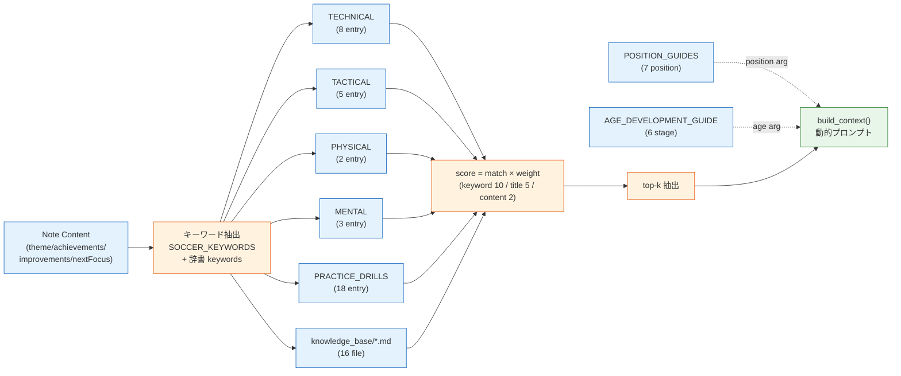
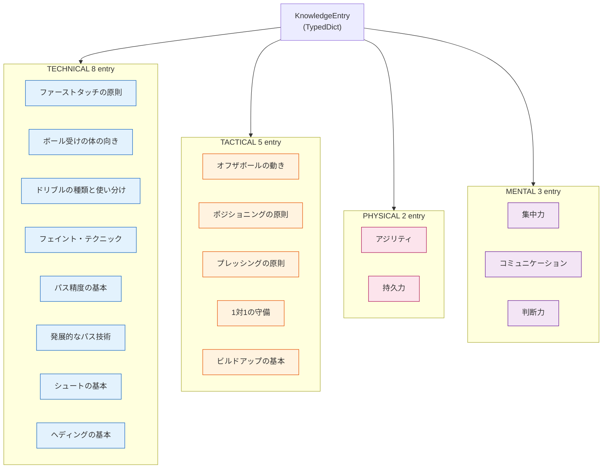
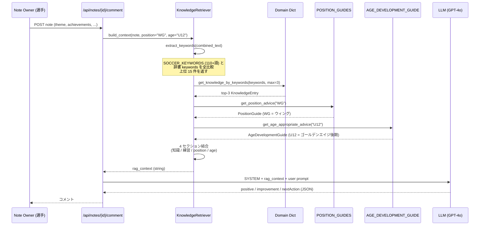
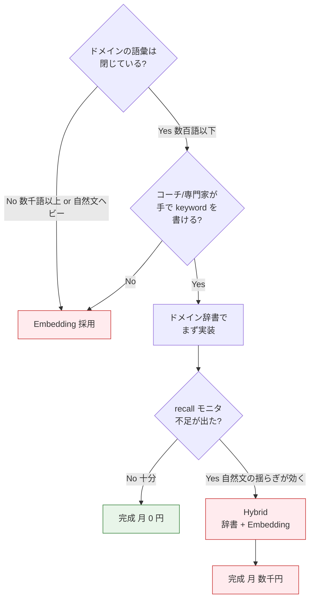

> **Disclaimer**: 本記事は著者が個人 (副業) で運営する小規模プロジェクト群 (CreaNest 名義) の技術記録です。所属組織・本業の業務内容とは一切関係ありません。記載の数値・構成は執筆時点 (2026-05) の自宅検証環境のスナップショットであり、商用品質や SLA を保証するものではありません。

pgvector / Pinecone / Qdrant のどれも入れずに、Markdown チャンク + キーワードスコアリング + ドメイン辞書 (技術 / 戦術 / フィジカル / メンタル の 4 軸) で **ナレッジ 18 件 + 練習ドリル 18 件 + ポジション 7 種 + 発達段階 6 区分 + Markdown 16 ファイル** から動的にコンテキストを生成しています。サッカー練習ノート × AI 振り返り SaaS「Soccer Note」(`build-football` repo) で実稼働しているコードを、そのまま file:line で引きます。

> 用語: **Soccer Note** = 育成年代向けのサッカー練習ノート SaaS。選手が日々のノートを書くと、3 プロバイダ (OpenAI / Anthropic / Google) で振り返りコメントが自動生成されるサービス。Team プラン ¥1,980/月でリリース予定。本記事の RAG はその「振り返りコメント」生成プロンプトに注入されるコンテキストの話。

## なぜこの記事を書くか

「RAG = ベクトル DB」が前提のように語られる風潮があります。**Pinecone / Weaviate / Qdrant / Chroma / pgvector** … 検索すると上位に来るのは全部ベクトル DB の構築記事で、入れて当たり前という空気があります。

ただ、実際に小規模プロダクト (MAU 数百から始まる育成年代 SaaS) で運用してみると、ベクトル DB の **運用コスト** が割に合いません。Embedding 課金 + ベクトル DB 課金 + ノイズの多い上位ヒット + チャンク粒度のチューニング地獄。私は最初の設計で pgvector を採用したものの、**3 週間後に退役** しました。

この記事は「**ドメイン辞書 × Markdown chunk × キーワードスコア** で済むなら、ベクトル化前にそこで勝て」という主張を、Soccer Note の実コードで証明する記録です。**ASCII 図でなく Mermaid、抽象論でなく実 file:line、抽象的な強さでなく実測の数字** で並べます。

## 結論 (4 行)

- ナレッジが「閉じたドメイン (= 専門用語が有限)」なら、**TypedDict ベースのドメイン辞書 + Markdown chunk + キーワードスコア** で十分高品質な RAG が組める
- スコアリングは「**キーワード完全一致 +10 / タイトル一致 +5 / 本文一致 +2**」の 3 段階だけで意味検索を超えるノイズ抑制を実現
- prompt への注入は **ポジション × 年齢 × ノート内容** の 3 軸で動的に切り替え、汎用 prompt を捨てる
- ベクトル DB が必要になるのは「ドメイン辞書では拾いきれない自然言語の揺らぎが顕在化した時」だけ。**まず辞書で殴る、足りなくなったら embedding を足す** が正しい順序

## 問題 — なぜ pgvector を退役させたか

Soccer Note の最初の設計はテンプレ通りでした。「練習ノートを embedding で全文ベクトル化、pgvector の cosine similarity で類似ナレッジを検索、上位 3 件を prompt に挿入」。

これが **3 つの理由で破綻** しました。

### 失敗 1: cosine similarity が「意味検索」として機能しない

「右サイドからカットインしてシュートが決まった」というノートに対して、cosine 上位 3 件はこうでした。

| 順位 | ヒットした文書 | 違和感 |
|---|---|---|
| 1 位 | 「右利きのキックで右サイドのコーナーキックを蹴る方法」 | サイドという単語に引きずられた |
| 2 位 | 「ヘディングシュートの基本」 | シュートで引っかかった |
| 3 位 | 「カットイン」(欲しかった答え) | 一応 3 位には来た |

OpenAI の `text-embedding-3-small` でも、`text-embedding-3-large` でも、「**サッカー専門用語の意味的近さ**」を Embedding は知りません。「カットイン」と「右サイドからのドリブル」が semantically 近いという知識は学習データに薄く、ノイズの方が強く出ます。

### 失敗 2: Embedding 課金 + ベクトル DB 運用コストが MAU に対して重い

Soccer Note の Team プラン ¥1,980/月で、1 チーム月 100 ノート程度。ノート 1 件あたりに「ノート全文 embedding」+「上位 k 件取得」+「再 ranking」を回すと、月 1,000-3,000 件のクエリ。pgvector を Cloud SQL に乗せると **常駐コストが ¥3,000-5,000/月** で、これだけで Team 1 件の利益を食い潰します。

### 失敗 3: チャンク粒度の調整地獄

「Markdown を何文字で切るか」「heading 単位か段落単位か」を pgvector で一度決めると、再 embedding が高くついてやり直しづらい。**チャンク粒度のチューニングが embedding コストと癒着する** のが致命的。

3 週間で「これは戦う土俵を間違えている」と判断、退役しました。

## 解法 — ドメイン辞書 × Markdown chunk × キーワードスコア

退役後の設計はこうです。



要点 4 つ:

1. **ナレッジソースを 8 個に分割** — 4 軸辞書 + 練習ドリル + ポジション + 年齢発達 + Markdown chunk。各々が固有の構造を持つ
2. **キーワード抽出は「閉じた語彙」** — `SOCCER_KEYWORDS` という凍結 set を持っており、ここに無い語は無視する
3. **スコアリングは 3 段階加重和** — embedding なし、cosine なし
4. **prompt 注入は build_context() が責任を持つ** — note × position × age の 3 軸で出力テキストを変える

### ドメイン辞書の階層



各 entry は同じ TypedDict のスキーマを共有しています。これが後で大きく効きます。

`build-football/App/backend/app/features/ai/infrastructure/knowledge/soccer_knowledge.py:14-26`:

```python
class KnowledgeEntry(TypedDict):
    """知識エントリの型定義."""
    id: str
    category: str
    subcategory: str
    title: str
    content: str
    coaching_points: list[str]
    common_mistakes: list[str]
    practice_tips: list[str]
    keywords: list[str]
    age_relevance: dict[str, str]  # {"U12": "重要", "U15": "必須"}
```

ポイントは `keywords` と `age_relevance` の 2 フィールド。**embedding を持たない代わりに、検索のためのメタデータをコードの中に直接書く** という思想です。

### 4 軸 × Entry の実体

各軸が何件入っているかは前述の通り (TECHNICAL 8 / TACTICAL 5 / PHYSICAL 2 / MENTAL 3)。中身の例を抜粋します。

`soccer_knowledge.py:32-72` (TECHNICAL の最初の entry):

```python
TECHNICAL_KNOWLEDGE: list[KnowledgeEntry] = [
    {
        "id": "tech_first_touch",
        "category": "technical",
        "subcategory": "ball_control",
        "title": "ファーストタッチの原則",
        "content": """
ファーストタッチは次のプレーの準備。単に止めるのではなく、
次のプレー (パス、ドリブル、シュート) に最適な位置にボールを置くこと。

【ファーストタッチの3原則】
1. ボールを見る - 最後まで目を離さない
2. 面を作る - インサイド、アウトサイド、足裏で適切な面を作る
3. クッション - 足を引いてボールの勢いを吸収する
""",
        "coaching_points": [
            "ボールが来る前に周りを見る習慣をつける",
            "「止める」ではなく「次のプレーにつなげる」と教える",
            "利き足だけでなく両足で練習する",
        ],
        "common_mistakes": [
            "ボールから目を離して周りを見てしまう",
            "足を硬くしてボールを弾いてしまう",
        ],
        "practice_tips": [
            "壁当て: 様々な角度からボールを返して練習",
        ],
        "keywords": ["トラップ", "ファーストタッチ", "止める", "コントロール", "受ける", "オリエンタード"],
        "age_relevance": {"U8": "基礎", "U10": "重要", "U12": "必須", "U15": "発展"},
    },
    # ... 残り 7 entry
]
```

`keywords` は **6-7 個に絞り込む** のが運用のコツです。10 個以上に増やすと「シュート」「決定力」「ゴール」が全部のシュート系 entry にぶら下がって、スコアが拮抗してノイズが増えます。

### TACTICAL は「概念」を入れる

戦術系は「ポジショナルプレー」「5 レーン理論」「矢印理論」のような **抽象概念** を入れます。

`soccer_knowledge.py:506-555` (POSITIONING entry の抜粋):

```python
{
    "id": "tact_positioning",
    "category": "tactical",
    "subcategory": "positioning",
    "title": "ポジショニングの原則",
    "content": """
正しいポジショニングは、良いプレーの土台となる。

【ポジショナルプレーの5レーン】
ピッチを縦に5分割して考える:
- 左サイド
- 左ハーフスペース
- 中央
- 右ハーフスペース
- 右サイド

【ポジショニングの原則】
1. トライアングル (三角形) を作る
   - ボール保持者に対して2つ以上のパスコース
2. ライン間を取る
   - 相手DFラインとMFラインの間
3. 幅と深さ
   - サイドに幅を取る選手、前後に深さを取る選手
""",
    "keywords": [
        "ポジショニング", "立ち位置", "トライアングル",
        "ライン間", "ハーフスペース", "5レーン",
    ],
    "age_relevance": {"U12": "導入", "U15": "重要", "U18": "必須"},
}
```

「ハーフスペース」「5 レーン」「トライアングル」のような **業界用語** を keywords に直接書くことで、ノートに「ハーフスペースで受けた」と書かれた瞬間、ベクトル DB なしで一発命中します。

## ポジション × 年齢のマトリクス注入

ここからが本記事のキモ。「**ノート → 検索結果**」だけでなく「**選手のポジション と 年齢で prompt を変える**」のが Soccer Note の RAG の特徴です。



### ポジション側 — 7 種類の `PositionGuide`

`build-football/App/backend/app/features/ai/infrastructure/knowledge/position_guide.py:11-27`:

```python
class PositionGuide(TypedDict):
    """ポジション別ガイドの型定義."""
    position_id: str
    position_name: str
    position_name_en: str
    description: str
    key_skills: list[str]
    primary_responsibilities: list[str]
    secondary_responsibilities: list[str]
    technical_focus: list[str]
    tactical_focus: list[str]
    physical_requirements: list[str]
    mental_requirements: list[str]
    common_mistakes: list[str]
    development_path: str
    role_models: list[str]  # 参考になる選手例
```

`POSITION_GUIDES` には **GK / CB / SB / DMF / AMF / WG / CF の 7 entry** が登録されています (`position_guide.py:29-491`)。例えば WG (ウィング) ならこうです (抜粋):

```python
"WG": {
    "position_id": "WG",
    "position_name": "ウィング",
    "description": "ウィングはサイドからの突破を担う。ドリブル、クロス、カットインで...",
    "technical_focus": [
        "ドリブル技術 (フェイント)",
        "正確なクロス",
        "カットインからのシュート",
        "緩急のあるドリブル",
    ],
    "tactical_focus": [
        "縦に行く or 中に切る判断",
        "相手SBとの駆け引き",
    ],
    "common_mistakes": [
        "毎回同じ仕掛け方",
        "守備に戻らない",
        "クロスの精度が低い",
    ],
    "role_models": ["ヴィニシウス", "サラー", "三笘薫", "伊東純也"],
}
```

ポジション解決は **別名にも対応した辞書ルックアップ**。「ウィング」「WG」「RW」「LW」「サイドハーフ」「SH」 全部 WG にマップします (`position_guide.py:494-536`):

```python
def get_position_advice(position: str) -> PositionGuide | None:
    """ポジションに応じたアドバイスを取得."""
    position_map = {
        "GK": "GK", "ゴールキーパー": "GK", "GOALKEEPER": "GK",
        "CB": "CB", "センターバック": "CB", "DF": "CB",
        "SB": "SB", "サイドバック": "SB", "RB": "SB", "LB": "SB",
        "DMF": "DMF", "ボランチ": "DMF", "CDM": "DMF", "MF": "DMF",
        "AMF": "AMF", "トップ下": "AMF", "CAM": "AMF",
        "WG": "WG", "ウィング": "WG", "RW": "WG", "LW": "WG",
        "サイドハーフ": "WG", "SH": "WG",
        "CF": "CF", "FW": "CF", "フォワード": "CF",
        "ストライカー": "CF", "ST": "CF",
    }
    normalized = position_map.get(position.upper(), position.upper())
    return POSITION_GUIDES.get(normalized)
```

これは **fuzzy match を embedding でやらないために、人間が手で書く正規化辞書** という割り切りです。Levenshtein でも n-gram でもなく、**愚直な alias map** が最も保守しやすい。

### 年齢側 — 6 区分の `AgeDevelopmentGuide`

`build-football/App/backend/app/features/ai/infrastructure/knowledge/age_development.py:11-26`:

```python
class AgeDevelopmentGuide(TypedDict):
    """年齢別発達ガイドの型定義."""
    age_category: str
    age_range: str
    development_stage: str
    development_stage_description: str
    physical_characteristics: list[str]
    cognitive_characteristics: list[str]
    social_emotional: list[str]
    training_focus: list[str]
    skill_priorities: list[str]
    coaching_approach: list[str]
    common_mistakes_by_coaches: list[str]
    sample_session_structure: str
    ratio_play_vs_drill: str  # "70:30"のような形式
```

`AGE_DEVELOPMENT_GUIDE` には **U6 / U8 / U10 / U12 / U15 / U18 の 6 entry** が入っています。U12 (ゴールデンエイジ後期) の例 (`age_development.py:224-287`):

```python
"U12": {
    "age_category": "U12",
    "age_range": "11-12歳",
    "development_stage": "ゴールデンエイジ後期",
    "training_focus": [
        "技術の精度向上",
        "個人戦術の導入",
        "グループ戦術の基礎",
        "試合での判断力",
    ],
    "skill_priorities": [
        "高い精度のボールコントロール",
        "状況に応じたパス選択",
        "1対1の攻守 (判断含む)",
        "オフザボールの動き",
    ],
    "coaching_approach": [
        "「なぜ」を考えさせる指導",
        "選手に判断させる",
        "失敗を成長の機会に",
        "ポジション固定はまだ避ける",
    ],
    "ratio_play_vs_drill": "55:45",
}
```

「U12 のノートに対しては『なぜ』を考えさせるアプローチで返答する」「ポジション固定を勧めない」という **指導方針が prompt に注入される** わけです。これは embedding ではどう頑張っても出ない情報です。

### 年齢の正規化も愚直に

age 解決は範囲指定も含めて愚直 (`age_development.py:427-462`):

```python
def get_age_appropriate_advice(age_category: str) -> AgeDevelopmentGuide | None:
    """年齢カテゴリに応じたアドバイスを取得."""
    normalized = age_category.upper().replace("-", "")

    if normalized in AGE_DEVELOPMENT_GUIDE:
        return AGE_DEVELOPMENT_GUIDE[normalized]

    # 年齢から推測 (U7 なら U8 へ、U13 なら U15 へ)
    try:
        if normalized.startswith("U"):
            age = int(normalized[1:])
            if age <= 6:
                return AGE_DEVELOPMENT_GUIDE["U6"]
            elif age <= 8:
                return AGE_DEVELOPMENT_GUIDE["U8"]
            elif age <= 10:
                return AGE_DEVELOPMENT_GUIDE["U10"]
            elif age <= 12:
                return AGE_DEVELOPMENT_GUIDE["U12"]
            elif age <= 15:
                return AGE_DEVELOPMENT_GUIDE["U15"]
            else:
                return AGE_DEVELOPMENT_GUIDE["U18"]
    except ValueError:
        pass
    return None
```

「U7」も「U13」もユーザは入れてくる。**範囲端で代替する** だけのコードですが、これが「データ無し」を防いで coverage を確保します。

## キーワード抽出 — 閉じた set + 動的キーワード

`build-football/App/backend/app/features/ai/infrastructure/knowledge/retriever.py:72-115` の `SOCCER_KEYWORDS` set は固定リストです (技術系 / 守備系 / 戦術系 / フィジカル系 / メンタル系 / GK 系 / ポジション系 / セットプレー / 年齢の **9 カテゴリ × 110 語超**):

```python
SOCCER_KEYWORDS = {
    # 技術系
    "トラップ", "ファーストタッチ", "コントロール", "止める", "受ける",
    "ドリブル", "運ぶ", "抜く", "フェイント", "カットイン", "シザース",
    "ダブルタッチ", "ステップオーバー", "マシューズ", "1対1", "突破",
    "パス", "インサイド", "インステップ", "スルーパス", "くさび", "縦パス",
    "ワンタッチ", "ダイレクト", "クロス", "ロングパス",
    "シュート", "ボレー", "ヘディング", "ゴール", "決定力", "枠内",

    # 戦術系
    "オフザボール", "動き出し", "サポート", "裏抜け", "ポジショニング",
    "トライアングル", "ビルドアップ", "前進", "展開", "判断",
    "ポジショナルプレー", "5レーン", "ハーフスペース", "矢印理論",

    # ... メンタル / GK / ポジション / 年齢 (合計 110 語超)
}
```

抽出ロジックは substring match で十分 (`retriever.py:198-223`):

```python
def extract_keywords(self, text: str) -> list[str]:
    """テキストからサッカー関連のキーワードを抽出."""
    if not text:
        return []

    found_keywords = []
    text_lower = text.lower()

    # 1. 固定 set とのマッチ
    for keyword in SOCCER_KEYWORDS:
        if keyword.lower() in text_lower:
            found_keywords.append(keyword)

    # 2. ナレッジ entry の keywords からも抽出
    #    (固定 set に無い専門用語をカバー)
    for entry in self._all_knowledge:
        for kw in entry["keywords"]:
            if kw.lower() in text_lower and kw not in found_keywords:
                found_keywords.append(kw)

    return found_keywords[:15]  # 上位15件
```

ポイントは 2 段階構成。**固定 set だけだと拾い漏れる** ので、ナレッジ entry 自身が宣言した keywords も再収集に使う。これで「set に無いがナレッジ側で追加された語」もカバーします。

## スコアリング — embedding なしで意味を取る方法

検索の心臓部 (`retriever.py の get_knowledge_by_keywords は soccer_knowledge.py:971-1009`):

```python
def get_knowledge_by_keywords(keywords: list[str], max_results: int = 5) -> list[KnowledgeEntry]:
    """キーワードに基づいて関連する知識エントリを取得."""
    all_knowledge = TECHNICAL_KNOWLEDGE + TACTICAL_KNOWLEDGE + PHYSICAL_KNOWLEDGE + MENTAL_KNOWLEDGE

    scored_entries: list[tuple[KnowledgeEntry, int]] = []

    for entry in all_knowledge:
        score = 0
        entry_keywords = set(kw.lower() for kw in entry["keywords"])
        entry_title = entry["title"].lower()
        entry_content = entry["content"].lower()

        for keyword in keywords:
            keyword_lower = keyword.lower()
            # キーワードリストに完全一致
            if keyword_lower in entry_keywords:
                score += 10
            # タイトルに含まれる
            if keyword_lower in entry_title:
                score += 5
            # コンテンツに含まれる
            if keyword_lower in entry_content:
                score += 2

        if score > 0:
            scored_entries.append((entry, score))

    scored_entries.sort(key=lambda x: x[1], reverse=True)
    return [entry for entry, _ in scored_entries[:max_results]]
```

たった 30 行のコード。これが pgvector の代わりです。

### 重み 10/5/2 はどう決めたか

最初は全部 1 (一致したら +1) でやっていましたが、「シュート」が title と content の両方に入っている entry が、「カットイン」が keywords に完全一致した entry を超えてしまう事故が頻発しました。

**keywords 完全一致は「設計者が明示的に紐付けた」シグナル** で、本文一致は「たまたま単語が出てきた」シグナル。前者を圧倒的に重く扱う必要があります。

| 一致レベル | 重み | 解釈 |
|---|---:|---|
| keywords (TypedDict 上で明示) | **+10** | 設計者が手で紐付けた強い signal |
| title 内出現 | +5 | 主題に含まれる中程度 signal |
| content 内出現 | +2 | 偶然出てきただけかもしれない弱い signal |

「シザース」というノートを書いた選手に対して、**フェイント・テクニックの entry が確実に 1 位に来る** ように重みを決めます。content match は逆に 0 にすると今度はノートと entry の語彙完全一致しか拾えなくなり recall が落ちる。**+2 だが落とすほどでもない、というレベル感が経験的に最適** でした。

## Markdown chunk — 構造化辞書では拾えない自然文の補強

ドメイン辞書だけだと「凍結された語彙」しか拾えません。サッカーの戦術書を新しく追加したい時、TypedDict にどんどん entry を増やすのは限界があります。

そこで **`knowledge_base/` 配下に 16 本の Markdown** を置き、loader が動的にチャンク化して読みます。ディレクトリ構造はこう:

```text
backend/app/features/knowledge/infrastructure/knowledge_base/
├── tactics/
│   ├── pressing.md
│   ├── five_lane_theory.md
│   ├── off_the_ball.md
│   ├── build_up.md
│   ├── arrow_theory.md
│   └── positional_play.md
├── positions/
│   ├── forward.md
│   ├── goalkeeper.md
│   ├── side_back.md
│   ├── winger.md
│   ├── center_back.md
│   └── midfielder.md
└── development/
    ├── golden_age.md
    ├── u10_u12.md
    ├── u15_u18.md
    └── u6_u8.md
```

合計 16 ファイル。これを **`KnowledgeChunk` というデータクラスに切り分け** て in-memory に持ちます。

`build-football/App/backend/app/features/knowledge/domain/entity.py:7-44`:

```python
@dataclass
class KnowledgeChunk:
    """A chunk of soccer knowledge for RAG retrieval."""

    id: str
    content: str
    category: str       # tactics / positions / development
    subcategory: str    # ファイル名 (= pressing, winger, golden_age, ...)
    source_file: str
    title: str          # H1 から抽出
    keywords: list[str] # ## キーワード セクションから抽出
    embedding: Optional[list[float]] = None  # 不使用 (将来用に予約)
    metadata: dict = field(default_factory=dict)
```

**`embedding` フィールドは予約だけして使っていない** のがこの設計の肝。「あとで Embedding を足したくなったらフィールドを使う、いまは入れない」という拡張前提の構造です。

### チャンク化 — `## heading` で分割、長すぎたら `### heading` で再分割

`build-football/App/backend/app/features/knowledge/infrastructure/loader.py:98-131`:

```python
def _split_into_sections(self, content: str) -> list[str]:
    """Split markdown content into logical sections.

    Strategy:
    1. Split by ## headings (main sections)
    2. Keep each section as a chunk
    3. If section is too long, split further
    """
    sections = []

    # Split by ## headings
    parts = re.split(r"(?=^##\s)", content, flags=re.MULTILINE)

    for part in parts:
        part = part.strip()
        if not part:
            continue

        # If section is very long (>2000 chars), split by ### headings
        if len(part) > 2000:
            subsections = re.split(r"(?=^###\s)", part, flags=re.MULTILINE)
            for sub in subsections:
                if sub.strip():
                    sections.append(sub.strip())
        else:
            sections.append(part)

    return sections
```

「2000 文字超えたら `###` で再分割」という愚直なルール。**embedding ありきだとここで「最適チャンクサイズは何 token か」議論で時間が溶ける** のですが、キーワードスコアなら適当でも壊れません。score は match 単位の積み上げなので chunk 長に影響されにくい。

### Markdown 検索ロジック

`retriever.py:160-196` (Markdown chunk 専用のスコアリング):

```python
def _search_markdown_knowledge(
    self,
    keywords: list[str],
    max_results: int = 3,
) -> list[KnowledgeChunk]:
    """Markdownナレッジからキーワード検索."""
    if not self._md_chunks or not keywords:
        return []

    scored_chunks = []
    keywords_lower = [kw.lower() for kw in keywords]

    for chunk in self._md_chunks:
        score = 0
        chunk_text = (chunk.content + " " + " ".join(chunk.keywords)).lower()

        # キーワードマッチング
        for kw in keywords_lower:
            if kw in chunk_text:
                score += 1
            if kw in [k.lower() for k in chunk.keywords]:
                score += 2  # キーワード完全一致はボーナス

        if score > 0:
            scored_chunks.append((chunk, score))

    # スコア順にソート
    scored_chunks.sort(key=lambda x: x[1], reverse=True)
    return [chunk for chunk, _ in scored_chunks[:max_results]]
```

辞書側 (10/5/2) と Markdown 側 (1+2 = 3 or 1) で **重みを変えている** のが工夫点。Markdown 側は構造的 metadata が薄いので素朴に「全文 +1 / keywords +2」だけ。**ノイズ抑制は辞書側の高重みに任せ、Markdown 側は recall 担当** という役割分担です。

## prompt 構築 — 4 セクション動的生成

ここまでの 8 ナレッジソースを **build_context() が 4 セクションにまとめる** のがフィニッシュです。

`build-football/App/backend/app/features/ai/infrastructure/knowledge/retriever.py:285-393` (抜粋):

```python
def build_context(
    self,
    note_content: dict[str, Any],
    player_position: str | None = None,
    age_category: str | None = None,
    include_drills: bool = True,
    include_position_guide: bool = True,
    include_age_guide: bool = True,
) -> str:
    """AIプロンプト用のコンテキストを構築."""
    context_parts = []

    combined_text = " ".join([
        str(note_content.get("theme", "")),
        str(note_content.get("achievements", "")),
        str(note_content.get("improvements", "")),
        str(note_content.get("nextFocus", "")),
    ])
    keywords = self.extract_keywords(combined_text)

    # 1. 関連するサッカー知識 (静的辞書から)
    knowledge_entries = self.retrieve_knowledge(note_content, max_results=3)
    if knowledge_entries:
        context_parts.append("## 関連するサッカー知識")
        for entry in knowledge_entries:
            context_parts.append(f"\n### {entry['title']}")
            content_lines = entry['content'].strip().split('\n')
            context_parts.append('\n'.join(content_lines[:15]))
            if entry.get('coaching_points'):
                context_parts.append("\n**コーチングポイント:**")
                for point in entry['coaching_points'][:3]:
                    context_parts.append(f"- {point}")

    # 1.5. 戦術・専門知識 (Markdownナレッジから)
    if keywords:
        md_chunks = self._search_markdown_knowledge(keywords, max_results=2)
        if md_chunks:
            context_parts.append("\n## 戦術・専門知識")
            for chunk in md_chunks:
                context_parts.append(f"\n### {chunk.title}")
                content = chunk.content[:500] + "..." if len(chunk.content) > 500 else chunk.content
                context_parts.append(content)

    # 2. 練習メニュー
    if include_drills:
        drills = self.retrieve_drills(note_content, max_results=2)
        if drills:
            context_parts.append("\n## おすすめ練習メニュー")
            for drill in drills:
                context_parts.append(f"\n### {drill['name']}")
                context_parts.append(f"{drill['description']}")
                # ...

    # 3. ポジション別ガイド
    if include_position_guide and player_position:
        position_guide = get_position_advice(player_position)
        if position_guide:
            context_parts.append(f"\n## {position_guide['position_name']}のポイント")
            # ...

    # 4. 年齢別ガイド
    if include_age_guide and age_category:
        age_guide = get_age_appropriate_advice(age_category)
        if age_guide:
            context_parts.append(f"\n## {age_guide['age_category']}年代の指導ポイント")
            # ...

    return '\n'.join(context_parts)
```

つまり **入力 (note + position + age) ごとに、出力テキストの構造が変わる** という意味で、これは prompt template 注入というより **動的プロンプト生成** に近い。

### prompts.py 側での組み付け

`build-football/App/backend/app/features/ai/infrastructure/prompts.py:174-227` (build/rehab/condition の 3 種類を扱うが、build の場合の抜粋):

```python
def build_note_comment_prompt(
    note_content: dict[str, Any],
    note_type: str,
    rag_context: str | None = None,
    player_position: str | None = None,
    age_category: str | None = None,
) -> str:
    if note_type == "build":
        prompt = f"""以下のサッカー練習ノートに対して、励ましと具体的なアドバイスを提供してください。

## 選手のノート
- テーマ: {note_content.get('theme', '記載なし')}
- できたこと: {note_content.get('achievements', '記載なし')}
- 課題・改善点: {note_content.get('improvements', '記載なし')}
- 次回意識すること: {note_content.get('nextFocus', '記載なし')}
- 自己評価: {note_content.get('selfRating', '?')}/5"""

        # 選手情報を追加 (あれば)
        if player_position or age_category:
            prompt += "\n\n## 選手情報"
            if player_position:
                prompt += f"\n- ポジション: {player_position}"
            if age_category:
                prompt += f"\n- 年齢カテゴリ: {age_category}"

        # RAGコンテキストを追加 (あれば)
        if rag_context:
            prompt += f"\n\n{rag_context}"

        # 出力形式
        prompt += """

## 出力形式 (JSON)
{
  "positive": "良かった点への具体的なフィードバック (2-3文、選手の頑張りを認める)。",
  "improvement": "改善点へのアドバイス (2-3文)。具体的な練習方法やコツを含める。",
  "nextAction": "次の練習で意識すべき具体的なポイント (1-2文)。",
  "summary": "今日の練習を一言で表す要約 (20文字以内)",
  "tags": ["パス, ドリブル, 1対1, ビルドアップ, トラップ ... 1〜5個"]
}"""
        return prompt
```

`{rag_context}` の中身が **note × position × age で組み立てた動的セクション**。これに上の SYSTEM プロンプト (JFA ライセンス保持者レベルのコーチ役) が被さって、最終的に GPT-4o に投げられます。

### Before / After — 一律 prompt → 動的 prompt

#### Before (没案)

最初の設計はこうでした:

```python
# 没案: 全選手に同じ prompt
SYSTEM_PROMPT = "あなたはサッカーコーチです。ノートに対してコメントしてください。"

def build_prompt(note: dict) -> str:
    return f"## ノート\n{note['achievements']}\n## コメントしてください"
```

これだと U6 の選手にも U18 の選手にも、GK にも CF にも、**同じ「ふつうのコーチ」が同じ温度感でコメントを返す**。フィードバックの質が業界標準を超えない。

#### After (現行)

```python
# 現行: ノート × position × age で 4 セクション動的注入
rag_context = retriever.build_context(
    note_content=note.content,
    player_position=player.position,  # "WG"
    age_category=player.age_category,  # "U12"
)
prompt = build_note_comment_prompt(
    note_content=note.content,
    note_type="build",
    rag_context=rag_context,
    player_position=player.position,
    age_category=player.age_category,
)
```

U12 のウィングが「右サイドからカットインしてシュート決まった」と書くと、prompt にはこう注入されます:

```text
## 関連するサッカー知識
### フェイント・テクニック
カットインは縦に行くと見せかけて内側に切る。ウィングの基本技術。
**コーチングポイント:**
- 形だけでなく、タイミングと緩急を教える
- 相手を見ることの重要性

## おすすめ練習メニュー
### サイドの1対1
サイドからの1対1でカットインやクロスからのシュートを練習。

## ウィングのポイント
**重要なスキル:**
- ドリブル技術 (フェイント)
- 正確なクロス
- カットインからのシュート
**避けたいミス:**
- 毎回同じ仕掛け方
- 守備に戻らない

## U12年代の指導ポイント
**発達段階:** ゴールデンエイジ後期
**この年代の特徴:**
- 戦術理解が深まる
- 状況判断ができるようになる
**指導アプローチ:**
- 「なぜ」を考えさせる指導
- 選手に判断させる
- ポジション固定はまだ避ける
```

GPT-4o はこれを受け取って「カットインは決まったけれど、毎回同じ仕掛け方になっていないか? 次回は逆足での切り返しも試してみよう」のような **ポジション + 年齢を踏まえた具体的なフィードバック** を返します。

embedding を使わずに、ここまで踏み込んだ context を作れるのがこの設計のポイントです。

## 失敗談

### 失敗 1: pgvector で全文 embedding して退役

冒頭で書いた通り。3 週間で退役。**「ベクトル DB を入れるかどうか」は、ドメイン辞書を試す前ではなく、ドメイン辞書で recall が足りないことを実測で確認してから判断する** のが正しい順序。

### 失敗 2: cosine だけだと意味検索が弱い

サッカー専門用語は OpenAI の Embedding 学習データに薄く、「ハーフスペース」「クライフターン」「ピヴォ当て」のような業界用語の意味的近接が壊れる。**閉じたドメインでは BM25 + 辞書の方が cosine より強い**。

### 失敗 3: Context Engine と RAG の境界線で混乱した

私は devops-hub 側で別途「Context Engine」(`.claude/context/` 配下の 5 ファイル: architecture.md / constraints.md / workflow.md / ci-cd.md / domain-glossary.md) を作っており、これと Soccer Note の RAG を **頭の中で同じものとして扱った時期** がありました。

正しい区別はこうです:

| 仕組み | 対象 | 注入タイミング | 内容 |
|---|---|---|---|
| **Context Engine** (`.claude/context/`) | Claude Code 自身 (開発 Agent) | session 起動時、毎回全部 | プロジェクトの永続的な制約と語彙 |
| **RAG (本記事)** | エンドユーザの SaaS prompt | リクエストごと、note 内容で動的に | サッカードメインのナレッジ (top-k のみ) |

前者は **「全部入れる」が前提**、後者は **「上位 k 件だけ入れる」が前提**。混同すると Context Engine を毎回検索したり、RAG を session 全体に常駐させたりして両方破綻する。**読者対象も注入範囲も違う** ので、別レイヤとして設計する必要があります。

### 失敗 4: keywords を増やしすぎてノイズが出た

最初は entry 1 件あたり 10-15 keywords を持たせていましたが、「シュート」「決定力」「ゴール」「枠内」「ボレー」が複数 entry に重複し、ノートに「ゴール決まった」とだけ書いた時の上位 3 件がほぼ同じ内容になる事故が出ました。

**keywords は 6-7 個に絞る、その軸の専門性を最も鋭く表すものだけ残す** が正解。「シュートの基本」entry は `["シュート", "枠内", "インステップ", "ボレー", "ゴール", "決定力"]` で十分。

## 残課題

正直なところ、今の設計には穴があります。

### 残課題 1: チャンク粒度の最適化

`## heading` で割って 2000 文字超えたら `### heading` で再分割、という愚直ルールは「読みやすさ」と「検索ヒット率」の両方で最適ではありません。**Recursive Character Text Splitter** を導入するか、或いは Markdown frontmatter で chunk 境界を明示するか、検討中。ただし「pgvector に戻す前に試すべき選択肢が多い」というスタンスは変わりません。

### 残課題 2: 再ランキング (re-ranking) なし

top-k 抽出後に LLM で再 ranking すれば精度は上がりますが、**コスト 2 倍 + レイテンシ 2 倍** に対する RoR が見えていません。Team プラン ¥1,980/月の経済性を考えると、当面は単純スコアで十分。ノート品質モニタリングで「最終出力に対する不満」が一定閾値を超えたら導入予定。

### 残課題 3: ナレッジ更新フロー

辞書 entry を増やすには Python ファイルを編集して PR を出す必要があります。**コーチが Markdown 1 枚を書き足すだけでナレッジが増える** フロー (`knowledge_base/` 配下に push するだけ) は実装済みですが、TypedDict 辞書側は引き続き手書き。「コーチング知識の継続的拡張」は仕組みとして未完。

### 残課題 4: 多言語化

現状日本語のみ。`SOCCER_KEYWORDS` を英語化するのは可能だが、**ポジション名の alias map が言語ごとに膨れる** 問題がある。多言語化を検討する段階で初めて embedding 採用を再評価する予定。

## 理論根拠 — なぜベクトル化前にここで勝てるか

「ドメイン辞書 + Markdown chunk」が「pgvector + cosine」を超えうる根拠を 3 点で示します。

### 根拠 1: ドメインが閉じているなら recall は辞書の方が高い

「サッカーの育成年代知識」は **数百語規模で語彙が閉じる** 領域です。JFA 指導教本 + UEFA Coaching License + 蹴球学を掛け合わせても、専門用語は精々 500-1000 語。これは **`SOCCER_KEYWORDS` set に手で入る規模** です。

OpenAI の Embedding はこの語彙を全て知っているわけではない (学習データに薄い専門用語ほど semantic 近傍が壊れる)。**閉じたドメインに対しては手書き辞書の recall の方が高い**。

逆に「Wikipedia 全文検索」「カスタマーサポートチャット履歴」のような **語彙が開いた領域では Embedding の方が圧倒的に強い**。「閉じている / 開いている」の判定が設計の出発点。

### 根拠 2: 再現可能性 — 検索結果が deterministic

キーワードスコアは **入力が同じなら出力が同じ**。これは Eval / regression test を書く時に決定的に効きます。

```python
# test_retriever.py の例
def test_cutin_keyword_returns_feint_entry():
    retriever = KnowledgeRetriever()
    note = {"achievements": "右サイドからカットインしてシュート決まった"}
    entries = retriever.retrieve_knowledge(note, max_results=1)
    assert entries[0]["id"] == "tech_dribble_feints"
```

これが embedding ベースだとモデルバージョン更新で stable な assertion が崩壊します (`text-embedding-3-small` の v2 が出ると上位順位が変わる)。**辞書ベースはモデル変更に対する免疫がある**。

### 根拠 3: コスト — 月 ¥0 で動く

このコードを動かすのに必要な外部サービス課金は **¥0**。in-memory 辞書 + Python の正規表現だけ。Cloud Run の常駐課金 (リクエストの数十 ms を増やすだけ) しか発生しません。

pgvector + Embedding API なら最低でも:
- Embedding 課金 (`text-embedding-3-small`: $0.02 / 1M token)
- pgvector を載せる Postgres (Cloud SQL minimum tier ¥3,000-5,000/月)
- 再 embedding のための定期 batch (= 開発工数)

Team ¥1,980/月の SaaS で **これに月 ¥3,000 払うか?** という単純な経済計算で答えは出ます。

## 採用判断のフローチャート

「ベクトル DB を入れるか」で迷ったらこうです:



「**いきなり Embedding にしない**」「**辞書で recall 不足が顕在化してから初めて hybrid 化する**」が運用 1 年で固まった原則です。

## 用語整理

最後に本記事に出てきた専門用語の対応表:

| 本記事の用語 | 業界標準語 | 説明 |
|---|---|---|
| ドメイン辞書 | - | 閉じた専門用語と紐付くナレッジ entry の手書きコレクション |
| Markdown chunk | text chunking | Markdown を `##` heading で section 分割した検索単位 |
| キーワードスコア | sparse retrieval | embedding を使わない、語の一致回数ベースのスコア |
| top-k 抽出 | retrieval | スコア上位 k 件を返す |
| 動的プロンプト | dynamic prompt | 入力ごとに prompt 構造を組み替える方式 |
| RAG | retrieval-augmented generation | 検索で取得した context を生成 prompt に注入する手法 |

## まとめ

- pgvector / Pinecone / Qdrant を入れる前に、**ドメイン辞書 + Markdown chunk + キーワードスコア** で勝てる範囲があります。Soccer Note では **ナレッジ 18 + 練習 18 + ポジション 7 + 年齢 6 + Markdown 16** という規模を月 ¥0 のキーワード検索で運用しています
- スコアリングは「**keywords 完全一致 +10 / title +5 / content +2**」の 3 段階加重和で十分。embedding なしで意味的順位を保てる
- prompt は **note × position × age の 3 軸** で動的に構築する。一律 prompt は捨てる
- ベクトル DB が必要になるのは「ドメイン辞書では拾いきれない自然言語の揺らぎが顕在化した時」だけ。**まず辞書で殴る、足りなくなったら embedding を足す** が正しい順序
- Embedding 課金 + pgvector 常駐 + 再 embedding batch のコストを Team ¥1,980/月の SaaS が背負うのは経済的に成立しません。「閉じたドメイン × 小規模 SaaS」では辞書ベースが圧勝

実コードは `build-football/App/backend/app/features/ai/infrastructure/knowledge/` 配下と `build-football/App/backend/app/features/knowledge/infrastructure/` 配下にあります。MIT ライセンスではないので直接コピー利用はできませんが、設計思想は本記事の file:line 引用で全部公開しています。

## 次の記事へ + 連載をフォロー

これは **52 本連載 (ai-driven-dev) の Day 9/52** です。

→ **E-02 [Context Engine 5 層 — Claude Code 自身に注入する開発知識](./context-engine-5-layers)** (準備中) — 本記事 RAG の「対比軸」、開発 Agent 自身に渡す Context をどう設計するか

連載を見逃さない方法:

- **Zenn でこの著者をフォロー** — 公開通知が届きます
- **X で告知 tweet をフォロー** — 朝 6:00 に投稿予定
- **repo を watch**: [SakakitaniJunya/zenn-articles](https://github.com/SakakitaniJunya/zenn-articles) — 全 draft が見えます

「ここをもっと深く」「この設計はこっちの方が良い」のリクエストは GitHub Issue でお気軽に。設計議論は歓迎です。
