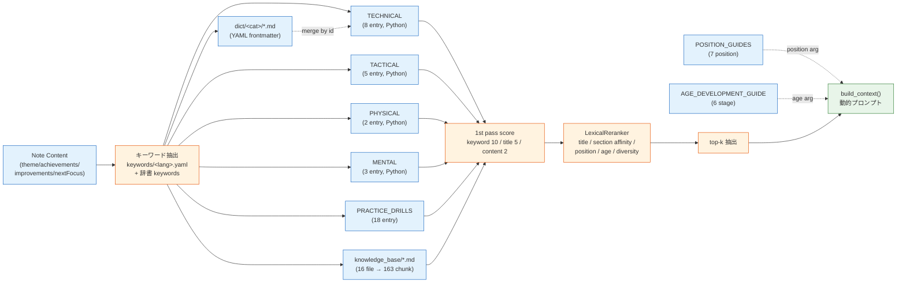
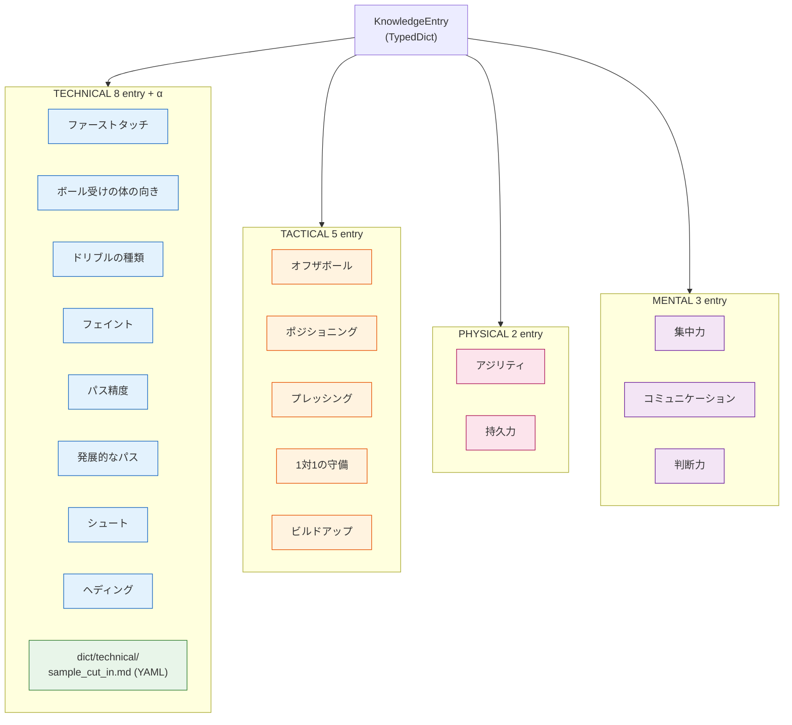
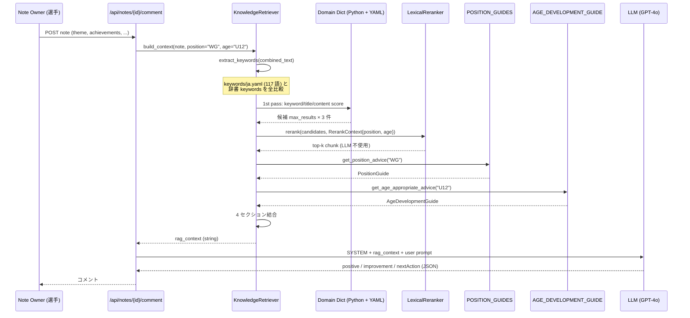
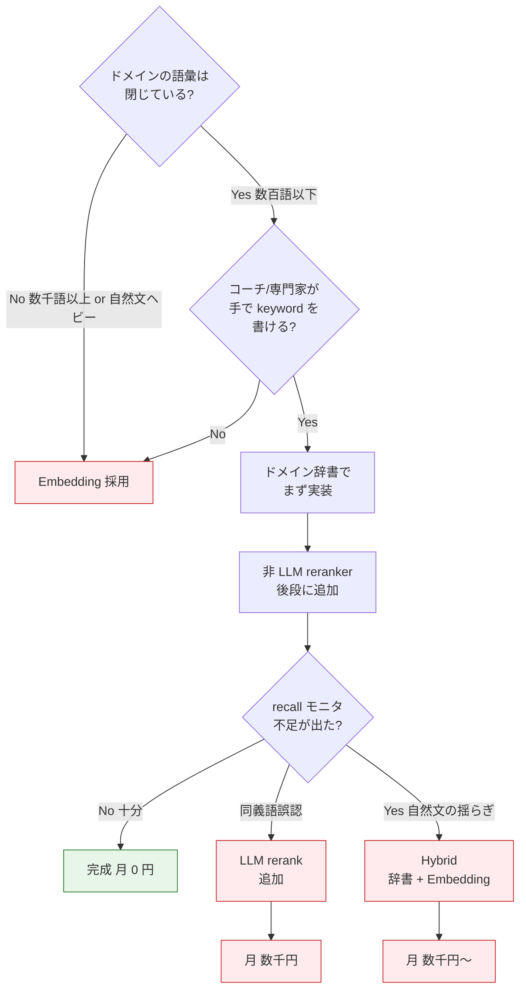

> **Disclaimer**: 本記事は著者が個人 (副業) で運営する小規模プロジェクト群 (CreaNest 名義) の技術記録です。所属組織・本業の業務内容とは一切関係ありません。記載の数値・構成は執筆時点 (2026-05) の自宅検証環境のスナップショットであり、商用品質や SLA を保証するものではありません。

pgvector / Pinecone / Qdrant のどれも入れずに、Markdown チャンク + キーワードスコアリング + ドメイン辞書 (技術 / 戦術 / フィジカル / メンタル の 4 軸) で **ナレッジ 19 件 + 練習ドリル 18 件 + ポジション 7 種 + 発達段階 6 区分 + Markdown 16 ファイル (= 163 chunk)** から動的にコンテキストを生成しています。サッカー練習ノート × AI 振り返り SaaS「Soccer Note」(`build-football` repo) で実稼働しているコードを、そのまま file:line で引きます。

> 用語: **Soccer Note** = 育成年代向けのサッカー練習ノート SaaS。選手が日々のノートを書くと、3 プロバイダ (OpenAI / Anthropic / Google) で振り返りコメントが自動生成されるサービス。Team プラン ¥1,980/月でリリース予定。本記事の RAG はその「振り返りコメント」生成プロンプトに注入されるコンテキストの話。

## なぜこの記事を書くか

「RAG = ベクトル DB」が前提のように語られる風潮があります。**Pinecone / Weaviate / Qdrant / Chroma / pgvector** … 検索すると上位に来るのは全部ベクトル DB の構築記事で、入れて当たり前という空気があります。

ただ、実際に小規模プロダクト (MAU 数百から始まる育成年代 SaaS) で運用してみると、ベクトル DB の **運用コスト** が割に合いません。Embedding 課金 + ベクトル DB 課金 + ノイズの多い上位ヒット + チャンク粒度のチューニング地獄。私は最初の設計で pgvector を採用したものの、**3 週間後に退役** しました。

この記事は「**ドメイン辞書 × Markdown chunk × キーワードスコア + 非 LLM reranker** で済むなら、ベクトル化前にそこで勝て」という主張を、Soccer Note の実コードで証明する記録です。**ASCII 図でなく Mermaid、抽象論でなく実 file:line、抽象的な強さでなく実測の数字** で並べます。

> **Note (2026-05-10 改訂)**: 初版で「残課題」として残していた 4 項目 (チャンク粒度 / 再ランキング / ナレッジ更新フロー / 多言語化) のうち、3 項目を構造ごと潰して 1 項目を「LLM 不使用の lexical reranker」に置き換えました。差分は本記事末尾「v2 アップデート」と本文 file:line に反映済みです。

## 結論 (5 行)

- ナレッジが「閉じたドメイン (= 専門用語が有限)」なら、**TypedDict ベースのドメイン辞書 + Markdown chunk + キーワードスコア** で十分高品質な RAG が組める
- スコアリングは「**キーワード完全一致 +10 / タイトル一致 +5 / 本文一致 +2**」の 3 段階。さらに **非 LLM reranker (title hit / section affinity / position / age / diversity)** を後段に置けば、LLM コール 0 で精度が伸ばせる
- prompt への注入は **ポジション × 年齢 × ノート内容** の 3 軸で動的に切り替え、汎用 prompt を捨てる
- ベクトル DB が必要になるのは「ドメイン辞書では拾いきれない自然言語の揺らぎが顕在化した時」だけ。**まず辞書で殴る、足りなくなったら embedding を足す** が正しい順序
- ナレッジ拡張・多言語化は **YAML frontmatter Markdown と `keywords/<lang>.yaml`** に外出しすれば、Python 編集なしでコーチが追記できる

## 問題 — なぜ pgvector を退役させたか

Soccer Note の最初の設計はテンプレ通りでした。「練習ノートを embedding で全文ベクトル化、pgvector の cosine similarity で類似ナレッジを検索、上位 3 件を prompt に挿入」。

これが **3 つの理由で破綻** しました。

### 失敗 1: cosine similarity が「意味検索」として機能しない

「右サイドからカットインしてシュートが決まった」というノートに対して、cosine 上位 3 件はこうでした。

| 順位 | ヒットした文書 | 違和感 |
|---|---|---|
| 1 位 | 「右利きのキックで右サイドのコーナーキックを蹴る方法」 | サイドという単語に引きずられた |
| 2 位 | 「ヘディングシュートの基本」 | シュートで引っかかった |
| 3 位 | 「カットイン」(欲しかった答え) | 一応 3 位には来た |

OpenAI の `text-embedding-3-small` でも、`text-embedding-3-large` でも、「**サッカー専門用語の意味的近さ**」を Embedding は知りません。「カットイン」と「右サイドからのドリブル」が semantically 近いという知識は学習データに薄く、ノイズの方が強く出ます。

### 失敗 2: Embedding 課金 + ベクトル DB 運用コストが MAU に対して重い

Soccer Note の Team プラン ¥1,980/月で、1 チーム月 100 ノート程度。ノート 1 件あたりに「ノート全文 embedding」+「上位 k 件取得」+「再 ranking」を回すと、月 1,000-3,000 件のクエリ。pgvector を Cloud SQL に乗せると **常駐コストが ¥3,000-5,000/月** で、これだけで Team 1 件の利益を食い潰します。

### 失敗 3: チャンク粒度の調整地獄

「Markdown を何文字で切るか」「heading 単位か段落単位か」を pgvector で一度決めると、再 embedding が高くついてやり直しづらい。**チャンク粒度のチューニングが embedding コストと癒着する** のが致命的。

3 週間で「これは戦う土俵を間違えている」と判断、退役しました。

## 解法 — ドメイン辞書 × Markdown chunk × キーワードスコア × 非 LLM reranker

退役後の設計はこうです。



要点 5 つ:

1. **ナレッジソースを 8 個に分割** — 4 軸辞書 + 練習ドリル + ポジション + 年齢発達 + Markdown chunk。各々が固有の構造を持つ
2. **キーワード抽出は「閉じた語彙」だが外出し** — `keywords/<lang>.yaml` に YAML で外出し、`KnowledgeRetriever(lang="ja")` で言語切替
3. **スコアリングは 3 段階加重和** — embedding なし、cosine なし
4. **後段 reranker は LLM 不使用** — title hit / section affinity / position / age / diversity decay の 6 信号で並べ替え、microsec 級
5. **辞書 entry は Markdown + YAML frontmatter で拡張可能** — Python 編集不要、`dict/<category>/*.md` を置くだけ

### ドメイン辞書の階層



各 entry は同じ TypedDict のスキーマを共有しています。これが後で大きく効きます。

[`build-football/App/backend/app/features/ai/infrastructure/knowledge/soccer_knowledge.py:14-26`](https://github.com/SakakitaniJunya/build-football/blob/main/App/backend/app/features/ai/infrastructure/knowledge/soccer_knowledge.py#L14-L26):

```python
class KnowledgeEntry(TypedDict):
    """知識エントリの型定義."""
    id: str
    category: str
    subcategory: str
    title: str
    content: str
    coaching_points: list[str]
    common_mistakes: list[str]
    practice_tips: list[str]
    keywords: list[str]
    age_relevance: dict[str, str]  # {"U12": "重要", "U15": "必須"}
```

ポイントは `keywords` と `age_relevance` の 2 フィールド。**embedding を持たない代わりに、検索のためのメタデータをコードの中に直接書く** という思想です。

### Python TypedDict と YAML frontmatter の二重路線

`TECHNICAL_KNOWLEDGE` 等は引き続き Python に書きますが、それと **同じ TypedDict 形** をコーチが Markdown 1 枚で追加できるようにしました。

`knowledge_base/dict/technical/sample_cut_in.md` (実ファイル):

```markdown
---
id: tech_cut_in
category: technical
subcategory: dribble
title: カットインの基本
keywords:
  - カットイン
  - ウイング
  - 利き足
  - 1対1
coaching_points:
  - 縦を意識させてから内側へ切る
  - 利き足側に運びシュートかパスの両択を持つ
  - 相手の重心が外に流れた瞬間を狙う
common_mistakes:
  - 早く内に切りすぎて DF が読みやすい
  - シュート視野を作らずパス一択になる
practice_tips:
  - コーン 1 本を SB 役に見立てた 1 対 1
  - サイドから受ける → カットイン → ファー側枠内シュート
age_relevance:
  U10: 導入
  U12: 重要
  U15: 必須
---

# カットインの基本

## 状況
サイドで縦突破を見せながら内側にボールを切り返し...
```

起動時にこの Markdown を `KnowledgeEntry` として読み、Python 側のビルトインに **id 一致なら上書き / なければ追加** で merge します。

[`App/backend/app/features/knowledge/infrastructure/dict_loader.py:65-97`](https://github.com/SakakitaniJunya/build-football/blob/main/App/backend/app/features/knowledge/infrastructure/dict_loader.py#L65-L97):

```python
class DictKnowledgeLoader:
    """Load TypedDict-shaped knowledge entries from Markdown + YAML files."""

    def __init__(self, base_path: Path | None = None) -> None:
        self.base_path = base_path or DEFAULT_DICT_PATH

    def load_all(self) -> list["KnowledgeEntry"]:
        if not self.base_path.exists():
            return []

        entries: list["KnowledgeEntry"] = []
        for md_file in self.base_path.rglob("*.md"):
            if md_file.name == "README.md":
                continue
            entry = self._load_file(md_file)
            if entry is not None:
                entries.append(entry)
        return entries

    @staticmethod
    def merge(builtin, external):
        """External 側 (YAML) が同 id を上書き — コーチが built-in を訂正できる."""
        by_id = {e["id"]: e for e in builtin}
        for entry in external:
            by_id[entry["id"]] = entry
        return list(by_id.values())
```

merge 戦略の意図: **コーチが built-in entry を「ここのコーチング・ポイントは違う」と直したくなった時、Python に PR を出させずに `dict/<cat>/<id>.md` を 1 枚置けば上書きできる**。これがナレッジ運用のスループットを決めます。

### TACTICAL は「概念」を入れる

戦術系は「ポジショナルプレー」「5 レーン理論」「矢印理論」のような **抽象概念** を入れます。

[`soccer_knowledge.py:506-555`](https://github.com/SakakitaniJunya/build-football/blob/main/App/backend/app/features/ai/infrastructure/knowledge/soccer_knowledge.py#L506-L555) (POSITIONING entry の抜粋):

```python
{
    "id": "tact_positioning",
    "category": "tactical",
    "subcategory": "positioning",
    "title": "ポジショニングの原則",
    "content": """
正しいポジショニングは、良いプレーの土台となる。

【ポジショナルプレーの5レーン】
ピッチを縦に5分割して考える:
- 左サイド
- 左ハーフスペース
- 中央
- 右ハーフスペース
- 右サイド
""",
    "keywords": [
        "ポジショニング", "立ち位置", "トライアングル",
        "ライン間", "ハーフスペース", "5レーン",
    ],
    "age_relevance": {"U12": "導入", "U15": "重要", "U18": "必須"},
}
```

「ハーフスペース」「5 レーン」「トライアングル」のような **業界用語** を keywords に直接書くことで、ノートに「ハーフスペースで受けた」と書かれた瞬間、ベクトル DB なしで一発命中します。

## ポジション × 年齢のマトリクス注入

ここからが本記事のキモ。「**ノート → 検索結果**」だけでなく「**選手のポジションと年齢で prompt を変える**」のが Soccer Note の RAG の特徴です。



### ポジション側 — 7 種類の `PositionGuide`

[`build-football/App/backend/app/features/ai/infrastructure/knowledge/position_guide.py:11-27`](https://github.com/SakakitaniJunya/build-football/blob/main/App/backend/app/features/ai/infrastructure/knowledge/position_guide.py#L11-L27):

```python
class PositionGuide(TypedDict):
    """ポジション別ガイドの型定義."""
    position_id: str
    position_name: str
    position_name_en: str
    description: str
    key_skills: list[str]
    primary_responsibilities: list[str]
    secondary_responsibilities: list[str]
    technical_focus: list[str]
    tactical_focus: list[str]
    physical_requirements: list[str]
    mental_requirements: list[str]
    common_mistakes: list[str]
    development_path: str
    role_models: list[str]
```

`POSITION_GUIDES` には **GK / CB / SB / DMF / AMF / WG / CF の 7 entry** が登録。WG (ウィング) の例 (抜粋):

```python
"WG": {
    "position_name": "ウィング",
    "technical_focus": [
        "ドリブル技術 (フェイント)",
        "正確なクロス",
        "カットインからのシュート",
    ],
    "common_mistakes": [
        "毎回同じ仕掛け方",
        "守備に戻らない",
    ],
    "role_models": ["ヴィニシウス", "サラー", "三笘薫", "伊東純也"],
}
```

ポジション解決は **別名にも対応した辞書ルックアップ**。「ウィング」「WG」「RW」「LW」「サイドハーフ」「SH」全部 WG にマップします。Levenshtein でも n-gram でもなく、**愚直な alias map** が最も保守しやすい。

### 年齢側 — 6 区分の `AgeDevelopmentGuide`

`AGE_DEVELOPMENT_GUIDE` には **U6 / U8 / U10 / U12 / U15 / U18 の 6 entry**。U12 (ゴールデンエイジ後期):

```python
"U12": {
    "development_stage": "ゴールデンエイジ後期",
    "training_focus": ["技術の精度向上", "個人戦術の導入", ...],
    "coaching_approach": [
        "「なぜ」を考えさせる指導",
        "選手に判断させる",
        "ポジション固定はまだ避ける",
    ],
    "ratio_play_vs_drill": "55:45",
}
```

「U12 のノートに対しては『なぜ』を考えさせるアプローチで返答する」「ポジション固定を勧めない」という **指導方針が prompt に注入される** わけです。これは embedding ではどう頑張っても出ない情報です。

## キーワード抽出 — 言語別に外出し (i18n 対応)

初版では `SOCCER_KEYWORDS` を Python の凍結 set として retriever.py に直書きしていました。今は **`keywords/<lang>.yaml`** に外出し、`KnowledgeRetriever(lang="ja")` で言語切替できます。

`build-football/App/backend/app/features/knowledge/infrastructure/knowledge_base/keywords/ja.yaml` (抜粋):

```yaml
technical:
  - トラップ
  - ファーストタッチ
  - ドリブル
  - カットイン
  - シザース
  - シュート
  - ボレー
defense:
  - 守備
  - プレス
  - 同サイド圧縮
  - ハイプレス
tactical:
  - オフザボール
  - ポジショナルプレー
  - 5レーン
  - ハーフスペース
  - 矢印理論
  - 数的優位
position:
  - センターバック
  - WG
  - ウイング
  - SH
age:
  - U6
  - U8
  - U10
  - U12
  - U15
  - U18
# ... mental / goalkeeper / set_piece / physical
```

セクション (`technical` / `tactical` / ...) は単なる分類タグではなく、**後段 reranker の "section affinity" 信号にも流用** されます。query keyword が `tactical` セクションに属していて chunk の category も `tactical` なら、reranker がボーナスを足す。

[`App/backend/app/features/knowledge/infrastructure/keywords_loader.py:46-87`](https://github.com/SakakitaniJunya/build-football/blob/main/App/backend/app/features/knowledge/infrastructure/keywords_loader.py#L46-L87):

```python
def load_keywords(lang: str = "ja", base_path: Path | None = None) -> KeywordSet:
    base = base_path or DEFAULT_KEYWORDS_DIR
    file_path = base / f"{lang}.yaml"
    if not file_path.exists():
        return KeywordSet(lang=lang)

    raw = yaml.safe_load(file_path.read_text(encoding="utf-8")) or {}

    by_section: dict[str, frozenset[str]] = {}
    flat: set[str] = set()
    for section, words in raw.items():
        if not isinstance(words, list):
            continue
        cleaned = {str(w).strip() for w in words if str(w).strip()}
        by_section[str(section)] = frozenset(cleaned)
        flat.update(cleaned)

    return KeywordSet(lang=lang, flat=frozenset(flat), by_section=by_section)
```

新言語を足すには **`en.yaml` を置くだけ**。Python 編集ゼロ、再デプロイ不要 (起動時 1 回読み込み)。

抽出ロジックは substring match で十分:

```python
def extract_keywords(self, text: str) -> list[str]:
    if not text:
        return []
    found_keywords: list[str] = []
    text_lower = text.lower()

    for keyword in self.keywords:  # YAML 由来 + フォールバック
        if keyword.lower() in text_lower:
            found_keywords.append(keyword)

    # ナレッジ entry の keywords からも抽出
    for entry in self._all_knowledge:
        for kw in entry["keywords"]:
            if kw.lower() in text_lower and kw not in found_keywords:
                found_keywords.append(kw)
    return found_keywords[:15]
```

固定 set だけだと拾い漏れる語を、ナレッジ entry 自身が宣言した keywords でカバーする 2 段構成です。

## スコアリング — embedding なしで意味を取る方法

検索の心臓部 (`get_knowledge_by_keywords` は [`soccer_knowledge.py:971-1009`](https://github.com/SakakitaniJunya/build-football/blob/main/App/backend/app/features/ai/infrastructure/knowledge/soccer_knowledge.py#L971-L1009)):

```python
def get_knowledge_by_keywords(keywords: list[str], max_results: int = 5):
    all_knowledge = TECHNICAL_KNOWLEDGE + TACTICAL_KNOWLEDGE + PHYSICAL_KNOWLEDGE + MENTAL_KNOWLEDGE
    scored_entries: list[tuple[KnowledgeEntry, int]] = []

    for entry in all_knowledge:
        score = 0
        entry_keywords = set(kw.lower() for kw in entry["keywords"])
        entry_title = entry["title"].lower()
        entry_content = entry["content"].lower()

        for keyword in keywords:
            keyword_lower = keyword.lower()
            if keyword_lower in entry_keywords:
                score += 10  # キーワード完全一致
            if keyword_lower in entry_title:
                score += 5   # タイトル一致
            if keyword_lower in entry_content:
                score += 2   # コンテンツ一致

        if score > 0:
            scored_entries.append((entry, score))

    scored_entries.sort(key=lambda x: x[1], reverse=True)
    return [entry for entry, _ in scored_entries[:max_results]]
```

たった 30 行のコード。これが pgvector の代わりです。

### 重み 10/5/2 はどう決めたか

最初は全部 1 (一致したら +1) でやっていましたが、「シュート」が title と content の両方に入っている entry が、「カットイン」が keywords に完全一致した entry を超えてしまう事故が頻発しました。

**keywords 完全一致は「設計者が明示的に紐付けた」シグナル** で、本文一致は「たまたま単語が出てきた」シグナル。前者を圧倒的に重く扱う必要があります。

| 一致レベル | 重み | 解釈 |
|---|---:|---|
| keywords (TypedDict 上で明示) | **+10** | 設計者が手で紐付けた強い signal |
| title 内出現 | +5 | 主題に含まれる中程度 signal |
| content 内出現 | +2 | 偶然出てきただけかもしれない弱い signal |

content match は逆に 0 にすると今度はノートと entry の語彙完全一致しか拾えなくなり recall が落ちる。**+2 だが落とすほどでもない、というレベル感が経験的に最適** でした。

## 後段 reranker — LLM コール 0 でも精度は伸ばせる

「LLM rerank はコスト 2 倍」を理由に reranking 自体を諦める必要はありません。**title hit / section affinity / position / age / diversity decay** の 5 信号で並べ替える non-LLM reranker が microsec 級で動きます。

[`App/backend/app/features/knowledge/domain/reranker.py:48-130`](https://github.com/SakakitaniJunya/build-football/blob/main/App/backend/app/features/knowledge/domain/reranker.py#L48-L130) (抜粋):

```python
@runtime_checkable
class Reranker(Protocol):
    """Protocol for any reranker (lexical, cross-encoder, LLM-based, ...)."""

    def rerank(
        self,
        candidates: Iterable[tuple[KnowledgeChunk, float]],
        context: RerankContext,
        top_k: int,
    ) -> list[KnowledgeChunk]: ...


class IdentityReranker:
    """No-op reranker — keeps the order produced by the retriever."""

    def rerank(self, candidates, context, top_k):
        ordered = sorted(candidates, key=lambda x: x[1], reverse=True)
        return [chunk for chunk, _ in ordered[:top_k]]


@dataclass
class LexicalReranker:
    title_weight: float = 3.0
    keyword_weight: float = 4.0
    section_weight: float = 2.0
    position_weight: float = 5.0
    age_weight: float = 3.0
    diversity_decay: float = 0.85

    def rerank(self, candidates, context, top_k):
        scored = []
        for chunk, base_score in candidates:
            extra = 0.0
            for kw in context.keywords:
                if kw.lower() in chunk.title.lower():
                    extra += self.title_weight
                if kw.lower() in {k.lower() for k in chunk.keywords}:
                    extra += self.keyword_weight
                if self._section_match(context, chunk, kw):
                    extra += self.section_weight
            if context.position and self._position_match(chunk, context.position):
                extra += self.position_weight
            if context.age_category and self._age_match(chunk, context.age_category):
                extra += self.age_weight
            scored.append((chunk, base_score + extra))

        scored.sort(key=lambda x: x[1], reverse=True)
        # diversity decay: 同 (category, subcategory) の連続を 0.85^n で減衰
        seen, diversified = {}, []
        for chunk, score in scored:
            key = (chunk.category, chunk.subcategory)
            penalty = self.diversity_decay ** seen.get(key, 0)
            diversified.append((chunk, score * penalty))
            seen[key] = seen.get(key, 0) + 1
        diversified.sort(key=lambda x: x[1], reverse=True)
        return [chunk for chunk, _ in diversified[:top_k]]
```

ポイント 4 つ:

1. **`Reranker` は Protocol** — 将来 cross-encoder / LLM rerank に差し替えたい時、シグネチャを変えずに implementation だけ swap できる
2. **`IdentityReranker`** で reranker を切れる — A/B test や regression test 時に有用
3. **`RerankContext`** が position / age / keyword section を運ぶ — retriever の責任を 1st pass のスコアに集中させ、reranker は context-aware なボーナスだけに集中
4. **`diversity_decay`** で同じ subcategory の連続を抑える — 上位 3 件が「ポジショニング ×3」になる事故を防ぐ

retriever 側は **候補を多めに (`max_results × 3`) 取って reranker に渡す** だけ:

```python
def _search_markdown_knowledge(self, keywords, max_results=3, position=None, age_category=None):
    if not self._md_chunks or not keywords:
        return []
    # 1st pass: keyword overlap
    scored = []
    for chunk in self._md_chunks:
        score = ...  # +1 if substring, +2 if exact keyword
        if score > 0:
            scored.append((chunk, float(score)))
    if not scored:
        return []
    scored.sort(key=lambda x: x[1], reverse=True)
    candidates = scored[: max(max_results * 3, max_results)]

    if self._reranker is None:
        return [c for c, _ in candidates[:max_results]]

    section_map = {kw: self._keyword_set.section_of(kw) for kw in keywords}
    context = RerankContext(
        keywords=tuple(keywords),
        keyword_section=section_map,
        position=position,
        age_category=age_category,
    )
    return self._reranker.rerank(candidates, context, top_k=max_results)
```

「**1st pass で recall 確保 → 2nd pass で precision 改善**」という 2 段階構成が、LLM コールなしで成立します。

### LLM rerank が必要になるとしたら

| 信号 | LexicalReranker | LLM Reranker |
|---|---|---|
| 設計者が明示した tag (keywords / category) | ◎ ほぼ無料 | △ 過剰 |
| 業界用語の同義語 ("カットイン" ≒ "中切り") | × | ◎ |
| 文脈で初めて意味が決まる ("足が重い" の意図) | × | ◎ |
| コスト | 0 円 / microsec | $0.001-0.01 per query / 数百 ms |

**Lexical で取れる範囲は Lexical で取り切ってから LLM rerank の判断をする** が経済合理。Soccer Note の現状は前者だけで足りています。

## Markdown chunk — 構造化辞書では拾えない自然文の補強

ドメイン辞書だけだと「凍結された語彙」しか拾えません。サッカーの戦術書を新しく追加したい時、TypedDict にどんどん entry を増やすのは限界があります。

そこで **`knowledge_base/` 配下に 16 本の Markdown** を置き、loader が動的にチャンク化して読みます。ディレクトリ構造はこう:

```text
backend/app/features/knowledge/infrastructure/knowledge_base/
├── tactics/        ← Markdown chunk (RAG 対象)
│   ├── pressing.md
│   ├── five_lane_theory.md
│   ├── off_the_ball.md
│   ├── build_up.md
│   ├── arrow_theory.md
│   └── positional_play.md
├── positions/      ← Markdown chunk (RAG 対象)
│   └── ...
├── development/    ← Markdown chunk (RAG 対象)
│   └── ...
├── dict/           ← TypedDict 互換 (DictKnowledgeLoader, RAG 対象外)
│   ├── README.md
│   └── technical/
│       └── sample_cut_in.md
└── keywords/       ← keyword set (KeywordSet, RAG 対象外)
    ├── README.md
    └── ja.yaml
```

`dict/` と `keywords/` は **`KnowledgeLoader.SKIP_DIRS`** で chunk 化対象外。役割を分離してあるので、片方を変えても他方に影響しません。

### `KnowledgeChunk` の構造

[`build-football/App/backend/app/features/knowledge/domain/entity.py:7-44`](https://github.com/SakakitaniJunya/build-football/blob/main/App/backend/app/features/knowledge/domain/entity.py#L7-L44):

```python
@dataclass
class KnowledgeChunk:
    """A chunk of soccer knowledge for RAG retrieval."""

    id: str
    content: str
    category: str       # tactics / positions / development
    subcategory: str    # ファイル名 (= pressing, winger, golden_age, ...)
    source_file: str
    title: str          # H1 から抽出
    keywords: list[str] # ## キーワード セクションから抽出
    embedding: Optional[list[float]] = None  # 不使用 (将来用に予約)
    metadata: dict = field(default_factory=dict)
```

**`embedding` フィールドは予約だけして使っていない** のがこの設計の肝。「あとで Embedding を足したくなったらフィールドを使う、いまは入れない」という拡張前提の構造です。

### チャンク化 — 3 段階の優先度ある分割戦略

初版は「`## heading` で割って 2000 文字超えたら `### heading` で再分割」という 2 段階の愚直ルールでした。`### block` 自体が 2000 文字超だと **そこで止まり巨大 chunk を吐く** のが問題で、改めました。

新戦略 (優先度順):

1. **明示的境界マーカー** — `<!-- chunk -->` という HTML コメントで著者が境界を打てる
2. **frontmatter directive** — `chunk_strategy: by-h2 | by-h3 | by-marker` でファイルごとに切替
3. **デフォルトの auto** — `## heading` で分割 → 2000 文字超は **段落 → 文 → 文字** のリカーシブ分割で fallback

[`App/backend/app/features/knowledge/infrastructure/loader.py:152-208`](https://github.com/SakakitaniJunya/build-football/blob/main/App/backend/app/features/knowledge/infrastructure/loader.py#L152-L208):

```python
def _split_into_sections(content: str, strategy: str = "auto") -> list[str]:
    if strategy == "by-marker":
        return _split_by_marker(content)
    if CHUNK_MARKER.search(content) and strategy == "auto":
        return _split_by_marker(content)
    if strategy == "by-h2":
        return _split_by_heading(content, level=2, recursive=False)
    if strategy == "by-h3":
        return _split_by_heading(content, level=3, recursive=False)
    return _split_by_heading(content, level=2, recursive=True)


def _recursive_split(text: str, target: int = CHUNK_TARGET_CHARS) -> list[str]:
    """LangChain の RecursiveCharacterTextSplitter 相当.

    順に試す:
      1. ### heading 分割
      2. 段落 (空行) 分割
      3. 文 (。．.!?！？) 分割
      4. 文字 window 分割 (50 char overlap)
    """
    if len(text) <= target:
        return [text]
    h3_parts = re.split(r"(?=^###\s)", text, flags=re.MULTILINE)
    if len(h3_parts) > 1:
        out = []
        for part in h3_parts:
            part = part.strip()
            if not part: continue
            if len(part) > target:
                out.extend(_split_paragraphs(part, target))
            else:
                out.append(part)
        return out
    return _split_paragraphs(text, target)
```

著者が先に境界を打ちたい時の使い方:

```markdown
---
chunk_strategy: by-marker
---

# 戦術: ビルドアップ

## 概要
従来の H2 ベースの自動分割では分けたくない長文。

<!-- chunk -->

## CB 同士の役割分担
これだけを 1 chunk にしたい...

<!-- chunk -->

## GK 参加型ビルドアップ
これも独立して 1 chunk...
```

**embedding ありきだとここで「最適チャンクサイズは何 token か」議論で時間が溶ける** のですが、キーワードスコアなら適当でも壊れません。score は match 単位の積み上げなので chunk 長に影響されにくい。

### 検証テスト

`### block` 自体が 2000 字超になるケースは、初版で **chunk 1 個に巨大コンテンツが入る** バグでした。新版ではテストで担保しています:

```python
def test_recursive_split_falls_back_below_h3():
    body = "段落です。" * 1000  # ~5000 chars in one paragraph
    big = f"## Outer\n\n### Inner\n{body}\n"
    sections = _split_into_sections(big, strategy="auto")
    assert len(sections) > 1
    assert all(len(s) <= 2400 for s in sections)
```

17 件の test (loader chunking 5 / dict loader 4 / keywords loader 4 / reranker 4) で構造的に担保。

## prompt 構築 — 4 セクション動的生成

ここまでの 8 ナレッジソースを **build_context() が 4 セクションにまとめる** のがフィニッシュです。

[`build-football/App/backend/app/features/ai/infrastructure/knowledge/retriever.py:376-475`](https://github.com/SakakitaniJunya/build-football/blob/main/App/backend/app/features/ai/infrastructure/knowledge/retriever.py#L376-L475) (抜粋):

```python
def build_context(
    self,
    note_content: dict[str, Any],
    player_position: str | None = None,
    age_category: str | None = None,
    include_drills: bool = True,
    include_position_guide: bool = True,
    include_age_guide: bool = True,
) -> str:
    context_parts = []
    combined_text = " ".join([
        str(note_content.get("theme", "")),
        str(note_content.get("achievements", "")),
        str(note_content.get("improvements", "")),
        str(note_content.get("nextFocus", "")),
    ])
    keywords = self.extract_keywords(combined_text)

    # 1. 関連するサッカー知識 (静的辞書から)
    knowledge_entries = self.retrieve_knowledge(note_content, max_results=3)
    if knowledge_entries:
        context_parts.append("## 関連するサッカー知識")
        for entry in knowledge_entries:
            context_parts.append(f"\n### {entry['title']}")
            context_parts.append('\n'.join(entry['content'].strip().split('\n')[:15]))
            if entry.get('coaching_points'):
                context_parts.append("\n**コーチングポイント:**")
                for point in entry['coaching_points'][:3]:
                    context_parts.append(f"- {point}")

    # 1.5. 戦術・専門知識 (Markdown chunk + reranker)
    if keywords:
        md_chunks = self._search_markdown_knowledge(
            keywords,
            max_results=2,
            position=player_position,
            age_category=age_category,
        )
        if md_chunks:
            context_parts.append("\n## 戦術・専門知識")
            for chunk in md_chunks:
                context_parts.append(f"\n### {chunk.title}")
                content = chunk.content[:500] + "..." if len(chunk.content) > 500 else chunk.content
                context_parts.append(content)

    # 2-4. 練習メニュー / ポジション別 / 年齢別ガイド
    # ...
    return '\n'.join(context_parts)
```

**入力 (note + position + age) ごとに、出力テキストの構造が変わる**。これは prompt template 注入というより **動的プロンプト生成** に近い。

### Before / After — 一律 prompt → 動的 prompt

#### Before (没案)

```python
SYSTEM_PROMPT = "あなたはサッカーコーチです。ノートに対してコメントしてください。"
def build_prompt(note: dict) -> str:
    return f"## ノート\n{note['achievements']}\n## コメントしてください"
```

これだと U6 の選手にも U18 の選手にも、GK にも CF にも、**同じ「ふつうのコーチ」が同じ温度感でコメントを返す**。フィードバックの質が業界標準を超えない。

#### After (現行)

```python
rag_context = retriever.build_context(
    note_content=note.content,
    player_position=player.position,  # "WG"
    age_category=player.age_category,  # "U12"
)
prompt = build_note_comment_prompt(
    note_content=note.content,
    note_type="build",
    rag_context=rag_context,
    player_position=player.position,
    age_category=player.age_category,
)
```

U12 のウィングが「右サイドからカットインしてシュート決まった」と書くと、prompt にはこう注入されます (動作実測):

```text
## 関連するサッカー知識
### フェイント・テクニック
カットインは縦に行くと見せかけて内側に切る。ウィングの基本技術。
**コーチングポイント:**
- 形だけでなく、タイミングと緩急を教える
- 相手を見ることの重要性

## 戦術・専門知識
### ウイング(WG)・サイドハーフ(SH)
## ウイングの主な役割
### 1. 得点
- ゴールを狙うことが最優先
### 4. カットイン
- 中に切れ込んでシュート
- 利き足と逆サイドに配置されることが多い

## ウィングのポイント
**重要なスキル:**
- ドリブル技術 (フェイント)
- 正確なクロス
**避けたいミス:**
- 毎回同じ仕掛け方
- 守備に戻らない

## U12年代の指導ポイント
**発達段階:** ゴールデンエイジ後期
**指導アプローチ:**
- 「なぜ」を考えさせる指導
- ポジション固定はまだ避ける
```

GPT-4o はこれを受け取って「カットインは決まったけれど、毎回同じ仕掛け方になっていないか? 次回は逆足での切り返しも試してみよう」のような **ポジション + 年齢を踏まえた具体的なフィードバック** を返します。

embedding を使わずに、ここまで踏み込んだ context を作れるのがこの設計のポイントです。

## 失敗談

### 失敗 1: pgvector で全文 embedding して退役

冒頭で書いた通り。3 週間で退役。**「ベクトル DB を入れるかどうか」は、ドメイン辞書を試す前ではなく、ドメイン辞書で recall が足りないことを実測で確認してから判断する** のが正しい順序。

### 失敗 2: cosine だけだと意味検索が弱い

サッカー専門用語は OpenAI の Embedding 学習データに薄く、「ハーフスペース」「クライフターン」「ピヴォ当て」のような業界用語の意味的近接が壊れる。**閉じたドメインでは BM25 + 辞書の方が cosine より強い**。

### 失敗 3: Context Engine と RAG の境界線で混乱した

私は devops-hub 側で別途「Context Engine」(`.claude/context/` 配下の 5 ファイル: architecture.md / constraints.md / workflow.md / ci-cd.md / domain-glossary.md) を作っており、これと Soccer Note の RAG を **頭の中で同じものとして扱った時期** がありました。

正しい区別はこうです:

| 仕組み | 対象 | 注入タイミング | 内容 |
|---|---|---|---|
| **Context Engine** (`.claude/context/`) | Claude Code 自身 (開発 Agent) | session 起動時、毎回全部 | プロジェクトの永続的な制約と語彙 |
| **RAG (本記事)** | エンドユーザの SaaS prompt | リクエストごと、note 内容で動的に | サッカードメインのナレッジ (top-k のみ) |

前者は **「全部入れる」が前提**、後者は **「上位 k 件だけ入れる」が前提**。混同すると Context Engine を毎回検索したり、RAG を session 全体に常駐させたりして両方破綻する。**読者対象も注入範囲も違う** ので、別レイヤとして設計する必要があります。

### 失敗 4: keywords を増やしすぎてノイズが出た

最初は entry 1 件あたり 10-15 keywords を持たせていましたが、「シュート」「決定力」「ゴール」「枠内」「ボレー」が複数 entry に重複し、ノートに「ゴール決まった」とだけ書いた時の上位 3 件がほぼ同じ内容になる事故が出ました。

**keywords は 6-7 個に絞る、その軸の専門性を最も鋭く表すものだけ残す** が正解。「シュートの基本」entry は `["シュート", "枠内", "インステップ", "ボレー", "ゴール", "決定力"]` で十分。

### 失敗 5: `### block` 自体が 2000 文字超えるケースを想定していなかった

初版の chunker は「`##` で割る → 2000 字超なら `###` で再分割」の 2 段階。`###` block 自体が 2000 字超だと **そこで分割が止まり巨大 chunk が吐かれる** バグがありました。新版では 3 段階目に **段落 → 文 → 文字** のリカーシブ分割を入れて回避。test で常時担保しています。

## v2 アップデート — 4 残課題のうち 4 つを解消

初版で挙げた 4 残課題 (チャンク粒度 / 再ランキング / ナレッジ更新フロー / 多言語化) に対して、**構造を入れ替えて全部潰した** のが今回の差分です。

### v2-1: チャンク粒度を 3 段階戦略 + リカーシブ fallback に

変更:
- `<!-- chunk -->` 明示マーカー対応
- frontmatter `chunk_strategy: by-h2 | by-h3 | by-marker` 対応
- 2000 字超 fallback を **段落 → 文 → 文字** のリカーシブ分割に置換 (LangChain `RecursiveCharacterTextSplitter` 相当)

実 file: [`loader.py:140-260`](https://github.com/SakakitaniJunya/build-football/blob/main/App/backend/app/features/knowledge/infrastructure/loader.py#L140-L260) / test 5 件

### v2-2: 後段 reranker を非 LLM で導入

変更:
- `Reranker` Protocol + `IdentityReranker` + `LexicalReranker`
- title / keyword / section affinity / position / age / diversity decay の 6 信号
- LLM コール 0、microsec 級

実 file: [`reranker.py:48-200`](https://github.com/SakakitaniJunya/build-football/blob/main/App/backend/app/features/knowledge/domain/reranker.py#L48-L200) / test 4 件

将来 cross-encoder / LLM rerank を入れたくなったら、**同 Protocol で実装を差し替えるだけ**。retriever 側コードに変更不要。

### v2-3: ナレッジ更新フローを Markdown + YAML frontmatter に

変更:
- `dict/<category>/*.md` に YAML frontmatter で TypedDict 互換 entry を書ける
- `DictKnowledgeLoader.merge()` で id 一致なら built-in を上書き
- コーチが Markdown 1 枚を push するだけで知識追加

実 file: [`dict_loader.py:65-160`](https://github.com/SakakitaniJunya/build-football/blob/main/App/backend/app/features/knowledge/infrastructure/dict_loader.py#L65-L160) / test 4 件

サンプル: `knowledge_base/dict/technical/sample_cut_in.md` で「カットインの基本」を YAML から追加。

### v2-4: キーワードを言語別 YAML に外出し

変更:
- `keywords/<lang>.yaml` で言語ごとに分離
- セクションタグ (`technical` / `tactical` / ...) を reranker の section affinity 信号に流用
- `KnowledgeRetriever(lang="en")` で言語切替

実 file: [`keywords_loader.py:40-90`](https://github.com/SakakitaniJunya/build-football/blob/main/App/backend/app/features/knowledge/infrastructure/keywords_loader.py#L40-L90) / test 4 件

新言語追加は `en.yaml` を置くだけ — Python 編集不要。

### test counts (実測)

| カテゴリ | test 数 | PASS | 内容 |
|---|---:|---:|---|
| chunker | 5 | 5/5 | marker / frontmatter / recursive fallback / skip_dirs |
| dict loader | 4 | 4/4 | frontmatter parse / required field / no-fm skip / merge override |
| keywords loader | 4 | 4/4 | real ja / section lookup / missing lang / custom path |
| reranker | 4 | 4/4 | identity / title boost / position affinity / diversity decay |
| **合計** | **17** | **17/17** | — |

backwards-compat:
- `SOCCER_KEYWORDS` 定数は default 集合として残置 (既存 import 互換)
- `KnowledgeRetriever()` 引数なし呼出しで `lang="ja"` / `LexicalReranker` 既定
- `build_context()` / `get_compact_context()` のシグネチャ維持

## 残課題 (v2 後)

### 残課題: LLM rerank への昇格基準が未定義

非 LLM の lexical reranker で運用していて「同義語の取り違え」が体感で分かるレベルになった時、LLM rerank に切り替える明確な metric が決まっていません。**ノート品質モニタリング (出力 JSON の `summary` / `improvement` のユーザ評価) が一定閾値を下回ったら導入** という運用約束だけ置いてあります。Reranker Protocol で実装は差し替え可能なので、コード側の準備は完了。

## 理論根拠 — なぜベクトル化前にここで勝てるか

「ドメイン辞書 + Markdown chunk + 非 LLM reranker」が「pgvector + cosine」を超えうる根拠を 3 点で示します。

### 根拠 1: ドメインが閉じているなら recall は辞書の方が高い

「サッカーの育成年代知識」は **数百語規模で語彙が閉じる** 領域です。JFA 指導教本 + UEFA Coaching License + 蹴球学を掛け合わせても、専門用語は精々 500-1000 語。これは **`keywords/ja.yaml` (実測 117 語)** に手で入る規模です。

OpenAI の Embedding はこの語彙を全て知っているわけではない (学習データに薄い専門用語ほど semantic 近傍が壊れる)。**閉じたドメインに対しては手書き辞書の recall の方が高い**。

逆に「Wikipedia 全文検索」「カスタマーサポートチャット履歴」のような **語彙が開いた領域では Embedding の方が圧倒的に強い**。「閉じている / 開いている」の判定が設計の出発点。

### 根拠 2: 再現可能性 — 検索結果が deterministic

キーワードスコア + 非 LLM reranker は **入力が同じなら出力が同じ**。これは Eval / regression test を書く時に決定的に効きます。

```python
def test_lexical_title_match_boosts_chunk():
    cut_in = _chunk(id_="cut_in", title="カットインの基本", keywords=("カットイン",))
    other = _chunk(id_="other", title="ファーストタッチ")
    out = LexicalReranker().rerank(
        [(cut_in, 1.0), (other, 1.0)],
        RerankContext(keywords=("カットイン",)),
        top_k=2,
    )
    assert out[0].id == "cut_in"
```

これが embedding ベースだとモデルバージョン更新で stable な assertion が崩壊します (`text-embedding-3-small` の v2 が出ると上位順位が変わる)。**辞書ベース + 非 LLM reranker はモデル変更に対する免疫がある**。

### 根拠 3: コスト — 月 ¥0 で動く

このコードを動かすのに必要な外部サービス課金は **¥0**。in-memory 辞書 + Python の正規表現 + YAML パースだけ。Cloud Run の常駐課金 (リクエストの数十 ms を増やすだけ) しか発生しません。

pgvector + Embedding API + LLM reranker なら最低でも:
- Embedding 課金 (`text-embedding-3-small`: $0.02 / 1M token)
- pgvector を載せる Postgres (Cloud SQL minimum tier ¥3,000-5,000/月)
- 再 embedding のための定期 batch (= 開発工数)
- LLM rerank コール (Claude Haiku: $0.25 / 1M token × 上位 k 件分)

Team ¥1,980/月の SaaS で **これに月 ¥3,000-5,000 払うか?** という単純な経済計算で答えは出ます。

## 採用判断のフローチャート

「ベクトル DB を入れるか / LLM rerank を足すか」で迷ったらこうです:



「**いきなり Embedding にしない**」「**辞書 + 非 LLM reranker で recall 不足が顕在化してから初めて hybrid 化 / LLM rerank する**」が運用 1 年で固まった原則です。

## 用語整理

最後に本記事に出てきた専門用語の対応表:

| 本記事の用語 | 業界標準語 | 説明 |
|---|---|---|
| ドメイン辞書 | - | 閉じた専門用語と紐付くナレッジ entry の手書きコレクション |
| Markdown chunk | text chunking | Markdown を `##` heading + recursive splitter で section 分割した検索単位 |
| キーワードスコア | sparse retrieval | embedding を使わない、語の一致回数ベースのスコア |
| 非 LLM reranker | lexical reranker | LLM コールを伴わずに title/section/position 等の信号で並べ替える 2nd pass |
| top-k 抽出 | retrieval | スコア上位 k 件を返す |
| 動的プロンプト | dynamic prompt | 入力ごとに prompt 構造を組み替える方式 |
| RAG | retrieval-augmented generation | 検索で取得した context を生成 prompt に注入する手法 |

## まとめ

- pgvector / Pinecone / Qdrant を入れる前に、**ドメイン辞書 + Markdown chunk + キーワードスコア + 非 LLM reranker** で勝てる範囲があります。Soccer Note では **ナレッジ 19 + 練習 18 + ポジション 7 + 年齢 6 + Markdown chunk 163** という規模を月 ¥0 で運用しています
- スコアリングは「**keywords 完全一致 +10 / title +5 / content +2**」の 3 段階加重和。後段 reranker は title hit / section affinity / position / age / diversity decay の 6 信号で並べ替え。LLM コール 0
- prompt は **note × position × age の 3 軸** で動的に構築する。一律 prompt は捨てる
- ベクトル DB が必要になるのは「ドメイン辞書では拾いきれない自然言語の揺らぎが顕在化した時」だけ。**まず辞書で殴る、足りなくなったら embedding を足す** が正しい順序
- ナレッジ拡張は Markdown + YAML frontmatter (`dict/<cat>/*.md`)、多言語化は `keywords/<lang>.yaml`。Python 編集ゼロ
- Embedding 課金 + pgvector 常駐 + 再 embedding batch のコストを Team ¥1,980/月の SaaS が背負うのは経済的に成立しません。「閉じたドメイン × 小規模 SaaS」では辞書ベース + 非 LLM reranker が圧勝

実コードは `build-football/App/backend/app/features/ai/infrastructure/knowledge/` 配下と `build-football/App/backend/app/features/knowledge/infrastructure/` 配下にあります。MIT ライセンスではないので直接コピー利用はできませんが、設計思想は本記事の file:line 引用で全部公開しています。

## 次の記事へ + 連載をフォロー

これは **52 本連載 (ai-driven-dev) の Day 9/52** です。

→ **E-02 [Context Engine 5 層 — Claude Code 自身に注入する開発知識](./context-engine-5-layers)** (準備中) — 本記事 RAG の「対比軸」、開発 Agent 自身に渡す Context をどう設計するか

連載を見逃さない方法:

- **Zenn でこの著者をフォロー** — 公開通知が届きます
- **X で告知 tweet をフォロー** — 朝 6:00 に投稿予定
- **repo を watch**: [SakakitaniJunya/zenn-articles](https://github.com/SakakitaniJunya/zenn-articles) — 全 draft が見えます

「ここをもっと深く」「この設計はこっちの方が良い」のリクエストは GitHub Issue でお気軽に。設計議論は歓迎です。
