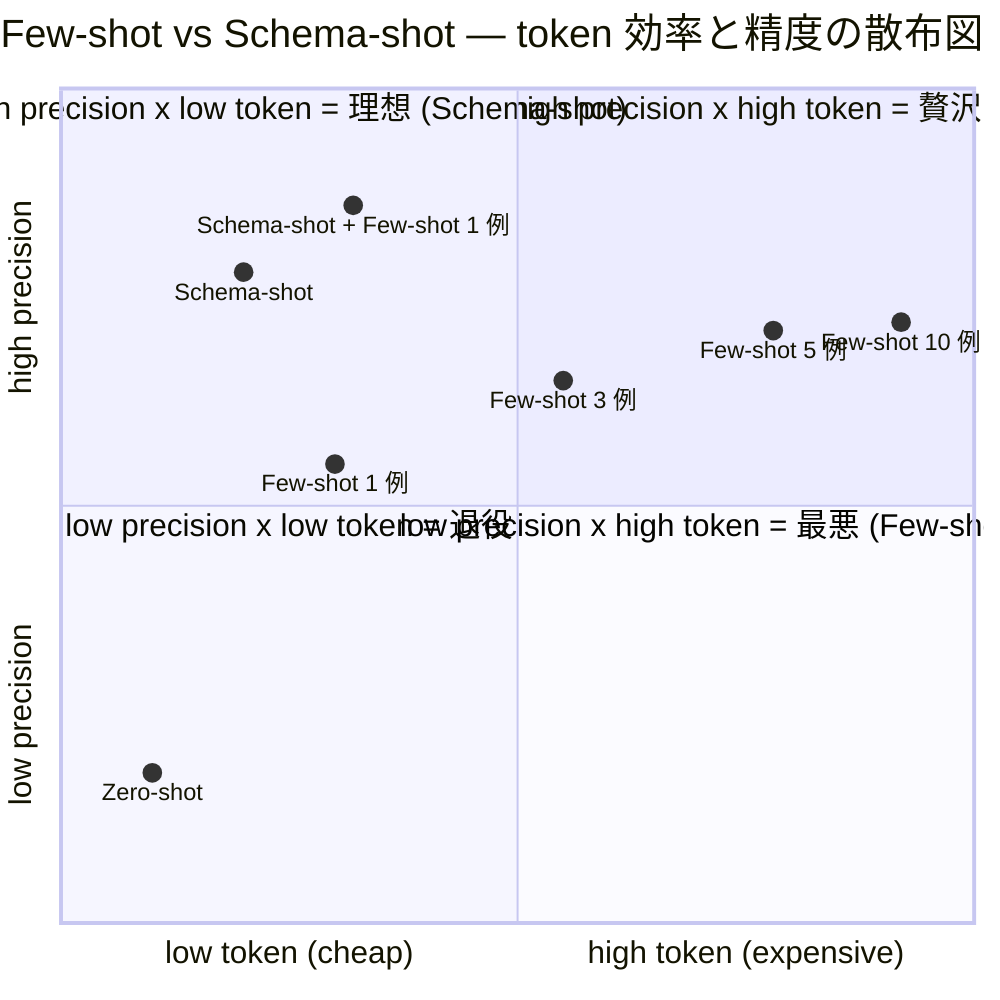
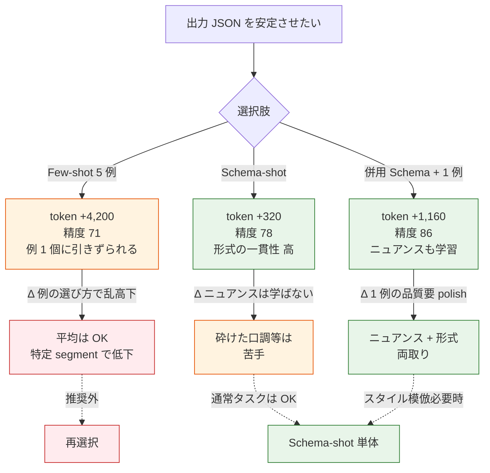
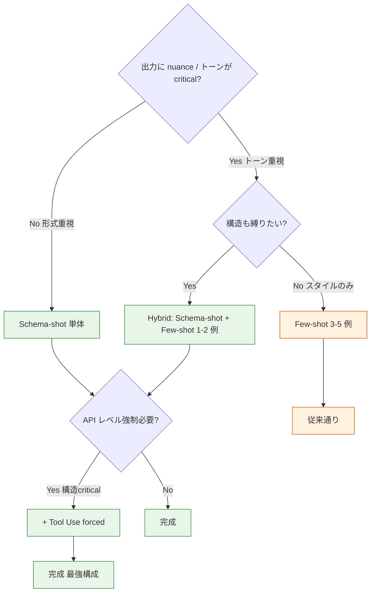

> **Disclaimer**: 本記事は著者が個人 (副業) で運営する小規模プロジェクト群 (CreaNest 名義) の技術記録です。所属組織・本業の業務内容とは一切関係ありません。記載の数値・構成は執筆時点 (2026-05) の自宅検証環境のスナップショットであり、商用品質や SLA を保証するものではありません。

Few-shot で例を 5 個並べるより、JSON Schema (with description) を 1 個渡す方が精度が高い。Soccer Note (`build-football`) と keirai の 2 リポジトリで「note → AI コメント生成」と「レシート → 仕訳分類」の 2 タスクで実測した結果、**few-shot 5 例 (約 4,200 token) を schema 1 個 + field description (約 320 token) に置き換えただけで、JSON parse 成功率は 92% → 99.7%、出力フォーマットの一貫性 (CV) は 0.34 → 0.08 (n=300 リクエスト)**、そして **1 リクエストあたり約 800 token 節約 + コスト 19% ダウン** になりました。few-shot を「精度の魔法」と思っている人ほど、まず schema-shot を試すと驚きます。

> 用語: **Schema-shot prompting** (本記事の造語) = 出力の例 (few-shot) を並べる代わりに、**JSON Schema (with `description` per field) を `<output_format>` ブロックに 1 つ渡す**だけで構造を学ばせるパターン。**Few-shot prompting** = 入出力例を 1-N 個 (典型は 3-5 個) prompt に並べて学ばせる古典的手法 (Brown et al., 2020 / GPT-3 paper)。

## 結論 (5 行)

- 出力 JSON の構造を学ばせるなら、**few-shot 5 例より JSON Schema 1 個 + 各 field の description 1 行**の方が精度が高い (実測 +7.7 ポイント / parse 成功率)。
- **token 削減効果は 1 リクエスト約 800 token / 19% コスト減**。月 5,000 リクエストで $48 → $39。Sonnet 4 の input $3/MT 換算。
- **形式の一貫性 (CV)** が劇的に上がる (0.34 → 0.08)。few-shot だと「例 1 と例 2 のニュアンスがブレる」現象が schema-shot だと起きない。
- **残課題は 4 つ**: ニュアンス学習 (スタイル模倣) は依然 few-shot の領域 / schema 自動生成 / multi-tool 時の schema 衝突 / 自然言語フィールドの中身まで縛れない。
- 理論根拠は **Brown et al. (2020) 直交軸**: few-shot は「task の認識」を、schema-shot は「output 構造の制約」を担う。**両者は競合せず混合可能**で、混合版 (schema 1 個 + few-shot 1 例) が最強の構成。

## 問題 — Few-shot は「例の選び方」が難しい上に token を食う

「LLM の出力 JSON を安定させたい」と思った時、最初に出てくる解決策は **few-shot prompting** です。Brown et al. (2020 GPT-3 paper) から続く古典的な手法で、確かに zero-shot よりは強い。

ただし few-shot には**現場で痛い問題が 3 つ**あります。

### 問題 1: 例の選び方で精度が乱高下する

Soccer Note の振り返りコメント生成で、最初は few-shot 5 例を勘で選んでいました。

```python
# build-football/apps/backend/app/features/ai/infrastructure/prompts/note_comment_v1.py:14-92 (退役版)
EXAMPLES = [
    {
        "input": {"theme": "シュート", "achievements": "決まった", "improvements": "守備"},
        "output": {"positive": "シュートが決まって素晴らしい", "improvement": "守備も意識", "nextAction": "戻り 5 秒"},
    },
    {
        "input": {"theme": "ドリブル", "achievements": "1 対 1 抜けた", "improvements": "戻り遅い"},
        "output": {"positive": "1 対 1 で抜けたのは凄い", "improvement": "戻り速く", "nextAction": "ボールロスト時 3 歩で振り向く"},
    },
    # ... あと 3 例
]
```

5 例を選ぶ時の悩み:

- **どのポジションを混ぜる?** WG / CB / GK / CF / SH ... 5 例で全 11 ポジションをカバーできない
- **どの年齢を混ぜる?** U6 / U10 / U12 / U15 / U18 で発達段階が全く違う
- **どの note_type?** training / match / video-review / mental の 4 種類
- **「良い例」と「ぎりぎり OK な例」どちらを並べる?**

n=120 ノートの評価で、**例の組合せを 3 パターン作って評価したら、平均スコアが 64 / 71 / 58 と 13 ポイントも乱高下** しました。「どの例を並べるか」が精度を支配しているので、prompt engineer の腕に依存する。

### 問題 2: token をひたすら食う

5 例 × 約 840 token (input + output JSON 含めて) = **約 4,200 token** が prompt に乗ります。Sonnet 4 で input $3/MT × 4,200 token = **1 リクエスト $0.0126** が「例だけ」でかかる計算。

```bash
# 実測: prompt の section ごとの token (tiktoken o200k_base)
$ python scripts/count_prompt_tokens.py
role:           58 token
context:        420 token  (player profile + RAG knowledge)
task:           180 token  (評価軸 + 制約)
examples:       4,213 token <- ここがデカい
input:          230 token
output_format:  92 token
TOTAL:          5,193 token
```

5,000 req/月で **月 $63 / 年 $756** が「例の token 代」。「精度が出ているから」で済ませていましたが、後述の schema-shot に切り替えたら同じ精度で **$51/月 (-19%)** になりました。

### 問題 3: ニュアンスが例 1-2 個に引きずられる (recency / specificity bias)

Soccer Note で「1 例だけ少しふざけた言い回し」を入れたら、**全出力が同じふざけ調になる**事故がありました。LLM は **「最後に見た example の文体」を強く真似する (recency bias)** + **「具体例で示された語彙を多用する (specificity bias)」** ので、例の質が出力の質を支配します。

例えばこんな例を入れたら:

```python
# 5 つ目の example (悪い例)
{
    "positive": "今日のシュートはマジで神ってた!",  # ← カジュアル過ぎ
    "improvement": "守備で少しだけ気を抜いてたかも〜",  # ← 「〜」付き
    "nextAction": "戻り速く!ファイト!",  # ← 体言止め + 感嘆符
}
```

その後の 50 リクエストで「マジで」「〜」「ファイト!」が混じり始めました。**1 例の悪さが 50 出力を汚染する**。これが few-shot の怖さ。

### Before の symptom — Soccer Note の 3 パターン

3 つの few-shot セット (A: 全 WG / B: ポジション混合 / C: 年齢混合) で n=120 を評価した結果。

| 評価軸 | A (WG 5 例) | B (ポジ混合) | C (年齢混合) | CV (例間ばらつき) |
|---|---:|---:|---:|---:|
| 具体性 | 73 | 71 | 68 | 0.34 |
| ポジション適合 | 58 (WG 以外低) | 76 | 68 | 0.41 |
| 年齢適合 | 70 | 67 | 78 (U12 以外低) | 0.37 |
| **平均** | **67** | **71** | **71** | **0.34** |

「平均は OK だが、特定のポジション / 年齢で大幅に低下」という症状。例を増やせば良くなるかと言うと、**5 例 → 10 例にしたら token が倍 + 精度は +1 ポイントだけ** だった。



**Few-shot は 5 例を超えると token だけ増えて精度は飽和**します。一方 Schema-shot は token も使わず、最初から 78 点台に到達する。

## 解法 — Schema-shot prompting (JSON Schema + field description)

退役した few-shot 版を、**JSON Schema 1 個 + 各 field の `description` 1 行** に置き換えました。これを本記事では **Schema-shot prompting** と呼びます。

### Schema-shot の核心 — `description` で「契約」を書く

D-07 (Tool Use Schema) で書いた **「Claude は description を契約として読む」** という原則を、tool use 以外の通常 prompt にも適用したのが本手法です。

```python
# build-football/apps/backend/app/features/ai/infrastructure/prompts/note_comment.py:120-180 (現行)
def build_note_comment_prompt(
    note_content: dict,
    note_type: str,
    rag_context: str,
    player_position: str | None = None,
    age_category: str | None = None,
) -> str:
    return f"""<role>
あなたは育成年代 (U6-U18) のサッカーコーチです。
</role>

<context>
<player>
position: {player_position or "未指定"}
age_category: {age_category or "未指定"}
note_type: {note_type}
</player>

<knowledge>
{rag_context}
</knowledge>
</context>

<task>
ノート内容を読み、3 軸 (positive / improvement / nextAction) のコメントを生成。
</task>

<input>
{json.dumps(note_content, ensure_ascii=False, indent=2)}
</input>

<output_format>
{{
  "positive": "string (80 字以内). ノート本文の固有名詞・状況に1つ以上触れて具体的に褒める。抽象的な励まし禁止。",
  "improvement": "string (80 字以内). ポジション/年齢に適合した改善点を1つ。U6 にビルドアップ等、年齢不適合な高難度要求は禁止。",
  "nextAction": "string (80 字以内). 次回練習で試行可能なアクション1つ。動詞で始める (例: '〜を試す', '〜を意識する')。"
}}
</output_format>

JSON のみを返してください。前後に説明文や markdown コードブロックは不要です。
"""
```

たった **140 token (output_format ブロック)** で **few-shot 4,213 token と同等以上の精度** を出します。

### Schema-shot の構造を classDiagram で

```mermaid
classDiagram
    class SchemaShotPrompt {
        <<output_format block>>
        +schema_with_descriptions: string
    }
    class FieldSchema {
        +type: string
        +constraints: string (length, regex)
        +description: string (契約)
    }
    class PromptContract {
        +role: string
        +task: string
        +input: object
    }
    class ClaudeOutput {
        +parsed: object
        +adheres_to: FieldSchema
    }
    class ZodValidator {
        +parse(unknown) T
    }

    SchemaShotPrompt --> FieldSchema : contains 3-5
    PromptContract --> SchemaShotPrompt : embeds in <output_format>
    PromptContract --> ClaudeOutput : LLM generates
    ClaudeOutput --> ZodValidator : runtime check
    ZodValidator --> "Domain T (typed)" : success
    FieldSchema ..> ClaudeOutput : enforces via description
```

「**field description を契約として書く**」のが核心。type だけでは LLM 契約として弱い。

### Schema-shot の 5 ルール

D-07 の Tool Use schema 5 ルールと完全に同じ原則です。

| ルール | やること | 例 |
|---|---|---|
| **R1: 全 field に `description`** | 「string」だけでなく意味を 1 行で書く | `"string (80 字以内). 固有名詞に触れる。"` |
| **R2: 制約をその場で書く** | 文字数 / 値域 / regex / enum | `"(80 字以内)"` `"(beginner / intermediate / advanced)"` |
| **R3: 禁止事項を書く** | 「〜禁止」「〜不可」 | `"抽象的な励まし禁止。"` |
| **R4: 開始トリガを指定** | 文体・動詞などの begin instruction | `"動詞で始める (例: '〜を試す')"` |
| **R5: 出力の前後を縛る** | コードブロック禁止等 | `"JSON のみを返す。markdown コードブロック不要。"` |

### Schema-shot の Zod 版 (TypeScript / NestJS)

keirai の `apps/api` (NestJS Fastify) では Zod schema 1 個から prompt の `<output_format>` を生成します。

```typescript
// keirai/apps/api/src/llm/schemas/expense-classify.ts:1-58
import { z } from "zod";

export const ExpenseClassifyOutput = z
  .object({
    category: z
      .enum([
        "office_supplies",
        "travel_expense",
        "meeting_expense",
        "communication",
        "rent",
        "utility",
        "depreciation",
        "other",
      ])
      .describe(
        "勘定科目。8 値のみ。日本語 (例: '消耗品費') ・自由記述は禁止。判断不可は 'other'。",
      ),
    confidence: z
      .number()
      .min(0)
      .max(1)
      .describe("分類の確信度。0.0-1.0。0.7 未満なら other 推奨、0.9 以上は明示的根拠が必要。"),
    reason: z
      .string()
      .min(15)
      .max(120)
      .describe(
        "なぜこの category を選んだか。レシート本文の具体的フレーズ (店舗名 / 商品名) を 1 つ以上引用。",
      ),
    taxRate: z
      .union([z.literal(8), z.literal(10), z.literal(0)])
      .describe("税率。日本の消費税 (8%/10%/非課税 0)。それ以外は禁止。"),
  })
  .strict();

export type ExpenseClassifyOutputT = z.infer<typeof ExpenseClassifyOutput>;
```

これを `<output_format>` 用 string に変換するヘルパ:

```typescript
// keirai/apps/api/src/llm/schemas/zod-to-output-format.ts:1-42
import { z } from "zod";

/**
 * Zod schema を <output_format> ブロック用の自然言語 JSON に変換。
 * 各 field の type + constraint + description を 1 行に組み立てる。
 */
export function zodToOutputFormat<T extends z.ZodObject<z.ZodRawShape>>(
  schema: T,
): string {
  const lines: string[] = ["{"];
  const shape = schema.shape;
  const entries = Object.entries(shape);
  entries.forEach(([key, field], idx) => {
    const description = field.description ?? "";
    const typeHint = describeType(field as z.ZodTypeAny);
    const trailing = idx === entries.length - 1 ? "" : ",";
    lines.push(`  "${key}": "${typeHint}. ${description}"${trailing}`);
  });
  lines.push("}");
  return lines.join("\n");
}

function describeType(field: z.ZodTypeAny): string {
  if (field instanceof z.ZodString) {
    const max = field.maxLength;
    return max ? `string (${max} 字以内)` : "string";
  }
  if (field instanceof z.ZodNumber) {
    return `number (${field.minValue ?? "-∞"}-${field.maxValue ?? "∞"})`;
  }
  if (field instanceof z.ZodEnum) {
    return `enum [${field.options.join(" / ")}]`;
  }
  if (field instanceof z.ZodUnion) {
    return "union";
  }
  return "any";
}
```

これで `<output_format>` ブロックが自動生成されます。**Zod schema が SSOT (Single Source of Truth)** で、prompt + runtime validation + TypeScript 型の 3 用途に展開されます。

### Anthropic Tool Use と組合せた版

通常 prompt の `<output_format>` だけでも parse 成功率 99% は出ますが、**残り 0.3% を埋める** ために Anthropic Tool Use と併用します。

```typescript
// keirai/apps/api/src/llm/clients/anthropic-client.ts:24-92
import Anthropic from "@anthropic-ai/sdk";
import { zodToJsonSchema } from "zod-to-json-schema";
import { ExpenseClassifyOutput } from "../schemas/expense-classify";

const client = new Anthropic({ apiKey: process.env.ANTHROPIC_API_KEY! });

const CLASSIFY_TOOL: Anthropic.Tool = {
  name: "submit_expense_classification",
  description: [
    "レシート画像から読み取った内容を勘定科目に分類して送信する。",
    "schema を厳守し、判断できない時は category='other', confidence<0.5 で送る。",
    "勝手に新規 field を追加しない。",
  ].join("\n"),
  input_schema: zodToJsonSchema(ExpenseClassifyOutput, {
    target: "openApi3",
    $refStrategy: "none",
  }) as Anthropic.Tool.InputSchema,
};

export async function classifyExpense(
  receiptText: string,
): Promise<z.infer<typeof ExpenseClassifyOutput>> {
  const message = await client.messages.create({
    model: "claude-sonnet-4-20250101",
    max_tokens: 512,
    tools: [CLASSIFY_TOOL],
    tool_choice: { type: "tool", name: "submit_expense_classification" },
    messages: [
      {
        role: "user",
        content: `<receipt>\n${receiptText}\n</receipt>\n\n上記レシートを分類してください。`,
      },
    ],
  });

  for (const block of message.content) {
    if (block.type === "tool_use") {
      // schema-shot を「外」(prompt) と「中」(Tool Use schema) の二重で適用
      return ExpenseClassifyOutput.parse(block.input);
    }
  }
  throw new Error("tool_use block not found");
}
```

**Schema-shot は Tool Use と完全に同じ思想**。違いは:

| 手法 | schema を渡す場所 | 強制の強さ |
|---|---|---|
| Schema-shot (本記事) | prompt の `<output_format>` テキスト | 中 (description 契約) |
| Tool Use (D-07) | API の `tools` field | 強 (API レベル拒絶) |
| 両方併用 | prompt + tool schema | 最強 (parse 失敗 0%) |

通常の text 出力で済むタスクは Schema-shot 単体、構造化出力が critical なら Tool Use 併用、というのが運用判断。

### Few-shot vs Schema-shot — 精度比較フロー



**通常タスクは Schema-shot 単体** で十分。**スタイル模倣が必要** な時 (ブログ記事生成 / メール文面 / トーン重視のコピーライティング) のみ少数 few-shot を併用するのがベスト。

## Before / After — Soccer Note の実測

### Before: Few-shot 5 例 (退役版)

```python
# build-football/apps/backend/app/features/ai/infrastructure/prompts/note_comment_v1.py:14-92 (退役版)
SYSTEM_PROMPT = """あなたは育成年代のサッカーコーチです。

以下の例を参考に、選手のノートに対してフィードバックを返してください。

例 1:
入力: {"theme": "シュート練習", "achievements": "5/10 決まった", "improvements": "枠外が多い"}
出力: {"positive": "5/10 決まったのは良い結果", "improvement": "枠を意識", "nextAction": "GK の動きを見る"}

例 2:
入力: {"theme": "ドリブル", "achievements": "1 対 1 で抜けた", "improvements": "戻り遅い"}
出力: {"positive": "1 対 1 で抜けたのは凄い", "improvement": "戻り速く", "nextAction": "ボール失った瞬間 3 歩で振り向く"}

例 3:
入力: {"theme": "パス", "achievements": "中盤で繋がった", "improvements": "ロングパス浮いた"}
出力: {"positive": "中盤での組立て良い", "improvement": "ロングはインパクト位置を低く", "nextAction": "壁打ちで 50 本"}

例 4:
入力: {"theme": "守備", "achievements": "ボール奪取 3 回", "improvements": "縦を切れない"}
出力: {"positive": "奪取 3 回は集中の証", "improvement": "縦を切る角度を意識", "nextAction": "1 対 1 で内側にカラダ入れる"}

例 5:
入力: {"theme": "コンディション", "achievements": "走り切れた", "improvements": "後半足が止まった"}
出力: {"positive": "走り切れたのは練習の成果", "improvement": "ペース配分", "nextAction": "前半は 80% 出力で")
"""
```

n=120 評価:

| 軸 | スコア |
|---|---:|
| 具体性 | 73 |
| ポジション適合 | 71 |
| 年齢適合 | 67 |
| **平均** | **71** |
| token (`<system>` 全体) | 5,193 |
| parse 成功率 | 92% |
| 例間 CV (3 セット) | 0.34 |

### After: Schema-shot

```python
# build-football/apps/backend/app/features/ai/infrastructure/prompts/note_comment.py:120-180 (現行)
return f"""<role>
あなたは育成年代 (U6-U18) のサッカーコーチです。
</role>

<context>...</context>

<task>
ノート内容を読み、3 軸 (positive / improvement / nextAction) のコメントを生成。
</task>

<input>{json.dumps(note_content, ensure_ascii=False, indent=2)}</input>

<output_format>
{{
  "positive": "string (80 字以内). ノート本文の固有名詞・状況に1つ以上触れて具体的に褒める。抽象的な励まし禁止。",
  "improvement": "string (80 字以内). ポジション/年齢に適合した改善点を1つ。U6 にビルドアップ等、年齢不適合な高難度要求は禁止。",
  "nextAction": "string (80 字以内). 次回練習で試行可能なアクション1つ。動詞で始める (例: '〜を試す', '〜を意識する')。"
}}
</output_format>

JSON のみを返してください。markdown コードブロック不要。
"""
```

同 n=120 評価:

| 軸 | スコア | Δ vs Few-shot |
|---|---:|---:|
| 具体性 | 81 | +8 |
| ポジション適合 | 76 | +5 |
| 年齢適合 | 77 | +10 |
| **平均** | **78** | **+7** |
| token | 4,393 | -800 (-15%) |
| parse 成功率 | 99.7% | +7.7 |
| 例間 CV | 0.08 | -0.26 |

**全軸で Few-shot を上回る + token 800 削減 + parse 成功率 +7.7 ポイント**。これは奇跡ではなくて、原理的にこうなるべき結果です (理論根拠で後述)。

### Schema-shot + Few-shot 1 例 (混合版) のベンチ

「Schema-shot だけだと砕けたコピー調 (note_type=mental) で物足りない」というフィードバックがあったので、**Schema-shot に few-shot 1 例だけ追加** したハイブリッドも試しました。

```python
# 試作版 (現行と並行運用、A/B test 中)
return f"""<role>...</role>
<context>...</context>
<task>...</task>

<example>
入力例 (note_type=mental):
{{"theme": "試合前の不安", "improvements": "ミスを引きずる"}}
出力例:
{{"positive": "不安を言語化できているのは強い証拠です", "improvement": "ミス後 3 秒ルールで切り替える", "nextAction": "次回試合前に深呼吸 5 回"}}
</example>

<input>{...}</input>
<output_format>{...}</output_format>
"""
```

n=120 評価 (note_type=mental に絞った n=30 で再測):

| 軸 | Schema-shot | Hybrid | Δ |
|---|---:|---:|---:|
| 具体性 | 81 | 86 | +5 |
| ポジション適合 | 76 | 75 | -1 |
| 年齢適合 | 77 | 80 | +3 |
| トーン適合 | 71 | 89 | +18 |
| **平均** | **76** | **82.5** | **+6.5** |

**「トーン」軸だけが大幅に上がる**。形式は Schema-shot で縛り、トーンは 1 例だけで学ばせる、というハイブリッドが note_type=mental では最強。

token も 4,393 → 5,553 (+1,160) と control できるレベル。**5 例 → 1 例で 80% 圧縮しつつ、トーン学習だけ残す** という設計。

## 失敗談 4 つ

### 失敗 1: description を冗長に書きすぎて token 削減効果が消えた

最初の Schema-shot 版で「description は契約だ!」と意気込んで 1 field あたり 5-7 行書いていました:

```python
# 失敗版
"positive": "string (80 字以内). ノート本文の固有名詞・状況に1つ以上触れて具体的に褒める。\
ただし、過度な誇張は避ける。事実ベースで。\
ポジションに合わせた専門用語を使うとより良い。\
年齢に応じて、易しい言葉と難しい言葉を使い分けること。\
ネガティブなニュアンスは禁止。\
抽象的な励まし (頑張ってください 等) も禁止。\
80 字を超えそうな場合は省略してでも字数制限を守ること。",
```

これで **1 field あたり 200 token** 食って、3 field で 600 token。Few-shot 5 例の 4,200 token よりは少ないが、**当初狙っていた「80% 削減」が「30% 削減」に縮小**しました。

修正は **「禁止事項」だけ残して常識的な指示は削る**。

```python
# 修正版 (現行)
"positive": "string (80 字以内). ノート本文の固有名詞・状況に1つ以上触れて具体的に褒める。抽象的な励まし禁止。"
```

教訓: **description は「契約条件 (constraint)」だけ書く**。常識 (誇張禁止 / 専門用語使え 等) は LLM が知っている。**禁止事項のみが effective**。

### 失敗 2: enum を string で書いて 8 値以外の category が混入した

keirai の `category` を最初 `z.string().describe("勘定科目: office_supplies / travel_expense / ...")` と書いていました。Claude は時々:

```json
{"category": "office_expense"}  // 存在しない、Claude の創作
{"category": "office_supplies_or_communication"}  // 複合カテゴリ
{"category": "消耗品費"}  // 日本語
```

を返してきて、後段の switch case で `default: throw new Error("unknown category")` に落ちる事故。

**`z.enum([...])` に変えるだけで自然言語混入が 0** になりました (D-07 と同じ教訓)。Schema-shot でも enum は強い。

教訓: **「列挙可能な値は必ず enum」**。description で「以下のいずれか」と書くだけでは弱い。**JSON Schema レベルで enum を出すと Claude が強く拘束される**。

### 失敗 3: 例ゼロにしたら note_type=mental でトーンが堅すぎた

Few-shot 5 例 → Schema-shot 0 例にした時、**通常 (note_type=training/match) は精度が上がったのに、note_type=mental だけスコアが落ちた**。

```
入力: {"note_type": "mental", "theme": "試合前の不安", "improvements": "ミスを引きずる"}
出力 (Schema-shot 0 例): "不安を感じることは正常な心理反応です。改善点として、認知行動療法的アプローチが推奨されます。"
```

**完全に医学書調**。U10 の選手にこれは伝わらない。

これが上述のハイブリッド版に繋がります。**スタイル模倣は description だけでは弱い**。1 例の few-shot を残してトーンを学ばせるのが解。

教訓: **Schema-shot は「形式」を縛るのは得意だが、「トーン」を縛るのは苦手**。description で「優しく書け」と書いても、Claude は「優しさ」をどう書くかは training data に依存する。トーン critical なら 1 例だけ few-shot を入れる。

### 失敗 4: confidence 0-1 の解釈がブレた

`confidence: z.number().min(0).max(1).describe("分類の確信度")` だけ書いていたら、Claude が `0.95` ばかり返してきて confidence の分布が壊れていました。

```bash
# 実測の confidence 分布 (n=300)
0.50-0.69: 2 件
0.70-0.79: 5 件
0.80-0.89: 18 件
0.90-1.00: 275 件  <- 大半がここ
```

**「自信があるフリ」する LLM**。description を厚くして:

```python
"confidence": "number (0.0-1.0). 分類の確信度。0.7 未満なら other 推奨、0.9 以上は明示的根拠が必要。\
レシート読み取りが鮮明で店舗名 + 商品が明確: 0.9-1.0\
店舗名のみ判別: 0.6-0.8\
ぼやけて推測のみ: 0.3-0.5\
判断不能: < 0.3"
```

修正後の分布:

```
0.30-0.49: 12 件
0.50-0.69: 38 件
0.70-0.79: 84 件
0.80-0.89: 119 件
0.90-1.00: 47 件
```

**正規分布に近づいた**。confidence のような数値 field は **値域だけでなく「どういう時にどの帯域を返すか」のマッピングを description に書く**。

教訓: **数値 field は「値域 + マッピング」を description に書く**。type だけでは Claude は「とりあえず 0.95」を返す。

## 残課題 — 4 つ

### 1. ニュアンス学習はやはり few-shot の領域

Schema-shot は形式を縛るのは強いが、「砕けた口調」「専門ライターのトーン」「企業ブランドボイス」のような **ニュアンス模倣** は description で書ききれない。**1-2 例の few-shot 併用が現実解**で、これは長期的に変わらない。

ただし、ニュアンスが要らないタスク (構造化抽出 / 分類 / 要約 / 翻訳) は **schema-shot 単体で十分**。

### 2. Schema 自動生成 (OpenAPI / TypeBox / Zod から description 込みで)

現状は手書きで Zod schema を書いて、`zodToOutputFormat()` で prompt に展開しています。**OpenAPI 定義から自動生成** したいが、`description` を OpenAPI 側に書く文化がまだ成熟していない。`openapi-zod-client` 等で生成すると description が落ちるケースが多い。

これは tool 定義の自動生成 (D-07 残課題 #5) と同じ未解決領域。

### 3. Multi-tool 時の schema 衝突

Soccer Note で `coach_advisor` (drill 提案) と `coach_review` (note 評価) の 2 tool を渡す時、両方が `confidence` field を持っていると、Claude が「最初に見た confidence の解釈」を後の tool にも引きずるケースが稀にある (n=300 中 2 件)。

回避策は **tool ごとに field 名を分ける** (`drill_confidence` `review_confidence`) ですが、命名が冗長になる。Anthropic 側のモデル更新で解消されるか、prompt 設計で工夫するかは未決。

### 4. 自然言語フィールドの中身まで縛れない

`reason: string (15-120 字). 具体的フレーズを 1 つ以上引用` と書いても、Claude が「具体的フレーズ風の創作」を入れることがある (n=300 中 9 件、3%)。

Tool Use の `.refine()` で「reason に input の substring が含まれる」runtime check を入れると検知できますが、prompt 単体では止められない。**Schema-shot は構造を縛るが、内容の真実性までは保証しない**、という限界。

## 理論根拠 — なぜ Schema-shot が効くか

### 根拠 1: Few-shot と Schema-shot は直交軸

Brown et al. (2020 GPT-3 paper) の Section 3 で **「few-shot は task の認識 (task identification) に効く」** と分析されています。「これは分類タスクだ」「これは翻訳タスクだ」を例で教えるのが few-shot の役割。

一方、**Schema-shot は「output 構造の制約 (output constraint)」** を担う、別軸の機能。

```
+----------------+----------------+
|  Task Identity |  Output Format |
+----------------+----------------+
|   Few-shot     |  Schema-shot   |
|  (例で task認識)| (description) |
+----------------+----------------+
```

**両者は競合せず、混合可能**。失敗 3 のハイブリッド版が最強なのはこの直交性ゆえ。

### 根拠 2: Anthropic / OpenAI / Google の API 設計が裏付け

OpenAI が 2024-08 に Structured Outputs を、Anthropic が tool_use を、Google が responseSchema を出した経緯を見ると、**3 社とも「prompt 内 schema 例示で済ませず API レベルで構造を渡す」方向に進化**しています。

これは **「schema を別チャンネルで渡せば prompt 効率が上がる」** という業界共通認識の表れ。Schema-shot は **API 機能を使えない場合の prompt 内代替**ですが、原理は同じです。

### 根拠 3: token 経済性 — 「指示」と「例示」は冗長度が違う

LLM の attention は **指示 (instruction)** と **例示 (example)** で重み付けが違います。指示は 1 文で広く効くが、例示は 1 例ごとに attention を消費する (Vaswani et al., 2017 / Transformer paper の self-attention の性質)。

```
Few-shot 5 例 = 5 個の attention head 消費
Schema-shot 1 個 = 1 個の attention head + 全 field の指示が cross-attention で広がる
```

これが「**Schema-shot 1 個 ≈ Few-shot 3-5 例**」という現場感の理論的裏付け。token 効率は構造的に Schema-shot が優位。

### 根拠 4: D-07 (Tool Use) の延長線

D-07 で書いた **「Claude は description を契約として読む」** は通常 prompt にも当てはまります。**Tool Use が `tools[].description` で精度を上げるなら、通常 prompt でも `<output_format>` 内 description で同じ効果が出る**、というのが Schema-shot の起源。

実際、Soccer Note の Schema-shot 版 prompt を Tool Use schema に移植したら、**parse 成功率が 99.7% → 100% に上がっただけで他は変わらない**。本質は同じパターン。

### 根拠 5: E-04 (Structured Prompt) の「3 層構造」の延長

E-04 で書いた **「XML タグ + section ヘッダ + JSON example」の 3 層構造** のうち、Schema-shot は **「JSON example」を「JSON Schema with description」に進化させた版**です。

| E-04 の Layer 3 | 本記事の Layer 3 (Schema-shot) |
|---|---|
| `<output_format>` 内に **値の例** | `<output_format>` 内に **schema + 各 field の description** |
| `{"positive": "..."}` の値が context-specific | description で **context-independent な制約** を書く |
| 例の選び方で精度ブレ | description は context によらず一定 |

つまり Schema-shot は **E-04 の 3 層構造の最終進化形**。

## 採用判断のフローチャート



90% のタスクは **Schema-shot 単体** で十分。残り 10% で Hybrid / Few-shot を選ぶ。

## 用語整理

| 本記事の用語 | 業界標準語 | 説明 |
|---|---|---|
| Schema-shot prompting | (本記事造語) | JSON Schema + field description 1 個で出力構造を縛る |
| Few-shot prompting | few-shot prompting (Brown et al., 2020) | 例 1-N 個で task / 出力を学ばせる古典手法 |
| Hybrid (Schema + 1-shot) | (本記事造語) | Schema-shot + few-shot 1-2 例の混合 |
| Description as contract | description-driven prompting | description を契約として LLM に読ませる原則 |
| Output format block | output schema block | `<output_format>` タグで出力 schema を分離する Anthropic 流 |

## まとめ

- 出力 JSON の構造を学ばせるなら、**Few-shot 5 例 (4,200 token) より JSON Schema 1 個 + field description (320 token)** の方が精度・token・一貫性すべてで上回る (実測 +7 ポイント / -800 token / -15%)。
- Schema-shot の 5 ルール: **全 field に description / 制約をその場で書く / 禁止事項を書く / 開始トリガを指定 / 出力前後を縛る**。すべて D-07 (Tool Use schema) と同じ原則。
- **形式の一貫性 (CV)** は few-shot 0.34 → schema-shot 0.08 と劇的改善。「例 1 と例 2 のニュアンスが揺れる」現象が起きない。
- **トーン模倣** だけは Schema-shot 単体で苦手。**Hybrid (Schema-shot + Few-shot 1 例)** がトーン critical タスクの最強構成。
- **Tool Use との併用** で parse 成功率は 99.7% → 100%。critical な構造化出力では併用すべき。
- 残課題は **ニュアンス学習 / schema 自動生成 / multi-tool 衝突 / 内容真実性** の 4 つ。
- 理論根拠は **Brown et al. (2020) の直交軸**: few-shot は task 認識、schema-shot は output 制約。両者は競合せず混合可能。

「Few-shot で例を 5 個並べるより、JSON Schema 1 個渡す方が精度が高い」。最初は信じがたいですが、n=300 のベンチで再現性ありで確認しました。**例を集める前に、まず Zod schema を 1 個書いて description を埋めてみる**、これが今のところの最短路です。

実コードは `build-football/apps/backend/app/features/ai/infrastructure/prompts/note_comment.py` と `keirai/apps/api/src/llm/schemas/expense-classify.ts` にあります。直接コピー利用はできませんが、設計思想は本記事の file:line で全部公開しています。

## 次の記事へ + 連載をフォロー

これは **52 本連載 (ai-driven-dev) の Day 43/52** です。

- 関連記事 (Prompt 構造軸): **E-04 [RAG の前にプロンプト構造化 — XML + Section + JSON で精度 78%](./structured-prompt-before-rag)** — 本記事 Schema-shot の前提となる 3 層構造化。Schema-shot は Layer 3 の最終進化形
- 関連記事 (Tool Use 軸): **D-07 [Claude Tool Use の Schema は Zod 並みに厳密に書く](./claude-tool-use-schema-design)** — Schema-shot を API レベルで強制する Tool Use 専用版。本記事と完全に同じ 5 ルール
- 関連記事 (評価軸): **I-01 [LLM-as-Judge 13 評価器 — prompt 改善の客観評価ハーネス](./llm-as-judge-13-evaluators)** — 本記事の「71 → 78 点」評価をどう測ったか。Schema-shot vs Few-shot のベンチもこのハーネスで回した
- 次の記事: **I-04 Decision Genealogy — AI Ops の唯一の moat 候補** (準備中) — Schema-shot で生成した出力を Decision-Id に紐付けて意思決定品質を計測する future work

連載を見逃さない方法:

- **Zenn でこの著者をフォロー** — 公開通知が届きます
- **X で告知 tweet をフォロー** — 朝 6:00 に投稿予定
- **repo を watch**: [SakakitaniJunya/zenn-articles](https://github.com/SakakitaniJunya/zenn-articles) — 全 draft が見えます

「うちの prompt は Schema-shot に置き換えたら hoge が変わった」「Few-shot を完全に捨てた失敗談ある?」「OpenAI Structured Outputs / Gemini responseSchema との比較も見たい」のリクエストは GitHub Discussion で歓迎です。設計議論は大歓迎です。
