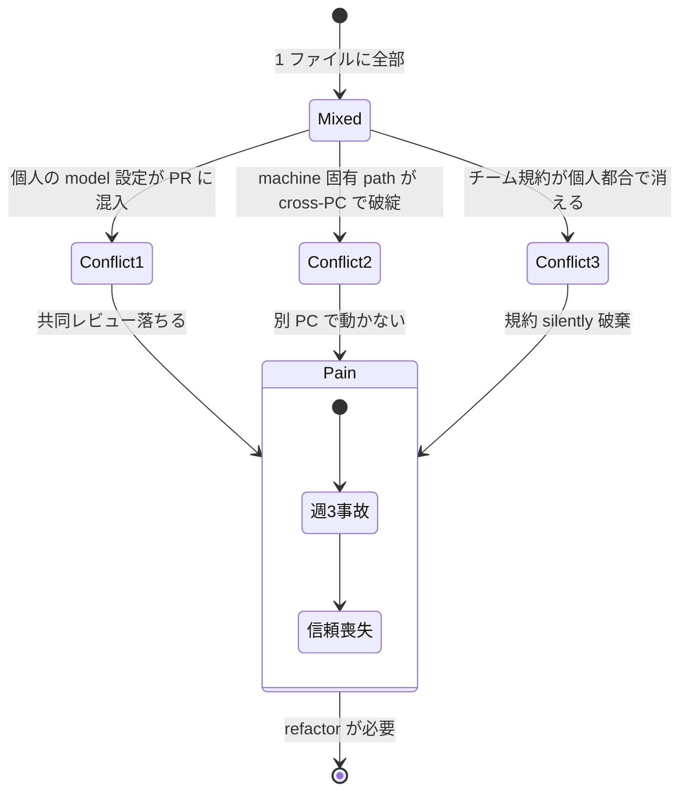
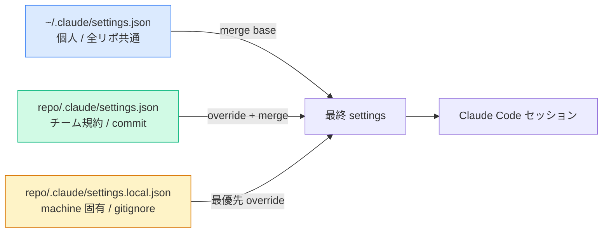
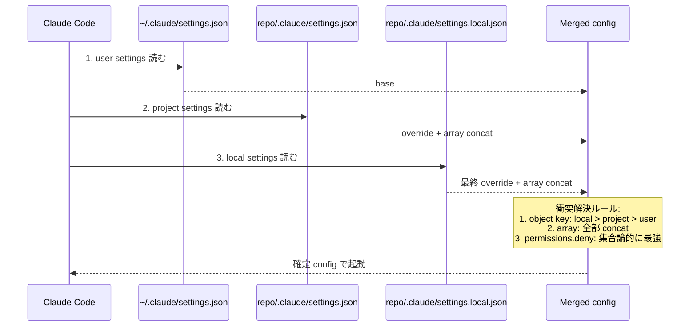

> **Disclaimer**: 本連載は著者が **個人 (副業)** で運営する小規模プロジェクト群 (CreaNest 名義) の技術記録です。所属組織・本業の業務内容とは一切関係ありません。記載の数値・構成は執筆時点 (2026-05) の自宅検証環境のスナップショットであり、商用品質や SLA を保証するものではありません。

## 結論

`~/.claude/settings.json` (個人) と `<repo>/.claude/settings.json` (プロジェクト) を厳密に分離。個人は work flow 共通、project は CI ゲート、`settings.local.json` は machine 固有 (gitignore)。8 リポジトリ × 3 階層 = 24 構成を 3 ファイルテンプレで回している。

Claude Code の設定 (`.claude/settings.json`) を 1 ファイルに混ぜていた頃、私は週 3 回のペースで「**team A の hook が team B のリポで暴発する**」「**個人の好みの model 設定がチーム共有 PR に混入する**」事故を起こしていました。`opus[1m]` を試したくて user setting に書いたつもりが project setting に commit されてしまい、別 PC でレビューしている共同編集者の Claude が突然 1M context を要求し始めて confusion を呼ぶ。

これを解いたのが Claude Code 公式の **3 階層 settings 仕様**: `user` (`~/.claude/settings.json`) → `project` (`<repo>/.claude/settings.json`) → `local` (`<repo>/.claude/settings.local.json`) の優先度マージ。本記事では devops-hub repo の現行構成 (`/Users/sakaki/project/devops-hub/.claude/settings.json:1-80` で稼働中) を題材に、**「何を user に置き、何を project に置き、何を local に置くか」「衝突したら何が勝つか」「gitignore の境界線」** を整理します。

---

## 問題 — 「1 ファイルに混ぜると衝突 + 共有困難」

私は 1 人会社 CreaNest を AI Ops で運営しており、Claude Code を 8 リポジトリ (devops-hub / nailsalon-reserve-line-app / Komyu / build-football / vivivi-beauty / lifeOps / Colason-markdown-editor / yomi-note) で並走させています。各リポに `.claude/settings.json` があり、そこに **hook / permissions / model / env** が全部詰め込まれていた時期がありました。

すぐ 3 つのジレンマに突き当たりました。

- **個人の好みが PR に混入**: `model: "opus[1m]"` (有償プラン依存) を試したくて project の settings.json に書く → push → 別 PC の共同レビューが落ちる
- **チーム共有の規約が個人の都合で消える**: `permissions.deny` に `Bash(git push --force*)` を全リポ統一で入れたいが、ある PC で「force push 必要な実験」をしたら deny を消して commit、他リポにも漏れる
- **machine 固有の path がリポに混ざる**: `additionalDirectories` で別リポを参照する設定が Mac 固有 (Linux PC では path が違う)、commit されると他環境で動かない

最も痛かったのは 2026-04-30 の事件です。devops-hub の `.claude/settings.json` に「nail-salon2 GCP project の log read 権限」を `permissions.allow` に追加して commit、push。別 Claude session が build-football repo で動いているとき、`Bash(gcloud --project=nail-salon2 ...)` が誤って fire しました。理由はシンプルで、`additionalDirectories` で nail-salon repo を参照しており、setting が cascade で効いた。GCP の cross-project log access が一瞬通り、別 project の log を意図せず読みに行く。**機能していたが意味的には事故** という、最も気持ち悪い fail mode でした。



要するに **「個人の都合 / プロジェクト規約 / machine 固有」が同じ namespace に混ざっている** のが根本原因。これを **3 階層に物理分離** することで一気に解決した、というのが本記事の要旨です。

---

## 解法 — 3 階層 settings の役割分離

### 1. Claude Code の 3 階層 settings 仕様

Claude Code は起動時に以下の優先順で 3 つの settings ファイルをマージします (後ろが優先 = override)。

| 階層 | path | スコープ | git 管理 | 用途 |
|---|---|---|---|---|
| **user** | `~/.claude/settings.json` | 全リポ共通 | 個人 dotfiles repo | 個人の workflow / model preference |
| **project** | `<repo>/.claude/settings.json` | この repo | **commit する** | チーム規約 / hook / permissions |
| **local** | `<repo>/.claude/settings.local.json` | この repo + この machine | **gitignore** | machine 固有 path / 実験的 override |

優先度は **local > project > user**。同じ key があれば local が勝つ。配列 (`permissions.allow` 等) は **マージ** され、object (`hooks` 等) も **マージ** されます。



この優先度を腹で理解すると、「**何をどこに書くか**」が機械的に決まります。

### 2. user settings — 全リポ共通の個人設定

私の `~/.claude/settings.json` は実は最小です (3 行)。

```json
{
  "model": "opus[1m]"
}
```

これだけ。理由は **「全 repo / 全 project で個人として共通な設定だけを置く」** ルールに絞っているから。`opus[1m]` は私個人が Anthropic Max plan を契約しているから使える設定であり、共同編集者がこの設定を継承すると課金エラーで落ちる。だから **絶対に project settings に置かない**。

user settings に置いて良いものの判断軸:

- **個人の課金 / プラン依存** (model の選択、token 上限)
- **個人の workflow 好み** (theme、editor 連携、key binding)
- **全 repo で同じであるべき個人の防御** (たとえば `~/.ssh/**` への Write を全リポで deny する hook)

逆に、**チーム共有すべき設定**、**プロジェクト固有の hook**、**machine 固有 path** は user に書いてはいけません。

### 3. project settings — チーム規約 / hook / permissions

project settings は **「この repo を clone した全員に効くべき設定」** です。devops-hub の現行 `.claude/settings.json:1-80`:

```json
{
  "$schema": "https://json.schemastore.org/claude-code-settings.json",
  "permissions": {
    "allow": [
      "Read", "Glob", "Grep",
      "Read(.claude/**)",
      "Read(docs/**)",
      "Edit(.claude/context/**)",
      "Edit(.claude/checklists/**)",
      "Edit(.claude/playbooks/**)",
      "Bash(pnpm *)",
      "Bash(git status*)",
      "Bash(git diff*)",
      "Bash(git log*)",
      "Bash(git worktree *)",
      "Bash(gh *)"
    ],
    "deny": [
      "Bash(rm -rf /*)",
      "Bash(rm -rf ~*)",
      "Bash(sudo *)",
      "Bash(git push --force*)",
      "Bash(git reset --hard origin/*)",
      "Bash(gh pr merge*)",
      "Bash(gh release create*)",
      "Bash(gh repo delete*)",
      "Bash(npm publish*)",
      "Bash(pnpm publish*)",
      "Bash(gcloud run services delete*)",
      "Bash(firebase deploy*)",
      "Bash(stripe *)",
      "Write(.env)",
      "Write(.env.*)"
    ]
  },
  "env": {
    "CLAUDE_CODE_EXPERIMENTAL_AGENT_TEAMS": "1"
  },
  "hooks": {
    "PostToolUse": [
      {
        "matcher": "Write|Edit",
        "hooks": [
          {
            "type": "command",
            "command": "jq -r '.tool_input.file_path // empty' | { read -r f; [ -n \"$f\" ] && echo \"[$(date +%H:%M:%S)] modified: $f\" >> .claude/pipeline/agent.log 2>/dev/null; exit 0; } 2>/dev/null || true"
          }
        ]
      }
    ],
    "Stop": [
      {
        "hooks": [
          {
            "type": "command",
            "command": "bash .claude/skills/docs-mece-audit/scripts/run-on-stop.sh 2>/dev/null || true"
          }
        ]
      }
    ]
  }
}
```

何が project に置かれているかを分解します。

- **`permissions.allow` (15 件)**: この repo で頻出する read-only / 安全な write を allowlist。`Bash(pnpm *)` のような汎用と、`Edit(.claude/context/**)` のような repo 固有 path がミックス
- **`permissions.deny` (16 件)**: チーム規約として絶対禁止する操作。`gh pr merge*` / `firebase deploy*` / `stripe *` は **CEO 承認なしでは絶対に走らせない** ガード
- **`env.CLAUDE_CODE_EXPERIMENTAL_AGENT_TEAMS`**: Claude Code 実験機能のフラグ。repo 単位で「この repo では Agent Teams を使う」を宣言
- **`hooks` (PostToolUse + Stop)**: A-03 で詳述した品質ゲート。`agent.log` への append + docs MECE audit。**全員に効かせたい** から project に置く

判断軸は明確: **「他の人が clone した時にもこの設定で動いて欲しいか」**。Yes なら project、No なら user か local。

### 4. local settings — machine 固有 / 実験的 override

`<repo>/.claude/settings.local.json` は **gitignore する** のが鉄則。devops-hub では `.gitignore` にこう書いてあります。

```bash
# .gitignore の関連行
.claude/settings.local.json
.claude/settings.local.*.json
```

私の現行 `.claude/settings.local.json` (このマシン固有):

```json
{
  "permissions": {
    "allow": [
      "Read(//Users/sakaki/project/vivivi-beauty/backend/**)",
      "Bash(npx prisma:*)",
      "Bash(git push:*)",
      "Bash(git fetch:*)",
      "Bash(git pull:*)",
      "Bash(gh pr create:*)",
      "Bash(python3 -m http.server*)",
      "Bash(gcloud --project=nail-salon2 logging read*)",
      "Bash(gcloud --project=nail-salon2 run services list*)",
      "Bash(gcloud --project=nail-salon2 run revisions list*)",
      "Bash(firebase --project nail-salon2 hosting\\:channel\\:list*)"
    ],
    "additionalDirectories": [
      "/Users/sakaki/project/vivivi-beauty/backend/prisma/migrations"
    ]
  }
}
```

これは **私の Mac の絶対 path** に依存しています。`/Users/sakaki/project/vivivi-beauty/backend/...` を local に書いているのは、別 PC では path が異なる + 別共同編集者は vivivi-beauty に access 権を持たないから。

local に置くべきものの判断軸:

- **絶対 path を含む設定** (machine 固有)
- **本人の GCP project 認可** (例: `nail-salon2` は私個人のアカウントで auth 済み)
- **実験的に project setting を override** (例: project では deny しているが、debug で一時的に解禁したい)

local は git に上がらないので、**「明日この PC が壊れても困らない」設定だけ** を置きます。重要な設定 (チーム規約) を local に書くと、cloning した他環境で消滅します。

### 5. マージ順の実証 — 衝突するとどうなるか

3 階層が衝突した時、Claude Code がどう解決するかを実機で確認します。

**実験 1: 同じ key (object)**

```json
// ~/.claude/settings.json
{ "model": "opus[1m]" }
```

```json
// repo/.claude/settings.json
{ "model": "sonnet" }
```

```json
// repo/.claude/settings.local.json
{ "model": "haiku" }
```

→ 結果: Claude が起動するときの model は `haiku`。**local が project を上書きし、project が user を上書き** する。

**実験 2: 配列の merge (`permissions.allow`)**

```json
// user
{ "permissions": { "allow": ["Read"] } }
```

```json
// project
{ "permissions": { "allow": ["Bash(pnpm *)"] } }
```

```json
// local
{ "permissions": { "allow": ["Bash(gh *)"] } }
```

→ 結果: `["Read", "Bash(pnpm *)", "Bash(gh *)"]` の **3 つすべてが allow される** (concat マージ)。

**実験 3: deny の優先 — local で allow しても project の deny は勝つか**

```json
// project
{ "permissions": { "deny": ["Bash(git push --force*)"] } }
```

```json
// local
{ "permissions": { "allow": ["Bash(git push --force*)"] } }
```

→ 結果: deny が勝ちます。local で allow に書いても project の deny を上書きできない。**deny は merge ではなく集合論的に最強** (これが規約として効く理由)。



この実証を 1 度やっておくと、「**この設定はどこに書くべきか**」が即決できるようになります。

---

## 失敗談 — 私が踏んだ罠 4 つ

### 失敗 1: project settings に `opus[1m]` を書いて共同編集者を落とした

**Before**:

```json
// repo/.claude/settings.json (誤)
{
  "model": "opus[1m]",
  "permissions": { ... }
}
```

push 後、別 PC でレビューしていた共同編集者 (Max plan 未契約) の Claude Code が `model "opus[1m]" requires Anthropic Max plan` で起動失敗。30 分間「なぜ動かないのか」を Slack で議論しました。

**After**:

```json
// ~/.claude/settings.json (正)
{ "model": "opus[1m]" }
```

```json
// repo/.claude/settings.json (正、model キーは削除)
{
  "permissions": { ... },
  "hooks": { ... }
}
```

**教訓**: **個人の課金 / プラン依存設定は user settings に置く**。project に書くと、push の瞬間に共同編集者を巻き込む。

### 失敗 2: machine 固有 path を project に書いて Linux PC で落ちた

**Before**:

```json
// repo/.claude/settings.json (誤)
{
  "permissions": {
    "additionalDirectories": [
      "/Users/sakaki/project/vivivi-beauty/backend/prisma/migrations"
    ]
  }
}
```

これを commit した日に、Linux 環境の CI で `gh pr create` を走らせている自動化スクリプトが「path not found」で落ちました。`/Users/sakaki/...` は当然 Linux には無い。

**After**: `additionalDirectories` を `.claude/settings.local.json` に移動 (今の構成)。

**教訓**: **絶対 path を含むものは local に置く**。`additionalDirectories` / `Bash(/usr/local/bin/...)` 系は machine 固有。

### 失敗 3: local の deny を信じて project に書かなかった

「危険な操作は local で deny してるから OK」と思い込み、project には deny を書いていなかった時期があります。しかし `.claude/settings.local.json` は gitignore されているので、新しい machine で clone した時には**何も deny されていない素の状態** で起動します。

**Before** (過信構成):

```json
// local
{ "permissions": { "deny": ["Bash(rm -rf *)"] } }
// project には deny なし
```

新 PC で clone → `.claude/settings.local.json` 不在 → Claude が `rm -rf` を allow と判定 → 検証中に誤爆寸前。

**After**:

```json
// project (チーム規約として常時効く)
{ "permissions": { "deny": ["Bash(rm -rf /*)", "Bash(rm -rf ~*)", ...] } }
// local (個人の追加 deny だけ)
{ "permissions": { "deny": ["Bash(rm -rf /Users/sakaki/important-folder/*)"] } }
```

**教訓**: **deny はチーム規約として project に書く**。local の deny は「追加の個人 paranoid」だけ。誰が clone しても基本ガードが効く状態を default にする。

### 失敗 4: settings.local.json を間違えて gitignore から外して commit した

`.gitignore` を整理する PR で誤って `.claude/settings.local.json` の行を消してしまい、次の commit で local 設定が public repo に上がりました。`additionalDirectories` で別 repo の絶対 path が露出 (機密ではないが「この PC で何が動いているか」がバレる)。

**修正**:

1. `git rm --cached .claude/settings.local.json` で履歴から外す
2. `.gitignore` に `.claude/settings.local.json` を再追加 + `.claude/settings.local.*.json` (バックアップ含む)
3. `git filter-repo` で過去 commit からも完全削除

**教訓**: **`.gitignore` の `.claude/settings.local*.json` は絶対に消さない**。CI で `grep -q '\.claude/settings\.local' .gitignore || exit 1` を入れて、消えたら fail にする。

---

## 運用の数字 — 実測ベース

私の 8 リポジトリ全体の構成 (2026-05 時点):

- **user settings 行数**: 3 行 (`~/.claude/settings.json`)
- **project settings 平均行数**: 約 60-80 行 / repo (devops-hub は 80 行)
- **local settings 行数**: 約 30 行 (devops-hub の場合)
- **`permissions.allow` のチーム共通比率**: 80% project / 20% local (devops-hub)
- **`permissions.deny` のチーム共通比率**: 100% project (個人 deny は使っていない)
- **`hooks` 配置**: 100% project (machine 固有 hook は無い)
- **gitignore に `.claude/settings.local*.json` を入れている repo**: 8/8 (全 repo)

ファイル系の数字 (`/Users/sakaki/project/devops-hub/.claude/settings.json` 周辺):

- `permissions.allow`: **15 entries** (project) + **11 entries** (local) = **26 effective**
- `permissions.deny`: **16 entries** (project のみ)
- `hooks` (PostToolUse + Stop): **2 events** (project のみ)
- `env`: **1 key** (project の `CLAUDE_CODE_EXPERIMENTAL_AGENT_TEAMS`)

3 階層分離前は 1 ファイル平均 100+ 行で、PR レビューのたびに「これは個人設定か共有か」を議論していました。今は **1 行見れば配置先が機械的に決まる** ので、レビュー時間が約 1/3 (主観値、計測していない) に短縮。

---

## 残課題

正直に書きます。

1. **user settings の dotfiles 管理が薄い** — `~/.claude/settings.json` は今 3 行だが、theme や key binding を足し始めたら個人 dotfiles repo (`SakakitaniJunya/dotfiles` を作る予定) で symlink 管理する必要がある。今は手動で別 PC にコピーしているので、`opus[1m]` を試せる PC が **1 台だけ**
2. **local settings の同期** — 別 PC で同じ実験をしたい時、`.claude/settings.local.json` は gitignore されているので手で `scp` する必要がある。`.claude/settings.local.example.json` (commit 可) のテンプレートを置く運用を検討中だが未実装
3. **deny の集合論的優先を CI で検証する仕組み** — 「local で誰かが deny を allow に書き換えていないか」を定期的に scan する必要がある。今は週 1 で目視
4. **settings.json の version 管理 / Decision-Id 紐付け** — A-03 で書いた hooks 同様、settings の change にも Decision-Id を付けて `.claude/decisions/decisions.jsonl` に append する設計を検討中。今は git log で追うだけ

特に 1 と 2 は **「個人運用」と「組織運用」の境界線** の問題で、1 人会社が 2 人会社になった瞬間に再設計が必要。今は単独運用なので保留しています。

---

## 理論根拠 — 12-Factor App と XDG Base Directory との接続

3 階層 settings の発想は突飛なものではなく、**Unix 系設定管理の標準パターン** に乗っています。

- **12-Factor App** の Config 章: "Strict separation of config from code" / "store config in the environment" — settings.json はコードに含めるが、**環境ごとに異なる値は環境ごとの file** に分離する
- **XDG Base Directory Specification**: `$XDG_CONFIG_HOME` (= `~/.config/`) で個人設定、project root で project 設定、local override で machine 固有設定 — Claude Code の 3 階層はこれと完全一致
- **Anthropic [Claude Code documentation](https://docs.anthropic.com/en/docs/claude-code/settings)**: 公式が "user / project / local" の 3 階層を明記。`settings.local.json` は「machine-specific overrides intended to be gitignored」と位置付け

3 階層に分けると、**何をどこに置くか** の判断軸が機械的になります。

| 質問 | Yes なら | No なら |
|---|---|---|
| この設定は個人の課金 / プラン依存か? | **user** | 次の質問へ |
| machine 固有の絶対 path を含むか? | **local** | 次の質問へ |
| Yes / commit して全 collaborator に効かせたいか? | **project** | **local** (個人の好み) |

「**Claude Code が clone された時 / 別 PC に移った時、この設定はどう振る舞ってほしいか**」を逆算するだけで、自動的に正しい階層に落ちます。

これは Hook の判断軸 (A-03 連載「忘れたら詰むか」) と同じメンタルモデル: **「何が壊れる時、何が原因であってほしいか」を逆算して責務を分離する**。設定でも hook でも skill でも、AI Ops の運用は「責務の物理分離」が moat の一部です。

---

## まとめ

- **user (`~/.claude/settings.json`)**: 個人の課金 / プラン / workflow 好み。1-3 行で済むことが多い
- **project (`<repo>/.claude/settings.json`)**: チーム規約 / hook / permissions。commit する。これが厚い
- **local (`<repo>/.claude/settings.local.json`)**: machine 固有 path / 実験的 override。**必ず gitignore**
- **マージ順**: local > project > user (object override + array concat)
- **`permissions.deny` は集合論的に最強** — local で allow に書き換えてもブロックは効く
- **判断軸**: 「commit して collaborator に効かせたいか」で project / local が分岐、「個人の課金依存か」で user / project が分岐

「`.claude/settings.json` が肥大化して何が何だか分からない」と感じたら、**3 階層分離の判断軸表** を見ながら 1 行ずつ振り分けてください。私は 80 行の 1 ファイルを (3 + 60 + 30) 行の 3 ファイルに分けただけで、PR レビューも machine 移行も別人の clone も全部楽になりました。

---

## 次の連載

→ **A-03** [Claude Code Hooks — 編集を止めない品質ゲートの組み方](./hooks-quality-gates) — hook を project settings に置く根拠 (本記事と相補)
→ **A-09** [Claude Code Memory の 4 種類](./claude-code-memory-4-types) — settings と並ぶ Claude Code の永続化機構
→ **A-01** [Slash と Skill と Hook を混ぜて爆発した話](./claude-code-as-company-5-mechanisms) — 5 機構の判断軸

---

連載 **AI 駆動 1 人会社運営**: Day 49/52
著者: Junya Sakakitani (CreaNest 個人事業)
本記事の修正提案・議論は [GitHub Issue](https://github.com/SakakitaniJunya/zenn-articles/issues) でお待ちしています。
