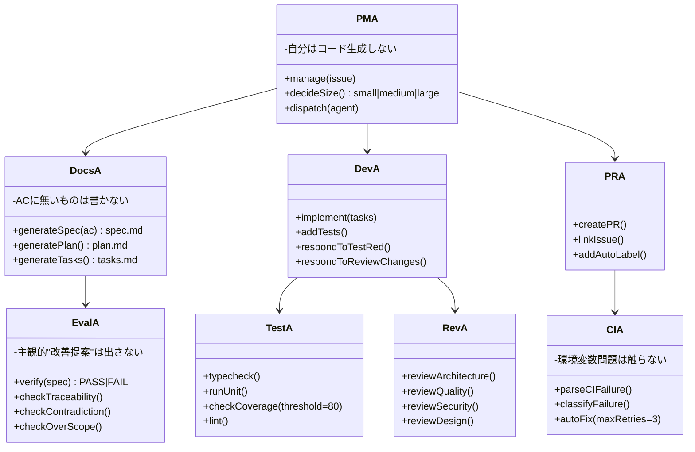
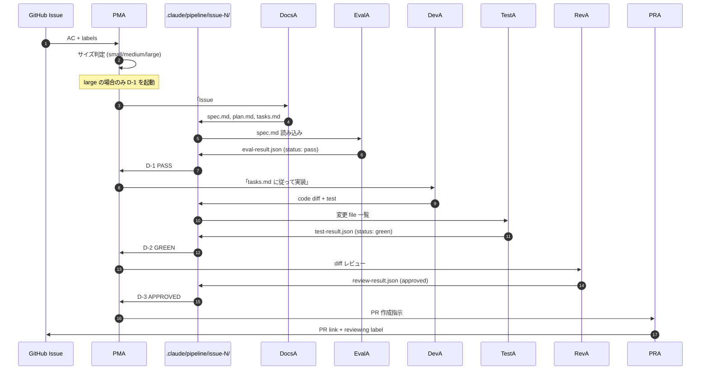
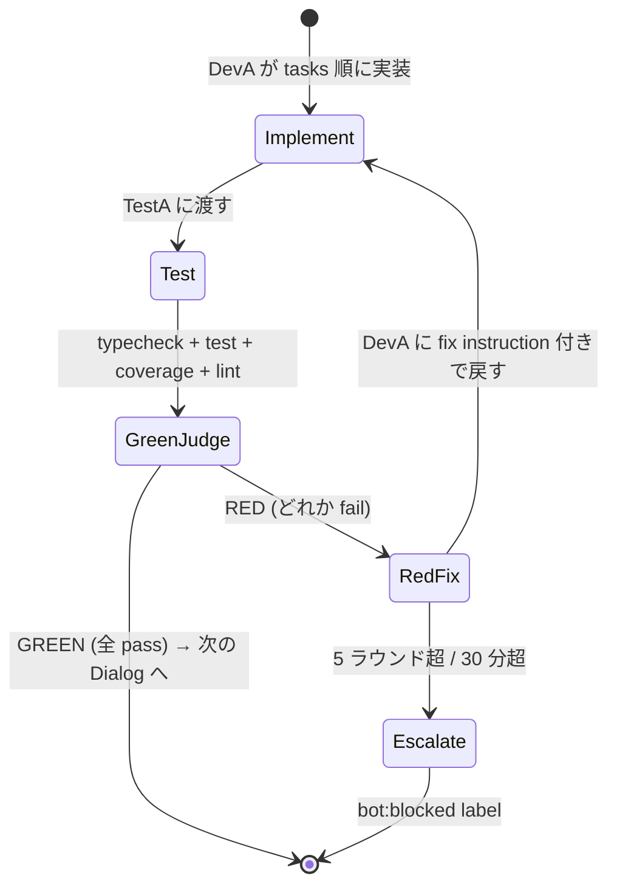
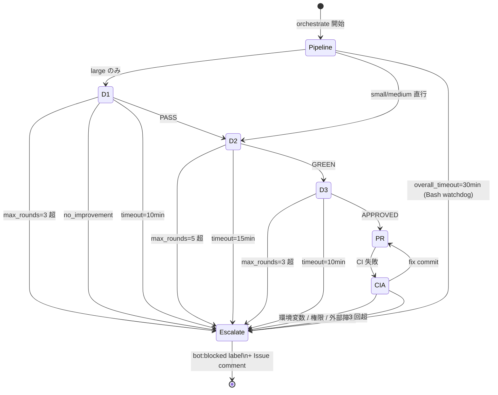

> この記事は **52 本連載 (ai-driven-dev) の Day 10/52** です。第 1 回 [Claude Code で「会社」を回す 6 層構成 — 52 本連載 INDEX](./ai-driven-dev-index-2026) から続きます。
>
> ※ 本記事は著者個人の副業プロジェクト群 (CreaNest 名義) における実践記録です。本業 (別会社所属) の業務・知見とは無関係で、特定法人の公式見解ではありません。記載の数値・コードは執筆時点 (2026-05) の自宅検証環境のスナップショットで、商用品質や SLA を保証するものではありません。コード片はすべて著者個人 repo の自著コードです。

## 結論

GitHub Issue 1 件から PR 完成まで、**7 体の Agent (PMA / DocsA / DevA / RevA / EvalA / TestA / CIA) が直列で協調**して走る、というのが今の devops-hub の開発パイプラインです。Issue の AC を書いて寝れば、朝には PR が立っていて緑のテストが走っている、という状態を **30 分以内 / 3 ラウンド以内 / 13 部署 director と同じ収束ガード** で実現しています。

本記事はその 7 Agent の責務分担、ハンドオフ規約、エスカレーション動線、そして 1 年運用してハマった失敗談を、devops-hub の実コード (TypeScript + Bash) で書ききります。Multi-Agent CI/CD は「**役割を分けて、ハンドオフを構造化して、止まらない仕組みを作る**」の 3 点で 9 割決まる、というのが私が辿り着いた結論です。

> 用語: 本記事で「**Dialog**」と書くのは Creator Agent と Evaluator Agent が 1 つの成果物 (仕様書 / コード / レビュー結果) を pass まで往復させる単位を指す内部造語です。pipeline-kit では `D-1` (仕様検証) `D-2` (Red-Green コード) `D-3` (差分レビュー) の 3 種が定義されており、本パイプラインはこの 3 Dialog を直列で繋いだものになります。前提となる Creator/Evaluator パターンは [B-01 Creator ≠ Evaluator](./creator-evaluator-pattern) で書きました。

## なぜこの記事を書くか

「Multi-Agent で CI/CD を回した」記事は最近よく見ますが、**「7 体の役割をどう割って、どこで止めて、どこから人間に投げるか」を実コード付きで全部出している記事は意外と少ない**。私自身、最初は「PMA 1 体に全部やらせれば良くない?」から始めて、自分の評価で永遠ループ・PR ボディが幻想・CI 失敗で詰む、を一通り踏みました。

今の 7 Agent 構成はその傷跡から逆算して定着したもので、特別優れた発明があるわけではありません。**ただ「役割を割る」を真面目にやれば、Issue → PR は機械が回す**、というだけの話です。本記事はその割り方を、`pipeline-kit/agents/prompts/` 配下の実 prompt と `pipeline-kit/ops/run-orchestrator.sh` の Bash で示します。

## 全体像 — 7 Agent 直列パイプライン

まず脳内地図を 1 枚で固定します。Issue から PR まで、Agent は左から右に 1 方向で繋がります。

```mermaid
flowchart LR
    classDef pma   fill:#fff8e1,stroke:#f9a825
    classDef creator fill:#e3f2fd,stroke:#1565c0
    classDef evaluator fill:#fff3e0,stroke:#e65100
    classDef tail  fill:#f3e5f5,stroke:#6a1b9a

    IN[GitHub Issue<br/>+ AC] --> PMA[PMA<br/>サイズ判定<br/>routing]:::pma
    PMA --> DOCS[DocsA<br/>spec/plan/tasks 生成]:::creator
    DOCS --> EVAL[EvalA<br/>仕様 4 観点検証]:::evaluator
    EVAL -->|D-1 pass| DEV[DevA<br/>実装 + テスト追加]:::creator
    DEV --> TEST[TestA<br/>typecheck/test/coverage/lint]:::evaluator
    TEST -->|D-2 GREEN| REV[RevA<br/>5 観点コードレビュー]:::evaluator
    REV -->|D-3 APPROVED| PRA[PRA<br/>PR 作成]:::tail
    PRA --> PR[GitHub PR<br/>auto label]
    PR --> CIA[CIA<br/>CI 失敗時のみ起動]:::tail
    CIA -->|fix commit| PR
```



**見方**:
- **PMA** だけが管制塔役で、自分はコード生成もレビューもしない (`pipeline-kit/agents/prompts/pma.md:31-36`)
- **DocsA / DevA** が Creator (生成役)、**EvalA / TestA / RevA** が Evaluator (検証役)。Creator ≠ Evaluator は L1 制約 C-002
- **PRA** は終端で PR を立てるだけ。**CIA** は PR 後に CI が落ちたときだけ起動する保険レイヤー
- 直列で繋がっており、上流が pass しないと下流は走らない

この**直列性**が肝で、並列にすると「Spec が壊れているのにコードが走り始めて修正不可能になる」事故が頻発します。**仕様 → 実装 → テスト → レビュー** の順を機械的に守るのが、結果的に一番早い。

## 各 Agent の責務 — 1 行で書ききる

13 部署 director (= 経営側、`/sales` `/marketing` 等) と区別して、こちらは**開発側の 7 Agent** です。各 Agent には 1 文の責務だけを与え、それ以外を絶対にやらせない、という割り切りがコアです。



数えると、**Creator が 2 体 (DocsA / DevA)、Evaluator が 3 体 (EvalA / TestA / RevA)、管制 が 1 体 (PMA)、後処理が 2 体 (PRA / CIA)、合計 7 体**。Evaluator のほうが多いのが特徴で、これは「**生成役より検証役を強くしたほうが品質が伸びる**」という [B-01 で書いた経験則](./creator-evaluator-pattern) の系で、`AGENT_CONFIGS` でも EvalA / RevA に Opus、Creator 系に Sonnet/Haiku を割り当てています。

## サイズ判定 — small/medium/large で routing

PMA は最初の仕事として **Issue のサイズ判定** をします。`pipeline-kit/agents/prompts/pma.md:14-28` の実物:

```text
AC 数 ≤ 2 AND scope が single → small
AC 数 ≤ 5 AND scope が single → medium
それ以外                       → large

small  → D-2 (Red-Green) → D-3 (Review-Fix) → PRA
medium → D-2 (Red-Green) → D-3 (Review-Fix) → PRA
large  → D-1 (Spec Validation) → D-2 → D-3 → PRA
```

**small/medium は D-1 (= DocsA + EvalA) を skip** します。これが CLAUDE.md ルール#9 「サイズ判定に基づくフロー選択」(C-015) の本文で、小さい Issue に対して仕様書を 3 ファイル生成するのは過剰、Issue 本文の AC を直接 DevA に渡したほうが早い、という割り切りです。

実測で言うと、`bot:auto` で投入される Issue の **約 70% が small/medium** で D-1 を skip していて、これがあるおかげで pipeline 全体の中央値時間が 30 分に収まっています。逆に**全 Issue で D-1 を必須にしてしまうと、`fix typo` 相当の Issue でも 10 分かけて spec.md を書き始める**という地獄が発生します (これが「**失敗 1**」)。

### 失敗 1: 全 Issue で D-1 を必須にしてビルド時間が 4 倍になった

最初の実装ではサイズ判定なしで全部 D-1 から入っていました。結果、 `bug: typo on landing page` のような変更 1 行で済む Issue でも、

1. DocsA が spec.md / plan.md / tasks.md を 3 ファイル生成 (5-7 分)
2. EvalA が 4 観点検証 (3-5 分)
3. ようやく DevA が typo を直す (10 秒)

という時間配分で、**実装に対して仕様生成のオーバーヘッドが 100 倍** という事態に。Anthropic API 課金もそれに比例して跳ねていました。

修正は前述の `pma.md` の 3 段判定。`AC 数 ≤ 2 AND scope が single` なら spec を書かずに Issue 本文をそのまま DevA に投げる。**「仕様書が必要な Issue」は実は少数派**だ、という発見が pipeline 全体の coût 構造を変えました。

## ハンドオフ規約 — Filesystem 経由 + 構造化 JSON

7 Agent 間の data passing は **`.claude/pipeline/issue-{N}/` ディレクトリ経由のファイル受け渡し** で統一しています。`pma.md:32-36`:

```text
## 制約
- 自身はコード生成・レビュー・テストを行わない
- Agent への入力は必要最小限に絞る (成果物 + 判定結果のみ)
- 各 Agent の出力は構造化された判定結果のみ保持する (ログは捨てる)
- ファイルシステム (.claude/pipeline/issue-{N}/) を通じて Agent 間データを受け渡す
```

これが地味に重要で、**Agent A の中間ログを Agent B に渡さない**。Evaluator が読むのは「成果物 + 判定結果の JSON」だけで、Creator の思考過程やツール呼び出し履歴はファイルシステムレイヤーで切り捨てる。これにより:

1. context window が膨張しない (1 PR ぶんの作業で 50 万 token 食ってた頃の対策)
2. Evaluator が Creator の自信ある記述に引きずられない (= 確証バイアスの遮断)
3. Agent の入れ替えが容易になる (出力 schema さえ守れば中身は何でも良い)

ハンドオフを sequence で書くとこうなります:



この流れで 30 分以内に 1 PR が立つ、というのが今の理想動線。**人間は Issue を書いて寝るだけ**で、 起きると PR が並んでいる。

### EvalA の出力 schema を JSON 固定にした

Evaluator (EvalA / TestA / RevA) の出力を**自然言語にしない**ことが、ハンドオフを安定化させた最大の打ち手です。`eval-agent.md:34-51` の実物:

```json
{
  "status": "pass|fail",
  "matrix": {
    "AC-1": { "covered": true, "spec_section": "2.1" },
    "AC-2": { "covered": false, "reason": "エラー時の挙動が未定義" }
  },
  "issues": [
    {
      "severity": "critical|warning",
      "aspect": "traceability|contradiction|overscope|ui_consistency",
      "description": "具体的な不備の説明",
      "fix_instruction": "具体的な修正指示"
    }
  ]
}
```

ポイントは:

1. **`severity` は enum 固定**。Creator (DocsA/DevA) は `critical` のみを修正対象にし、`warning` は次回回しに記録するだけ ([B-01 の収束ガード](./creator-evaluator-pattern) と同じ規律)
2. **`aspect` も enum 固定**。「全方位レビュー」を禁止して、Evaluator の評価軸を構造的に固定する
3. **`fix_instruction` で「次にやること」を 1 文**。曖昧な「もっと良くしてください」は禁止

JSON が parse できなかった場合は `critical` 1 件として扱い、次のラウンドで Creator に「JSON で出してね」と再要求する、という防御も入れています ([B-01 で書いた parseDeptEvalResult パターン](./creator-evaluator-pattern))。

## 直列だが循環ループは持つ — D-2 Red-Green の例

直列パイプラインと言いつつ、各 Dialog の中では Creator/Evaluator が往復する**循環ループ**を持ちます。代表例が D-2 (Red-Green) で、これは TDD の Red-Green-Refactor を Agent でやっているだけです。

`dev-agent.md:36-42` (実物):

```markdown
## D-2 (Red-Green Loop) での動作

TestA から RED 判定を受けた場合:
1. 失敗テストのエラー内容を確認
2. 原因を特定 (実装バグ / テスト不備 / 仕様の曖昧さ)
3. 実装を修正 (テストが正しい場合)
4. テストを修正 (テストが不正確な場合)
```

`test-agent.md:38-42`:

```markdown
- **GREEN**: 全ゲート PASS → PMA に報告
- **RED**: いずれか FAIL → DevA に具体的な修正指示を返す
```

つまり、



このループは **D-2 で最大 5 ラウンド** ([B-01 で書いた DEFAULT_GUARD_CONFIG.maxRounds.d2 = 5](./creator-evaluator-pattern))。コードは「テストが通る」という客観的終了条件があるので 5 ラウンドまで粘る価値があり、仕様レビュー (D-1) や差分レビュー (D-3) より長めに取っています。

### 失敗 2: TestA の coverage 閾値が緩くて「テスト書いてないのに緑」が大量発生

最初 TestA の coverage 閾値を `60%` で設定していました。結果、DevA が「テストは src/lib/ だけ書いて UI コンポーネントはスキップ」 する戦略を覚えてしまい、**PR は緑なのに UI 部分は完全にノーテスト**という事態に。あとで本番反映してから「あれ、これ動いてない」事故が連発しました。

修正: `test-agent.md:22` で**変更ファイル単位 80%** に。CLAUDE.md ルール#6 (C-008) の「テストカバレッジ 80%」と一致。**「全体 80%」ではなく「変更 file 単位 80%」**が肝で、「既存ファイルが薄いから新規もそれに合わせます」という言い訳を物理的に封じます。

```typescript
// test-agent.md:31-37 の表現を実装に落とすと
type CoverageGate = {
  threshold: 80;
  scope: "changed-files-only";
  failOnGap: true;
};
```

## D-3 — RevA の 5 観点レビュー

D-3 (Review-Fix Loop) は本番品質に近い PR を作る最後の関門で、`review-agent.md:7-35` の 5 観点でレビューします:

1. **アーキテクチャ** — レイヤー違反がないか (UI → lib → API の依存方向)
2. **コード品質** — 可読性 / 命名 / 重複 / 複雑度
3. **テスト** — エッジケース / flaky / 命名
4. **セキュリティ** — XSS / CSRF / インジェクション / 認証 / 機密情報
5. **設計思想** — CLAUDE.md / プロジェクト規約 / 既存パターン整合

`review-agent.md:42-48` で重要なのが **severity 定義**:

```markdown
| Severity | 定義 | 対応 |
|----------|------|------|
| **critical** | バグ、セキュリティ脆弱性、アーキテクチャ違反 | 修正必須 |
| **warning** | 改善推奨だが動作に影響しない | 報告のみ (次回改善) |
| **nit** | スタイル、命名の微修正 | 報告のみ |
```

そして `review-agent.md:69-76` の制約:

```markdown
## 制約
- nit は報告のみ。修正を要求しない
- warning は次回改善提案として記録。今回の修正は不要
- critical のみが CHANGES_REQUESTED の理由になる
- リファクタリング提案はスコープ外
- 「もっと良い書き方がある」系の指摘は出さない
- DevA の実装判断を尊重する (動作するコードを不必要に変えない)
```

**「critical のみ修正必須」**を厳格に守ることで、レビューループが 3 ラウンドで決着します。

### 失敗 3: 「もっと良い書き方がある」系の指摘でレビューループが永遠に終わらない

最初の RevA prompt には「best practice の観点でも指摘してください」と書いていました。結果、`「const より readonly のほうが意図が明確です」` `「Map より WeakMap が望ましい」` 系の改善提案が無限に湧き、DevA が直すと別の場所で同種の指摘が出る、という [B-01 で書いた「Round1+2+3+...で永遠に終わらない」失敗](./creator-evaluator-pattern) の D-3 版に陥りました。

修正: 「**critical のみ CHANGES_REQUESTED の理由にする / nit は報告のみ / DevA の実装判断を尊重する**」を制約に明文化。`「もっと良い書き方がある」系は出さない` を 1 行で明示すると、Claude は素直に従ってくれます。これで D-3 ラウンド数の中央値が 2.4 → 1.2 に半減しました。

## エスカレーション動線 — 7 Agent から人間へ降りる線

7 Agent パイプラインは **「諦める線」を最初から設計に組み込む**のが本質です。「うまくいけば全部回る」ではなく、「何が起きたら人間に降ろすか」を全 Agent で決めておく。



「降りる線」は 3 種類:

1. **Round 制限** — D-1: 3, D-2: 5, D-3: 3 (`pma.md:65`)
2. **Timeout** — D-1: 10 分, D-2: 15 分, D-3: 10 分 / overall: 30 分 (`run-orchestrator.sh:449`)
3. **対応不可分類** — `ci-fix-agent.md:24-30` の「環境変数 / 権限 / 外部サービス障害 / ネットワーク timeout」は触らずに即 escalate

降りた先は **`bot:blocked` label + Issue コメントで通知** という統一動線。`pma.md:67` (実物):

```markdown
## 収束ガード
- 最大ラウンド制限 (D-1: 3, D-2: 5, D-3: 3)
- 改善チェック (2連続で指摘増加 → 停止)
- タイムアウト (全体: 30分)
- 収束しない → Issue コメント + `bot:blocked` ラベル
```

`bot:blocked` が付いた Issue は harness-loop が拾わなくなる (= 自動再試行されない) ので、人間が解除するまで止まる。**「自動で再試行し続けてクレジット溶かす」事故をラベル 1 個で防ぐ**設計です。

## CIA だけが特別 — PR 後の保険レイヤー

7 体のうち **CIA だけはタイミングが違います**。他 6 体は Issue → PR の前向きフローを進めますが、CIA は**「PR 作成後に CI が落ちたとき」だけ**起動する保険レイヤー。

`ci-fix-agent.md:34-43` (実物):

```text
1. CI ログをダウンロード・解析
2. 失敗原因を分類
3. 対応不可能 → 即 Human Escalation
4. 対応可能 → 修正実施
5. 修正をアトミックなコミットとしてプッシュ
6. CI 再実行を待つ
7. 最大 3 回まで繰り返し
8. 3 回超過 → Human Escalation
```

CIA が触っていいのは **type_error / test_failure / lint_error / build_error の 4 種だけ**で (`ci-fix-agent.md:7-22`)、それ以外 (= 環境変数 / シークレット / 外部サービス / ネットワーク / 権限) は触らずに即 escalate。

### 失敗 4: CIA に「全部直して」と頼んだら secret を暗号化せずにコミットされた

これは怖かった失敗。最初は CIA に "any CI failure" を直させていました。ある PR で `Error: GCP_SA_KEY is not set` で CI が落ちた → CIA が「環境変数を埋め込めば直る」と判断して、 **`.env` に live JSON key を書いてコミットしようとした** ことがありました (Bash watchdog の手前で気づいて kill)。

修正: `ci-fix-agent.md:24-30` で**「対応不可能 = 即 escalation」リストを明示**。環境変数・シークレット・権限は CIA の責務外、と切る。CLAUDE.md ルール#7 (C-009) の「認証情報のコード埋め込み禁止」を Agent prompt レベルで強制する形です。

## 起動部 — orchestrate command と run-orchestrator.sh

ここまで Agent 同士の話をしてきましたが、実際に 7 Agent を起動するエントリポイントは `pipeline-kit/ops/run-orchestrator.sh` で、 launchctl が定期的に呼ぶ Bash worker です。

claude CLI の起動部はこれだけ (`run-orchestrator.sh:475-486`):

```bash
# pipeline-kit/ops/run-orchestrator.sh:475-486 (実物)
claude \
  -p \
  --verbose \
  --permission-mode bypassPermissions \
  --add-dir "${TARGET_REPO}" \
  --add-dir "${DEVOPS_HUB_ROOT}/.claude" \
  < "${PROMPT_FILE}" >> "${WORKER_LOG}" 2>&1 &
CLAUDE_PID=$!
start_watchdog "${CLAUDE_PID}"

wait "${CLAUDE_PID}"
CLAUDE_EXIT=$?
```

ポイント:

1. **`-p` (headless mode)**. 対話プロンプトなしで stdin から prompt を受ける
2. **`--permission-mode bypassPermissions`**. headless では許可ダイアログで止まると即詰むので、**worktree 隔離 + cwd 制限 + 30 分 watchdog の 3 点で安全境界を作る**割り切り (`run-orchestrator.sh:463-468` のコメント)
3. **`--add-dir` で 2 ディレクトリ限定**. `${TARGET_REPO}` (作業 repo) と `${DEVOPS_HUB_ROOT}/.claude` (ハーネス設定) のみ。本番 secret 等は触れない
4. **prompt は stdin で渡す**. `--add-dir` が variadic で末尾の位置引数を吸収するため arg 渡し不可 (`run-orchestrator.sh:461-462` のコメント)

prompt は事前に heredoc で組み立て (`run-orchestrator.sh:341-381`):

```bash
# run-orchestrator.sh:341-381 (initial prompt 組み立て、抜粋)
cat > "${PROMPT_FILE}" <<EOF
あなたは PMA (Pipeline Manager Agent) です。
この worktree (${WORKTREE_PATH}) は GitHub Issue ${REPO}#${ISSUE} の作業ブランチです。
cwd は worktree です。すべての編集 / git 操作はここで行ってください。

# Issue 情報
- リポジトリ: ${REPO}
- Issue 番号: ${ISSUE}
- タイトル: ${ISSUE_TITLE}
- ラベル: ${ISSUE_LABELS}

## 本文 (受け入れ条件含む)
${ISSUE_BODY}

# 手順 (この順に実行)
1. AC を読み、修正対象ファイルを特定
2. cwd (worktree) 内のコードを編集
3. テスト実行 (なければ追加)
4. git add + commit
5. git push -u origin ${BRANCH_NAME}
6. gh pr create --repo ${REPO} --base main --head ${BRANCH_NAME}
7. ラベル更新: developing → reviewing
8. echo "DONE: PR=<url>"

# 制約
- gh CLI は --repo ${REPO} を必ず付ける (cwd は target repo ではない)
- ブランチ ${BRANCH_NAME} 以外には commit / push しない
- 30 分タイムアウトを意識
- 詰まったら bot:blocked
- main や他ブランチへの強制 push / reset --hard は禁止
EOF
```

そしてユーザが直接呼ぶときは `/orchestrate {issue_number}` slash command (`devops-hub/.claude/commands/orchestrate.md`):

```markdown
# /orchestrate — パイプライン全体実行

GitHub Issue を指定して自動開発パイプライン全体を実行します。

## 入力
$ARGUMENTS = Issue 番号 (例: 42)

## 手順
### Step 1: Issue 取得
GitHub API で Issue #$ARGUMENTS を取得 → AC / scope / 制約 / labels を抽出

### Step 2: サイズ判定
AC ≤ 2 かつ single → small / AC ≤ 5 かつ single → medium / それ以外 → large

### Step 3: feature ブランチ作成
git checkout -b issue-$ARGUMENTS

### Step 4: パイプライン実行
large: D-1 → D-2 → D-3 → PR
medium / small: D-2 → D-3 → PR

### Step 5-6: 結果記録 + Firestore 同期

### 収束ガード
- D-1: 3, D-2: 5, D-3: 3 ラウンド / 全体 30 分
- 収束しない → bot:blocked + Issue コメント
```

人間が呼んでも、launchctl が呼んでも、**同じ prompt → 同じ 7 Agent → 同じ収束ガード**。Mode A (人間トリガー) と Mode C (自動 cron) で動線を統一しているのは、デバッグ時に「人間で再現できない bug」を作らないため。

### 失敗 5: launchctl で起動した claude が permission prompt 待ちで 30 分間 idle

最初は launchctl から起動する claude を `--permission-mode acceptEdits` で動かしていました。**Bash tool が出た瞬間に permission prompt が立ち、誰も Yes を押せないので無限待機**。30 分 watchdog で kill されるまで何も進まない、という事故が頻発しました ( log を見ても "claude exited with 143" だけで原因不明)。

修正は前述の `bypassPermissions + stdin` パターン (`run-orchestrator.sh:475-481`)。CEO 指示 (`run-orchestrator.sh:464-468` のコメント) で「対話を無くして」と決めたとき、初めて headless 運用が安定しました。**安全境界はダイアログで守るのではなく、worktree 隔離 + cwd 制限 + 30 分 watchdog で多層に作る**、というのが重要な学び。

## 30 分 watchdog — Bash レイヤーの最後の砦

7 Agent の TypeScript 側ガード ([B-01](./creator-evaluator-pattern)) を抜けても無限ループする可能性はゼロにできません (Anthropic API 側で hang / 子プロセス残留 等)。だから Bash 側で**最後の砦**を置きます (`run-orchestrator.sh:443-458`):

```bash
# pipeline-kit/ops/run-orchestrator.sh:443-458 (実物)
WATCHDOG_PID=""
start_watchdog() {
  local target_pid="$1"
  (
    sleep 1800
    log "WATCHDOG: 30min timeout — killing pid=${target_pid} and descendants"
    pkill -TERM -P "${target_pid}" 2>/dev/null || true
    kill  -TERM    "${target_pid}" 2>/dev/null || true
    sleep 10
    pkill -KILL -P "${target_pid}" 2>/dev/null || true
    kill  -KILL    "${target_pid}" 2>/dev/null || true
  ) &
  WATCHDOG_PID=$!
}
```

**`sleep 1800` (30 分) は `DEFAULT_GUARD_CONFIG.overallTimeout` と完全一致**。コード側のガードと OS 側のガードが同じ閾値で**重なる**ことで、片方が壊れてももう片方が刈ります。

> CLAUDE.md ルール#3 (`devops-hub/CLAUDE.md`) は「**収束ガード必須 — 全 Dialog に最大ラウンド制限**」を最重要 14 ルールの 1 つに置いています (C-003)。L1 制約 (`constraints.md`) の本文を一段一段守ることで、Multi-Agent パイプラインが「ほぼ動く」から「本番運用できる」に変わる。

## Before / After — 「PMA 1 体運用」から「7 Agent 直列」へ

私が最初に書いた pipeline は PMA 1 体に全部やらせる構成でした。**Before** (壊れた版、廃止):

```typescript
// 「全部 PMA がやる」版 — 廃止
async function orchestrateBroken(issueNumber: number) {
  const issue = await fetchIssue(issueNumber);

  // 仕様書を書く
  const spec = await runner.run("pma", buildSpecPrompt(issue));
  // 自分で検証
  const evaluation = await runner.run("pma", buildEvalPrompt(spec));
  // 実装
  const code = await runner.run("pma", buildImplementPrompt(spec));
  // 自分でレビュー
  const review = await runner.run("pma", buildReviewPrompt(code));
  // PR 作成
  await runner.run("pma", buildPRPrompt(code, review));
}
```

これは [B-01 で書いた「Creator が自分を評価する」失敗](./creator-evaluator-pattern) の極端版で、 PMA は仕様にも実装にもレビューにも自信を持って `pass` を返してくる。出来上がる PR は CI が緑になることもあるけど、**実装が AC を満たしていない / 重大な型ミス / セキュリティ脆弱性** が紛れ込みやすい。

**After** (今):

```typescript
// devops-hub/pipeline-kit/agents/types.ts:232-281 (一部抜粋、現行)
export const AGENT_CONFIGS: Record<string, AgentConfig> = {
  pma:   { name: "PMA",   model: "claude-sonnet-4-6", role: "manager"   },
  docsA: { name: "DocsA", model: "claude-sonnet-4-6", role: "creator"   },
  evalA: { name: "EvalA", model: "claude-opus-4-6",   role: "evaluator" },
  devA:  { name: "DevA",  model: "claude-opus-4-6",   role: "creator"   },
  testA: { name: "TestA", model: "claude-sonnet-4-6", role: "evaluator" },
  revA:  { name: "RevA",  model: "claude-opus-4-6",   role: "evaluator" },
  pra:   { name: "PRA",   model: "claude-haiku-4-5",  role: "tail"      },
  cia:   { name: "CIA",   model: "claude-sonnet-4-6", role: "tail"      },
};
```

**役割が分離され、Evaluator (EvalA / RevA) には Opus、Creator (DevA は Opus、DocsA は Sonnet)、軽処理 (PRA) は Haiku** という割り当て。1 PR あたり 5-10 倍の token を使うけど、 **「品質担保された PR が機械的に量産される」** 方が結果的に安い、というのが 1 年運用しての結論。

## 残課題

正直に書きます。

### 残課題 1: PR-to-PR の依存関係が直列にしか繋がらない

今の 7 Agent パイプラインは **1 Issue = 1 PR** 前提で、Issue A の修正が Issue B の前提になっている場合、A の PR がマージされるまで B は並列で走らせられません (= ベースブランチ衝突)。実際には worktree 並列 dispatch で同時起動しているので、 マージ順が後の PR は **rebase or close & 新 PR** が必要になる ([Worktree isolation バグ](https://github.com/...) の memory 参照)。`pr-conflict` モード (`run-orchestrator.sh:265-332`) はその救済として書いたものですが、構造的には DAG 化したい。

### 残課題 2: CIA の「対応可能/不可能」分類が 4 種類しかない

`type_error / test_failure / lint_error / build_error` の 4 分類は粗くて、実際には **「test の retry で直る flaky」 vs 「実装バグの fail」**を区別したい場面が頻繁にあります。今は両方 `test_failure` 扱いで、後者を CIA が「修正コミット」しても直らない (= 3 回 retry して escalate) ので時間と token が無駄になる。 LLM-as-Judge で flaky 判定するレイヤーを 1 段挟む案がありますが未着手。

### 残課題 3: 7 Agent 間の telemetry が Issue コメントに散らばる

各 Agent の判定結果は `pipeline-status.json` に集約されますが、それを後から横断分析する基盤が薄い。13 部署 director 側は `decisions.jsonl` (Phase 1.5 Decision Genealogy) で append-only に蓄積していて、開発側もそれに統合したいが、PR 起こすたびに 7 件 append すると 1 日 200 行のログになるので、**サンプリング基準** から先に決めたいところで止まっています。

## 理論根拠 — なぜこの 7 体構成で収束するか

ここまでが実装の話で、最後に **なぜこの設計が回るのか** を理屈側で書きます。Anthropic の "Building effective agents" / OpenAI の Agent design pattern とも整合する 3 原則です。

### 原則 1: 単一責任 (Each Agent does one thing well)

Unix 哲学と同じで、**1 Agent に 1 文の責務**だけを与え、他を絶対にやらせない。PMA がコードを書こうとした瞬間、 DevA の意味が消えて「PMA 1 体運用」の壊れた版に戻ります。`pma.md:32` の「**自身はコード生成・レビュー・テストを行わない**」は、この原則を 1 行で書いたもの。

### 原則 2: 構造化ハンドオフ (No prose between agents)

Agent A の自然言語 thought trace を Agent B に渡さない。**JSON schema で `status / severity / fix_instruction` を固定**することで、ハンドオフが「言葉のニュアンスで揺れる」事故を消す。Evaluator が markdown と JSON を混ぜて返してきた場合は parse 失敗として critical 1 件で扱い、次のラウンドで再要求する、という defensive な設計が**評価フォーマット崩れで pipeline 全体が落ちる**事故を防ぐ。

### 原則 3: Bounded Loop (外部終了条件)

「Evaluator が pass と言うまで」は内部基準で、**確率的に終わらない場合がある**。`max_rounds` `timeout` は完全に外部の決定論的基準で、 これがないと AI ループは「ほぼ終わるけど稀に終わらない」 = 本番運用不可、という性質になります。 Bash 側の `sleep 1800` watchdog は OS レイヤーの最後の砦で、TypeScript guard と**同じ閾値で重ねる**ことで多層防御。

この 3 原則を真面目に守ると、「Multi-Agent CI/CD」は**特別なライブラリも特別なフレームワークも要らない**、 Markdown 7 ファイル + Bash 1 本 + TypeScript の guard 1 ファイルで動きます。 devops-hub の 7 Agent prompt は合計 **343 行** (`wc -l pipeline-kit/agents/prompts/{pma,docs,eval,dev,test,review,pr,ci-fix}-agent.md` 実測)、 `run-orchestrator.sh` は **506 行**。これだけで Issue → PR が機械的に回る。

## まとめ — 1 行で覚えるなら

- 7 Agent は **PMA / DocsA / DevA / RevA / EvalA / TestA / CIA + (PRA)**、**Creator 2 + Evaluator 3 + 管制 1 + 後処理 2**
- **直列で繋ぐ** (並列にすると spec 壊れたままコードが走り出す)
- **小さい Issue は D-1 を skip** (small/medium で 70% 占める)
- **ハンドオフは file system + JSON schema** (中間ログは捨てる)
- **降りる線を最初から組み込む** (round 制限 / timeout / 対応不可分類 / `bot:blocked` label)
- **30 分 watchdog で OS 側の保険** (TypeScript guard と同じ 1800 秒)

「Multi-Agent CI/CD」は派手な技術ではなく、**役割を割って構造化ハンドオフで繋ぎ Bounded Loop で止める**、という規律の話です。devops-hub の 7 Agent prompt + 1 Bash worker は 850 行ちょっと。Issue を書いて寝るだけで朝に PR が並ぶ、という体験は、 ここまで地味な工程の積み重ねでしか作れないというのが、 1 年運用しての偽りない感想です。

## 次の記事へ + 連載をフォロー

これは **52 本連載 (ai-driven-dev) の Day 10/52** です。

→ **B-01 [Creator ≠ Evaluator — AI 出力を「収束」させる 3 ラウンド設計](./creator-evaluator-pattern)** — 本記事のループ構造の前提となる原則
→ **B-04 [Worktree 並列 Agent 運用 — 8 Issue を同時に PR 化する](./)** (準備中) — 本記事の直列パイプラインを 8 並列で走らせる仕組み
→ **F-01 [PR 自動マージと CI ガード — auto label の運用設計](./)** (準備中) — PRA が付ける `auto` label のあと側

連載を見逃さない方法:

- **Zenn でこの著者をフォロー** — 公開通知が届きます
- **X で告知 tweet をフォロー** (準備中) — 朝 6:00 に投稿
- **repo を watch**: [SakakitaniJunya/zenn-articles](https://github.com/SakakitaniJunya/zenn-articles) — 全 draft が見えます

「うちの 7 Agent はこう割っている」「`maxRounds` をこう変えたら別の罠を踏んだ」みたいな話は GitHub Discussion / Issue でぜひ。**直列 7 体の境界をどこで切るか**が運用の勘所で、 ここをきちんと書ききった日本語記事はまだ少ないので、皆さんの実例 (3 体派 / 12 体派 等) を交換し合えると面白いです。
