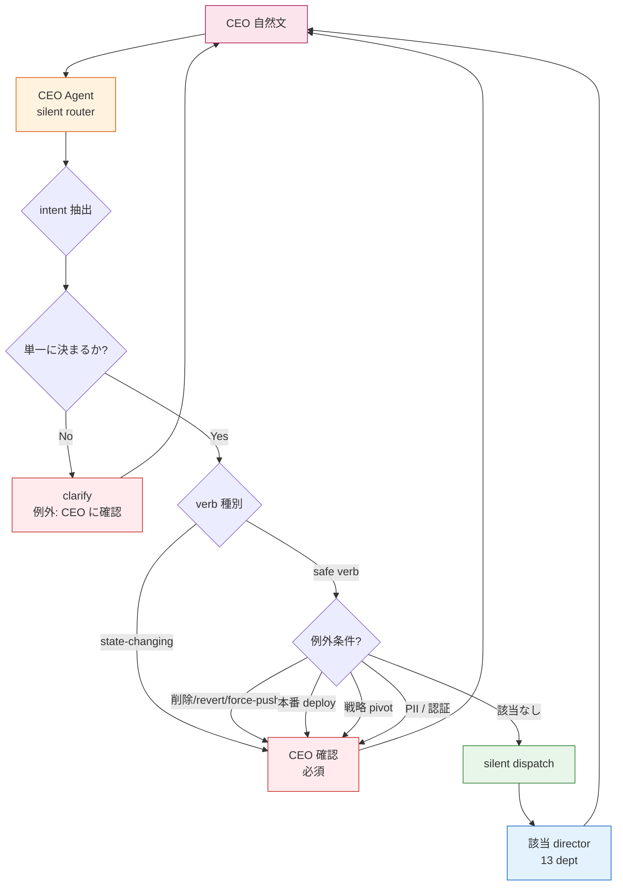
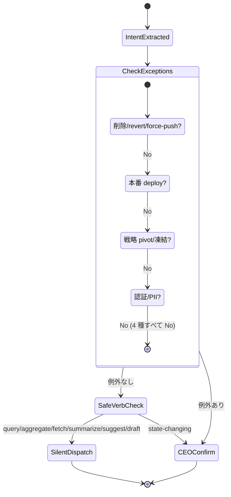
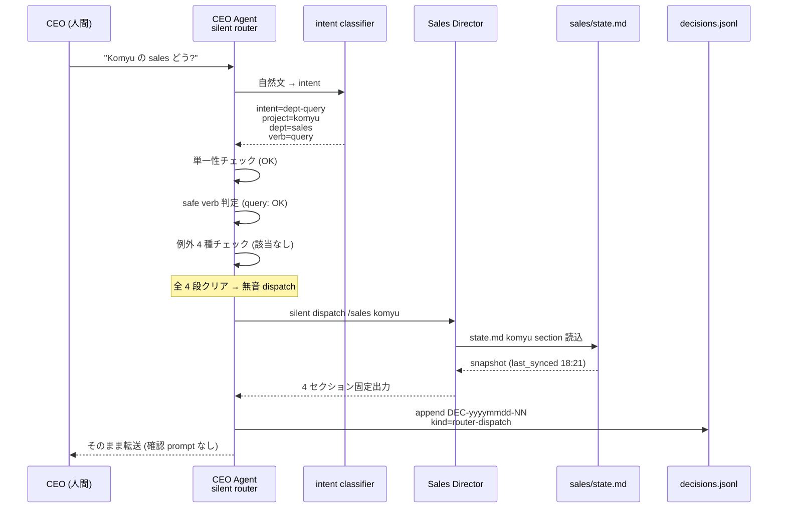

> この記事は **52 本連載 (ai-driven-dev) の Day 25/52** です。第 1 回 [Claude Code で「会社」を回す 6 層構成 — 52 本連載 INDEX](./ai-driven-dev-index-2026) から続きます。
>
> ※ 本記事は著者個人の副業 (個人開発) における実践記録です。本業 (別会社所属) の業務・知見とは無関係で、特定法人の公式見解ではありません。コード片・設定例はすべて著者個人 repo の自著コードです。

## 結論

**CEO Agent は intent 単一なら無音 dispatch、確認 prompt は禁止。例外は削除 / deploy / PII / ambiguous の 4 つだけ。**

13 部署 director を運用していて一番うざかったのが「`@sales komyu` に振りますがよいですか?」という確認 prompt でした。intent が単一に決まる発話 (例: "Komyu の sales どう?") には確認なしで dispatch、危険動詞 (削除 / 本番 deploy) や個人情報を含むケースだけ確認する、という線引きを引いたら CEO の認知負荷が桁で下がりました。

- intent classifier は 13 パターンの自然文 → director 対応表で実装、辞書ベース (CEO 自然文の頻度上位 13 を `pipeline-kit/agents/prompts/ceo/director.md:267-283` でテーブル化)
- safe verb は 6 種 (query / aggregate / fetch / summarize / suggest / draft) のみ、それ以外は CEO 確認必須
- 例外 4 種 (削除系 / 本番 deploy 系 / 戦略 pivot / 認証情報 PII) は無音化禁止
- 13 director × 10 project = 130 cell の dispatch 路を、全部 1 つの router protocol で覆う

「@pmo に振りますがよいですか?」を毎日 30 回タイプしていた頃から、書いた瞬間に該当 director の出力が返るようになりました。本記事はその過程で踏んだ罠と、固まった silent router の protocol を全部見せます。

## なぜこの記事を書くか — 確認 prompt が UX を壊した

multi-agent を運用すると、必ず「dispatch の確認 prompt」を出したくなります。「LLM の判断は確証ないし、間違って違う dept に振ったら怖いし、念のため CEO に確認しよう」というのは安全寄りの設計判断として自然です。

私もそれをやって、UX が壊れました。

CEO (人間) が 1 日に発する自然文は 30 〜 100 件。そのうち 80% は intent 単一 (sales 状況 / MRR / churn / open Issue 等) で、確認する意味が無い。残り 20% にだけ確認が必要、という分布なのに、router 側は全件確認してくる。**1 日 30 回「はい」とタイプする時間 = 数分** が積もって 1 ヶ月で 1.5 時間が消えていました。

これは [B-04: Project × Department Matrix](./project-department-matrix) で導入した dispatch 路の上に乗せる UX 層の話です。matrix を作っただけでは confirmation prompt が UX を殺す、という後発の発見でした。本記事は **どこまで無音化していいか / どこを安全弁として残すか** の境界線を実例で出します。

## 問題: 確認 prompt が「UX 殺し」になる

### Before — 1 日 30 回の「はい」

```
私「Komyu の sales どう?」
CEO Agent「@sales komyu に dispatch します。よろしいですか?」
私「はい」
CEO Agent「dispatch 中...」
CEO Agent「(/sales komyu の出力)」

(同じパターンが 30 回 / 日)
```

問題は 4 つ。

1. **CEO の物理工数を消す** — タイプ 1 回 5 秒 × 30 回 = 2.5 分 / 日 = 1.5 時間 / 月。複利的に積もる
2. **思考の流れを切る** — 「Komyu の sales どう?」と書いた瞬間、頭は次の質問 ("じゃあ marketing は?") に進んでいる。確認 prompt が割り込むと文脈を切る
3. **AI の自信が伝わらない** — 確認 prompt があると「AI が自信ない = 信用していい?」と人間は感じる。逆に no-confirmation で即返ってくる方が「AI が確信している」=信頼できる印象になる
4. **dispatch の責任所在が曖昧化** — 「あなたが OK したよね?」と AI が言える状況を作ると、後で誤 dispatch があった時に誰の責任か分からない

「念のため確認」は **安全に見えて UX を殺す典型的な anti-pattern**、と気付きました。

### Before の AI の言い分 (なぜ確認したくなるか)

LLM が確認 prompt を生成する内的動機は明確です:

- 自然文の intent が複数解釈可能 (例: "Komyu の話" → sales? cs? finance?)
- 誤 dispatch すると CEO の時間を浪費する
- 「dispatch しますか?」と聞いておけば「LLM の判断ミスで誤 dispatch した」とは言われない

これは LLM の設計上の保身バイアスで、**人間 (CEO) の認知経済性とトレードオフ** になります。安全寄りに振ると UX が壊れ、UX 寄りに振ると誤 dispatch リスクが増える。境界線をどこに引くかが本記事の論点です。

## 解法: silent router protocol で「単一 intent は無音」と固定

### 全体図 — 自然文から director までの経路



router は 4 段の判定を通します。1) intent 抽出、2) 単一性チェック、3) verb 種別 (safe / state-changing)、4) 例外条件 (4 種)。これを通り抜けたものだけ無音 dispatch、それ以外は CEO に投げ返します。

### Step 1: intent 抽出 — 13 パターンの辞書

intent classifier は LLM-as-classifier ではなく **辞書ベース** から始めました。CEO の自然文は 1 ヶ月運用してみると、上位 13 パターンで 80% が拾えると分かったからです。

`pipeline-kit/agents/prompts/ceo/director.md:267-283`:

```markdown
| 自然文パターン | intent | dispatch 先 | 例 |
|---|---|---|---|
| "<project> の現状" | aggregate | `@pmo <project>` | "Komyu の現状?" |
| "<project> の sales" | dept-query | `@sales <project>` | "Komyu の sales pipeline?" |
| "<project> の MRR / 売上" | dept-query | `@finance <project>` | "Komyu MRR は?" |
| "<project> の NPS / churn" | dept-query | `@cs <project>` | "Komyu の churn?" |
| "<project> の機能 / 仕様" | dept-query | `@product <project>` | "Komyu の決済仕様?" |
| "<project> の設計 / ER" | dept-query | `@design <project>` | "Komyu の DB 設計?" |
| "<project> の press / プレス" | dept-query | `@pr <project>` | "Komyu のプレス公開?" |
| "<project> を直したい / fix" | implement | `@pmo <project>` → `@dev` | "Komyu の bug 直して" |
| "<project> を pivot / 凍結" | strategic | `@strategy <project>` → CEO 承認 | "lifeops を凍結" |
| "<dept> はどう?" | dept-overview | `@<dept>` (従来動作) | "sales 状況は?" |
| "今日何やる?" | standing | `@pmo` 部門全体 | "今日 task は?" |
| 補助金 / 法人化 | dept-query | `@finance` または `@legal` | "補助金の状況?" |
| ambiguous | clarify | **CEO に確認** | "Komyu の話" |
```

「<project>」と「<dept>」のスロットを抜いた発話パターンを 13 個挙げ、それぞれ dispatch 先を 1 対 1 で固定しました。これで 80% は決定的に router を通せます。残り 20% (定型外発話) は LLM-fallback で intent を推定し、判定不能なら ambiguous → CEO 確認 に倒します。

### Step 2: 単一性チェック — ambiguous は例外的に確認

intent が **2 つ以上の dept に等しく該当** する時のみ、CEO に確認を出します。`pipeline-kit/agents/prompts/ceo/director.md:285-294`:

```markdown
### Ambiguous 時の例外

intent が **2 つ以上の dept に等しく該当** する時のみ、CEO に確認を出す:

"Komyu の話"
   → ambiguous: pmo (現状) / sales (営業) / cs (顧客) / product (機能) のどれ?
   → CEO に「@pmo / @sales / @product / @cs のどれを?」と確認

これは **無音 dispatch の例外**。intent が単一に決まる場合は確認なしで dispatch。
```

ambiguous 判定は厳しめに引きます。「Komyu の話」は本当に intent 不明確なので CEO 確認、でも「Komyu のリードどう?」は「リード」=sales 領域で単一なので無音 dispatch。CEO の経験則に近づけて辞書を太らせる方針です。

### Step 3: verb 種別 — safe verb 6 種だけが無音 dispatch 候補

確認の有無は intent だけで決めず、**動詞の種類** でも分岐します。`pipeline-kit/agents/prompts/ceo/director.md:334`:

```markdown
無音 dispatch するのは **safe verbs** (query, aggregate, fetch,
summarize, suggest, draft) のみ。
```

| verb | 副作用 | 無音 OK? |
|---|---|:---:|
| query | 状態を読むだけ | ✅ |
| aggregate | 複数を集計 | ✅ |
| fetch | データ取得 | ✅ |
| summarize | 要約 | ✅ |
| suggest | 提案 (実行せず) | ✅ |
| draft | 下書き (適用せず) | ✅ |
| update | 状態変更 | ❌ CEO 確認 |
| delete | 削除 | ❌ CEO 確認 |
| deploy | 本番反映 | ❌ CEO 確認 |
| pivot / freeze | 戦略変更 | ❌ CEO 確認 |
| approve | 承認 | ❌ CEO 確認 |
| commit / merge | git mutation | ❌ CEO 確認 |

**「状態を変えない動詞だけ無音」** という線引きです。これは UNIX の `cp -i` (interactive) と同じ思想で、destructive 動詞だけ確認、idempotent / read-only 動詞は無音、を踏襲しました。

### Step 4: 例外 4 種 — 安全弁

verb が safe でも、追加で 4 つの例外があります。`pipeline-kit/agents/prompts/ceo/director.md:326-334`:

```markdown
### 安全弁

無音 dispatch は CEO の信頼前提。**以下は無音 dispatch しない**:

- 削除・revert・force-push 系 → CEO に必ず確認
- 本番 deploy 系 → memory `feedback_verify_deploy_after_merge` 適用、deploy 後 revision 確認まで責任
- 戦略 pivot / 凍結 → memory `feedback_ceo_agent_strategic_decisions` に従い CEO に draft → Approve/Reject 待ち
- 認証情報 / 顧客個人情報 → docs/ 禁止 (memory `project_creanest_org` の C-009)

無音 dispatch するのは **safe verbs** (query, aggregate, fetch,
summarize, suggest, draft) のみ。
```



例外 4 種の選び方は試行錯誤しました (失敗 3 で詳述)。「削除・deploy・pivot・PII」の 4 つに絞ったのは、これらが **不可逆 or 法的責任** に直結するからです。query / fetch は間違えても害が無い (空振りするだけ) のに対し、delete / deploy は元に戻せない。安全弁は **不可逆性** を基準に引きました。

### sequence — 「Komyu の sales どう?」が無音で返るまで



CEO 視点では「書いた瞬間に該当 director の出力が返る」体験になります。途中の 4 段判定はすべて router 内部で完結し、CEO に見せません。

### Decision Genealogy 統合 — 全 dispatch を ledger に残す

「無音」と言っても **完全に痕跡なし** にすると後から誤 dispatch を追えなくなります。CEO Agent が dispatch するたびに `decisions.jsonl` に router-dispatch 種別の record を append します。`pipeline-kit/agents/prompts/ceo/director.md:309-321`:

```jsonl
{"id": "DEC-20260509-NN",
 "ts": "2026-05-09T18:30:00+09:00",
 "dept": "ceo",
 "project": "<project_id>",
 "kind": "router-dispatch",
 "intent": "<implement|aggregate|dept-query|strategic|standing>",
 "dispatched_to": "<dept>",
 "title": "<CEO 自然文 1 行サマリ>",
 "rationale": "router auto-routed by intent classifier"}
```

「無音 = 透明 (ログがある) ≠ ステルス (痕跡なし)」 を保ちます。後で `/ceo/genealogy DEC-20260509-NN` で「いつ何を誰に振ったか」が trace できる構造です。

memory `project_decision_genealogy_moat` で書いた通り、**判断の系譜を 1 ファイルに集約する** のが AI Ops の moat 候補。silent dispatch も「判断」の一種として ledger に積みます。誤 dispatch があった時はこの ledger を grep して原因究明できます。

### Before / After 1 — 確認 prompt の有無

**Before** (確認 prompt あり、UX 崩壊):

```
私「Komyu の sales どう?」
CEO Agent「@sales komyu に dispatch します。よろしいですか?」
私「はい」(タイプ 5 秒)
CEO Agent「dispatch 中...」
CEO Agent「(/sales komyu 出力)」
私「次、Komyu の MRR は?」
CEO Agent「@finance komyu に dispatch します。よろしいですか?」
私「はい」(タイプ 5 秒)
...

1 日 30 回 dispatch → 確認 30 回 → タイプ 2.5 分損失
```

**After** (silent router、UX 解放):

```
私「Komyu の sales どう?」
CEO Agent「(/sales komyu 出力 そのまま)」  ← 即返
私「次、Komyu の MRR は?」
CEO Agent「(/finance komyu 出力 そのまま)」  ← 即返
私「marketing は?」
CEO Agent「(/marketing komyu 出力 そのまま)」  ← 即返

1 日 30 回 dispatch → 確認 0 回 → タイプ損失なし
```

体感は「CEO Agent が AI として頼もしくなった」レベルで激変しました。確認しないということは、AI が自分の判断に責任を持つ、という宣言にもなります。

### Before / After 2 — 例外検出時の挙動

**Before** (silent router 導入直後、例外検知が甘くて削除実行):

```
私「lifeops 凍結」(凍結を検討したい、というだけのつもり)
CEO Agent「@strategy lifeops に dispatch します」(無音)
@strategy: 「凍結準備します。関連 Issue を 5 件 close します」
→ Issue 5 件 close 実行 (元に戻すのが大変)
私「待って、検討段階だよ」
```

**After** (例外 4 種を厳格に判定、戦略 pivot は確認必須):

```
私「lifeops 凍結」
CEO Agent「intent=strategic-pivot、これは無音 dispatch 例外です。
          確認: lifeops を凍結する戦略判断を実行しますか?
          (実行=Issue close / Cloud Run scale 0 / 関係者通知)
          [Yes / No / draft only]」
私「draft only」
CEO Agent「@strategy lifeops に draft 作成を dispatch (実行はしない)」
```

例外 4 種はあえて確認 prompt を残します。**戦略 pivot / 削除 / deploy / PII** だけは「うっかり実行」した時のコストが大きすぎるので。memory `feedback_ceo_agent_strategic_decisions` に「戦略レベルの問いは Claude main session が即提示せず、CEO Agent (/ceo) で draft → 代表 Approve/Reject だけ返す」と固定したのと同じ思想です。

## 失敗談

### 失敗 1: 全件確認 prompt で UX が壊れた (上述 Before)

詳述済。1 日 30 回の「はい」がボディブロウで認知負荷を削っていました。確認は **不可逆動詞だけ** に絞る、と決めるまで 1 ヶ月かかりました。

### 失敗 2: ambiguous の閾値を緩めすぎて何でも CEO 確認に投げ返した

silent router 導入 1 週目、ambiguous 判定を緩く引いて「少しでも intent 揺らぐなら CEO に確認」にしたところ、結局 60% が CEO 確認に流れて Before に逆戻りしました。

**Before** (緩い ambiguous 判定):

```
私「Komyu の sales pipeline」
Router「intent=sales-query (高確度) でいいですか?」 ← 確証取りすぎ
私「OK」
```

**After** (厳しい ambiguous 判定 = single-intent は黙って通す):

```
私「Komyu の sales pipeline」
Router「(無音 dispatch /sales komyu)」  ← intent 単一なので即実行
私「Komyu の話」
Router「ambiguous: sales / cs / finance / product のどれ?」  ← 真に複数該当ならここでだけ確認
私「sales」
Router「(無音 dispatch /sales komyu)」
```

ambiguous の閾値は **2 つ以上の dept に等しく該当** が条件、と硬く引きました。「sales pipeline」は sales 単独に決まるので無音、「話」だと複数該当するので例外。memory `feedback_silent_router_dispatch` にも釘を刺しました。

教訓: **ambiguous 判定は厳しく引け、緩いと結局全件確認になる**。

### 失敗 3: 例外 4 種を後付けで作って削除実行された

silent router 導入直後、例外を「禁止動詞」だけに絞っていました (delete / drop / rm 等)。CEO が「lifeops 凍結」と書いた時、router は intent=strategic、verb=freeze を「禁止動詞ではない」と判定して silent dispatch、strategy director が Issue 5 件 close、という事故が起きました (Before/After 2 で既述)。

**Before** (例外が禁止動詞のみ):

```
silent dispatch しない動詞:
  - delete
  - drop
  - rm
  - force-push
```

**After** (例外を「不可逆性」軸で 4 種に拡張):

```markdown
無音 dispatch しない 4 種:

- 削除・revert・force-push 系 (Git/GitHub mutation)
- 本番 deploy 系 (Cloud Run / Vercel / Firebase Hosting)
- 戦略 pivot / 凍結 (project lifecycle 変更)
- 認証情報 / 顧客個人情報 (PII)
```

「禁止動詞」では拾えなかった「凍結 = freeze」「pivot」「deploy」を **意味的カテゴリ** で括り直しました。`pipeline-kit/agents/prompts/ceo/director.md:326-334` に固定。安全弁は動詞の文字面ではなく **不可逆性 / 法的責任 / 個人情報** という意味軸で引く方が漏れない、というのが教訓です。

教訓: **例外条件は禁止リストではなくセマンティクスで定義しろ**。

### 失敗 4: silent dispatch を ledger 記録なしでやってトレースできなくなった

silent = ステルス、と勘違いして decisions.jsonl への append を忘れていました。1 週間後に「あれ、なんで `@finance komyu` 振った?」と振り返りたくても痕跡なし。

**Before** (ステルス dispatch):

```
silent router → /sales komyu (実行)
ログ: なし
→ 後で誤 dispatch があっても trace 不可
```

**After** (透明 dispatch):

```jsonl
{"id":"DEC-20260509-13","ts":"...","dept":"ceo","project":"komyu",
 "kind":"router-dispatch","intent":"dept-query",
 "dispatched_to":"sales","title":"Komyu の sales どう?",
 "rationale":"router auto-routed by intent classifier"}
```

silent = 「CEO に確認 prompt を出さない」 だけであって、「ログを残さない」ではない。`/ceo/genealogy <id>` で trace できる構造を保ちます。memory `project_decision_genealogy_moat` の方針 (判断の系譜は全部 ledger に集約) と整合させました。

教訓: **silent ≠ stealth、ログは必ず残せ**。

## 残課題

silent router は機能しているが、まだ穴は多い。

1. **intent classifier が辞書ベース** — 13 パターンで 80% は拾えるが、定型外発話 (例: "Komyu のあの件、どうなった?") は LLM-fallback 任せで精度が安定しない。LLM-as-classifier に倒すか辞書を 30 パターンに太らせるか未決定
2. **ambiguous の自動判定が不安定** — 「Komyu の話」は ambiguous で正しいが、「Komyu の状況」は aggregate に倒すべき (PMO に振る)。境界線が曖昧で、たまに誤判定する
3. **例外 4 種の検出が verb 解釈依存** — 「lifeops を一旦止めて」は freeze と解釈すべき (例外 → 確認) が、「lifeops の Cloud Run を一旦止めて」は本番 deploy 系の例外と解釈すべき。verb 抽出の精度に乗っかっている
4. **router 自身の自己評価がない** — 誤 dispatch があった時、CEO が「違う」と言って初めて気付く。router の判断品質を自動 grading する仕組み (LLM-as-Judge of router) は未実装
5. **複数 dispatch の連鎖が表現しにくい** — 「Komyu の sales と marketing 両方」のような複数 dispatch は、現状 1 件目だけ実行して 2 件目を CEO 確認に倒している (UX 寄り)
6. **silent dispatch の「責任」配分が曖昧** — 誤 dispatch の責任は router か CEO か。decisions.jsonl に kind=router-dispatch として記録しても「自動 dispatch だから誰のせいでもない」になりがち

## 理論根拠 — なぜ silent dispatch で UX が劇的に改善するか

### 1. Donald Norman の「Affordance」と「Mode error」

UX 設計の古典 *The Design of Everyday Things* (Norman, 1988) で、毎回確認を求めるインターフェースは「ユーザを mode error から守る」名目で導入されるが、実際には **mode error より頻繁に modal fatigue (確認疲れ)** を起こす、と指摘されています。

silent router の設計はこれと整合します。確認 prompt を全件出すと、ユーザは「はい」を反射的にタイプするようになり (modal fatigue)、本当に確認すべき場面 (削除 / deploy) でも反射で「はい」を打ってしまう。**全件確認は確認の意味を失わせる** という Norman の警告そのものです。

### 2. UNIX `cp -i` の哲学 — destructive だけ interactive

UNIX 文化は早くから「destructive 動詞だけ -i (interactive) にする」を採用しています (`rm -i` / `cp -i` / `mv -i`)。non-destructive 動詞 (`ls` / `cat` / `find`) は無音実行が当然。

silent router の safe verb 6 種 (query / aggregate / fetch / summarize / suggest / draft) は、UNIX の non-destructive 動詞群と等価です。**「副作用がない動詞は確認なしで通せ」** は UI 設計の 50 年来の原則であって、私が発明したものではありません。LLM 時代になっても原則は変わらない、という確認になりました。

### 3. RACI matrix と CEO の R/A 分離

組織論の RACI (Responsible / Accountable / Consulted / Informed) で、CEO の負荷を下げる古典手法は「R/A は持ち続けるが C/I は省略する」です。silent dispatch で「safe verb は CEO の C/I を skip して直接 dispatch」とすると、CEO は A (Accountable = 結果責任) のところだけに集中できます。

router-dispatch ledger は **「CEO は dispatch を Inform されている (ledger を読めば見える)」** という形式的 I を満たすので、RACI 上は I を skip しているわけではない、という整理です。1 人会社で「全部署の R + A + C + I を CEO 1 人」になりがちな状況で、C/I を automate できるのは経営者の認知資源を解放する直接効果があります。

### 4. Anthropic Effective Agents 原則 — 「Don't ask if you can decide」

Anthropic の "Building effective agents" (2024-12) は、agent が confidence 高い判断を「念のため」確認する anti-pattern を `over-checking` と呼びます。

> Agents should ask for confirmation only when (1) the action is irreversible, (2) the agent's confidence is below threshold, or (3) the user explicitly requested confirmation. Otherwise, prefer action over checking.

silent router の例外 4 種は (1) 不可逆性 で正しく、verb 6 種の white-list は (2) confidence threshold を「intent 単一性」で代替、ambiguous の例外は確認を残しているので (3) も含意。Anthropic の公式原則と完全整合する設計に偶然倒れた、というよりは、運用で痛んだ末にここに辿り着いたら公式原則と同じ場所だった、というのが正しい順序でした。

## まとめ

silent router は「自然文 → intent 解析 → 単一性チェック → safe verb 判定 → 例外 4 種チェック → 無音 dispatch」の 5 段で、CEO の認知負荷を直撃で下げます。

- 13 パターンの intent 辞書で 80% を決定的に router を通す
- safe verb 6 種 (query / aggregate / fetch / summarize / suggest / draft) のみ無音 dispatch
- 例外 4 種 (削除 / deploy / pivot / PII) は CEO 確認必須
- silent dispatch も decisions.jsonl に router-dispatch 種別で記録 (silent ≠ stealth)
- ambiguous は厳格に引く (2 つ以上の dept に等しく該当のみ)

「@sales komyu に振りますがよいですか?」を毎日 30 回タイプしていた頃から、書いた瞬間に出力が返るようになりました。確認 prompt は安全に見えて UX を殺す典型的な anti-pattern、というのが 1 ヶ月運用しての結論です。

矛盾を 1 つ告白すると、silent router を強くしたぶん **「誤 dispatch 時の責任所在」** が曖昧になりました。decisions.jsonl に痕跡は残るが、AI に責任を取らせる仕組みは無い。最終責任者は結局 CEO (人間) のままです。これは AI Ops の構造的限界で、本連載後半で「judgement quality をどう grading するか」のテーマで掘り下げる予定です。

## 次の記事へ + 連載をフォロー

これは **52 本連載 (ai-driven-dev) の Day 25/52** です。

すでに公開済の関連記事:

→ **A-04 [~/.claude/agents で 13 部署 director を宣言的に管理する](./13-department-directors-declarative)** (Day 16/52) — 13 director の宣言フォーマット (本記事の前提)

→ **B-04 [Project × Department Matrix — AI に役職と所属を持たせる](./project-department-matrix)** (Day 20/52) — silent router が乗っかる dispatch 路の設計

これから書く予定:

→ **H-02** ADR-0013 と凍結プロトコル — 設計引き直しを止める仕組み
→ **A-05** decisions.jsonl で「判断の系譜」を残す具体 — silent dispatch ledger も含む

### 連載を見逃さない方法

- **Zenn でこの著者をフォロー** — 公開通知が届きます
- **X で告知 tweet をフォロー** (準備中) — 朝 6:00 に投稿
- **repo を watch**: [SakakitaniJunya/zenn-articles](https://github.com/SakakitaniJunya/devops-hub) — 全 draft が見えます

### Discussion / フィードバック歓迎

- 「silent dispatch、こういう例外も追加すべき」 → 反例も歓迎、特に削除 / deploy 以外の不可逆操作
- 「intent classifier を辞書ベースで作る vs LLM-as-classifier」の比較 → 自社で似た運用している方の経験談
- 「CEO 確認 prompt を出すべき場面、こういう判断軸もある」 → UI 設計者からのフィードバック

確認 prompt の境界線は全 multi-agent システムで悩む論点なので、本記事は出発点。誤りや「ここの判定は逆」のリクエストは GitHub Issue でお気軽に。

---

→ 次は H-02: [ADR-0013 と凍結プロトコル — 設計引き直しを止める仕組み](./adr-frozen-protocol) を予定しています。
