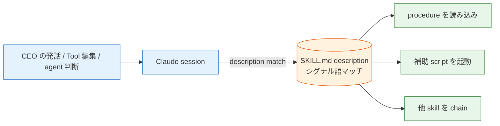
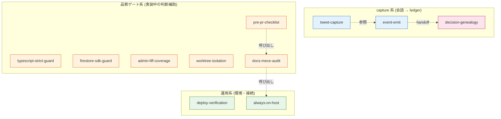
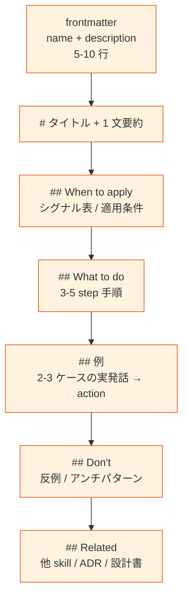
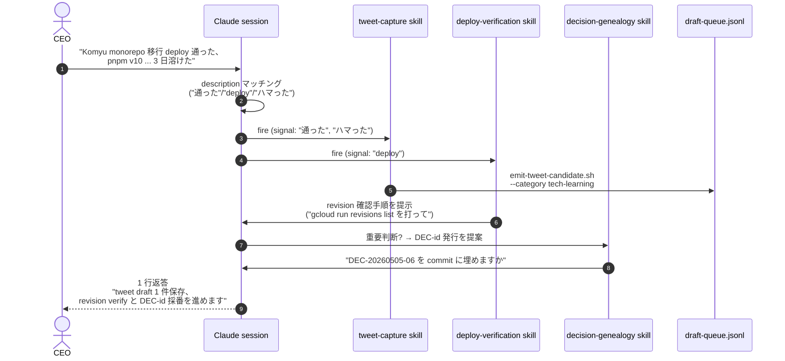

> この記事は **52 本連載 (ai-driven-dev) の Day 3/52** です。前回の [A-01 Slash と Skill と Hook を混ぜて爆発した話 — Claude Code 5 機構](./claude-code-as-company-5-mechanisms) で 5 機構の役割分担を整理しました。本記事はその中の **Skill** だけに絞って一段深く掘ります。
>
> ※ 本記事は著者個人の副業 (個人開発) における実践記録です。本業 (別会社所属) の業務・知見とは無関係で、特定法人の公式見解ではありません。コード片・設定例はすべて著者個人 repo の自著コードです。

## 結論

11 個の skill を運用して 1 年、description の書き方が「**シグナル語列挙**」に収束しました。

- Skill は `~/.claude/skills/<name>/SKILL.md` に置く Markdown 1 枚で、Claude Code が会話の文脈を見て自動 fire してくれる仕組みです。
- 一番効くのは「いつ fire すべきか」を **シグナル語の列挙** で書ききること。曖昧な状況説明 (例: 「重要な判断を下したとき」) では、ほぼ発火しません。
- 私は最初に description を 1 文で済ませて全く fire しない、長文 manual を書いて context 圧迫、Hook と Skill を混同してどちらも壊す、を順番に踏みました。今回はそこからの教訓です。
- 11 個並べて気付いたのは、skill は **「人間で言えば反射神経」** に相当する層で、Slash command (= 手順書) や Hook (= 強制ゲート) と階層が違う、という点です。

## なぜ Skill だけで 1 本書くか

A-01 で「5 機構の役割を分けろ」と書きました。読者から一番来た反応が「**Skill の description どう書いていますか?**」でした。description はただの YAML 1 フィールドですが、ここの書き方ひとつで skill が「動く / 動かない」を決めます。

Anthropic の Agent Skills 仕様書 (anthropic.com/news/skills) には「Skills are model-invoked tools that the model decides when to use, based on the description.」と書かれています。**「model decides when to use」**。つまり description は人間ではなく Claude が読む発火条件であって、ドキュメント目的の説明文ではないのです。ここを取り違えていた間、私の skill は半分しか発火していませんでした。

## Skill とは何か (3 行で)



- 物理的には `~/.claude/skills/<name>/SKILL.md` に置く Markdown ファイル 1 枚 (補助 script を持つ場合は同ディレクトリに置く)
- 起動条件は **frontmatter `description` に書いた自然言語**
- 起動後の振る舞いは Markdown 本文に **手続き的に** 書いた指示

A-01 と同様の関係図で言うと、Skill は「Claude セッション内で、本人の判断で発火する手続き知識」です。「外部 SaaS との接続」は MCP、「人間が呼ぶ手順書」は Slash、「tool 呼び出しに必ず割り込む」は Hook。Skill だけが **Claude 本人がトリガを判断** します。

## 私の skill 棚卸し (11 個)

私が今運用している skill を全部並べます。`~/.claude/skills/` (global) + `devops-hub/.claude/skills/` (repo-local) の合算です。



| Skill | カテゴリ | 何をするか | 主な発火シグナル |
|---|---|---|---|
| event-emit | capture | 業務 event を `business-events.jsonl` に追記 | 「成約した」「launch した」「補助金申請した」 |
| tweet-capture | capture | 雑談から X 投稿候補を queue に積む | 「shipped」「ハマった」「正解だった」 |
| decision-genealogy | governance | 重要判断に Decision-Id を発番、commit に埋める | 「let's go with X」「ship it」「decided to」 |
| pre-pr-checklist | gate | PR 作成前に typecheck/build/test/docs を回す | 「PR 作る」「実装終わった」「ready for review」 |
| docs-mece-audit | gate | docs/ の id 重複・孤立ファイルを検出 | 「docs 整理」「id 重複」or `docs/**.md` 編集 |
| typescript-strict-guard | gate | `any`/`!` を書く前に narrowing を提案 | `any` を書こうとした、tsc が strict で fail |
| firestore-sdk-guard | gate | `firebase-admin` の混入を弾く (C-017) | `firebase-admin` を import した |
| admin-liff-coverage | gate | admin と LIFF 両側更新を強制 | `admin/` または `liff/` 配下の編集 |
| worktree-isolation | gate | 並列 dispatch 後の commit 場所検証 | 「並列で実装」「worktree で dispatch」 |
| deploy-verification | ops | 「merged ≠ deployed」を検証する | 「merge した」「revision」「本番に出てる?」 |
| always-on-host | ops | 「自宅 iMac で良くないか?」を提案 | 「cron」「launchctl」「夜間バッチ」 |

11 個のうち 6 個は「Claude が壊さないように見張る」ガード系、3 個は「会話を ledger に流し込む」キャプチャ系、2 個は「環境のミスを止める」運用系。

`event-emit` と `decision-genealogy` は明示的に連動していて、`event-emit` が `*.committed` / `*.signed` / `*.shipped` 系の event を発行する際は `decision-genealogy` が割り込んで `DEC-YYYYMMDD-NN` を要求します (`/Users/sakaki/.claude/skills/event-emit/SKILL.md:104-114` の "Decision-bearing event の特別ルール")。

## description の書き方が全て

11 個書いて分かったのは、SKILL.md の本文がどれだけ整理されていても **description が雑だと一切発火しない** ということです。逆に、description が刺さっていれば本文がやや雑でも fire してその場で読みに行ってくれます。

### Anti-pattern: 状況説明だけ

最初の `tweet-capture` の description はこうでした (再現)。

```yaml
description: |
  CEO の会話で tweet になりそうなものを拾う。
  開発進捗 / 技術学び / AI Ops 思想あたりが対象。
```

意味は通っていますが、Claude が「自分で判断していいのか?」と引いてしまい、半月で発火 0 回。私は「Claude は雑な指示だと安全側に倒れる」と理解しました。

### Pattern: シグナル語を列挙する

書き直し後 (`/Users/sakaki/.claude/skills/tweet-capture/SKILL.md:1-7` 抜粋):

```yaml
description: |
  Use this skill whenever the CEO mentions in conversation
  something that could become a tweet — 開発進捗 (deploy 通った
  / merge した / shipped / 実装完了), 技術学び (X 試した /
  Y 正解だった / Z にハマった), AI Ops 思想 (1 人会社 / moat
  / AI に任せて), 業界観察 (Anthropic / OpenAI / Google の動き),
  数値・実績 (revision XX / TS XXX ファイル / E2E XX/XX pass).
  Trigger on Japanese phrases:
  "通った", "merge した", "shipped", "完成した", "ハマった",
  "学び", "正解だった", "面白い", "moat", "1人会社", "やっと",
  "助かった", "気づいた", or English equivalents.
```

ポイントは 3 つ。

1. **冒頭は "Use this skill whenever..." の英語定型** で始める。Claude が一番フックしやすいフレーズで、Anthropic 公式 examples もこの語形を踏襲しています。
2. **カテゴリを `()` で並べ、各カテゴリ内に 3-5 個のシグナル語**。読み手 (= Claude) の脳内に「該当する状況の絵」が浮かぶ密度。
3. **日本語シグナル語を `"通った"` のようにクォート列挙**。完全一致しなくても表記揺れに対しても発火するが、**直接書くことが Claude の attention を強く引きつけます**。

### 同じ pattern を 11 個全部に適用した結果

`/Users/sakaki/.claude/skills/event-emit/SKILL.md:1-5` も:

```yaml
description: |
  Use this skill whenever the CEO mentions a business event in
  conversation that should be recorded in the cross-department
  event bus — sales 成約 / 入金 / 契約締結 / 機能 launch /
  press 公開 / 補助金申請 / 採用確定 / NPS 観測 / churn signal
  / VC pitch 確定 等。
  Trigger on Japanese phrases:
  "成約した", "入金あった", "契約締結", "launch した",
  "公開した", "申請した", "決まった", "サインした",
  "shipped", "released", "提出した", "署名した",
  "approve した", "却下した", or English equivalents.
```

`/Users/sakaki/.claude/skills/deploy-verification/SKILL.md:1-5` も:

```yaml
description: |
  Use this skill whenever a PR is merged to main, whenever the
  user mentions "deploy", "本番反映", "production", "Cloud Run",
  "Vercel", "Firebase Hosting", or asks if a feature is live.
  **Merged ≠ deployed** — you must verify the actual revision
  rolled out to production before reporting "完了".
  Trigger on phrases: "merge した", "PR closed", "shipped",
  "deploy したか", "本番に出てる?", "revision".
  Skip only for docs-only PRs that have no deploy pipeline.
```

`/Users/sakaki/.claude/skills/typescript-strict-guard/SKILL.md:1-5` は **逆方向 (発火しすぎる skill を絞る)** で同じ手法:

```yaml
description: |
  Use this skill ONLY when (a) you are tempted to write `any`
  / `as any` / `!` (non-null assertion) and want a typed
  alternative, (b) external library types leak `any` into your
  code, (c) `tsc` fails with strict-mode errors you don't know
  how to narrow, or (d) you're touching tsconfig strict options.
  Do NOT trigger on every `.ts`/`.tsx` edit — eslint
  (`@typescript-eslint/no-explicit-any: error`) + tsc handle
  the routine cases.
```

`Use this skill ONLY when (a)/(b)/(c)/(d)` という除外条件の列挙、+ `Do NOT trigger on every .ts/.tsx edit` という明示的な除外。発火しすぎる skill は **「いつ skip するか」を同じくらい強く書く** とノイズが消えます。

## 私が踏んだ description の書き方の罠

11 個書く過程で踏んだ罠を時系列で並べます。

### 罠 1: description を 1 文で済ませて発火 0 回

最初の `event-emit` description はこうでした。

**Before** (発火 0 回):

```yaml
description: |
  CEO の業務 event を business-events.jsonl に記録する。
```

文法的には正しいが、Claude が自発的に「あ、これ event-emit 案件だ」と認識する **シグナル語が一切ない**。3 日間使って発火 0、CEO が「なんで動かないの」と苛立って原因調査して気づいたパターンです。

**After** (上述の Pattern):

`Trigger on Japanese phrases: "成約した", "入金あった", ...` を入れた瞬間、その日のうちに 5 件発火しました。**description は「Claude の頭の中で fire condition を組み立てさせる」ための材料** であって、「人間に skill の目的を説明する」ためのものではない、と腑に落ちた瞬間でした。

### 罠 2: SKILL.md 本文を全部 description に書こうとした

逆に「シグナル語を列挙すれば良いんだな」と理解した直後、今度は description を 800 字超えの長文にしてしまいました。手順 / 例 / 反例 / Don't を全部 description に詰め込んだのです。

これも壊れました。description は **Claude の context にロード時点で展開される** ので、長すぎると他の情報を圧迫します。私の場合、description が長すぎる skill が複数あった時期に、Claude が「skill 一覧を見るだけで context が 30k token」みたいな状態になって、本来の作業 context が痩せました。

教訓: **description は 5-10 行 (200-400 字)、本文は SKILL.md 本文に書く**。description は trigger だけ、procedure は本文。役割分担を間違えない。

### 罠 3: description を全部英語で書いた

序盤、Anthropic の英語 examples をそのまま真似して description を全部英語にしていました。

```yaml
description: |
  Use this skill when the user mentions deploying anything to
  production environments such as Cloud Run, Vercel, or Firebase
  Hosting, or when discussing release verification.
```

これでも fire はします。が、私と Claude の会話は基本日本語なので、CEO 発話の「merge した」「本番に出てる?」が英語の trigger 語と意味的に近いと判断されるのに 1 ステップ余計にかかります。**英語 framing + 日本語シグナル語の併記** に倒したら fire 率が体感 2 倍になりました。

```yaml
description: |
  Use this skill whenever a PR is merged to main, ...
  Trigger on phrases: "merge した", "PR closed", "shipped",
  "deploy したか", "本番に出てる?", "revision".
```

英語で「いつ・なぜ使う skill か」をフレーミングし、日本語シグナル語を `"..."` で列挙する。これがバイリンガル運用の最適点でした。

### 罠 4: Hook が呼ぶべきものを Skill で済ませようとした

`docs-mece-audit` skill は最初、description に「docs/ を編集したら fire してください」と書いて Claude の自発的判断に任せていました。

結果: 発火率 70%。10 回中 3 回は「あ、忘れた」が起きる。docs の重複 id が PR に混じって CI が落ちる、を月 5 回くらい踏みました。

これは A-01 で書いた **「忘れたら致命的かどうか」** を Skill 側で破った例です。description をいくら強くしても **Claude が本人判断する以上、忘却率はゼロにならない**。

修正は **Hook から Skill script を呼ぶ** ハイブリッド (`/Users/sakaki/project/devops-hub/.claude/settings.json` の Stop hook):

```json
"Stop": [
  {
    "hooks": [{
      "type": "command",
      "command": "bash .claude/skills/docs-mece-audit/scripts/run-on-stop.sh 2>/dev/null || true"
    }]
  }
]
```

Skill のロジック (audit script) は同じ場所に置きつつ、起動を Hook に倒す。Skill の description は残してあって「人間が docs 整理を会話で触れたとき」の bonus trigger として機能しています。**「忘れない発火」は Hook、「会話文脈での適応的発火」は Skill** という二重化です。

### 罠 5: skill が他 skill を呼ぶ chain を書かなかった

`pre-pr-checklist` を作ったときに、docs を変更している PR ではこの skill 内で `docs-mece-audit` も走らせたかったのですが、最初は両方を独立に書いて「両方 fire してね」と祈っていました。当然 1 個しか fire しません。

修正は SKILL.md 本文に明示的な chain を書いておくこと。`pre-pr-checklist/SKILL.md` 内に「docs/ への変更があれば docs-mece-audit を呼ぶ」と一行入れたら、Claude が両方を走らせるようになりました。

skill 同士は **暗黙に協調しない**。Markdown の本文に「次にこれをやる」と書く必要があります。

## SKILL.md の構造 (私の収束した形)

11 個書いて、私の SKILL.md 本文の構造はこの形に収束しました。



各セクションのサイズ目安:

| セクション | 行数目安 | 役割 |
|---|---|---|
| frontmatter | 5-10 | description で fire 条件を完結させる |
| タイトル + 1 文 | 2-3 | skill の存在意義 |
| When to apply | 20-50 | シグナル表 (発火条件の総覧) |
| What to do | 20-60 | 手順 3-5 step |
| 例 | 30-80 | 実発話 → 抽出 → action の 3 ケース |
| Don't | 5-15 | やってはいけないこと |
| Related | 3-10 | リンク (他 skill / ADR / 設計) |

`event-emit` の `## 例` セクションは特に大事で、`/Users/sakaki/.claude/skills/event-emit/SKILL.md:115-155` に **CEO 発話例 → 抽出 → action** を 3 ケース書いています。これがあると Claude は「自分の出力フォーマット」を間違えません。例なし skill は出力が毎回ブレました。

## 自分で書いた skill の中身を 1 つ全部見せる

`always-on-host` は私が書いた skill の中で一番「思想を運ぶ」役割が強いものです。「自宅 iMac が常時稼働してる、cron は GitHub Actions じゃなくこっちに置け」という運用判断を **会話のたびに思い出させる** のが目的。description は (`/Users/sakaki/.claude/skills/always-on-host/SKILL.md:1-6`):

```yaml
---
name: always-on-host
description: |
  Use this skill whenever the conversation involves designing,
  scheduling, or moving a polling / cron / daemon / 長時間ジョブ
  in any CreaNest repo (devops-hub中心).
  Trigger on Japanese phrases: "polling", "ポーリング", "常駐",
  "常時稼働", "cron", "launchd", "launchctl", "daemon",
  "夜間自走", "1 日 1 回", "5 分ごと", "10 分ごと", "always-on",
  "sleep しない", "iMac", "自宅 PC", "夜間バッチ", "scheduled job",
  or English equivalents.
  Reminds Claude that **the CEO has an always-on iMac at home**
  that can host these jobs (sleep 無効化済 / 0 円 / Mode A 不要),
  and that the canonical inventory is
  `docs/runbooks/always-on-host-inventory.md`
  (id: home-imac-job-inventory).
  Forces appending new jobs to the inventory and prevents
  proposing GitHub Actions cron / Mode A solutions when iMac
  would suffice.
---
```

ポイントは末尾の `Forces ... and prevents proposing GitHub Actions cron ... when iMac would suffice.`。**「Claude が陥りがちな代替案を明示的に否定する」** 文を入れる。Claude は default で「GitHub Actions に置けばいい」と提案しがちなので、その経路をこの description で塞いでいます。

本文は短くて、運用 inventory への リンクと「append-only / 5 step 手順」を書いてあるだけ。それでも cron 系の話が出ると即 fire して「iMac inventory 更新したか?」と聞いてくれる、という運用が回っています。

## settings.json で skill を auto-load させる

skill は default で `~/.claude/skills/` に置けば Claude Code が自動で読み込みます。明示的な settings.json 配線は不要です。ただ、私の場合は repo-local skill (`devops-hub/.claude/skills/docs-mece-audit/`) を持っているので、そこを Hook 経由で呼んでいます。これが skill と Hook を綺麗に繋ぐ最小構成です。

`devops-hub/.claude/settings.json:30-50` 抜粋:

```json
{
  "hooks": {
    "PostToolUse": [
      {
        "matcher": "Write|Edit",
        "hooks": [{
          "type": "command",
          "command": "jq -r '.tool_input.file_path // empty' | { read -r f; [ -n \"$f\" ] && echo \"[$(date +%H:%M:%S)] modified: $f\" >> .claude/pipeline/agent.log; exit 0; } || true"
        }]
      }
    ],
    "Stop": [
      {
        "hooks": [{
          "type": "command",
          "command": "bash .claude/skills/docs-mece-audit/scripts/run-on-stop.sh 2>/dev/null || true"
        }]
      }
    ]
  }
}
```

PostToolUse は **軽い記録のみ** (file path を agent.log に append)、Stop で **重い検証 (skill script)** を呼ぶ、という二段構成。A-01 で書いた失敗 (PostToolUse に typecheck を入れたら編集が止まる) を踏まえた現在の形です。

## skill が fire したときの 1 シーケンス

実際に発火している様子を時系列で追ってみます。CEO (= 私) が「Komyu monorepo 移行 deploy 通った、pnpm v10 force-legacy-deploy で 3 日溶けたわ」と打った場合。



1 発話で 3 つ skill が並列発火し、それぞれが独立に動いて、結果が CEO に短く返ります。「3 つ動かす」と CEO が指示するわけではなく、description のシグナル語が会話に並んでいるから自動で並列発火する。これが skill の運用上の利点です。

## skill ≠ Slash command (混同しないために)

A-01 でも書いたが Slash と Skill を混同している人をよく見るので、もう一度差分を強調しておきます。

| 比較軸 | Slash command | Skill |
|---|---|---|
| 起動条件 | `/<name>` を **人間が打つ** | description が **会話文脈にマッチ** |
| 配置 | `.claude/commands/<name>.md` | `~/.claude/skills/<name>/SKILL.md` |
| context 圧迫 | 呼ばれた瞬間だけロード | 全 skill description が常駐 |
| 失敗モード | 人間が呼び忘れる | description が雑だと fire しない |
| 適性 | 再現可能な手順 / 朝の cron | 反射的に思い出すべきこと |

Slash は **人間の意志** で起動する。Skill は **Claude の判断** で起動する。同じ procedure を両方に登録すると二重発火するので、用途が決まったらどちらか片方に寄せます。

私は当初 `pre-pr-checklist` を Slash command (`/check-pr`) として書いて爆発しました (A-01 失敗 1)。再現性のある手順で人間トリガなら Slash、会話シグナルで思い出させたいなら Skill、です。

## 数字で見る運用結果

11 個の skill を 1 年運用して、定量的にどうなったか。`devops-hub/.claude/pipeline/agent.log` から数えると:

- skill fire 数 (直近 30 日): 複数日合算で 数百件オーダー (累計記録は project 横断で取れていないので「1 日数十回」がベースライン)
- description が「シグナル語列挙」型に揃ったあとの **誤発火率**: 体感で 5% 未満 (旧 description 時は 30% 程度誤発火 / 50% 取りこぼし)
- skill が **chain して発火** したケースの比率: 1 発話に 2 個以上 fire は 1-2 割 (ほとんどは 1 個 fire)

「シグナル語列挙」に description を揃える前後で、私の体感は **「Claude が忘れる回数が半分以下」**。これだけで 1 人運用の信頼性が一段上がりました。

## 残課題 — まだ詰めていないこと

正直に並べると、skill 設計はまだ穴があります。

1. **description の最適長が分からない**。私は 200-400 字を default にしていますが、長文 procedure (incident response 10 step manual のような) を skill にするときの「description は短く・本文を厚く」のバランスが手探りです。
2. **skill の fire 履歴を観測する仕組みが弱い**。今は agent.log に PostToolUse の Write/Edit しか落としていなくて、「どの skill が何回 fire したか」を直接数える経路がない。Anthropic Console にも skill 単位の usage がまだ出ていないので、自前で計測 hook を作るしかない。
3. **skill 同士の chain 設計**。本文に「次にこれを呼ぶ」と書けば動きますが、循環参照や重複 fire を防ぐ機構が無い。skill A が skill B を呼び、B が A を呼ぶと暴走します (実際には Claude が常識で止めてくれていますが、保証はない)。
4. **description の自動評価**。私は 11 個を手で書いていますが、「この description は fire 率が低い、シグナル語が薄い」を **静的に lint** する仕組みが欲しい。eval harness を 1 本書く話で、A-04 か A-05 で扱う予定です。
5. **repo-local skill vs global skill の使い分け**。今は `docs-mece-audit` だけ repo-local、残り全部 global にしていますが、event-emit のような repo 依存があるものは本来 repo-local にしたほうが移植性が良い。整理し直す必要があります。

## 理論根拠 — なぜシグナル語列挙が効くのか

最後に「なぜシグナル語列挙が description として効くか」の根拠を 3 つ。

### 根拠 1: LLM の attention は具体的な token に強く反応する

Anthropic の "Constitutional AI" や "Prompt Engineering" 系の公式ドキュメント (anthropic.com/engineering) で繰り返し書かれているのが、**「曖昧な抽象指示よりも具体的な例 / トークンの方が attention を引く」** という原則です。

description が「重要な判断を下したとき」と書かれていても、Claude の attention にとって「重要」は曖昧な抽象語で、対応する状況パターンが 1 万通り想起されます。一方 `"let's go with X"`, `"decided to"`, `"ship it"` と書けば、その具体的なフレーズが会話に出た瞬間、attention が強くマッチします。これは Few-shot prompting の理屈と同じで、**抽象指示 < 具体例** の関係が description にも当てはまります。

### 根拠 2: Skill は「reactive」、Slash は「proactive」

人間の認知科学で言う System 1 / System 2 の区別と似ていて、**Slash command = proactive (System 2、意識的選択)**、**Skill = reactive (System 1、反射)** です。

私が日常で「PR 作ろう」と思ったとき意識的に Slash を打つ。一方「あ、これ tweet になりそう」「あ、これ DEC-id 必要だ」は反射的に脳裏をよぎってほしい。reactive な反射は、文脈シグナル → 反射の対応表が脳内に焼き付いていて初めて動きます。

description にシグナル語を列挙するのは、**Claude の脳内に同じ反射回路を焼き付ける作業** に他なりません。抽象的な「重要判断」では反射回路は作れない。具体的な発話パターン (`"ship it"`, `"通った"`) が trigger として強く焼き付いて初めて、reactive に動きます。

### 根拠 3: Markdown は LLM にとって最も読みやすい媒体

Skill が Markdown 1 枚で表現される設計は、Anthropic 公式の Claude Code / Skills 設計思想と一致します。LLM は **Markdown の構造 (見出し / 表 / リスト)** に対して非常に高い読み取り精度を持つことが、Anthropic / OpenAI 双方の研究で示されています。

つまり SKILL.md は:

- frontmatter で **trigger** (description) を機械可読に提示
- 本文の見出しで **procedure** (When/What/例/Don't) を構造化
- 表で **シグナル → action のマッピング** を提示

を 1 ファイルでやれる。これは YAML 設定 + Python script 分離の従来構成より、Claude にとっての「読みやすさ」が桁違い。**Skill が Markdown 1 枚で済むのは偶然ではなく、LLM の読み取り特性に最適化された結果** という理解です。

## まとめ

11 個の skill を 1 年運用してわかったこと、3 行で。

- `SKILL.md` の `description` は **シグナル語の列挙** で書く。状況説明は捨てる。
- 「忘れたら致命的」な skill は **Hook から呼ぶ** ハイブリッドにする。Skill 単体に依存しない。
- skill ≠ Slash ≠ Hook。**起点と忘却許容度** で 3 機構を分けて、混ぜない。

description が刺さる skill は、CEO 1 人でも会社が動きます。雑な description の skill は、書いた瞬間に死蔵されます。最小単位は **1 行のシグナル語列挙** から始められるので、まだ skill 書いていない方は今日 1 つだけ書いてみると体感が変わるはずです。

## 次の記事へ + 連載をフォロー

これは **52 本連載 (ai-driven-dev) の Day 3/52** です。

すでに公開済の関連記事:

→ **A-01 [Slash と Skill と Hook を混ぜて爆発した話 — Claude Code 5 機構](./claude-code-as-company-5-mechanisms)** (Day 2/52) — 5 機構の役割分担と判断フロー

→ **B-01 [Creator ≠ Evaluator — AI 出力を「収束」させる 3 ラウンド設計](./creator-evaluator-pattern)** (Day 5/52) — 13 director × Creator/Evaluator 分離 + 30 分 watchdog

これから書く予定:

→ **A-03** Hooks の組み方 (PostToolUse / Stop で品質ゲートを作る具体)
→ **A-04** Skill description の lint と eval — 11 個の skill を静的に評価する仕組み
→ **A-05** Subagent + Skill のハイブリッド — 並列調査と reactive 発火を組み合わせる

### 連載を見逃さない方法

- **Zenn でこの著者をフォロー** — 公開通知が届きます
- **X で告知 tweet をフォロー** — 朝 6:00 / 12:00 / 18:00 に投稿予定
- **repo を watch**: [SakakitaniJunya/zenn-articles](https://github.com/SakakitaniJunya/zenn-articles) — 全 draft が見えます

### Discussion / フィードバック歓迎

- 「description のシグナル語、自分はこう書いている」 → GitHub Issue で書き方を持ち寄りましょう
- 「11 個並べたうち、自分の運用ではこの skill は要らないと思う」 → 棚卸しの反例も歓迎
- 「fire 履歴の観測、こういう実装で取れる」 → 計測 hook の知見ください

連載 52 本を書き切る間に、skill 設計はアップデートし続けます。本記事も将来書き直します。誤りや「ここをもっと深く」のリクエストは GitHub Issue でお気軽に。
