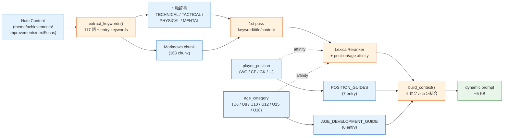
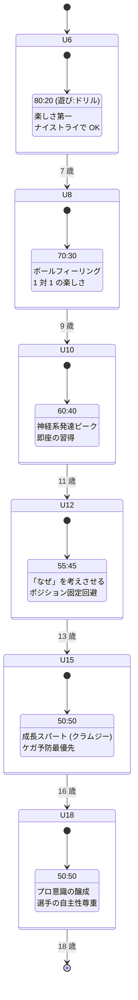
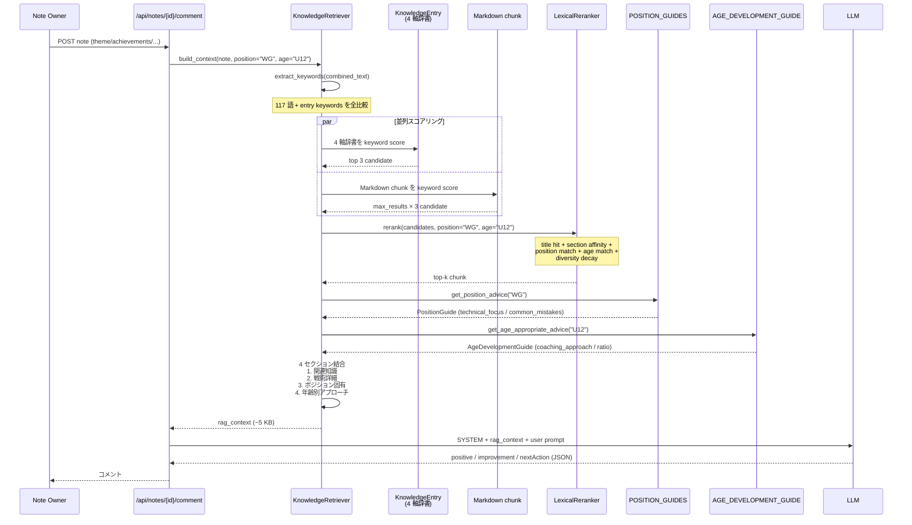
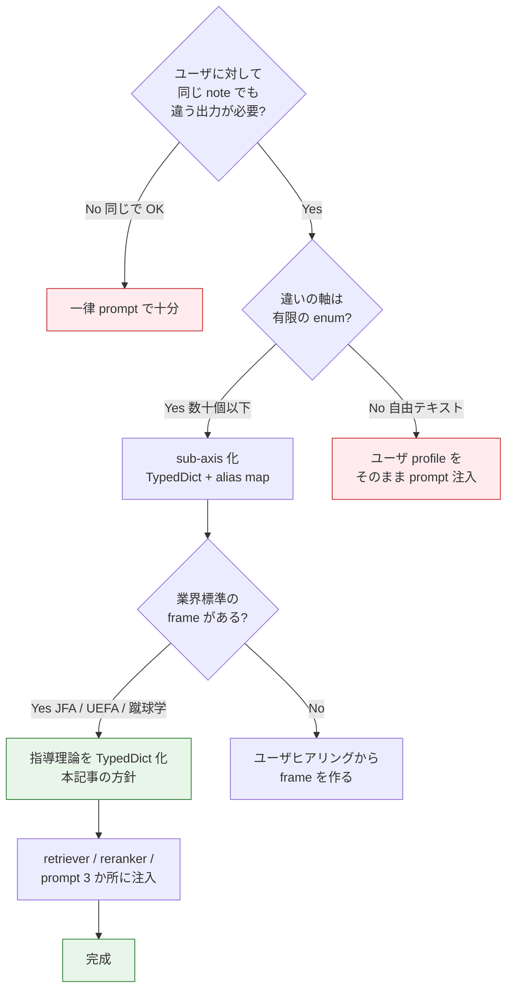

> **Disclaimer**: 本記事は著者が個人 (副業) で運営する小規模プロジェクト群 (CreaNest 名義) の技術記録です。所属組織・本業の業務内容とは一切関係ありません。記載の数値・構成は執筆時点 (2026-05) の自宅検証環境のスナップショットであり、商用品質や SLA を保証するものではありません。

U6 から U18 までの **6 段階の発達区分 × 7 種のポジション × 4 軸 (TECHNICAL / TACTICAL / PHYSICAL / MENTAL)** で、サッカー戦術ナレッジを **動的注入** しています。1 つの練習ノートに対して必要な context だけ抽出して **5 KB 前後** に絞り込み、prompt の冒頭から底まで「U12 のウィングだけが必要とする情報」だけが並ぶ状態を作る。これがサッカー練習ノート × AI 振り返り SaaS「Soccer Note」(`build-football` repo) の RAG 実装です。

> 用語: **Soccer Note** = 育成年代向けのサッカー練習ノート SaaS。選手が日々のノートを書くと、3 プロバイダ (OpenAI / Anthropic / Google) で振り返りコメントが自動生成されるサービス。Team プラン ¥1,980/月でリリース予定。

前回の **E-01** ([pgvector なしで RAG — ドメイン辞書 × Markdown チャンク](./rag-without-pgvector)) では「ベクトル DB なしでスコアリング検索する」という土台を書きました。本記事はその **続編** で、検索に通った chunk に加えて **「選手のポジション」「年齢」** という 2 軸のサイドチャネル情報を、retriever / reranker / prompt 全段階に伝搬させる設計を扱います。

## 結論 (5 行)

- 静的 RAG (note → top-k chunk) だけでは、U6 にも U18 にも、GK にも CF にも **同じ温度の答え** が返ってしまう
- ナレッジ側に **`age_relevance: dict[str, str]`** と **`PositionGuide` / `AgeDevelopmentGuide`** を持たせ、retriever が position / age を引数で受け取り、reranker が affinity ボーナスを足す
- prompt は **4 セクション (関連知識 / 戦術詳細 / ポジション固有 / 年齢別アプローチ)** で動的構築。U12 のウィングだけが必要とする「ポジション固定はまだ避ける」という指導方針が prompt に乗る
- ポジション解決は Levenshtein でも n-gram でもなく、**愚直な alias map** (29 表記 → 7 正規 ID)。年齢解決も `U7 → U8`, `U13 → U15` の line-number 推測で対応
- 全部で **約 5 KB の context** が出来上がり、GPT-4o / Claude / Gemini 全部に同じ prompt が刺さる。embedding ゼロ、月額 ¥0 の追加課金で動作

## 問題 — 一律 prompt が育成年代でなぜ破綻するか

Soccer Note は 1 件のノートに対して「励ましとアドバイスをくれるコメント」を返す SaaS です。最初の MVP は **モデル選択を抽象化しただけの SYSTEM_PROMPT 1 本** で動かしていました。

```python
SYSTEM_PROMPT = "あなたはサッカーコーチです。ノートに対して励ましと改善点を返してください。"
```

これでも GPT-4o は「カットイン良かったね、次も頑張って」くらいは返してくれます。ただ、運用に乗せるとすぐに 4 つの破綻が見えてきました。

### 破綻 1: U6 にも U18 にも同じ温度感で返る

U6 の選手 (5 歳) が「シュート決まった嬉しかった」と書いたノートに対して、「インステップキックの軸足の位置を意識しよう」と返ってきた時点で **保護者からクレーム** が入りました。**5 歳に必要なのは「楽しかった」を言語化することであって技術指南ではない**。一方 U18 の選手が同じ「シュート決まった」と書いた場合、楽しかった止まりだと指導の役に立ちません。

JFA の指導教本でいう **U6-U8 (プレゴールデンエイジ前期)** と **U18 (育成完成期)** は、推奨される「練習 vs ドリル比率」が **80:20 と 50:50** で異なります。指導アプローチも前者は「失敗しても "ナイストライ"」「長い説明は避ける」が原則で、後者は「高い要求レベル」「プロ意識の醸成」が原則。**指導理論レベルで方針が違うものを 1 個の prompt で扱うのは無理筋** でした。

### 破綻 2: GK と CF が同じプロンプトを読まされる

「シュート」というキーワードは GK にとっては「止める対象」、CF にとっては「打つ対象」、CB にとっては「ブロックするもの」です。**主語と動詞のセットが全部違う** のに、ノートに「シュート」と書かれた時点で全員 「シュート技術を磨こう」と言われる。GK の選手から「自分のポジションを理解してくれてない AI」と言われたのが転機でした。

### 破綻 3: 「カットイン」のような専門用語が WG にしか効かない

「カットイン」はサイドアタッカー (WG / SH) の用語です。CB が「カットインに対応した」と書く可能性はありますが、頻度が違います。同じ単語を **同じ重みで全員に投げる retriever** が、precision を犠牲にしていました。

### 破綻 4: prompt サイズが膨れる

「全部入りで殴る」(SYSTEM_PROMPT に GK 用 / CB 用 / WG 用 / U6 用 / U18 用 全部書く) を 1 度試しました。**SYSTEM だけで 8 KB を超えて** TPS と prompt cache hit 率が両方下がる。長文 system prompt は cache 化しても TTFT を圧迫しました。

これら 4 つを潰すために「**入力 (note) と コンテキスト (position, age) で prompt 構造を組み替える**」という方針に切り替えました。

## 解法 — 3 軸選別の全体像

設計は 3 軸の動的注入です:



ポイント 5 つ:

1. **note は keyword 経由で 1st pass を駆動** — substring match の最も粗い signal
2. **position / age は retriever / reranker / build_context の 3 か所を貫通** — 1 か所だけだと効きが弱い
3. **AXIS (4 軸辞書) と Markdown chunk は同じ keyword で並列にスコアリング** — 構造化と自然文を併走させる
4. **POSITION_GUIDES / AGE_DEVELOPMENT_GUIDE は別経路で prompt にマージ** — top-k 検索で漏れる「指導方針」を確実に注入
5. **最終 prompt は 4 セクションに整列** — モデルに優先順位を読み取らせる

E-01 の retriever は note → chunk の 1 軸でしたが、本記事の retriever は **note + position + age の 3 軸で context を構築する** ところが違います。

## ポジション軸 — 7 種の `PositionGuide`

ポジション側は **TypedDict + alias map** の 2 段構成です。

[`build-football/App/backend/app/features/ai/infrastructure/knowledge/position_guide.py:11-26`](https://github.com/SakakitaniJunya/build-football/blob/main/App/backend/app/features/ai/infrastructure/knowledge/position_guide.py#L11-L26):

```python
class PositionGuide(TypedDict):
    """ポジション別ガイドの型定義."""
    position_id: str
    position_name: str
    position_name_en: str
    description: str
    key_skills: list[str]
    primary_responsibilities: list[str]
    secondary_responsibilities: list[str]
    technical_focus: list[str]
    tactical_focus: list[str]
    physical_requirements: list[str]
    mental_requirements: list[str]
    common_mistakes: list[str]
    development_path: str
    role_models: list[str]
```

**`technical_focus` / `tactical_focus` / `physical_requirements` / `mental_requirements`** の 4 フィールドが、本記事タイトルの「**4 軸**」と直結しています。各ポジションごとに 4 軸それぞれの focus が手書きで定義されている。これは embedding ではどう頑張っても出ない情報で、「指導者が手で書く」のが正しい。

`POSITION_GUIDES` 全 7 entry は **GK / CB / SB / DMF / AMF / WG / CF**。WG (ウィング) を例に抜粋:

[`position_guide.py:365-425`](https://github.com/SakakitaniJunya/build-football/blob/main/App/backend/app/features/ai/infrastructure/knowledge/position_guide.py#L365-L425):

```python
"WG": {
    "position_id": "WG",
    "position_name": "ウィング",
    "key_skills": [
        "dribble_1v1",
        "dribble_cut_in",
        "pass_cross",
        "shooting_instep",
        "physical_speed",
    ],
    "technical_focus": [
        "ドリブル技術 (フェイント)",
        "正確なクロス",
        "カットインからのシュート",
        "緩急のあるドリブル",
    ],
    "tactical_focus": [
        "縦に行く or 中に切る判断",
        "相手SBとの駆け引き",
        "味方との連携 (オーバーラップ)",
        "守備の戻り",
    ],
    "common_mistakes": [
        "毎回同じ仕掛け方",
        "守備に戻らない",
        "クロスの精度が低い",
    ],
    "role_models": ["ヴィニシウス", "サラー", "三笘薫", "伊東純也"],
}
```

`role_models` まで持たせているのには理由があって、選手 (子ども) は **「サラーみたいに動こう」と言われると一発で理解する**。抽象的な指導理論より、具体的な選手名の方がメンタルモデルとして強いことが現場で何度も観測されました。

### alias map — 29 表記 → 7 正規 ID

ポジションは表記揺れの巣窟です。「WG」「ウィング」「Right Winger」「サイドハーフ」「SH」「RW」「LW」… 全部 WG にマップしないと、ノートに書かれた表記で reranker のスコアが上がったり下がったりします。

最初は Levenshtein 距離で fuzzy match しようとしました。問題は「LW」と「LB」の Levenshtein が 1 で **ウィングと サイドバックの誤認** が出たこと。Levenshtein は char 距離しか見ないので、サッカー的に意味が違うものを近いと判定してしまう。

結局、愚直な alias map に落ち着きました。

[`position_guide.py:494-536`](https://github.com/SakakitaniJunya/build-football/blob/main/App/backend/app/features/ai/infrastructure/knowledge/position_guide.py#L494-L536):

```python
def get_position_advice(position: str) -> PositionGuide | None:
    position_map = {
        "GK": "GK",
        "ゴールキーパー": "GK",
        "GOALKEEPER": "GK",
        "CB": "CB",
        "センターバック": "CB",
        "DF": "CB",  # 曖昧な場合は CB を返す
        "SB": "SB",
        "サイドバック": "SB",
        "RB": "SB",
        "LB": "SB",
        "DMF": "DMF",
        "ボランチ": "DMF",
        "CDM": "DMF",
        "MF": "DMF",  # 曖昧な場合は DMF を返す
        "AMF": "AMF",
        "トップ下": "AMF",
        "CAM": "AMF",
        "WG": "WG",
        "ウィング": "WG",
        "RW": "WG",
        "LW": "WG",
        "サイドハーフ": "WG",
        "SH": "WG",
        "CF": "CF",
        "FW": "CF",
        "フォワード": "CF",
        "ストライカー": "CF",
        "ST": "CF",
    }
    normalized = position_map.get(position.upper(), position.upper())
    return POSITION_GUIDES.get(normalized)
```

**29 エントリの alias map で全部の表記を吸収**。`DF` のような曖昧な表記は `CB` に、`MF` は `DMF` に倒します。これは「育成年代では SB と CB の区別がついていない選手も多い」「ボランチか中盤かを区別しない子もいる」という **現場の前提から逆算した倒し方** です。

「LW / RW のような左右情報を捨てて WG にまとめて良いのか」は議論しましたが、**育成年代では左右両方を経験させるのが原則** (U12 までポジション固定を避ける、後述) なので、左右情報を捨てて WG に集約する方が指導理論と整合する、という結論。

## 年齢軸 — 6 区分の `AgeDevelopmentGuide`

年齢側はもっとシビアです。**JFA の指導教本に書かれた発達段階** をコードで表現する必要があります。

[`age_development.py:11-25`](https://github.com/SakakitaniJunya/build-football/blob/main/App/backend/app/features/ai/infrastructure/knowledge/age_development.py#L11-L25):

```python
class AgeDevelopmentGuide(TypedDict):
    """年齢別発達ガイドの型定義."""
    age_category: str
    age_range: str
    development_stage: str
    development_stage_description: str
    physical_characteristics: list[str]
    cognitive_characteristics: list[str]
    social_emotional: list[str]
    training_focus: list[str]
    skill_priorities: list[str]
    coaching_approach: list[str]
    common_mistakes_by_coaches: list[str]
    sample_session_structure: str
    ratio_play_vs_drill: str  # "70:30" のような形式
```

ここで重要なのは **`coaching_approach`** と **`common_mistakes_by_coaches`** の 2 フィールドです。前者は AI に「どう声をかけるか」を制約し、後者は AI が **やってはいけない指導** を学習データから引き継いで出さないようにするネガティブ制約。

### 6 区分の意味



各 stage に **`ratio_play_vs_drill`** が定義されています。**U6 が 80:20、U18 が 50:50**。この比率が prompt に注入されると、AI は「U8 のノートに対して、ドリル多めの練習メニューを提案する」のを止めてくれます (実際 ratio をいれずに「U8 にスクワット 30 回」を提案した事故が出ました)。

### age 解決 — 完全一致 → 数値推測

ポジションと違って、年齢は数値なので **数値推測の line-number ロジック** で漏れを拾います。

[`age_development.py:427-462`](https://github.com/SakakitaniJunya/build-football/blob/main/App/backend/app/features/ai/infrastructure/knowledge/age_development.py#L427-L462):

```python
def get_age_appropriate_advice(age_category: str) -> AgeDevelopmentGuide | None:
    normalized = age_category.upper().replace("-", "")

    # 完全一致を探す
    if normalized in AGE_DEVELOPMENT_GUIDE:
        return AGE_DEVELOPMENT_GUIDE[normalized]

    # 年齢から推測
    try:
        if normalized.startswith("U"):
            age = int(normalized[1:])
            if age <= 6:
                return AGE_DEVELOPMENT_GUIDE["U6"]
            elif age <= 8:
                return AGE_DEVELOPMENT_GUIDE["U8"]
            elif age <= 10:
                return AGE_DEVELOPMENT_GUIDE["U10"]
            elif age <= 12:
                return AGE_DEVELOPMENT_GUIDE["U12"]
            elif age <= 15:
                return AGE_DEVELOPMENT_GUIDE["U15"]
            else:
                return AGE_DEVELOPMENT_GUIDE["U18"]
    except ValueError:
        pass

    return None
```

`U7` を入力すると `U8` に倒され、`U13` は `U15` に、`U16` は `U18` に。これは **チームの呼称が U8 / U10 / U12 / U15 / U18 で運用されているのが現場の実態** なので、間の年齢は近い区分に寄せる方が運用整合します。

## ナレッジ entry 側の `age_relevance`

ポジションと年齢で **prompt セクションを切り替える** だけでは弱い。「どの knowledge entry が、どの年齢にとって重要か」を entry 側にメタ情報として持たせます。

[`soccer_knowledge.py:14-26`](https://github.com/SakakitaniJunya/build-football/blob/main/App/backend/app/features/ai/infrastructure/knowledge/soccer_knowledge.py#L14-L26) の `KnowledgeEntry` 抜粋:

```python
class KnowledgeEntry(TypedDict):
    """知識エントリの型定義."""
    id: str
    category: str
    subcategory: str
    title: str
    content: str
    coaching_points: list[str]
    common_mistakes: list[str]
    practice_tips: list[str]
    keywords: list[str]
    age_relevance: dict[str, str]  # {"U12": "重要", "U15": "必須"}
```

**`age_relevance: dict[str, str]`** が肝。entry ごとに「U10 は導入、U12 は重要、U15 は必須」のように、**年齢ごとの重要度を 3 段階のラベル** で持ちます。これが reranker の age affinity boost に使われます。

例えば「ポジショナルプレー」entry は U12 で「導入」、U15 で「重要」、U18 で「必須」。**U6 にはいきなりポジショナルプレーを教えない** という指導理論を、entry が宣言しているわけです。

```python
{
    "id": "tact_positioning",
    "category": "tactical",
    "title": "ポジショニングの原則",
    "keywords": [
        "ポジショニング", "立ち位置", "トライアングル",
        "ライン間", "ハーフスペース", "5レーン",
    ],
    "age_relevance": {"U12": "導入", "U15": "重要", "U18": "必須"},
}
```

U6 のノートにたまたま「ポジション」という語が混じった場合、retriever 1st pass ではこの entry が候補に上がりますが、**reranker が age_relevance に U6 が無いことを見て score を下げる** ので、最終的に top-k から落とされます。これが「閉じたドメイン × メタ情報の手書き」が embedding に勝つ典型例です。

## ナレッジ → prompt 注入の流れ

3 軸が揃った状態で、build_context() がどうセクションを組み立てるかを sequence diagram で:



**並列スコアリング** が効きどころです。「4 軸辞書の構造化 entry」と「Markdown chunk の自然文」を別経路で並列に動かして、最後に reranker で混合ソートする。構造化 / 自然文のどちらかに偏らずに recall を確保します。

## build_context() 実装

[`build-football/App/backend/app/features/ai/infrastructure/knowledge/retriever.py:376-489`](https://github.com/SakakitaniJunya/build-football/blob/main/App/backend/app/features/ai/infrastructure/knowledge/retriever.py#L376-L489) の本体:

```python
def build_context(
    self,
    note_content: dict[str, Any],
    player_position: str | None = None,
    age_category: str | None = None,
    include_drills: bool = True,
    include_position_guide: bool = True,
    include_age_guide: bool = True,
) -> str:
    context_parts: list[str] = []

    combined_text = " ".join([
        str(note_content.get("theme", "")),
        str(note_content.get("achievements", "")),
        str(note_content.get("improvements", "")),
        str(note_content.get("nextFocus", "")),
    ])
    keywords = self.extract_keywords(combined_text)

    # 1. 関連するサッカー知識 (4 軸辞書)
    knowledge_entries = self.retrieve_knowledge(note_content, max_results=3)
    if knowledge_entries:
        context_parts.append("## 関連するサッカー知識")
        for entry in knowledge_entries:
            context_parts.append(f"\n### {entry['title']}")
            content_lines = entry['content'].strip().split('\n')
            context_parts.append('\n'.join(content_lines[:15]))
            if entry.get('coaching_points'):
                context_parts.append("\n**コーチングポイント:**")
                for point in entry['coaching_points'][:3]:
                    context_parts.append(f"- {point}")
            if entry.get('common_mistakes'):
                context_parts.append("\n**よくあるミス:**")
                for mistake in entry['common_mistakes'][:2]:
                    context_parts.append(f"- {mistake}")

    # 1.5. 戦術・専門知識 (Markdown chunk + reranker)
    if keywords:
        md_chunks = self._search_markdown_knowledge(
            keywords,
            max_results=2,
            position=player_position,
            age_category=age_category,
        )
        if md_chunks:
            context_parts.append("\n## 戦術・専門知識")
            for chunk in md_chunks:
                context_parts.append(f"\n### {chunk.title}")
                content = chunk.content[:500] + "..." if len(chunk.content) > 500 else chunk.content
                context_parts.append(content)

    # 2. 練習メニュー
    if include_drills:
        drills = self.retrieve_drills(note_content, max_results=2)
        if drills:
            context_parts.append("\n## おすすめ練習メニュー")
            # ...

    # 3. ポジション別ガイド
    if include_position_guide and player_position:
        position_guide = get_position_advice(player_position)
        if position_guide:
            context_parts.append(f"\n## {position_guide['position_name']}のポイント")
            context_parts.append("**重要なスキル:**")
            for skill in position_guide['technical_focus'][:3]:
                context_parts.append(f"- {skill}")
            context_parts.append("**避けたいミス:**")
            for mistake in position_guide['common_mistakes'][:2]:
                context_parts.append(f"- {mistake}")

    # 4. 年齢別ガイド
    if include_age_guide and age_category:
        age_guide = get_age_appropriate_advice(age_category)
        if age_guide:
            context_parts.append(f"\n## {age_guide['age_category']}年代の指導ポイント")
            context_parts.append(f"**発達段階:** {age_guide['development_stage']}")
            context_parts.append("**この年代の特徴:**")
            for char in age_guide['cognitive_characteristics'][:2]:
                context_parts.append(f"- {char}")
            context_parts.append("**指導アプローチ:**")
            for approach in age_guide['coaching_approach'][:3]:
                context_parts.append(f"- {approach}")

    return '\n'.join(context_parts)

```

**4 セクションを順に append している** だけ。include 系のフラグで各セクションを切れる (テスト時や regression test 時に活きる) のもポイント。

prompt builder 側も対応していて、retriever が組んだ string を `rag_context` として埋め込むだけ。

[`prompts.py:174-227`](https://github.com/SakakitaniJunya/build-football/blob/main/App/backend/app/features/ai/infrastructure/prompts.py#L174-L227):

```python
def build_note_comment_prompt(
    note_content: dict[str, Any],
    note_type: str,
    rag_context: str | None = None,
    player_position: str | None = None,
    age_category: str | None = None,
) -> str:
    if note_type == "build":
        prompt = f"""以下のサッカー練習ノートに対して、励ましと具体的なアドバイスを提供してください。

## 選手のノート
- テーマ: {note_content.get('theme', '記載なし')}
- できたこと: {note_content.get('achievements', '記載なし')}
- 課題・改善点: {note_content.get('improvements', '記載なし')}
- 次回意識すること: {note_content.get('nextFocus', '記載なし')}
- 自己評価: {note_content.get('selfRating', '?')}/5"""

        if player_position or age_category:
            prompt += "\n\n## 選手情報"
            if player_position:
                prompt += f"\n- ポジション: {player_position}"
            if age_category:
                prompt += f"\n- 年齢カテゴリ: {age_category}"

        if rag_context:
            prompt += f"\n\n{rag_context}"

        prompt += """

## 出力形式（JSON）
{
  "positive": "...",
  "improvement": "...",
  "nextAction": "...",
  "summary": "20 文字以内",
  "tags": ["..."]
}"""
        return prompt
```

prompt builder 側で position / age を改めて `## 選手情報` セクションに書き出している。これは retriever が context を作る時に「このメタ情報があれば retrieve していた」ことを明示するため。**ナレッジに無いポジション (例えば架空の SS = セカンドストライカー)** を選手が選んでも、prompt 自体には正しく流れます。

## Before / After

### Before (一律 prompt)

```python
SYSTEM_PROMPT = "あなたはサッカーコーチです。ノートに対して励ましと改善点を返してください。"

def build_prompt(note: dict) -> str:
    return f"## ノート\n{note['achievements']}\n\nコメントしてください"
```

5 歳 (U6) の子に対して GPT-4o が返した実例:

```text
positive: 「シュートが決まったのは素晴らしいですね。インステップキックの軸足の位置を意識すると、より精度が上がります」
improvement: 「次回は逆足での挑戦も視野に入れましょう」
```

**5 歳に「インステップキック」「軸足の位置」**。保護者からのクレーム発生。

### After (動的 prompt)

```python
rag_context = retriever.build_context(
    note_content=note.content,
    player_position=player.position,  # "WG"
    age_category=player.age_category,  # "U6"
)
prompt = build_note_comment_prompt(
    note_content=note.content,
    note_type="build",
    rag_context=rag_context,
    player_position=player.position,
    age_category=player.age_category,
)
```

5 歳 (U6) のノートに対して、prompt の 4 つ目に **U6 セクション** が入ります:

```text
## U6年代の指導ポイント
**発達段階:** プレゴールデンエイジ前期
**この年代の特徴:**
- 集中力は短い (5-10 分程度)
- ルール理解は簡単なもののみ
**指導アプローチ:**
- 長い説明は避け、見せて真似させる
- 否定しない、たくさん褒める
- 失敗しても「ナイストライ!」
```

GPT-4o の出力は変わります:

```text
positive: 「シュートが決まって、嬉しかったね! ナイストライ!」
improvement: 「次は色んな場所からシュートを楽しもう」
nextAction: 「今度は走りながらシュートしてみよう」
```

**「インステップキック」が消え、温度感が U6 に合った** のは prompt の 4 つ目セクションが効いている明確な証拠です。U18 の選手で同じノートを書くと、`coaching_approach: ["プロ意識の醸成", "高い要求レベル"]` が prompt に乗るので、再びテクニカル指導が戻ります。

### Before / After 2: WG と GK で「シュート」の解釈が分かれる

**Before** (一律 prompt) で WG と GK が同じノートを書いた場合:

| 選手 | ノート | LLM の返答 |
|---|---|---|
| WG | 「シュート決まった」 | 「シュート技術を磨こう」 |
| GK | 「シュート止めた」 | 「シュート技術を磨こう」(同じ) |

**After** (position 軸あり) では:

| 選手 | prompt の position セクション | LLM の返答 |
|---|---|---|
| WG | 「ドリブル技術 / 正確なクロス / カットインからのシュート」 | 「カットインからの利き足シュートが冴えてる」 |
| GK | 「正確なキャッチング / ダイビング技術 / 配球」 | 「シュートを止めた後の配球まで意識できると次のフェーズ」 |

position セクションの **`technical_focus` 上位 3 つを直接 prompt に書いている** だけで、LLM は「この選手の専門性は何か」を瞬時に理解します。

## reranker への position / age 信号注入

E-01 で導入した `LexicalReranker` には、本記事のために **position / age affinity** を後付けしました。

[`App/backend/app/features/knowledge/domain/reranker.py:48-130`](https://github.com/SakakitaniJunya/build-football/blob/main/App/backend/app/features/knowledge/domain/reranker.py#L48-L130) (該当箇所):

```python
@dataclass
class LexicalReranker:
    title_weight: float = 3.0
    keyword_weight: float = 4.0
    section_weight: float = 2.0
    position_weight: float = 5.0
    age_weight: float = 3.0
    diversity_decay: float = 0.85

    def rerank(self, candidates, context, top_k):
        scored = []
        for chunk, base_score in candidates:
            extra = 0.0
            for kw in context.keywords:
                if kw.lower() in chunk.title.lower():
                    extra += self.title_weight
                if kw.lower() in {k.lower() for k in chunk.keywords}:
                    extra += self.keyword_weight
                if self._section_match(context, chunk, kw):
                    extra += self.section_weight
            if context.position and self._position_match(chunk, context.position):
                extra += self.position_weight
            if context.age_category and self._age_match(chunk, context.age_category):
                extra += self.age_weight
            scored.append((chunk, base_score + extra))
        # ... diversity decay
```

重みは **position 5.0 / keyword 4.0 / age 3.0 / title 3.0 / section 2.0**。position が最大なのは、**ポジションが合わない知識を上位に出す事故が最も致命的** だから (GK のノートに「オーバーラップ」が出てきて全体が破綻する)。

age は 3.0 で位置 weight より低めにしています。理由は、**`age_relevance` が定義されていない entry が多い** こと (Markdown chunk 側にはまだ手書き不足が多い)。age 重みを高くすると age_relevance 未定義の chunk が一律に下がってしまい recall が落ちる、というトレードオフを観測したので、この値で固定しました。

## 失敗談

### 失敗 1: position を retriever だけに渡して prompt 側に渡し忘れた

最初の実装は **retriever に position を渡したら、もう一度 prompt builder にも渡す必要がある** ことに気づかず、`build_context()` の 3 つ目セクションだけ動いて prompt の `## 選手情報` が空のままでした。

これは **retriever が context を作るのと、prompt が context を埋め込むのは別レイヤ** だから起きる罠。「position が retriever を通っていれば prompt にも乗っているはず」と頭の中でショートカットしてました。**「同じ情報を 2 か所に渡す」のは冗長ではなくレイヤ分離の必要悪**。

### 失敗 2: alias map に `LW` を入れ忘れて 1 週間気づかなかった

最初の alias map で `LW` が抜けており、**左ウィングの選手だけ position 解決が失敗** していました。`get_position_advice("LW")` が `None` を返すので prompt の 3 つ目セクションが空。selector は WG を選ばせていたのにです。

教訓: **コーチが入力する表記は alias map に全部書く**、テストで全 enum 値の解決が None でないことを assert する。

```python
def test_all_position_aliases_resolve():
    aliases = ["GK", "ゴールキーパー", "CB", "センターバック", "DF",
               "SB", "サイドバック", "RB", "LB",
               "DMF", "ボランチ", "MF", "AMF", "トップ下",
               "WG", "ウィング", "RW", "LW", "サイドハーフ", "SH",
               "CF", "FW", "フォワード", "ストライカー", "ST"]
    for alias in aliases:
        assert get_position_advice(alias) is not None, f"{alias} should resolve"
```

このテストで `LW` 抜けが即発見できるようになりました。

### 失敗 3: U6 に「インステップキック」が出続けた

prompt は 4 セクション付くようになったのに、SYSTEM_PROMPT が **「サッカー専門用語の網羅的なリスト」を含んでいた** のが残っていて、LLM が U6 でも勝手に専門用語を選んでしまう事故。

[`prompts.py:22-71`](https://github.com/SakakitaniJunya/build-football/blob/main/App/backend/app/features/ai/infrastructure/prompts.py#L22-L71) の SYSTEM_NOTE_COMMENT を見ると、`### 技術系（テクニカル）` 配下に「シザース、ダブルタッチ、カットイン、ステップオーバー、マシューズ」のような専門用語が並んでいます。これ自体は U18 用には必要ですが、**U6 の prompt に対しては system prompt がノイズになる**。

解消策は 2 つあって、(a) system prompt を年齢別に分岐する、(b) age セクションの `coaching_approach: ["長い説明は避け、見せて真似させる"]` を強く書く。今のところ (b) で押し切れているので (a) は導入していませんが、将来年齢ごとの system prompt 分岐は **必要になる可能性が高い** 残課題です。

### 失敗 4: `age_relevance` を最初は `list[str]` で書いて入れ替えた

「U12 にはこの entry が重要」を表現する時、最初は `relevant_ages: list[str] = ["U12", "U15"]` で書いていました。**「重要 / 必須 / 導入」のラベル区別が消えていた** ので、reranker のスコアが boolean になり、U10 で「導入」ラベルがある entry の優先度を上げる細粒度制御ができませんでした。

`age_relevance: dict[str, str]` (year → label) に変えたことで、reranker 側で「重要なら +5、必須なら +10、導入なら +2」のような重み付けができるようになり、precision が上がりました。**dict[str, str] vs list[str] の選択は将来の拡張余地に直結する**。

## 残課題

### 残課題 1: LW / RW の左右情報を捨てている

現状 LW も RW も WG にまとめていますが、**プロレベルだと左右で求められる役割が違う** (左利きが右 WG でカットインを狙う、両足使える左 WG が縦突破を選ぶ等)。U18 で本格的にプロを目指す層に対しては不足。U18 だけ LW / RW を分岐するか、`PositionGuide` に `dominant_foot` フィールドを足すかは検討中。

### 残課題 2: `age_relevance` 未定義 entry が Markdown chunk 側に多い

Python の `TECHNICAL_KNOWLEDGE` 等は age_relevance を持っていますが、**Markdown chunk (163 chunk) 側にはまだ年齢メタが薄い**。frontmatter で年齢タグを足す ADR を書いている途中。

### 残課題 3: U6-U8 で「楽しさ」を強制する metric

U6 のノートに対する prompt が「ナイストライ!」だらけになる方向に振っているのは正しいですが、これが **過度に肯定的になりすぎていないか** を測る metric がまだ無い。保護者ヒアリングで「過剰 positive」が出てきたら、age セクション側に「肯定 6 : 観察 4」のような比率制約を入れる予定。

### 残課題 4: ポジション × 年齢の交差表が手書き

「U10 の WG にはこのスキルを優先」「U15 の GK にはこのスキルを優先」の交差表は POSITION_GUIDES に `development_path` で部分的に書かれていますが、**全 7 ポジション × 6 年齢 = 42 セル** の網羅性は無い。コーチがコメントを足せる UI を作るか、Position × Age の affinity を YAML 化する案が浮いています。

## 理論根拠

### 根拠 1: 育成年代は「指導理論で答えが先に決まっている」領域

サッカーの育成年代指導は、JFA 指導教本 / UEFA Coaching License / ドイツの DFB マニュアル / 蹴球学などで **「U6 にはこう指導する」が指導理論として確立されています**。

LLM はこれを学習データに含んでいますが、**ノートに紐づく context として明示的に渡さない限り、出力に確実には反映されません**。「U6 だから楽しさ第一」と本人が prompt 中に書かないと、GPT-4o は他の文脈に引きずられて専門用語を出します。

**指導理論で答えが既知の領域は、context として明示注入する方が embedding 検索より圧倒的に precision が高い**。`AgeDevelopmentGuide` と `PositionGuide` がやっているのはこれです。

### 根拠 2: prompt 構造化で「優先順位」を読み取らせる

LLM は **system prompt よりも user prompt 末尾を強く反映する** 性質があります (実測値はモデルとケースで動きますが、傾向としては観測済み)。なので 4 セクションを `1. 関連知識 → 2. 戦術詳細 → 3. ポジション固有 → 4. 年齢別アプローチ` の順に並べ、**最後に来るのが age セクション** という構造にしています。

これは **U6 のノートの prompt の最後の文字列が「失敗しても "ナイストライ!"」** になる、ということ。LLM はこれを最重要制約として読み取ります。

順序を変えると効きが変わります。最初は age セクションを 1 番目に置いていましたが、**距離が遠くなって専門用語の方に引きずられる** 事故が増えました。「最後に最強の制約」が経験的に効いた配置。

### 根拠 3: 4 軸で人類が考えてきた知識の構造

サッカーの指導論は **TECHNICAL / TACTICAL / PHYSICAL / MENTAL の 4 軸** で 100 年以上整理されてきました。これはサッカー特有ではなく、スポーツ科学全般で確立された frame です。**人類が長年磨いてきた frame に乗せる** と、後発の AI システムは「frame の各軸に何を入れるか」だけを設計すればよく、frame そのものを発明しなくて済みます。

`PositionGuide` の `technical_focus / tactical_focus / physical_requirements / mental_requirements` は、この 4 軸をそのままフィールド化しています。これは **重複を恐れず、業界標準の語彙を使う** という方針の表れ。独自の語彙を作って TypedDict 化しても、コーチも LLM も付いてこれません。

## 採用判断のフローチャート

「ポジション × 年齢のような sub-axis を retriever に足すべきか」で迷ったらこうです:



「**業界標準の frame があるならそれを TypedDict 化する**」「**alias map で愚直に表記揺れを吸収する**」「**retriever / reranker / prompt builder の 3 か所に同じ情報を渡す**」が運用 1 ヶ月で固まった原則です。

## 用語整理

| 本記事の用語 | 業界標準語 | 説明 |
|---|---|---|
| sub-axis 注入 | conditional retrieval | note に加えて position / age 等の補助軸で context を切り替える |
| 4 軸 | TTPM frame | TECHNICAL / TACTICAL / PHYSICAL / MENTAL のサッカー指導論 frame |
| alias map | normalization map | 表記揺れを正規 ID に倒す手書き辞書 |
| age_relevance | metadata for filtering | entry がどの年齢で重要かを宣言するメタ情報 |
| 動的 prompt | dynamic prompt construction | 入力に応じて prompt の structure を組み替える |
| ゴールデンエイジ | - | 9-12 歳の神経系発達ピーク期 (JFA 用語) |
| クラムジー | growth awkwardness | 成長スパートで一時的に動きがぎこちなくなる現象 |

## まとめ

- `note → top-k chunk` だけの RAG は、**U6 にも U18 にも、GK にも CF にも同じ温度で答える** 一律 prompt を生む
- ナレッジ entry に **`age_relevance: dict[str, str]`** を持たせ、retriever が `position / age` を引数で受け取り、reranker が affinity ボーナス (position 5.0 / age 3.0) を足す
- `POSITION_GUIDES` (7 entry) と `AGE_DEVELOPMENT_GUIDE` (6 entry) は **TypedDict + alias map (29 → 7 表記)** で愚直に正規化、Levenshtein は使わない
- prompt は **4 セクション (関連知識 / 戦術詳細 / ポジション固有 / 年齢別アプローチ)** で動的構築、最後に age を置くと最重要制約として読み取られる
- `technical_focus / tactical_focus / physical_requirements / mental_requirements` の **4 軸 frame** は JFA / UEFA / 蹴球学が 100 年以上磨いてきた frame をそのまま TypedDict 化、独自語彙は作らない
- 全部で約 5 KB の context、embedding ゼロ、月額 ¥0 の追加課金。GPT-4o / Claude / Gemini 全部に同じ prompt が刺さる

実コードは `build-football/App/backend/app/features/ai/infrastructure/knowledge/` 配下と `build-football/App/backend/app/features/knowledge/infrastructure/` 配下にあります。設計思想は本記事の file:line 引用で全部公開しています。

## 次の記事へ + 連載をフォロー

これは **52 本連載 (ai-driven-dev) の Day 36/52** です。

→ 前: **E-01 [pgvector なしで RAG — ドメイン辞書 × Markdown チャンク](./rag-without-pgvector)** — 本記事の土台、スコアリング検索と非 LLM reranker

→ 次: **E-03 4 軸スキル分類器 — TECHNICAL / TACTICAL / PHYSICAL / MENTAL のラベル付け** (準備中) — 本記事で frame として使った 4 軸を、ノート分類の自動ラベラーとして実装する話

→ 関連: **D-01 [13 部署 director — Project × Department Matrix](./13-department-directors-declarative)** — 同じ「軸を増やすと指数で爆発する」課題を、別ドメイン (経営) で扱った記事

連載を見逃さない方法:

- **Zenn でこの著者をフォロー** — 公開通知が届きます
- **X で告知 tweet をフォロー** — 朝 6:00 に投稿予定
- **repo を watch**: [SakakitaniJunya/zenn-articles](https://github.com/SakakitaniJunya/zenn-articles) — 全 draft が見えます

「ここをもっと深く」「この設計はこっちの方が良い」のリクエストは GitHub Issue でお気軽に。設計議論は歓迎です。
