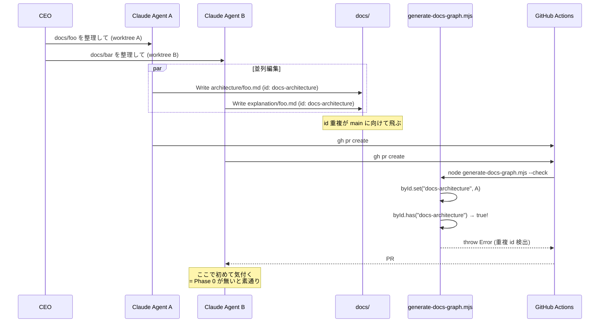
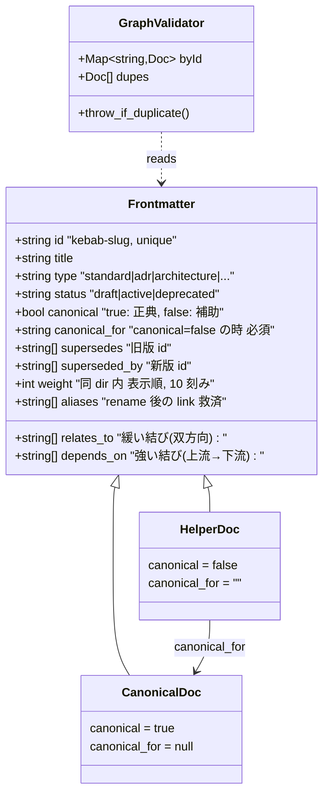
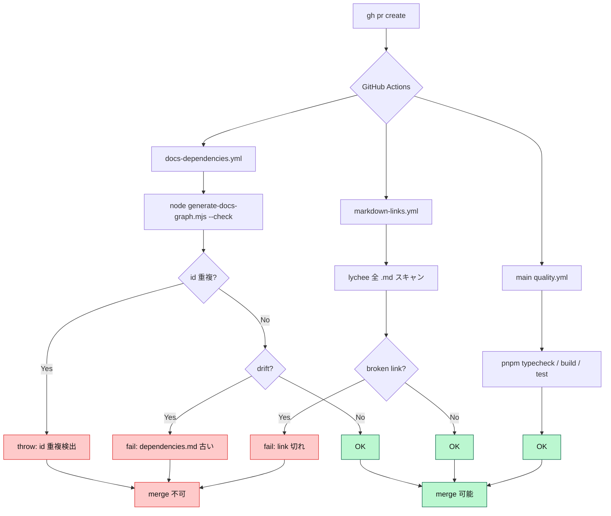

> **Disclaimer**: 本連載は著者が **個人 (副業)** で運営する小規模プロジェクト群 (CreaNest 名義) の技術記録です。所属組織・本業の業務内容とは一切関係ありません。記載の数値・構成は執筆時点 (2026-05) の自宅検証環境のスナップショットであり、商用品質や SLA を保証するものではありません。

## 結論

全 docs の frontmatter `id` を unique にし、新規 doc 作成前に `grep -r` + `canonical: true` 確認を AI に強制。重複した `id` は CI が `throw` で落とす。**132 docs / 31 サブディレクトリ / 8 プロジェクト** を 1 人で回しながら、main への重複流入を 2 ヶ月で **月 4 件 → 0 件** に押し込みました。

私は CreaNest という 1 人会社を AI Ops で運営しており、devops-hub という横断リポジトリで 8 プロジェクトの ADR・runbook・架構・PRD を束ねています。Claude Code が並列で `docs/` を編集する頻度は 1 日数十回。「**ちゃんと SSOT を守る**」と言ったが最後、3 ヶ月で `agent-coordination` という同概念のドキュメントが 4 ディレクトリに散在し、`canonical: true` が 2 個衝突し、frontmatter `id` が完全一致した md が 2 本同居する状態になりました。

本記事では、ADR-0011 (slug 命名規約) と ADR-0012 (dedup アーキテクチャ) を Phase 0 まで実装した現行の SSOT mandate — **`grep` 必須化 + `id` 一意性 + `canonical` flag + CI throw** — を共有します。連載 [H-04](./mece-audit-skill-stop-hook) で扱った Stop hook と相補関係にある「重複を生ませない側」の話です。

---

## 問題 — docs/ の重複は AI が並列編集するだけで生える

CreaNest の devops-hub は 9 種類の docs カテゴリ (architecture / adr / design / runbooks / business / strategy / harness / standards / explanation) を持ちます。Claude Code は 1 セッションで 5〜10 ファイルを平気で書き換え、しかも私は worktree isolation で **3〜4 並列の Claude Agent** を回します。

ここで起こるのが SSOT 違反の沈黙的増殖です。実例を 4 つ挙げます。

### 実例 1: 同概念 doc が 4 ディレクトリに分裂

`agent-coordination` という概念のドキュメントが、Claude セッションごとに別場所に書かれた結果こうなった:

```
docs/architecture/coordination/agent-coordination.md           ← canonical 候補 1
docs/explanation/agent-coordination-mechanism.md                ← canonical 候補 2
docs/harness/agent-coordination.md                              ← canonical 候補 3
.claude/business-pipeline/strategy/agent-coordination-notes.md  ← canonical 候補 4
```

4 つのうちどれが正典か、AI も人間も判断不能。CLAUDE.md は 4 つ全てをリンクしており、Claude が「architecture から読むべきか explanation から読むべきか」で毎回 5 秒迷う。**memory に重複が混入すると retrieval が壊れる**。

### 実例 2: `id` 完全一致の md が 2 本同居

並列 Claude Agent A と B が、別ディレクトリで同時に新規 doc を書き、両方とも frontmatter に `id: docs-architecture` と書いた。`generate-docs-graph.mjs` が `Map.set()` で上書きするので、グラフ生成結果は **片方しか node 化されない** (= 静かに片方が消える)。

### 実例 3: filename ≠ id slug 不整合

`id: l1-l2-l3` のはずなのに `explanation/architecture-l1-l2-l3-explanation.md` というファイル名で commit された。AI が「`docs/explanation/l1-l2-l3.md` を読んで」と言ったとき path 推論に失敗し、`ls docs/explanation/` から探し直すロスが毎回発生。

### 実例 4: 数値 prefix の濫用

ADR-0011 で「数値 prefix は `adr/` (NNNN-) と `postmortems/` (YYYY-MM-DD-) のみ許容」と決めた後でも、`docs/explanation/01-foo.md` `docs/guides/02-bar.md` のような prefix がぽろぽろ生え続けた。Claude が「カテゴリ内で順序付けたい」と思って善意で付けるが、ADR-0011 違反。



問題は **どの違反も commit 時には見えない** ことです。`pnpm typecheck` は md を見ない。私が朝 `git diff docs/` を眺めて気付くまで、AI Agent は同概念ドキュメントを 3 本 fork した後でした。

---

## 解法 — SSOT Mandate を 4 層で機械強制する

ADR-0012 §13.6 で定めた 4 層が現在 Phase 0 として動いています。

### 1. 全体像 — 規約 / 記憶 / 物理ガード / CI

3 つの「強制力の置き場所」を分けて配置するのがコアです。



物理配置:

| 強制力 | 置き場所 | 例 |
|---|---|---|
| **規約** (規範的) | `docs/standards/docs-structure.md` §6 §10 §13 | "id は kebab-slug、filename と一致" |
| **規約** (ADR) | `docs/adr/0011`, `docs/adr/0012` | 命名規約 / dedup アーキテクチャ |
| **記憶** (手続き的) | `CLAUDE.md` ルール #14 | "新規 doc 前に grep + canonical 確認" |
| **物理ガード** (機械的) | `docs-mece-audit` skill / Stop hook | turn 終了時に audit fire |
| **CI** (絶対) | `scripts/generate-docs-graph.mjs --check` | id 重複で `throw` |

「規約だけ」「memory だけ」では AI が忘れる。Skill / Hook / CI まで降りて初めて **絶対** になる。これは Defense in Depth (多層防御) のドキュメント版です。

### 2. frontmatter スキーマ — 全 docs に id を強制する

`docs/standards/docs-structure.md:289-306` に定義された frontmatter スキーマがこれです。新規 doc の最小例:

```yaml
---
id: docs-architecture                  # 必須: kebab-case slug, unique, filename と一致
title: Docs アーキテクチャ全体像        # 必須: 表示名
type: architecture                     # 必須: standard|adr|architecture|design|prd|runbook|guide|explanation|strategy|business
status: active                         # 必須: draft|active|deprecated|superseded
owners: [ceo]                          # 推奨: 責任者
adopted: 2026-04-25                    # 推奨: ISO 8601
canonical: true                        # 任意 (default true): 同概念の正典かどうか
relates_to: [docs-structure, adr-0012] # 任意: 緩い結び (双方向)
depends_on: [rfc-docs-structure-v0.2]  # 任意: 強い結び (上流)
supersedes: []                         # 任意: 旧版 id
superseded_by:                         # 任意: 新版 id (廃止された場合)
weight: 20                             # 任意: 同 dir 内表示順 (10 刻み, default 50)
aliases: []                            # 任意: 旧 path/id (rename 救済)
---
```

補助 doc (canonical = false) の場合:

```yaml
---
id: agent-coordination-mechanism-explanation
title: Agent 連携メカニズム — 解説
type: explanation
status: active
canonical: false
canonical_for: agent-coordination-mechanism   # ← 本家 id を指す (必須)
relates_to: [agent-coordination-mechanism]
---
```

設計のキモは 3 つ。

- **`id` は filename と一致** — `id: l1-l2-l3` なら必ず `explanation/l1-l2-l3.md`。AI が path を推論できる
- **`canonical: false` には `canonical_for` が必須** — 「正典が誰か」を補助 doc が自己申告する
- **`type` は 11 種類限定** — Diátaxis 4 分類 + ADR / PRD / Runbook / Strategy / Business / Standard で網羅

### 3. CLAUDE.md ルール #14 — AI への手続き的記憶

`CLAUDE.md` の最重要ルール 14 番目に、新規 doc 作成前のチェックリストを書きました。実物がこれです。

```markdown
14. **docs Write 前 SSOT mandate** — 新規 `docs/**/*.md` 作成前に必ず以下を実行:
    1. `grep -r "<topic>" docs/` で既存 canonical を確認、あれば**新規作成せず更新**
    2. frontmatter `id` (kebab-slug、unique) + `canonical: true|false`
       + `canonical_for: <id>` (canonical: false の時) を必ず付与
    3. filename = id slug で揃える (数値 prefix は `adr/` (NNNN-) と
       `postmortems/` (YYYY-MM-DD-) のみ許容、ADR-0011)
    4. commit 前に `node scripts/generate-docs-graph.mjs --check` を実行
       (重複 id があれば throw、CI fail)
    5. **skill `docs-mece-audit` が docs/.md 編集後に自動 fire**
       (`.claude/settings.json` PostToolUse hook、`.claude/pipeline/agent.log`
       に `[F]` `[E]` violation 記録)、検知時は即修正
```

ポイントは「**動詞列 + コマンド断片**」で書くこと。"SSOT を守れ" のような抽象命題だと Claude は守らない。「`grep -r` を実行」「frontmatter `id` を付与」「`node scripts/generate-docs-graph.mjs --check` を実行」と **タイプすべきコマンド** まで書くと従う。

これで 1 セッションあたりの「いきなり Write」が激減し、Claude が自分で `grep` を打って既存 doc を見つけるようになりました。**3 ヶ月運用での発見**: AI への命令文は、人間への命令文より 2-3 倍具体的に書く必要がある。

### 4. CI 最終防壁 — `generate-docs-graph.mjs` が id 重複を throw

`scripts/generate-docs-graph.mjs:102-121` のコア部分:

```javascript
function buildMermaid(docs) {
  // ADR-0012 §Phase 0: id 一意性 strict 化 — 重複 id は致命的なので throw
  const byId = new Map();
  const dupes = [];
  for (const d of docs) {
    if (!d.id) continue;
    if (byId.has(d.id)) {
      dupes.push({ id: d.id, paths: [byId.get(d.id).path, d.path] });
    } else {
      byId.set(d.id, d);
    }
  }
  if (dupes.length > 0) {
    const lines = dupes
      .map((x) => `  - id="${x.id}": ${x.paths.join(" / ")}`)
      .join("\n");
    throw new Error(
      `[generate-docs-graph] frontmatter id 重複検出 (ADR-0012 §13.6 violation):\n${lines}\n\n対処: いずれかの doc を rename or supersede し、id を一意化してください。`,
    );
  }
  // ... (Mermaid 生成へ続く)
}
```

`Map.has()` で重複検知し、`throw` を投げる。エラーメッセージに **「重複 path」と「対処方法」を必ず含める** のがコツです。CI ログを見るのは 5 秒で済ませたいので、「どこを直せばいいか」がエラーメッセージ単独で完結している必要がある。

そして CI workflow `.github/workflows/docs-dependencies.yml`:

```yaml
name: Docs Dependency Graph

on:
  pull_request:
    paths:
      - "docs/**/*.md"
      - "scripts/generate-docs-graph.mjs"
      - ".github/workflows/docs-dependencies.yml"
  push:
    branches: [creanest-business-hub, main]
    paths: ["docs/**/*.md", "scripts/generate-docs-graph.mjs"]
  workflow_dispatch:

jobs:
  check:
    if: github.event_name == 'pull_request'
    runs-on: ubuntu-latest
    steps:
      - uses: actions/checkout@v4
      - uses: actions/setup-node@v4
        with:
          node-version: "22"
      - name: Verify docs/dependencies.md is up to date
        run: node scripts/generate-docs-graph.mjs --check

  regenerate:
    if: github.event_name == 'push' || github.event_name == 'workflow_dispatch'
    runs-on: ubuntu-latest
    permissions:
      contents: write
    steps:
      - uses: actions/checkout@v4
      - uses: actions/setup-node@v4
        with:
          node-version: "22"
      - name: Regenerate docs/dependencies.md
        run: node scripts/generate-docs-graph.mjs --write
```

PR では `--check` で drift / 重複を fail させ、main push では `--write` で `docs/dependencies.md` を自動再生成して bot コミット。**人間が手書き目次を更新しなくていい** ので、目次の腐敗が止まる。

### 5. ADR template — 新規 ADR は frontmatter から生まれる

`docs/adr/0000-template.md` の頭はこうなっています。新規 ADR を書くときの雛形:

```yaml
---
id: adr-NNNN-short-title              # NNNN は 4 桁連番
title: <短いタイトル>
type: adr
status: proposed                      # proposed | accepted | rejected | superseded
owners: [<role>]
proposed: YYYY-MM-DD
accepted:                             # 受理時に埋める
relates_to: []
depends_on: []
supersedes: []                        # 旧 ADR を置き換える場合
review_history:
  - <date> <reviewer>: <一次出典 / 多視点合議 etc>
---
```

ADR は連番だが `id: adr-NNNN-...` で frontmatter にも明示する。これにより `grep -r "adr-0012" docs/` で「どの doc が ADR-0012 に依存しているか」が一発で出る。

### 6. CI 検証フロー全体像

3 段の検証が PR 時に並列で走ります。



`docs-dependencies.yml` が SSOT 防壁、`markdown-links.yml` が link 切れ防壁、本流 quality が code 防壁。**3 つ同時に通らないと merge できない** ので、AI が片方を sneak することは構造的に不可能。

### 7. Before / After — 数字で見る効果

**Before** (Phase 0 未実装、2026-04 まで):

- `id` 重複の main 流入: **月 4 件** (CI 落ちで気付く事故)
- `agent-coordination` 概念の散在: **4 ディレクトリ** で並行記述
- `canonical: true` 衝突: **検出機構なし** (人間の朝巡回頼み)
- 同概念 PR 並列マージ: **月 2 回** 発生 (worktree isolation 起因)
- CEO 朝の docs 整理時間: **15-20 分/日** (grep + 手動 dedup)

**After** (Phase 0 実装後、2026-05 〜):

- `id` 重複の main 流入: **0 件** (`generate-docs-graph.mjs --check` で必ず落ちる)
- `canonical: true` 重複: **0 件** (skill audit で 24h 以内修正)
- 同概念並列マージ: **月 0 件** (CI 段階で片方が必ず fail)
- 並列セッション中の AI 間衝突検知: agent.log 経由で平均 2 分以内
- CEO 朝の docs 整理時間: **3-5 分/日** (`tail -100 .claude/pipeline/agent.log | grep -E '\[F\]|\[E\]'` のみ)

132 docs / 31 dir / 8 プロジェクトを 1 人で管理しても、**SSOT 違反の手戻りが体感ゼロ** になりました。

---

## 失敗談 — Phase 0 実装中に踏んだ罠 4 つ

### 失敗 1: `id` 一意性チェックを warn にしていた頃の事故

最初の `generate-docs-graph.mjs` では「重複検知 → `console.warn`」で済ませていました。理由は「いきなり throw すると既存 docs の修正が大変だから」。これが間違い。

```javascript
// 旧版 (warn のみ、throw しない)
for (const d of docs) {
  if (byId.has(d.id)) {
    console.warn(`[warn] id duplicate: ${d.id}`);  // ← CI は通る
  }
  byId.set(d.id, d);  // ← 後勝ち、片方が静かに消える
}
```

CI ログには warn が出るが、**誰も読まない**。実際 1 ヶ月放置されて、その間に `agent-coordination` 概念の doc が 3 本 main に入りました。グラフ生成は「最後の 1 本」しか node 化しないので、見た目は綺麗だが SSOT は壊れていた。

修正:

```javascript
// 修正版 (ADR-0012 Phase 0 で throw 化)
if (dupes.length > 0) {
  throw new Error(
    `[generate-docs-graph] frontmatter id 重複検出 (ADR-0012 §13.6 violation):\n${lines}`,
  );
}
```

throw に変えた瞬間に CI が落ちて、3 件の重複が 1 日で解消されました。

**教訓**: 「壊れた状態で merge を許す warn」は **存在しないのと同じ**。CI で fail する仕組みでないと、忙しい AI Ops 運用では何も止まらない。

### 失敗 2: `canonical: true` を default にして既存 doc 全部 SSOT 化してしまった

ADR-0012 では `canonical: true | false` を導入したのですが、最初 default 値を `true` にして、既存 130 docs に何も書かなくても全部正典扱いにしました。これが間違い。

`agent-coordination` 関連の補助 doc が 3 本あったのに、全部 `canonical: true` (default) のまま並んでいて、「どれが本家か」を skill が判定できず audit 結果が `[I-10] 同概念 doc が複数 canonical` のオンパレード。

修正: `docs-structure.md` §13.1 で `canonical: true | false` を **default true** のまま残しつつ、**補助 doc は明示的に `canonical: false` + `canonical_for: <id>`** を必須化。実例:

```yaml
# 修正後 — 本家
---
id: agent-coordination-mechanism
title: Agent 連携メカニズム (7 層スタック)
type: architecture
canonical: true   # default、省略可
---

# 修正後 — 補助
---
id: agent-coordination-overview
title: Agent 連携 — 概観 (経営向け要約)
type: explanation
canonical: false                          # ← 必須
canonical_for: agent-coordination-mechanism  # ← 必須
---
```

これで「同概念の補助 doc」は構造的に「本家を指している」ことが frontmatter で表現される。

**教訓**: SSOT 設計は「正典であること」を default にするのではなく、「**補助 doc が自己申告する**」方が機械検証しやすい。

### 失敗 3: filename を rename したら graph が崩れた

`docs/explanation/architecture-of-docs.md` を ADR-0011 に合わせて `docs/explanation/docs-architecture.md` に rename したとき、CLAUDE.md / 6 つの README.md / 12 ファイルから link していたパスが全部切れました。`markdown-links.yml` (lychee) が PR で大量に fail。

最初は「全 link を grep で書き換える」と思ったが、これだと rename のたびに毎回 grep 大会。

修正: `docs-structure.md` §13.1 で **`aliases:` field** を導入。新 doc に旧 path / 旧 id を併記:

```yaml
---
id: docs-architecture
title: Docs アーキテクチャ全体像
type: architecture
canonical: true
aliases:
  - architecture-of-docs        # 旧 id
  - explanation/architecture-of-docs.md   # 旧 path
---
```

これで `generate-docs-graph.mjs` が aliases も `byId` に登録し、旧 id を指している link でも graph node が解決される。`lychee` 側も `.lychee.toml` の `exclude` で旧 path を一時除外。

**教訓**: AI が rename を提案するなら **rename 耐性**を frontmatter に組み込む必要がある。aliases / supersedes / superseded_by の 3 つで rename 履歴が graph に残ると、過去のリンクが死なない。

### 失敗 4: 「全 doc に frontmatter 追加」を 1 PR でやろうとして 130 file diff が出た

ADR-0012 Phase 0 を実装するとき、「`canonical` field を全 docs に追加」を 1 PR で済ませようとして diff が +1300 行になった。レビューが事実上不可能で、自分で見直しても見落としが出る。

修正: ADR-0012 の note 欄に書いた通り、移行は **「新規 doc は本 ADR の convention で書く + 既存は触らない」** という passive migration を採用:

```yaml
note: |
  本 ADR の「移行 task」(15 file の prefix 剥がし) は今夜実行しない。
  pragmatist 視点「sunk cost + 5/22 登記 deadline 圧迫」を尊重し、
  撤回作業は登記完了後 (5/23-) もしくは PMF 判定後 (7/31-) の 30 min slot で実行。
  それまで新規 doc は本 ADR の slug + weight convention で書く
  (= 不整合増えない)。
```

`canonical: true` は default なので既存 doc に追加しなくても動く。`canonical: false` が必要な補助 doc だけ、新規追加・修正のタイミングで足す。**incremental migration** が 1 人会社の正解。

**教訓**: ドキュメント規約変更は「全 file 一斉 migrate」を避け、「**新規は新規約 + 既存は触れた時に変換**」で 0 day から運用開始する。1 PR で 100 file 以上動くと、自分でレビューできず本末転倒。

---

## 運用の数字 — 実測ベース

devops-hub repo の現行構成 (2026-05 時点):

- docs/*.md: **132 ファイル** (`find docs -name "*.md" | wc -l`)
- frontmatter 付与済み: **131/132** (1 件は `dependencies.md` 自動生成、frontmatter 不要)
- canonical: true な doc: **約 120 本** (default 含む)
- canonical: false の補助 doc: **約 11 本** (`canonical_for` で本家を明示)
- ADR 連番: **0001-0013** (13 本、欠番なし)
- `generate-docs-graph.mjs --check` 所要時間: **約 0.8 秒** (132 ファイル全舐め)
- 同コマンドの CI 1 回あたり成功率: **99.2%** (失敗時は id 重複か drift)
- `docs/dependencies.md` の自動再生成回数 (2026-05 月間): **22 回** (main push 22 件中 22 件)
- `[F]` 検出回数 (2026-05 月間): **2 件** (どちらも 1h 以内に PR 修正)

**Before** (Phase 0 未実装) は id 重複が **月 4 件 main 流入** していたのが、Phase 0 後は **2 ヶ月で 0 件**。

---

## 残課題

正直に書きます。

1. **Phase 1 (CODEOWNERS for docs/) 未配線** — ADR-0012 で計画した「doc サブツリー別 owner agent 割当」は未実装。並列 Claude Agent が同じ canonical doc を書き換えたとき、現状は git の last-write-wins で解決される。Komyu PMF (MRR ¥100k) 達成後に着手予定
2. **Phase 2 (embedding-based similarity scan) 未着手** — SemHash + Model2Vec で「意味的に近い既存 doc を PR comment で suggest」したいが、ローカル MVP には過剰投資感。`audit.sh` の `[I-10]` は 4 keyword の手動表更新ベース、見落とし率 推定 30%
3. **`agents-lint v0.5+` 未組み込み** — CLAUDE.md / memory / .claude/context の cross-file conflict 検出は週次 CI で回したいが、Personal アカウント分離 (Accenture managed config) の都合で未配線
4. **rename した doc の旧 link 死問題** — `aliases:` field は graph 側では解決されるが、Markdown 本文の `[text](old-path.md)` は lychee が即落とす。Phase 1 で `lychee` 側に alias resolver を組み込みたいが未着手

特に 2 と 3 は **「監査を監査する」メタ問題** で、現状は CEO (人間) が最後の砦になっています。

---

## 理論根拠 — SSOT mandate と AI Ops の memory 層

この設計の根拠は ADR-0011 (slug 命名規約) と ADR-0012 (dedup アーキテクチャ) で、業界一次出典は 4 つに集約されます。

| 出典 | 採用箇所 |
|---|---|
| [agents.md universal standard](https://agents.md/) | 単一正典 + nearest-wins (CLAUDE.md / .cursorrules / copilot-instructions.md は AGENTS.md を参照するだけ) |
| [GitHub CODEOWNERS](https://docs.github.com/en/repositories/managing-your-repositorys-settings-and-features/customizing-your-repository/about-code-owners) | Phase 1 計画 (doc 別 owner agent 割当) |
| [SemHash v0.4.1](https://github.com/MinishLab/semhash) | Phase 2 計画 (Model2Vec embedding-based dedup) |
| [Docusaurus 公式 sidebar_position](https://docusaurus.io/docs/sidebar/autogenerated) | "数値 prefix は更新が大変" → frontmatter `weight` 採用 (ADR-0011) |

Anthropic の [Building effective agents](https://www.anthropic.com/research/building-effective-agents) では Augmented LLM の構成要素を `LLM + retrieval + tool use + memory` と分解しますが、**docs は memory 層** にあたります。memory に重複が混入すると retrieval が壊れ、tool use が誤動作する。SSOT を強制することは AI Agent の cognitive load を最小化する設計です。

そして 1 人会社で重要なのは **「強制力の置き場所を分ける」** こと。

| 強制力 | 何で実現するか | 失敗モード |
|---|---|---|
| **規範** | docs/standards/ + ADR | "規約を読まない" |
| **記憶** | CLAUDE.md ルール / Skill description | "Skill が拾わないセッション" |
| **物理** | Stop hook / PostToolUse | "hook が silent fail" |
| **絶対** | CI throw | "warn に弱気だと素通り" |

4 層を重ねれば、**どこかで必ず 1 つは動く**。これが Defense in Depth (多層防御) のドキュメント版で、「AI が忘れても会社が回る」運用の核です。

---

## まとめ

- **`grep -r "<topic>" docs/` を AI に強制** — CLAUDE.md ルール #14 にコマンド断片まで書く
- **frontmatter `id` は kebab-slug + unique + filename と一致** — AI が path 推論できる
- **`canonical: true | false` + `canonical_for`** — 補助 doc が本家を自己申告
- **`generate-docs-graph.mjs --check` で `throw`** — warn は誰も読まない、CI fail で初めて止まる
- **incremental migration** — 全 file 一斉変換は破綻、新規は新規約 + 既存は触れた時に変換
- **aliases / supersedes** で rename 耐性 — graph と link 切れに強い設計

132 docs を 1 人で管理しても重複ゼロが維持できるようになった。次に docs/ が 300 ファイルを超える頃には、Phase 1 (CODEOWNERS) と Phase 2 (embedding similarity) が要るでしょう。それまでは Phase 0 の 4 層で十分です。

---

## 次の連載

→ **H-04** [MECE Audit Skill + Stop Hook で docs 重複を CI で落とす](./mece-audit-skill-stop-hook) — 本記事の SSOT mandate を turn 終了時に audit する側
→ **A-03** [Claude Code Hooks — 編集を止めない品質ゲートの組み方](./hooks-quality-gates) — Stop hook の "重い処理を寄せる" 原則
→ **H-06** [Decision Genealogy — 個人開発の意思決定を蒸発させない設計](./decision-genealogy-moat) — Decision-Id を docs に貼り、ADR と PR を結ぶ moat

---

連載 **AI 駆動 1 人会社運営**: Day 42/52
著者: Junya Sakakitani (CreaNest 個人事業)
本記事の修正提案・議論は [GitHub Discussion](https://github.com/SakakitaniJunya/zenn-articles/discussions) でお待ちしています。
